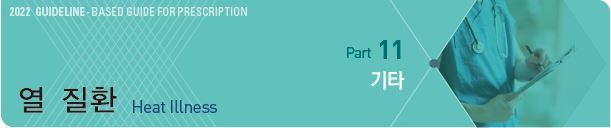
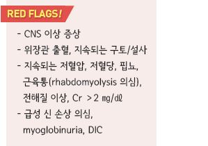
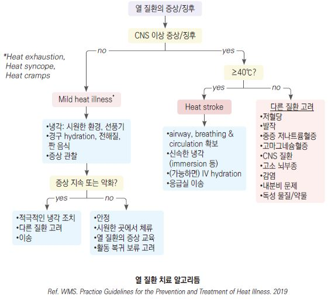

# 열 질환 Heat Illness

## 일반 사항
- 체온의 지나친 상승에 의해 발생하는 질병 상태

- 주로 너무 더운 환경에서의 운동 또는 작업에 의해 발생

- 초기에는 증상이 명확하지 않을 수 있으며 탈수가 진행되는 중에도 자각 증상이 없을 수 있음

- 직장 체온계 이외의 측정 방법은 부정확할 수 있음

- 운동 관련 열사병 : 심한 운동 또는 활동과 관련된 열사병

- 고전적 열사병(classic heat stroke) : 고령 또는 만성질환자에서 서서히 발생하는 열사병

>   ✽일사병은 sun stroke을 말함

#### 중증 열 손상의 위험 인자
- 고온, 고습, 공기 순환 저하 환경

- 고령, 신체 건강 저하, 낮은 활동 능력

- 비만(신체 크기 대비 체표 면적이 적음)

- 수분 또는 염분 고갈

- 무겁고 활동을 제약하는 의복

- 땀 조절 장애 질환 : 땀샘 기능 부전, anhidrosis

- 급성 열성 질환(감염)

- 만성 질환 : 소화기 질환, 조절되지 않는 당뇨/고혈압, 심장 질환

- 알코올 남용, 허브(예: 마황) 섭취

- 약물 : α-adrenergics, 항콜린제, 항히스타민제, 항정신병제,

    neuroleptics, phenothiazine, benzodiazepine, TCA, 이뇨제, β-차단제, CCB, clopidogrel, 하제, thyroid 작용제

- 과거 열 질환 병력

## 열 질환의 종류 및 치료
- 목표 체온 : 중심 체온 38.3℃~38.9℃; 냉각 조치는 ＜39℃가 되면 중지할 수 있음

- 직장 체온을 측정할 수 없는 중증에서는 환자가 shivering을 시작할 때까지 냉각 치료 지속

### 열부종 (Heat edema)
- 열에 처음 노출될 때 발생하는 손발의 가벼운 부종

#### 치료
- 특별한 치료 필요 없음; 적응(acclimation)으로 호전

- 하지 거상, 압박 스타킹

### 열경련 (Heat cramp)
- 열 손상의 가장 흔한 형태

- 가벼운 체온 상승, 경증의 탈수 &/or 염분 고갈

- 근육이 피로해지고 수분 및 염분 소실이 악화되는 운동 후반에 발생

- 치료 후 특별한 장애가 없으면 운동 복귀 가능

#### 증상
- 근육 경련 : 주로 종아리 및 hamstring, 복부에 발생

- 땀 흘림, 갈증, 피로, 가벼운 두통, 안면 홍조

#### 치료
- 가벼운 스트레칭

- 경구 수분 공급(isotonic or hypertonic fluid)

### 열강직 (Heat tetany)
- 열과 관련된 과호흡 및 이에 따른 손발 저림 또는 경련 발생

#### 치료
- 시원한 환경

- 과호흡에 대한 조치 : 천천히 호흡 또는 봉지 호흡

### 열탈진 (Heat exhaustion)
- 체온 ≤40℃

- CNS의 유의미한 기능 이상 없음

#### 증상
- 구역, 구토, 다량의 땀 흘림, 갈증, 중등증 이하의 탈수

- 힘없음, 두통, 어지럼, 창백, 빈맥, 털세움(piloerection), 협응 능력 저하

#### 치료
- 시원한 환경, 선풍기 사용

- 신체 노출 부위를 늘림, 필요 없는 의복은 제거

- 몸에 물 분무, 팔다리를 찬물에 담금, 사타구니/겨드랑이에 냉매 적용

- 수분 보충 : 환자가 물을 마실 수 없으면 IV 수액 공급

- 직장 체온 및 열사병 징후 모니터링

- 빨리 회복되지 않으면 응급실 이송

### 열사병 (Heat stroke)
- 체온 ＞40℃, 체온 조절 기능 부전 상태

- 적절히 치료되지 않으면 조직 손상 및 사망 가능

#### 증상
- 뜨겁고 건조한 피부

- vital sign 이상

- CNS 이상 : 의식 저하, 섬망, 발작, 경부 강직

- 다기관 부전 : 심장, 뇌, 간, 콩팥, 근육 부전

#### 치료
- 응급실 이송

- 전신을 찬물에 담금; 냉각 조치는 ＜39℃가 되면 중지할 수 있음

- 호흡, 순환, 중심 체온, CNS 상태 모니터링

- IV 수액 공급 : 생리 식염수 또는 전해질 액; 혈액량 및 체온 조절 능력이 회복될 때까지 공급(CVP 모니터링 고려)

** Cold water immersion에 대한 논란**

- 찬물에 몸을 담그면 말초혈관 수축이 발생할 수 있지만 신체를 냉각시키는 전도 및 대류 작용에 비하여 유의미한 영향은

    없음

- Ice water immersion은 환자에게 불편을 주지만 치명적인 상태를 벗어나기 위해 시행할 수 있으며 적절히 관리하는 경우

    환자에게 심각한 손상을 입히지는 않음

- 2019 WMS 치침에서는 heat stroke에서 찬물에 담그는 것을 최적의 냉각 방법으로 권고

## 검사
- 전해질 균형 및 말단 기관 손상 감별을 위한 검사 시행; 경증에서는 필요하지 않음

- U/A, 뇨 비중

- CBC, 전해질(Na, K, Cl, HCO3, Ca), BUN/Cr, 간 효소, 혈액 응고(PT, INR, aPTT), creatine kinase

- ECG

    

## 예방
- 외출 및 육체 활동은 하루 중 시원한 때를 선택

- 더운 날씨에 아침 10시부터 저녁 6시 사이에는 힘든 실외 활동을 피함

- 갑작스럽게 많은 양의 실외 활동을 하지 않음. 적응 과정을 거침

- 모자나 양산을 사용하여 직사광선을 피함

- 밝은색의 헐렁한, 소매가 넓은 옷을 입음

- 더운 환경에서의 헬멧 착용 활동을 피하며 헬멧을 쓰는 경우에는 자주 그늘에서 벗고 통풍시킴

- 더운 날씨에 실외 활동을 하는 경우에는 자주 휴식을 취함

- 실외 활동 중 및 활동 전후에 많은 양의 물을 마심

- 고령 및 만성질환자는 수분 섭취에 더욱 주의가 필요함

- 소변색이 진하면 수분이 부족한 상태이며 맑은 소변이 나올 때까지 15~20분마다 수분 섭취

- 실내라도 더운 곳에서 활동할 때는 갈증이 없더라도 물을 충분히 섭취

- 땀을 많이 흘리는 운동 시 매 20분마다 수분 섭취 : 체중 40 ㎏- 150 ㎖, 60 ㎏- 270 ㎖, ＞60 ㎏- 300~350 ㎖

- 1시간 이상 운동을 하는 경우 전해질 및 탄수화물이 포함된 음료를 섭취

- 소금 정제 : 고나트륨혈증 및 위 배출 지연을 일으킬 수 있으므로 사용을 제한

  •섭취 대상 : 재발성 열경련, 특별히 많은 땀 분비, 지속적인 운동(예: 마라톤 선수)

- 커피, 술 섭취는 삼가

- heat risk를 평가하기 위하여 wet-bulb globe temperature index(WBGT)가 유용함

>   ✽WBGT : 건습구 온도를 이용하여 계산하며 ‘폭염지수’ 등의 명칭으로 발표되고 있음

> **질병코드**
T67 열 및 빛의 영향
