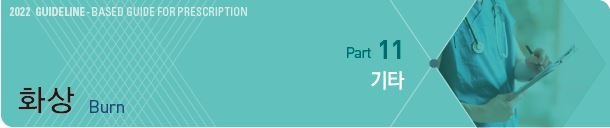
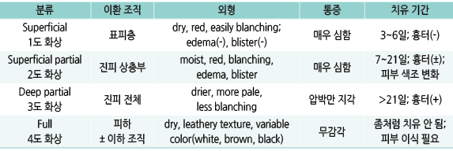
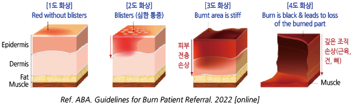
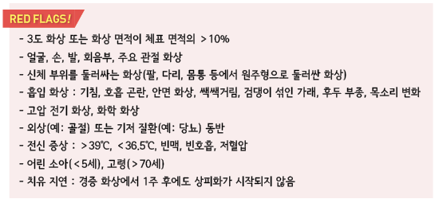
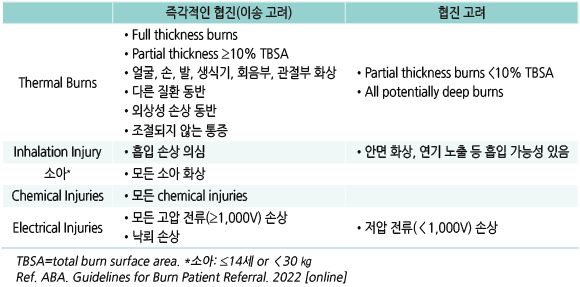
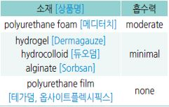

# 화상 Burn

## 일반 사항
- 열, 전기, 화학 물질 등에 의한 조직 손상

- ＞50℃ 수온에서 ＞3초 노출되면 화상이 발생할 수 있음

- 낮은 온도에서도 지속적인 노출 또는 압력이 가해지면 열에 의한 화상이 발생할 수 있음

- 초진료에서 바로 이송을 하는 경우에는 체온 유지에 유의하면서 마른 거즈 드레싱만 시행(국소제 도포 또는

    습윤 드레싱은 하지 않음)

- 화상 면적 측정 

  •[Rule of 9’s](https://www.who.int/surgery/publications/Burns_management.pdf)((https://www.who.int/surgery/publications/Burns_management.pdf))

 • palmar method : 한 손바닥 전체 크기를 전체 체표면적의 약 1%로 간주

### 합병증
- 감염 : 연조직염, 상처 패혈증

- 신경병증성 통증

- 관절 구축(특히 손)

- 흉터

> 분류 및 특징
  

    

  

감염 의심 소견

- Staphylococcus : 재상피화되었던 병변이 다시 악화됨(melting away)

- Pseudomonas : 청록색, 형광 황록색, 향긋한(과일 향) 냄새의 분비물

- Candida : 피부의 흰색 작은 농포

- Herpes simplex-1 : 치유된 피부의 2~3 ㎜ 천공성 구멍

---

## Management

### 첫 치료
 1. 의복 제거, 부종 발생에 대비하여 반지, 팔찌, 신체 장신구, 부착물 등 조이는 물건 제거 

 2. 냉각 : 미지근한(12~25℃) 생리 식염수로 15~30분간(저체온증 주의); 차가운 물(＜8℃)은 피함 

 3. 세척 : 미지근한 물 또는 식염수, 중성 비누 사용

 4. 수포 : 작은 수포(＜6 ㎜)는 보존; 터질 가능성이 많은 큰 수포나 관절 부위 수포는 제거나 흡인을 고려

 5. 국소 항균제 도포

 6. 드레싱; 수포가 터지면 괴사 조직 제거

 7. 진통제, 항생제, 항히스타민제 등 전신 치료제 및 백신 접종 고려

### 물 세척 시 유의 사항
- 건조한 석회가 묻은 병변 : 물과 Ca oxide가 반응하여 강한 알칼리 물질인 Ca hydroxide를 형성하므로 물 세척 전에

    충분히 털어 내며, 흐르는 물로 세척

- elemental metal : 일부 금속 성분(예: Na, K, Mg, P, Li, Ce, Ti)은 물에 닿으면 열을 만들거나 위해 성분을 발산하므로

    dry forcep으로 제거 후 mineral oil로 덮음

- phenol : 50% polyethylene glycol에 적신 스폰지로 제거; 페놀은 물에 녹지 않으며 희석된 페놀은 피부를 통하여 빠르게

    흡수되므로 물로 씻는 경우에는 흐르는 대량의 물을 사용해야 함

### 국소 항균제
- 2도 이상 화상에서 적용; 1도 화상에서는 필요 없음

- re-epithelialization 징후가 나타날 때는 chlorhexidine 외에는 적용 중지

- 눈 주위에는 안연고 적용

**Silver sulfadiazine**

- 장점 : broad-spectrum, 통증 감소, 습윤 유지, colonization 감소 [실마진]

- 단점 : 매일 드레싱 교체 및 교체 시 통증, eschar 침투 못함, 상피 재생 저해; 상처 치유 또는 세균 감염 감소에 대한 증거 부족

- 금기 : 눈 주위, 임신/수유, 신생아, sulfonamide 과민 환자

**Povidone-iodine **

- 장점 : 살균 작용 [베타딘 액]

- 단점 : 혈액 또는 혈청 단백이 존재하는 상처에서는 효과 저하; 세포 독성, 세포 증식 저해, 화학적 화상, 통증

- 금기 : 넓은 범위 사용, ＜2세, 임신/수유, 갑상선 질환

**Mupirocin, Bacitracin**

- 장점 : 그람양성균(MRSA 포함)에 유효

- 단점 : 매일 드레싱 교체 및 교체 시 통증

- 세균 감염 의심 시 고려; 습윤 유지를 목적으로 할 때는 크림 제제보다 연고제 선택 [에스로반]

**Mafenide**

- 장점 : broad-spectrum, Pseudomonas를 포함한 그람음성균에 유효, eschar 및 연골 침투

- 단점 : 2~3도 화상 도포 시 통증, 매일 드레싱 교체 및 교체 시 통증, 대사성 산증 가능성, 상피 재싱 저해 

- 중증 감염에서 고려 [메페드]

- 금기 : sulfonamide 과민 환자

**Chlorhexidine**

- 장점 : 약한 항균 작용; 상피 재생을 저해하지 않음 [헥시딘 액]

### 드레싱
- 물과 중성 비누를 이용하여 이전 드레싱 시 도포한 치료제 및 분비물을

    제거한 후 시행

- 드레싱 빈도 : 병소의 상태 및 드레싱 소재에 따라 1일 2회~1주 1회

  •지나치게 빈번한 드레싱 교체는 상처의 재상피화를 방해할 수 있음

  •습윤성 non-adherent 드레싱 제재 사용 시 상처의 깊이 및 흡습성에 따라

    드레싱 교체 없이 7~10일간 유지할 수 있음 (필요시 주 2회 병소 확인)

- 손/발가락은 피부끼리 닿지 않도록 분리하여 감쌈

- 작은 표재성 화상(특히 얼굴 병소)은 bacitracin을 도포하면서 개방하여 치료할 수 있음(보통 드레싱이 필요 없음)

- 표재성 화상 또는 물집이 유지되고 있는 경우에 피부에 닿는 면은 달라붙지 않는 소재를 선택

- 초기에는 삼출물을 흡수하는 제제를 적용하고 [메디터치], 삼출물이 줄어들면 비흡수성 제재를 적용 [듀오덤,

    테가덤/옵사이트 필름]

### 전신 치료제

#### 항생제
- 초기에는 상처 조직에 세균이 정착/증식하지 않기 때문에 필요 없음; 예방적 투여는 하지 않음

- 국소 감염, 연조직염 소견이 나타나는 경우 고려 (☞ p.901)

#### 진통제
- ibuprofen : 400~800 ㎎ tid [부루펜]

- acetaminophen : 650~1,300 ㎎ tid [타이레놀]

#### H1-항히스타민제
- 가려움 발생 시 고려; 수면 효과가 있는 1세대 제제가 보다 유효 (☞ p.1144)

- chlorpheniramine : 4 ㎎ q4~6hr, 최대 24 ㎎/d [페니라민]

- hydroxyzine : 25~50 ㎎ hs or 50~100 ㎎/d #3~4 [아디팜]

- diphenhydramine : 25~50 ㎎ q4~6hr, 최대 300 ㎎/d [디펙타민](비보험)

#### 위산 분비 억제제
- stress ulcer 예방을 위하여 고려

- H2 blocker, PPI (☞ p.377)

### 기타
- 파상풍 백신 : 기본 접종 일정을 완료하지 않았으면 시행 (☞ p.1113)

- 보습제 : 피부의 윤활 기능이 완전히 회복될 때까지 도포 (☞ p.867)

- 자외선 차단제 : 정상 피부색이 돌아올 때까지 도포. 가급적 SPF ≥30 선택 (☞ p.1084)

- 식이 : 고단백, 고칼로리

- 추적 관찰 : 완전한 재상피화 이후 4주마다 hypertrophic scar 형성 및 기능 장애 여부 관찰

- 손가락 구축 대처 : 손의 2도 이상의 화상 시 손가락을 신전시키는 드레싱, 손 신전 운동

- 가려움 : 날씨가 덥거나 활동을 많이 하거나 스트레스를 받으면 심해짐

  •항히스타민제 투여, 보습제 도포, 헐렁하고 부드러운 면 소재 옷 착용

## 가정에서의 화상 예방법
    [미국가정의학회 권고안]

- 햇빛에 노출될 때 피부 노출을 줄인다(예: 모자, 긴팔 옷, 긴 바지).

- 아이들이 만질 수 있는 콘센트에는 보호 덮개를 한다.

- 샤워하기 전에 목욕물 온도를 점검하고 목욕하는 동안 아이가 온수 수도꼭지를 만지지 않도록 한다.

    수온을 조절할 수 있다면 50℃ 이상으로 올라가지 않도록 설정한다.

- 조리 시 프라이팬이나 포트의 손잡이는 벽 쪽으로 돌려놓고 여러 개의 버너가 있는 레인지라면 뒤쪽 버너를 사용한다.

- 아이가 화기 근처에서 놀거나 화기 위에서 조리하는 것을 돕지 않게 한다.

- 열 가습기 사용을 삼가거나 아이의 손에 닿지 않는 곳에 설치한다.

- 햇빛 아래 주차할 때는 수건으로 카시트를 덮어 놓으며 햇빛에 노출되었던 차량에 아기를 앉힐 때는 시트나 안전벨트

    등이 뜨겁지 않은 지 확인한다.

- 화학 물질은 아이들의 손이 닿지 않는 곳에 보관한다.

> **질병코드**
T20~T32 화상 및 부식

