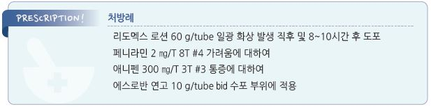

# 일광 화상 Sunburn

## 일반 사항
- 자연 또는 인공 자외선에 대한 과도한 노출에 의한 피부의 급성, 일시적 염증 반응

- 기전 : 각질 세포 손상, 세포 염증 반응

- 영향 : 화상, 피부색 검어짐(탄 피부), 각질층 비후, 다른 피부 질환(예: herpes simplex labialis, lupus erythematosus)의

    재발 및 악화

- 경과 : 심하지 않은 일광 화상은 자연 치유됨; 회복을 촉진하는 효과적인 치료법은 없음

- 합병증 : 장기적으로 피부 노화 촉진, senile elastosis, actinic keratosis, squamous & basal cell carcinoma, melanoma

    등의 유발 요인이 됨

### 위험 인자
- 멜라닌 색소가 적은 피부, 밝은 머리 색

- 높은 고도

- 약물(광과민 약제) : 항암제, 항우울제(amitriptyline, desipramine, doxepin, imipramine, trazodone),

    항생제(fluoroquinolone, pyrazinamide, sulfonamide, tetracyclines), 항기생충제(chloroquine, quinine),

    항정신병제(chlorpromazine, haloperidol), 이뇨제(amiloride, chlorothiazide, furosemide),

    항당뇨병제(glipizide, glyburide), NSAID, 항히스타민제(diphenhydramine),

    항고혈압제(diltiazem, enalapril, methyldopa, nifedipine), alprazolam, isotretinoin, 경구 피임제

### 자외선
- UVB(290~320 ㎚) : 지구 표면에 도달하는 자외선 양의 5% 차지; 유리창에 의해 대부분 차단 됨

  •작용 : 피부에서의 Vit D 합성; 일광 화상, 염증, 과다 색소 침착, 피부암 유발

- UVA(320~400 ㎚) : 자외선 양의 95% 차지

  •작용 : pigment darkening, 피부암 유발; 일광 화상 작용은 적음

  •UVA의 ¼을 차지하는 UVA2(320~340 ㎚)는 UVB와 비슷한 작용을 함

## 임상 양상

### 화상

#### 국소 증상
- 분홍색~붉은색의 통증성 물집±부종

- 경과 : 햇빛 노출 10~15분 후부터 염증 반응 시작

→ 3~4시간 후 피부 발적 발생 → 12~18(24)시간에 최고조

→ 72~96시간에 완화 → 1주 내 피부 벗겨짐 → 흉터 없이 자연 치유

- 물집이 발생하는 심한 경우에는 완화까지 1주 이상 소요

#### 전신 증상
- 발열, 구역, 두통

### 지연 멜라닌 형성 (Delayed melanogenesis)
- 탄 피부

- 기전 : 멜라닌 생성 증가 및 각질층으로의 이동(표피 내 멜라닌의 양이 증가됨)

- 경과 : 노출 후 2~3일째 발생 → 수 주간 지속

- 효과 : 자외선에 의한 피부 손상을 막음

---

## Management

### 치료 방침
- 통증, 가려움 등에 대한 대증 치료

- 합병증 발생 시 이에 대해 치료

## 비-약물 치료
- 냉찜질, 찬물 목욕

- 알로에 외용제, 칼라민 로션, 보습제 (☞ p.867)

- 수포 파열 시 중성/약산성 비누로 세척, wet dressing(예: 생리 식염수, petrolatum 거즈)

## 약물 치료
- 치유 기간 단축이나 피부 손상을 줄이는 효과는 없음

#### NSAID
- 효과 : 통증 감소, (노출 전/노출 중 투여 시) 약간의 홍반 감소

- ibuprofen : 400~800 ㎎ tid [부루펜]

#### 국소 Steroid
    (☞ p.1139)

- 효과 : 급성기에 사용 시 일시적 홍반 감소(혈관 수축 작용)

- 피부 발적이 최고조에 도달하기 전에 1~2회 도포 [리도멕스 로션]

#### H1-항히스타민제
    (☞ p.1144)

- 가려움 발생 시 고려; 수면 효과가 있는 1세대 제제가 보다 유효

- chlorpheniramine : 4 ㎎ q4~6hr, 최대 24 ㎎/d [페니라민]

- hydroxyzine : 25~50 ㎎ hs or 50~100 ㎎/d #3~4 [아디팜]

#### 국소 항생제
    (☞ p.1079)

- 수포 파열 시 고려

- silver sulfadiazine [실마진], mupirocin 2% [에스로반]

## 예방
- 일광(자외선) 노출 시간을 줄임; 오전 10시~오후 4시까지의 야외 활동을 피함

- 긴 옷(두껍고 촘촘히 직조된 어두운색의 면직물), 모자, 양산 사용 등으로 햇빛 노출을 줄임

>   ✽전체 하늘의 옅은 구름 낀 날의 자외선 감소 효과- 50%; 그늘, 양산의 자외선 감소 효과- 70%
- 자외선 차단제 사용

### 자외선 차단제 (Sunscreen agent)
- 자외선 차단제가 모든 유해한 자외선을 차단할 수는 없음

- 광과민 환자들은 UVB 및 UVA 모두 차단하는 것이 필요

- 피부 과민 반응 주의 : 자외선 차단제에 대한 알레르기 반응이 있을 수 있으므로 피부 일부분에 시험 사용 후 전신 도포

#### SPF (Sun protection factor)
- 정의 : ‘자외선 차단제를 사용하지 않았을 때의 햇빛 노출 시 피부 발적 발생 소요 시간’[분모] 대비 ‘도포 후 햇빛 노출 시

    피부 발적 발생 소요 시간’[분자]

- UVB에 대한 값으로 숫자가 높을수록 UVB 차단 효과가 우수(UVA에 대한 기준은 아직 없음)

- SPF 30 : 일반적인 피부 보호에 필요한 수준

- SPF 15 : 체모가 있는 피부를 보호할 수 있는 수준

#### 종류 및 성분
** 화학적 차단제 (Chemical absorber)**

- 선택적으로 자외선 파장을 흡수하여 열의 형태로 방출; 대부분의 시판 차단제가 해당

- UVB 차단 제제 : 알코올 함유 para-aminobenzoic acid(PABA), PABA ester, cinnamate

- UVA 및 UVB 차단 제제 : benzophenone, avobenzone

- UVA 차단 제제 : ecamsule

** 물리적 차단제 (Physical filter)**

- 태양 광선을 거울과 같이 반사시키거나 산란시키는 제제; UV 및 가시광선의 모든 파장에 작용

- 과민 반응을 잘 일으키지 않음; 소아용 또는 chemical-free 제품이 해당

- zinc oxide, titanium dioxide

** 안정화제 (Stabilizer)**

- 안정화 작용으로 자외선 차단제의 작용 시간을 연장시킴

- octocrylene, diethyl 2,6-naphthalate

#### 선택 방법
- 가급적 SPF ≥30(최소 15)의 광범위 차단제(UVA 및 UVB 차단 성분 복합제) 선택

- 땀 흘림, 수영 등 상황에 따라 선택 : 물에 들어가는 경우 water resistant 제품 선택

>   ✽물 접촉 또는 땀을 흘리는 상태에서 ‘water-resistant’는 40분, ‘very water-resistant’는 80분 이상 유지
- 영아 : ＜6개월 연령은 햇빛에 대한 직접적 노출을 피하며 불가피한 경우 SPF ≥15의 물리적 차단제를 적은 범위에 도포

  •oil based emulsion이 약간의 물리적 차단제 역할을 할 수 있음 (zinc oxide [보소미](비보험))

#### 도포량
- 체중 70 ㎏의 성인이 수영복을 입은 경우 전신 도포에 30~45 ㎖ 필요

- 트렁크 수영복을 입은 상태에서의 차단제 도포 예 (teaspoon rule) : 얼굴/목 1 ts(5 ㎖), 몸통 앞/뒤 각 1 ts,

    상지 좌/우 각 1 ts, 하지 좌/우 각 2 ts

> ✽일반적으로 필요량의 ½만을 도포하고 있으며 이때의 자외선 차단 효과는 표시된 SPF의 ⅓ 수준이 됨

#### 도포 방법
- 노출 15~30분 전 도포(진피까지 스며드는데 시간이 필요함) → 2~3시간마다 다시 도포

- 수영을 하는 경우에는 물에 들어갔다 나와서 다시 도포

> **질병코드**
L55 일광화상

