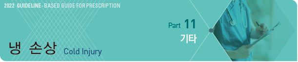
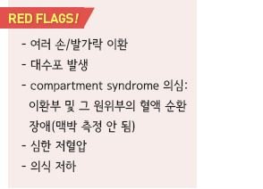
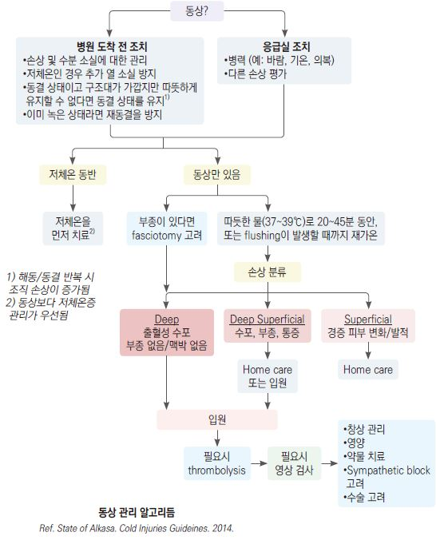
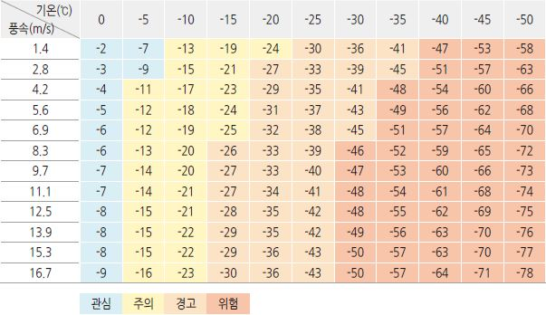
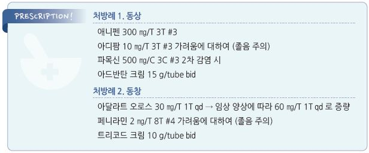

# 냉 손상 Cold Injury



## ￭ 동상 Frostbite

## 일반 사항

* Frostbite : 추위 노출에 의한 조직 동결 및 혈색 순환 감소와 관련되어 발생하는 조직 손상
* Frostnip : frostbite와 유사하나 따듯하게 하면 조직 손상 없이 10분 내 회복; 이상 감각, 창백
* 호발 부위 : 손, 발, 얼굴(특히 귀) 등 말단부

### 동상 분류 \[Wilderness Medical Society]

* 1st-degree : 물집(-); 이상 감각(둔감, 저림, 따끔거림), 창백, 발적, 팽진, 부종. 피부 벗겨짐
* 2nd-degree : superficial 수포성 물집, 발적, 부종
* 3rd-degree : deep 출혈성 물집, 진피 및 vascular plexus 이환
* 4th-degree : 진피 및 피하 조직 이환, 괴사

> ✽표재성=1도 & 2도, 심재성=3도 & 4도

## 원인

* 낮은 온도, 습기 및 바람에 의한 냉각
* 압박 등에 의한 혈액 순환 장애

### 위험 인자

* 영아, 고령
* 마른 체형
* 수분 섭취 부족 또는 탈수
* 칼로리 섭취 부족(＜1,500 ㎉/d)
* 탈진
* 음주, 흡연(nicotine)
* 레이노병, 심장/말초혈관 질환
* 당뇨병, 갑상선저하증
* 파킨슨병, 뇌졸중, 치매, 말초신경병증
* 천식, COPD
* 약물 : 항고혈압제, 이뇨제, benzodiazepine, norcotics, TCA, insulin
* 이전의 추위 관련 손상 병력

## 임상 양상

* 차갑고 무감각한 피부
* 단단하거나 매끄러운 느낌
* 피부색 변화 : 흰색 또는 회색, 심한 경우 어두운색
* 물집(체액 또는 혈액)
* 움직임 장애(예: 불편한 손가락 움직임)

## 진단

* ECG : 저체온증, 서맥 등 심장 박동 이상이 있는 경우 시행
* CBC, 포괄적 대사/전해질 검사, UA
* 골스캔(Tc-99m) : 이환 조직의 생존 능력 감별, 혈전 용해 치료 여부 결정에 도움; rewarming 후

cyanosis 또는 blister가 있으면 시행 권고

***

## Management

### 치료 방침

1. 가능한 한 빨리 따듯한 장소로 이동; 다시 어는 것과 외상으로부터 보호
2. 이환된 부위의 외부 물건(예: 장신구, 부착물) 제거, 젖은 옷 및 신발 제거
3. 따듯한 물(37\~39℃를 유지)로 신속히 가온
4. ibuprofen 12 ㎎/㎏/d #2 투여
5. 필요시 진통제(예: opiate) 투여, 필요시 파상풍 백신 투여
6. air drying (문지르지 않음)
7. 드레싱 : 선택적 수포 needle aspiration(혈성 수포는 보존), dry/bulky dressing
8. 부종을 줄이기 위하여 환부를 심장보다 높게 위치시킴
9. systemic hydration(경구 또는 IV 수액)
10. 필요시 혈전 용해술, 수술 치료



## 비-약물 치료

#### 가온/해동

*   이환된 부위가 부드러워 질 때까지 37\~39℃의 따듯한 물(정상 신체를 담갔을 때 편안하게 따듯한 정도)에 담가 신속히 가온

    •동상 자체는 감염이 아니지만 항균제(예: povidone \[베타딘 액], chlorhexidine \[헥시딘 액])를 물에 첨가하는 것이 이로울 수

    있음(근거는 부족함)
* 귀의 경우는 온수를 적신 거즈로 감싸 보온; 15\~60분간 또는 피부색이 붉어질 때까지
* 도구가 없는 경우에는 치료자의 체온으로 보온(예: 치료자의 겨드랑이에 환자의 손을 넣음)

#### 드레싱

* dry, bulky dressing(이환부 보호를 위하여 두껍게 시행)
* 부종 악화에 대비하고 압박되지 않도록 느슨하게 시행
* 수포에 대하여 선택적으로(예: 터질 가능성이 높은 경우) needle aspiration; 혈성 수포는 남겨 둠
* 드레싱 시 6시간마다 알로에 겔/크림 적용

#### 회피

* 하지 이환 시 확실하게 치료될 때까지 보행 회피; 불가피한 경우 패딩 및 부목 사용
* 다시 얼 수 있는 환경에서는 녹이지 않음(해동/동결 반복 시 얼음 입자가 녹으면서 내피가 손상됨)
* 환부 마시지 또는 문지름 금지
* 난로나 불에 의한 뜨거운 가열 금지(둔한 피부 감각 때문에 화상 사고 유발 위험이 있음)

## 약물 치료

### Ibuprofen

*   혈관 수축, 피부 허혈을 유발하는 arachidonic acid pathway 차단 및 prostaglandin, thromboxane 감소 작용을 기대하지만

    이득에 대한 명확한 증거는 없음
* 400\~800 ㎎ tid \[부루펜]

### 파상풍 예방 주사

* 필요시 접종 (☞ p.1113)

### 항생제

```
(☞ p.901)
```

* 2차 감염이 있는 경우 고려; 예방적 투여는 권하지 않음
* amoxicillin : 500\~875 ㎎ bid \[파목신]
* cephalexin : 500 ㎎ bid \[팔렉신]

### 가려움 및 부종 관리

#### 경구 H1-항히스타민제

```
(☞ p.1144)
```

* 수면 효과가 있는 1세대 제제가 보다 유효
* chlorpheniramine : 4 ㎎ q4\~6hr, 최대 24 ㎎/d \[페니라민]
* hydroxyzine : 25~~50 ㎎ hs or 50~~100 ㎎/d #3\~4 \[아디팜]

#### 국소 Steroid

```
(☞ p.1139)
```

* 중/고역가 steroid : methylprednisolone \[아드반탄 크림], diflorasone \[디프라 크림]

### 기타

* systemic hydration
* 진통제 : 필요시 투여; ibuprofen \[부루펜], acetaminophen \[타이레놀]
* thrombolytic therapy : 손발가락의 깊은 동상에 대하여 해동 후 24시간 내 고려
* iloprost therapy : 손발가락의 깊은 동상에 대하여 손상 후 48시간 내 고려
* 필요시 검사(예: angiography, technetium TC-99 bone scan) 및 수술(예: fasciotomy) 고려

### 대체 요법

* Vit C, 항산화제, 국소 알로에 : 일부에서 효과
*   고춧가루(capsicum), 포플러 싹(populus), 금잔화(calendula), 카밀레(matricaria recutita), 쇠뜨기(equisetum arvense) :

    도움이 된다는 보고가 있음

## 예방

* maintaining peripheral perfusion, exercise, protection from cold

#### Local tissue perfusion

* 적절한 수분 보충, 체온 유지
* 관류를 줄이는 인자 최소화 : 금연, 금주, 약물 주의, 기저 질환 관리(예: 당뇨병)
* 두피를 포함한 피부를 덮어 추위로부터 보호
* 혈류 압박 회피 : immobility 회피, 조이는 신발 또는 의류 회피
* 적절한 영양 섭취
* 심한 저산소 환경 시 산소 공급

#### Exercise

* 적절한 활동과 운동으로 peripheral perfusion 및 core temperature 상승
* 탈진, 땀, 스트레스는 냉 손상을 악화시킬 수 있음

#### 추위로부터의 protection

* 동상에 걸릴 수 있는 환경을 피함
* 바람, 외부 습기 차단; 모자/ski mask/선글라스/고글 등으로 노출 부위를 최소화
*   차가운 금속 접촉 또는 착용 회피

    •차가운 물건(예: ice pack) 사용 시 직접 접촉 차단(예: 수건 사용)
* 땀을 흘리거나 젖는 것을 피함
*   장갑(특히 벙어리장갑), 방수 신발, 여러 겹의 옷 착용; 혈액 순환을 위하여 약간 헐렁하게 유지

    •안쪽에는 polypropylene or polyester(습기를 배출하고 열을 보존함); 중간층으로 모직 or 털; 외피는 습기를 배출하는

    소재 선호

    •양말은 매일 또는 젖으면 갈아 신음
* 손/발 온열 도구 사용(화상 주의)
* 말단부 뿐 아니라 몸통 보온에도 유념
* 환경 변화 인지에 장애를 주는 행동 또는 상황(예: 음주, 저산소증)을 피함
*   규칙적으로 동상 증상 발생 여부를 확인

    •초기 이상 증상 : 사지 말단의 감각 둔해짐, 움직임 불편, 창백해짐
* 추위에 노출되는 시간을 최소화함; 찬 곳에서 작업 시 규칙적으로 따듯한 곳에서 가온, 쉬는 동안 따듯한 곳으로 이동

### 체감온도 산출표 (Wind chill chart)

> ```
> (Ref. 기상청)
> ```



■ 동창 Pernio, Chilblains

## 일반 사항

* 얼지 않는 수준의 저온(＜15℃)에 대한 지속적 노출로 발생하는 cold-induced erythrocyanotic skin lesion
*   경과 : 저온 노출 12~~24시간에 시작되고 따듯한 환경에서 1~~3주 내 회복; 더운 계절까지 수 주 이상 지속될 수 있음;

    흉터 발생 가능
* 재발 : 저온 노출 또는 추운 계절에 재발할 수 있음
* 호발 부위 : 손발가락(특히 dorsum), 코, 귀, 종아리, 허벅지, 엉덩이

## 원인

* 불명
*   추정 기전 : 추위 노출에 대한 비정상적인 혈관 반응 → hypoxemia → 염증 반응 → 피부 병변

    •자가 항체 관련 microvasculature의 endothelial damage 또는 hyperviscosity

### 위험 인자

* 습한 상태
* BMI ＜25, 젊은 여성
* 전신 질환 : 혈액 질환, 간염, 자가면역 질환(SLE), 암

## 임상 양상

* 보통 대칭적 발생
* 가려움, 작열감, 통증/압통
* 피부 병소 : 붉은색\~보라색 반점, 구진, 판, 결절; 심하면 수포, 궤양

## 진단

* 추운 계절에 추위 노출 후 발생하여 따듯해지면 호전되는 특징적 피부 증상으로 진단
* 진단 검사 방법은 없음; 필요시 피부 조직 검사
* 다른 질환 감별을 위한 검사 : CBC, s-protein electrophoresis, antinuclear Ab, RF, antiphospholipid Ab, cryoglobulin

### 감별

#### Cold panniculitis

* 직접적인 추위 노출에 따른 지방층의 염증
* 국소 증상 : 노출 부위에 발생한 홍반성 경결성 판(plaque) → 수 주 내 호전
* 호발 부위 : 영아\~어린 소아의 뺨, 턱
* 유발 검사 : 얼음 조각 접촉 시 재현

#### 레이노병 (Raynaud’s Dz)

* 추위 또는 감정 자극에 대한 손가락 또는 피부 동맥에서의 지나친 혈관 수축 반응
* 15\~20분에 걸친 일시적인 피부색 변화; 선명한 경계의 창백 → 청색 → 붉은색
* 동창에서 발생하는 구진/판/결절은 없음
*   위험 인자 : 가족력, estrogen 치료 여성, 한랭 노출/동상 병력, 교원혈관병 질환자, 혈관수축제 복용(예: β-차단제,

    암페타민, 충혈완화제, 카페인)

#### Cryoglobulinemia, Cryofibrinogenemia

– 혈관 폐쇄에 의한 손발가락 말단의 자반증, 피부 괴사

***

## Management

```
(☞ p.1088)
```

## 비-약물 치료

*   서서히 가온 (빠른 rewarming은 피함)

    •rewarming은 염증 반응을 일으키고 thrombosis 및 reperfusion 손상을 증가시킬 수 있음; refreeze 시 이 과정이 더

    악화될 수 있음
* 긁지 않도록 주의
* 드레싱 : 물집 및 궤양에 대하여 적용

## 약물 치료

* 효과에 대한 입증은 불충분함
* DHP-CCB : 혈액 순환 도모; nifedipine \[아달라트 오로스]
* 항히스타민제 : 가려움에 대하여 고려
* 중/고역가 국소 steroid : 가려움 완화 및 빠른 치유 도모

## 예방

* 추위에 노출되지 않도록 보호
* 금연

> **질병코드** T33\~T35 동상

T69.1 동창


