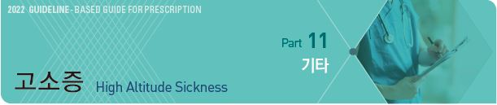
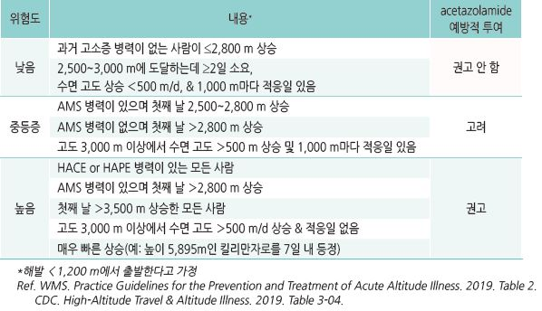
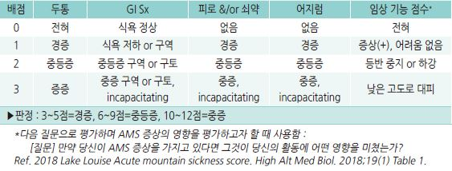
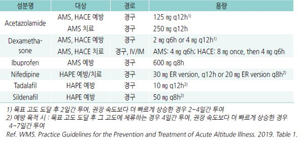
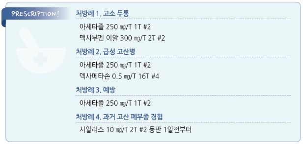

# 고소증 High Altitude Sickness

### 

## 일반 사항
- 갑작스런 고도 상승에 따른 저산소증에 의한 뇌혈관 이상 증상

>   ✽해발 3,000 m의 흡입 PO2는 해수면의 69%임
- 빈도 : 해발 2,500 m 이상의 고도에서 비-상주인구의 20%에서 발생

- 증상 : 두통, 어지럼, 식욕 저하, 구역, 구토, 피로, 쇠약, 수면 장애

- 저산소 스트레스의 정도는 고도, 상승 속도, 노출 기간에 영향을 받음

- 평소 체력, 당뇨병, 고혈압, 관상동맥병, 경증 폐쇄성 폐질환, 임신 등은 고소증과 무관한 것으로 알려짐

## 원인 및 위험 인자
- 격렬한 신체 활동

- 고소증 병력, 심폐 질환(예: 관상동맥병, 폐동맥고혈압)

- 낮은 고도 거주(해발 ＜900 m)

- 젊은 연령(＜40세)

- 음주, 수면제/안정제 사용

- 비만

    

## 종류 및 특징

### 순화 (Acclimation)
- 증상 : 운동 호흡 곤란, 호흡수 증가, 다뇨, 말초 부종, 불면

### 고소 두통 (High altitude headache)
- 다음 중 ≥2개 해당되는 새로이 발생한 두통

  ① 2,500 m 이상의 고도 증가와 관련되어 일시적으로 발생

  ② 고도가 계속 상승하면 악화 &/or 2,500 m 아래로 내려가면 24시간 내 완화

  ③ 다음 중 ≥2개 포함 : 양측, 경증~중등증, 활동/움직임/힘쓰기/기침/구부림에 의해 악화

### 급성 고산병 (Acute mountain sickness, AMS)
- 2,500 m 이상 고도가 상승한 지 12시간 내 새로운 두통 발생

- 증상 : 식욕 부진, 구역/구토, 피로, 무기력, 어지럼, 불면

- 보통 12~48시간의 적응으로 해결됨

** Lake Louise AMS score**

- 고산병 중증도 평가 방법

- 여행에 따른 혼란이나 급성 저산소증 반응(예: vagal response)과의 혼동을 피하기 위해 등반 6시간 후 시행

    

고소 뇌부종 (High altitude cerebral edema, HACE)

- 보통 3,000~3,500 m 이상에서 급성 고산병, 고소 폐부종이 있는 상태에서 발생

- 증상 : 조화운동불능(ataxic gait), 심한 무기력, 인지 기능 저하, 의식 저하

- 조치 : 즉시 하강

### 고소 폐부종 (High altitude pulmonary edema, HAPE)
- 병인 : 저산소증에 의한 폐혈관 이상

- ＞4,270 m에서 최대 100명 중 1명 발생

- 다음 각 목록에서 각각 ≥2개의 증상이 존재

  ① 휴식 시 호흡 곤란, 기침, 무기력, 활동 능력 감소, 가슴 조임감 또는 울혈감

  ② 쌕쌕거림, 수포음, 빈맥, 중심 청색증

- 조치 : 산소 투여, 즉시 하강

---

## Management

### 예방 및 치료 약물
    

## 고소 진단별 치료
- 하강을 권고

- 약물 치료를 하는 경우 증상 호전 후 24시간 추가 투여

- AMS, HACE에서 dexamethasone을 적용할 수 있으며 총 투여 기간은 ＜7일으로 제한

### 고소 두통
- 산소 공급 : 1~2 L/분(nasal cannula)

- ibuprofen : 400~800 ㎎ tid [부루펜]

- acetaminophen : 650~1,300 ㎎ tid [타이레놀]

- acetazolamide : 125 ㎎ bid [아세타졸] (보험주의)

  •작용 : carbonic anhydrase 활성 감소 → 체내 수분 축적 감소

  •부작용 : 일시적 미각 변화, 빈뇨, 손발 감각 변화, 구역, 졸음, 시야 흐림

  •sulfa allergy를 일으키지는 않지만 사전 확인이 필요(sulfa 알레르기 시 금지)

### 급성 고산병 (AMS)

#### 경증
- Lake Louise Score ≤5

- 증상 호전까지 힘든 활동 제한, 추가 고도 상승은 피함, 호흡 억제제(진정제) 사용

- 두통/구역에 대한 대증 치료 : 진통제, 항구토제 (☞ p.370)

- acetazolamide : 125~250 ㎎ q12h

- dexamethasone : 2~4 ㎎ q6h [덱사메타손 정], [덱타손 주]

#### 중등증~중증
- 증상 호전까지 상승 중지 및 안정

- 하강 : 치료 24시간 내 반응하지 않으면 즉시 최소 500 m 또는 증상이 없어지는 고도로 하강

- 산소 공급 : 1~2 L/분

- dexamethasone : 4 ㎎ q6h

- acetazolamide : 125~250 ㎎ q12h

- inhaled budesonide : AMS를 막지는 못하지만 심박수를 줄이고 SPO2를 높여 줌 [풀미코트}

### 고소 뇌부종 (HACE)
- 하강 : 즉시 최소 1,000 m 하강

- dexamethasone : 8 ㎎ PO/IM/IV 1회, 이후 4 ㎎ q6h

- acetazolamide : 250 ㎎ q12h

### 고소 폐부종 (HAPE)
- 활동 제한 : 침상 안정

- 산소 공급 : 4~6 L/분

- 하강 : 호전되지 않거나 중증이면 최소 500 m 하강

- nifedipine : 10 ㎎ 1회 [니페디핀] → 30 ㎎ 서방형 q12~24h [아달라트 오로스]

- tadalafil : 10 ㎎ q12h [시알리스](비보험)

- sildenafil : 50 ㎎ q8h [비아그라](비보험)

>   ✽2019 WMS 지침에서는 HAPE 치료에 salmeterol, acetazolamide, dexamethasone을 권고하지 않음

### HAPE 및 HACE 병발
- 즉시 하강 및 산소 공급

- dexamethasone : 8 ㎎ PO/IM/IV 1회, 이후 4 ㎎ q6h

- 고소 폐부종 치료

## 예방

### 적응
- 등반 전 1달 내(여행 출발일과 가까울수록 좋음)에 높은 고도에 대한 적응 훈련을 ≥2일 시행

- 등반 처음 며칠 동안 힘든 신체 활동 자제

- 적응이 될 때까지(최소 2일) 호흡 저하를 일으킬 수 있는 약물(예: 수면제, 술) 회피

- 서서히 상승 : 높은 고도에 대한 급성 적응 과정에는 3~5일이 소요되므로 높은 고도로 올라가기 전에 2,500~2,750 m에서

    수일간 적응하도록 함. 특히 수면 고도를 서서히 높임

  •1,500 m 이하에 있는 경우 하루 동안 2,500 m 이상으로 수면 고도를 높이지 않음

  •2,750 m 이상이면 수면 고도를 1일 500 m 이내로 올리고 1,000 m 상승마다 휴식일을 가짐

- 낮에 올라갔던 고도보다 낮은 고도로 내려가서 수면

- 2,500 m 이상으로 빠르게 상승한 경우에는 가볍게 활동; 최소 48시간 동안 힘든 활동을 피함

- 고소 증상이 나타나면 상승 중지

- 적응 과정으로 고소 증상을 예방할 수 있지만 운동 능력은 여전히 감소되어 있음을 주의

- 카페인 : 카페인은 고소증을 일으키지 않으며 평소 규칙적으로 섭취하는 사람이 섭취를 중단할 경우 급성 고산병 유사

    증상을 일으킬 수 있으므로 중단하지 않음

### 예방적 약물 요법
- 대상 : 과거 고소증 증상이 있었던 사람이 2,500 m 이상 올라가는 경우, 저고도 지역에 살던 사람이 곧바로 2,800 m

    이상으로 올라가는 경우

- acetazolamide : AMS 위험이 중등증 이상인 경우 권고; dexamethasone으로 대체할 수 있으며, 알레르기 등으로 이들을

    사용할 수 없는 경우에는 ibuprofen을 고려

- nifedipine : HAPE 위험이 있는 경우 권고

#### AMS 또는 HACE 예방
- acetazolamide : 125 ㎎ bid or 취침 시 [아세타졸]; sulfa anaphylaxis, Pc allergy 병력 시 금지

  •등반 시작 1~2일 전부터 목표 고도 도달 후 2~4일간 지속; 목표 고도 도달 후 즉시 하강하는 경우에는 하강을 시작하면서

    투여를 중단할 수 있음

- dexamethasone : 2 ㎎ q6h 또는 4 ㎎ q12h [덱사메타손]

  •상승 중 고도에 적응하기 전에 dexamethasone 투여를 중지하면 가벼운 반동현상이 나타날 수 있으므로 상승 중에는

    acetazolamide를 AMS 예방 목적으로 투여하고, 하강 중에 dexamethasone을 보조 치료제로 고려할 수 있음

- ibuprofen : 600 ㎎ tid (AMS 예방) [부루펜]

#### HAPE 예방
- 과거 고산 폐부종을 경험한 경우 등반 1일 전부터 투여

- nifedipine : 20 ㎎ 서방형 q8h [아달라트 오로스]

- tadalafil : 10 ㎎ q12h [시알리스](비보험)

- sildenafil : 50 ㎎ q8h [비아그라](비보험)

- dexamethasone : 8 ㎎ q12h

>   ✽2019 WMS 지침에서는 HAPE 예방에 salmeterol, acetazolamide를 권고하지 않음. 단, acetazolamide는 HAPE 병력이 있는

>     환자에서는 고려할 수 있음

## 비행기 여행 유의 사항

#### 심혈관 환자의 비행기 여행 준비
- 충분한 양의 약제 및 sublingual nitroglycerin을 준비. 약제 일부는 휴대; 사용의 편의성 및 분실에 대비하여 가방을

    분리하여 보관

- 처방전을 의약품과 별도로 보관

- 시차가 큰 경우는 미리 복용 시간을 조절함

- 최근의 ECG 기록을 휴대

- 필요한 경우 특별 기내식을 요청

- 좌석에서 다리를 움직일 수 있도록 가능하면 앞 좌석 아래에 짐을 두지 않음

- 비행 중 일정한 간격으로 다리 운동 : 자주 발목의 강한 신전-굴곡 운동, 1시간마다 보행

- 자주 자세를 변경하며 쭈구린 자세로 수면하지 않음

- 수면제/안정제 사용 회피

- 비행 전 및 비행 중 적절한 수분 섭취. 음주 금지

- 심부정맥혈전증의 위험이 있는 경우 압박 스타킹 착용을 고려

#### 비행기 여행 금기 심질환
- 2~3주 내 uncomplicated MI, 6주 내 complicated MI

- 조절되지 않는 고혈압

- 10~14일 내 심장 우회술

- 2주 내 뇌혈관 사고

- unstable angina

- 조절되지 않는 심실성/심실상성 부정맥

- 심한 심부전

- 증상이 있는 심장 판막 질환

- Eisenmenger’s syndrome, 폐동맥고혈압

> **질병코드**
T70.2 고지의 기타 및 상세불명의 영향

