# 예방접종 Vaccination

**
**

**예방접종 일정표**

☞ [질병관리청] [예방접종도우미](https://nip.kdca.go.kr/irhp/index.jsp)-예방접종 길잡이-[표준 예방접종 일정표](https://nip.kdca.go.kr/irhp/infm/goVcntInfo.do?menuLv=1&menuCd=115)

☞ [CDC]  [≥19세](https://www.cdc.gov/vaccines/schedules/hcp/imz/adult.html) / [≤18세](https://www.cdc.gov/vaccines/schedules/hcp/imz/child-adolescent.html)

### ■ 일반 사항

## 제조 방법에 따른 백신의 분류

### 약독화 생백신 (Live attenuated vaccine)
- 제조 방식 : 병원체를 실험실에서 변형-‘약독화’; 접종 후 체내에서 증식되고 면역력이 생성됨

- 장점 : 소량 접종으로 불활성화 백신보다 강한 효과

- 단점 : 드물게 감염을 일으킬 수 있음(면역저하자); 병원체를 손상시킬 수 있는 조건(예: 백신의 햇빛, 열 노출), 병원체의

    체내 증식에 영향을 주는 상태(예: 모체로부터 받은 항체, 면역 글로불린 투여) 등에 영향을 받음

- 종류 : BCG, MMR, 수두, 대상포진, 황열, 일본뇌염 생백신, 인플루엔자(비강 투여용), 경구용 로타바이러스

### 불활성화 백신 (Inactivated vaccine)
- 제조 방식 : 병원체를 배양하여 열이나 화학 약품(주로 포르말린)으로 ‘불활성화’ 시키거나, 병원체에서 백신에 포함시킬

    성분만을 ‘분획화’하여 제조

- 장점 : 감염증을 유발하지 않음, 혈중 항체에 의한 영향을 적게 받음

- 단점 : 면역력이 생백신보다 약함, 시간 경과에 따라 효과 감소, 재접종이 필요

- 종류 : 디프테리아, 백일해, 파상풍, 폴리오(IPV), A형간염, B형간염, 폐렴구균, 수막구균, b형 헤모필루스 인플루엔자(Hib),

    인플루엔자, 사람유두종바이러스, 공수병, 탄저균, 주사용 장티푸스균

### 증강 백신
- 백신의 면역원성이 증가하도록 도와주는 ‘면역증강제(adjuvant)’를 첨가한 백신

- 항체 형성률이 낮고 유지 기간이 짧은 고령자에서 보다 강한 백신 효과를 얻기 위하여, 또는 단기간에 보다 많은 양의 백신을

    생산하기 위하여 사용

- 면역증강제가 근육 밖으로 주입되면 통증, 부종, 발적 등 국소 반응이 증가함

## 접종 부위 및 방법

#### 근육 주사
- 방법 : 22~25 G 주사바늘 사용, 90o 각도로 삽입

- 연령별 주사 부위 및 주사바늘 선택

  •생후 ＜12개월 : 대퇴부 전외측에 주사, ⅝ inch(16 ㎜) 바늘

  •생후 12개월~2세 : 대퇴부 전외측, 1 inch(25 ㎜) 또는 삼각근, ⅝ inch(16 ㎜)

  •3~18세 : 삼각근, ⅝~1 inch(16~25 ㎜)

  •≥19세 : 삼각근, ＜60 ㎏ ⅝ inch(16 ㎜), 60~70 ㎏ 1 inch(25 ㎜), ＞70 ㎏ 1~1.5 inch(25~38 ㎜)

- 긴 길이의 바늘을 사용해서 근육의 깊은 부위에 주사하면 국소 발적 및 부종이 줄어 듦

- 흡인 : 권고 접종 부위에는 큰 혈관이 없으므로 접종 시 흡인이 필요 없음

- 예방접종 후 문지르지 않으며 마른 솜이나 거즈로 수 초 동안 가볍게 누름. 반창고 사용 가능

#### 피하주사
- 부위 : ＜12개월 연령- 대퇴부 외측(또는 삼두근); ≥12개월 연령- 상완 외측 삼두근 상부

- 방법 : 23~25 G, ⅝ inch(16 ㎜), 45o 각도로 삽입

#### 피내주사
- 부위 : 상완 삼각근 진피층 내 접종

- 방법 : 25~27 G 주사바늘 사용, 전완의 장축과 평행하게 표피에 삽입; 주사액이 5~7 ㎜의 피부 융기를 만들도록 하며

    접종 후 접종 부위를 덮거나 싸지 않음

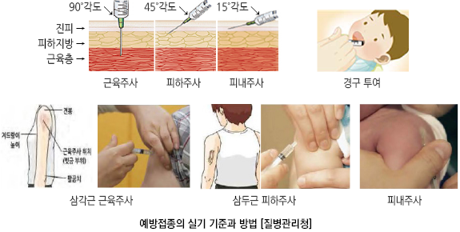    

이상 반응

    ✽이상 반응 보고 : [예방접종도우미](https://nip.kdca.go.kr/irgd/information.do?MnLv1=2&MnLv2=5) 

### 국소 이상 반응
- 빈도 : ~80%

- 증상 : 주사 부위의 경미한 통증, 부종, 발적

  •중증은 주로 고농도 항체에 기인하는 과민 반응임(예: 파상풍 및 디프테리아 톡소이드)

- 호발 : 불활성화 백신, 면역증강제 포함 백신

- 경과 : 접종 후 수 시간 내에 발생, 대부분 자연 호전

- 치료법 : 접종 부위 냉찜질, 진통제, 항소양제

### 전신 이상 반응
- 증상 : 보통 경미한 비특이적 발열, malaise, 근육통, 두통, 식욕 감소

- 호발 : 생백신

- 경과 : 접종 7~21일(백신 바이러스 잠복기에 해당) 후 발생

- 치료법 : 충분한 수분 공급, 시원하게 옷 입히기, 미지근한 물 목욕, 진통제

### 중증 알레르기 반응(anaphylaxis)
    (☞ p.990)

- 빈도 : 1/50만

- 기전 : IgE 매개; 백신 접종 후 수 분 또는 수 시간 이내 발생

- 증상 : 전신 두드러기, 입/인후 부종, 호흡 곤란, 쌕쌕거림, 저혈압, 쇼크

### 백신 종류별 예방접종 후 드문 이상 반응 및 출현까지의 기간
    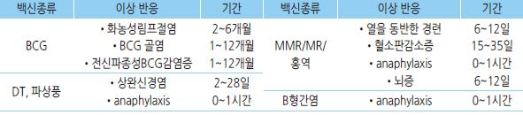

## 접종 금기 및 주의 사항

### 영구적 금기 또는 주의
- 백신 성분 또는 이전 백신 접종 후 anaphylaxis 발생 : 해당 백신 금지

- 계란에 대한 anaphylaxis 알레르기가 있는 경우 : 계란 함유 백신 금지(예: 황열, 일부 독감)

- 백일해 백신 투여 7일 이내에 원인 불명의 뇌증 발생 : 백일해 백신 금지

- 중증복합면역결핍 또는 장중첩증 병력 : 로타바이러스 백신 금지

- 길랭-바레증후군 : 파상풍(DPT 포함), 인플루엔자, 수막구균 단백결합 백신 접종 주의

### 일시적 금기
    (☞ p.1106)

- 임신부

- 면역저하자 : 생백신. 예외) B세포 결핍만 있는 환자에게는 수두 백신 접종 가능

### 일시적 주의 사항
- 중등증~중증 급성 질환 : 백신 효과 감소나 이상 반응 증가에 대한 증거는 없으나 처치에 혼선을 줄 수 있으므로 접종 연기

- 최근에 항체 함유 혈액 제제를 투여 받은 경우 : 주사용 생백신 접종(예: MMR, 수두)과 간격 필요: 불활성화 백신,

    경구용/비강 투여 생백신, 대상포진 백신은 영향을 받지 않음

### 금기 사항이 아닌 경우
- 경미한 급성 질환 : 설사, 상기도 감염, 중이염, 미열(백신 접종이 금기인 특정 체온은 없음)

- 과거 동일 백신 접종 후 중등증 이하의 국소 이상 반응이나 발열이 있었던 경우

- 감염성 질환 노출, 질병 회복기

- 가족 내에 임신부 혹은 면역저하자가 있는 경우. 예외) 두창, 심한 면역 저하 환자와 접촉하는 사람에 대한 인플루엔자

    약독화 생백신 접종은 금지

- 미숙아, 모유 수유(단, 두창 제외, 황열은 선택적)

- 백신 외의 물질에 알레르기 반응이 있는 경우

## 기타

### 보관
- 일반적 백신 보관 온도 : 2~8℃

- 약제와 희석액을 혼합 사용하는 백신(예: MMR, 수두, 대상포진, 일본뇌염 생백신)은 혼합 후 즉시 사용; 보관하는 경우에는

    반드시 냉장 보관하며 8시간 이내 접종하지 못하는 경우 폐기

### 지연 또는 조기 접종
- 권고 접종 간격 이후 접종 : 영향 없음

  •지연된 예방접종 : 권장 접종 시기보다 1개월을 초과하여 접종을 한 경우를 의미하며 접종이 지연 되었더라도 처음부터

    다시 접종하지 않고 지연된 접종부터 접종 함

- 최소 연령 이전 접종, 최소 간격 이내 접종 : 항체 생성이 저하됨; 최소 접종 간격 또는 최소 접종 연령보다 ≥5일 앞당겨서

    접종하면 무효 처리하며 잘못된 접종일로부터 최소 접종 간격 이후 재접종 시행

  •조기 접종 시 용납되는 기간(grace period) : ≤4일

### 동시 접종
- 동시 접종은 항체 반응을 감소시키거나 이상 반응의 빈도를 증가시키지 않음

- 대부분의 백신은 다른 백신과 동시 접종 가능. 예외) PCV13-메낙트라, 수두-두창, 경구용 폴리오-콜레라/황열

- 같은 팔이나 다리에 두 가지 이상의 백신을 동시에 접종할 때는 ≥2.5 ㎝ 간격으로 주사

- 반응성이 강한 백신(예: 파상풍, PCV)들은 가능한 한 같은 부위에 주사하지 않음

### 백신들 간의 접종 간격
- 불활화 백신들 또는 생백신과 불활화 백신들 간에는 접종 간격의 제한 없음. 단, PCV와 메낙트라는 각각 별도 간격을 요함

- 비경구용 생백신들은 서로 다른 날 접종하는 경우에는 최소 4주 간격을 요함

- 경구용-비경구용 생백신 또는 BCG-다른 생백신 사이에는 접종 간격의 제한 없음

- 4주 이상의 간격을 요하는 생백신들을 4주 미만의 간격으로 접종한 경우에는 나중에 접종한 백신을 최종 접종 4주 후에

    재접종하거나 혈청학적 검사를 통해서 효과가 있다는 것을 확인해야 함(단 인플루엔자, 수두, 대상포진 백신은 접종 후의

    혈청학적 검사는 추천하지 않음)

### 조산아, 저체중아
- 출생일을 기준으로 접종 일자를 결정함

- BCG : 미숙아에서는 연기(가급적 1개월 이내 접종), 입원 상태의 심한 질환 시 퇴원 후 접종

- B형간염 백신 : 저체중(＜2.0 ㎏)인 경우 출생 초기 접종 시 항체 양전율이 낮을 수 있으므로 안정되고 체중 증가가 잘

    이루어진 1개월 이내, 또는 출생 1개월째(체중 무관) 접종 시작

### 임신
- 금기 : 모든 생백신(MMR, 수두, 대상포진, 인플루엔자 생백신, 일본뇌염 생백신; 접종 후 1개월간 피임), HPV,

    불활화 폴리오 백신(선택적)

- 접종 가능 백신 : 대부분의 불활성화 백신. 특히 인플루엔자 불활성화 백신 접종 권고

  •Tdap 백신 : 임신 중 어느 시기에나 접종이 가능하나 효과 극대화를 위하여 27~36주째 접종 권고

- 임신부의 가족 내 접촉자 : 홍역, 유행성이하선염, 풍진 및 수두에 대하여 감수성이 있는 사람은 MMR, 수두 백신 접종 권고

### 결핵 검사 (TST, IGRA)
    (☞ p.321)

- 불활성화 백신은 무관

- 생백신(예: MMR, 수두)은 동시에 하는 경우 접종과 검사 함께 시행 가능; 따로 시행 하는 경우 결핵 검사 반응이 억제될 수

    있기 때문에 접종 4주 이후에 결핵 검사 시행

- 결핵 감염이 의심되는 환자에서 MMR 백신 접종이 필요할 경우에는 결핵 검사 전에 MMR 백신 접종을 하지 않으며,

    활동성 결핵 환자에서는 결핵 치료 개시까지 MMR 접종을 보류

### 면역 저하 상태
- 다음은 면역 저하 상태로 간주 : 항암 치료 중, 방사선 치료 중, 고형 장기 이식자

- 생백신 : 접종 금지

  •B세포 결핍만 있는 환자에게는 수두 백신은 접종 가능; 부모/형제 중 선천성 또는 유전성 면역 결핍 질환이 있는 경우에

    수두 백신은 충분한 면역 능력이 입증되어야 접종

- 불활성화 백신 : 접종 가능. 면역 저하 자체가 질환에 대한 위험 인자이므로 접종을 권고

  •단, 백신에 대한 면역 반응이 저하될 수 있으므로 면역 저하 상태 동안 접종한 불활성화 백신은 면역 기능 회복 후 재접종이

    필요할 수 있음

- 면역 글로불린, 혈액 제제 치료 : 치료 종료 3개월 이후(종류마다 다름)로 생백신 접종 연기

- 백신을 먼저 접종한 경우 2주가 경과한 후에 면역 글로불린이나 혈액 제제 투여

### 약물
- steroid 투여 관련

  •고용량 steroid 투여(예: prednisone ≥20 ㎎/d 또는 ≥2 ㎎/㎏/d ×≥14d) 시 생백신은 steroid 투여 중단 최소 1개월 이후 접종,

    불활성화 백신은 접종 가능

  •다음의 경우에는 접종 가능(생백신 포함) : 저용량 steroid(예: prednisone ＜20 ㎎/d) 투여, 고용량이지만 짧은 기간(＜14d)

    투여, 장기간이지만 단기 작용 제제로 격일 투여, 생리적 보충 요법, 국소 도포(피부, 눈), 흡입, 국소 주사(관절, 윤활낭)

- 항바이러스제 : 대부분 무관

  •수두/대상포진, 인플루엔자 약독화 생백신 : 항바이러스제 복용 각각 24시간 및 48시간 이후에 접종하며, 접종 후 14일간

    항바이러스제 투여를 금함(백신의 면역 반응이 저하됨)

- recombinant human immune mediator, immune modulator, 항TNF 제제(예: adalimumab, infliximab,etanercept)와

    생백신과의 관계는 모름(통상 생백신 접종 2주 전부터 6주 후까지 투여 중단)

### 직업군에 따른 예방접종
- 사스·조류인플루엔자 대응기관 종사자, 닭·오리·돼지농장 및 관련업계 종사자 : 인플루엔자

- 보육시설 종사자 : 인플루엔자, 수두, Tdap, MMR, A형간염

- 외식업 종사자 : A형간염

- 수용시설의 수용자 및 근무자 : 인플루엔자, B형간염

- 지체장애인과 이들을 보호하는 직원 : 인플루엔자, B형간염

- 학교 및 유치원 교사 등 소아들과 함께 생활하는 직종 : 수두, 인플루엔자, Tdap, MMR

- 논 농사 종사자 : 신증후군출혈열, 일본뇌염

- 돼지 사육 종사자 : 일본뇌염, 인플루엔자

- 공수병 감염 고위험 직업군(수의사, 동물병원 근무자, 사냥터 관리인, 사냥꾼, 삼림감시원, 도살자, 동물탐험가, 박제사 등) :

     공수병

- 실험실 요원 : 공수병, 수막구균, 신증후군출혈열, 일본뇌염, 장티푸스, 콜레라, 폴리오, 황열

#### 보건의료인 예방접종
    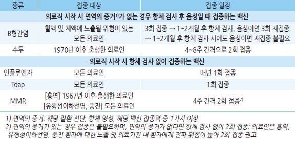

### 기타
- 4주=28일이며, '개월(month)'은 달력 월(calendar month)에 따름

- 접종력이 불확실한 경우 ; 재접종 시행(재접종이 이상 반응 발생을 증가시키지 않음)

- 충분한 용량을 접종하지 못한 경우 : 재접종 시행. 생백신은 4주 이상의 간격을 두고 재접종;

    적정량의 ½이 투여된 경우에는 같은 날 적정량의 ½을 다시 접종하였다면 접종으로 인정

- 비표준접종(권고하는 방법 이외의 접종) : 무효인 것으로 간주하고 재접종 시행

- 교차 접종 : 보통 허용하지 않지만 이전에 접종받았던 백신의 종류를 모르거나 국내에 유통되지 않는 경우 등 불가피한 경우에는

    이용 가능한 백신으로 접종

- 이주, 이민 : 장기간 거주할 국가 권고 기준으로 시행

- 출혈성 질환을 가진 사람 : 23 G 이하의 가는 바늘을 사용하고 최소 2분 이상 지그시 접종 부위를 누름(문지르지 않음)

- 효과 발현 기간 : 일반적으로 백신 접종 1~2주 후부터 효과가 발현되며, 불활화 백신은 추가 접종 후 충분한 효과에 도달

- 혼합 백신 투여 시 최소 연령은 각 성분 백신의 투여 최소 연령 중 가장 높은 연령이며, 최소 접종간격은 각 성분 백신의

    최소 접종 간격 중 가장 긴 기간으로 함

-프리필드시린지의 소량의 공기는 제거하지 않고 접종함(이 공기가 투약 후 잔여 약물을 줄여줌)

- 마비가 있는 부위를 피하여 접종하는 것을 권고 하지만 불가피한 경우에는 접종할 수 있음

- A형간염 or 수막구균 백신 피하 주사, MMR or 수두 백신 근육 주사 시에는 재접종 하지 않음

### ￭ 결핵 BCG
- 생백신 [엑세스파마 피내용 건조BCG, 한국백신 경피용 건조BCG]

### 접종 대상 및 방법
- 대상 : 모든 신생아

- 시기 : 생후 4주 이내 1회

#### 피내 주사형
- 용법 : 0.05 ㎖(≥1세- 0.1 ㎖)를 삼각근 부위에 5~7 ㎖의 팽진이 생기도록 피내 주사(팽진이 생기지 않더라도 재접종은

    필요 없음) (☞ p.1103)

- 장점 : 접종량이 일정하고 정확하며 효과를 신뢰할 수 있음; WHO 및 NIP에서는 피내용만 권고

#### 경피 천자형
- 용법 : 상박 중간 외측 피부에 부위를 달리하여 백신을 2번 바른 후 관침으로 각각 펀칭

- 주의 : 적정 용량이 적정 깊이에 투여되지 않을 가능성이 있음, 깊은 펀칭 시 흉터가 발생함

### 금기
- 면역 결핍 : 선천 면역 결핍, HIV 감염, 백혈병, 림프종, 기타 악성 종양

- 면역 억제 치료 : steroid, 항대사 물질, 항암제 치료, 방사선 치료

- BCG를 접종할 부위에 심한 피부 질환, 화상 등이 있는 경우

### 이상 반응
- 국소 : 국소 림프절염, 농양, 궤양, 켈로이드, 비후성 반흔

- 전신 : 매우 드물게 골염/골수염, 파종성 BCG 감염증 (☞ p.1104)

### 백신 효과 : 피내 주사형
- 논란(방어율 0~80%); 중증 결핵(예: 결핵 수막염, 좁쌀 결핵)에 대해서는 높은 효과를 기대

- 효과 지속 기간 : 10~20년

※ 경피 천자형은 연구 부족

### 접종 후 관리
- 접종 후 수일 내에는 특별한 현상이 없으며 목욕 가능

- 정상 반응

    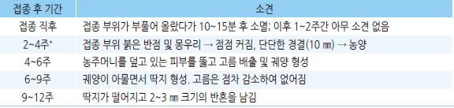

>     *목/겨드랑이의 림프절이 비대해 질 수 있으나(림프절염) 치료하지 않으며 보통 수개월(~1년) 내에 소멸 됨
- 농양, 궤양 : 자연 치유됨; 짜거나 약 도포 또는 드레싱을 하지 않으며 고름이 많으면 소독 솜으로 닦고 통풍시킴; 불필요한

    조치로 상처가 더 커지거나 오래 지속될 수 있음

- 국소 농양 : 피하로 잘못 주사 시 발생 가능; 2차 세균 감염 시(주로 S. aureus ) 치료 (☞ p.901)

- 화농 림프절염 : 림프절이 ＞3 ㎝ 시 터질 가능성이 높음; 터지기 전에 굵은 바늘로 배액

- 무통성 궤양 : 정상 반응으로 주사 후 4개월 이상 궤양이 지속될 수 있음

- 켈로이드 반흔 : 일상생활에 큰 불편이 없는 한 치료 안 함; 필요시 국소 주사, 절제 등 고려

### 특기 사항
- 미숙아 : 영양 상태를 고려하여 연기 가능. 가급적 1개월 이내 접종

- 입원이 필요한 중증 질환 : 퇴원 후 접종

- 지연 접종 : 생후 ＜3개월에서는 TST 없이 접종, ≥3개월에서는 TST 검사 후 음성 시 접종; ≥5세에서는 접종을 권고하지 않음

- 충분한 치료를 받고 있지 않는 결핵 환자와 접촉한 경우 접종하지 않음

- 재접종 : 하지 않음

### 

### ￭ B형간염 HepB
- 불활성화 백신 [SK 헤파뮨, LG 유박스비]

### 접종 대상 및 방법
- 대상 : ①모든 신생아, ②면역의 증거1)가 없는 성인2)

>     1) 면역의 증거 : B형간염 진단, 항체 양성, B형간염 백신 접종력 중 1가지 이상
    2) ≥60세의 경우 다음에서 특히 권장 : 만성 간질환(간염, 알코올간질환, 간효소 2배 초과 상승 등), 혈액투석, HIV 감염, 혈액제재를

>     자주 투여 받는 환자, 과거 B형간염의 감염증거와 예방접종력이 없는 성인 중 B형간염 바이러스에 노출될 위험이 높은 환경에 있는

>     사람(의료기관 종사자, 수용시설의 수용자 및 근무자, 단체 생활을 하는 지체장애인과 이들을 보호하는 직원, B형간염 바이러스

>     보유자의 가족, 주사용 약물 중독자, 성매개질환의 노출위험이 큰 집단
    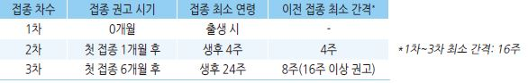

- 시기 : 0, 1, 6개월 (총 3회); 출생 24시간 이내 1차 접종 권고

- 용량 : ＜11세- 0.5 ㎖, ≥11세- 1.0 ㎖

- 용법 : ＜1세- 대퇴부 전외측, ≥1세- 삼각근 IM (☞ p.1103)

- ≥11세 혈액 투석 환자 : 40 ㎍(1 ㎖ 씩 같은 부위에 동시에 2회 접종); 0, 1, 2, 6개월 (총 4회)

### 금기 및 주의 사항
- 백신 접종의 일반적 금기 사항 (☞ p.1104)

### 이상 반응
- 국소 : 접종 부위의 통증, 부종, 경결

- 전신 : 발열, malaise, 구토, 관절통, 발진

### 백신 효과
- HbsAb 양전율 : 소아- ＞95%, ＜40세- ＞90%, 40세~60세- 75%, 성인 투석 환자- 50~75%

- 양전율 저하 인자 : 접종 시 연령(가장 중요), 흡연, 비만, 만성 질환, 혈액 투석, 면역 저하

### 특기 사항

#### 지연 접종
- 차기 접종이 지연된 경우에 새로 시작하지 않고 나머지 횟수만 접종(총 3회)

#### 저체중
- ＜2.0 ㎏ : 출생 1개월 또는 퇴원 시 1차 접종(체중 무관)

#### 산모가 HBsAg(+)인 경우
- 출생 직후(12시간 이내) B형간염 면역 글로불린(HBIG, 0.5 ㎖) 및 B형간염 백신 1차 접종을 서로 다른 부위에 주사(체중

    무관); 2, 3차 백신 접종은 일반 일정과 같이 생후 1, 6개월에 시행

  •＜2.0 ㎏ 아기는 출생 직후 1차 접종하고 1, 2, 6~7개월에 추가 3회 접종하여 총 4회 접종

- 생후 9~15개월에 HbsAb와 HbsAg 검사

  •CDC 지침 : 생후 9~12개월에 검사; 접종이 지연된 경우에는 최종 접종 1~2개월 후 검사

#### 임신, 수유부
- 접종 가능

#### 항체 검사 및 추가 접종
- 항체 검사 : 백신 접종 전이나 후의 HBsAb 확인을 위한 일률적인 검사는 권하지 않으며 B형간염의 고위험군1)에만 적용함

- 추가 접종 : 고위험군을 제외하고는 추가 접종은 권하지 않음2)

>     1) B형간염 고위험군 : HBV 만성 감염자의 가족, 면역저하자(예: HIV 감염자), 혈액 투석 환자, 혈액 제제를 자주 수혈 받아야 하는

>     환자, sAg 양성 산모로부터 출생한 신생아, sAg 양성자와의 성 접촉자, 의료기관 종사자(B형간염 환자나 바이러스가 오염된 체액에

>     노출되는 상황이 반복되는 경우)
    2) 백신에 대한 면역 기억(immunologic memory)과 B형간염의 긴 잠복기로 인해 스스로 항체가가 상승되는 자가증폭(autoboosting)

>     현상이 나타남

#### 고위험군에 대한 접종 후 검사 및 추가 접종
- 항체 검사 : 3차 접종 1~2개월 후에 항체 검사를 시행하며 그 결과에 따라 다음 조치

 ⑴ ≥10 mIU/㎖인 경우 : 이후 매년 sAb 검사 → ＜10 mIU/㎖로 감소 시 1회 추가 접종

 ⑵ 음성 또는 ＜10 mIU/㎖인 경우 : 추가 1회(4차) 접종 및 1개월 후 sAb 검사 →

  ① ≥10 mIU/㎖ 시 종료(⇨ ⑴).

  ② ＜10 mIU/㎖ 시 5차, 6차 접종 및 마지막 접종 1~2개월 후 (만성 감염자 여부 확인을 위하여) sAb 및 sAg 검사 →

        a. ≥10 mIU/㎖ 시 종료(⇨ ⑴)

        b. 음성 또는 ＜10 mIU/㎖ 시 더 이상 접종하지 않으며 감염 가능성, 예방법 및 노출 시 HBIG를 투여받도록 교육

#### 교차 접종
- 허용

### ￭ A형간염 HepA
- 불활성화 백신 [GSK 하브릭스, MSD 박타, 보령 A형간염, 사노피 아박심]

### 접종 대상 및 방법
- 대상 : 모든 12~23개월아 및 아래 중 A형간염 병력이나 백신 접종력이 없는 경우

  • A형간염 바이러스 감염 고위험: A형간염의 유행 지역 여행자나 장기 체류자, 남성 동성애자, 불법 약물 님용자,

    직업적 노출 위험(실험실 종사자, 의료인, 군인)

  • A형간염 바이러스 감염 시 중증 발병 위험 : 면역저하자,  만성 신질환, 장기 이식, B형/C형간염 감염, 만성 간질환, 지방간,

    간 효소 수치 상승(≥2배, ≥6개월), 자가면역 간염, ≥41세

  • 기타 : A형간염 감염 고위험/중증 위험의 임신부, A형간염 유형 중 A형간염 면역력 없음, A형간염 감염자와와 접촉할

    기회가 많은 직업

- 권장 접종 일정 : 생후 12~23개월 1차, 1차 접종 6개월 후 2차(총 2회); 최소 접종 간격- 6개월

- 접종 대상자 중 ＜40세는 항체 검사 없이 접종, ≥40세에서는 항체 검사 후 음성 시 접종 

    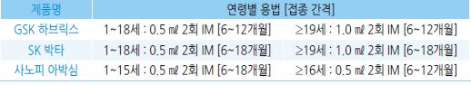

### 금기 및 주의 사항
- 백신 접종의 일반적 금기 사항 (☞ p.1104)

### 이상 반응
- 국소 : 통증, 발적, 부종; 20~50%

- 전신 : malaise, 피로, 미열; ＜10%

### 백신 효과
- 항체 양전율 : ~100%

### 특기 사항

#### 교차 접종
- 허용

#### 지연 접종
- 1차 접종 후 지연된 경우 새로 시작하지 않고 나머지 1회만 접종

#### 백신 접종 전/후의 항체 검사
- 접종 전 검사 : ≥40세에서 시행하며 음성이면 접종(2010년 기준 40세 이상의 항체 양성율 ＞80%);

    ＜40세에서는 항체 검사 없이 접종

- 접종 후 검사 : 필요 없음(항체 양전율이 거의 100%에 달함)

#### 임신부
- A형간염 발생 가능성이 높은 경우에 간염 및 백신으로 인한 위험도를 고려하여 결정

#### 위험 지역 여행 예정
- 6~11개월아 : 출발 전 1회; 12~23개월에 최소 6개월 간격으로 2회 재접종

-  미접종 ≥12개월 : 여행을 계획하는 즉시 1회 접종; ≥40세, 면역저하, 만성 간질환 등이 14일 이내 출발하는 경우백신과

    면역글로불린을 각각 다른 팔다리 근주

### ￭ 디프테리아 DTaP
- 불활성화 백신 [보령 DTaP]

 •DTaP-IPV [사노피 테트락심, GSK 인판릭스 IPV, 보령DTaP IPV]

 •DTaP-IPV/Hib [사노피 펜탁심, GSK 인판릭스 IPV Hib]

### 접종 대상 및 방법
- 대상 : ①모든 소아, ②성인(Tdap or Td)

- 기초 : 생후 2, 4, 6 개월; DTaP, DTaP-IPV, 또는 DTaP-IPV/Hib

- 추가 : 생후 15~18개월(DTaP), 4~6세(DTaP), 11~12세 및 이후 10년마다(Tdap or Td)

  •7세 이후 접종 중 한 번은 Tdap으로 시행하며 가능한 한 11~12세에 Tdap으로 접종

- 한 번도 접종하지 않은 ≥7세 및 성인* : 0, 4~8주, 및 2차 접종 후 6~12개월 (총 3회); Td로 접종하되

    일정 중 1회(가급적 1차)는 Tdap으로 접종

> *DTP 백신이 1958년에 도입되었으므로 그 이전 출생자는 영아기 접종력이 없을 가능성이 있음
- 용법 : 0.5 ㎖; 영아- 대퇴부 전외측, 소아/성인- 삼각근 IM (☞ p.1103)

  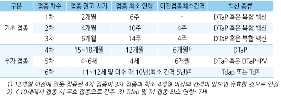

### 금기
- 백신 접종의 일반적 금기 사항 (☞ p.1104)

- 진행성 신경계 이상(예: 조절되지 않은 뇌전증, 영아연축, 진행성 뇌증), 원인 미상의 경련 병력

- 백일해 포함 백신 접종 7일 내에 다른 이유가 밝혀지지 않은 뇌증 발생 시 이들 백신 금기

### 주의 사항
    ✽Tdap 접종 주의 사항은 아님

- DTaP 접종 후 48시간 내에 다음 증상 발생 : 원인 미상의 고열(≥40.5℃), 저긴장성 저반응(저혈압, 호흡 곤란, 심한 두드러기),

    탈진, 쇼크, 3시간 이상 달래지지 않고 지속되는 울음

- DTaP 접종 후 3일 내에 경련성 발작

### 이상 반응
- 국소 : 발적, 부종, 통증, 접종 부위 농양, 심한 국소 반응(Arthus reaction*); 3회 접종에서 20~40% 발생, 4차 및 5차 접종 시

    빈도 증가 (✽국소 부작용 병력은 접종 금기 사항이 아님)

>     *Arthus reaction : 디프테리아 항독소에 대한 과도한 면역 반응; 어깨부터 팔꿈치에 통증이 동반된 넓은 부위의 종창이

>     접종 2~8시간 후 발생하는 현상; 이 경우 10년 내 Td 백신 추가 접종 금지
- 전신 : 두드러기, anaphylaxis, 식욕 상실, 고열, 1시간 이상 울기, 졸림, 구토, 신경학적 이상(뇌증, 상완신경총 말초신경병증,

    저긴장 저반응 포함), 길랭-바레증후군(파상풍 포함 백신에서 주의)

### 백신 효과
- 임상 효능 : ＞97%

### 특기 사항

#### 지연 접종
- 기초 접종의 접종 간격이 벌어진 경우 : 남은 횟수만 접종

- 3차 접종을 생후 15개월~＜4세에 시행한 경우 : 3차 접종 6개월 후 4차 접종 → 4차 접종 6개월 후 5차 접종

- 4차 접종을 ≥4세에 시행한 경우 : 5차 접종은 생략

#### 교차 접종
- 기초 접종 3회에 대하여 허용하지 않음. 예외) 이전에 접종받았던 백신의 종류를 모르거나 국내에 유통되지 않는 경우 등

    불가피한 경우

- 동일 원액을 사용한 제품들은 동일한 것으로 봄 : LG 디티에피, SK 디피티 트리, SK 가케츠켄디 티에이피; GSK 인판릭스,

    인판릭스-IPV; 사노피 테트락심, 펜탁심

- 교차 접종을 한 경우 : 재접종 하지 않음 (✽안전성과 면역원성에 영향을 미치지 않는다는 제한적인 보고가 있음)

- 추가 접종은 교차 접종 허용

#### 열성 경련 병력
- 백신 접종 시 예방적으로 acetaminophen을 투여할 수 있음 [세토펜 현탁액](15 ㎎/㎏ q4hr ×1d)

#### 임신부
- 매 임신 27~36주 중 가급적 이른 시기에 Tdap 1회 접종을 권고

- 이전에 Tdap을 접종한 적이 없고 최근 임신 중 Tdap을 접종하지 않은 new mother는 분만 후 즉시 Tdap 접종;

    이전 Tdap 접종력이 있다면 산후 접종은 필요 없음

#### ＜12개월 영아와 밀접히 접촉하는 자
- 영아와 밀접한 접촉이 예상되는 Tdap 접종력이 없는 청소년과 성인(예: 부모, 형제, 조부모, 도우미, 의료인)은 영아와

    밀접하게 접촉하기 2주전까지 Tdap 1회 접종을 권고

### ￭ 파상풍 DTaP
- 불활성화 백신; Tdap [GSK 부스트릭스, 사노피 아다셀], Td [녹십자 Td, 엑세스파마 Td부스터]

### 접종 대상, 시기 및 방법, 금기 사항 및 주의 사항, 이상 반응
- 디프테리아 백신과 동일 (☞ p.1112)

- 종류 : DTaP, Tdap, Td

### 백신 효과
- 파상풍 톡소이드에 대한 방어 면역 : 74~90%

### 상처 치료 시 파상풍 예방
    (☞ p.1056)

    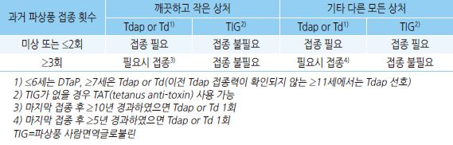

### ￭ 백일해 DTaP
- 불활성화 백신

### 접종 대상, 시기 및 방법, 금기 사항 및 주의 사항, 이상 반응
- 디프테리아 백신과 동일 (☞ p.1112)

- 종류 : DTaP, Tdap

- 성인 Tdap 접종 권장군 : 생후 ＜12개월 영아와 밀접한 접촉자(부모, 형제, 조부모, 영아 도우미, 의료인, 산후조리업자 및

    종사자), 보육시설 종사자, 가임기 여성 및 임신부

### 백신 효과
- 75~90%

### 특기 사항

#### 백일해 유행 시기
- 영아 : 생후 6주부터 DTaP 접종 → 4주 간격 접종 권고

- 생후 ＜12개월의 영아 보호자 : Tdap 접종 권고(이전 Td 접종과의 간격 유지 필요 없음)

- 백일해 집단 발생 학교 교직원 : Tdap 접종력이 없는 경우 접종 권고

### ￭ 로타바이러스 Rotavirus
- 생백신; 5가(G1~4, G9) [MSD 로타텍], 1가(G1; 5가 백신 대상의 90% 해당) [GSK 로타릭스]

### 접종 대상 및 방법
- 1가 [로타릭스]: 생후 2, 4개월 (총 2회); 1.5 ㎖ 경구

- 5가 [로타텍]: 생후 2, 4, 6개월 (총 3회); 2 ㎖ 경구

- 1차 접종 허용 기간 : 최소 생후 6주~최대 14주 6일

- 최종 접종 허용 기간 : 최대 8개월 0일

- 최소 접종 간격 : 4주

### 금기 및 주의 사항
- 백신 접종의 일반적 금기 사항 (☞ p.1104)

- 중증복합면역결핍, 장중첩증 병력

- 주의 : 선천성 복부 질환 병력, 면역 기능 저하, 기존의 만성 위장관 질환, 급성 위장염

### 이상 반응
- 발열, 설사, 구토, 혈변

- 장중첩증 : 논란이 있으나 의미 있는 연관성은 없는 것으로 알려짐

### 백신 효과
- 백신 접종 후 1년 내에 발생하는 심한 로타바이러스 질환에 대한 방어력 : 85~98%

- 백신 접종 후 1년 내에 발생하는 모든 로타바이러스 질환에 대한 예방 : 74~87%

#### 백신의 한계
- 효과 지속 기간이 불확실 : 면역 지속 기간이 알려져 있지 않으며 접종 후 두 번째 시즌에서 효능이 크게 저하된 것이 관찰됨

- 유행 시기의 변이를 일으킬지 모름 : 연구에서 백신을 맞은 경우에 로타바이러스 장염이 일반적인 유행 시기(겨울)를 벗어나

    늦은 봄철에 발생함

- 접종한 소아에서 대변으로 독성이 강한 바이러스가 배출 됨 : 유전자 재배열이 발생하여 보다 독성이 강해졌고 백신 접종을

    하지 않은 형제에게 설사를 유발시켰음

- 로타 바이러스에 대한 자연 면역 효과가 강력함 : 감염이 반복될수록 병의 세기는 감소하여 2회 이상 감염되면 다음 감염 시

    중등증 및 심한 설사가 생길 확률은 0%임

### 특기 사항
- 지연 접종(1차 접종을 15주 이후에 시행한 경우) : 나머지를 일정대로 완료함(이 경우에도 생후 8개월 0일 이후에는

    접종하지 않음)

- 조산아 : 임상적으로 안정된 상태라면 일반 일정 수행 가능

- 교차접종 : 허용하지 않음; 불가피한 경우 5가 백신이 한 번이라도 사용되었거나 이전에 접종한 백신을 알 수 없을 경우는

    총  횟수가 3회가 되도록 접종

- 면역 기능 저하 환자와 접촉하는 영아에 대한 접종 : 예방접종을 받은 영아의 대변으로 바이러스가 배출되므로 전파를

    방지하기 위해 모든 가족들은 이에 노출 시(예: 기저귀 갈기) 손 등의 관리에 유의

- 접종 기간 중 장염(로타 감염 포함) 발생 : 증상 회복 후 일정대로 예방접종을 완료함

- 접종 후 백신 구토 : 백신을 뱉거나 구토한 경우 재투여 하지 않음

### ￭ 폴리오 (주사용) IPV
- 불활성화 백신 [보령 아이피박스] •DTaP-IPV [사노피 테트락심, GSK 인판릭스 IPV, 보령DTaP IPV]

### 접종 대상 및 방법
1. 소아 : 모든 소아

- 기초 : 생후 2, 4, 6개월; IPV, DTaP-IPV, 또는 DTaP-IPV/Hib (☞ p.1112)

- 추가 : 4~6세; IPV 또는 DTaP-IPV

- 용법 : 0.5 ㎖; 영아- 대퇴부 전외측 IM, 큰 소아- 삼각근 IM or SC (☞ p.1103)

    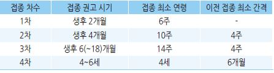

2. ≥18세 : 일반적으로 권고하지 않으며 다음 중 폴리오에 대한 면역력이 없는 경우에 권고; 유행 지역* 여행자,

    이 균을 다루는 실험실 요원, 이 균을 배출하는 환자와 밀접한 접촉을 한 의료인

- 방법 : 이전 접종 완료 시 1회 추가 접종; 이전 접종력이 없는 경우 0, 4~8주, 2차 접종 후 6~12개월 (총 3회)

>     *유행 지역 : 파키스탄, 아프가니스탄, 시리아, 나이지리아, 콩고민주공화국, 케냐, 소말리아

### 금기 및 주의 사항
- 백신 접종의 일반적 금기 사항 (☞ p.1104)

- 임신부(단, 폴리오 노출 위험이 있을 때는 접종 가능)

### 이상 반응
- 국소 : 주사 부위 발적, 경결, 압통

- 소량의 streptomycin, neomycin과 polymyxin B를 함유하고 있으므로 이들 항생제에 과민 반응이 있는 경우에는 접종 후

    과민 반응을 보일 수 있음

### 백신 효과
- 장 점막 항체 생성률 : ＞90%

### 특기 사항

#### 교차 접종
- IPV 또는 IPV와 경구용 생백신 간의 교차 접종 : 허용

- 혼합 백신(DTaP-IPV 혹은 DTaP-IPV/Hib) : 기초 접종에서는 허용하지 않음

#### 지연 접종
- 지연 접종 시 지연된 차수부터 접종

- 3차 접종을 ＜4세에 한 경우 : 최소 접종 간격을 감안하여 4~6세에 4차 접종 시행

- 3차 접종을 ≥4세에 한 경우 : 4차 접종은 하지 않음

### ￭ b형 헤모필루스 인플루엔자 Haemophilus influenzae type b
- 불활성화 백신 [LG 유히브];

 복합제 : DTaP/IPV/Hib [사노피 펜탁심, GSK 인판릭스 IPV Hib], DTaP-IPV/Hib-hepB  [사노피 헥사심]

### 접종 대상 및 방법
- 대상 : ①생후 2개월(최저 6주)~＜5세, ②고위험 성인*

>     *겸상적혈구 빈혈증, 무비증, 보체 및 면역 결핍 환자(특히 IgG2 계열 결핍 환자), 조혈모세포 이식 환자
- 시기 : 생후 2, 4, 6개월 및 12~15개월 (총 4회)

- 용법 : 0.5 ㎖; 영유아- 대퇴부 전외측, 소아 또는 성인- 삼각근 IM (☞ p.1103)

    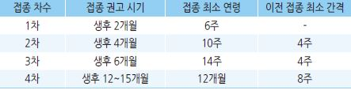

- 성인

  •접종력이 없는 경우 1회 접종

  •비장 적출술이 계획된 경우 : 수술 2주 이상 전에 1회 접종

  •조혈모 세포 이식 환자 : 이식 6~12개월 이후부터 최소 4주 간격으로 3회 접종

### 금기 및 주의 사항
- 백신 접종의 일반적 금기 사항 (☞ p.1103)

- 생후 ＜6주

### 이상 반응
- 국소 : 부종, 발적, 통증(5~30%); 대부분 12~24시간 내 소실

- 전신 : 흔하지 않으며 심각한 이상 반응은 보고된 바 없음

### 백신 효과
- 질병 예방 효능 : 95~100%

### 교차 접종
- 기초/추가 접종 모두 가능

#### 지연 접종
- 7~11개월에 1차 접종 시 : 1차 접종 최소 4주 후 2차 시행, 3차(최종)를 12~15개월에 시행(2차와 최소 간격 8주)

- 12~14개월에 1차 접종 시 : 1차 접종 최소 8주 후 2차(최종) 시행

- 12개월 이전에 1차 및 15개월 이전에 2차 접종 시 : 2차 접종 최소 8주 후 3차(최종) 시행

- ≥15개월에 1차 접종 : 추가 접종 필요 없음

- 접종력이 없는 15~59개월 : 1회(최종)

- 접종력이 없는 ≥60개월 : 접종하지 않음 (✽≥5세에서는 대부분 무증상 감염에 의해 면역력이 있음)

- 고위험군에서는 별도 일정에 따름

### ￭ 홍역 MMR
- 생백신 [MSD 엠엠알Ⅱ, GSK 프리오릭스]

### 접종 대상 및 방법
1. 소아 : 모든 소아에서 1차- 생후 12~15개월, 2차- 4~6세 (최소 간격 4주; 총 2회)

2. 성인 : 면역의 증거1)가 없는 1968년 1월 1일 이후 출생자2)는 적어도 1회, 다음의 경우에는 2회(최소 간격 4주) 접종- 면역의

    증거가 없는 의료 종사자3), 해외여행자, 대학생, 직업교육원생 

*1) 면역의 증거 : 확인된 백신 2회 접종력, 실험실 검사를 통해 확진된 병력, 혈청 검사로 확인된 항체*

*　2) 1967년 이전 출생자는 홍역에 면역력이 있다고 간주함*

*　3) 의료기관 종사자는 출생 연도로 면역 획득 여부를 추정 하지 않음*

- 0.5 ㎖; 상완 외측면 SC (☞ p.1103)

### 금기 및 주의 사항
- 백신 접종의 일반적 금기 사항 (☞ p.1104)

- 젤라틴, neomycin에 심한 알레르기 반응(anaphylaxis) 병력(계란 알레르기와는 관계없음)

- 임신부(접종 후 4주간 피임), 중증 면역 결핍, 중증 급성 질환, 백혈병, 림프종, 기타 악성 종양

- 면역 글로불린 또는 혈액 제제 투여 후 3~11개월(제제에 따라 결정)

- 면역 억제 치료 : steroid, 알킬화제, 항대사 물질, 방사선 조사 (☞ p.1106)

### 이상 반응
- 발열 : 접종 후 6~12일에 5~15%에서 발생, 1~2(~5)일간 지속

- 발진 : 접종 후 7~10일에 5%에서 발생, 1~3일간 지속

- 림프절 부종, 관절통, 이하선염, 알레르기 반응, 열성 경련, 드물게 혈소판 감소증, 무균성 수막염

### 백신 효과
- 2회 접종 항체 양전율 : ＞99%

### 특기 사항

#### 조기 접종
- 1세 이전에 접종한 경우 : 이 접종은 무시하고, 일반적인 일정대로 접종 진행

#### 지연 접종
- 소아 : 최소 4주 간격으로 2회 접종

#### 홍역 유행 시
- 생후 6~11개월 : 홍역 단독 또는 MMR 백신 접종

- 4세 이전이라도 1차 접종과 최소 4주 간격을 두고 2차 접종 가능

#### 임신
(☞ p.1119)

### ￭ 유행성이하선염(볼거리) MMR

### 접종 대상, 접종 시기 및 방법, 금기 및 주의 사항, 이상 반응
- 홍역 백신과 동일 (☞ p.1118)

- 유행성이하선염 면역의 증거 : 유행성이하선염 진단, 항체 양성, 생후 12개월 이후에 MMR 백신 2회 접종력 중 1가지 이상

### 백신 효과
- 항체 양전율 : ＞90% (✽항체 지속력이 홍역과 풍진에 비해서 낮다는 보고가 있음)

### 특기 사항

#### 유행성이하선염 유행 시
- 4세 이전이라도 1차 접종과 최소 4주 간격을 두고 2차 접종 가능

- 공식적으로 유행 위험이 발표되는 경우 접종력이 ≤2회인 성인에서 1회 추가 접종 고려

#### 노출 후 접종
- 현재 감염에 대한 효과는 없으나 차후 노출에 대비하여 시행할 수 있음

### ￭ 풍진 MMR

### 접종 대상, 접종 시기 및 방법
- ①모든 소아, ②풍진에 대한 면역의 증거*가 없는 가임기 여성; 기타 홍역 백신과 동일

>     *풍진 면역의 증거 : 풍진 진단, 항체 양성, 생후 12개월 이후에 MMR 백신 접종력 중 1가지 이상

### 금기 및 주의 사항, 이상 반응
- 홍역 백신과 동일 (☞ p.1118)

### 백신 효과
- 풍진에 대한 면역 획득률 : ＞95%

### 특기 사항

#### 임신부
- 임신 중 접종 금기 및 접종 후 4주간 피임 (✽풍진 예방접종으로 인한 태아 손상의 명백한 증거는 없음)

- 임신부 가족들은 접종 가능

- 풍진에 대한 면역의 증거가 없는 산모는 출산 후 퇴원 전 접종

- 가임기 여성이 MMR 백신을 과거에 1회 또는 2회 접종받았더라도 풍진에 대한 항체 검사가 음성이면 1회 추가 접종 시행,

    이후 풍진 항체 검사는 하지 않음; 접종 횟수 한도- 총 3회

### ￭ 수두 Varicella
- 생백신 [녹십자 배리셀라, 보란파마 바리-엘, SK 스카이바리셀라]

### 접종 대상 및 방법
1. 소아 : 생후 12~15개월 (✽미국은 4~6세에 추가 접종 권고)

2. 성인 : 면역의 증거1)가 없는 1970년 이후 출생자2)에 대하여 4~8주(최소 4주) 간격 총 2회

>     1) 면역의 증거 : 수두 진단, 항체 양성, 수두 백신 접종력 중 1가지 이상
    2) 미국은 1980년 이후 출생자는 2회, 그 이전 출생자는 위험군 또는 적응증이 있는 경우 2회 접종 권고
  •성인 접종 권장군 : ① 학생, 의료인, 학교 및 유치원 교사, 해외여행자 등 수두 유행 가능성이 있는 환경에 있는 사람,

    ② 수두 이환 시 심각한 합병증을 유발할 수 있는 면역저하자의 가족 및 자주 접촉하는 의료인, ③ 가임기 여성

- 용법 : 0.5 ㎖; 상완 외측면 SC (☞ p.1103)

### 금기 및 주의 사항
- 백신 접종의 일반적 금기 사항 (☞ p.1104)

- 중등증 이상의 급성 질환

- 악성 종양, 중증 면역 결핍, 면역 억제 치료(예: 고용량 steroid) (☞ p.1106)

- 면역 글로불린, 혈액 제제 투여 후 3~11개월(제제에 따라 결정)

- 임신(접종 후 4주간 피임)

### 이상 반응
- 국소 : 통증, 발적, 부종; 20%

- 전신 : 발열, 상기도염, 두통, 피곤증, 기침, 근육통, 불면증, 구역, malaise, 대상포진, 수두양 반응(5%; 평균 5개의

    수두 유사 발진. 이때 약간의 전염 가능성이 있음)

### 백신 효과
- 수두 예방 : 80~85%; 중중 질환 예방 95%

### 특기 사항

#### 지연 접종
- 감염된 적이 없는 경우 : ＜13세- 1회; ≥13세- 4~8주(최소 4주) 간격 2회

#### 수두 노출 시 관리
- 접종 경력이 없는 경우 노출 후 가능한 한 빨리 예방접종을 시행(3일 내, 최대 5일 내); 발병 예방 및 증상 경감 효과가 있음

#### Aspirin 투여 금지
- 수두 감염 및 백신 접종 후 6주간은 aspirin을 투여를 회피(라이증후군 관련)

### ￭ 대상포진 Herpes zoster
- 생백신 •ZVL [MSD 조스타박스, SK 스카이조스터] •RZV [GSK 싱그릭스]

### 접종 대상 및 방법
- Zoster vaccine live(ZVL ) [MSD 조스타박스, SK 스카이조스터] : ≥50세

  • 1회; 0.65 ㎖, 상완 외측면 SC

- Recombinant zoster vaccine(RZV)1) [GSK 싱그릭스] : ≥50세, ≥18세의 면역 저하자2) 

  • 2~6개월(최소 4주) 간격 2회; 0.5 ㎖, 상완 외측면 IM 

1) CDC에서는 이전 대상포진 감염 또는 ZVL 접종력에 관계 없이 RZV 2회 접종을 권고함

2) 자가조혈모세포이식, 고형암, 혈액암 환자, 고형 장기 이식

### 금기 및 주의 사항
- 백신 접종의 일반적 금기 사항 (☞ p.1104)

- 수두와 동일 (☞ p.1120)

- 항바이러스제 : 백신 접종 전 24시간 및 접종 후 14일간 항바이러스제 투여 금지

### 이상 반응
- 국소 : 발적, 통증, 부종; 30%

- 길랭-바레 RZV 100만 접종 당 3 case 증가

### 백신 효과
- 고령자에서 낮음

- 장기 효과에 대해서는 연구 부족

- 대상포진 예방 • ZVL : 60~69세- 64%, ≥80세- 18% •RZV : 50~59세- 96.6%, ≥70세-91% (≥50세에서 접종 5~7년 후에도

    84% 효과 유지)

- 대상포진후신경통 감소 •ZVL : 66% •RZV : ≥70세- 88.8%

- 대상포진 발생 전 백신을 접종하면 뇌졸중의 위험이 감소한다는 보고가 있음

### 특기 사항

#### 대상포진 발병 후 접종
- 수두 또는 대상포진의 병력과 무관하게 접종 가능

- 대상포진을 앓은 경우 자연면역을 얻는 효과가 있으나 예방접종을 원하는 경우 최소 6~12개월이 경과한 후 접종

    (✽미국 권고안 : 급성기 증상 완화 후)

#### 동시 접종
- ZVL : PPSV23과의 동시 접종 시 대상포진 백신 효과가 떨어진다는 보고가 있으나 의미 있는 영향이 없다는 보고에 따라

    미국에서는 동시 접종을 허용; PCV13에 대해서는 연구 부족

- RZV : 인플루엔자 3가 백신과의 동시 접종의 영향은 없음. 그 외 연구 부족

#### 교차 접종
- ZVL 접종 후 RZV 접종 가능(최소 2개월 간격)

#### 접종 후 전파 가능성
- 대상포진 백신 접종 후 다른 사람들에게 전파시켰다는 보고는 없음

- 단 주사 부위 근처에 수두양 발진이 발생한 경우 발진에 딱지가 생길 때까지 가려두는 것을 권고

### ￭ 인플루엔자 Influenza
- 생백신 또는 불활성화 백신

### 접종 권고 대상
- 생후 6개월~59개월, ≥65세, 50~64세(합병증 발생 고위험 만성 질환의 높은 유병률과 연관)

- 만성 간/신/폐/심질환(단순 고혈압 제외), 당뇨병, 신경/근육 질환, 혈액/종양 질환

- 면역저하자, aspirin을 복용 중인 60개월~18세

- 임신부, 인플루엔자 유행 시기에 임신 예정인 가임기 여성

- 만성 질환으로 사회복지 시설 등 집단 시설에서 치료, 요양, 수용 중인 사람

- 의료기관 종사자

- 만성질환자/임신부/≥65세와 함께 거주하는 자, 6개월 미만의 영아를 돌보는 자

- 사스/조류인플루엔자 대응 기관 종사자, 닭/오리/돼지 농장 및 관련 업계 종사자

### 접종 시기 및 방법
- 시기 : 매년 10~12월 접종 권고; 유행 2주 전까지 접종 권고

#### 불활성화 백신(4가)
- ≥6개월, ＜9세 : 접종력이 없거나 모름-  최소 4주 간격으로 2회; 접종력 있음- 1회

   • 접종 첫 해에 1회만 접종한 경우에는 다음해에 4주 간격으로 2회 접종 권고

- ≥9세 : 1회 접종

- 방법 : 0.5 ㎖; 영유아- 대퇴부 전외측 IM; ≥36개월아 및 성인- 삼각근 IM (☞ p.1103)    

#### 생백신
    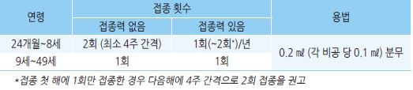

### 금기 및 주의 사항
- 일반적 금기 사항 (☞ p.1104)

#### 불활성화 백신
- 인플루엔자 백신 접종 후 6주 이내에 길랭-바레증후군 발생

- 계란에 심한 과민 반응; 계란을 먹고 심한 과민 반응이 없었다면 금기 대상이 아님, 의료진의 감독하에 의료 기관에서 투여

    가능; 세포 배양 백신, 유전자 재조합 백신은 egg-free로 계란 알레르기 무관 접종 가능 [스카이셀플루4가]

#### 생백신
- ＜2세, ≥50세

- 이전 인플루엔자 백신 접종 또는 백신 성분에 중증 알레르기 반응 병력

- aspirin 또는 salicylate 함유 약제 투여 중인 2~7세

- 면역 저하, 천식, 만성 폐/심혈관 질환(고혈압 제외), 당뇨병, 신경/근육 질환, 신/간질환

- 최근 12개월 동안 천식 또는 wheezing episode가 있었던 2~4세

- 입원 격리가 필요할 정도의 심한 면역 저하 환자와 밀접하게 접촉하는 사람

- 임신부 또는 임신 가능성이 있는 경우(접종 후 4주간 피임)

- 인플루엔자 항바이러스제 투약 후 48시간, peramivir 투여 후 5일, baloxavir 투여 후 17일 내

### 이상 반응

#### 불활성화 백신
- 국소 : 발적, 통증

- 전신 : 발열, 무력감, 근육통, 두통; 첫 백신 접종자에서 보다 흔함

- 계란 단백 알레르기 반응, 길랭-바레증후군(✽인플루엔자 감염에 의한 것보다는 적게 발생함)

#### 생백신
- 소아 : 콧물, 코 막힘, 발열, 두통, 근육통, 쌕쌕거림, 복통, 구토

- 성인 : 콧물, 코 막힘, 인두통, 기침, 오한, 피로감, 두통

### 백신 효과
- 불활성화 백신 : 일치하는 아형에 대하여 70~90% 유효; 소아와 고령에서는 효과가 보다 적음

•고령 독감의사환자 예방 효과 30~40%, 사망 예방 80%

- 생백신 : 일치하는 아형에 대하여 50~80%; 적용 방법/상태(특히 코 상태)에 따라 효과 감소

### 특기 사항

#### 3가 및 4가 불활성화 백신
- 성분 : A serotype은 동일; B serotype은 3가 백신은 1가지, 4가 백신은 2가지 함유

- 효과 : 함유되어 있지 않은 다른 균주에도 면역성이 생기는 heterosubtypic immunity로 인하여 3가 백신의 경우 포함하고

    있지 않은 아형에 대해서도 일부 면역성 획득

  •seroconversion은 4가 백신이 다소 우수, seroprotection은 유의미한 차이 없음; 실제 인플루엔자 발생 감소 효과에 대해서는

    연구 부족

#### 교차 접종
- 허용 : 생백신-불활성화 백신, 3가-4가, 또는 다른 제조사 백신 간 교차 접종 허용

#### 증강 백신 (Adjuvanted vaccine, 3가)
- 항체 형성률이 낮고 유지 기간이 짧은 고령자에서 예방 효과를 높이거나 많은 양의 백신을 단기간에 생산하기 위해

    면역원성을 증가시키는 첨가제를 사용; 효과 등에 대하여 추가 연구 필요

#### 고역가 백신 (High dose)
- 일반 백신의 4배 항원 함유; 항체 형성 증가, 국소 부작용 증가 [Fluzone]

  •고위험 심혈관 환자에 대한 고역가 3가 백신 vs 표준 용량 4가 백신 비교 연구에서 심폐 입원 또는 사망률에 유의미한

    차이가 없었다는 보고가 있음

#### 고령자
- [CDC] 65세 이상은 고용량 백신 또는 증강 백신 접종을 권고

  • 고령자는 면역 저하로 인하여 인플루엔자 감염에 취약한 반면, 백신 접종에 의한 면역 생성 효과는 떨어지므로

    더 강력한 백신 접종을 권고함

### ￭ 일본뇌염 Japanese Encephalitis
- 생백신 또는 불활성화 백신

### 접종 대상 및 방법
[소아] ≥1세.

[성인] 면역의 증거가 없는 다음의 성인- 위험 지역(예: 논, 돼지 축사 인근) 거주, 전파 시기에 위험 지역에서 활동 예정, 비유행

    지역에서 이주하여 국내에 장기 거주할 외국인, 일본뇌염 유행 국가* 여행자, 일본뇌염 바이러스를 다루는 실험실 근무자

    **일본뇌염 유행 국가 : 방글라데시, 미얀마, 캄보디아, 중국, 인도, 인도네시아, 일본, 라오스, 말레이시아, 네팔, 파키스탄, *

*    파푸아뉴기니, 필리핀, 싱가포르, 스리랑카, 대만, 태국, 베트남 등 아시아, 서태평양 일부*

#### 베로세포 배양 불활화 백신
    [녹십자/보령 세포배양일본뇌염]

1. 소아 : [기초 접종] 생후 12~23개월에 (7일~)1개월 간격 접종(총 2회); [추가 접종] 2차 접종 (6개월~)11개월 후 및

    만 6세(최소 5세; 최소 2년 후), 12세(최소 11세; 최소 5년 후)(총 3회)

2. 성인 : (7일~)1개월 간격으로 2회 및 2차 접종 11개월 후 3차(총 3회)

- 용법 : ＜3세- 0.25 ㎖, ≥3세- 0.5 ㎖; 상완 외측면 SC (☞ p.1103)

#### 생백신
    (햄스터 유래 [한국백신 씨디제박스], 베로세포 유래 재조합 키메라 백신 [사노피 이모젭])

1. 소아 : 생후 12~23개월에 1차[최소 연령: 햄스터-8개월, 키메라-9개월], (4주~)12개월 후 2차(총 2회)

2. 성인(≥18세) : 1회(키메라 백신만 사용)

- 용법 : 0.5 ㎖; 상완 외측면 SC (☞ p.1103)

### 금기 및 주의 사항
- 백신 접종의 일반적 금기 사항 (☞ p.1104)

- 쥐 뇌조직 유래 불활성화 백신 : 티메로살, 젤라틴, MBP에 과민 반응이 있었던 경우

- 임신부

### 이상 반응

#### 불활성화 백신
- 국소 : 발적, 부종, 통증, 감각 과민; 20%

- 전신 : 발열, 두통, malaise, 발적, 오한, 어지러움, 근육통, 구토, 복통; 10~30%

#### 약독화 생백신
- 국소 : 발적, 부종, 통증; 25%

- 전신 : 발열, 보챔, 발진, 구토; 25%

### 백신 효과
- 불활성화 백신의 3회 접종 후 항체 양전율 : ~100%

- 생백신 1회 접종 후 항체 양전율 : 키메라 백신 99%, 햄스터 백신 ~100%

### 특기 사항

#### 교차 접종
- 허용하지 않음; 불가피한 경우 2회 이상의 쥐 뇌조직 불활성화 백신 접종 후 베로세포 불활성화 백신 접종 가능

    → 이후에는 베로세포 불활성화 백신 접종

#### 지연 접종 (불활성화 백신)
- 남은 횟수만 접종

- 4세~9세에 3차 접종을 한 경우 : 12세에 1회만 추가 접종

- 10세 이후에 3차 또는 4차 접종 한 경우 : 더 이상 추가 접종하지 않음

- 11세 이후에 처음 접종하는 경우 : 나이 무관, 기초 3회만 접종

### ￭ 폐렴구균 Pneumococcal Pneumonia
- 불활성화 백신; PCV10 [GSK 신플로릭스], PCV13 [화이자 프리베나13], PCV15 [MSD 박스뉴반스], 

    PPSV23 [MSD 프로디악스-23]

※ 2024 CDC 지침은 PCV15 & 20을 기준으로 작성됨

### ＜19세

#### PCV13
- 2개월~59개월 : 모든 소아

 •2, 4, 6개월 기초 접종, 생후 12~15개월 1회 추가 접종 (총 4회)

 •생후 7~11개월에 시작 : 최소 4주 간격으로 2회, 생후 12개월 이후에 3차(2차와 최소 8주 간격) 접종

 •생후 12~23개월에 시작 : 최소 8주 간격으로 2회 접종 

 •생후 24개월 이후에 시작 : 1회, 고위험군은 2회(최소 8주 간격) 접종 

- ≥5세 : 고위험군* 

 •60~71개월 : 이전 접종력이 없는 경우 최소 8주 간격으로 2회 접종

 •6~18세 : 이전 접종력 무관 1회

*고위험군 : 인공와우 이식, 뇌척수액 누출, 무비증, 면역저하, 만성 심/폐/간 질환, 당뇨병

  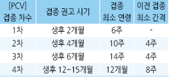

#### PPSV
- ≥2세 고위험군에서 필요한 PCV 접종 완료 및 마지막 PCV 접종과 최소 8주 간격으로 1회 접종, PPSV 접종 5년 이후 1회

    재접종(정상 면역 만성 질환 소아는 재접종은 권고 안 함)

### 19~64세 
**정상면역 상태인 만성질환자** : PPSV 1회

**고위험군** 

- 이전 접종력(-) : PCV13 접종 → 최소 8주 후 PPSV 접종

- PPSV 접종력(+) : 마지막 PPSV 접종 최소 1년 후 PCV13 접종; 면역저하자와 무비증인 경우 PCV13 접종

    → PCV13 접종 8주 이후 및 이전 PPSV 접종 5년 이후  PPSV 1회 재접종

### ≥65세
- 이전 접종력(-), 정상 면역 : PPSV 1회 

- 이전 접종력(-), 고위험군 : PCV13 접종 → 8주 경과 후 PPSV 1회 접종

- PCV 또는 ＜65세에 PPSV 접종력(+), 정상 면역 : ≥65세에서 PPSV 1회 재접종(이전 PCV와 최소 1년 및 PPSV와 

    최소 5년 간격)

- 이전 접종력(+), 면역저하/무비증 

  • PCV만 접종 : PCV 접종 최소 8주 경과 후 PPSV 1회 접종 

  • ＜65세에 PPSV만 접종 : PCV 접종(PPSV와 최소 1년 간격) → PPSV 1회 재접종(이전  PCV와 최소 8주 및 PPSV와 

    최소 5년 간격) 

  • 둘 다 접종 : PPSV 1회 재접종(이전  PCV와 최소 8주 및 PPSV와  최소 5년 간격)

### 접종 방법
- 단백결합 백신(PCV) : 0.5 ㎖; ＜1세- 대퇴부 전외측, ≥1세- 삼각근 IM (☞ p.1103)

- 다당 백신(PPSV) : 0.5 ㎖; 상완 외측면 SC, 삼각근 IM

### 백신 효과

#### PCV
- 주로 PCV7에 대한 연구임(PCV13은 자료가 부족함)

- 해당 아형에 대한 항체 형성 : ＞90%

- 침습성 질환에 대한 예방 : 해당 아형에 대하여 97%, 모든 혈청형에 대하여 89%

- 폐렴 예방 : 임상적으로 진단된 폐렴 11%, 흉부 X선으로 확인된 폐렴 34%

- 중이염 예방 : 급성 중이염 7%, 중증 중이염 20%

- PCV13 폐렴구균 예방 : 지역사회 폐렴에 대하여 45.6%, 침습 폐렴구균 질환에 대하여 75.0%

- 면역력 지속 기간 : 불명확

#### PPSV23
- 해당 아형에 대한 항체 형성 : ＞80%; 고령, 일부 만성 질환, 면역저하자에서는 항체 반응 저하

- 항체가가 5~10년 후에 감소하지만 항체가와 침습 질환의 방어력에 대한 관련성은 확실치 않음

- 해당 아형의 침습성 질환에 대한 예방 : 60~70%; 폐렴구균 감염에 대한 정상적인 저항력이 없는 사람에서는 백신의 효과가

     더 낮을 수 있음

### 금기 및 주의 사항
- 일반적 금기 사항 (☞ p.1104)

- 임신부

### 이상 반응
- 국소 : 통증, 부종, 발적

- 전신 : 발열

### 특기 사항

#### 교차 접종
- 허용하지 않음

#### 동시 접종
- PCV13과 PPSV23 동시 접종 금지; 두 가지 모두 접종이 필요한 경우 PCV13 먼저 시행

- PCV13과 수막구균 백신 [메낙트라] 동시 접종 금지; 폐렴 백신을 먼저 접종하고 4주 후 메낙트라 접종

- 대상포진 백신과 PPSV23의 동시 접종 가능

#### 침습 폐렴구균 병력(+)
-: 다른 혈청형에 의한 폐렴구균 질환이 발생할 수 있으므로 접종 권고

### ￭ 사람유두종바이러스 HPV
- 불활성화 백신; 2가 [GSK 서바릭스], 4가 [MSD 가다실], 9가 [가다실9]

### 접종 대상
- 남녀 무관 모든 9~26세(서바릭스 25세); 권고 연령 11~12세

- 여성 27~45세 : 선택적 접종

>   ✽만 27세 이후 여성에서 암 예방 효과는 입증되지 않았으나 만 27세 이상이라도 성생활을 시작하지 않았거나 HPV 노출 기회가

>     적은 여성의 경우는 이론적으로 암 예방 효과를 기대할 수 있음

### 접종 시기 및 방법
- 9~14세에 초회 접종 시 0, 6~12개월(최소 간격 5개월); 총 2회

- 면역저하자 또는 ≥15세에 초회 접종 시 0, 1개월 [서바릭스]~2개월 [가다실], 6개월(최소 간격

1~2차-4주, 2~3차-12주, 1~3차-5개월); 총 3회

- 용법 : 0.5 ㎖ 삼각근 IM (☞ p.1103)

### 금기 및 주의 사항
- 백신 접종의 일반적 금기 사항 (☞ p.1104)

- 라텍스 알레르기(2가 백신), 효모 알레르기(4가, 9가 백신)

- 임신부

- 주의 : 수유부, 면역저하자

### 이상 반응
- 국소 : 통증, 부종, 발적; 80%

- 전신 : 발열, 메스꺼움, 근육통; 드물게 일시적 의식 소실 (✽젊은 성인과 청소년에서 접종 후 실신 보고가 있음;

    실신으로 인한 외상 예방을 위하여 앉거나 누워서 접종하고 접종 후 그 상태로 20~30분간 관찰)

### 백신 효과
- 백신 유형의 CIN2 이상 병변에 대한 효능 : 4가 백신 97~100%, 2가 백신 92~100%

- 백신 유형의 생식기 사마귀 : 4가 96%

- 한계 : 최종적으로 자궁경부암 발생 예방 효과는 모름; 기 감염된 질환에 대한 예방 효과는 없음

### 특기 사항
- 접종 전 HPV 검사 : 필요 없음

- 접종 전 검사에서 HPV(+)인 경우 : 다양한 HPV 아형이 있으므로 접종할 수 있음

- 교차 접종 : 권장 안 함

- 종류에 관계없이 권장 일정으로 접종을 완료한 경우에 추가 접종은 권고하지 않음

- 9~14세 때 초회 접종 후 5개월 이내에 1 or 2 doses 접종한 경우 : 1회 추가 접종

- 9~14세 때 초회 접종 후 5개월 이상의 간격으로 2 doses 접종한 경우 : 추가 접종 필요 없음

>   ✽9~14세에서는 1회 접종과 2~3회 접종이 비슷한 수준의 예방력을 보인다는 연구가 있음
- 지연 접종 : 남은 횟수만 접종. 과거에 접종받은 횟수를 포함하여 총 3회 접종

- 접종 진행 중 임신 : 나머지 접종 일정은 연기하며 그 외의 조치는 필요 없음

  •접종 전 임신 검사는 필요 없음

### ￭ 수막구균 Meningoencephalitis
- 불활성화 백신(ACWY 4가 백신) [GSK 멘비오, 사노피 메낙트라]

※ 미국에서는 5가 백신 [Penbraya]이 도입되고 [메낙트라]의 사용이 중지되었음  

### 접종 대상
- 0.5 ㎖; 영유아- 대퇴부 전외측 IM; 소아 또는 성인- 삼각근 IM (☞ p.1103)

1. 생후 2개월~10세의 무비증 및  보체결핍증

1) 멘비오

- 2~6개월아 : 2, 4, 6, 12개월(총 4회)

- 생후 7~23개월에 접종 시작 시 최소 간격 12주로 2회(2차는 생후 12개월 이후 접종)

- 2~12세에 접종 시작 시 최소 간격 8주로 2회

2) 메낙트라

① 무비증 

- 생후 24개월 이후(마지막 PCV 접종 4주 이후) 최소 간격 8주로 2회

② 보체 결핍

- 9~23개월아 : 최소 간격 12주로 2회

- 2~10세 : 최소 간격 8주로 2회

※ 추가 접종 : 마지막 접종이 생후 2개월~6세인 경우 3년 후, ≥7세인 경우 5년 후; 면역 결핍 상태가 지속되거나 감염 위험이

    지속되면 5년마다 재접종

2. ≥24개월아 및 성인

- 보체 결핍, 무비증, HIV 감염 : 12주(최소 8주) 간격으로 2회

- 수막구균 감염의 위험*이 있는 건강인 : 1회 접종

*유행 지역 여행, 수막구균 노출 직업, 군입대, 대학 기숙사 입소 신입생

#### 금기 및 주의 사항
- 백신 접종의 일반적 금기 사항 (☞ p.1104)

- 라텍스 과민, 길랭-바레증후군

### 이상 반응
- 국소 : 발적, 부종, 통증; 59%

- 전신 : 발열(5%), 무기력, anaphylaxis, 길랭-바레증후군(인과 관계는 불분명); 30%

### 백신 효과
- 청소년 접종자의 해당 아형 항체 생성률 : 81~95% 

#### 백신의 한계
- 유지 효과가 낮음 : 접종 5년 후 50% 정도에서 혈청 항체가 유지되며, 5세 이하에서는 접종 3년 후 항체가가 급격히 감소함

- 예방 효과를 모름 : 형성된 혈청 항체가 어느 정도의 질병 예방 효과가 있는지 잘 모름; 사람에게 질병을 일으키는 A, B, C

    혈청군 중 백신에 포함되어 있지 않은 A형 아형 및 B 혈청군에 대한 감염 수준이 알려져 있지 않아 전체 수막구균에 대한

    예방 효과를 모름

### 특기 사항
- 지연 접종

  •접종력이 없는 13~15세 : 1차 접종 및 16~18세 2차 접종(최소 8주 간격)

  •접종력이 없는 16~18세 : 1회 접종으로 종료

- 교차 접종 : 권고하지는 않으나 가능

- 동시 접종

  •＜2세의 무비증 환자에서 메낙트라 & PCV13 동시 접종 금지 (≥2세에서 PCV13 시리즈 접종 종료 4주 후 메낙트라 접종)

  • 멘비오 & PCV13 동시 접종은 허용

#### 고위험 지역 여행자
- 대상 : 아프리카 수막염 벨트, 사우디아라비아 메카, 기타 유행 지역

멘비오 (연령 2개월 이상)

- 2개월에 초회 접종 : 총 4회(4, 6, 12 개월에 추가)

- 3~6개월에 초회 접종 : 총 3 or 4회(최소 8주 간격으로 7개월 이상이 될 때까지 2~3회 접종,

    만 1세 이상에서 이전 접종과 최소 12주 간격으로 추가)

- 7~23개월에 초회 접종 : 총 2회(만 1세 이상에서 초회와 최소 12주 간격으로 2회차 접종)

- ≥2세 : 1회

메낙트라 (연령 9개월 이상)

- 최소 (8~)12주 간격으로 2회

- ≥2세 : 1회

### ￭ 장티푸스 (주사용) Typhoid
- 불활성화 백신 [보령 지로티프]; 생백신 [대웅 비보티프]

### 접종 대상
- 장티푸스 보균자와 밀접 접촉자(예: 가족)

- 장티푸스 유행 지역* 여행자 또는 체류자

*님아시아(인도, 파키스탄, 방글라데시, 네팔, 인도네시아, 필리핀, 따푸아뉴기니), 동남 아시아, 아프리카, 중님미, 남미 지역 

- 장티푸스균 취급 실험실 요원

### 접종 시기 및 방법
- 주사용 Vi 다당 불활화 백신 : ≥2세에서 1회, 위험이 지속되는 경우 3년마다 1회; 0.5 ㎖, 대퇴부 전외측 또는 삼각근/대퇴부

    외측 또는 상완 외측면 IM 또는 SC (☞ p.1103)

- 경구용 Ty21a 약독화 생백신 : ≥5세에서 1캡슐/2일 간격 3회, 위험이 지속되는 경우 3년마다 3회씩 반복; 공복 또는 식사1시간

    전 찬물(＜37℃)로 복용

- 노출 예상일로부터 주사용은 최소 2주전, 경구용은 1주전 접종 완료 

### 금기 및 주의 사항
- 일반적 금기 사항 (☞ p.1104)

- 주의 : 임신

- 생백신 접종 1주 전후로 항생제 복용 회피(항생제 복용 시 면역원성이 저하됨) 

### 이상 반응
**주사용 불활성화 백신**

- 주사용 불활화 백신 : 접종 부위 통증, 발적, 경화; 피로, 두통, 근육통, 구역, 설사, 복통, 발열

- 경구용 생백신 : 식욕부진, 소화불량, 무력감, 구역, 발열, 두통, 발진, 두드러기, 오한, 관절통

### 백신 효과
- 발병 감소 : 접종 21개월 후 64%, 3년 후 55%

￭ RSV Respiratory syncytial virus

- 불활화 백신

### 영유아
- RSV monoclonal antibody [nirsevimab] 

- 10월~3월 출생아 : 산모가 RSV 백신을 접종하지 않았거나 분만 14일 이내에 접종한 경우 1회 투여

- 4월~9월 출생아 : 산모가 RSV 백신을 접종하지 않았거나 분만 14일 이내에 접종한 경우 RSV 시즌 직전 1회 투여

-10월~3월에 퇴원하는 장기 입원 영유아(예: 미숙아) : 퇴원 직전 또는 직후 투여

### ≥60세
- RSV preF(prefusion F protein) vaccine [abrysvo], [arexvy]

- 1회 (특히 천식, COPD, CHF 등 유의미한 동반 질환이 있는 경우)

### 임신부
- [nirsevimab], [abrysvo]

- 9월~1월 중 임신 32~36주 : 1회 (그 외 임신부에 대하여 권고하지 않음)

### 

### ￭ 말라리아 Malaria
- 여행 지역의 말라리아 유행 및 항말라리아제 내성 해당 여부의 확인을 요함

(☞ [CDC] 국가별 말라리아 권고 http://www.cdc.gov/malaria/travelers/country_table/a.html )

- 단기 여행자는 여행 전 및 여행 후 복용 기간이 짧은 약제가 유리하며, 장기 여행자는 주 1회 복용 약제가 유리함

- 여행 후 4주간 투여가 필요한 약제 : chloroquine, mefloquine, doxycycline

>   ✽아래 내용의 투여 기간은 CDC 또는 질병관리본부 권고안을 따름

### Hydroxychloroquine sulfate
- 대상 지역 : chloroquine 감수성 지역

- 예방 용량

  ① 성인 : 400 ㎎ (310 ㎎ base) 주 1회(같은 요일) 식사 또는 우유와 함께 복용 [할록신](200 ㎎/T)

  ② 소아 : 6.5 ㎎/㎏ (5 ㎎/㎏ base)

- 복용 기간 : 출발 2주전~위험 지역 이탈 후 8주간

  •사전 복용을 못한 경우 : 800 ㎎(소아 ㎎/㎏)씩 6시간 간격 2회 투여로 시작

- 부작용 : 위장관 장애, 두통, 어지럼, 시각 이상, 불면증, 소양증, 건선 악화

- 임신부 및 심하지 않은 신 손상 환자에게 투여 가능

### Mefloquine
- 대상 지역 : mefloquine 감수성 지역, chloroquine 내성 지역

- 예방 용량

  ① 성인 : 250 ㎎ (228 ㎎ base) 주 1회(같은 요일 복용) [라리암](250 ㎎ salt/T)

  ② 소아 : ≤9 ㎏ 5 ㎎/㎏ salt, 10~19 ㎏ ¼T, 20~30 ㎏ ½T, 31~45 ㎏ ¾T, ＞45 ㎏ 1T

- 복용 기간 : 출발 1~2주전~위험 지역 이탈 후 4주간

  •사전 복용을 못한 경우 : 250 ㎎ qd ×3d로 시작

- 부작용 : 위장관 장애, 두통, 어지럼, 불면증, 정신병 악화

- 금기 : 신부전, 심한 간질환, 심한 우울, 불안, 정신병증, 생후 ＜3개월, 체중 ＜5 ㎏

### Doxycycline
- 대상 지역 : 다제 내성 원충 출현 지역

- 예방 용량 : 성인 100 ㎎, ≥8세 2.2 ㎎/㎏ qd(같은 시간 복용) [독시사이클린](100 ㎎/C)

- 복용 기간 : 출발 1~2일전~위험 지역 이탈 후 4주간

- 금기 : 8세 미만(우리나라12세), 임신부, 신부전 환자, 중증 간질환, 중증 근무력증, 뇌전증

### Atovaquone-Proguanil
- 대상 지역 : 다제 내성 원충 출현 지역; chlorquine, mefloquine 내성 지역 사용 가능

- 예방 용량

  ① 성인 또는 ＞40 ㎏ : 250/100 ㎎ qd(같은 시간 복용) [말라론](250/100 ㎎/T)

  ② 소아 : 5~10 ㎏ ⅛T, 11~20 ㎏ ¼T, 21~30 ㎏ ½T, 31~40 ㎏ ¾T

- 복용 기간 : 출발 1~2일전~위험 지역 이탈 후 7일간; 음식/우유와 함께 복용

- 부작용 : 복통, 구역, 구토, 두통

- 금기 : 심한 신장애(GFR ≤30), 임산부, ＜5 ㎏ 및 그 유아의 수유부, 뇌전증

### Primaquine
- 대상 : P. vivax 유병 지역 단기 여행

- 예방 용량

  ① 성인 : 52.6 ㎎ (30 ㎎ base) qd(같은 시간 복용) [비바퀸](26.3 ㎎ salt/T)

  ② 소아 : 0.8 ㎎/㎏ (0.5 ㎎/㎏ base)

- 복용 기간 : 출발 1~2일전~위험 지역 이탈 후 7일간

- 금기 : G6PD deficiency, 임신, 수유

### Tafenoquine
- 대상 : 대부분의 지역

- 예방 용량 : 성인 200 ㎎ qd ×3d, 이후 200 ㎎ qwk

- 복용 기간 : 출발 3일전~ 위험 지역 이탈 후 1주간

- 금기 : G6PD deficiency, 소아, 임신, 수유, 정신 질환

## 장기 체류자 처방
- 말리리아 발생 국가에 3~6개월 이상 체류하는 경우

- 장기 투여로 인해 발생하는 부작용에 대한 자료 부족; 현지 전문가 진료에 따라 결정

    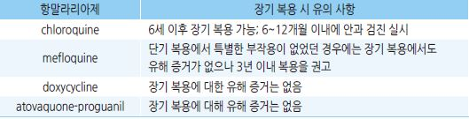

### ￭ 황열 Yellow Fever
- 생백신

- 접종 장소 : 공항검역소, 각 지역 국립검역소, 대학병원 등에서 시행 (☞ 질병관리청 국립검역소-[국제공인예방접종기관](https://nqs.kdca.go.kr/nqs/vaccination.do?gubun=org)) 

### 접종 대상 
- 9개월~59세1) 중 황열 위험 지역2) 여행 또는 거주, 균 노출 직업 

1) 60세 이상에서는 심각한 부작용이 증가하는 것으로 알려져 있음

2) 발생 지역 : 아프리카, 중남미 (☞ [질병관리본부] 국가별 질병정보 http://travelinfo.cdc.go.kr/ )

### 접종 방법
- 접종 시기 : 최소 출국 10일 전

- 용법 : 0.5 ㎖ SC or IM, 1회 (☞ p.1103)

- 재접종은 필요 없음; 황열 예방 접종의 유효 기간은 보통 10년임 

### 금기 및 주의 사항 
- 일반적 금기 사항 (☞ p.1104), 심한 계란 알레르기, 면역 저하, 흉선 질환, 임신/수유부, ＜6개월아, ≥60세

### 이상 반응 
- 국소 : 접종 부위 동증, 발적, 종창.

- 전신 : 빌열, 근육, 위약감, 위장관 증상

### ￭ 콜레라 Cholera
- 경구용 불활성화 백신

### 접종 대상 및 방
- 콜례라 유행 지역* 여행 또는 거주, 균 노출 직업 

**콜레라 유행 국가 : 인도, 예멘, 필리핀, 소말리아, 나이지리아, 남수단, 콩고민주공화국, 탄자니아, 수단, 우간다, 케냐, *

*    앙골라, 모잠비크, 아이티*

- 유행 지역 방문 최소 1주 전 투여 완료

#### ≥6세
- 기초 : 1주 간격 2회;  접종 간격이 6주가 경과한 경우 처음부터 다시 접종

- 추가 : 기초 접종 2년 이내 1회; 기초 접종 후 2년 이상 경과 시 다시 기초 접종 

- 방법 : 발포 과립을 냉수 150 ㎖에 녹인 후 백신을 혼합하여 2시간 내로 경구 복용

#### 2세~＜6세
- 기초 : 1주 간격 3회;  접종 간격이 6주가 경과한 경우 처음부터 다시 접종

- 추가; 기초 접종 6개월 이내 1 회; 기초 접종 후 6개월 이상 경과 시 다시 기초 접종

- 방법 : 발포 과립을 냉수 150 ㎖에 녹여 절반을 버리고 백신을 혼합하여 2시간 내 경구 복용

※ 콜레라에 지속적으로 노출되는 경우 성인은 2년마다, 소아는 6개월마다 추가 복용

※ 백신 투여 1시간 전후로 음식물이나 음료 섭취를 삼가

### 금기 및 주의 사항
- 일반적 금기 사항 (☞ p.1104), 포름알데하이드나 백신 성분에 과민 반응을 나타낸 경우

### 이상 반응
- [위장관] 복통, 설사, 구역, 구토. [전신] 매우 드물게 인플루엔자 유사 증상, 피부 발진, 관절통, 이상 감각

￭ 신증후군출혈열 Hantavirus

- 불활화 백신 [한타박스]

### 접종 대상
- 성인 중 다음 위험 요인 및 환경을 고려하여 제한적으로 접종

  • 군인 및 농부 등 직업적으로 신증후군출혈열 바이러스에 노출될 위험이 높은 집단

  • 신증후군출혈열 바이러스를 다루거나 쥐 실험을 하는 실험실 요원

  • 야외 활동이 빈번한 사람 등 개별적 노출 위험이 크다고 판단되는 자

### 접종 방법
- 기초- 1개월 간격 2회; 추가- 기초 접종 완료 1년 후 1회

- 0.5㎖, 삼각근 IM 또는 상완 외측면 SC

### 금기 및 주의 사항
- 일반적 금기 사항 (☞ p.1104)

- 젤라틴 함유제에 아나필락시스 병력, 임신부, 접종 전 1 년 이내에 경련

- 주의 : 발열, 현저한 엉양 장애, 급성기 또는 악화기의 심혈관/신/간 질환자

### 이상 반응
- 국소 : 가려움, 색소 침착, 발적, 통증, 부종 

- 전신 : 빌열, 권태감, 근육통, 구역

### 특기 사항 
- 접종 전 신증후군출혈열 항체 검사는 필요 없음

- 접종 장소 : 황열과 동일(콜레라 예방접종을 공식적으로 요구하는 국가는 없음)

￭ 공수병 Ravis

- 불활화 백신 [베로랍]

### 접종 대상
- 노출 전 : 고위험군에 동물 접촉 직업, 삼림 감시원, 공수병 환자 접촉, 유행 지역 여행

- 노출 후 : 공수병 의심 동물에 물림 또는 심한 non-bite 상처

### 접종 방법
- 용법 : 0.5 ㎖(1 vial); 유아- 대퇴부 전외측, 성인- 삼각근 IM (☞ p.1103)

#### 노출 전 예방 조치
- 기초접종 : 2회(0, 7일)

- 추가 접종 : 노출 위험도에 따라 혈청 검사 및 추가 접종 여부를 권고

#### 노출 후 예방 조치
1. 면역력이 없는 대부분의 교상 환자

- 0, 3, 7, 14일 접종(총 4회); 면역기능 저하자는 28일에 1회 추가(총 5회)

- human rabies immunoglobulin(HRI)[캄랍]은 0일에 1 회만 투여(20 IU/㎏)

2. 면역력이 있는 교상 환자* : HRI 투여는 필요 없으며 백신만 0, 3일 투여(총 2회)

*　*과거 노출 전 예방 요법올 받았고 정기적으로 추가 접종올 받아 중화 항체가 0.5 1U/㎖ 이상 유지될 경우와 과거에 교상 후 *

*    치료를 적절히 받고 5년이 경과되지 않은 경우*

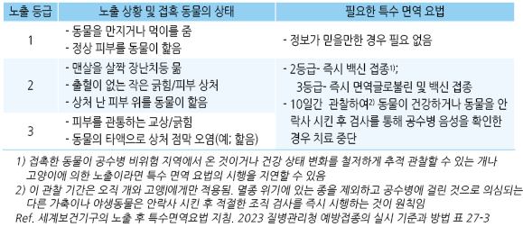

### 이상 반응
- 국소 :  주사 부위 통종, 발적, 부종, 가려움

- 전신 : 두통, 구역, 복통, 근육통, 어지럼, 두드러기, 관절통, 발열

### 금기 및 주의 사항
- 백신 접종의 일반적 금기 사항 (☞ p.1104) 

[[소아 예방접종 일정표] (질병관리청)](https://nip.kdca.go.kr/irhp/infm/goVcntInfo.do?menuLv=1&menuCd=115)**
**

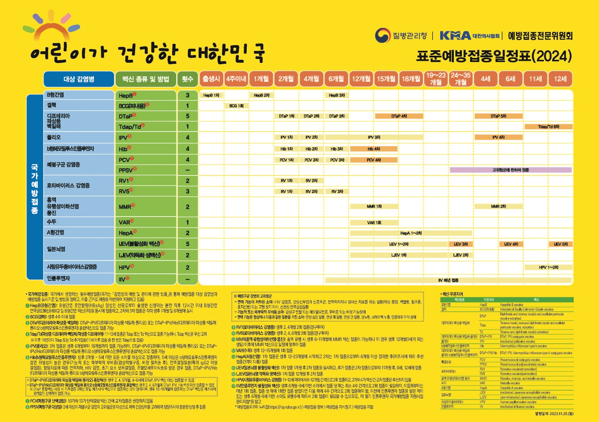

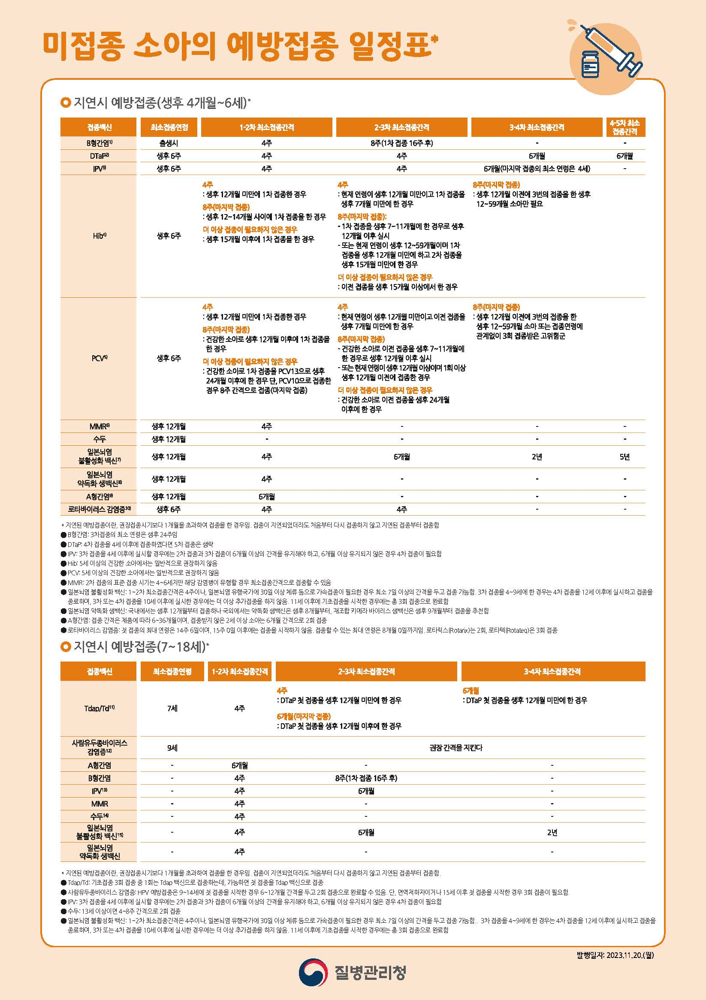

**[[CDC 예방접종 일정표](https://www.cdc.gov/vaccines/schedules/index.html)]**

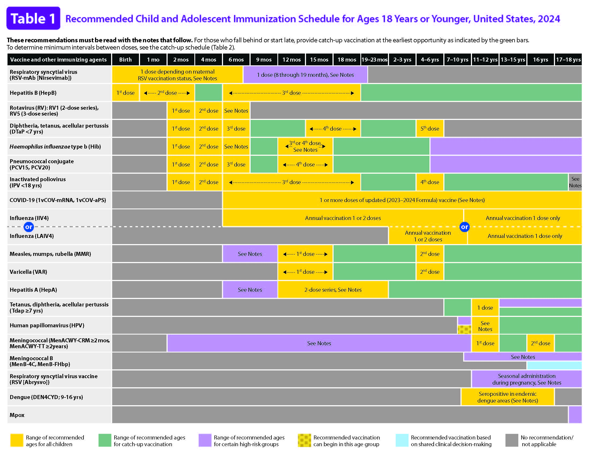

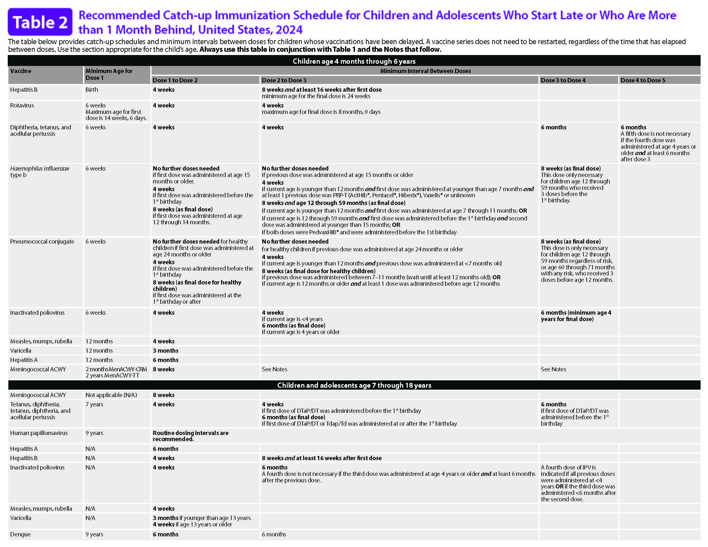

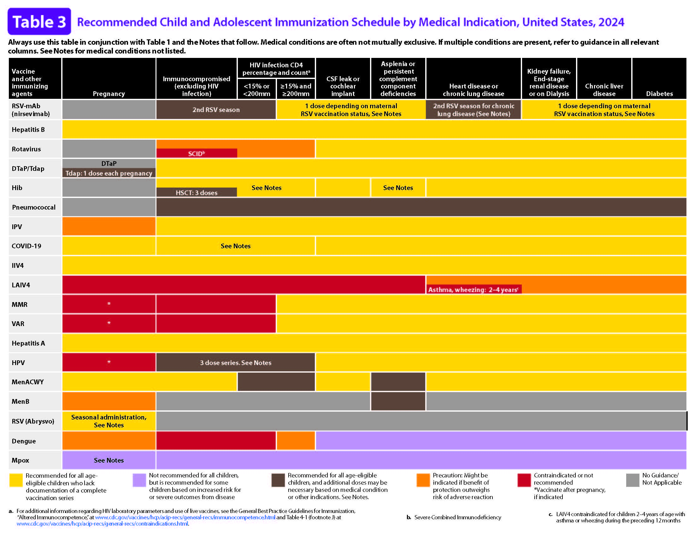

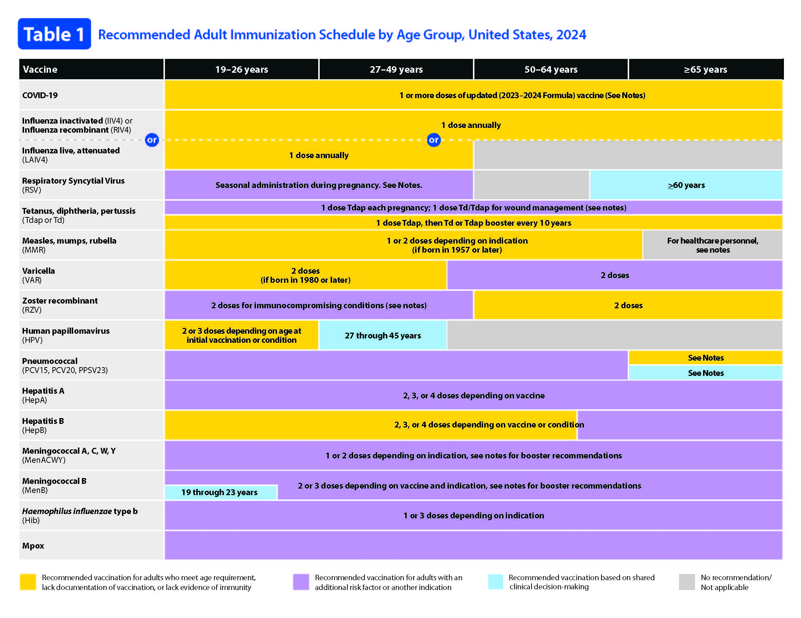

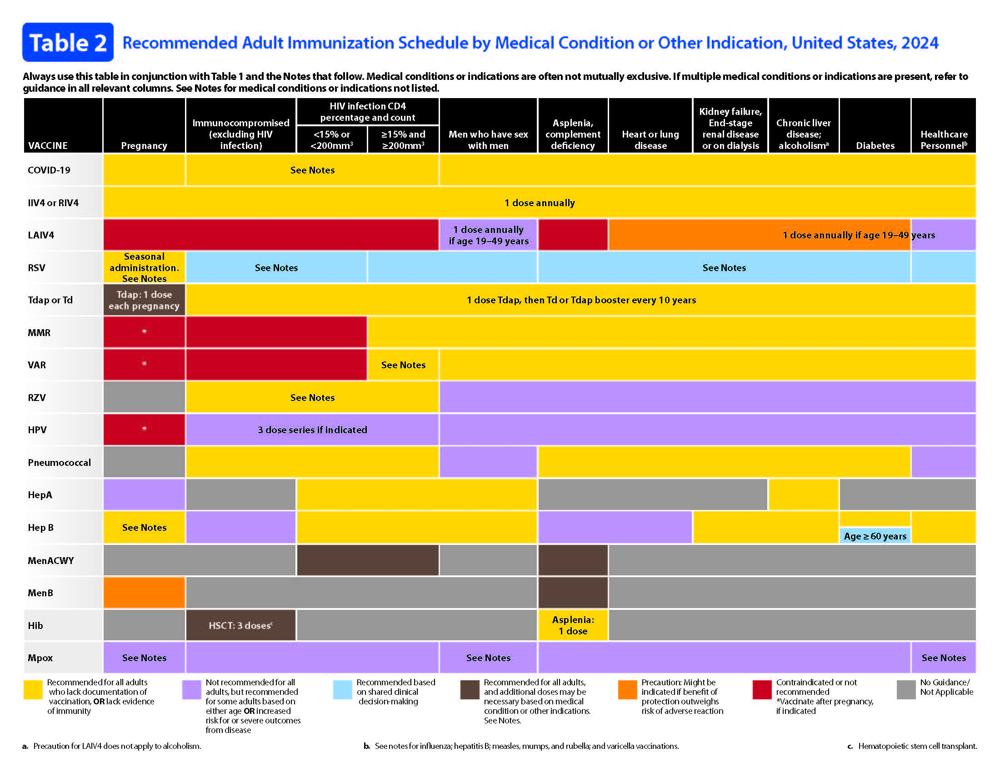
