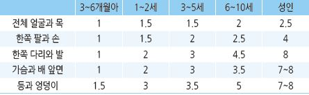
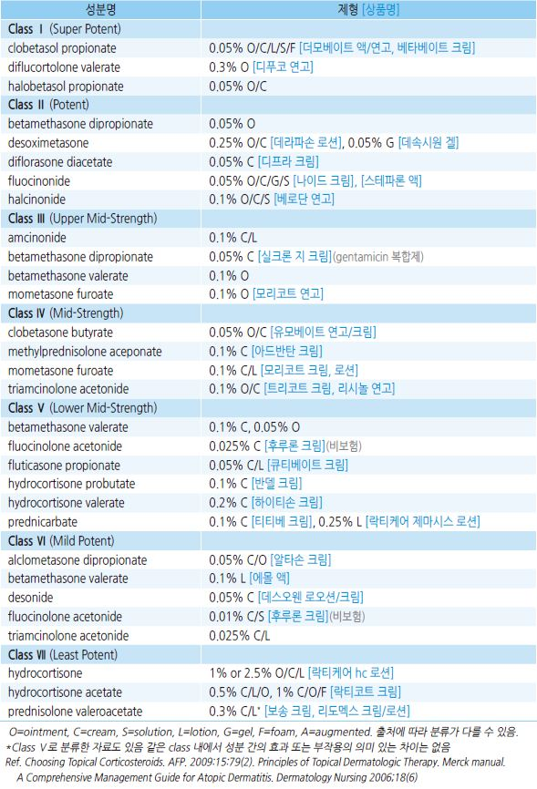
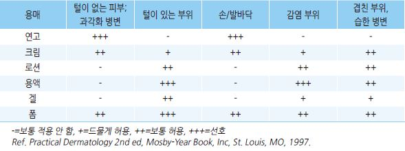

# 국소 스테로이드 Topical Corticosteroids

>

### 사용 빈도

*   보통 하루 2회 도포; 일반적으로 도포 횟수를 늘려도 효과가 증가되지 않음

    •손바닥 등 약제가 쉽게 닦여 나가는 부위는 도포 횟수를 늘리고 두피, 겹친 부위 등 약제가 닦여 나가지 않는 부위는 도포

    횟수를 줄임
* 같은 부위에 지속 사용해야 하는 경우에는 저역가 선택 또는 pulse therapy를 고려
* 건조한 피부 또는 펄스 요법 사이에 피부 보습제을 사용하면 steroid 사용을 줄일 수 있음 (☞ p.867)

\*\* Pulse therapy\*\*

•적용 : 지속 사용이 필요한 병소(예: 도포하면 호전되고 중단하면 악화되는 병소)에 대한 간헐적 도포로 사용 횟수 및 양을

```
줄이면서 악화 또는 재발을 막을 수 있음
```

•용법 : 1주에 연속된 2일간(예: 주말) 또는 정해진 요일(예: 화 & 금요일)에 bid 도포; steroid 비사용 기간 중에는 보습 크림

```
적용
```

> ✽재발 예방을 위한 주 2일 도포 시 비 연속된 2일보다 연속된 2일 도포가 효과적이라는 보고가 있음 •중간 역가 선택 시 최소 20주간 안전하게 pulse therapy 적용 가능

### 사용량

* 전신 부작용이 발생하지 않는 국소 steroid 한 달 사용량 : 영아 15 g, 소아 30 g, 성인 60\~90 g
* 성인에서의 사용량 기준

> 0.5 FTU : 음부, 한쪽 손바닥(손가락 포함); 예) 1일 2회 1주 도포 시 7 FTU(= 3.5 g) 필요 1 FTU : 양손바닥, 한쪽 손 전체(손바닥 & 손등), 팔꿈치(안팎)

1.5 FTUs : 양발바닥(발가락포함), 한쪽 발전체, 무릎(안팎)

2.5 FTUs : 얼굴과 목

3 FTUs : 두피

4 FTUs : 엉덩이

> ✽FTU(finger tip unit) : 출구 지름 5 ㎜ 튜브에서 성인 검지 끝부터 DIP finger crease까지 직선으로 짜낸 양;

> ```
> 1 FTU=약 0.5 g, 성인 체표면의 2% 도포
> ```

*   연령별 부위별 Steroid 1회 도포량 (FTU)

    

### 강도에 따른 국소 Steroid의 분류

```

```

### 국소 Steroid 선택 요소

#### 질환

* 최고역가 (ClassⅠ) : 다른 치료로 호전되지 않는 심한 병소에 대하여 단기 사용
*   고역가 (ClassⅡ,Ⅲ) : 원형탈모증, 아토피, 원반모양 루푸스, 각화과다습진, 태선, 동전습진, 습한 접촉피부염, 건선,

    심한 손습진
*   중간 역가 (Class Ⅳ,Ⅴ) : 심한 항문 주위 염증, 건조 습진, 아토피, 태선(겹친 부위), 동전습진, 옴, 지루피부염, 심한 피부염,

    심한 피부 스침(단기), 정체 피부염
* 저역가 (Class Ⅵ,Ⅶ) : 기저귀 피부염, 얼굴 부위 피부염, 피부 스침, 항문 주위 염증

#### 병소 부위/상태

*   저역가 : 피부가 얇고 습기가 많고 위축이 빨리 오는 부위(예: 얼굴, 외음부, 겹치는 부위)

    •영아, 소아(전신 흡수의 위험성이 큼) : 저역가
* 고역가 : 두꺼운 피부(두피, 몸통, 사지, 손발바닥), 두꺼운 병변(건선플라크, 태선화), 중증

#### 매개체/용매

* 병변의 특성(예: 습한 정도, 부위), 환자의 선호도에 따라서 결정
*   연고 : 기름 비율이 높고(80%) 윤활 및 밀폐 작용이 있음, 동일 성분에서 효과와 부작용이 가장 많음, 모낭염 발생 위험이

    보다 많음; 연고 제품은 보통 방부제를 함유하고 있지 않으므로 손의 직접 접촉을 피함(예: 주걱 사용)

    •적용 : 건성 및 과각화 병변

    •회피 : 털이 있는 곳, 겹친 부위, 삼출성 병변
* Paste : 연고보다 덜 기름짐; protective barrier 작용
* 크림 : oil:water=50:50의 반고체
* 겔 : 젤리 같은 상태, 보통 alcohol-based
* 로션 : 알코올 용매로서 증발하면서 냉각 및 건조 작용이 있음; 습하거나 가려운 병변에 유용
* 용액 : 물 또는 알코올 용매의 액상 제제
* 폼, 무스, 샴푸 : 두피 적용
* 크림, 겔, 로션, 용액은 보통 알코올을 함유하고 있어 피부를 건조하게 할 수 있음; 습하거나 삼출성 병변에 적용

#### 신체 부위에 따른 용매 선택

```

```

### 작용 시간

* 단기 작용(8\~12시간) : hydrocortisone
* 중간 작용(12\~36 시간) : prednisolone, methylprednisolone, triamcinolone
* 장기 작용(36\~72 시간) : dexamethasone, betamethasone

### 사용법에 따른 영향

* hydration : 흡수 증가; 샤워 후 적용 시 효과 및 부작용 증가
*   밀폐 요법 : 도포 후 plastic wrap으로 감쌈, 손은 도포 후 비닐장갑 착용; 흡수를 여러 배 증가시키지만 자극감과 모낭염

    등이 발생할 수 있음

### 부작용

* 표피층 얇아짐, 모세혈관확장증, 피부 위축 : 회복 가능
* 진피층까지 위축 시 선(striae) 발생 : 회복 안 됨
*   부작용 호발 조건 : 겹친/밀폐 부위 또는 밀폐 요법, 얇은 피부(얼굴, 손등, 사타구니), 고령, 고역가, 장기 사용

    •수 주\~수개월 이상 지속적으로 사용할 경우 국소 부작용 발생

    •고역가 제제(특히 불소 함유 제제)로 2\~4주 이상 사용 시 국소 부작용 발생 가능

    •저역가 제제로 1달 이내 사용 시 보통 국소 부작용은 발생하지 않음

> ✽1일 1\~2회 도포 시 최대 연속 적용 기간 : 초고역가- 3주, 고/중등-12주, 저역가-제한 없음

> ```
> (Ref. Topical corticosteroids: Choice and Application. AFP 2021;103(6))
> ```

### 임신 중 국소 Steroid 사용

* 중/저역가 국소 steroid 사용으로 인한 유의미한 태아 위험 증가는 없는 것으로 판단함
* 필요한 경우 저역가 제제로 최소량, 단기간 사용
* steroid-항생제 복합제는 태아에게 위험 가능성 있음

\*\* Corticosteroid 태반 통과율\*\*

* prednisolone : 10\~12%
* hydrocortisone : 15%
* betamethasone : 28\~33%
* methylprednisolone : 44.6%
* dexamethasone : 67%

### 보습제와 병용 시 도포 방법

* 크림 보습제 사용 15분 후, 연고 보습제 사용 15\~30분 전에 steroid 도포

## ￭ Calcineurin Inhibitor

### 적용

* 비스테로이드성 항염증제(topical immunomodulatory agent)로서 2차 선택
* 대상 : 국소 steroid에 반응하지 않거나 증상 완화 후 steroid 사용을 줄이려는 경우
* 눈꺼풀, 사타구니 등 얇거나 겹친 부위에 사용 가능

### 부작용

* 작열감, 가려움, 발적

✽수개월 이상의 장기 사용에 따른 면역 관련 및 피부암 발생과 관련된 논란이 있으나 명확히 입증되지 않음

### 용법

* 보통 1일 2회 도포
* 단기 또는 간헐적 사용으로 제한; 재발 감소 목적의 경우 주 2일 사용
* 노출 부위 사용 시 자외선 차단을 권고
* steroid 도포제와의 병용은 유용하지 않음

### 종류

* 아토피 피부염에 대하여 약제간의 효과 차이는 명확하지 않음

#### Pimecrolimus

* 1% 크림 : 저역가 steroid의 상응 강도, ≥2세 허가 \[엘리델]

#### Tacrolimus

* pimecrolimus보다 빠른 효과 발생, 가려움 감소에 보다 효과적 \[프로토픽]
* 작열감 부작용은 보다 많음(차츰 호전)
* 0.03% 연고 : 저역가 steroid 상응 강도, ≥2세 허가
* 0.1% 연고 : 중간 역가 steroid 상응 강도, ≥16세 허가

> (✽ 보험기준: 엘리델은 경증-중등증, 프로토픽은 중등증\~중증 아토피 피부염의 2차치료제로 허가)
