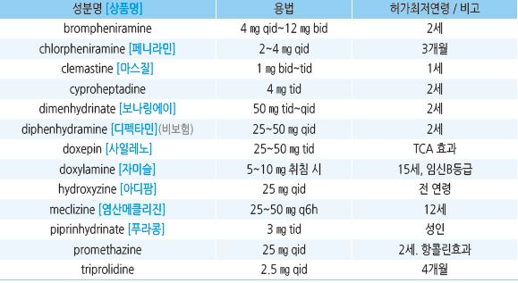
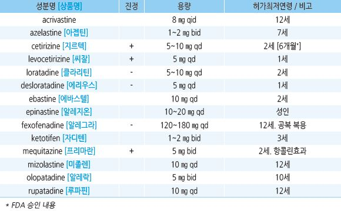

# 항히스타민제 Antihistamines


## 1세대

```

```

## 2세대

```

```

## 항히스타민제 효과 비교

> ```
> Ref. Drug class review: Newer antihistamines: Final report update 2. Oregon health & science university. 2010.
> ```

> ```
> ✽연구 결과가 많지 않아 비교의 신뢰도는 제한적임
> ```

#### 계절성 알레르기비염

* azelastine nasal spray＞cetirizine
* fexofenadine＞loratadine
*   다음 항히스타민 간의 의미 있는 효과 차이는 없음 : cetirizine, levocetirizine fexofenadine, loratadine,

    desloratadine, azelastine nasal spray, olopatadine nasal spray

#### 다년성 알레르기비염

*   다음 항히스타민 간의 의미 있는 효과 차이는 없음 : cetirizine, levocetirizine, loratadine, desloratadine,

    azelastine nasal spray

#### 만성 특발성 두드러기

* levocetirizine＞desloratadine
* loratadine＞cetirizine
* cetirizine＞fexofenadine

#### 소아 다년성 알레르기비염

* cetirizine＞loratadine, levocetirizine

## 부작용

* 항콜린 : 입/눈 마름, 발기 저하, 소변 저류, 녹내장
* 중추 신경계 : 졸음, 인지 장애
* 체중 증가, 과민, QT 간격 연장, 심실성 부정맥
* 주로 1세대 제제에서 부작용 발생; 고령자에서는 1세대 제제 투여를 주의
