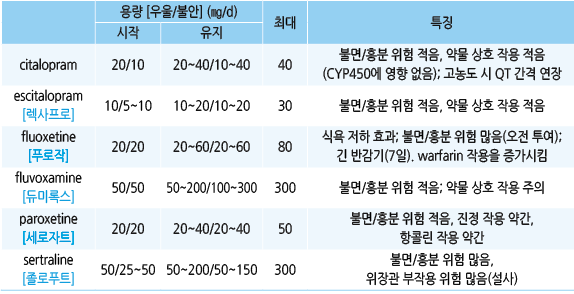
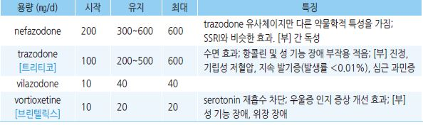
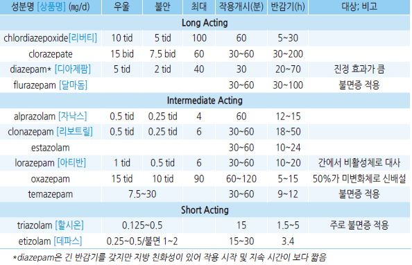
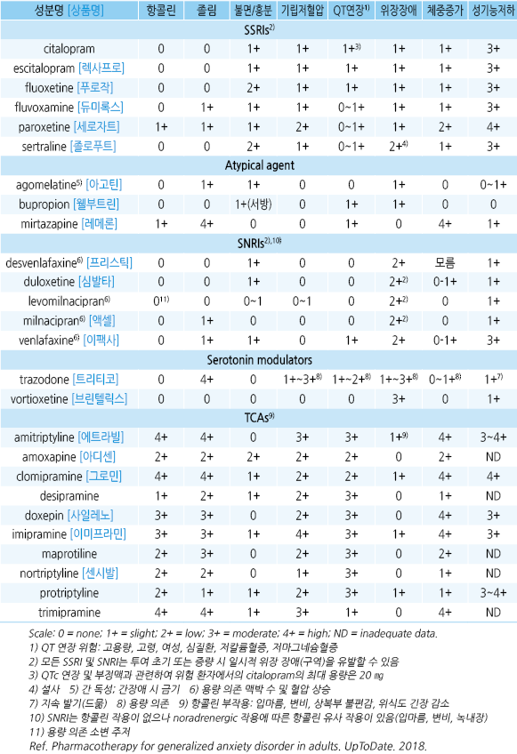
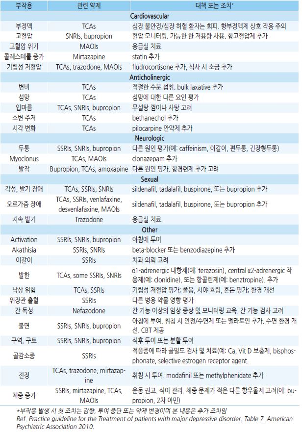
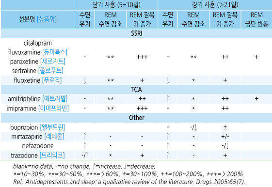
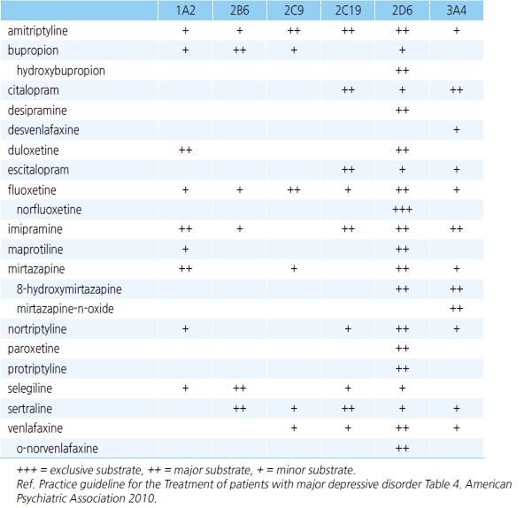

# 항우울제, 항불안제 Antidepressants & Anxiolytics

#### 

## 종류
- 우울증 치료 시 저용량으로 시작하여 점차 증량 (보험기준 ☞ p.1176)

- 고령, 신/간 장애 환자에서는 일반 용량보다 저용량에서 시작

- 여러 항우울제가 젊은 연령에서 성 기능 저하 부작용 문제를 일으킬 수 있음; bupropion/mirtazapine로 교체하거나

    성 관계 시 약물 복용을 일시 중단 또는 PDE5i(☞ p.708) 복용 고려

- 금단 증상을 유발할 수 있음(지속형에서는 덜 함); 중단 시 수 주간의 tapering 필요

### Selective Serotonin Reuptake Inhibitor(SSRI)
    

- 우울증에 대하여 TCA와 효과는 비슷하며 부작용은 적음

- 효과 발현까지 2~4주 이상 소요

- 용량과 효과가 비례하지 않음

- 하루 한 번 복용 시 보통 아침 투여

- 부작용 : 위장관 부작용(구역, 설사, 가슴쓰림), 성 기능 장애(성욕 감소, 절정감 지연), 두통, 불면증/졸림,

    serotonin syndrome. CYP450 억제, 항콜린 작용(입마름, 구역, 변비, 소변 저류), 출혈

    (citalopram과 sertraline은 warfarin과 병용 시 안전)

Serotonin syndrome

- 지나친 serotonin 작용에 의해 고열, 고혈압, 떨림, 설사, 흥분, 두통, 경련, 혼돈, 사망 등이 발생하는 증상군(드묾)

- 약물의 빠른 증량, 세로토닌 효과 약물 병용, 고령에서 위험 증가

** Serotonin syndrome 위험 약물**

- serotonin 형성↑ : tryptophan

- serotonin 분비↑ : amphetamine(fenfluramine, phentermine), levodopa

- serotonin 대사 억제 : MAOI

- serotonin 작용제 : buspirone, triptans, ergotamine, fentanyl

- reuptake 억제 : bupropion, carbamazepine, dextromethorphan, meperidine, metoclopramide, pentazocine, sibutramine,

    St. John’s wort, TCA, tramadol, trazodone, valproate, 5-HT3 흡수 억제제(ondansetron)

- postsynaptic 수용체 민감성↑ : lithium

### Serotonin-Norepinephrine Reuptake Inhibitor(SNRI)
    

- 항우울 효과에 있어서 SSRI와 유의한 차이 없음; 일부 약제는 불안증에 적용 안 됨

- SSRI에 비하여 만성 통증(예: 당뇨병성 말초신경병증성 통증, 섬유근육통) 감소 효과가 있음

- 부작용 : 구역, 입마름, 불면, 졸음, 변비, 피로, 어지럼, 혈압 상승(duloxetine은 덜함)

- 용량과 효과/부작용이 비례함

Serotonin modulator

    

- 우울증 적용(불안증에는 적용 안 됨)

Tricyclic Antidepressant(TCA)
    

- 효과 : 항우울/항불안. 중증 우울증에 대하여 SSRI보다 유효; 공황장애, 통증 증후군에도 유효

- 치료 반응 사이의 관계가 명확함; 저렴함

- 수면 유도 목적 시 취침 2시간 전 복용

부작용
- 항콜린 : 입마름, 변비, 소변 저류, 흐려 보임, 장 마비, 성 기능 장애, 녹내장, BPH

- 심혈관 : 두근거림, 기립성 저혈압, 고혈압, 부정맥, 심장 전도 장애, 심근경색

- 위장관 : 구역, 구토, 소화불량, 식욕 부진, 미각 변화

- 신경계 : 운동 실조, 떨림, 이상 감각, 의식 혼탁, 졸림

** 부작용 대처**

- 2차 amine 선택. 저용량으로 시작하여 점차(1주 간격) 증량

- 졸음 : 취침 시 투여; 아침 졸음이 있는 경우 저녁 투여

- 투여 전 ECG 검사, 혈압/맥박 모니터링

#### 주의/금기
- 심질환(특히 전도 장애), 심한 위장 기능 장애

#### 약물 상호 작용
  •제산제- 항우울제 흡수↓ •cimetidine- 항우울제 혈중 농도↑ •insulin- 혈당↓

  •digitalis- 심장 전도 장애 위험↑ •항응고제- hypoprothrombinemic effect↑

### Atypical antidepressant
- 우울증 적용(불안증에는 적용 안 됨)

#### Bupropion
- 작용 : norepinephrine & dopamine reuptake inhibitor(NDRI)

- 단점 : 효과 발현에 오래 걸림(≥2주). SSRI에 비하여 우울/불안 치료 효과 낮음

- 장점 : 항콜린, 진정, 기립성 저혈압, 체중 증가, 성 기능 저하 등의 부작용 없음. 내성 발현이 적고 의존성이 상대적으로

    거의 없어 tapering이 비교적 용이함. 금연 치료 효과가 있음

- 부작용 : 불면증, 입마름, 어지럼, 불안, 떨림, 빈맥, 두통, 구역, 변비, 소화불량, 발작

- 금기 : 발작 질환자, 섭식장애자

#### Mirtazapine
- 작용 : norepinephrine & specific serotonergic antidepressant(NaSSA); 5-HT3 수용체 길항, 강한 항히스타민 작용이 있음

- 효과 : SSRI와 비슷한 효과. 성적 부작용, 위장 장애가 SSRI보다 적음. 진정 효과는 낮은 용량에서 보다 뚜렷함

- 부작용 : 졸림, 어지럼, 식욕 증진, 체중 증가, 입마름, 지질 이상

### Benzodiazepine
    

- 적용 : 2차 약제 또는 타 약제의 약효가 발현될 때까지 보조 약제로 고려

- 부작용 : 진정, 피로, 운동 실조, 발음 장애, 기억력 장애, 쇠약감, (호흡기 질환자에서) 호흡 억제

- 의존/남용 위험 : 고용량, 장기 사용, 고령, 알코올 의존자에서 흔함; ≤4주로 사용 제한

  •고령에서는 내성 및 사고 위험으로 감량 사용

- 금단 증상 : 우울, 불안, 처짐, 땀 흘림, 자율 신경 각성

- 짧은 반감기 약제 : 주간 불안, 이른 아침 불면, 반동성 불안, 불면을 유발할 수 있음

  •중단 시 반동 현상 예방을 위하여 긴 반감기 약제로 교체하면서 감량

- 긴 반감기 약제 : 진정, 인지 장애, 정신 운동 저하를 유발할 수 있음

  •중단 시 반동 현상 예방을 위하여 6~12주에 걸쳐 1~2주에 10%씩 감량

- 대사 : 대부분 간 CYP(예외: lorazepam, oxazepam)

### 항경련제
    

- 1주 내 작용

- 부작용 : 구역, 어지럼

> ✽불안, 우울에 대하여 보험 적용 안 됨

### 대체 요법
- 일반적으로 의미 있는 효과는 없으나 선호하는 환자에서 사용

- St John’s wort : 경증 우울증에 대한 효과가 일부 입증되었으나 치료 적정량 및 효과의 지속 여부에 대한 연구가 미흡하며

    다른 약물과의 상호 작용 문제로 처방 권고 안 함 [NICE] [페리시]

## 약물 특성
    

부작용 및 대처

    

### 수면 작용
    (☞ p.138)

    

### 항우울제의 Cytochrome P450 효소 대사
    

### 항우울제에 의해 저해되는 Cytochrome P450 효소
    
