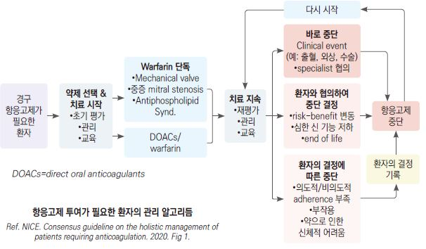

# 항혈전제, 항응고제 Anti-thrombotics, Anti-coagulants

### 

## 항혈소판제 Antiplatelet
    (보험기준 ☞ p.1187)

### Aspirin
- 기전 : COX-1 불활성화

#### 효과
- 심장 마비의 위험 감소

- 뇌졸중 발병 위험 및 심혈관 질환 사망 위험에 대한 영향 : 논란

- 암에 대한 영향 : 논란

  •aspirin이 암세포의 자기 파괴를 유도하거나 암을 촉진시키는 염증을 줄인다는 보고가 있는 반면,

    aspirin이 고령 암 환자의 전이 및 사망 등 later stage에 악영향을 미칠 수 있다는 보고가 있음

#### 용량
- 75~162 ㎎/d

- 빠른 혈소판 억제가 필요한 경우 : 초회 ≥160 ㎎

- NSAID와 병용 시 부작용을 줄이기 위하여 NSAID 복용 최소 2시간 전에 aspirin 복용을 권고

#### 부작용
- 소화불량, 위염, 소화성 궤양, 기관지 경련, 간 독성, 신 독성

- 출혈 : 중대한 출혈 위험도- 1~3%/년; 소화성 궤양 합병증 병력자 재출혈 위험도- 15%/년

#### 금기
- 출혈 위험이 높은 경우(소화성 궤양 병력, ≥65세, NSAID/steroid/항응고제 투여 중), 국소 출혈, 출혈성 소인,

    aspirin 과민 반응

#### 예방적 투여 대상
심혈관 질환 예방 목적의 Aspirin 투여 [USPSTF 권고안](2022)

- ≥60세에서의 CVD 일차 예방을 위한 저용량 aspirin 투여 개시는 권고하지 않음

- ASCVD 10년 위험도가 ≥10%인 40~59세에서의 CVD 일차 예방을 위한 저용량 aspirin 투여 시작 결정은 개별적으로

    결정되어야 함(이득에 대한 증거가 적음. 출혈 위험이 높지 않고 매일 저용량 aspirin을 복용할 의사가 있는 사람들은

    이득이 보다 많을 수 있음)

>     ✽ASCVD 10년 위험도 계산 툴
    ✽[CV/GI risk calculator](https://asarisk.doctime.es/calculator/en) 

** ADA 권고안** (2022)

- 심혈관 질환 위험이 높은 당뇨병 환자*에서 1차 예방 목적으로 득실을 검토하여 고려

>     *최소 한 가지 주요 위험 인자(조기 죽상경화성 심혈관 질환 가족력, 고혈압, 이상지질혈증, 흡연, 알부민뇨)를 가진

>     ≥50세 당뇨 환자를 포함
- 당뇨 및 ASCVD 병력이 있는 환자에서 2차 예방을 위하여 투여

  •aspirin에 알레르기가 있는 경우 clopidogrel 75 ㎎/d 투여 [플라빅스]

- 급성 관상동맥병 후 1년간(필요시 1년 이상) aspirin & P2Y12 억제제(ticagrelor) 병용

- 관상동맥 중재 과거력, 높은 허혈 위험이 있고 출혈 위험이 낮은 환자에서 주요 심혈관 사고 예방을 위해

    dual antiplatelet therapy 장기 치료를 고려

- 관상 &/or 말초 동맥 질환이 안정적이고 출혈 위험이 낮은 환자에서 주요 사지 및 심혈관 사고 예방을 위해

    aspirin + 저용량 rivaroxaban 고려

### Thienopyridine
- 기전 : ADP 수용체 대항제

- 대사 : 간 CYP450

- 효과 : 심혈관 사망, 심근경색, 뇌졸중 발생을 감소시킴; 투여 수일 후부터 효과 발현

- aspirin 병용 투여 대상 : 관상동맥 스텐트 삽입 환자, 불완전 협심증

#### Ticlopidine
- 적용 : aspirin 내성 시 대체 투여 또는 관상동맥 스텐트 삽입 후 aspirin과 병용 투여

- 단점 : 작용 시작이 늦어 급성 심근경색에는 추천되지 않음

- 부작용 : 설사, 피부발진, 백혈구 및 혈소판 감소증; 사용 수개월 이내 발생

- 용법 : 250 ㎎ bid [티클로돈]

#### Clopidogrel
- 장점 : ticlopidine보다 효과 및 부작용에서 우수

- 단독 또는 aspirin 병용 시, aspirin 단독에 비하여 비슷하거나 약간 더 효과

- 단점 : 이 약제에 반응하지 않는 내성 환자가 존재함

- 부작용 : 소화기, 혈액 부작용; 상대적으로 적음

- 용법 : 75 ㎎ qd. 신속 효과 발현을 위하여 초회 300 ㎎ 투여 [플라빅스]

•복합제 : clopidogrel 75 ㎎ + aspirin 100 ㎎ [클라빅신 듀오]

#### Prasugrel
- 장점 : clopidogrel보다 효과 우수

- 장에서의 흡수율이 높고 빠르고 타제제보다 빠르게 작용하며, 대사 활성률이 높음

- 부작용 : clopidogrel보다 치명적 출혈 발생이 많음

- 주의 : 체중 ≤60 ㎏, ≥75세, 신장애 환자

- 금기 : 뇌혈관 질환력 환자

- 용법 : 10 ㎎ qd [에피언트]

### Dipyridamole
- 기전 : cAMP 분해 차단

- 작용 : 약한 항혈소판 작용, 뇌졸중 예방

- 부작용 : 소화 장애, 두통, 안면 홍조, 어지럼증, 저혈압, 혈관 확장(관상동맥병 환자에서 주의)

- 용법 : 75~100 ㎎ tid~qid; aspirin 25 ㎎ + dipyridamole 200 ㎎ 복합제 [디피아녹스]

### P2Y12 억제제
- 장점 : clopidogrel에 비하여 우수; aspirin 대비 MI 감소 우수(OR 0.81), 뇌졸중 및 모든 원인 사망은 비슷하게 감소

- ticagrelor : 초회 180 ㎎, 이후 90 ㎎ bid (aspirin 75~100 ㎎/d와 병용) [브릴린타]

### PAR-1 억제제
- vorapaxar, atopaxar

## 항응고제 Anticoagulant

### 환자 평가(초기 평가/재평가)
1. Patient profile : 적응증, 동반 질환, 출혈 위험, 교정 가능한 위험 인자, 대사 평가(예: CBC, LFT), 체중,

    Cr clearance(Cockcroft-Gault)

2. Practical considerations : 다제약물/약물 상호 작용, 다른 약물 빈도

- 항응고제 사용 퇴원 환자에 대한 리뷰 : 투여 이유, 지속 필요 여부, 체중, 신 기능, 용량의 적절성, 순응도, 다른 약물 관계

- 출혈 위험 평가 : HAS-BLED score(다음 각 항목 1점)

  ① Hypertension(uncontrolled, SBP ＞160 ㎜Hg)

  ② Abnormal renal function: dialysis, transplant, Cr ＞2.26 ㎎/㎗ or ＞200 μ㏖/L

  ③ Abnormal liver function: cirrhosis or bilirubin ＞2×ULN or AST/ALT/AP ＞3×ULN

  ④ Stroke: stroke 과거력

  ⑤ Bleeding: 주요 출혈 병력 또는 출혈 경향

  ⑥ Labile INR: unstable/high INR, time in therapeutic range ＜60%

  ⑦ Elderly: ＞65세

  ⑧ Drugs: 과음(≥ 8 SD/주)

  ⑨ Drugs: 출혈 경향 약물 사용(예: aspirin, clopidogrel, NSAID)

  ▶판정: 주요 출혈의 1년 위험도 0점-1%, 1점-3.4%, 2점-4.1%, 3점-5.8%, 4점-8.9%, 5점-9.1%, ≥6점-12~15% per year

    ☞ [온라인 계산기](https://www.mdcalc.com/has-bled-score-major-bleeding-risk#next-steps) 

### 관리
- 약물의 종류 및 용량 결정

- 환자와 권고 사항 및 환자 선호도 협의

- F/U : 순응도, 부작용, 임상 상태의 변화

### 수술 전 항응고제 약물 중단
- 혈전 질환 고위험군에서의 표재성 시술 시 중단 없이 유지 가능

- 항응고제, 지속성 NSAID(예: celecoxib)- 1주 전; NSAID- 3일 전; 속효성 NSAID(예: ibuprofen)- 1~2일전 중단

- warfarin : 위험 정도에 따라 중단

  ① 혈전증 과거력 없는 저위험 심방세동 환자 : 수술 3~4일 전 중단

  ② 폐색전증, 인공 판막, 심부정맥혈전증 병력의 고위험군 : warfarin 중단 중 대체 방법 사용

    (low-molecular-weight heparin, regular heparin)

### 수술 후 항응고제 사용 재개
- warfarin : 수술 후 바로 사용

- heparin : international normalized ratio(INR) 등 지표 고려

- aspirin 및 기타 antiplatelet 약물 : 수술 24시간 이후 재개

### Warfarin
- 기전 : coumarin 유도체, Vit K 대항제; Vit K의 활성형 전환을 억제하여 항응고 작용을 발현

- 응고 모니터링 : INR 2~3 유지(인공심장판막환자- 2.5~3.5)

  •INR ＜1.7 시 심장색전성 뇌졸중 위험, ＞4.5 시 출혈 증가

- 5~10 ㎎/d로 시작하여 매일 INR 검사, 용량 조절. 안정적인 경우 2~3주마다 확인

- 부작용 : 출혈; 특히 고령 환자에서 두개 내 출혈 위험

### DOAC(direct oral anticoagulant), NOAC(non-vitamin K antagonist oral anticoagulant)
- 직접적으로 응고인자를 억제

#### Thrombin 억제제
- 용량 조절을 위한 주기적 혈액 검사 필요 없음

- dabigatran etexilate : 150 ㎎ bid [프라닥사]

#### Xa factor 억제제
- rivaroxaban : 10~20 ㎎ qd [자렐토]

- apixaban : 2.5~5 ㎎ bid [엘리퀴스]

- edoxaban : 15 ㎎ [릭시아나]

    
