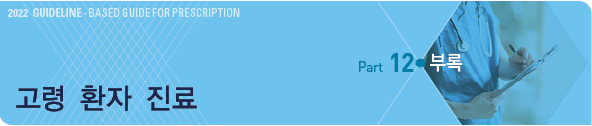
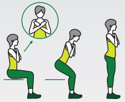
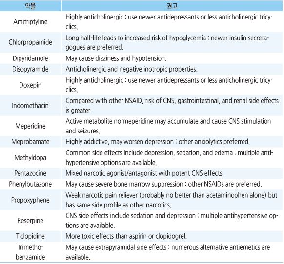
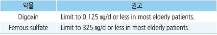
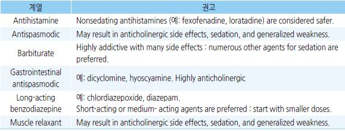
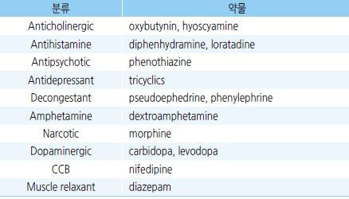

# 고령 환자 진료



**■ 낙상 Fall**

* 보행과 균형의 장애, 노화, 다약제, 우울증, 인지 장애, 급성 질환, 기저 질환, 환경적 요인 등의 다인자 증후군
* ≥75세 사고 사망의 70%를 차지
* 발생률 : 지역 사회 노인- 30\~40%(2/3는 예방 가능); 요양원/병원 입소자- 50%
* 낙상 노인의 6~~7%에서 골절 발생, 20~~30%에서 움직임을 제한 받는 부상 발생
* ≥85세는 60~~65세에 비해 골절 위험이 10~~15배 높음
* 낙상의 50% 이상이 위험 환경과 관련; 낙상의 70%가 집에서 발생(특히 내려가는 계단)

### 원인/위험 요인

*   intrinsic : 연령, 허약, 기저 질환(심혈관, 신경, 근골격, 내분비, 대사 질환), 감염, 약물

    • 약물 : benzodiazepine, 수면제, neuroleptics, 항우울제, 항경련제, 항부정맥제, 항고혈압제, 마약성 진통제
* extrinsic : 어두운 조명, 전선(줄), 가구, 맞지 않는 신발, 고르지 않거나 미끄러운 바닥
* 활동 : 장애물에 걸림, 무거운 물건 운반, 계단 내려감, 급회전, 사다리 사용

※ 지역사회 노인은 환경적 요인, 요양원 입소자는 혼란, 보행 장애, 기립저혈압이 중요

※ 기립저혈압은 낙상의 주요 위험 요인이며, 특히 기립 후 4\~6분에 발생하는 delayed orthostasis은 낙상 위험이

```
더 높다는 보고가 있음
```

### 위험도 평가 및 검사

* 최근 1년간 낙상 반복, 보행 또는 균형의 어려움이 있는 경우 낙상 위험 평가가 필요
* 병력 : 낙상 발생 상황, 위험 요소, 급만성 의학적 문제(골다공증, 요실금, CVD)
* 실험실 검사 : CBC, 혈당, 전해질, TFT, LFT, Vit B 9/12, Vit D, ESR, U/A, stool guaiac
* 기타 검사 : 시력, 청력, 근력, 유연성, 관절 기능, 말초 신경, 24hr 혈압, ECG, echocardiography, brain/C-spine CT/MRI, CXR
* 이학적 검사 : Timed Up & Go, 30-sec Chair stand, 4 stage Balance test

(1) Timed Up & Go(TUG) 검사

* 이동 능력 평가 도구; 걷는 속도, 의자에서 일어나기, 회전 능력 평가
* 준비물 : 팔걸이 의자, 줄자/테이프(의자에서 3 m 앞에 위치 표시), 스톱워치
* [방법](https://www.cdc.gov/steadi/pdf/TUG_test-print.pdf) : 의자에서 일어나서 3 m 앞까지 걸어갔다 돌아와서 의자에 다시 앉는 시간을 측정
* 평가 : 건강한 노인들은 보통 ≤10초 소요; ≥14초 시 낙상 위험(CDC STEADI에서는 12초)



(2) 30-second Chair Stand 검사

* 하지 근력 및 지구력 평가
*   [방법](https://www.cdc.gov/steadi/pdf/STEADI-Assessment-30Sec-508.pdf) : 팔걸이가 없는 의자 중앙에 양손을 반대편 어깨에 얹고

    허리를 곧게 세운 상태에서 30초 동안 앉았다 일어나는 것을 반복
*   평가 : 나이 성별에 관계없이 11회를 임계치로 잡았을 때 미래 낙상에 대한

    민감도는 68%, 특이도는 54%

(3) 4-stage Balance 검사

* 신체 정적 균형 평가
*   \[방법]\(https://www.cdc.gov/steadi/pdf/4-Stage\_Balance\_Test-print.pdf" target) : 눈을 뜨고 지팡이 등 보행 보조 기구를 사용하지 않은 상태로

    다음 각 단계에서 10초간 평형을 유지

    ① 양 발을 모아 안쪽 옆면을 완전히 붙인 자세,

    ② 한쪽 발을 약간 앞으로 내밀어 뒤쪽 발의 엄지발가락을 앞쪽 발 안쪽에 닫게 하는 자세,

    ③ 한쪽 발을 다른 쪽 발 앞에 일직선이 되도록 위치(Tandem stance),

    ④ 한쪽 발로만 서 있는 4단계 자세에서 몇 초간 균형을 잃지 않고 서 있는지 측정
* 평가 : 3번째 자세(Tandem stance)를 10초간 유지하지 못하면 낙상 위험이 있음

### 예방

* 복용 약물 조정; 낙상과 관련된 특정 약물의 최소화 또는 중단
* 보조 장치(예: 지팡이, 보행기), 예방 장비(예: 낮은 침대, 침대 경보) 사용
* 가정 안전 평가 및 중재(낙상의 원인을 찾아 수정함)
* 발 건강 관리, 적절한 신발, 단단한 밑창, 낮은 굽 신발 착용
* 근력, 걸음걸이, 균형 개선을 위한 맞춤형 운동 프로그램 시행
* 시력, 기립성 저혈압, 골다공증, CHF, COPD, 골관절염, 파킨슨병, 치매 선별 및 관리
* 충분한 칼슘 및 단백질 섭취; Vit D가 부족한 경우 보충

\*\*■ 운전 \*\*

* 고령(≥75세) 운전자는 젊은 운전자에 비해 교통사고로 인한 사망 확률이 2.5배 이상 높아짐

#### 고령자의 운전 위험 요인

* 시력 저하, 인지 저하, 반응 시간 둔화, 악력 저하
* 의학적 문제 : 발작, 실신, 저혈압, 저혈당, 부정맥, 수면무호흡증, 뇌졸중
* 약물(예: benzodiazepine, opioid, anticholinergics, anticonvulsant, antipsychotics)

#### 운전 평가

* 가족 등 동승자들의 평가
* 고령 운전자의 능력 평가 시스템 도입

#### 안전 운전을 위한 조치

* 운전 중 휴대전화 사용 회피, 진정 약물 사용 회피, 시력 등 교정 가능한 의학적 문제 해결
* 안전 장치가 강화된 차량 운행

**■ 고령자에서의 약물 주의**

### Beers criteria

* 노인 환자에게 잠재적으로 부적절한 약물(Potentially Inappropriate Medication, PIM) 목록
* 미국과 캐나다의 전문가 합의 패널에 의해 처음 개발된 이후 업데이트 되어 옴
* 한계 : 양질의 근거에 기반하지 못한 경우가 많이 있음

☞ [미국 노인병학회 Beers criteria](https://www.guidelinecentral.com/guideline/340784/#section-anchor-table-list)

### STOPP

* Screening Tool of Older Person's Prescriptions). 영국에서 개발
* 적응증, 투약 기간, 약물 중복 등 포함

☞ [STOPP/START criteria for potentially inappropriate prescribing in older people: version 2.](https://psnet.ahrq.gov/issue/stoppstart-criteria-potentially-inappropriate-prescribing-older-people-version-2)

주의해야 하는 약물들



## 제한이 필요한 약물들



## 주의해야 하는 약물 계통



## Urinary obstruction, urinary retention


