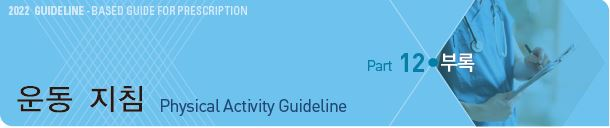
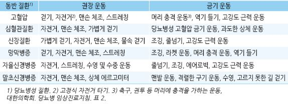

# 운동 지침 Physical Activity Guideline



> Ref. •American heart association •U.S. Department of Health & Human Services. Physical Activity Guidelines for Americans. 2nd Ed. 2018 •ADA. Standards of medical care in diabetes. 2022/2019 •WHO. 2020 guidelines on physical activity and sedentary behaviour ✽내용에서 ‘운동’은 일상 활동과 운동을 통칭함

## 일반 사항

* 가급적 앉아 있는 시간을 줄임, 규칙적인 신체 활동을 수행
* 운동의 4가지 형태 : 유산소 운동(지구력, 심장 운동), 근육 강화 운동, 균형 운동, 유연성 운동
* 목표 심박수(HR) = 최대 심박수1) × 권고 강도2)

> ```
> 1) 최대 심박수 = 220-연령.
> ```

```
 2) 권고 강도 : [미국심장학회] 50~85%, [대한의학회] 60~80%; 운동을 처음 시작할 때는 50%
```

*   심박수를 낮추는 β-차단제, non-DHP CCB를 복용 중인 환자에서는 목표 심박수를 적용하지 않으며

    이때는 “보통이다”라는 느낌으로 시작하여 “약간 힘들다”라는 느낌을 유지하도록 함

※ Karvonen formula 목표 심박수 = (최대 HR - 안정 시 HR) × 운동 강도(%) + 안정 시 HR

#### 부상 방지를 위한 유의 사항

* 개인의 신체 상태에 맞는 운동의 종류와 수준을 정함
*   운동 전에 본 운동보다 낮은 강도로 5\~10분간 준비 운동, 운동 후에 5분 또는 맥박이 ＜120/분이 될 때까지

    마무리 운동 시행
*   체력이 약한 고령자나 비활동적인 사람 등은 낮은 강도로 시작하여 서서히 운동량을 늘림

    •유산소 운동 예 : 주 5\~6일, 5분씩 하루에 여러 번 걷는 것으로 시작, 점차 늘려 10분씩 하루 3번 걷기.

    느린 속도로 시작하여 점차 속도를 높임

    •저항 운동 예 : 낮은 강도로 주 1회 시작하여 점차 강도와 횟수를 늘림; 청년층은 1~~2주, 고령층은 2~~4주 간격으로

    레벨 올림
* 한 가지 운동을 반복하면 부상의 위험이 늘어나므로 다양한 종류의 운동을 섞어서 시행
* 심하게 더울 때, 특히 습도가 높을 때는 신체 활동을 피함

### 유산소 운동 (지구력, 심장 운동)

* 신체 대근육을 일정한 리듬으로 움직이며, 그로인하여 맥박과 호흡을 빨라지게 하는 운동
* 종류 : 달리기, 활달히 걷기, 자전거 타기, 수영, 농구, 축구, 춤

#### 운동 수준

* inactive : 기본적인 움직임을 넘어서는 중등도 이상의 신체 운동을 하지 않음
* insufficiently active : 중등 강도의 운동을 ＜150분/주 or 격렬한 강도의 운동을 ＜75분/주
* active : 중등 강도의 운동을 150~~300분/주 or 격렬한 강도의 운동을 75~~150분/주
* highly active : 중등 강도의 운동을 ＞300분/주 or 격렬한 강도의 운동을 ＞150분/주

#### 신체 운동 강도

\*\*1. Sedentary behavior \*\*\[1\~1.5 METs]

* 누워 있기, 앉아 있기, TV 시청\[1]; 앉아서 가벼운 일 하기(예: 컴퓨터 하기), 카드놀이, 수공예\[1.5]

\*\*2. Light-intensity activity \*\*\[＜3.0 METs]

* 집안에서 천천히 걷기\[2.0]; 서서 가벼운 일 하기(예: 침대정리, 설거지, 다림질, 요리)\[2.0\~2.5]

**3. Moderate-intensity activity** \[＜6.0 METs]

* 최대 심박수의 50\~70%, 옆 사람과 대화하는 것이 약간 힘든 상태(말을 할 수는 있지만 노래를 부를 수는 없음)
*   청소하기(유리창 닦기, 세차, 진공청소기로 청소)\[3.0\~3.5], 걷기 4.8 ㎞/h\[3.3],

    클럽 들고 골프하며 걷기\[4.0], 탁구\[4.0], 배드민턴\[4.5] 야구 연습\[4.5],

    빠르게 걷기 6.4 ㎞/h\[5.0], 테니스 복식\[5.0], 평지에서 자전거 타기 16\~19.2 ㎞/h\[6.0]

\*\*4. Vigorous-intensity activity \*\*\[≥6.0 METs]

* 최대 심박수의 70\~85%, 숨이 거칠어지고 대화하는 것이 힘든 상태(중간에 숨을 쉬지 않고는 몇 마디 이상 말을 할 수 없음)
*   천천히 수영하기\[6.0], 빠르게 걷기 7.2 ㎞/h\[6.3], 무거운 물건 나르기\[7.5],

    테니스 단식\[8.0], 야구 게임\[8.0], 축구 연습 \[7.0]/게임 \[10.0]),

    조깅 8~~11.2 ㎞/h\[8.0~~11.5], 자전거 타기19.2~~22.4 ㎞/h\[10.0], 빠르게 수영하기\[8.0~~11.0]

#### 유산소 운동의 효과

* 적은 운동이라도 건강에 도움이 됨
* 대부분의 경우 더 강하게, 더 자주, 더 오래 할수록 유익함
* 심혈관/당뇨병에는 강하고 짧게 하는 것보다 중등도로 길게 하는 것이 보다 효과적
* 90분/주 운동(중등 강도) : 골밀도 감소 방지
*   150분/주 운동 : 전체 사망률, 관상동맥병, 뇌졸중, 고혈압, 2형 당뇨병, 일부 암, 불안, 우울, 알츠하이머병,

    근골격 통증 감소; 수면, 인지, 근골격 기능, 삶의 질 개선
* 300분/주 운동 : 심장병, 2형 당뇨 위험 감소 효과 증가, 비만 예방, 암 예방
* 소아 : 심폐 기능 향상, 근육 강화, 체지방 감소, 골 강화, 인지 기능 향상, 우울 감소

#### 권고 운동량

* WHO 권고\[2020] : 최소 중등 강도로 150~~300분/주, 격렬한 강도로 75~~150분, 또는 동등한 조합(그 이상의 활동을 권장함)
* 건강상의 추가 이득 목적(예: 체중 감량) : 중등 강도로 ＞300분/주 or 격렬한 강도로 ＞150분/주

### 근육 강화 운동(저항성 운동)

* 근육 강화 운동의 효과 : bone strength, muscular fitness 강화, 다이어트 중 근육량 유지
*   중등도 이상의 강도(평소 운동보다 조금 더 힘든 운동)로 모든 주요 근육군(팔, 어깨, 엉덩이, 다리, 등, 가슴, 배)을

    포함하는 다양한 운동 시행
*   근력 운동 또는 등척성 운동 시 일시적으로 혈압이 상승할 수 있음

    •운동 중 혈압 상승 : 안정 시보다 SBP 50\~70 ㎜/DBP \~5 ㎜ 상승- 권고 운동량 : ≥2일(또는 sessions)/주;

    2\~3일/주 시행 시 연속되지 않는 날 시행

    •1 session : 각 근육군 또는 운동마다 8~~12회 반복할 수 있는 중량을 1세트로 하여 2~~3세트
* 운동 예 : 역기, resistance bands, 팔굽혀펴기, 당기기, 힘든 집안일

### 균형 운동, 유연성 운동(스트레칭)

*   권고 운동량 : 10~~30초 동안 스트레칭, 각 부위 스트레칭을 3~~5회 반복하는 것을 1 session으로 하여 3 sessions/주 권고;

    모든 ≥65세에 대하여 ≥3회/주 functional balance & strength training에 초점을 맞춘 multicomponent physical activity를

    권고
* 운동 예 : 스트레칭, 요가, 태극권, 허리/다리/복부 근육 강화 운동
*   생활 속의 균형 운동 : 앉은 자세에서 서는 연습, wobble board 사용, walking heel-to-toe, 부엌에서 일하는 동안/줄을

    서서 기다리는 동안/칫솔질하는 동안 한 발로 서 있기

### 특별한 경우의 운동

#### 체중 관리

* 권고 운동량 : 중등 강도로 300분/주(＞150분/주)의 유산소 운동 및 근육 강화 운동

#### 고령자

* 유산소 운동, 근육 강화 운동, 균형 운동을 요함
* 일반 성인과 같은 수준의 운동을 권하지만 기저 질환 등 신체 상태에 맞춰 결정
*   만성 질환 및 장애를 가진 ≥65세에서 30\~45분/session, ≥3일/주 중등도 이상 강도의 multicomponent physical activity

    (예: 걷기, 볼룸댄스)를 권고

#### 임신 및 산욕기

* 중등 강도로 ≥150분/주 유산소 운동을 가급적 일주일 내내 지속; 근육 운동을 포함할 수 있음
* 격렬한 운동을 포함하여 이전에 하던 유산소 운동 또는 신체 활동을 지속할 수 있음
* 임신 제1석달 이후에는 등을 대고 누워서하는 운동은 피함(자궁 혈액 순환에 해로움)
* 운동 경기나 권장 지침보다 훨씬 높은 강도의 운동을 하려는 경우 전문가의 지도를 받음
* 회피 : 부상 위험 및 복부 충격의 가능성이 있는 운동은 피함(예: 축구, 농구, 승마, 스키)

#### 심장병 위험 인자가 있는 경우

* 중등 강도로 ≥90분/주의 유산소 운동과 근육 강화 운동이 심장 질환 위험을 유의미하게 낮춤
* 환자의 상태에 따른 허용 운동 강도에 대한 평가가 필요

> ```
> ✽1일 4,400보~7,500보를 걷는 것의 사망률 감소 효과는 비슷하다는 보고가 있음
> ```

\*\* 허용 운동 강도 평가 대상\*\*

*   다음 중 하나라도 해당되면 격렬한 신체 운동은 관상동맥병 여부를 평가한 후 시작

    ① 의사로부터 심장 질환이 있다고 들은 적이 있다.

    ② 자주 가슴에 통증을 느낀다.

    ③ 현기증을 느끼거나 심하게 어지러운 적이 있다.

    ④ 의사로부터 혈압이 높다고 들은 적이 있다.

    ⑤ 운동하면 심해지는 관절이나 뼈 질환이 있다고 의사로부터 들은 적이 있다.

    ⑥ 위에 언급되지는 않았지만 운동을 하기 어려운 다른 신체적 문제가 있다.

    ⑦ 65세 이상이고 심한 운동을 해본 적이 없다.

#### 당뇨병 환자

* 중등 강도의 유산소 운동 ≥150분/주 + 근육 강화 운동 2일/주

\*\* 유의 사항\*\*

⑴ 증식성 망막병증 또는 심한 비증식성 망막병증이 있는 경우

* 고강도의 유산소 운동과 저항성 운동은 금함
*   다음의 경우에는 손상의 위험을 평가한 후 필요시 특정 운동을 금지 : 조절되지 않는 고혈압,

    심한 자율신경병증 또는 말초신경병증, 족부 병변, 불안정 증식망막병증

⑵ 1형 당뇨병 환자는 운동 관련 고혈당 또는 저혈당을 피하기 위하여 다음을 이행

* 운동 전/중/후 혈당 검사
* 혈당 ≥250 ㎎/㎗ 및 케톤증이 있으면 운동 연기
* 혈당 ＜100 ㎎/㎗이면 운동 전 탄수화물 섭취
* 필요시 운동 중 탄수화물 섭취
* 인슐린 주사를 맞는 사람은 운동 전 주사 인슐린 감량(이전의 경험에 기초), 운동하지 않는 부위에 인슐린 주입
* 운동에 따른 자신의 혈당 변화를 학습하며 운동의 강도와 기간에 따라 운동 후 24시간까지 음식 섭취를 늘림

⑶ 운동 부하 검사

*   대상 : ＞35세, 유병 기간이 ＞15년인 1형 당뇨 또는 ＞10년인 2형 당뇨, 미세 혈관 합병증, 말초혈관 질환,

    관상동맥병 위험 요소, 자율 신경 장애
*   ASCVD 10년 위험도가 ＜10%의 무증상 당뇨병 환자에서는 위양성으로 인한 문제가 더 크기 때문에

    운동부하검사를 실시할 필요는 없음 ([ASCVD risk estimator](https://tools.acc.org/ldl/ascvd_risk_estimator/index.html#!/calulate/estimator/))

**당뇨병 동반 질환에 따른 권장 운동 및 금기 운동**

```

```

#### 골관절염 환자

* 능력과 상태에 맞는 운동 선택
* 관절 손상 가능성이 적은 운동 예 : 수영, 걷기, 태극권, 근육 강화 운동
* 가능하다면 중등 강도로 ≥150분/주(3~~5일/주, 30~~60분/회) 운동 권고
* 일반적으로 1일 만보 보행까지는 골관절염을 악화시키지 않음

### 소아

#### 유아기

* 강도에 관계없이 매일 3시간 운동 권고

#### 학령기

*   WHO 권고 : 매일 ≥60분의 중등도\~격렬한 강도의 유산소 신체 활동을 권고; ≥3일/주의 근육 및 골 강화 활동뿐 아니라

    격렬한 강도의 유산소 활동을 권고
* 앉아서 보내는 시간, 특히 recreational screen time을 제한함
* 유산소 운동 예 : 달리기, 줄넘기, 수영, 춤, 자전거
* 근육 강화 운동 예 : 운동 기구, 나무 오르기, 줄다리기
* 골 강화 운동 예 : 깡충깡충 뛰기, 줄넘기, 달리기, 농구, 테니스 등 지면과 충돌하는 활동
