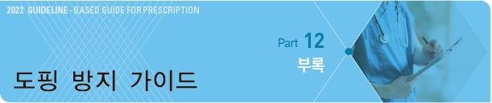

# 도핑 방지 가이드



> ```
> Ref. 한국도핑방지위원회. 금지목록 국제표준. 2018.01.
> ```

## 금지 약물 계통

### 상시 금지 약물

S0. 비승인 약물

S1. 동화작용제(anabolic steroid, tibolone)

S2. 펩티드 호르몬, 성장인자 및 관련약물(erythropoietin-receptor agonist, growth hormone)

S3. β-2 작용제(예외: 흡입용 salbutamol, formoterol, salmeterol. 단, 용량에 대한 제한 있음)

S4. 호르몬 및 대사 변조제

S5. 이뇨제 및 기타 은폐제(desmopressin, thiazide, furosemide)

M1. 혈액 및 혈액 성분의 조작

M2. 화학적, 물리적 조작(12시간 동안 총 100 ㎖보다 많은 양의 정맥 투여 &/or 정맥 주사 금지;

```
단 치료, 수술 절차 또는 임상 진단 조사 과정에서 의료기관에 의해 합법적으로 처치된 경우는 제외)
```

M3. 유전자 도핑

### 경기 기간 금지 약물

S0~~S5, M1~~M3에 다음 추가

S6. 흥분제(amphetamine, phentermine, methylphenidate, ephedrine/pseudoephedrine; 용량에 따라 다름)

```
(예외: 국소 epinephrine)
```

S7. 마약류

S8. 카나비노이드류

S9. glucocorticoid(경구, 정맥, 근육, 및 좌약으로 사용)

> ✽bupropion, caffeine, nicotine, phenylephrine, phenylpropanolamine : 2015 모니터링 프로그램에 포함되며, 금지 약물에는 해당되지 않음

### 특정 경기에 대한 금지 약물

P1. β-차단제류(atenolol, carvedilol, propranolol)

•경기 기간 중 금지 : 자동차 경주, 당구, 다트, 골프, 스키 종목, 수중 종목

•경기 기간 외에도 금지 : 양궁, 사격

## 금지 약물 검색

```
☞ [한국도핑방지위원회-금지약물검색](https://www.kada-ad.or.kr/kada?where=drug/drug_search)
```
