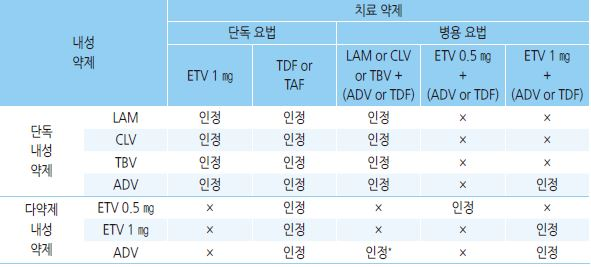
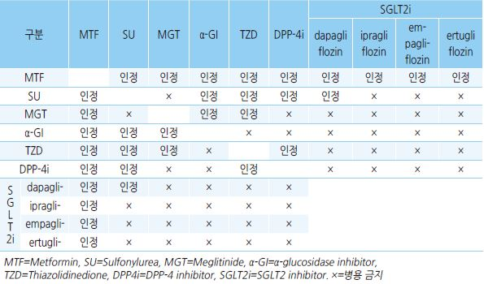

# 요양급여 인정 기준

#### 
    심평원-[보험인정기준](https://www.hira.or.kr/rc/insu/insuadtcrtr/InsuAdtCrtrList.do?pgmid=HIRAA030069000400&WT.gnb=%EB%B3%B4%ED%97%98%EC%9D%B8%EC%A0%95%EA%B8%B0%EC%A4%80)

    심평원 요양기관업무포털-[심사기준 종합서비스](https://biz.hira.or.kr/popup.ndo?formname=qya_bizcom%3A%3AInfoBank.xfdl&framename=InfoBank)

    한국보험청구심사협회-[청구심사자료실](http://hicra.or.kr/sub_asp/04_data03.html)

## Part Ⅰ. 흔한 증상들

#### Lidocaine HCl 주사제 (2020-08-01)
가. 통증을 제거할 목적으로 부신피질호르몬제 등 타약제와 병용하여 관절강 내 또는 건초 내 주입

나. 신경차단술

다. 신경병성통증(Neuropathic pain)에 지속적 주입(Continuous infusion therapy)

#### 진통·진양·수렴·소염 외용제 (2018-12-01)
1) 경구 투여가 불가능한 경우(부작용 등으로 인하여 NSAID의 경구 투여가 불가능한 환자임을 입

    증하는 경우를 포함)

2) 로숀제, 겔제, 크림제를 물리치료 등 원내 처치 시 사용한 경우

    ✽외용약제: diclofenac diethylammonium, felbinac, flurbiprofen, indomethacin, ketoprofen, piroxicam,

    capsaicin 등을 함유하는 의약품 분류번호 264 진통·진양·수렴·소염제 중 제형이 카타플라스마제, 경고제,

    패취제, 로숀제, 겔제, 크림제를 말함

#### [일반원칙] 마약성진통제 (2017-09-01)
가. 암성 통증: 암성 통증 치료제 규정에 따름

나. 비암성 통증

1) 투여 대상

⑴ NSAID의 환자별 최대 용량에도 반응하지 않는 심한 통증; 일부 약제는 허가 사항 범위 내에서

다음 투여 대상에 한하여 급여 인정함

    ① oxycodone 단일 및 복합 경구제: 골관절염, 하부 요통, 신경병성 통증, 만성 췌장염

    ② hydromorphone 서방형 경구제: 골관절염, 하부 요통

    ③ tapentadol: 골관절염, 하부 요통, 신경병성 통증

    ④ fentanyl 패취제: 골관절염, 하부 요통, 신경병성 통증, 만성 췌장염

⑵ 수술 후 통증에 급여를 인정 하되 서방형제제(oxycodone 단일 및 복합제, hydromorphone, tapentadol,

fentanyl 패취제)는 인정하지 아니함

2) 투여 용량: 다음 투여 용량을 초과하는 경우 약값 전액을 환자가 부담토록 함

    ① oxycodone 단일 및 복합 경구제: oxycodone으로 1일당 60 ㎎

    ② hydromorphone: 1일당 24 ㎎ ③ tapentadol: 1일당 300 ㎎

    ④ fentanyl 패취제: 3일당 37.5 ㎍/h ⑤ morphine 경구제: 1일당 90 ㎎

3) 투여 기간: 1회 처방 당 최대 30일까지 인정하며, 속효성 제제는 단기간 투여를 원칙으로 함

    ✽대상약제: oxycodone 단일 및 복합 경구제, hydromorphone 경구제, tapentadol 경구제, fentanyl 패취제,

    morphine 경구제

## Part Ⅱ. 신경정신 질환

#### [일반원칙] 향정신성약물 (2022-02-01)
가. 허가 사항 범위 내에서 1품목 투여를 원칙으로 하며, 1품목의 처방으로 치료 효과를 기대하기 어려

    운 경우에는 2품목 이상의 병용 처방을 인정

나. 1회 처방 시 30일까지 급여 인정하며 아래의 경우에는 1회 처방 시 최대 90일까지 인정

    ① 말기 환자, 중증 신체 장애를 가진 환자, 중증 신경학적질환자, 중증 정신질환자

    ② 선원, 장기 출장, 여행 등으로 인하여 장기 처방이 불가피한 경우

다. 나 항에도 불구하고, 허가 사항 등에서 치료 기간을 제한하고 있는 약제는 아래와 같이 급여 인정

    ① triazolam : 1회 처방 시 3주 이내 ② chloral hydrate : 1회 처방 시 2주 이내

    ③ zolpidem : 1회 처방 시 4주 이내

라. 3개월 이상 향정신성 약물을 장기 복용할 경우 6~12개월마다 혈액 검사(간·신 기능 검사 포함) 및

    환자 상태를 추적·관찰하여 부작용 및 의존성 여부 등을 평가하도록 권고함

마. benzodiazepine계열 등은 투여를 중지할 경우 금단 증후군을 일으킬 수 있어 환자 상태에 따라

    4~16주 기간 동안 1~2주마다 10~25%를 감량하면서 투여하도록 권고함

    ✽대상성분: alprazolam, bromazepam, chloral hydrate, chlordiazepoxide, clobazam, clorazepate

    clotiazepam, diazepam, eszopiclone, ethyl loflazepate, etizolam, flunitrazepam, flurazepam, lorazepam,

    mexazolam, midazolam, triazolam, zolpidem

#### [일반원칙] 경구용 뇌대사개선제 (Neuroprotective agents) (2018-12-01)
가. 경구용 뇌대사개선제 중 1종만 급여 인정을 원칙으로 함

나. 개별 고시가 있는 약제는 해당 고시 기준을 따름

    ✽대상 약제: acetyl L-carnitine, citicoline, oxiracetam, choline alfoscerate, ibudilast, ifenprodil tartrate, nicergoline

#### 편두통 치료제 (2020-12-01)
가. 대상

    ① 전조 증상이 없는 편두통

    ② 중등(moderate) 또는 중증(severe) 편두통

    ③ 심한 구역이나 구토, 수명(광선공포증), 고성(소음)공포증 등이 수반되는 편두통

나. 용량: 허가 사항 범위 내에서 인정하며, 다만, sumatriptan succinate는 1일 200 ㎎, zolmitriptan은

    1일 5 ㎎까지 인정

    ✽대상 약제: almotriptan, frovatriptan, naratriptan, sumatriptan succinate, zolmitriptan

#### [일반원칙] 항파킨슨 약제 (2018-12-01)
가. 작용 기전별로 1품목씩 인정

나. 복합 제제의 경우는 복합된 제제수를 각각 1품목으로 약제를 투여한 것으로 인정

다. 중증 파킨슨씨병에 한하여 levo-dopa 제제는 속효성 제제와 지속성 제제를 투여할 수 있음

    ✽항파킨슨 약제 작용 기전별 분류

    ① dopamine agonists ② levo-dopa agents (short or long acting agents)

    ③ MAO-B inhibitors ④ antiviral agents

    ⑤ anti-cholinergic agents ⑥ COMT inhibitors

#### Propranolol HCl 경구제(품명: 인데놀정 등) (2018-02-01)
    ① 진전(Tremor)

    ② 불안과 관련된 증상(정위불능증 등)

    ③ 편두통 예방

#### Duloxetine 경구제(품명: 심발타캡슐 등) (2017-01-01)
가. 우울증 : 향정신성약물에 대한 일반적 약제와 동일한 적용

나. 당뇨병신경병증

1) thioctic acid(또는 α-lipoic acid) 경구제와 병용 투여 시 요양급여를 인정

2) 당뇨병신경병증 통증 치료제(예: gabapentin, pregabalin 등)간의 병용 투여는 인정하지 아니함

다. 섬유근육통

1) 섬유근육통으로 확진되고*, TCA(amitriptyline, nortriptyline 등) 또는 허가 사항 중 근골격계 질환

    에 수반하는 통증의 증상 완화에 사용할 수 있는 근이완제(cyclobenzaprine 등)를 적어도 1달 이상

    사용한 후에도 효과가 불충분한 경우

    * 섬유근육통 확진은 2010년 미국 류마티스학회 발표 진단기준에 부합하고 섬유근육통 진단설문지(FIQ)

    점수가 ≥40점이며, 시각적 아날로그 통증 스케일(Visual Analog Scale for pain)이 ≥40 ㎜인 경우로 하며,

    투여 개시 13주 후 VAS와 FIQ의 호전이 없는 경우 투여 중단을 고려해야 함

2) pregabalin과의 병용 투여는 인정하지 아니함

#### 삼환계 항우울제(Amitriptyline HCl, Nortriptyline HCl 등) (2018-02-01)
- 허가 사항 범위를 초과하여 아래와 같은 기준으로 투여하는 경우에도 급여 인정

    ① 섬유근육통(Fibromyalgia) 확진 시

    ② 과민성 장증후군(Irritable bowel syndrome)에 투여 시

    ③ 턱관절 장애로 인한 만성통증에 투여 시: amitriptyline, nortriptyline만 인정

    ✽섬유근육통 확진은 2010년 미국 류마티스학회 발표 진단기준에 해당되고 섬유근육통진단설문지(FIQ;

    Fibromyalgia impact questionnaire) 점수가 40점 이상이며, 시각적 아날로그 통증 스케일(pain VAS; pain

    visual analog scale)이 40mm 이상인 경우에 한함.

    ④ 대상포진으로 인한 심한 소양증에 투여 시: amitriptyline, nortriptyline, imipramine만 인정

    ⑤ 신경병증성 통증에 투여 시: amitriptyline, nortriptyline, imipramine만 인정

    ⑥ 편두통 예방: amitriptyline만 인정

#### Sertraline HCl(졸로푸트정 등), Paroxetine HCl(세로자트정 등), Fluoxetine HCl(푸로작캅셀
등), Mirtazapine(레메론정 등), Citalopram HBr(시탈로프람정 20밀리그람), Escitalopram
oxalate(렉사프로정 등), Escitalopram(렉사프로멜츠구강붕해정) (2017-01-01)
가. 정신건강의학과에서 우울병으로 확진된 경우

나. 정신건강의학과 이외의 타과에서 기타 질환으로 인한 우울병에 투여하는 경우

    ① 우울 증상*이 지속적으로 2주 이상 계속되는 경우에 상용량으로 60일 범위 내에서 인정함

    * 우울 증상에 대한 기준: 3가지 전형적 증상(우울한 기분, 흥미나 관심 소실, 피곤감이나 활동 저하) 중 최소한

    2가지와 7가지 증상(집중력·주의력 저하, 자신감 저하, 죄책감, 비관·염세적 사고, 자살 사고, 수면 장애, 식욕

    감퇴) 중 최소한 2가지가 있어야 함

    ② 상기 용량 또는 기간을 초과하여 약제 투여가 요구되는 경우에는 정신건강의학과로 자문 의뢰함

    이 바람직함

    ③ 암 환자에서는 상병 특성을 고려하여 60일 이상 장기 투여가 필요하다고 판단되는 경우 인정

    ④ 신경계 질환(뇌전증, 뇌졸중, 치매, 파킨슨병)의 경우에는 상병 특성을 고려하여 60일 이상 장기

    투여가 필요하다고 판단되는 경우에 인정함

다. ≤24세인 자의 우울병에 투여하는 경우에는 허가 사항 중 사용상의 주의 사항(경고, 이상반응, 일

    반적 주의 항목 등)에 따른 임상적 유용성이 위험성보다 높은지 신중하게 고려하여 투여하여야 함

    Donepezil 경구제(구강붕해정 포함)(품명:아리셉트정 등, 아리셉트에비스정 등) (2019-07-21)

가. 투여 대상

1) 5 ㎎, 10 ㎎

⑴ 진단기준: 다음 ①, ②를 모두 충족하는 알츠하이머 형태(뇌혈관 질환을 동반한 알츠하이머 포함)

    의 경증(mild), 중등증(moderate), 중증(severe) 치매 증상

    ① MMSE ≤26점　② 치매 척도 검사: CDR 1~3 또는 GDS stage 3~7

2) 23 ㎎: 다음 ①, ②를 모두 충족하는 알츠하이머 형태(뇌혈관 질환을 동반한 알츠하이머 포함)의 중

    등증·중증 치매 증상

    ① MMSE ≤20점　② 치매 척도 검사: CDR 2~3 또는 GDS stage 4~7

나. 평가 방법 : 6~12개월 간격으로 재평가하여 계속 투여 여부를 결정하며, 재평가에서 MMSE의 경

    우에는 26점(5 ㎎, 10 ㎎) 또는 20점(23 ㎎)을 초과하여도 지속 투여를 인정

    - 다만, MMSE가 ＜10점이고 CDR가 3(또는 GDS 6~7)인 중증 치매인 경우 6~36개월 간격으로

    재평가할 수 있음

    - 노인장기요양보험법령에 따른 장기요양 1등급인 경우, 장기요양인정 유효 기간까지 재평가 없이

    계속 투여할 수 있음. 단, 노인장기요양보험법 제17조의 장기요양인정서를 제시해야 함

다. 동 제제와 memantine경구제 병용 시 알츠하이머 형태(뇌혈관 질환을 동반한 알츠하이머 포함)의

    중등증/중증 치매 증상으로 각 약제의 급여기준에 적합한 경우 요양급여를 인정함

라. 동 제제와 gin㎏o biloba extract제제 병용 시 각 약제의 허가 사항 범위 내에서 투약 비용이 저렴한

    1종의 약값 전액을 환자가 부담토록 함

#### Galantamine 경구제(품명:레미닐피알 서방캡슐 등) (2019-02-01)
가. 투여 대상 : 다음 ①, ②를 모두 충족하는 알츠하이머 형태(뇌혈관 질환을 동반한 알츠하이머 포함)

    의 경증(mild), 중등증(moderate), 중증(severe) 치매 증상

    ① MMSE 10~26점　② 치매 척도 검사: CDR 1~2 또는 GDS stage 3~5

나. 평가 방법 : 6~12개월 간격으로 재평가하여 계속 투여 여부를 결정하며, 재평가에서 MMSE의 경

    우에는 26점을 초과하여도 지속 투여를 인정

다. 라. Donepezil과 동일

    Memantine 경구제(품명: 에빅사액 등, 에빅사정 등) (2019-02-01)

가. 투여 대상: ①, ②를 모두 충족하는 알츠하이머 형태(뇌혈관 질환을 동반한 알츠하이머 포함)의 중

    등증·중증 치매 증상

    ① MMSE ≤20점　② 치매 척도 검사: CDR 2~3 또는 GDS stage 4~7

나. 평가 방법 : Donepezil과 동일

다. 동 제제와 Acetylcholinesterase inhibitor 제제(Donepezil, Galantamine, Rivastigmine 등) 병용 시

    알츠하이머 형태(뇌혈관 질환을 동반한 알츠하이머 포함)의 중등증/중증 치매 증상으로 각 약제의

    급여기준에 적합한 경우 요양급여를 인정함

라. Donepezil과 동일

#### Rivastigmine 제제(품명: 엑셀론캡슐, 엑셀론패취 등): 알츠하이머 치매 (2019-02-01)
가. 투여 대상

1) 캡슐제: ①, ②를 모두 충족하는 알츠하이머 형태(뇌혈관 질환을 동반한 알츠하이머 포함)의 경증·

    중등증 치매 증상

    ① MMSE 10~26점　② 치매 척도 검사: CDR 1~2 또는 GDS stage 3~5

2) 패취제: ①, ②를 모두 충족하는 알츠하이머 형태(뇌혈관 질환을 동반한 알츠하이머 포함)의 경증·

    중등증·중증 치매 증상

    ① MMSE ≤26점　② 치매 척도 검사: CDR 1~3 또는 GDS stage 3~7

나. 평가방법 : Donepezil과 동일

다. 라. Donepezil과 동일

#### Gin㎏o biloba extract 경구제(품명: 타나민정, 기넥신에프정 등) (2013-09-01)
1) 인지 기능 장애를 동반한 치매(알츠하이머형, 혈관성)에 인지 기능 개선 목적으로 투여한 경우

    •gin㎏o biloba extract제제를 아세틸콜린분해억제제(아리셉트, 레미닐, 엑셀론 등)나 memantine

    제제(에빅사 등)와 병용 시 1종만 급여하고 저렴한 약제의 약값 전액은 환자가 부담함

2) 중추성 어지러움에 투여한 경우

3) 간헐성파행증

#### 정신건강의학과 상병에 실시한 갑상선 기능 검사의 급여 기준 (2021-12-01)
가. 정신건강의학과 상병에 실시한 누323 갑상선호르몬[정밀면역검사]-T4, T3, 누325가 갑상선자극

    호르몬[정밀면역검사]-TSH 검사는 다음의 경우 인정

    ① 우울증, 조울증, 조현병 등의 정신건강의학과 상병 치료 초기에 갑상선질환과의 감별 진단 목적으

    로 실시한 경우

    ② 갑상선비대(thyroid hypertrophy) 등이 발생될 수 있는 lithium 약제를 투여한 경우

나. 누321 갑상선관련항체-항마이크로좀항체, 누324 항갑상선글로불린항체[정밀면역검사]검사는

    T3, T4, TSH 검사상 이상이 있어 시행한 경우 인정

## Part Ⅲ. 눈귀코목 질환

#### 가글 용제 보험기준(품명: 헥사메딘가글액 등) (2018-12-01)
- 허가 적응증: 보철(의치)에 의한 염증, 아구창 등의 구강 내 칸디다 감염증, 치은염, 인두염, 아프

    타성구내염에 의한 염증의 완화, 치근막 수술 후 살균 소독

    ① 인정 용량: 100 ㎖

    ② 인정 용량 초과한 경우: 초과한 용량의 약값 전액을 환자가 부담토록 함

#### Leukotriene 조절제: Montelukast 경구제(싱귤레어), Montelukast 및 levocetirizine
복합제(몬테리진), Pranlukast 경구제(프라카논, 오논, 씨투스), Zafirlukast 경구제(아콜레이트),
Petasites hybridus CO2 Extracts 경구제(코살린정) (2018-12-01)
가. montelukast 경구제, pranlukast 경구제, zafirlukast 경구제: 타 천식 약제로 증상 조절이 되지 않

    는 2단계(경증 지속성) 이상의 천식에 투여 시 인정하되, aspirin 민감성 천식에는 1차 약제로 투여

    시도 인정

나. montelukast 경구제, pranlukast 경구제: 알레르기성 비염에 투여 시는 다음의 경우에 인정(항히스

    타민제와 동시 투여 가능)

    ① 1차 항히스타민제 투여로 개선이 되지 않는 비폐색이 있는 경우

    ② 비폐색이 주증상인 경우

    ③ 비충혈 제거제 또는 비강 분무 스테로이드를 사용하지 못하는 경우

다. petasites hybridus CO2 extracts 경구제: 재채기, 콧물, 가려움증, 코 막힘의 제증상이 있는 알레르

    기성 비염의 완화에 단독 투여 시 인정

라. montelukast 및 levocetirizine 복합제: 천식을 동반한 다음과 같은 알레르기성 비염에 인정

    ① 1차 항히스타민제 투여로 개선이 되지 않는 비폐색이 있는 경우

    ② 비폐색이 주증상인 경우

    ③ 비충혈 제거제 또는 비강 분무 스테로이드를 사용하지 못하는 경우

## Part Ⅳ. 호흡기계 질환

#### 알레르기성 천식에 대한 Omalizumab 주사제 (2020-07-01)
1. 투여대상

가) 성인 및 청소년(만 12세 이상): 알레르기성 중증 지속성 천식 환자 중 고용량의 흡입용 코르티

    코스테로이드-장기지속형 흡입용 베타2 작용제 (ICS-LABA)와 장기지속형 무스카린 대항제

    (LAMA)의 투여에도 불구하고 적절하게 조절이 되지 않는 경우로서 다음의 조건을 모두 만족하는

    경우

    ① 치료 시작 전 면역글로불린 E의 수치가 76IU/㎖ 이상

    ② 통년성 대기 알러젠에 대하여 시험관 내(in vitro) 반응 또는 피부반응 양성

    ③ FEV1(1초 강제호기량) 값이 예상 정상치의 80% 미만

    ④ 치료 시작 전 12개월 이내에 전신 코르티코스테로이드가 요구되는 천식 급성악화가 2회 이상 발

    생한 경우

나) 소아(만 6세∼만 12세 미만): 알레르기성 중증 지속성 천식 환자 중 고용량의 흡입용 코르티코스

    테로이드-장기지속형 흡입용 베타2 작용제(ICS-LABA)의 투여에도 불구하고 적절하게 조절이 되

    지 않는 경우로서 다음의 조건을 모두 만족하는 경우

    ① 치료 시작 전 면역글로불린 E의 수치가 76IU/㎖ 이상

    ② 통년성 대기 알러젠에 대하여 시험관 내(in vitro) 반응 또는 피부반응 양성

    ③ 치료 시작 전 12개월 이내에 전신 코르티코스테로이드가 요구되는 천식 급성악화가 2회 이상 발

    생한 경우

2. 평가방법

가) 최초 투여 후 16주째 반응평가※를 하여 전반적인 천식조절을 확인한 환자에 대한 소견서 제출

    시 향후 지속투여를 인정함.

나) 이후 지속적으로 3∼6개월마다 반응 평가하여 투여지속 여부를 판단하도록 함.

※ 반응평가: 최대호기유속(peak expiratory flow), 주간 및 야간증상, 구원치료제(rescue medication)

    사용, 폐활량검사(spirometry), 증상악화(exacerbations) 등

#### Oseltamivir 경구제(품명: 타미플루캡슐 등) (2017-11-01)
가. 생후 2주 이후* 다음의 환자에게 인플루엔자 초기 증상(기침, 두통, 인후통 중 2개 이상의 증상 및

    고열)이 발생한지 48시간 이내에 투여 시 요양급여를 인정함. 다만, 입원 환자는 증상 발생 48시간

    이후라도 의사가 투약이 필요한 것으로 판단한 경우 요양급여를 인정함.

1) 인플루엔자 감염이 신속항원검사 또는 중합효소연쇄반응법으로 인플루엔자 양성이 확인된 경우

2) 인플루엔자주의보 발표 시에는 다음의 환자; ≤9세*, 임신 또는 출산 2주 이내 산모*, ≥65세, 면역

    저하자, 대사 장애, 심장 질환, 폐질환, 신장 기능 장애, 간질환, 신경계 질환 및 신경 발달 장애, 혈액

    질환, 장기간 aspirin 치료를 받고 있는 ≤19세 환자 등

    * Zanamivir: ≥7세, ≤12세, 임신 3개월 이상 임신부 또는 출산 2주 이내 산모

나. 조류인플루엔자의 경우 조류인플루엔자주의보가 발표된 이후나 검사상 조류인플루엔자 바이러스

    감염이 확인된 경우에는 허가 사항 범위 내(치료 및 예방) 투여 시 요양급여를 인정함

#### 만성폐쇄성폐질환 흡입용 치료제 (2022-03-01)
- 중등증 이상의 만성폐쇄성폐질환[FEV1(1초 강제호기량) 값이 예상 정상치의 ＜80%] 환자의 유

    지요법제로 투여 시 인정

- FEV1(1초 강제호기량) 값이 예상 정상치의 80% 이상인 만성폐쇄성폐질환 환자 중, 호흡곤란 등

    의 증상이 적절히 조절되지 않는 경우 유지요법

※ 대상 약제:[단일제] Aclidinium bromide, Indacaterol maleate, Umeclidinium [복합제] Formoterol

    fumarate + Aclidinium bromide, Indacaterol maleate + Glycopyrronium bromide, Olodaterol +

    Tiotropium, Vilanterol + Umeclidinium

#### 자4-1 하기도증기흡입치료 급여기준 (2017-08-25)
가. nebulizer treatment of lower airway는 천식이나 COPD의 급성 악화기, 급성 세기관지염의 호흡

    곤란 치료에 실시

나. 응급실 또는 입원진료 중인 환자

    ① 정량식(또는 분말)흡입기를 사용할 수 없는 경우로 기도 폐쇄에 의한 호흡 곤란(PaO2 ＜60 ㎜Hg

    등)이 있거나 하기도 경련에 의한 wheezing이 확인되는 경우에는 급성기 일주일 이내 인정

    ② 가래 배출이 곤란하여 전신 투여(경구 또는 주사)를 실시하였음에도 불구하고 치료 효과를 기대

    할 수 없어 직접 하기도에 국소 투여가 필요한 경우에는 급성기에 사례별로 인정

    다. pentamidine isethionate 주사제의 요양급여의 적용 기준 및 방법에 관한 세부사항에 따라 증기 흡

    입 치료를 하는 경우 인정

#### Beclomethasone dipropionate + Formoterol 흡입제 (품명:포스터) (2017-11-01)

#### Salmeterol + Fluticasone 흡입제 (품명: 세레타이드) (2015-12-01)
Formoterol fumarate + (Micronized) Budesonide 흡입제(품명: 심비코트) (2015-11-01)
가. 부분 조절 이상 단계의 천식. 단, 3~6개월에 한 번씩 평가를 실시하여 평가결과를 기재토록 함

나. COPD

    ① FEV1 값이 예상 정상치의 ＜60%인 경우 또는

    ② 베타-2 작용제나 항콜린제 등의 지속 투여에도 연 2회 이상 급성 악화*가 발생한 경우에는 투여

    소견서 참조하여 인정

#### Tiotropium 흡입제(품명: 스피리바흡입용캡슐 등) (2022-03-01)
가. 중등증 이상의 만성폐쇄성폐질환[FEV1(1초 강제호기량) 값이 예상 정상치의 80% 미만] 환자의

    유지요법

나 FEV1(1초 강제호기량) 값이 예상 정상치의 80% 이상인 만성폐쇄성폐질환 환자 중, 호흡곤란 등의

    증상이 적절히 조절되지 않는 경우 유지요법

다. 고용량의 흡입용 코르티코스테로이드 및 지속성 베타-2 작용제의 병용 유지요법에도 불구하고 중

    증의 악화 경험이 있는 천식환자의 병용 유지요법

#### Roflumilast 경구제(품명: 닥사스정500마이크로그램) (2015-11-01)
가. 증상 악화 병력이 있고 만성기관지염을 수반한 중증의 만성폐쇄성폐질환

1) FEV1 값이 예상 정상치의 50% 미만인 경우 또는

2) 베타-2 작용제나 항콜린제 등의 지속 투여에도 연 2회 이상 급성악화✽가 발생한 경우에는 투여소

    견서 참조하여 인정

    ✽급성 악화는 호흡 곤란의 악화, 기침의 증가, 가래양의 증가 또는 가래색의 변화 등으로 약제의 변경 또는

    추가(항생제, 스테로이드제 등)가 필요한 경우를 말함.

나. 투여방법: 지속성 기관지확장제(LABA 또는 LAMA) 1종과 병용 투여

#### [일반원칙] 기관지천식 치료용흡입제 (2013-09-01)
1) 천식의 치료 원칙에 따른 효능군별로 증상의 정도에 따라 2~3종의 흡입제 병용 투여 시에도 요양

    급여를 인정함

2) 기관지 천식에 투여되는 흡입제 중 nebulizer solution은 노인, 소아, 안면 마비 환자, 의식 불명 환

    자 등 일반적인 흡입제 사용이 곤란한 경우나 응급 치료 시에만 요양급여를 인정하며, 동 인정기준

    이외에는 약값 전액을 환자가 부담토록 함

#### [일반원칙] 진해거담제 (2013-09-01)
1) 경구 진해거담제는 약제의 성분, 약리 작용 및 효능·효과, 환자의 증상에 따라 선별적으로 투여함

    을 원칙으로 하며,

2) 상기도 질환에 시럽제를 포함하여 2종 이내, 그 이외의 호흡기 질환(천식 및 COPD는 제외)에는

    시럽제를 포함하여 3종 이내로 인정

3) ＜6세의 경우에는 함량 및 성분 등이 과량 또는 중복되지 아니하는 범위 내에서 복합 시럽제 1종

    을 추가로 인정

4) 식품의약품안전처장이 정한 의약품분류번호 222, 229에 해당되는 약제라도 약리 작용이 진해, 거

    담, 기관지 확장이 아닌 약제는 적용되지 아니함

5) 진해 거담 주사제는 신속한 치료 효과가 필요한 경우에 인정

#### Ambroxol HCl 주사제(품명: 앰브로주사 등) (2017-11-01)
1) 점액 분비 장애로 인한 급·만성 호흡기 질환: 만성 기관지염, 천식성 기관지염, 기관지천식의 급성

    발작

2) 수술 전·후 폐합병증의 예방 및 치료

## Part Ⅴ. 소화기계 질환

#### Prucalopride succinate경구제 (품명: 레졸로) (2020-05-01)
- 2종 이상의 경구 완하제(부피형성 완하제, 삼투성 완하제 등)를 6개월 이상 투여함에도 불구하고

증상 완화에 실패한 만성 변비 환자; 단, 4주간 투여 후 증상 호전을 고려하여 지속 여부를 결정

#### 프로톤 펌프 억제 경구제 Omeprazole(품명: 유한로섹캡슐 등), Lansoprazole(품명: 란스톤캡슐 등),
Pantoprazole(품명: 판토록정 등), Rabeprazole(품명: 파리에트정 등), Esomeprazol(품명: 넥시움정
등) (2021-01-01)
가. H. pylori 감염이 확인된 다음의 환자에서 제균 요법으로 투여 시 인정(단, Pantoprazole 20 ㎎,

    Rabeprazole 5 ㎎, esomeprazole Mg 서방캡슐은 제외) : ① 소화성 궤양, ② 저등급 mucosa associated

    lymphoid tissue 림프종, ③ 조기 위암 절제술 후, ④ 특발성 혈소판 감소성 자반증

나. iatrogenic ulcer에 경구 섭취 개시 이후 각 약제의 위궤양 치료의 허가 용법·용량으로 투여를 원칙

    으로 하되, 최대 8주까지 급여 인정

다. 다음의 경우 약값 전액을 환자가 부담 : (1) H. pylori 감염이 확인된 다음의 환자에서 제균 요법으

    로 투여 시. ① 위선종의 내시경절제술 후, ② 위암 가족력[부모, 형제, 자매(first degree)의 위암까

    지], ③ 위축성 위염, ④ 기타 진료상 제균 요법이 필요하여 환자가 투여에 동의한 경우; (2) H. pylori

    감염이 음성인 저등급 MALT 림프종 환자에게 제균요법으로 투여하는 경우

#### [일반원칙]경구용 만성 B형간염치료제 (2021-03-01)
가. 초치료 시

1) 대상 환자

    ① HBeAg(+)로서 HBV-DNA ≥20,000 IU/㎖이거나 또는, HBeAg(-)로서 HBV-DNA≥2,000

    IU/㎖인 만성 활동성 B형간염 환자에서 AST 또는 ALT가 ≥80인 환자

    ② 대상성 간경변을 동반한 만성 활동성 B형간염 환자: HBV-DNA ≥2,000 IU/㎖인 경우

    ③ 비대상성 간경변, 간암을 동반한 만성 활동성 B형간염 환자: HBV-DNA 양성인 경우. 단, besifovir,

    tenofovir alafenamide 경구제는 비대상성 간경변증, 간암에 인정하지 아니함

2) 투여 방법

    ① lamivudine, clevudine, telbivudine, entecavir 0.5 ㎎, adefovir, tenofovir disoproxil, tenofovir

    alafenamide, besifovir 경구제 중 1종

    ② lamivudine 경구제는 만성 B형간염 치료를 처음으로 시작하는 환자로서 lamivudine 제제보다 높

    은 genetic barrier가 있는 다른 항바이러스제를 사용할 수 없거나 적절하지 않은 경우에 한하며,

    투여소견서를 첨부하여야 함

    ③ besifovir 경구제는 l-carnitine 660 ㎎을 함께 투여함

    ④ 가. 초치료 시 1) 대상 환자 기준 조건을 충족하여 tenofovir alafenamide 또는 besifovir 경구제로

    치료를 시작한 환자가 B형간염 치료 도중 간암으로 진행한 경우에 한하여 치료 중인 각 약제의 지

    속투여를 인정함.

나. 내성 발현 시

1) 대상 환자: lamivudine, clevudine, telbivudine, entecavir, adefovir 경구제 사용 후 다음과 같은 기

    준을 충족하는 내성 변이종 출현 환자

    ① viral breakthrough의 발현과 B형간염 바이러스 약제내성 돌연변이가 발현된 경우 또는

    ② B형간염 바이러스 약제내성 돌연변이가 발현된 경우(사례별로 인정)

    ✽바이러스돌파현상(Viral Breakthrough): 항바이러스 치료 중 HBV-DNA가 100배 이상 감소하는 바이러스

    반응에 도달했다가 이후 혈청 HBV-DNA가 최저치에서 10배 이상 증가한 경우

2) 투여 방법

    

다. 투여 연령 및 금기 사항

    ① telbivudine: ≥16세 ② clevudine: ≥18세; CrCl ＜60 ㎖/분인 경우 금기

    ③ entecavir: ≥2세 ④ tenofovir disoproxil: ≥12세

    ⑤ adefovir: ≥18세 ⑥ tenofovir alafenamide: ≥18세

    ⑦ besifovir: ≥20세; GFR ＜50 ㎖/분인 경우 금기

라. 인터페론과 병용 투여 시에는 인터페론만 인정

마. hepatotonics(carduus marianus ext., ursodeoxycholic acid 등) 병용 투여 시, 항바이러스제를 요

    양급여하는 경우는 hepatotonics 약값 전액을 환자가 부담토록 하고, 항바이러스제 약값 전액을 환

    자가 본인 부담하는 경우는 hepatotonics를 요양급여토록 함

    ✽간이식 환자 및 B형간염 예방 요법에 대한 허가 외 인정 기준이 있음

#### [일반원칙] 간장용제 (2018-06-01)
가. 대상 환자

1) 투여 개시 AST 또는 ALT 수치가 ≥60 U/L인 경우 또는 AST 또는 ALT 수치가 40~60U/L인 경우

    는 3개월 이상 ≥40 U/L으로 지속되는 경우

2) 투여 중 AST 또는 ALT 수치가 ＜40 U/L이라도 환자의 상태나 투여 소견에 따라 지속 투여 인정

    ✽간암, 간경변 환자가 간염을 동반한 경우에도 동일한 기준 적용

나. 투여 방법

1) 이담제를 포함하여 경구제 2종 이내 인정

2) “국민건강보험 요양급여의 기준에 관한 규칙 [별표1] 요양급여의 적용기준 및 방법 제3호 나목. 주

    사”의 조건에 적합한 경우에 한하여 비경구제 1종과 경구제 1종 인정

다. 항바이러스제(lamivudine, clevudine, telbivudine, entecavir, adefovir, tenofovir disoproxil,

    tenofovir alafenamide, besifovir, asunaprevir, daclatasvir, sofosbuvir, ledipasvir+sofosbuvir, elbasvir+

    grazoprevir, ombitasvir+paritaprevir+ritonavir, dasabuvir, glecaprevir+pibrentasvir 경구

    제, 인터페론제제, 페그인터페론제제)와 병용 투여 시 1종은 약값 전액을 환자가 부담토록 함

    •Milk thistle [레가론] : 독성 간질환 , 만성 간염, 간경변의 보조 치료; 초기 140 ㎎ tid, 유지 70 ㎎ tid

    or 140 ㎎ bid

    •Ursodeoxycholic acid [우루사] : 담즙 분비 부전으로 오는 간질환, 담관/담낭 질환의 보조 치료, 만

    성 간질환의 간 기능 개선, 소장 절제 후유증 및 염증성 소장 질환의 소화불량; 50~100 ㎎ tid

    •Biphenyl-dimethyl-dicarboxylate [디디비] : 지속적 ALT 상승 만성 간염; 7.5 ㎎ tid, 1~2개월 투

    여에도 증상 개선이 없을 때 15 ㎎ tid 증량 가능, ALT 정상 회복 시 7.5 ㎎ bid. 보통 투여 기간 6~12

    개월

#### Dasabuvir 경구제(품명: 엑스비라정) (2017-06-01)
가. 대상 환자: 성인 만성 C형간염 환자 중 「유전자형 1형」으로

    ① 이전 치료경험이 없는 환자 또는

    ② 다른 HCV 프로테아제 저해제 치료 경험이 없고 이전 페그인터페론 치료에 실패한 환자*

    * 페그인터페론 치료에 실패: 부작용이나 낮은 순응도로 인한 사용중지, 치료 무반응 또는 부분 반응, 재발,

    바이러스 돌파현상

나. 투여 방법 및 기간

1) 유전자형 1a형(유전자형 1형의 아형을 모르거나 혼합 유전자형 1형에 감염된 환자 포함)

    ① 간경변 없음: 이 약 + Ombitasvir/Paritaprevir/Ritonavir + 리바비린 12주

    ② 대상성 간경변 있음: 이 약 + Ombitasvir/Paritaprevir/Ritonavir + 리바비린 24주

2) 유전자형 1b형

    ① 간경변 없음: 이 약 +Ombitasvir/Paritaprevir/Ritonavir 12주

    ② 대상성 간경변 있음: 이 약 + Ombitasvir/Paritaprevir/Ritonavir 12주

3) 유전자형 1형에 감염된 정상 간 기능 또는 경증의 섬유화(메타비르 섬유화 점수 ≤2점)가 있는 간

    이식 후 환자: 이 약 + Ombitasvir/Paritaprevir/Ritonavir + 리바비린 24주

다. 혈중 ALT 수치 증가 등 환자 상태에 따라 hepatotonics (carduus marianus ext., ursodeoxycholic

    acid, DDB 함유 제제 등)와의 병용 투여는 인정 가능하나, 동 약제와 hepatotonics 중 1종의 약값 전

    액을 환자가 부담토록 함

#### Ombitasvir + Paritaprevir + Ritonavir 경구제(품명: 비키라정) (2017-06-01)
가. 대상 환자: Dasabuvir와 동일하며 유전자형 4형 추가

나. 투여 방법 및 기간

1) 유전자형 1a형(유전자형 1형의 아형을 모르거나 혼합 유전자형 1형에 감염된 환자 포함)

    ① 간경변 없음: 이 약+dasabuvir+리바비린 12주

    ② 대상성 간경변 있음: 이 약 + dasabuvir + 리바비린 24주

2) 유전자형 1b형

    ① 간경변 없음: 이 약 + dasabuvir 12주

    ② 대상성 간경변 있음: 이 약 + dasabuvir 12주

3) 유전자형 1형에 감염된 정상 간 기능 또는 경증의 섬유화(메타비르 섬유화 점수 ≤2점)가 있는 간

    이식 후 환자: 이 약 + dasabuvir + 리바비린 24주

4) 간경변이 없는 유전자형 4형인 경우 이 약+리바비린 12주

다. Dasabuvir와 동일

#### [일반원칙] Probiotics(정장생균제) (2013-09-01)
1) 6세 미만의 급성감염성설사(Acute infectious diarrhea)

2) 6세 미만의 항생제에 의한 설사(Antibiotic-associated diarrhea: 항생제 연관 설사)

3) 괴사성 장염(Necrotizing enterocolitis)

## Part Ⅵ. 심혈관계 질환

#### Evolocumab 주사제 (2020-01-01)
가. 동형접합 가족성 고콜레스테롤혈증 : 만 12세 이상의 소아 및 성인 환자에서 다음 중 한 가지에 해

    당하고 최대 내약 용량의 HMG-CoA reductase inhibitor와 Ezetimibe를 병용 투여하였으나 반응이

    불충분한 경우(LDL-C 수치가 기저치 대비 50% 이상 감소하지 않거나 LDL-C ≥70 ㎎/㎖인 경우)

    에 추가 투여

    ① 치료 전 총 콜레스테롤 ＞500 ㎎/㎖ 혹은 LDL-C ≥300 ㎎/㎖이면서 10세 이전에 cutaneous

    혹은 tendon xanthoma가 발견되었거나 부모가 이형접합 가족성 고콜레스테롤혈증에 합당한

    LDL-C 수치를 가지고 있는 경우

    ② 유전자검사(LDLR, LDLR-AP1, APOB, PCSK9 등)로 확진된 경우

나. 고콜레스테롤혈증 및 혼합형 이상지질혈증 : 만 18세 이상의 성인 환자에서 다음 중 한 가지에 해

    당하는 경우에 추가 투여

    ① 이형접합 가족성 고콜레스테롤혈증으로 확진된 경우 : 최대 내약 용량의 HMG-CoA reductase

    inhibitor와 Ezetimibe를 병용 투여하였으나 반응이 불충분한 경우(LDL-C 수치가 기저치 대비

    50% 이상 감소하지 않거나 LDL-C ≥100 ㎎/㎖인 경우)

    ✽이형접합 가족성 고콜레스테롤혈증 확진은 Simon Broome(2006) 또는 Dutch(2004) 진단기준 상의 Definite

    heFH에 부합하는 경우임

    ② 스타틴 불내성 : 2개 이상의 기존 고지혈증 치료 약물(HMG-CoA reductase inhibitor 포함) 투

    여 후 근육증상이 있으면서 creatine kinase(CK) 수치가 상승한 근염(Myositis) 또는 횡문근융해

    증(Rhabdomyolysis)이 발생한 경우

다. 죽상경화성 심혈관계 질환 : 초고위험군 성인 환자에서 최대 내약 용량의 HMG-CoA reductase

    inhibitor와 Ezetimibe를 병용 투여하였으나 반응이 불충분한 경우(LDL-C 수치가 기저치 대비

    50% 이상 감소하지 않거나 LDL-C ≥70 ㎎/㎖인 경우)에 추가 투여

    ✽초고위험군 : 주요 ASCVD가 2개 이상이거나 주요 ASCVD 1개와 고위험요인 2개 이상인 경우

    ✽주요 ASCVD : 최근 1년 이내 급성 관상동맥 증후군, 심근경색 과거력(상기의 최근 1년 이내 급성 관상동맥

    증후군은 제외), 허혈성 뇌졸중 과거력, 증상이 있는 말초동맥질환(ABI<0.85인 파행의 과거력 또는 이전의

    혈관재생술이나 절단)

    ✽고위험요인 : 연령 65세 이상, 이형접합 가족성 고콜레스테롤혈증, 주요 ASCVD가 아닌 관상동맥우회술이나

    경피적 관상동맥중재술 과거력, 당뇨병, 고혈압, 만성신장질환(eGFR 15-59mL/min/1.73m2), 현재 흡연,

    최대 내약 용량의 HMG-CoA reductase inhibitor와 Ezetimibe 투여에도 불구하고 LDL-C≥100㎎/㎖인

    경우, 울혈성 심부전 과거력

#### [일반원칙] 경구용 항혈전제(항혈소판제 및 Heparinoid 제제) (2018-05-01)
가. 단독 요법: 심혈관 질환, 뇌혈관 질환, 말초동맥성 질환의 혈전 예방 및 치료를 위해서는 aspirin을

    우선 투여하며, 다음과 같은 경우에는 해당 질환에 허가받은 항혈전제 1종을 인정

    ① aspirin에 효과가 없는 경우: 약제 사용 중 심혈관 질환, 뇌혈관 질환, 말초동맥성 질환이 발생한

    경우

    ② aspirin을 사용할 수 없는 경우: 알러지, 저항성, 심한 부작용(위장관 출혈 등)

    ③ 심혈관 질환 또는 뇌혈관 질환 발병 환자의 재발 방지(2차 예방)

나. 심혈관 질환·뇌혈관질환·말초동맥성 질환 중 ST분절 상승 심근경색증, 급성관상동맥증후군, 재발

    성 뇌졸중, 중증 뇌졸중, 스텐트 삽입 환자(심혈관 질환·뇌혈관 질환·말초동맥성 질환)와 같은 고위험

    군에는 항혈전제 단독 요법뿐만 아니라 병용 요법(2제 요법)으로 투여 시 급여를 인정

    ① 병용 요법(2제 요법)의 급여 인정 기간은 1년 이내로 하며, 1년 이상 투여가 필요한 경우 투여소

    견서를 참조하여 사례별로 인정. 병용 요법 급여 인정 기간 이후에는 항혈전제 단독 요법으로 전환

    하여야 함

    ② 병용 요법(2제 요법)은 병용 약물 중 고가의 항혈전제 1종만 급여 인정(투약 비용이 저렴한 약제

    의 약값은 전액 환자가 부담). 단, aspirin을 포함한 병용 요법의 경우에는 모두 급여를 인정

다. 3제 요법(aspirin + clopidogrel + cilostazol)

1) 대상(관상동맥 스텐트 시술한 경우로서)

    ① 당뇨병 환자의 재협착 방지 ② 재협착 병변 환자

    ③ 다혈관 협착으로 다수의 스텐트를 시술한 환자

2) 투여 기간

    ① 1년 이내로 하며(3제 요법 중 cilostazol은 6개월까지만 급여 인정)

    ② 급여 인정 기간 이후에는 항혈전제 단독 요법으로 전환하여야 함

    ③ 1년 이상 투여가 필요한 경우에는 투여소견서를 참조하여 사례별로 인정

라. aspirin과 prasugrel의 병용: 경피적관상동맥중재술을 실시하였거나 실시할 다음의 급성관상동맥

    증후군 환자에게 투여 시 1년 이내 급여 인정

    ① 불안정형 협심증, 비-ST 분절 상승 심근경색

    ②) 일차적 또는 지연 관상동맥중재술을 받는 ST 분절 상승 심근경색

마. clopidogrel과 aspirin의 병용 요법: 심방세동 환자 중 고위험군*에서 와파린을 사용할 수 없는 경

    우: 예: 와파린에 과민반응, 금기, 국제정상화비율 조절 실패

    * 고위험군 기준: ① 뇌졸중, 일과성허혈발작, 혈전색전증의 과거력이 있거나 ≥75세, ② 6가지 위험

    인자(심부전, 고혈압, 당뇨, 혈관성질환, 65~74세, 여성) 중 ≥2가지의 조건을 가지고 있는 환자

바. ticagrelor와 aspirin의 병용 요법

1) ticagrelor 90 ㎎, aspirin 병용

    ① 투여 대상: 급성관상동맥증후군 ② 투여 기간: 1년 이내

2) ticagrelor 60 ㎎, aspirin 병용

    ① 투여 대상: 심근경색 발병 이후 aspirin과 ADP 수용체 저해제(ticagrelor, clopidogrel, ticlopidine,

    prasugrel) 병용 투여를 유지하며 출혈 합병증이 없었던 환자로서 아래 조건을 모두 만족하

    는 경우: ≥50세, 최근 심근경색 발병으로부터 12개월 초과 24개월 이하, 혈전성 심혈관 사건 발

    생 고위험군*에 1가지 이상 해당되는 경우

    * 고위험군의 기준: ≥65세, 약물 치료가 필요한 당뇨병, ≥2회의 심근경색 병력, 혈관조영술상으로 확인된

    다혈관 관상동맥병, CKD stage 3, 4에 해당하는 만성 신부전

    ② 투여 기간: 3년 이내

    ✽대상 약제: 다음 성분을 포함한 단일제 및 복합제

    ① 뇌혈관질환: aspirin, cilostazol, clopidogrel, indobufen, ticlopidine, triflusal, mesoglycan sodium,

    sulfomucopolysaccharide, sulodexide, ticlopidine+gin㎏o 복합제, cilostazol+gin㎏o 복합제

    ② 심혈관질환: aspirin, clopidogrel, indobufen, ticlopidine, triflusal, mesoglycan sodium, sulodexide,

    prasugrel, ticagrelor, ticlopidine+gin㎏o 복합제

    ③ 말초동맥성질환: aspirin, cilostazol, clopidogrel, indobufen, ticlopidine, triflusal, beraprost sodium,

    limaprost alfadex, mesoglycan sodium, sarpogrelate, sulodexide, ticlopidine+gin㎏o 복합제,

    cilostazol+gin㎏o 복합제

#### [일반원칙] 고혈압약제 (2017-12-01)
가. 약제 치료 시점

    ① 수축기 혈압 ≥140 ㎜Hg 또는 확장기 혈압 ≥90 ㎜Hg에서 약제 투여를 시작할 수 있음

    ② 심혈관 질환 위험 인자를 동반하지 않는 환자에서는 우선적으로 생활 습관 개선을 권고함

나. 약제 투여 원칙

1) 혈압 강하제는 1종부터 투여하며, 수축기 혈압 ≥160 ㎜Hg 또는 확장기 혈압 ≥100 ㎜Hg인 경우

    처음부터 2제 요법 인정

2) 혈압 강하제를 투여해도 수축기 혈압 ≥140 ㎜Hg 이상 또는 확장기 혈압 ≥90 ㎜Hg 이상이면 다른

    기전의 혈압 강하제를 1종씩 추가할 수 있음. 다만, 4 성분군 이상 투여할 경우 투여 소견 기재 시 사

    례별로 인정함

3) 2제 요법 시 다음의 병용 조합은 권장하지 아니하며, 타당한 사유 기재 시 사례별로 인정함

    ① Diuretic + α Blocker

    ② β Blocker + ACE inhibitor

    ③ β Blocker + Angiotensin Ⅱ receptor antagonist

    ④ ACE inhibitor + Angiotensin Ⅱ receptor antagonist

4) 동일 성분군의 강하제는 1종 투여하며, 복합제는 복합된 성분수의 약제를 투여한 것으로 인정함

#### [일반원칙]고지혈증치료제 (2014-03-01)
가. 순수 고LDL-C 혈증

1) 투여 대상

    ① 위험 인자*가 0~1개인 경우: 혈중 LDL-C ≥160 ㎎/㎗

    ② 위험 인자가 2개 이상인 경우: 혈중 LDL-C ≥130 ㎎/㎗

    ③ 관상동맥병 또는 이에 준하는 위험(말초동맥질환, 복부대동맥류, 증상이 동반된 경동맥질환, 당뇨

    병)인 경우: 혈중 LDL-C ≥100 ㎎/㎗

    ④ 급성 관동맥증후군인 경우: 혈중 LDL-C ≥70 ㎎/㎗

2) 해당 약제: HMG-CoA환원효소억제제, 담즙산제거제, fibrate계열 약제 중 1종 인정

나. 순수 고TG 혈증

1) 투여 적응증 : ① 혈중 TG ≥500 ㎎/㎗, ② 위험 인자 또는 당뇨병이 있는 경우 혈중 TG ≥200 ㎎/

㎗

2) 해당 약제: fibrate 계열, niacin 계열 중 1종

다. 고LDL-C 및 고TG혈증 복합형

1) 투여 대상: 가. 순수 고LDL-C혈증과 나. 순수 고TG혈증에 해당하는 경우

2) 해당 약제: LDL-C 및 TG에 작용하는 약제별로 각각 1종씩 인정

    * 위험 인자 : ① 흡연, ② 고혈압(BP ≥140/90 ㎜Hg 또는 항고혈압제 복용), ③ 낮은 HDL-C ＜40 ㎎/㎗,

    ④ 관상동맥병 조기 발병의 가족력(부모, 형제자매 중 남 ＜55세, 여 ＜65세에서 관상동맥병이 발병한 경우),

    ⑤ 연령(남 ≥45세, 여 ≥55세)

    * HDL-C ≥60 ㎎/㎗은 보호 인자로 간주하여 총 위험 인자 수에서 하나를 감한다.

#### Omega-3-acid ethyl esters 90 + Statin(rosuvastatin, atorvastatin 등) 복합경구제 (2021-06-01)
가. 투여 대상: ⑴과 ⑵를 모두 충족하는 복합형(IIb) 이상지질혈증

⑴ Rosuvastatin 단일 치료로 LDL-C 수치가 적절히 조절되지만,

⑵ 적절한 식이 요법에도 불구하고 트리글리세라이드(TG) 수치가 다음에 해당하는 경우

    ① 혈중 TG ≥500 ㎎/㎗인 경우 1일 4캡슐까지 인정

    ② 위험 인자 또는 당뇨병이 있는 경우: 혈중 TG≥200 ㎎/㎗일 때 기존 유사 대체 약제(fibrate 또

    는 niacin계열) 사용 시 부작용이 예상되는 경우 1일 4캡슐까지 인정

나. [일반원칙] 고지혈증치료제 세부사항에 명시한 LDL-C 및 TG에 작용하는 약제별로 각각 1종씩

    인정

## Part Ⅶ. 내분비계 질환

#### 누323, 누325가 갑상선 기능검사의 급여기준 (2021-12-01)
- 갑상선 기능장애가 의심되거나, 진단 및 치료를 위해 시행하는 갑상선 기능검사는 다음 중 3종 이

    내에 시행하는 경우 요양급여를 인정; free T3, thyroxin, free T4, triiodothyronine, TSH

- 갑상선 기능검사 3종을 초과하는 경우에는 본인부담률을 90%로 적용

#### 누321나주2 갑상선자극면역글로불린검사[생물발광법] (2021-12-01)
가. 급여대상 : ① 갑상선중독증 진단 시 누325가(02) 또는 누-325가주(02)로 갑상선기능항진증 진단

    이 어려운 경우, ② 그레이브스병에서 갑상선기능항진증과 갑상선기능저하증 증상이 반복되거나

    안병증 경과관찰, 약제 투여 중단 전 재발여부 평가를 위하여 실시, ③ 그레이브스병 병력이 있는

    임산부의 임신 3기 및 동 산모에서 태어난 신생아에게 실시, ④ 신생아 선별검사 결과 갑상선 기능

    저하증이 의심되는 신생아로서 자가면역성 갑상선질환이 있는 산모에서 태어난 경우에 실시

나. 급여횟수 : 진단 시 1회, 추적검사 시 연1회

    - 상기 나.의 횟수를 초과하는 경우에는 본인부담률을 90%로 적용

#### [일반원칙] 당뇨병용제 (2022-03-01)
가. 경구용 당뇨병치료제

1) 단독 요법: 다음의 하나에 해당하는 경우 metformin 단독 투여를 인정하고, metformin 투여 금기

    환자 또는 부작용으로 metformin을 투여할 수 없는 경우에는 sulfonylurea(SU)계 약제의 단독 투여

    를 인정하며, 이 경우 투여 소견을 첨부하여야 함

    ① HbA1c ≥6.5% ② 공복혈장혈당 ≥126 ㎎/㎗

    ③ 당뇨의 전형적인 증상과 임의혈장혈당 또는 75g 경구당부하검사 후 2시간 혈장혈당 ≥200 ㎎/㎗

2) 병용 요법

⑴ 2제 요법

    ① 단독 요법으로 2-4개월 이상 투약해도 다음의 하나에 해당하는 경우 다른 기전의 당뇨병 치료제

    1종을 추가한 병용 요법을 인정: HbA1c ≥7.0%, 공복혈당 ≥130 ㎎/㎗, 식후혈당 ≥180 ㎎/㎗

    ② HbA1c ≥7.5% 경우에는 metformin을 포함한 2제 요법을 처음부터 인정; metformin 투여 금기

    환자 또는 부작용으로 metformin을 투여할 수 없는 경우에는 SU계 약제를 포함한 2제 요법을 처

    음부터 인정하며, 이 경우 투여 소견을 첨부하여야 함

    ③ 인정 가능 2제 요법

    

    ④ 2제 요법 투여 대상으로 2제 요법 인정 가능 성분 중 1종만 투여한 경우도 인정

⑵ 3제 요법: 2제 요법을 2-4개월 이상 투여해도 HbA1c가 ≥7%인 경우에는 다른 기전의 당뇨병

    치료제 1종을 추가한 병용 요법을 인정. 단, 2제 요법에서 인정되지 않는 약제의 조합이 포함되어

    서는 아니 되나, metformin+SU+empagliflozin은 인정

나. Insulin 요법

1) 단독 요법

    ① 초기 HbA1c가 ≥9%인 경우, 성인의 지연형 자가면역당뇨병, 제1형 당뇨병과 감별이 어려운 경

    우, 고혈당과 관련된 급성합병증, 신장·간손상, 심근경색증, 뇌졸중, 급성질환 발병 시, 수술 및 임

    신한 경우 등에는 insulin 주사제 투여를 인정

    ② 경구용 당뇨병 치료제 병용 투여에도 HbA1c가 ≥7%인 경우 insulin요법을 인정

2) 경구제와 병용 요법: insulin 단독 요법 또는 경구용 당뇨병치료제 투여에도 HbA1c가 ≥7%인 경

    우 insulin과 경구용 당뇨병치료제의 병용 요법을 인정

    ① insulin과 경구용 당뇨병치료제 2종까지 병용 요법을 인정. 단, 경구용 당뇨병 치료제 2제 요법에

    서 인정되지 않는 약제의 조합이 포함되어서는 아니 됨

    ② ertugliflozin, ipragliflozin은 insulin 주사제와 병용 시 인정하지 아니함

다. GLP-1 수용체 효능제

1) 경구제와 병용 요법

⑴ 투여 대상: metformin+SU계 약제 병용 투여로 충분한 혈당조절을 할 수 없는 환자 중 ① BMI ≥

    25 ㎏/㎡ 또는 ② insulin 요법을 할 수 없는 환자

⑵ 투여 방법

    ① 3종 병용 요법(metformin+SU+GLP-1 수용체 효능제)을 인정

    ② 3종 병용 요법으로 현저한 혈당 개선이 이루어진 경우 2종 병용 요법(metformin+glp-1 수용체

    효능제)을 인정

2) insulin과 병용 요법(단일제)

    ① 투여 대상: 기저 insulin(insulin 단독 또는 metformin 병용) 투여에도 HbA1c ≥7%인 경우

    ② 투여 방법: 기저 Insulin+GLP-1 수용체 효능제(+metformin)을 인정

3) insulin과 병용 요법(복합제)

    ① 투여대상 : 기저 insulin(insulin 단독 또는 metformin 병용) 투여에도 HbA1c가 ≥7%인 경우 (단

    insulin degludec +liraglutide의 경우에는 기저 insulin과 metformin 병용 시만 인정)

    ② 투여방법

    ⅰ. insulin glargine + lixisenatide : 단독 또는 metformin 병용 시 인정

    ⅱ. insulin degludec + liraglutide : metformin과 병용 시 인정

라. 각 단계에서 명시한 기간에 해당하지 않더라도 신속한 변경을 요하는 경우에는 투여 소견 첨부 시

    사례별로 인정

마. 복합제는 복합된 성분 수의 약제를 투여한 것으로 인정.

바. 급여 인정 용량: 각 약제별 용법·용량 범위 내에서 인정(인정 용량을 초과한 경우에는 약값 전액을

    환자가 부담)

1) repaglinide 경구제 : 최대 6 ㎎/d,

2) pioglitazone 경구제 : 최대 30 ㎎/d

3) metformin 성분이 포함된 복합제에 metformin 단일제 추가 투여 시(복합제 포함)

    ① 일반형: 1일 최대 2,550 ㎎ ② 서방형: 1일 최대 2,000 ㎎

    ③ 일반형과 서방형 병용: 1일 최대 2,550 ㎎까지 인정하나, 서방형을 2,000 ㎎까지 투여 시에는 추

    가 투여 할 수 없음

4) glimepiride 성분이 포함된 복합제에 glimepiride 단일제 추가 투여 시: 복합제 내 함량을 포함하여

    1일 최대 8 ㎎

#### 당화알부민(누309) 검사의 급여기준 (2020-07-01)
가. 급여 대상 : ① 최근 급격한 혈당 변화가 있는 경우(3개월 이내 당화혈색소 변화가 1% 이상), ② 단

    기간에 약물 반응 평가가 필요한 경우(3개월 이내 측정된 당화혈색소가 9% 이상), ③ 식전/식후 혈

    당 변동이 크다고 판단되는 경우(공복과 식후 2시간 혈당 차이가 100㎎/㎗ 이상, 또는 식후 혈당 값

    사이의 변동 폭이 50 ㎎/㎗ 이상), ④ 만성 신질환 및 투석 환자, ⑤ 임신당뇨병, ⑥ 적혈구 수명이 비

    정상적인 혈액학적 질환(용혈성빈혈, 이상헤모글로빈혈증 등), ⑦ 만성 간질환, ⑧ 혈당과 당화혈색

    소 수치의 상관도가 낮은 경우, ⑨ 인슐린 주사 요법을 시행하는 제1형 및 제2형 당뇨병 환자

나. HbA1c 검사로 정확한 혈당 조절 상태를 파악하기 어려운 경우에 실시하며, 1년에 2회 이내로 인

    정; 나.의 횟수를 초과하는 경우에는 본인부담률을 90%로 적용

#### 누306 HbA1c 검사의 급여기준 (2021-01-01)
- 누306 HbA1c 검사는 당뇨병의 진단 및 추적관찰에 시행하는 경우 1년에 6회 이내로 인정함.

#### [일반원칙] 폐경 후 호르몬요법 인정기준 (2013-09-01)
가. 적응증

    ① 폐경기증후군의 증상 완화와 골밀도검사에서 같은 성, 젊은 연령의 정상치보다 1 SD 이상 감소된

    경우에 골다공증의 예방 및 치료 목적으로 투여 시 요양급여를 인정함

    ② 심혈관계 질환의 예방 및 치료에는 인정하지 아니함

나. 재평가 기간: 12개월마다 재평가를 실시하여야 함(환자의 전반적인 상태 및 필요성)

다. 적정 투여 기간: 60세까지 투여하며, 60세를 초과하여 호르몬 요법을 지속하는 경우에는 동 치료의

    효과를 평가하여 지속 투여 여부를 결정하여야 함

#### [일반원칙] 폐경기증후군에 투여하는 약제 (2013-09-01)
- 갱년기장애(폐경기증후군) 증상 완화를 위하여 호르몬제나 칼슘 제제 등의 약제를 투여하는 경우

    에 급여 인정

#### 갑상선 기능검사의 급여기준 (2021-12-01)
가. 누323, 누325가

    - 갑상선 기능장애가 의심되거나, 진단 및 치료를 위해 시행하는 갑상선 기능검사는 다음 중 3종 이

    내에 시행하는 경우 요양급여를 인정; free T3, thyroxin, free T4, triiodothyronine, TSH

    - 갑상선 기능검사 3종을 초과하는 경우에는 본인부담률을 90%로 적용

나. 누325나 갑상선자극호르몬-정밀면역검사-간이검사

    - 갑상선기능장애가 의심되어 선별목적으로 시행하는 경우 1회 인정

#### 누321나주2 갑상선자극면역글로불린검사[생물발광법] (2021-12-01)
가. 급여대상 : ① 갑상선중독증 진단 시 누325가(02) 또는 누-325가주(02)로 갑상선기능항진증 진단

    이 어려운 경우, ② 그레이브스병에서 갑상선기능항진증과 갑상선기능저하증 증상이 반복되거나 안

    병증 경과관찰, 약제 투여 중단 전 재발여부 평가를 위하여 실시, ③ 그레이브스병 병력이 있는 임산

    부의 임신 3기 및 동 산모에서 태어난 신생아에게 실시, ④ 신생아 선별검사 결과 갑상선 기능저하증

    이 의심되는 신생아로서 자가면역성 갑상선질환이 있는 산모에서 태어난 경우에 실시

나. 급여횟수 : 진단 시 1회, 추적검사 시 연1회

    - 상기 나.의 횟수를 초과하는 경우에는 본인부담률을 90%로 적용

## Part Ⅷ. 신장·비뇨생식계 질환

#### 누300 미량알부민 검사의 급여기준 (2018-05-31)
- 누300 미량알부민 검사는 다음에 해당되는 환자로서 누225 요 일반검사[화학반응-육안검사/화학

    반응-장비측정]에서 요단백이 검출되지 아니하여 실시한 경우에 인정함

    ① 당뇨병성 신증이 의심되는 당뇨병 환자

    ② 심혈관계 합병 위험인자(비만, 당뇨, 고지혈증, 뇌졸중 등)가 있는 고혈압 환자

## Part Ⅸ. 근골격계, 류마티스 질환

#### 국소마취제(lidocaine)단독으로 시행한 건초내주사 인정여부 (2020-07-30)
- 국소마취제(lidocaine)를 부신피질호르몬제 등 타약제와 병용하지 않고 단독으로 주입하는 건초

    내 주사는 인정하지 아니함.

#### Sodium hyaluronate 주사제 (2020-05-01)
가. 대상 환자 : ① 방사선학적으로 중등증 이하 (Kellgren-Lawrence grade I, II, III)의 슬관절의 골관

    절염, ② 견관절주위염

나. 투여 횟수 : ① 슬관절의 골관절염에서는 재투여 시점은 1주기 투여 후 효과가 있을 경우에 최소 6

    개월 경과한 후 투여 시 인정, ② 견관절주위염에서는 1주기 투여 인정

    (✽1주기 : 1주에 1회씩 3주간 연속 투여; BDDE는 1회만 주사)

#### 슬관절강내 주입용 치료재료의 급여기준 (2021-06-01)
가. 대상 환자 : 방사선학적으로 중등증 이하(Kellgren-Lawrence grade I~III)의 슬관절의 골관절염

나. sodium polynucleotide, collagen : 6개월 내 최대 5회(1주에 1회) 투여하되 본인 부담률 80% 적용

다. ‘마-9 관절강내 주사(Intraarticular Injection)’에 사용되는 슬관절강 내 주입용 치료재료(콘드로타

    이드 등)와 동일·동시 투여하지 말아야 함.

#### Pregabalin 일반형 경구제(품명: 리리카캡슐 등) (2019-09-01)
가. 당뇨병성 말초 신경병증성 통증 : Thioctic acid(또는 α-lipoic acid) 경구제와 병용 투여 시 인정;

    Gabapentin 경구제, Duloxetine 경구제 등 간의 병용 투여는 인정하지 아니함

나. Post-herpetic neuralgia : Lidocaine 패취제와 병용 투여 시 투약 비용이 저렴한 약제의 약값 전액

    을 환자가 부담. 단, 2∼4주 치료 후에도 증세의 호전이 없어 병용 투여 시에는 인정

다. Spinal cord injury, Compelx Regional Pain Syndrome(CRPS), 암성 신경병증성 통증, Post spinal

    surgery syndrome

라. 섬유근육통(Fibromyalgia) : 섬유근육통으로 확진되고 TCA 또는 근이완제(Cyclobenzaprine 등)

    를 1달 이상 사용한 후에도 효과가 불충분한 경우; Duloxetine과의 병용 투여는 인정하지 아니함

#### Gabapentin 경구제(품명: 뉴론틴캡슐 등) (2019-09-01)
가. 당뇨병성 말초 신경병증성 통증: Thioctic acid(또는 α-lipoic acid) 경구제와 병용투여 시 인정;

    Pregabalin 경구제, Duloxetine 경구제 등의 병용 투여는 인정하지 아니함

나. 대상포진 후 신경통: Lidocaine 패취제와 병용투여 시 저렴한 약제의 약값 전액을 환자가 부담토록

    함. 단, 2~4주 치료 후에도 증세의 호전이 없어 병용 투여 시에는 인정

다. Spinal cord injury, Compelx Regional Pain Syndrome(CRPS), Multiple sclerosis, Fabry's disease,

    Post spinal surgery syndrome, 환상통/단단통, 삼차신경통(1차적으로 다른 약제에 반응하지

    않거나 부작용으로 인해 사용하기 어려운 경우), 암성 신경병증성 통증, HIV 감염인의 신경병성 통증

#### Teriparatide 주사제 (2020-02-01)
가. 투여 대상 : 기존 골흡수억제제(alendronate, risedronate, etidronate 등) 중 한 가지 이상에 효과가

    없거나 사용할 수 없는 환자로 다음의 조건을 모두 만족하는 경우

(✽효과가 없는 경우란 1년 이상 충분한 투여에도 불구하고 새로운 골절이 발생한 경우를 의미함)

    ① 65세 이상

    ② 중심골[Central bone: 요추, 대퇴(Ward's triangle 제외)]에서 DEXA로 측정한 골밀도 T-score

    -2.5 SD 이하

    ③ 골다공증성 골절이 2개 이상 발생(과거에 발생한 골절에 대해서는 골다공증성 골절에 대한 자료

    를 첨부하여야 함.)

나. 투여 기간 : 최대 24개월. 한 환자의 일생에서 24개월 과정을 반복해서는 안 됨

다. Teriparatide acetate 주사제와 교체 투여는 급여로 인정하지 아니함

#### Vit D검사(누490나/다/라)의 급여기준 (2021-04-01)
가. 급여 대상 : ① 비타민 D 흡수 장애를 유발할 수 있는 위장 질환 및 흡수 장애 질환, ② 항경련제

    (Phenytoin, Phenobarbital), 결핵약제, 항레트로바이러스제, 항진균제(Ketoconazole), 고지혈증치

    료제(Cholestyramine)를 투여 받는 환자, ③ 간부전, 간경변증, ④ 만성 신장병, ⑤ 악성 종양, ⑥ 구

    루병, ⑦ 골다공증 진단 후(2차성 골다공증의 원인 감별이 필요한 경우 포함), ⑧ 골연화증, ⑨ 체표

    면적 40% 이상 화상, ⑩ 부갑상선기능이상(저하증, 항진증), ⑪ 칼슘대사이상(고칼슘혈증, 저칼슘혈

    증, 고칼슘뇨증, 저인산혈증)

나. 급여 횟수

1) 검사 종류 : 비타민 D(D2, D3 및 total D) 검사는 1종만 인정

2) 검사 간격 : ① 약물 투여 전 진단 시 1회, 약물 투여 3~6개월 후 치료효과 판정 시 1회 인정, ②

    지속적인 약물 투여로 인한 추적검사 시 연 2회 인정

다. 기타 : 선별 검사로 누490다는 인정하지 아니함

#### 골다공증에 실시한 생화학적 골표지자 검사의 급여기준 (2019-06-28)
- 골다공증에 실시한 생화학적 골표지자 검사는 다음과 같은 경우에 골흡수표지자검사(누501)와 골

    형성표지자검사(누500, 누503)를 각 1종씩 요양급여를 인정

가. 골다공증 약물치료 시작 전 1회

나. 골다공증 약물치료 후 약제 효과 판정을 위해 실시 시 연 2회 이내

#### 골밀도검사(다334)의 급여기준 (2019-02-15)
가. 급여 대상

    ① 65세 이상의 여성과 70세 이상의 남성

    ② 고위험 요소(i. BMI ＜18.5, ii. 비외상성 골절의 과거력이 있거나 가족력이 있는 경우, ⅲ. 외과적

    인 수술로 인한 폐경 또는 40세 이전의 자연 폐경)가 1개 이상 있는 65세 미만의 폐경 후 여성

    ③ 비정상적으로 1년 이상 무월경을 보이는 폐경 전 여성

    ④ 비외상성(fragility) 골절

    ⑤ 골다공증을 유발할 수 있는 질환이 있는 경우

    ⑥ 골다공증을 유발할 수 있는 약물을 복용중이거나 장기간(3개월 이상) 투여 계획이 있는 경우

    ⑦ 기타 골다공증 검사가 반드시 필요한 경우

나. 급여 횟수

1) 진단 시1회 인정하되, peripheral bone 골밀도 검사 결과 추가 검사의 필요성이 있는 경우 1회에

    한하여 central bone(spine, hip)에서 추가 검사 인정

2) 추적 검사

    ① 추적 검사의 실시 간격은 1년 이상으로 하되, 검사 결과 정상 골밀도로 확인된 경우는 2년으로 함

    ② 치료 효과 판정을 위한 추적검사는 central bone에서 실시한 경우에 한하여 인정

    ③ 위 ①, ②의 규정에도 불구하고 스테로이드를 3개월 이상 복용하거나 부갑상선기능항진증으로

    약물치료를 받는 경우는 종전 골밀도검사 결과에 따라 아래와 같이 할 수 있으며, 이 경우 central

    bone에서 시행함; T-score ≥-1 시 첫 1년에 1회 측정 및 이후 2년에 1회, T-score ≤-3 시 첫 1

    년은 6개월 간격 2회 및 이후 1년에 1회

    ④ Pregnancy & lactation associated osteoporosis 골절이 의심되는 경우 6개월 간격으로 2회

    ⑤ 환자의 장기 부재, 진료 일정 등 불가피한 사유로 추적 검사 실시 간격을 충족하지 못하는 경우 4

    주 범위 내에서 인정

#### [일반원칙] 골다공증치료제 (2018-12-01)
**일반 원칙**

가. 칼슘 및 estrogen제제 등의 약제 골밀도검사에서 T-score ≤-1.0인 경우

나. elcatonin제제, raloxifene제제, bazedoxifene제제, 활성형 Vit D3제제 및 bisphosphonate 제제 등

    의 약제(검사지 등 첨부)

1) 투여 대상

    ① 중심골[central bone; 요추, 대퇴(Ward’s triangle 제외)]: DEXA를 이용하여 골밀도 측정 시

    T-score ≤-2.5인 경우

    ② QCT: ≤80 ㎎/㎤인 경우

    ③ 상기 ①, ②항 이외: 골밀도 측정 시 T-score ≤-3.0인 경우

    ④ 방사선 촬영 등에서 골다공증성 골절이 확인된 경우

2) 투여 기간

    ① 투여 대상 ③에 해당하는 경우에는 6개월 이내

    ② 투여 대상 ①, ②에 해당하는 경우에는 1년 이내, ④에 해당하는 경우에는 3년 이내로 하며, 추적

    검사에서 T-score ≤-2.5(QCT ≤80 ㎎/㎤)로 약제 투여가 계속 필요한 경우는 급여

다. 단순 X-ray는 골다공증성 골절 확인 진단법으로만 사용할 수 있음

**Glucocorticoid 투여 환자**

가. 대상 약제: alendronate, risedronate 단일 제제 및 해당 성분과 cholecalciferol 복합제

나. 투여 대상: 6개월 이내에 최소 90일을 초과하여 prednisolone을 총 ≥450 ㎎(또는 그에 상응하는

    glucocorticoid 약제 용량)을 투여 받은 환자로서

    ① 폐경 후 여성 및 ≥50세 남성: T-score* ＜-1.5

    ② 폐경 전 여성 및 ＜50세 남성: Z-score* ＜-3.0

    * Central bone; 요추, 대퇴(Ward's triangle 제외)을 DXA을 이용하여 측정해야 함

다. 투여 기간: 1년 이내; 추적검사에서 나.의 기준이 유지되고 약제 투여가 계속 필요한 경우는 급여

**호르몬요법과 비호르몬요법 병용**

가. 호르몬요법제: estrogen, estrogen derivatives 등

나. 비호르몬요법제: bisphosphonate, elcatonin, 활성형 Vit D3, raloxifene, bazedoxifene 등

다. 호르몬요법과 비호르몬요법을 병용 투여하거나 비호르몬요법 간 병용 투여는 인정하지 아니함. 다

    만 아래의 경우는 인정

    ① 칼슘제제와 호르몬대체요법 병용 ② 칼슘제제와 그 외 비호르몬요법 병용

    ③ bisphosphonate와 Vit D 복합경구제(alendronate + cholecalciferol 등) 병용

    ④ bisphosphonate 단일제와 활성형 Vit D3 단일제 병용

    ⑤ SERM(bazedoxifene, raloxifene)과 Vit D 복합경구제(cholecalciferiol) 병용

**특정소견 없이 단순히 골다공증 예방 목적으로 투여하는 경우: 비급여**

#### 골다공증에 실시한 생화학적 골표지자 검사의 인정기준 (2018-09-07)
다음의 경우에 골흡수표지자 검사와 골형성표지자 검사를 각 1종씩 인정: ① 골다공증 약물 치료 시작

    전 1회, ② 골다공증 약물 치료 3~6개월 후 약제 효과 판정을 위해 실시 시 1회

    ✽골흡수표지자: 누501 골흡수표지자[정밀면역검사]. 골형성표지자: 누500 골대사효소[정밀면역검사]

#### Celecoxib 경구제(품명: 쎄레브렉스캡슐 200밀리그람 등) (2017-12-01)
1) 골관절염, 류마티스성 관절염 및 강직성 척추염에 투여 시 요양급여를 인정하며, 동 인정기준 이외

    에는 약값 전액을 환자가 부담토록 함

2) 동 약제 투여 시 소화기관용 약제를 위염 등의 증상 예방 목적으로 병용 투여하여서는 안 됨

## Part Ⅹ. 피부 질환, 기타

#### 액제형 철분제제 (2020-05-08)
가. 일반적인 철결핍성 빈혈의 경우 : 혈액 검사 결과 다음에 해당되고 타 경구 철분제제 투여 시 위장

    장애가 있는 경우에 급여하며, 투여 기간은 4~6개월로 함

1) 일반환자 : s-Ferritin 30 ng/㎖ 미만 또는 transferrin saturation rate 20% 미만

2) 만성신부전증 환자 및 항암화학요법을 받고 있는 비골수성 악성종양을 가진 환자 : s-Ferritin 100

    ng/㎖ 미만 또는 transferrin saturation rate 20% 미만

나. 임신으로 인한 철결핍성 빈혈의 경우 : Hb 11 g/㎗ 이하이고 타 경구 철분제제 투여 시 위장 장애

    가 있는 경우에 급여하며, 투여 기간은 4~6개월로 함

다. 급성출혈 등으로 인한 산후 빈혈의 경우 : Hb 10g/㎗ 이하로, 투여 기간은 4주로 함

라. 철결핍성 빈혈이 확인된 8세 미만의 소아, 미숙아에서의 예방 투여

#### 철분주사제 (2020-05-08)
- 청구 시 매월 혈액 검사 결과지, 철 결핍을 확인할 수 있는 검사 결과지, 투여소견서 첨부

가. 일반 환자

1) Hb 10 g/㎗(단, 임신부는 11 g/㎗) 이하이고 경구 투여가 곤란한 경우로서 출혈 등이 있어 철분을

    반드시 신속하게 투여할 필요성이 있는 철결핍성 빈혈 환자로 s-ferritin 30 ng/㎖ 미만 또는 transferrin

    saturation rate 20% 미만인 경우

2) 수술, 출산 등으로 인한 출혈로 신속한 투여가 필요한 환자는 Hb 10g/㎗ 이하인 경우

나. 투석 중이 아닌 만성 신부전증 환자 : Hb 10 g/㎗ 이하인 경우 인정하고, 목표(유지) 수치는 Hb 11

    g/㎗까지 인정하며 s-ferritin 100 ng/㎖ 미만 또는 transferrin saturation rate 20% 미만인 경우(단,

    경구 투여가 곤란한 경우만 인정)

다. 투석중인 만성신부전증 환자 : Hb 11 g/㎗ 이하인 경우 인정하며,

1) 혈액 투석 환자는 s-ferritin 200 ng/㎖ 미만 또는 transferrin saturation rate 20% 미만인 경우

2) 복막 투석 환자는 경구 투여가 곤란한 경우에 한하여 s-ferritin 100 ng/㎖ 미만 또는 transferrin

    saturation rate 20% 미만인 경우

3) 충분한 양의 Erythropoietin 주사제를 투여함에도 빈혈이 개선되지 않는 Erythropoietin 주사제 저

    항인 경우에는 s-ferritin 300 ng/㎖ 미만 또는 transferrin saturation rate 30% 미만인 경우

라. 항암화학요법을 받고 있는 비골수성 악성종양을 가진 환자 : Hb 10 g/㎗ 이하인 경우로서

1) 경구 투여가 곤란한 환자로 s-ferritin 100 ng/㎖ 미만 또는 transferrin saturation rate 20% 미만

    인 경우

2) 충분한 양의 Erythropoietin 주사제를 투여함에도 빈혈이 개선되지 않는 Erythropoietin 주사제 저

    항인 경우에는 s-ferritin 300 ng/㎖ 미만 또는 transferrin saturation rate 30% 미만인 경우

#### [일반원칙] 항진균제 (2022-02-01)
가. 칸디다감염

1) amphotericin B deoxycholate, fluconazole, itraconazole 경구제 투여 시 인정

2) echinocandin계 약제는 다음과 같은 경우에 인정하며, 이외에는 타 항진균제(fluconazole 등)에 실

    패하였거나 투여가 불가능한 경우 투여 시 인정

    ① 중증 또는 칸디다혈증을 동반한 침습성 칸디다증으로 확진된 경우

    ② 침습성 칸디다증으로 확진된 경우로서 중증 환자 또는 최근에 azole 투여 경험이 있었던 환자

3) voriconazole은 타 항진균제(fluconazole 등)에 실패하였거나 투여가 불가능한 경우 인정

나. 호중구 감소성 발열의 경험적 치료

1) amphotericin B deoxycholate, liposomal amphotericin b, caspofungin, itraconazole 주사제 투여

    시 인정

2) 투여 기간

    ① 원인을 알 수 없는 불명열인 경우는 호중구 감소증이 회복될 때까지 인정

    ② 해열이 되는 경우에는 최대 2주 이내 또는 해열 후 5-7일 이내로 인정

다. 침습성 아스페르길루스증

1) amphotericin B deoxycholate, itraconazole, voriconazole 투여 시 인정

2) caspofungin은 타 항진균제(voriconazole 등)에 실패하였거나 투여가 불가능한 경우 인정

라. 침습성 진균 감염 예방(조혈모세포이식, 급성 백혈병, 혈액 종양 환자 등)

마. liposomal amphotericin B는 타 항진균제에 실패하였거나 투여가 불가능한 경우 인정

바. 그 외의 진균 감염증에는 허가 사항 범위 내에서 사례별로 인정. 단, liposomal amphotericin B를

    만성육아종질환에 투여하는 경우에는 원인균이 증명되지 않더라도 1차 약제로 인정

#### Tacrolimus 외용제(품명: 프로토픽연고 0.1%, 0.03% 등) (2019-01-01)
- 허가사항 범위를 초과하여 아래와 같은 기준으로 투여 시 인정함

가. 국소 steroid에 부작용이 있거나 불충분한 반응, 재발한 성인 피부홍반 루푸스, 성인 국소경피증

나. 성인의 얼굴 및 접합부(겨드랑이, 사타구니, 생식기) 건선으로서 다음에 해당하여 2차 약제로 투여

    하는 경우

    ① 투여 대상: 건선에 허가 받은 steroid 외용제 및 Vit D 외용제(calcitriol, calcipotriol, tacalcitol

    등)에 효과가 불충분하거나 부작용이 우려되는 경우

    ② 투여 방법: 1일 2회　③ 투여 기간: 1회 처방 기간은 최대 4주까지 인정함
