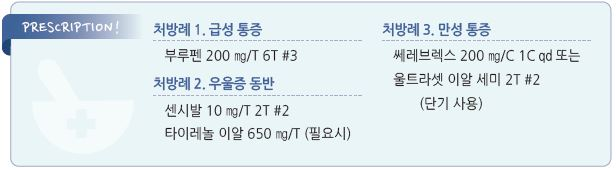

# 통증 Pain

## <mark style="color:green;">일반 사항</mark>

* 평가 : 통증에 대하여 다음 항목들을 최소 1년에 한 번 평가
  * 병력, 신체검사, bio-psycho-social 평가, 통증 형태(neuropathic, nociceptive, or mixed), 중증도, 기능에 대한 영향
  * 통증 상태나 기저 질환이 변화할 때는 더 자주 평가
* 통증 강도 평가 : 환자로 하여금 통증 정도를 표현하도록 함
  * 예) 시각적 아날로그 통증 스케일(visual analogue scale for pain, VAS) : 100 ㎜ 눈금자에 통증이 없으면 0 ㎜ 지점에, 극심한 통증이 있으면 100 ㎜에 표시
* 검사 : 통증 자체를 진단하는 검사 방법은 없으나 원인 및 심각한 문제 감별을 위하여 영상 검사 등을 고려


**RED FLAGS!**

* 주요 외상 또는 고령/골다공증 환자에서 경미한 외상 후 발생한 심한 통증
* 면역 저하 또는 면역억제제 투여
* 최근 세균 감염 또는 정맥 주사제 투여
* 악성 종양 병력
* 50세 또는 <20세에서 시작된 통증
* 치료에 반응하지 않음 또는 점차 악화
* 동반 증상 : 발열, 오한, 체중 감소
* 야간에 악화 또는 누워 있을 때 악화
* 근력 약화 또는 이상 감각
* 방광 또는 장 기능 이상, 신경학적 이상


### <mark style="color:$primary;">만성 통증</mark>

* ＞3개월 지속 또는재발하는 통증 (ICD-11, 2019)
* 만성 통증의 type : neuropathic, muscle, inflammatory, mechanical/compressive pain
* Neuropathic pain (신경병증성 통증) : 신경계의 손상이나 기능 장애에 의해 발생하는 작열감, 찌르는 듯한 통증, 감각 저하 또는 과민, 피부 온도 저하. 예) sciatica, diabetic peripheral neuropathy, 대상포진후신경통, 삼차신경통, fibromyalgia
* Inflammatory pain : 통증 부위의 발열, 발적, 부종; 관절염, 감염, 손상, 수술 후 통증
* Mechanical/Compressive pain : 활동 중 악화, 휴식 시 호전; 특히 목/허리의 근육/인대의 strain or sprain, disks or facet의 변성, 압축 골절 관련

## <mark style="color:green;">Management</mark>

### <mark style="color:$primary;">치료 방침</mark>

**일반 치료 원칙**

* 환자 맞춤 치료 : 모든 환자에게 일률적으로 적용할 수 있는 통증 완화 치료법은 없으며 환자마다 치료에 대한 반응이 다름
* 동반된 문제를 함께 치료하는 것이 효과적임, 특히 정신적 요소를 평가하고 치료함 (☞ p.145)
* 통증 치료에서는 위약 효과가 적지 않음(치료 효과 평가 시 고려, 위약 효과를 치료에 이용할 수도 있음)
* 단순한 증량 또는 같은 계열의 약제를 추가하는 것보다 다른 계열의 약을 추가하는 것이 효과적이며 부작용이 적음
* 압박 또는 약물(예: 항암제, 항생제)에 의해 증상이 악화되는 경우는 이러한 치료를 중지

**만성 통증 치료 원칙**

* 통증의 완전 제거보다 일상 기능(보행, 수면, 사회 활동, 직업 복귀) 회복을 치료 목표로 설정
* 비약물 치료 우선 : 운동, CBT(인지행동치료), 교육, 물리치료 등을 선택
* 오피오이드
  * 비암성 통증에서는 신중히 선택. 다른 치료 먼저 시도. 시작 전 충분한 평가, 최소 유효 용량, 최단 기간 적용
  * 암성통증에서는 오피오이드의 적극적 사용 권장
* 생물심리사회적 모델 : 신체, 심리(우울, 불안, 파국화), 사회적 요인(직업, 가족 환경, 보상 문제)을 통합 고려
* 다학제 접근 : 복잡한 만성 통증이나 치료에 반응이 불충분한 경우 협진(마취과·신경과·정신건강의학과·재활의학과 협진) 고려

### <mark style="color:$primary;">통증의 유형에 따른 치료 선택</mark>

#### Nociceptive pain (침해수용성 통증)

* 외상/염증 등 actual tissue damage에 의해 발생
* **WHO analgesic ladder**
  1. 경증 : non-opioid(acetaminophen, aspirin, NSAID) ± 보조 치료
  2. 경증\~중등증 : opioid(codeine, tramadol) ± non-opioid ± 보조 치료
  3. 중등증\~중증 : opioid(morphine, fentanyl) ± non-opioid ± 보조 치료

#### Neuropathic pain (신경병증성 통증)

* 1st-line : gabapentinoid, TCA, SNRI
  * trigeminal neuralgia에서는 carbamazepine, oxcarbazepine이 1차 선택제
* 2nd-line : opioid analgesics(예: tramadol, codeine)
* 3rd-line : cannabinoid(대마) (✽국내에서는 처방이 사실상 불가능; 일부 국가에서만 적용 가능)
* 4th-line : 국소 lidocaine(대상포진후신경통에서는 2nd-line), methadone, lamotrigine, lacosamide, tapentadol, botulinum toxin

## <mark style="color:green;">비-약물 치료</mark>

* 균형 잡힌 건강한 식사
* 적정 체중 관리
* 가능한 한 활동 유지 또는 점차 활동량을 늘림, 규칙적인 적절한 운동 (☞ p.1160)
* 금연
* 온/냉찜질, 물리 치료, chiropractic, 침, 근육 강화 및 이완 운동
* 인지행동 요법, 요가, 심호흡, mindfulness

## <mark style="color:green;">약물 치료</mark>

### <mark style="color:$primary;">Acetaminophen</mark>

* 대상 : 비염증성 통증
  * 엉덩이/무릎 관절염에 대해서는 지속 효과가 짧으며, 요통에 대해서는 효과가 적음
* 주의 : 간/신 장애, 혈액 응고 장애, 알코올 남용, 소화성 궤양, aspirin 과민성 천식
* 부작용 : 발진, 빈혈, 간/신 독성, 소화성 궤양, 고혈압; NSAID에 비하여 안전
  * 5일 이상 연속 투여 시 간 효소 수치 상승 가능 (✽이것이 곧 간 독성을 의미하는 것은 아님)
  * ＜2 g/d 용량에서는 심각한 GI 부작용 위험은 거의 없음
  * 혈소판 기능에는 영향 없음
* 약물 상호 작용 : warfarin(INR 연장), isoniazid, CYP450 대사 약물
* 용량
  * 325\~650 ㎎ q4\~6h, 1 g qid; 서방형 1,300 ㎎ q8h \[타이레놀]
  * 최대 용량 : 단기 사용(≤3일) 시 4 g/d; 최근 FDA 및 주요 가이드라인에서는 3 g/d 이하 권고 추세
  * 고령, 영양 결핍, 간 독성 위험(규칙적 음주), 간/신 장애 시 2 g/d

### <mark style="color:$primary;">NSAID</mark>

☞ 하단

### <mark style="color:$primary;">Opioids</mark>

* 대상 : non-opioid analgesics에 반응하지 않는 환자에서 opioid의 위험(예: 중독, 과용, 사망)에 비하여 이득이 더 큰 경우에 적용 (보험기준 ☞ p.1175)
* 부작용 : 어지럼, 소양증, 낙상(특히 고령자), 진정, 항콜린 부작용(입마름, 구역, 변비, 소변 저류)
  * 고령에서는 낙상 위험 증가 외에는 NSAID에 비하여 안전
* 금기 : 중증 폐/간/신 장애, 중증 뇌 손상, 마비성 장 폐쇄, 알코올 남용, 수면무호흡증
* 주의 : benzodiazepine 병용 시 집중력 저하, 낙상 증가 등의 위험이 있으므로 피함
  * 치료 시작 전 예상되는 결과에 대하여 주의 깊은 설명을 요함
* 단기 작용 약제를 선택하여 최소 유효 용량으로 시작, 시작 후 조기에 약물 반응을 평가
* 투여 기간 : 아편성 물질- 급성 통증 시 3일 이하 권고, 7일 초과 금지(CDC 2022); tramadol- ＜2주

#### Tramadol

* 작용 : 약한 opioid, SNRI action
* 대사 : CYP 2D6(major), 3A4(minor)
* 다음 약제 병용 시 부작용 증가 : MAOI, SSRI, TCA, trimebutine(✽opioid 수용체에 작용)
* 경련 발생 위험이 있으므로 고령이나 간/신기능 저하자에서는 감량
* 용법 : 50 ㎎ → 필요시 증량 100 ㎎ bid\~qid \[트리돌]
* acetaminophen 또는 NSAID 병용 으로 효과 상승
  * \[울트라셋] (acetaminophen 복합제), \[Seglentis] (celecoxib 복합제)

#### Codeine

* 용법 : 20\~100 ㎎ tid \[인산코데인]
* 복합제 : 코데인 10 ㎎ + ibuprofen 200 ㎎ + AAP 250 ㎎ \[마이폴]

#### Hydrocodone

* 용법 : 2.5\~5 ㎎ 12T q4\~6h, 7.5 ㎎ 1T q46h
* 복합제 : hydrocodone + AAP \[하이코돈]

#### Oxycodone

* 용법 : 초회 10 ㎎ bid/, 10\~80 ㎎/d \[옥시콘틴 서방]

#### Hydromorphone

* 비서방형 : 2\~4 ㎎ q4\~6h \[저니스타]
* 서방형 : 저용량(4 ㎎)으로 시작. 1일 1회 \[저니스타 서방]

#### Buprenorphine 패취제

* 저용량(5\~10 ㎍/wk)으로 시작 → 효과 및 부작용을 관찰하며 증량; 1주 1매 \[노스판 패취]
* 보험기준 : NSAID의 최대 용량에도 반응하지 않아 마약성 진통제를 필요로 하는 심한 통증에 1주 20㎍/h까지 인정. 1회 처방 당 최대 30일까지 인정

#### Fentanyl 패취제

* 용법 : 12, 25, 50, 100 ㎍/h 1매를 3일간 적용 \[듀로제식디트랜스 패취]

#### <mark style="color:$info;">비암성 만성 통증에서 Opioid 처방 10대 원칙</mark>

(대한통증학회, 2024)

**기본 원칙**

* 병력 청취, 이학적 검사, 다양한 평가 도구로 환자 상태를 파악한 이후 꼭 필요한 경우에만 고려
* 치료 전 통증·기능·삶의 질에 대한 구체적·측정 가능한 목표를 설정; 목표 미달 시 중단 고려
* 펜타닐 성분이 포함된 경구용 제재나 패치 제재를 처방하는 경우 아편유사제 투약 이력을 확인해야함. 마약류 통합관리시스템 NIMS([https://www.nims.or.kr](https://www.nims.or.kr))

**처방 시작**

* 심한 급성 통증(＜1개월) : 속효성 제제를 최소 유효 용량으로 처방; 최소 2주마다 평가
* 아급성(1\~3개월) 및 만성(＞3개월) 통증 : 비아편유사제를 우선 고려. 불가피한 경우에만 사용
  * 초기 용량 : 5\~10 MME(1회) 또는 20\~30 MME/일로 시작
  * 하루 50 MME 이상의 추가 증량은 가급적 피함
  * 치료 시작 또는 용량 증량 후 4주 이내에 이익과 위험을 재평가

**서방형/지속형 제제**

* 최소 1주일 동안 매일 일정 용량의 속효성 경구 opioid를 투여받은 환자에게만 고려
* 이익보다 위험이 큰 경우 감량 또는 중단을 고려. 갑작스러운 중단이나 급격한 감량은 피함

**감량/중단**

* 감량 속도는 환자의 임상 상황에 따라 개별화
  * 1년 이상 복용 : 월 10%씩 감량
  * 수주\~수개월 복용 : 주 10%씩 감량 → 원래 용량의 30%에 도달 후 남은 용량의 주 10%씩 감량
* 급성 통증으로 사용한 경우
  * 3일 이상\~1주 미만 : 2일간 일일 용량을 50%로 감량
  * 1주 이상\~1개월 미만 : 2일마다 약 20%씩 감량

**Opioid 회전 (Opioid Rotation)**

* 다음의 경우 고려 : 부작용 지속, 충분한 증량에도 효과 불충분, 신기능 저하로 졸음/신경 독성 발생
* 현재 opioid 총량의 MME를 계산 후 대체 약물의 50\~75% MME에서 시작; 부작용 및 진통 효과를 관찰하며 적정

**모니터링**

* 처음 처방 시 및 장기 처방 중 환자 처방 이력을 주기적으로 검토
* 적절한 용량 투여 여부 및 과다 복용 위험 약물과의 병용 여부를 지속 확인

**통증 관리를 위해 일반적으로 처방되는 아편유사제에 대한 모르핀 밀리그램 등가 용량**

| 아편유사제             |                        | 변환계수\*  |
| ----------------- | ---------------------- | ------- |
| **정맥 주사**         | 모르핀 (Morphine)         | 1.0     |
|                   | 하이드로몰폰 (Hydromorphone) | 6.6     |
|                   | 펜타닐 (Fentanyl)         | 100†    |
| **정맥 주사를 경구로 전환** | 모르핀 (Morphine)         | 3.0     |
|                   | 하이드로몰폰 (Hydromorphone) | 2.5–5.0 |
|                   | 옥시몰폰 (Oxymorphone)     | 10      |
|                   | 트라마돌 (Tramadol)        | 3.0     |

* \*MME 용량 = 아편유사제의 용량(mg) × 변환계수. 예) 단일 정맥 투여 : 모르핀 10 mg = 하이드로몰폰 1.5 mg (1. 5 mg × 6.6 = 10 MME) = 펜타닐 0.1 mg (0 1 mg × 100 = 10 MME). 모르핀 10 mg 정맥 주사를 경구로 전환하면 경구 모르핀 30 mg&#x20;
* † 단일 정맥 투여의 경우, 모르핀 10 mg은 펜타닐 0.1 mg (100 mcg)과 유사하지만 만성적으로 펜타닐을 투여하는 경우 모르핀 10 mg은 펜타닐 0 25 mg (250 mcg)과 유사
* MME 전환은 추정치로 아편유사제 회전이나 전환을 고려 시 MME에서 계산된 용량을 그대로 사용하면 안 되고 불완전한 교차 내성과 아편유사제 약동학의 개별 가변성 때문에 과다 복용을 피하기 위해 계산된 MME 용량보다 상당히 낮은 용량으로 투여
* 변환계수의 아편유사제 사용장애 관리와 관련된 용량 결정에 적용은 불가.

### <mark style="color:$primary;">항우울제</mark>

* 항우울제에는 항우울 작용과 별개의 진통 효과가 있으며 TCA 계열이 보다 우수함 (☞ p.1146)
* 특히 우울증 환자에서 고려 (✽만성 통증 환자에서 흔히 우울증이 동반됨)
* 우울증 치료 때보다 효과가 빠르게 나타나며(약 1주) 저용량에서도 효과가 있음
* 투여 중 부작용 등 위해보다 효과와 필요성이 더 우월한지 여부를 정기적으로 평가

#### TCA

* 대상 : 대상포진후신경통, 당뇨병신경병증, 긴장성 두통, 편두통, RA, 악성 종양, 뇌졸중후통증
  * 급성 신경병증성 통증과 만성 요통에 대해서는 효과 입증이 불충분하다는 보고가 있음
* opioid 병용 시 효과 및 부작용이 증가함
* 부작용 : 졸음, 입마름, 기립성 저혈압, 변비, 소변 저류, 심장 전도 장애
  * 대처 : 저용량으로 시작, 취침 시 복용
  * 투여 전 ECG 검사, 혈압/맥박 모니터링
* 주의/금기 : 고령, 심질환(특히 전도 장애), 심한 위장 기능 장애
* 용량 : 저용량으로 시작(고령에서는 ½ 용량으로 시작); 1주 간격으로 증량
* amitriptyline : 항콜린 작용이 가장 큼; 10\~25 ㎎ hs, 최대 125 ㎎/d \[에트라빌]
* nortriptyline : 10\~25 ㎎ tid, 최대 150 ㎎/d \[센시발]
* desipramine : 항콜린 작용이 가장 적음; 25 ㎎/d, 최대 300 ㎎/d

#### SNRI, SSRI

* TCA에 비하여 효과 적음
* 대상 : 다른 약물 요법으로 실패한 말초신경병증성 통증, 섬유근육통
* duloxetine : 섬유근육통, 골관절염; 30\~60 ㎎/d qd \[심발타] (보험기준 ☞ p.1177)
* fluoxetine : 섬유근육통; 20\~80 ㎎/d qd \[푸로작]
* Tapentadol
  * 작용 : opioid(μ 수용체 작용) + SNRI(norepinephrine 재흡수 억제) 이중 기전
  * 대상 : 중등증\~중증의 급성 및 만성 통증, 당뇨병신경병증
  * 장점 : 기존 opioid에 비하여 위장관 부작용(구역, 변비)이 적음
  * 부작용 : 어지럼, 구역, 두통, 졸음
  * 주의 : MAOI 병용 금기; SSRI/SNRI 병용 시 serotonin syndrome 위험
  * 용법 : 서방형 50 ㎎ bid로 시작, 3일 간격으로 50 ㎎씩 증량 \[뉴신타 서방]

### <mark style="color:$primary;">Benzodiazepine</mark>

* 일부 연구에서 통증 감소에 유효 (☞ p.1149)
* 중독 문제로 ＜2주의 단기 사용으로 제한하며, 만성 통증에 대하여 권고하지 않음
* 부작용 : 졸음, 의존성
* clonazepam : 0.25 ㎎ qd\~tid, 필요시 3일 간격 증량, 최대 3\~6 ㎎/d \[리보트릴]
* lorazepam : 1\~4 ㎎/d #2\~4. 최대 20 ㎎/d \[아티반]
* diazepam : 2\~10 ㎎ bid\~qid \[디아제팜]

### <mark style="color:$primary;">Anticonvulsants</mark>

* 대상 : 신경병증성 통증, 특히 찌르는 듯한 통증

#### Gabapentinoid (α2δ Ligands)

* 대상 : 대상포진후신경통, 당뇨병신경병증, central neuropathic pain, 섬유근육통
* 저용량으로 시작하여 점차 증량 (보험기준 ☞ p.1193)
* 충분한 효과까지 2달 이상이 필요할 수 있음; pregabalin이 보다 빠른 효과를 보임
* 부작용 : 어지럼/졸음(용량의존; 저용량 시작 및 서서히 증량 시 완화), 도취감, 의존성/남용 가능성(특히 pregabalin; 영국에서는 2019년 규제 약물로 지정)
* gabapentin : 100\~300 ㎎ hs → 100 ㎎/3d 씩 증량, 최대 1200 ㎎ tid \[뉴론틴]
* pregabalin : 75 ㎎ bid → 150 ㎎ bid, 최대 600 ㎎/d \[리리카]

#### Others

* carbamazepine : 100 ㎎ bid → 증량, 최대 800 ㎎/d \[테그레톨]
  * 부작용 : WBC↓, PLT↓, 조절 장애(예: 시야 혼탁), 부종, 기면, 구토, 두통, 혼돈
* lamotrigine : 50 ㎎/d, 증량 50 ㎎/2wk, 최대 400 ㎎/d \[라믹탈]
  * gabapentinoid보다 효과적이지 않음. 2차 약제로 고려
* topiramate : 요통에 효과 기대; 50\~400 ㎎ #1\~2 \[토파맥스]

### <mark style="color:$primary;">N-methyl-D-aspartate receptor antagonist (NMDA)</mark>

* 대상 : 신경병증성 통증. 예) 당뇨병신경병증, 대상포진후신경통, phantom limb pain, 말초신경병증성 통증, 복합부위통증증후군
* 심한 부작용 없음
* memantine : 5 ㎎ qd, 2일마다 5 ㎎ 증량, 유지 10 ㎎ bid \[에빅사] (보험주의)

### <mark style="color:$primary;">근이완제, 항경련제</mark>

* 효과에 대한 입증은 전반적으로 부족함 (✽골관절염에 의한 통증에는 효과가 적음)
* 대상 : 근육 경련이 통증의 원인인 경우
  * 졸음 등 부작용 문제로 고령자에게는 권고 안 함
* 부작용 : 졸음, 어지럼, 구역
* 단기 작용제 선택
* baclofen : 5\~10 ㎎ tid \[바크론]
* carisoprodol : 350 ㎎ tid
* tizanidine : 1\~2 ㎎ tid \[실다루드]
* cyclobenzaprine : 15\~30 ㎎ qd(서방형) \[본렉스 이알]
* chlorphenesin : 250 ㎎ tid \[릴렉시아]
* methocarbamol : 1.5\~2.25 g #3 \[메토카몰]

### <mark style="color:$primary;">Steroid</mark>

* 작용 : 항염, 진통
* 부작용 : 혈압 상승, 체액 저류, 골다공증 (☞ p.349)
* dexamethasone : 다른 steroid에 비하여 mineralocorticoid 작용이 적음; 0.5\~8 ㎎/d \[덱사메타손]

### <mark style="color:$primary;">기타 국소 진통제</mark>

#### Lidocaine patch

* 대상 : 1차 약제가 효과적이지 않은 대상포진후신경통
  * 대상포진후신경통에 대하여 lidocaine이 capsaicin보다 효과와 내약성이 우수하다는 보고가 있음
* 용법 : 1일 1회 1\~3매, 최대 12시간 부착. 12시간 drug-free interval 필요 \[리도탑 카타플라스마]

#### Capsaicin cream

* 작용 : 감각 신경 말단에서 substance P를 고갈 시킴으로써 탈감작 효과를 얻음
* 대상 : 1차 약제가 효과적이지 않은 neuropathic pain
* 효과 발현까지 2주 이상 소요
* 부작용 : 작열감, 발적; 초기에 심함
* 용법 : 0.075% cream qid \[다이악센]

#### Rubefacient

* 작용 : 모세혈관 확장, 혈액 순환 증가
* 제한적 효과
* 대상 : 다른 약물 치료로 효과가 없는 근골격 통증에 대하여 고려

<figure><figcaption></figcaption></figure>

\*상부 위장관합병증(소화성 궤양천공, 폐쇄, 출혈)의 상대위험도\
Ref. Individual NSAIDs and Upper Gastrointestinal Complications. Drug Saf 2012:35(12)

## <mark style="color:green;">NSAID</mark>

### <mark style="color:$primary;">경구제</mark>

* 종류에 따른 일반적 효과 차이는 없으나 환자에 따른 차이는 있음; 2주 이상 투여 후 효과 판단
* 심혈관 및 위장 부작용 위험을 고려하여 선택
* 대사 : 대부분 간 대사
* short-acting 약제 (반감기 ＜6시간) : ibuprofen, diclofenac, ketoprofen, indomethacin
* long-acting 약제 (반감기 ＞6시간) : naproxen, celecoxib, nabumetone, piroxicam
* COX-2 선택 억제제 : 소화성 궤양 위험이 보다 적음, 혈소판 응고 저해 작용이 적음; 고용량에서 심혈관 위험 증가; celecoxib, meloxicam
* prodrug : 흡수 후 hepatic biotransformation되어 활성화; GI 문제가 약간 적고 renal prostaglandin 억제가 덜함; sulindac, nabumetone
* 만성 통증에 대한 저용량 naltrexone
  * 작용 : 저용량에서 opioid 수용체를 일시적으로 차단 → 내인성 opioid 분비 반동성 증가, 미세아교세포(microglia) 활성 억제를 통한 항염 효과
  * 대상 : 섬유근육통, 만성 통증 (✽아직 근거 수준이 낮으며 허가 외 사용임)
  * 용법 : 1.5\~4.5 ㎎ qd (취침 시); 통상 용량인 50 ㎎/d의 1/10 수준
  * 부작용 : 수면 장애, 생생한 꿈; 대체로 경미함
  * 비고 : 소규모 연구에서 긍정적 결과가 보고되고 있으나 대규모 연구는 부족

#### 주의/금기

* 궤양 위험 인자가 있는 환자 : 고령(＞65세), 소화성 궤양 또는 위장관 출혈 병력, IBD, 출혈 경향(혈소판 기능 장애, 항응고 치료 포함), NASIDs 복합 또는 고용량 투여, steroid 투여
* 심혈관 질환(MI, 뇌졸중, 정맥혈전증, 조절되지 않는 고혈압), 간/신 장애
* aspirin 과민 천식 (✽간혹 aspirin 알레르기 환자에서 NSAID에 알레르기 반응이 발생함)
* 약물 상호 작용 : 항고혈압제(ACEI/이뇨제 효과↓), warfarin(INR↑), lithium, methotrexate, 저용량 aspirin(심혈관 보호 효과↓)

#### 부작용

* 위장관 : 소화불량, 구역, 복부 팽만, 소화성 궤양(발생 빈도: 2%/년, 복수의 위험 인자가 있는 경우 10\~20%/년), 위장관 출혈(전조 증상 없이 갑자기 발생함)
  * 위장 출혈 위험 인자 : 장기 사용, ＞70세, 고용량, 위험이 보다 높은 NSAID, NSAID 병용, 항응고제(aspirin)/steroid/SSRI 병용, 중증 질환, H. pylori 감염, 소화성 궤양 과거력, 알코올 남용
* 피부 : 발진, 두드러기; 드물게 toxic epidermal necrolysis, Stevens-Johnson syndrome
* 혈소판 응고 저해(투약 종료 후 2일까지 영향)
* 심혈관 질환, 간염(특히 sulindac, diclofenac), 신 독성/신부전, 천식 악화, 체액 저류(부종, 혈압↑)
  * 신 독성 위험 인자 : ＞60세, 신장 질환력, 심부전, 복수, 이뇨제 사용
  * 고령자에서 10년 NSAID 사용 추적 조사에서 유의미한 신기능 저하가 관찰되지 않았다는 보고가 있음
  * MI, 뇌졸중, 사망을 포함한 심혈관 사고의 위험을 30% 증가시킨다는 보고가 있음 (✽약제 종류 및 용량에 따라 차이가 있으며, naproxen이 상대적으로 심혈관 위험이 낮음)

#### 부작용 대처

* 최소 유효 용량을 최단 기간 투여
* 저용량 aspirin을 병용해야 하는 경우 aspirin 복용 2시간 이후에 NSAID 투여
* 장기 복용 환자에서 CBC, RFT, LFT 최소 매년, 위험 인자가 있는 환자에서는 보다 자주 평가
* 다음의 경우 NSAID 투여 중단 : LFT 정상 상한치 ＞3배, s-albumin↓, PT 연장
* 수술 전 중단 : 속효성 NSAID- 1\~2일 전, 지속성 NSAID- 3일 전, aspirin- 1주 전 중단
* 소화성 궤양에 대한 대처
  * H. pylori 감염 치료
  * COX-2 억제제 선택 (✽aspirin과 병용 시 COX-2 억제제의 위장 보호 효과는 소멸됨)
  * misoprostol : 위궤양 예방 효과; 소화불량 발생 가능; 200 ㎍ qid \[싸이토텍] (☞ p.376)
  * PPI : 다음 약제를 1일 1회 복용; omeprazole 20\~40 ㎎ \[오엠피], esomeprazole 40 ㎎ \[넥시움], lansoprazole 30 ㎎ \[란스톤], dexlansoprazole 30\~60 ㎎ \[덱실란트 디알], pantoprazole 40 ㎎ \[판토록], rabeprazole 20 ㎎ \[파리에트] (☞ p.378)
  * H2-blocker : 고용량(상용량의 2배 용량)으로 NSAID에 의한 소화성 궤양 예방 효과 (☞ p.377)

### <mark style="color:$primary;">외용제</mark>

* 허리 이외 부위의 근골격계 손상에 의한 급성 통증에 대하여 경구제와 동등한 효과
* 만성 통증에 대한 효과는 급성 통증에 비하여 적음
* 대상 : 작은 관절(예: 손), 무릎 OA (보험기준 ☞ p.1175)
  * 고관절 OA에는 효과 없음
* 주의/금기 : 기관지 천식, 임부, 수유부, 소아
* 투여 횟수 : 통상 플라스타/파스류 1\~2회/d, 크림/겔 1\~4회/d
* ketoprofen \[케토톱 플라스타/겔] (12시간, 24시간 적용 제품군)
* piroxicam \[트라스트 패취/겔] (48시간 적용 제품군)
* indomethacin \[바이겔 크림]
* diclofenac \[볼타렌 에멀겔]

### <mark style="color:$primary;">NSAID 비교</mark>

<table><thead><tr><th width="195.42105102539062">성분명 [상품명]</th><th width="213.5789794921875">용량 (골관절염)</th><th width="99.631591796875">위장관 합병증*</th><th>비고</th></tr></thead><tbody><tr><td><strong>Salicylates</strong></td><td></td><td></td><td></td></tr><tr><td>aspirin [로날]</td><td>0.5~1g bid~tid</td><td></td><td>Plt 응고 저해 (7~10일)</td></tr><tr><td><strong>Anthranilic acids</strong></td><td></td><td></td><td></td></tr><tr><td>meclofenamic acid</td><td>50~100 mg qid</td><td></td><td>GI 장애</td></tr><tr><td>mefenamic acid [폰탈]</td><td>250 mg qid (단기 사용)</td><td></td><td>월경통에 선호; 항염작용은 적음</td></tr><tr><td>morniflumate [모니플루]</td><td>700 mg bid</td><td></td><td></td></tr><tr><td>tolfenamic acid</td><td>200 mg tid</td><td></td><td></td></tr><tr><td><strong>Arylacetic acids</strong></td><td></td><td></td><td></td></tr><tr><td>aceclofenac [에어탈]</td><td>100 mg bid</td><td>1.43</td><td></td></tr><tr><td>diclofenac [디페인]</td><td>50 mg tid</td><td>3.34</td><td>CYP2C9 대사</td></tr><tr><td>etodolac [로딘]</td><td>서방형 400~1,000 mg qd</td><td></td><td>상대적 COX-2 선택성</td></tr><tr><td>ketorolac [케토라신]</td><td>10 mg qid</td><td>11.5</td><td></td></tr><tr><td>sulindac [크리돌]</td><td>100~200 mg bid</td><td>2.89</td><td>신 장애 시 선호; 간 독성 부작용</td></tr><tr><td><strong>Arylpropionic acids</strong></td><td></td><td></td><td></td></tr><tr><td>dexibuprofen [애니펜]</td><td>300 mg bid~qid</td><td></td><td></td></tr><tr><td>fenoprofen</td><td>300~600 mg tid~qid</td><td></td><td>신장애 시 금기</td></tr><tr><td>flurbiprofen</td><td>50~100 mg bid~qid</td><td></td><td>Lozenge 제제가 있음</td></tr><tr><td>ibuprofen [부루펜]</td><td>400 mg qid~800 mg tid</td><td>1.84</td><td></td></tr><tr><td>ketoprofen</td><td>50 mg qid~100 mg bid</td><td>3.92</td><td></td></tr><tr><td>loxoprofen [록소닌]</td><td>60 mg bid~tid</td><td></td><td></td></tr><tr><td>nabumetone [프로닥]</td><td>500 tid~1,000 mg bid</td><td></td><td>slow onset, Plt 영향적음</td></tr><tr><td>naproxen [낙센]</td><td>250~500 mg bid</td><td>4.10</td><td>상대적으로 심혈관 독성이 적음</td></tr><tr><td>oxaprozin</td><td>1200 mg qd</td><td></td><td>지속형</td></tr><tr><td>zaltoprofen [솔레톤]</td><td>80 mg tid</td><td></td><td></td></tr><tr><td><strong>Oxicams</strong></td><td></td><td></td><td>드물게 Stevens Johnson 증후군</td></tr><tr><td>lornoxicam [제포]</td><td>12 mg #3</td><td></td><td></td></tr><tr><td>meloxicam [모빅]</td><td>7.5~15 mg qd</td><td>3.47</td><td>상대적 COX-2 선택성, Plt 영향적음</td></tr><tr><td>piroxicam [브렉신]</td><td>10~20 mg qd</td><td>7.43</td><td>20 mg 매일 복용 시 심한 GI 독성</td></tr><tr><td>tenoxicam</td><td>20 mg qd</td><td>4.10</td><td></td></tr><tr><td><strong>Coxibs</strong></td><td></td><td></td><td></td></tr><tr><td>celecoxib [쎄레브렉스]</td><td>100 mg bid, 200 mg qd</td><td>1.45</td><td>Plt 영향 없음 (보험기준 ☞ p.1196)</td></tr><tr><td>etoricoxib [알콕시아]</td><td>30~60 mg qd</td><td></td><td>용량 관련 혈압 상승</td></tr><tr><td><strong>Others</strong></td><td></td><td></td><td></td></tr><tr><td>nimesulide [메수리드]</td><td>50~100 mg bid (최대 15d)</td><td>3.83</td><td></td></tr><tr><td>talniflumate [소말겐]</td><td>370 mg tid</td><td></td><td></td></tr></tbody></table>

\*상부 위장관합병증(소화성 궤양천공, 폐쇄, 출혈)의 상대위험도\
Ref. Individual NSAIDs and Upper Gastrointestinal Complications. Drug Saf 2012:35(12)

**Oxford league table**&#x20;

| 성분명 (mg)          | NNT¹⁾ | 성분명 (mg)          | NNT |
| ----------------- | ----- | ----------------- | --- |
| Dipyrone 1000     | 1.6   | Lumiracoxib 400   | 2.7 |
| Etoricoxib 120    | 1.6   | Naproxen 500/550  | 2.7 |
| Valdecoxib 40     | 1.6   | Naproxen 400/440  | 2.7 |
| Ibuprofen 600/800 | 1.7   | Piroxicam 20      | 2.7 |
| Valdecoxib 20     | 1.7   | Bromfenac 10      | 2.9 |
| Diclofenac 100    | 1.8   | Morphine 10 (IM)  | 2.9 |
| Ketorolac 20      | 1.8   | Tramadol 150      | 2.9 |
| Ketorolac 60 (IM) | 1.8   | Ketorolac 30 (IM) | 3.4 |
| Piroxicam 40      | 1.9   | Naproxen 200/220  | 3.4 |
| Celecoxib 400     | 2.1   | AAP 500           | 3.5 |
| Bromfenac 25      | 2.2   | Celecoxib 200     | 3.5 |
| Rofecoxib 50      | 2.3   | AAP 1500          | 3.7 |
| Aspirin 1200      | 2.4   | Ibuprofen 100     | 3.7 |
| Bromfenac 50      | 2.4   | AAP 1000          | 3.7 |
| Dipyrone 500      | 2.4   | Aspirin 600/650   | 4.4 |
| Ibuprofen 400     | 2.5   | AAP 600/650       | 4.6 |
| AAP 650+Trama 75  | 2.6   | Ibuprofen 50      | 4.7 |
| Bromfenac 100     | 2.6   | Tramadol 100      | 4.8 |
| Diclofenac 25     | 2.6   | Tramadol 75       | 5.3 |
| Ketorolac 10      | 2.6   | Ketorolac 10 (IM) | 5.7 |
| Diclofenac 50     | 2.7   | Bromfenac 5       | 7.1 |
| Ibuprofen 200     | 2.7   | Tramadol 50       | 8.3 |

NNT: Number Needed to Treat (낮을수록 효과적)

**Cox isoform selective** (log scale)
