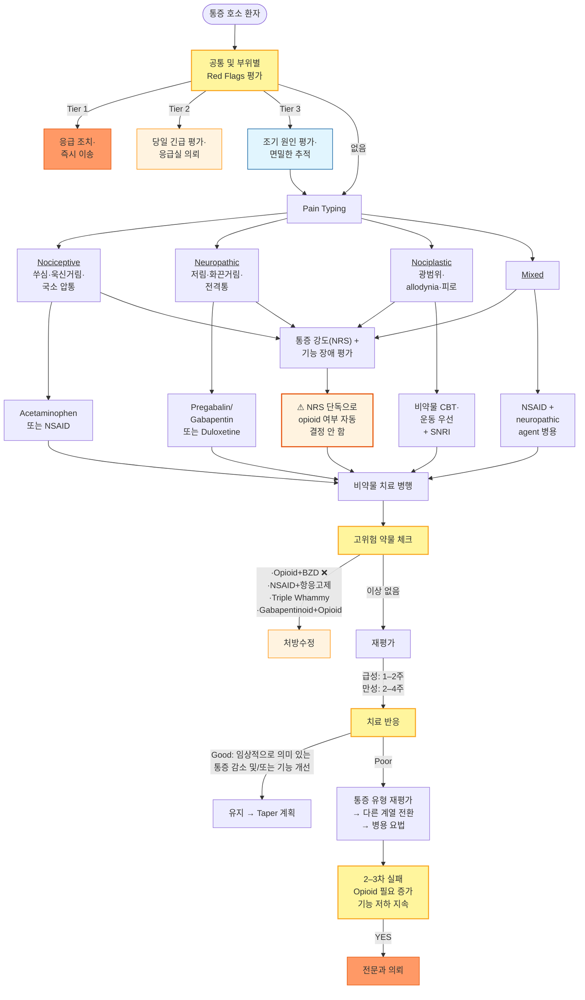
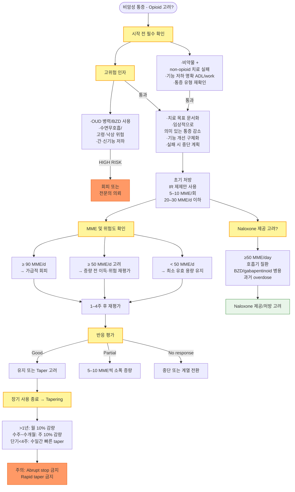
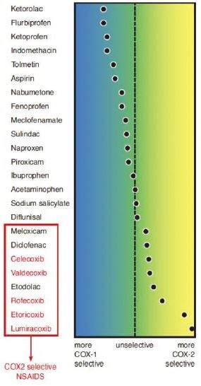

# 통증 Pain

## <mark style="color:green;">일반 사항</mark>

#### <mark style="color:$primary;">통증 발생의 기본 원리</mark>

* 급성 통증은 조직 손상 또는 손상 위협을 알리는 보호적 신호로, 다음 단계를 거쳐 발생함
  * 전환(transduction) : 유해 자극(기계적·열적·화학적 손상)이 말초 nociceptor를 자극하여 전기 신호로 전환
  * 전달(transmission) : Aδ섬유(날카롭고 국소적인 통증)와 C섬유(둔하고 지속적인 통증)를 통해 척수 후각으로 전달된 후, 척수시상로를 거쳐 뇌로 전달
  * 조절(modulation) : 척수 및 하행 억제 경로(노르에피네프린·세로토닌 매개)에서 신호가 증폭되거나 억제됨
  * 인지(perception) : 대뇌피질에서 비로소 '통증'으로 인식되며, 이 단계에서 불안·과거 경험·파국화 등 정서적·인지적 요소가 실제 통증 경험에 영향을 줌
* 만성 통증은 이 경로 자체가 변화(중추 감작 등)하여, 원래의 유해 자극이 약하거나 사라져도 통증이 지속·증폭되는 상태 (☞ 아래 [Central sensitization](001_-pain.md#undefined-3) 참조)

<mark style="color:cyan;">**진통제의 작용 원리**</mark>

* 원인 치료가 아닌 통증 신호 차단 : 대부분의 진통제는 통증을 유발한 근본 원인(조직 손상, 감염, 종양, 신경 압박 등)을 제거하지 않으며, 위 통증 경로 중 한 단계를 차단하여 증상만 완화하는 대증치료(symptomatic treatment)임
  * NSAID·acetaminophen : 말초·중추에서 prostaglandin 합성 억제 → nociceptor 민감화 감소 (전환 단계 차단)
  * 국소마취제·일부 항경련제(gabapentinoid, carbamazepine) : 신경세포막 Na⁺/Ca²⁺ 채널 차단 → 신호 전달 억제 (전달 단계 차단)
  * Opioid : 척수·뇌의 opioid 수용체에 결합하여 통증 신호 전달을 억제하고 통증에 대한 정서적 반응을 완화 (전달·인지 단계 차단)
  * 항우울제(TCA, SNRI) : 하행 억제 경로의 노르에피네프린·세로토닌 재흡수 억제 → 내인성 통증 조절 기능 강화 (조절 단계 강화)
* 진통제로 증상이 조절되더라도 근본 원인 질환에 대한 평가·치료는 별도로 이루어져야 하며, "진통제에 반응한다"는 사실만으로 심각한 원인 질환을 배제할 수는 없음 (☞ 아래 Red Flags 참조)

#### <mark style="color:$primary;">평가 및 검사</mark>

* 통증이 있는 환자에서는 초기 평가 후 통증 변화·기능·수면·정신사회적 영향을 주기적으로 평가
  * 평가 항목 : 병력, 신체검사, bio-psycho-social 평가, 통증 형태(neuropathic, nociceptive, or mixed), 중증도, 기능에 대한 영향 등
  * 통증 상태나 기저 질환이 변화할 때는 더 자주 평가
* 검사 : 통증 자체를 진단하는 검사 방법은 없으나 원인 및 심각한 문제 감별을 위하여 영상 검사 등을 고려

<mark style="color:cyan;">**통증 강도 평가 기술 방법**</mark>

* 환자로 하여금 통증 정도를 표현하도록 함
* 수치 평가 척도(Numeric Rating Scale, NRS) : 0("통증 없음")\~10("상상할 수 없는 극심한 통증") 숫자 중 현재 통증 강도를 선택; 구두로 즉시 측정 가능하여 임상에서 가장 널리 사용됨
* 시각적 아날로그 통증 스케일(Visual Analogue Scale, VAS) : 100 ㎜ 눈금자에 통증이 없으면 0 ㎜ 지점에, 극심한 통증이 있으면 100 ㎜에 표시

<figure><figcaption><p><strong>시각적 아날로그 통증 스케일(visual analogue scale, VAS)</strong></p></figcaption></figure>

### <mark style="color:$danger;">🚩 Red Flags!</mark>


통증의 강도만으로 응급도를 판단하지 않음. 통증 부위와 관계없이 먼저 생리적 불안정, 급성 혈관·신경계 사건, 중증 감염, 출혈·외상 및 장기 폐색·파열 가능성을 평가. Red flag가 없더라도 임상적으로 중증 질환이 의심되면 해당 부위별 챕터에 따라 추가 평가.

저혈압·의식 변화·호흡수 증가·저산소증 등은 통증의 원인과 무관하게 중증질환 가능성을 높이므로, 통증 평가에서 활력징후와 의식 수준을 우선 확인함.

암 병력, 체중 감소, 야간 발한 등은 단독으로 응급 질환을 확정하지 않지만, 통증의 지속·진행 및 다른 임상 소견과 결합하면 조기 원인평가가 필요함.


<mark style="color:$danger;">**즉각 응급 조치 및 이송**</mark>

* 저혈압·쇼크 징후, 저산소증·심한 호흡곤란, 청색증, 의식 변화 또는 실신 등 생리적 불안정  `쇼크` `호흡부전` `순환 붕괴`
* 갑자기 시작되어 수초\~수분 내 최고 강도에 도달한 이전과 다른 통증, 특히 흉부·등·복부·두부 통증  `ACS` `대동맥 박리` `지주막하출혈` `장기 파열/천공`
* 통증과 함께 새로 발생한 편측 마비, 언어·시야 장애, 보행 불능, 경련 또는 의식 변화  `뇌졸중` `경련성 질환`
* 흉부·상복부·등·턱·팔 통증에 호흡곤란, 식은땀, 오심 또는 실신이 동반되는 경우  `ACS` `대동맥 박리` `폐색전증`
* 갑작스러운 사지 통증과 창백·냉감·맥박 저하·감각 또는 운동 저하  `급성 사지 허혈`
* 진찰 소견에 비해 현저히 심한 통증, 빠르게 증가하는 부종·긴장 또는 신경혈관 이상  `구획 증후군`
* 복막자극징후, 토혈·혈변 등 활동성 출혈, 박동성 종괴 또는 장기 파열·폐색이 의심되는 소견  `복막염` `소화관 출혈` `대동맥류 파열` `장 폐색/천공`
* 중증 외상 후 통증과 출혈, 변형, 신경혈관 이상 또는 활력징후 불안정  `중증 외상` `골절/탈구` `혈관 손상`
* 새로 발생한 배뇨 곤란·요저류·요실금, 대변 실금 또는 직장 충만감 소실, 회음부·안장 부위 감각 저하, 항문 괄약근 긴장도 저하, 또는 급속히 진행하는 양측 하지 근력 저하  `마미증후군` `척수 압박`
  * 항문 괄약근 긴장도 저하는 마미증후군을 시사할 수 있으나 단독 진단 소견은 아니며, 정상이라고 해서 마미증후군을 배제할 수 없음 - 직장수지검사(DRE)로 평가한 항문 긴장도는 진단 정확도가 낮고 위음성으로 인한 잘못된 안심의 위험이 있음. 배뇨·배변 장애나 안장부위 감각 변화 중 한 소견만 있어도 임상적으로 의심해야 하며, 단일 소견이 정상이라는 이유만으로 배제하지 않음
* 진통제·opioid 사용 후 호흡저하 또는 의식저하  `Opioid 과다복용` `호흡억제`

<mark style="color:$warning;">**당일 긴급 평가 또는 응급실 의뢰**</mark>

* 발열·오한·전신 상태 저하와 함께 발생한 새롭거나 심한 국소 통증  `중증 감염` `패혈증`
* 급성 단관절 발적·열감·부종, 빠르게 확산하는 피부·연조직 염증 또는 괴사성 감염 의심  `화농성 관절염` `괴사성 근막염` `봉와직염`
* 새로 발생하거나 진행하는 객관적 근력 저하, 보행 장애 또는 신경학적 결손  `신경학적 결손` `척수/신경근 압박`
* 지속적인 구토, 경구 섭취 불가, 탈수, 소변·대변·가스 배출 장애  `장 폐색` `탈수/전해질 이상`
* 임신 또는 산후 기간에 발생한 새롭고 심한 두통·흉통·복통·골반통  `자간전증` `폐색전증` `자궁외 임신` `산과적 응급`
* 항응고제 복용 중 발생한 새롭고 심한 원인 불명 통증 또는 경미한 외상 후 지속되는 통증  `출혈` `혈종`
* 면역저하, 활동성 암, 정맥주사 약물 사용, 최근 수술·침습적 시술·균혈증이 있는 환자의 새롭고 지속적인 통증  `기회감염` `농양` `암 전이/재발`
* 고령·골다공증 환자의 외상 후 심한 통증 또는 체중 부하 불능  `골다공증성 골절`

<mark style="color:$info;">**조기 원인 평가 및 면밀한 추적**</mark> <mark style="color:$info;">- 즉각 위험 낮으나 호전 없으면 의뢰</mark>

* 적절한 초기 치료에도 호전되지 않거나 점차 악화하는 통증  `진단 재평가 필요`
* 설명되지 않는 체중 감소, 야간 발한, 지속되는 발열·피로와 동반된 통증  `악성 종양` `만성 감염`
* 휴식·야간 통증이 지속되면서 악성 종양, 감염 또는 염증성 질환의 위험 요인이 동반된 경우  `악성 종양` `감염` `염증성 질환`
* 활동성 암 병력 또는 과거 암 치료 부위에 발생한 새롭거나 진행하는 통증  `암 재발/전이`
* 반복되는 원인 불명 통증 또는 통증과 함께 기능·보행·수면·일상생활이 계속 저하되는 경우  `만성 통증 증후군`
* 지속하거나 확대되는 감각 이상·방사통 또는 새로운 자율신경계 이상  `신경병증성 통증` `자율신경계 이상`

### <mark style="color:orange;">만성 통증</mark>

* ＞3개월 지속 또는 재발하는 통증 \[ICD-11]


**ICD-11 만성 통증 분류** : ICD-11(2019)은 만성 통증을 두 범주로 구분하며, 이 구분은 "통증 = 증상"이 아닌 "통증 = 독립 질환" 으로 인식의 전환을 반영.\
• **Chronic primary pain** : 통증 자체가 독립적 질환 - 다른 질환으로 설명되지 않는 통증 (예: 섬유근통, 만성 원발성 요통, 복합부위통증증후군)\
• **Chronic secondary pain** : 다른 기저 질환에 의해 발생하는 통증 (예: 암성 통증, 수술 후 만성 통증, 신경병증성 통증)



**Central sensitization (중추 감작)**\
일부 만성 통증, 특히 nociplastic component가 큰 통증에서 중요한 병태생리 기전. 척수·뇌의 통각 처리 과정이 증폭되어 말초 자극에 비해 과도한 통증, 이상통증(allodynia), 통각과민(hyperalgesia) 등이 나타날 수 있음. Nociplastic pain과 central sensitization은 밀접하지만 동의어는 아니며, 모든 만성 통증을 중추 감작으로 설명할 수는 없음. 이 개념을 환자에게 적절히 설명하면 파국화 방지 및 비약물 치료(CBT·운동) 수용도를 높이는 데 도움이 될 수 있음


#### <mark style="color:$primary;">**유형**</mark>

<mark style="color:cyan;">**통증 기전(mechanism)에 따른 분류**</mark>

* nociceptive / neuropathic / nociplastic / mixed : 약물 선택의 기준이 되는 분류

1. **침해수용성(nociceptive) 통증**
   * 실제 조직 손상에 의해 발생; 쑤심, 욱신거림, 국소적 압통
   * 예) 관절염, 근육통, 외상, 수술 후 통증
2. **신경병증성(neuropathic) 통증**
   * 체성감각신경계(somatosensory nervous system)의 병변(lesion) 또는 질환(disease)에 의해 발생; 작열감, 찌르는 듯한 통증, 전격통, 감각 저하 또는 과민 등이 나타날 수 있음
   * CRPS 등 일부 신경병증성 통증에서는 피부 온도·색 변화 등 자율신경계 소견이 동반될 수 있음
   * 예) radiculopathy/radicular pain with neuropathic features, diabetic peripheral neuropathy, 대상포진후신경통, 삼차신경통
3. **노시플라스틱(nociplastic) 통증**
   * 정의 : 통증을 유발할 만한 실제 또는 잠재적 조직 손상의 명확한 증거가 없고, 체성감각계의 병변이나 질환으로 설명되지 않으면서, 통각 처리(nociceptive processing)의 변화 소견이 있는 통증 \[IASP]
   * nociplastic mechanism은 nociceptive 또는 neuropathic mechanism과 동시에 존재할 수 있음(예: 만성 요통, 골관절염, 암성 통증 일부에서도 nociplastic component 동반 가능)
   * 특징 : 광범위한 통증, 이상통증(allodynia), 통각과민, 피로·수면 장애·인지 기능 저하 동반
   * 예) 섬유근통, 만성 원발성 요통, 과민성 장증후군(IBS), 만성 골반통
   * 임상 양상 및 병력으로 진단 (DN4/painDETECT는 neuropathic pain 요소 평가 도구이며, nociplastic pain을 진단하거나 배제하는 도구는 아님)
4. **복합성(mixed) 통증**
   * 둘 이상의 기전이 함께 작용; 예) 척추관 협착증(nociceptive + neuropathic), 만성 요통(nociceptive/neuropathic + nociplastic 동반 가능)
   * 약물 선택도 관여 기전에 따라 병용 조정 (☞ 아래 Management > 통증 양상별 약물 선택 참조)

<mark style="color:cyan;">**임상 phenotype(원인·양상)에 따른 분류**</mark>

* 근육통·염증성·기계적/압박성 등 : 대부분 nociceptive mechanism에 속하는 하위 유형

1. **근육(muscle) 통증**
   * 근육 조직의 긴장, 손상 또는 염증으로 인해 발생하는 둔하고 쑤시는 통증
   * 압통, 활동 시 악화, 휴식 시 호전
   * 예) 긴장성 근육통, myofascial pain syndrome, 경추·요추 주변 근육통
2. **염증성(inflammatory) 통증**
   * 통증 부위의 발열, 발적, 부종
   * 예) 관절염, 감염, 손상, 수술 후 통증
3. **기계적/압박성(mechanical/compressive) 통증**
   * 활동 중 악화, 휴식 시 호전
   * 예) 목/허리의 근육·인대의 strain or sprain, disks or facet의 변성, 압축 골절

***


```mermaid
flowchart TD
    A([통증 호소 환자]) --> B[공통 및 부위별\nRed Flags 평가]
    B -->|Tier 1| C[응급 조치·\n즉시 이송]
    B -->|Tier 2| C2[당일 긴급 평가·\n응급실 의뢰]
    B -->|Tier 3| C3[조기 원인 평가·\n면밀한 추적]
    B -->|없음| D[Pain Typing]
    C3 --> D
    D --> D1[<u>Nociceptive</u>\n쑤심·욱신거림·\n국소 압통]
    D --> D2[<u>Neuropathic</u>\n저림·화끈거림·\n전격통]
    D --> D3[<u>Nociplastic</u>\n광범위·\nallodynia·피로]
    D --> D4[<u>Mixed</u>]
    D1 --> F1[Acetaminophen \n또는 NSAID]
    D2 --> G1[Pregabalin/\nGabapentin\n또는 Duloxetine]
    D1 & D2 & D3 & D4 --> E["통증 강도(NRS) +\n 기능 장애 평가"]
    E --> E0["⚠ NRS 단독으로 \nopioid 여부 자동 \n결정 안 함"]
    D3 --> G2[비약물 CBT·\n운동 우선\n+ SNRI]
    D4 --> F2[NSAID +\nneuropathic \nagent 병용]
    E0 & F1 & G1 & G2 & F2 --> H[비약물 치료 병행]
    H --> I[고위험 약물 체크]
    I --> |"·Opioid+BZD ❌\n·NSAID+항응고제\n·Triple Whammy\n·Gabapentinoid+Opioid"| J[처방수정]
    I -->|"이상 없음"| K[재평가]
    K -->|급성: 1–2주\n만성: 2–4주| L[치료 반응]
    L -->|Good: 임상적으로 의미 있는 통증 감소 및/또는 기능 개선| M[유지 → Taper 계획]
    L -->|Poor| N[통증 유형 재평가\n→ 다른 계열 전환\n→ 병용 요법]
    N --> O[2–3차 실패\nOpioid 필요 증가\n기능 저하 지속]
    O -->|YES| P[전문과 의뢰]
    style C fill:#f96,stroke:#e65100
    style C2 fill:#fff3e0,stroke:#ff8f00
    style C3 fill:#e1f5fe,stroke:#01579b
    style P fill:#f96,stroke:#e65100
    style J fill:#fff3e0,stroke:#ff8f00
    style E0 fill:#fff3e0,stroke:#e65100,stroke-width:2px
    style B fill:#fff59d,stroke:#f9a825,stroke-width:2px
    style I fill:#fff59d,stroke:#f9a825,stroke-width:2px
    style L fill:#fff59d,stroke:#f9a825,stroke-width:2px
    style O fill:#fff59d,stroke:#f9a825,stroke-width:2px
```

<p align="center"><strong>통증 관리 알고리즘</strong></p>

***

## <mark style="background-color:$warning;">Management</mark>

### <mark style="color:orange;">치료 방침</mark>

#### <mark style="color:$primary;">**일반 치료 원칙**</mark>

* 환자 맞춤 치료 : 모든 환자에게 일률적으로 적용할 수 있는 통증 완화 치료법은 없으며 환자마다 치료에 대한 반응이 다름
* 동반된 문제를 함께 치료하는 것이 효과적임, 특히 정신적 요소를 평가하고 치료함 (☞ [신체증상장애](../221_/031_-somatic-symptom-disorder.md))
* 통증 치료에서는 위약 효과가 적지 않으므로 치료 효과 평가 시 고려, 이를 치료에 활용할 수도 있음
* 치료 약제의 효과 부족 시 단순한 증량 또는 같은 계열의 약제를 추가하는 것보다 다른 계열의 약을 추가하는 것이 일반적으로 효과적이며 부작용이 적음
* 압박 또는 약물(예: 항암제, 항생제)에 의해 증상이 악화되는 경우는 이러한 치료를 중지

#### <mark style="color:$primary;">**만성 통증 치료 원칙**</mark>

* 통증의 완전 제거보다 일상 기능 회복(보행, 수면, 사회 활동, 직업 복귀)을 치료 목표로 설정
* 비약물 치료 우선 : 운동, CBT(인지행동치료), 교육, 물리치료
* 오피오이드 : 비암성 통증에서는 신중히 선택. 다른 치료 먼저 시도. 시작 전 충분한 평가, 최소 유효 용량, 최단 기간 적용; 암성 통증에서는 오피오이드의 적극적 사용 권장
* 생물심리사회적 모델 : 신체, 심리(우울, 불안, 파국화), 사회적 요인(직업, 가족 환경, 보상 문제)을 통합 고려
* 다학제 접근 : 복잡한 만성 통증이나 치료에 반응이 불충분한 경우 협진(마취과·신경과·정신건강의학과·재활의학과 협진) 고려

## <mark style="color:green;">비-약물 치료 및 재발 예방</mark>

* 균형 잡힌 건강한 식사
* 적정 체중 관리
* 가능한 한 활동 유지 또는 점차 활동량을 늘림, 규칙적인 적절한 운동 (☞ [운동 지침](../231_/216_-physical-activity-guideline.md))
* 금연
* 온/냉찜질, 물리 치료, chiropractic, 침, 근육 강화 및 이완 운동 (온/냉찜질·침·chiropractic은 근거 수준이 낮거나 논란이 있어 보조적 수단으로 활용)
* 인지행동 요법, 요가, 심호흡, mindfulness

- [ ] 비타민 D : 결핍(25(OH)D ＜20 ng/㎖)과 근골격계 통증·섬유근통의 연관성이 보고되나, 결핍이 없는 환자에서 통증 목적의 routine supplementation은 효과가 입증되지 않아 권고하지 않음; 만성 통증 환자에서 혈중 25(OH)D 측정 후 결핍이 확인된 경우에만 보충 고려

* 통증의 파국화(catastrophizing) 방지를 위한 상담
  * 통증을 실제보다 더 위협적인 것으로 과장하고(magnification), 반복적으로 되새기며(rumination), 스스로 조절할 수 없다고 믿는(helplessness) 파국화를 교정함; 만성 통증은 신체 손상 신호가 아니라 예민해진 신경계의 오작동(central sensitization)임을 설명 (☞ 위 일반 사항 > Central sensitization 참조)
  * Hurt vs Harm : "아픈 것(hurt)이 곧 몸이 손상(harm)되는 것은 아니다"라는 인식을 심어 주어 공포-회피 반응(fear-avoidance response) 차단, 과장된 표현 교정

<table><thead><tr><th width="322">Hurt (아픈 느낌)</th><th>Harm (실제 손상)</th></tr></thead><tbody><tr><td>예민해진 신경계가 보내는 신호</td><td>조직이 실제로 파괴되는 상태</td></tr><tr><td>움직여도 대개 안전함</td><td>red flag 동반 시에만 의심</td></tr><tr><td>활동을 점진적으로 늘려 완화 가능(pacing)</td><td>절대안정으로 오히려 악화될 수 있음</td></tr></tbody></table>

* Pacing : 통증이 있어도 감당할 수 있는 수준의 활동을 점진적으로 늘려 자기 효능감을 회복시킴
  1. \[예시] Pt. "허리가 끊어질 것 같아요" - Dr. "허리 근육이 많이 긴장해서 예민한 상태군요."
  2. Pt. "이러다 평생 못 걸으면 어쩌죠?" - Dr. "오늘은 컨디션이 좋지 않네요. 하지만 우리는 조금씩 움직임을 늘려갈 계획입니다."
  3. Pt. "약 없이는 한순간도 못 버텨요." - Dr. "약은 통증 조절의 도구 중 하나입니다. 호흡과 이완 요법도 함께 사용해 봅시다."

## <mark style="color:green;">약물 치료</mark>

#### <mark style="color:$primary;">통증 양상별 약물 선택</mark>

* 통증의 성격(침해수용성 vs 신경병성)을 구분하고, 통증의 강도(NRS)에 따라 단계적으로 접근
* "Start Low, Go Slow"
  * 고령, frailty, 신·간기능 저하, CNS depressant 병용 등 약물 부작용 위험이 높은 환자에서는 저용량으로 시작하여 서서히 증량; 신배설 약물은 신기능에 따라 용량 조절
  * 기능적 목표 설정 : 환자에게 "통증 때문에 못 하던 어떤 활동을 다시 하고 싶은지"를 물어 구체적 목표를 설정
  * 병용 금기 약제 주의 : 예) benzodiazepine 복용 여부를 확인하여 마약성 진통제 처방 시 호흡 억제 위험을 차단

<mark style="color:cyan;">**Step 1. 통증 유형 분류 (Pain Typing)**</mark>

* 통증 기전(mechanism)에 따라 nociceptive/neuropathic/nociplastic/mixed로 분류 (정의·특징·감별 요점 ☞ [일반 사항 > 유형](001_-pain.md#undefined-2))
* 선별 도구 : neuropathic 요소는 DN4(4점 이상 시 가능성 높음)·painDETECT로 평가; nociplastic pain은 이 도구들로 진단·배제하지 않고 임상 양상·병력으로 판단
* 분류 결과에 따라 Step 2의 약물 선택이 결정됨

<mark style="color:cyan;">**Step 2. 강도 및 유형별 약물 선택**</mark>

**통증 유형별 처방**

<table data-search="false"><thead><tr><th width="216">유형</th><th width="264">1차 선택</th><th>비고</th></tr></thead><tbody><tr><td>Nociceptive (경증)</td><td>Acetaminophen, 외용 또는 경구 NSAID 등</td><td>원인·염증 여부·환자 위험도에 따라 선택</td></tr><tr><td>Nociceptive (중등증~중증)</td><td>NSAID ± 단기 opioid (신중)</td><td>opioid는 최후 수단</td></tr><tr><td>Neuropathic</td><td>Pregabalin/gabapentin 또는 Duloxetine</td><td>삼차신경통: carbamazepine</td></tr><tr><td>Nociplastic</td><td>비약물(CBT·운동) 우선<br>+ SNRI(duloxetine)</td><td>NSAID 단독 효과 제한적</td></tr><tr><td>Mixed</td><td>NSAID + neuropathic agent 병용</td><td>비율에 따라 조합 조정</td></tr><tr><td>염증성</td><td>NSAID (선택제는 위험 인자 고려)</td><td>-</td></tr><tr><td>근육통</td><td>NSAID ± 단기 근이완제</td><td>2~4주 이내 제한</td></tr></tbody></table>

**위험 인자별 NSAID 선택**

<table><thead><tr><th width="144">위험 인자</th><th>우선 선택</th></tr></thead><tbody><tr><td>GI risk ↑</td><td>Celecoxib + PPI</td></tr><tr><td>CV risk ↑</td><td>NSAID 회피 우선; 불가피 시 naproxen을 상대적으로 고려 (최소 용량·최단 기간, COX-2 억제제 주의)</td></tr><tr><td>Renal risk ↑</td><td>외용 NSAID 우선</td></tr><tr><td>고령 / 다약제</td><td>외용 NSAID 우선 → 경구 최소 용량</td></tr></tbody></table>

**침해수용성 통증**


통증 강도(NRS)만으로 opioid를 자동 선택하지 않음. NRS ≥7이라고 곧바로 opioid를 선택하지 않으며, 원인·통증 기전·기능 장애·예후·약물 위험도를 종합하여 결정함.


* 1차 : non-opioid(acetaminophen, aspirin, NSAID) ± 보조 치료
* 비-opioid 치료로 조절되지 않고 기능 장애가 명확한 경우 : NSAID ± weak opioid 신중 병용 (tramadol 포함 - opioid와 동일한 주의 적용)
* 중증이거나 비-opioid 치료 실패, 기능 장애가 심각한 경우 : opioid(oxycodone, hydromorphone, tapentadol(신경병성 혼합 시 유리)) ± non-opioid ± 보조 치료
* WHO 3단계 진통 사다리(analgesic ladder) : 1단계 비마약성 진통제(± 보조제) → 2단계 약한 opioid(± 비마약성 진통제 ± 보조제) → 3단계 중등도\~중증 opioid(± 비마약성 진통제 ± 보조제)로 상향하는 체계. 원래 WHO가 암성 통증(cancer pain) 완화를 위해 제시한 모델이며, 비암성 통증에는 그대로 적용하지 않음 - 비암성 통증은 통증 강도만이 아니라 원인·기전·기능 장애·약물 위험도를 함께 고려하는 개별화된 접근이 원칙

**신경병성 통증**

* 1차 (1st line) : 가바펜티노이드 (pregabalin, gabapentin) 또는 항우울제 (SNRI: duloxetine / TCA: amitriptyline - 고령에서는 SNRI 우선) 중 하나를 선택; 삼차신경통(trigeminal neuralgia)에서는 carbamazepine, oxcarbazepine이 1차 선택제
* 반응 불충분 시 : 다른 1차 약제로 전환을 우선 고려; 부분 반응 시 신중한 병용 고려(예: pregabalin + duloxetine - 병용 근거는 아직 제한적이며 NICE도 병용요법의 근거 부족을 지적함); tramadol은 급성 rescue가 필요한 경우로 제한
* opioid 장기 사용은 일반적으로 권장하지 않음; 중증/난치성 통증에서는 전문의(통증클리닉) 의뢰 고려. 국소 lidocaine patch (대상포진 후 신경통, PHN에서 2nd-line), botulinum toxin (PHN·삼차신경통 등 일부 적응증에서 고려)

<mark style="color:cyan;">**Step 3. 재평가 및 조정 (Re-evaluation)**</mark>

* 일반 진통제(NSAID 등)는 급성 1\~2주, 만성 2\~4주 이내 반응 평가; gabapentinoid 등 titration이 필요한 약제는 충분한 적정 기간(수 주) 고려; opioid는 시작 또는 증량 후 1\~4주 이내 재평가(CDC 2022)
* 목표 달성(약 30% 이상의 clinically meaningful pain reduction 및/또는 환자에게 중요한 기능 개선) 시 : 최소 유효 용량 유지 및 점진적 감량(tapering) 계획
* 목표 미달 (효과 부족 또는 부작용) 시
  1. 통증 유형 재검토 : 신경병성 요소가 간과되지 않았는가?
  2. Opioid 회전 : MME는 근사 참고값일 뿐 직접적인 등가 처방량으로 사용하지 않음; 불완전 교차내성을 고려하여 계산된 equianalgesic dose에서 통상 25\~50% 감량하여(즉 계산 용량의 약 50\~75%로) 시작하고 약제별 특성에 따라 추가 감량·개별 titration. Fentanyl·methadone 등은 단순 MME 비례 환산을 피함
  3. 중재적 시술 고려 : 신경 차단술, IMS(근육 내 자극 치료) 등 비약물적 치료 병행

### <mark style="color:orange;">Acetaminophen</mark>

* 대상 : 비염증성 통증
  * 엉덩이/무릎 관절염에 대해서는 지속 효과가 짧으며, 요통에 대해서는 효과가 적음
* 주의 : 간/신 장애, 혈액 응고 장애, 알코올 남용; aspirin/NSAID 과민성 천식 환자에서는 고용량 acetaminophen에서도 교차반응 가능성이 있어 주의
* 부작용 : 발진, 간/신 독성; NSAID와 달리 COX 비선택적 억제 기전이 없어 임상적으로 의미 있는 GI ulcer risk는 거의 없으며, 고혈압은 고용량 장기 사용 시 일부 관찰 보고가 있으나 근거가 일관되지 않음(controversial)
  * ＞2 g/d 연속 투여 시 간 효소 수치 상승 가능 (간독성을 의미하지 않으나 모니터링 권장)
  * 치료 용량 범위 내에서는 심각한 GI 부작용 위험은 거의 없음
* 약물 상호 작용 : warfarin(INR 연장), isoniazid, CYP450 대사 약물
* 용량
  * 325\~650 ㎎ q4\~6h, 1 g qid; 서방형 1,300 ㎎ q8h <mark style="color:blue;">\[타이레놀]</mark>
  * 최대 용량 : 건강한 성인의 절대 최대용량은 4 g/d(모든 acetaminophen 함유 제품 합산); 반복적·장기 사용에서는 안전 여유를 두어 3 g/d 이하로 제한하는 임상적 접근이 흔함
  * 고령, 영양 결핍, 간 독성 위험(규칙적 음주), 간/신 장애 시 2 g/d
  * 감기약·두통약·수면제 등에도 포함된 경우가 많으므로 주의 - 누적 용량 계산

### <mark style="color:orange;">NSAID</mark>

* 아래 [NSAIDs 섹션](001_-pain.md#nsaids) 참조

### <mark style="color:orange;">Opioids</mark>

* 대상 : non-opioid analgesics에 반응하지 않는 환자에서 opioid의 위험(예: 중독, 과용, 사망)에 비하여 이득이 더 큰 경우에 적용
* 부작용 : 어지럼, 소양증, 낙상(특히 고령자), 진정, 구역, 위장관 운동 저하에 의한 변비, 소변 저류
  * 고령에서는 NSAID(GI·신장·심혈관 위험)와 opioid(낙상·섬망·호흡억제·사망 위험) 모두 고위험 약물이므로, 환자의 GI·renal·CV·낙상 위험을 종합 고려하여 상황별로 선택; 가능하면 외용 NSAID 또는 acetaminophen을 우선
  * 오피오이드 유발 변비(opioid-induced constipation) : 내성이 생기지 않으므로 오피오이드 시작과 동시에 하제를 선제적으로 처방하는 것을 고려
    * [삼투성 하제](../224_/073_.md#hyperosmotics) 우선 : PEG 제제 <mark style="color:blue;">\[미랄락스]</mark> 또는 lactulose <mark style="color:blue;">\[듀파락]</mark> - 복통 부작용이 적어 만성 통증 환자에 적합
    * 반응 부족 시 [자극성 하제](../224_/073_.md#stimulant) 추가 : sennoside <mark style="color:blue;">\[아락실]</mark>, bisacodyl <mark style="color:blue;">\[둘코락스]</mark>
* 주요 금기 : 유의한 호흡억제, 급성 또는 중증 기관지천식의 비감시 환경, 위장관 폐쇄/마비성 장폐색 등(약제별 허가사항 확인)
* 고위험·주의 : 중증 간·신기능 저하, 수면무호흡, 고령, 중증 두부손상, CNS depressant 또는 알코올 병용 등 - 약제 선택·용량 조절 및 모니터링 필요
* 주의(상대적 위험 요인) : 중등도\~중증 수면무호흡증에서는 opioid 사용을 가급적 피하거나 최소화하고, 불가피하면 호흡억제 위험을 면밀히 평가·모니터링
* 주의 : benzodiazepine 병용 시 집중력 저하, 낙상 증가 등의 위험이 있으므로 피함; 치료 시작 전 예상되는 결과에 대하여 주의 깊은 설명을 요함
* 단기 작용 약제를 선택하여 최소 유효 용량으로 시작, 시작 후 조기에 약물 반응을 평가
* 투여 기간 : 급성 통증에서는 예상되는 중증 통증 지속기간을 고려하여 최소 필요량만 처방; 흔한 비수술성 급성통증은 수일 이하로 충분한 경우가 많으며, CDC 2022는 절대적인 3일/7일 상한을 제시하지 않음(단, 중증 외상 등에서는 7일을 초과할 수도 있음); tramadol- ＜2주
* 약물 회전(opioid rotation) 시 계산된 equianalgesic dose에서 통상 25\~50%를 감량하여, 즉 계산 용량의 약 50\~75%로 시작함
  1. 불완전 교차 내성 : 기존 약물에 내성이 생겼더라도 새 약물에 대한 내성은 완전히 이전되지 않으므로 새 약물은 계산된 MME보다 적은 용량으로도 동등한 효과를 냄
  2. 예) 기존 opioid 총 60 MME/day 복용 중 회전 시 → 새 약물의 계산된 등가 용량(60 MME 상당)의 50\~75%인 약 30\~45 MME/day로 시작 후 반응을 보며 조정
  3. 등가용량 환산표의 불확실성 : MME 환산비는 개인차가 크고 근사치이므로 안전 마진을 두고 시작하는 것이 원칙임

- [ ] \[급여기준-일반원칙] [마약성진통제](https://www.hira.or.kr/rc/insu/insuadtcrtr/InsuAdtCrtrPopup.do?mtgHmeDd=20170901\&sno=1\&mtgMtrRegSno=0001)
  * 처방 일수 제한: 비암성 통증은 1회 처방당 최대 30일까지 급여 인정
  * 성분별 상한 용량 : 비암성 통증 시 아래 용량 초과분은 본인부담 100/100
  * 대상 약제 투여 용량 : oxycodone 60 ㎎/d, hydromorphone 24 ㎎/d, tapentadol 300 ㎎/d, fentanyl 패취제 37.5 ㎍/h/3d, morphine 경구제 90 ㎎/d

#### <mark style="color:$primary;">Tramadol</mark>

* 노르에피네프린·세로토닌 재흡수 억제 기전으로 신경병성 통증에 유리
* 작용 : 약한 opioid, SNRI action
* 대사 : CYP 2D6(major), 3A4(minor)
* 다음 약제 병용 시 부작용 증가 : MAOI, SSRI, SNRI, TCA 등 serotonergic 약물 - serotonin syndrome 및 발작 위험 주의
* 발작 역치 저하·세로토닌 증후군 주의; 경련 발생 위험이 있으므로 고령이나 간/신기능 저하자에서는 감량
* 용법 : 50 ㎎ → 필요시 증량 100 ㎎ bid\~qid <mark style="color:blue;">\[트리돌]</mark>
* acetaminophen 또는 NSAID 병용으로 효과 상승
  * <mark style="color:blue;">\[울트라셋]</mark> (acetaminophen 복합제)
  * <mark style="color:blue;">\[Seglentis]</mark> (celecoxib 복합제; 국내 미발매)

- [ ] Tramadol은 "약한 opioid"로 분류되지만 중독·의존, 과다 복용 및 호흡억제 위험이 있어 다른 opioid와 마찬가지로 주의가 필요함. 현재 우리나라에서는 마약류 관리에 관한 법률상 마약류로 분류되지 않은 전문의약품임

#### <mark style="color:$primary;">Codeine</mark>

* 국내 사용 제한적 (CYP2D6 다형성으로 효과 예측 어려움)
* 용법 : 20\~100 ㎎ tid <mark style="color:blue;">\[인산코데인]</mark>
* 복합제 : 코데인 10 ㎎ + ibuprofen 200 ㎎ + AAP 250 ㎎ <mark style="color:blue;">\[마이폴]</mark>

#### <mark style="color:$primary;">Hydrocodone</mark>

* 용법 : 2.5\~5 ㎎ 1\~2T q4\~6h, 7.5 ㎎ 1T q4\~6h
* 복합제 : hydrocodone + AAP <mark style="color:blue;">\[하이코돈]</mark>

#### <mark style="color:$primary;">Oxycodone</mark>

* 용법 : 초회 10 ㎎ bid, 10\~80 ㎎/d <mark style="color:blue;">\[옥시콘틴 서방]</mark>

#### <mark style="color:$primary;">Tapentadol</mark>

* 작용(Dual-mechanism opioid analgesic) : μ-opioid receptor agonist + norepinephrine reuptake inhibition의 이중 기전; 통상적 SNRI 항우울제와는 다른 별도 분류
* 대상 : 지속적인 opioid 치료가 필요한 중등증\~중증 만성 통증; neuropathic component가 동반된 통증에서 고려 가능
* 장점 : 기존 opioid에 비하여 위장관 부작용(구역, 변비)이 적음
* 부작용 : 어지럼, 구역, 두통, 졸음
* 주의 : MAOI 병용 금기; SSRI/SNRI 병용 시 serotonin syndrome 위험
* 용법 : 서방형 50 ㎎ bid로 시작, 3일 간격으로 50 ㎎씩 증량 <mark style="color:blue;">\[뉴신타 서방]</mark>

#### <mark style="color:$primary;">Hydromorphone</mark>

* 비서방형 : 2 ㎎ <mark style="color:blue;">\[딜리드정]</mark> - 국내 허가사항의 용법·용량에 따라 사용 (외국 문헌의 q4\~6h 용량을 그대로 적용하지 않음)
* 서방형 : 국내 유통 제제 없음 - 저니스타서방정(및 저니스타아이알정)은 2021\~2023년 순차적으로 허가 취하되어 시장에서 완전히 철수됨; 서방형 hydromorphone이 필요한 경우 다른 서방형 opioid(oxycodone CR, morphine 서방정 등)로 대체

#### <mark style="color:$primary;">Buprenorphine 패취제</mark>

* μ-opioid receptor partial agonist 및 κ-opioid receptor antagonist; 신경병성 통증에 일부 근거, 신기능 저하 환자에서 상대적으로 유리
* 저용량(5\~10 ㎍/h)으로 시작 → 효과 및 부작용을 관찰하며 증량; 1주 간격으로 교체 (국내 허가사항 기준) <mark style="color:blue;">\[노스판 패취]</mark>
* 보험기준 : NSAID의 최대 용량에도 반응하지 않아 마약성 진통제를 필요로 하는 심한 통증에 1주 20㎍/h까지 인정. 1회 처방 당 최대 30일까지 인정

#### <mark style="color:$primary;">Fentanyl 패취제</mark>


**opioid-tolerant 환자에 한하여 사용.** opioid-naïve 환자 및 급성/간헐적 통증에는 사용하지 않음(FDA·국내 허가사항 공통 금기). 지속적인 중등도\~중증 만성 통증에 국한하여 적용.


* 용법 : 12, 25, 50, 100 ㎍/h 1매를 3일간 적용 (국내 허가사항 기준) <mark style="color:blue;">\[듀로제식디트랜스 패취]</mark>

***


```mermaid
flowchart TD
    A([비암성 통증 - Opioid 고려?]) --> B[시작 전 필수 확인]
    B --> B1[·비약물 + \nnon-opioid 치료 실패\n·기능 저하 명확 ADL/work\n·통증 유형 재확인]
    B --> B2[고위험 인자]
    B2 --> BH[·OUD 병력/BZD 사용\n·수면무호흡/\n고령·낙상 위험\n·간·신기능 저하]
    BH -->|HIGH RISK| C[회피 또는 \n전문의 의뢰]
    B1 & B2 -->|통과| D[·치료 목표 문서화\n·임상적으로 \n의미 있는 통증 감소\n·기능 개선 구체화\n·실패 시 중단 계획]
    D --> E[초기 처방\nIR 제제만 사용\n5–10 MME/회\n20–30 MME/d 이하]
    E --> F[MME 및 위험도 확인]
    F --> F1["&lt; 50 MME/d \n→ 최소 유효 용량 유지"]
    F --> F2["≥ 50 MME/d 고려 \n→ 증량 전 이득·위험 재평가"]
    F --> F3["≥ 90 MME/d \n→ 가급적 회피"]
    F1 & F2 & F3 --> G[1–4주 후 재평가]
    G --> H[반응 평가]
    H -->|Good| I[유지 또는 Taper 고려]
    H -->|Partial| J[5–10 MME씩 소폭 증량]
    H -->|No response| K[중단 또는 계열 전환]
    E --> L[Naloxone 제공 고려?]
    L --> L1[≥50 MME/day\n호흡기 질환\nBZD/gabapentinoid 병용\n과거 overdose]
    L1 --> M[Naloxone 제공/처방 고려]
    I --> N[장기 사용 종료 → Tapering]
    N --> N1[">1년: 월 10% 감량\n수주~수개월: 주 10% 감량\n단기&lt;4주: 수일간 빠른 taper"]
    N1 --> O[주의: Abrupt stop 금지\n Rapid taper 금지]
    style C fill:#f96,stroke:#e65100
    style O fill:#f96,stroke:#e65100
    style M fill:#e8f5e9,stroke:#388e3c
    style B fill:#fff59d,stroke:#f9a825,stroke-width:2px
    style B2 fill:#fff59d,stroke:#f9a825,stroke-width:2px
    style F fill:#fff59d,stroke:#f9a825,stroke-width:2px
    style H fill:#fff59d,stroke:#f9a825,stroke-width:2px
    style L fill:#fff59d,stroke:#f9a825,stroke-width:2px
    style N fill:#fff59d,stroke:#f9a825,stroke-width:2px
```

<p align="center"><strong>비암성 통증 Opioid 시작·중단 프로토콜</strong></p>

***

#### <mark style="color:$success;">비암성 만성 통증에서 Opioid 처방 10대 원칙</mark>

  (대한통증학회, 2024)

<mark style="color:cyan;">**기본 원칙**</mark>

* 병력 청취, 이학적 검사, 다양한 평가 도구로 환자 상태를 파악한 이후 꼭 필요한 경우에만 고려
* 치료 전 통증·기능·삶의 질에 대한 구체적·측정 가능한 목표를 설정
* 목표 미달 시 중단 고려 - 효과가 입증되지 않은 아편유사제의 관성적 지속 처방 방지
* 펜타닐 포함 마약류 처방 시 마약류 통합관리시스템([NIMS](https://www.nims.or.kr/)) 투약 이력을 반드시 확인해야 함(의무)

<mark style="color:cyan;">**Opioid 처방 전 고위험 환자 체크리스트**</mark>

* 다음 중 하나라도 해당 시 → 처방 재검토 또는 전문의 협진
  * eGFR ＜ 30 mL/min
  * 연령 ≥ 75세
  * 낙상 위험 (이전 낙상 병력, 균형 장애)
  * 우울증 또는 기타 정신질환
  * 수면무호흡증
  * Benzodiazepine 또는 gabapentinoid 병용
  * 과거 opioid use disorder(OUD) 또는 약물 남용 병력

<mark style="color:cyan;">**처방 시작**</mark>

* 심한 급성 통증(＜1개월) : 속효성 제제를 최소 유효 용량으로 처방; 최소 2주마다 평가
* 아급성(1\~3개월) 및 만성(＞3개월) 통증 : 비아편유사제를 우선 고려. 불가피한 경우에만 사용
  * 초기 용량 : 5\~10 MME(단일 용량) 또는 20\~30 MME/일로 시작
  * 하루 50 MME 이상 시 과다 복용·사망 위험이 유의하게 증가하므로, 50 MME/day 도달 전 반드시 재평가; 90 MME/day 이상은 가급적 회피
  * 치료 시작 또는 용량 증량 후 4주 이내에 이익과 위험을 재평가

<mark style="color:cyan;">**Naloxone 공동 처방 고려 기준**</mark>

* CDC 2022 기준(다음 중 하나라도 해당 시 고려)
  * MME ≥ 50/day
  * 호흡기 질환(COPD, 수면무호흡증) 동반
  * Benzodiazepine 병용
  * 과거 opioid overdose 병력
* 추가 위험요인(CNS depressant 병용에 따른 호흡억제 위험 증가)
  * Gabapentinoid 병용

- [ ] 국내 naloxone 비강 스프레이의 일반 외래 가용성·공급 방식은 시점에 따라 확인이 필요함. 고위험 환자에서는 국내에서 실제 이용 가능한 제형과 접근 경로를 확인하여 naloxone 제공을 고려.

<mark style="color:cyan;">**서방형/지속형 제제**</mark>

* 최소 1주일 동안 매일 일정 용량의 속효성 경구 opioid를 투여받은 환자에게만 고려
* 이익보다 위험이 큰 경우 감량 또는 중단을 고려. 갑작스러운 중단이나 급격한 감량은 피함

<mark style="color:cyan;">**감량/중단**</mark>

* 감량 속도는 환자의 임상 상황에 따라 개별화
  * 1년 이상 복용 : 월 10%씩 감량
  * 수주\~수개월 복용 : 주 10%씩 감량 → 원래 용량의 30%에 도달 후 남은 용량은 주 10%씩 감량
* 급성 통증으로 단기 사용한 경우 (별도 기준)
  * 1주 이상\~1개월 미만 : 2일마다 약 20%씩 감량
  * 3일 이상\~1주 미만 : 2일간 일일 용량을 50%로 감량 후 중단

<mark style="color:cyan;">**Opioid 회전**</mark> (Opioid rotation)

* 다음의 경우 고려 : 부작용 지속, 충분한 증량에도 효과 불충분, 신기능 저하로 졸음/신경 독성 발생
* 현재 opioid 총량을 바탕으로 대체 약물의 equianalgesic dose를 추정한 후 통상 25\~50%를 감량하여(즉 계산 용량의 약 50\~75%로) 시작; 부작용 및 진통 효과를 관찰하며 개별 titration. Fentanyl·methadone 등은 단순 MME 비례 환산을 피함

<mark style="color:cyan;">**모니터링**</mark>

* 처음 처방 시 및 장기 처방 중 환자 처방 이력을 주기적으로 검토
* 적절한 용량 투여 여부 및 과다 복용 위험 약물과의 병용 여부를 지속 확인

<mark style="color:cyan;">**통증 관리를 위해 일반적으로 처방되는 아편유사제에 대한 모르핀 용량(㎎) 등가 용량**</mark>

* 아래 MME 값은 참고용 근사치이며, opioid rotation 시 처방 전환의 직접적인 등가 계산식으로 사용하지 않음. Fentanyl 등은 단순 비례 환산이 특히 위험
* MME 전환은 추정치로 아편유사제 회전이나 전환을 고려 시 MME에서 계산된 용량을 그대로 사용하면 안 되고 불완전한 교차 내성과 아편유사제 약동학의 개별 가변성 때문에 과다 복용을 피하기 위해 계산된 MME 용량보다 상당히 낮은 용량으로 투여
* 변환계수의 아편유사제 사용장애 관리와 관련된 용량 결정에 적용은 불가.

<table data-full-width="true" data-search="false"><thead><tr><th width="188.631591796875">아편유사제</th><th width="275.78948974609375"></th><th width="108.9473876953125">변환계수¹⁾</th></tr></thead><tbody><tr><td><strong>정맥 주사</strong></td><td>모르핀 (Morphine)</td><td>1.0</td></tr><tr><td></td><td>하이드로몰폰 (Hydromorphone)</td><td>6.6</td></tr><tr><td></td><td>펜타닐 (Fentanyl)</td><td>100²⁾</td></tr><tr><td><strong>정맥 주사를 경구로 전환</strong></td><td>모르핀 (Morphine)</td><td>3.0</td></tr><tr><td></td><td>하이드로몰폰 (Hydromorphone)</td><td>2.5–5.0</td></tr><tr><td></td><td>옥시몰폰 (Oxymorphone)</td><td>10</td></tr><tr><td></td><td>트라마돌 (Tramadol)</td><td>3.0</td></tr></tbody></table>

_¹⁾MME 용량 = 아편유사제의 용량(㎎) × 변환계수. 예) 단일 정맥 투여 : 모르핀 10 ㎎ = 하이드로몰폰 1.5 ㎎ (1. 5 ㎎ × 6.6 = 10 MME) = 펜타닐 0.1 ㎎ (0.1 ㎎ × 100 = 10 MME). 모르핀 10 ㎎ 정맥 주사를 경구로 전환하면 경구 모르핀 30 ㎎ (☞_ [_계산기_](https://www.mdcalc.com/calc/10170/morphine-milligram-equivalents-mme-calculator)_)_\
_&#xB2;⁾단일 정맥 투여의 경우, 모르핀 10 ㎎은 펜타닐 0.1 ㎎ (100 mcg)과 유사하지만 만성적으로 펜타닐을 투여하는 경우 모르핀 10 ㎎은 펜타닐 0.25 ㎎ (250 mcg)과 유사_

_<mark style="color:$info;">Ref. 대한통증학회 아편유사제 처방지침 2024. 표</mark>_

### <mark style="color:orange;">항우울제</mark>

* 항우울제에는 항우울 작용과 별개의 진통 효과가 있음 (☞ [항우울제](../231_/213_-antidepressants-and-anxiolytics.md))
* 특히 우울증 환자에서 고려 (만성 통증 환자에서 흔히 우울증이 동반됨)
* 우울증 치료 때보다 효과가 빠르게 나타나며(약 1주) 저용량에서도 효과가 있음
* 투여 중 부작용 등 위해보다 효과와 필요성이 더 우월한지 여부를 정기적으로 평가

#### <mark style="color:$primary;">TCA</mark>

* 대상 : 대상포진후신경통, 당뇨병신경병증, 긴장성 두통, 편두통, RA, 악성 종양, 뇌졸중후통증
  * 급성 신경병증성 통증과 만성 요통에 대해서는 효과 입증이 불충분하다는 보고가 있음
* opioid 병용 시 효과 및 부작용이 증가함
* 통증에 대한 사용은 off-label
* 부작용 : 졸음, 입마름, 기립성 저혈압, 변비, 소변 저류, 심장 전도 장애
  * 대처 : 저용량으로 시작, 취침 시 복용
  * 고령, 심혈관질환·부정맥·전도장애 위험이 있는 환자에서는 투여 전 ECG를 고려하고 혈압/맥박을 모니터링
* 주의/금기 : 고령, 심질환(특히 전도 장애), 심한 위장 기능 장애
* 용량 : 저용량으로 시작(고령에서는 ½ 용량으로 시작); 1주 간격으로 증량
* amitriptyline : 항콜린 작용이 가장 큼; 10\~25 ㎎ hs, 최대 125 ㎎/d <mark style="color:blue;">\[에트라빌]</mark>
* nortriptyline : 10\~25 ㎎ hs로 시작 → 1주 간격 증량, 최대 150 ㎎/d <mark style="color:blue;">\[센시발]</mark>
* desipramine : 항콜린 작용이 가장 적음; 25 ㎎/d, 최대 300 ㎎/d

#### <mark style="color:$primary;">SNRI, SSRI</mark>

* TCA와 SNRI(duloxetine)는 neuropathic pain의 대표적인 1차 치료제로, 두 약물군 모두 임상적으로 의미 있는 진통 효과가 있음. 약물군 간 우열은 일관되지 않으며, TCA는 항콜린성·심혈관계 부작용 및 과량복용 독성을, duloxetine은 오심·혈압 상승 및 간·신기능 등을 고려하여 환자 특성에 따라 선택(고령·심혈관질환 위험이 높으면 duloxetine 등 SNRI 우선 고려)
* 대상 : 다른 약물 요법으로 실패한 말초신경병증성 통증, 섬유근육통
* 신기능 주의 : duloxetine은 eGFR ＜ 30 ㎖/min/1.73㎡ 환자에서 일반적으로 권장하지 않음 (약물 축적 및 부작용 위험 증가); 다른 SNRI/SSRI는 약제별 허가사항을 별도 확인
* duloxetine : 섬유근육통, 골관절염; 30\~60 ㎎/d qd <mark style="color:blue;">\[심발타]</mark>
  * 무릎 골관절염에 대한 둘록세틴 처방은 'NSAIDs에 반응하지 않는 경우'에만 인정. NSAIDs를 일정 기간 먼저 사용한 기록이 차트에 반드시 선행되어야 함
* fluoxetine : 섬유근육통; 20\~80 ㎎/d qd <mark style="color:blue;">\[푸로작]</mark>
* tapentadol은 opioid계 이중기전 진통제(μ-opioid agonist + norepinephrine reuptake inhibition)로, 통상적 SNRI 항우울제와는 별도로 분류함 - ☞ 아래 [Opioids > Tapentadol](001_-pain.md#tapentadol) 참조
* 항우울제 [급여기준](https://www.hira.or.kr/rc/insu/insuadtcrtr/InsuAdtCrtrPopup.do?mtgHmeDd=20170101\&sno=1\&mtgMtrRegSno=0004) : 우울 증상이 지속적으로 2주 이상 계속되는 경우에 상용량으로 60일 범위 내에서 인정함

### <mark style="color:orange;">Benzodiazepines</mark>

* 통증 자체 치료 목적으로는 권고되지 않으며, 특히 만성 통증에서는 harm ＞ benefit으로 평가됨; 불안 또는 근육 긴장이 동반된 경우 단기(＜2주)·제한적으로만 고려 - 통증에 대한 사용은 off-label (☞ [항우울제](../231_/213_-antidepressants-and-anxiolytics.md#benzodiazepine))
* 중독 문제로 ＜2주의 단기 사용으로 제한하며, 만성 통증에 대하여 권고하지 않음
* 부작용 : 졸음, 의존성
* clonazepam : 0.25 ㎎ qd\~tid, 필요시 3일 간격 증량, 최대 3\~6 ㎎/d <mark style="color:blue;">\[리보트릴]</mark>
* lorazepam : 1\~4 ㎎/d #2\~4. 최대 10 ㎎/d <mark style="color:blue;">\[아티반]</mark>
* diazepam : 2\~10 ㎎ bid\~qid <mark style="color:blue;">\[디아제팜]</mark>

### <mark style="color:orange;">Anticonvulsants</mark>

* 대상 : 신경병증성 통증, 특히 찌르는 듯한 통증

#### <mark style="color:$primary;">Gabapentinoid (α2δ Ligands)</mark>

* 대상 : 대상포진후신경통, 당뇨병신경병증, central neuropathic pain, 섬유근육통
* 저용량으로 시작하여 점차 증량
* 충분한 효과까지 2달 이상이 필요할 수 있음; pregabalin이 더 빠른 효과를 보임
* 부작용 : 어지럼/졸음(용량 의존; 저용량 시작 및 서서히 증량 시 완화), 말초 부종, 체중 증가, 도취감, 의존성/남용 가능성 (특히 pregabalin; 영국은 규제 약물로 지정)
  * 말초 부종·체중 증가는 고령자에서 더 빈번하고 두드러짐; 원인 불명의 하지 부종 평가 시 gabapentinoid 복용 여부를 반드시 확인
  * opioid 병용 시 호흡억제로 인한 사망 위험 증가 (FDA Black Box Warning, 2019) - 병용이 불가피한 경우 각각의 용량을 최소화하고 호흡 억제 징후 면밀히 모니터링; 통증 외 다약제 처방 환자에서 inadvertent 병용에 주의
* gabapentin : 100\~300 ㎎ hs로 시작(이상반응 감소 목적) → 이후 1일 3회 분할하여 100 ㎎/3d씩 증량; 신기능 정상 시 신경병증성 통증에서 1주 이내 1,800 ㎎/day까지 증량 가능하며 3,600 ㎎/day를 초과하지 않음; 신기능별 용량은 아래 표 참조 <mark style="color:blue;">\[뉴론틴]</mark>
* pregabalin : 75 ㎎ bid → 150 ㎎ bid, 최대 600 ㎎/d <mark style="color:blue;">\[리리카]</mark>

**신기능별 용량 조절** (gabapentinoid는 대부분 신장으로 배설되므로 신기능에 따른 용량 조절 필요)


**왜 eGFR이 아닌 CrCl인가?** CKD 진단·병기 분류나 일반적인 신기능 모니터링에는 CKD-EPI 기반 **eGFR**이 표준임. 그러나 gabapentin·pregabalin은 허가 당시 약동학 연구가 **Cockcroft-Gault CrCl**로 설계되어 있어, 허가사항의 신기능별 용량표도 CrCl 기준으로 되어 있음. CrCl(체중 반영, 체표면적 보정 없음)과 eGFR(체중 미반영, 1.73m² 표준화)은 저체중 고령자·근육량이 적은 환자에서 값이 크게 벌어질 수 있어, eGFR로 대입하면 신기능을 과대평가하여 과다 처방으로 이어질 위험이 있음. 이 두 약제의 용량 조절에는 반드시 CrCl(Cockcroft-Gault)을 별도로 계산함


<table><thead><tr><th width="140">CrCl (mL/min)</th><th width="230">Gabapentin 1일 총 투여량</th><th>투여 방법</th></tr></thead><tbody><tr><td>≥80</td><td>900~2,400 ㎎/day</td><td>3회 분할</td></tr><tr><td>50~79</td><td>600~1,800 ㎎/day</td><td>3회 분할</td></tr><tr><td>30~49</td><td>300~900 ㎎/day</td><td>3회 분할</td></tr><tr><td>15~29</td><td>150~600 ㎎/day</td><td>3회 분할*</td></tr><tr><td>&#x3C;15</td><td>150~300 ㎎/day</td><td>3회 분할*, CrCl에 비례하여 추가 감량</td></tr><tr><td>혈액투석</td><td>초기 300~400 ㎎</td><td>4시간 혈액투석 후 200~300 ㎎ 투여; 비투석일 미투여</td></tr></tbody></table>

_\* 150 ㎎/day에 해당하는 경우 100 ㎎ × 3을 2일마다 투여 (뉴론틴캡슐 허가 기준)_

<table><thead><tr><th width="140">CrCl (mL/min)</th><th width="169">Pregabalin 시작용량</th><th width="150">최대용량</th><th>투여 방법</th></tr></thead><tbody><tr><td>≥60</td><td>150 ㎎/day</td><td>600 ㎎/day</td><td>2~3회 분할(BID or TID)</td></tr><tr><td>30~&#x3C;60</td><td>75 ㎎/day</td><td>300 ㎎/day</td><td>2~3회 분할(BID or TID)</td></tr><tr><td>15~&#x3C;30</td><td>25~50 ㎎/day</td><td>150 ㎎/day</td><td>1~2회 분할(QD or BID)</td></tr><tr><td>&#x3C;15</td><td>25 ㎎/day</td><td>75 ㎎/day</td><td>1일 1회(QD)</td></tr><tr><td>혈액투석 후 추가</td><td>25~100 ㎎</td><td>단회 투여(혈액투석 4시간마다 시행 후 즉시 추가)</td><td></td></tr></tbody></table>

* Pregabalin은 혈액투석으로 4시간 내 약 50%가 제거되므로, 위 1일 투여용량과 별도로 혈액투석 시행 후 보충 용량을 즉시 추가 투여 (국내 리리카 허가사항 기준)

#### <mark style="color:$primary;">Others</mark>

* carbamazepine : 100 ㎎ bid → 증량, 최대 800 ㎎/d <mark style="color:blue;">\[테그레톨]</mark>
  * 부작용 : WBC↓, PLT↓, 조절 장애(예: 시야 혼탁), 부종, 기면, 구토, 두통, 혼돈
* lamotrigine : 50 ㎎/d, 증량 50 ㎎/2wk, 최대 400 ㎎/d <mark style="color:blue;">\[라믹탈]</mark>
  * gabapentinoid보다 효과적이지 않음. 2차 약제로 고려

### <mark style="color:orange;">N-methyl-D-aspartate receptor antagonist (NMDA)</mark>

* 대상 : 신경병증성 통증. 예) 당뇨병신경병증, 대상포진후신경통, phantom limb pain, 말초신경병증성 통증, 복합부위통증증후군
* 일반적으로 내약성 양호하나 dizziness, confusion, 두통이 발생할 수 있음
* memantine : 근거 제한적 - 전문 통증클리닉에서 일부 난치성(refractory) 통증에 off-label 고려; 5 ㎎ qd, 2일마다 5 ㎎ 증량, 유지 10 ㎎ bid <mark style="color:blue;">\[에빅사]</mark> (통증에는 비급여)

### <mark style="color:orange;">근이완제</mark>

* 효과에 대한 입증은 전반적으로 부족함; 골관절염에 의한 통증에는 효과가 적음
* 급성기(2\~3주 이내)에만 적용, 만성 통증 환자에서의 장기 처방은 권고하지 않음
  * 통상적으로 근골격계 질환의 급성기(약 2\~4주 이내) 처방 시에만 급여 인정됨 주의
* 대상 : 근육 경련이 통증의 원인인 경우; 졸음 등 부작용 문제로 고령자에게는 권고 안 함
* 부작용 : 졸음, 어지럼, 구역
* 습관성·의존성·진정 부작용을 최소화하기 위해 단기 작용제 우선 선택
* baclofen : 5\~10 ㎎ tid <mark style="color:blue;">\[바크론]</mark>
* tizanidine : 1\~2 ㎎ tid <mark style="color:blue;">\[실다루드]</mark>
* chlorphenesin : 250 ㎎ tid <mark style="color:blue;">\[릴렉시아]</mark>
* methocarbamol : 1.5\~2.25 g #3 <mark style="color:blue;">\[메토카몰]</mark>
* cyclobenzaprine : 15\~30 ㎎ qd(서방형) <mark style="color:blue;">\[본렉스 이알]</mark> (장기 작용; 단기 사용 원칙의 예외적 적용)

### <mark style="color:orange;">Steroid</mark>

* 전신 steroid는 일반적인 진통제가 아니며, 염증성 질환·신경 압박의 특정 상황·암성 통증·완화의료 등 원인 질환에 명확한 적응증이 있는 경우에 한하여 사용
* 작용 : 항염, 진통
* 부작용 : 혈압 상승, 체액 저류, 골다공증
* dexamethasone : 다른 steroid에 비하여 mineralocorticoid 작용이 적음; 0.5\~8 ㎎/d <mark style="color:blue;">\[덱사메타손]</mark>

### <mark style="color:orange;">저용량 Naltrexone (LDN)</mark>

* 저용량 naltrexone(1.5\~4.5 ㎎/d) : 근거 제한적이며 routine treatment로 권고하지 않음; 소규모 연구에서 섬유근통, 중추 감작 관련 만성 통증에 긍정적 결과가 보고되나 대규모 RCT는 부족 - 전문의 판단하에 off-label 고려
* 국내 허가 적응증 : 알코올 의존성 치료 및 외인성 아편류 효과 차단 (통증은 off-label 사용)
* 국내 제품 : 환인날트렉손정 25/50 ㎎, 파마날트렉손정 50 ㎎ (저용량 분할 사용 시 off-label)

### <mark style="color:orange;">기타 국소 진통제</mark>

#### <mark style="color:$primary;">Lidocaine patch</mark>

* 대상 : 1차 약제가 효과적이지 않은 대상포진후신경통
  * 대상포진후신경통에 대하여 lidocaine이 capsaicin보다 효과와 내약성이 우수하다는 보고가 있음
* 용법 : 1일 1회 1\~3매, 최대 12시간 부착. 12시간 drug-free interval 필요 <mark style="color:blue;">\[리도탑 카타플라스마]</mark>

#### <mark style="color:$primary;">Capsaicin cream</mark>

* 작용 : 감각 신경 말단에서 substance P를 고갈 시킴으로써 탈감작 효과를 얻음
* 대상 : 1차 약제가 효과적이지 않은 neuropathic pain
* 효과 발현까지 2주 이상 소요
* 부작용 : 작열감, 발적; 초기에 심함
* 용법 : 0.075% cream qid <mark style="color:blue;">\[다이악센]</mark>

#### <mark style="color:$primary;">Rubefacient</mark>

* 작용 : 모세혈관 확장, 혈액 순환 증가
* 제한적 효과
* 대상 : 다른 약물 치료로 효과가 없는 근골격 통증에 대하여 고려
* 처방 가능한 국내 제품은 없음

***

## <mark style="color:green;">NSAIDs</mark>

### <mark style="color:orange;">경구제</mark>

* 종류에 따른 일반적 효과 차이는 크지 않으나 환자별 반응 차이가 있음; 급성 근골격계 통증은 수일 내 반응을 평가하고, 만성 통증에서는 필요 시 1\~2주 이상 충분히 사용한 후 효과·부작용을 재평가
* 심혈관 및 위장 부작용 위험을 고려하여 선택
* 대사 : 대부분 간 대사
* short-acting 약제 (반감기 ＜6시간) : ibuprofen, diclofenac, ketoprofen, indomethacin
* long-acting 약제 (반감기 ＞6시간) : naproxen, celecoxib, nabumetone, piroxicam
* COX-2 억제 정도에 따른 분류 : coxib(선택적 COX-2 억제제) - celecoxib; preferential COX-2 inhibitor - meloxicam. 선택성이 높을수록 일반적으로 위장관 궤양 위험과 혈소판 억제는 적지만 심혈관 위험은 약제·용량·환자 위험도에 따라 고려
* prodrug : 흡수 후 hepatic biotransformation되어 활성화; GI 문제가 약간 적고 renal prostaglandin 억제가 덜함; sulindac, nabumetone

#### <mark style="color:$primary;">주의/금기</mark>

* 궤양 위험 인자가 있는 환자 : 고령(＞65세), 소화성 궤양 또는 위장관 출혈 병력, IBD, 출혈 경향(혈소판 기능 장애, 항응고 치료 포함), NSAID 복합 또는 고용량 투여, steroid 투여
* 심혈관 질환(MI, 뇌졸중, 정맥혈전증, 조절되지 않는 고혈압), 간/신 장애
* aspirin 과민 천식; 간혹 aspirin 알레르기 환자에서 NSAID에 알레르기 반응이 발생함
* 약물 상호 작용 : 항고혈압제(ACEI/이뇨제 효과↓), warfarin(INR↑), lithium, methotrexate, 저용량 aspirin(심혈관 보호 효과↓)

#### <mark style="color:$primary;">부작용</mark>

* 위장관 : 소화불량, 구역, 복부 팽만, 소화성 궤양(발생 빈도: 2%/년, 복수의 위험 인자가 있는 경우 10\~20%/년), 위장관 출혈(전조 증상 없이 갑자기 발생함)
  * 위장 출혈 위험 인자 : 장기 사용, ＞70세, 고용량, 위험이 보다 높은 NSAID, NSAID 병용, 항응고제/항혈소판제(aspirin)/steroid/SSRI 병용, 중증 질환, H. pylori 감염, 소화성 궤양 과거력, 알코올 남용
* 피부 : 발진, 두드러기; 드물게 toxic epidermal necrolysis, Stevens-Johnson syndrome
* 혈소판 응고 저해(투약 종료 후 2일까지 영향)
* 심혈관 질환, 간염(특히 sulindac, diclofenac), 신 독성/신부전, 천식 악화, 체액 저류(부종, 혈압↑)
  * 신 독성 위험 인자 : ＞60세, 신장 질환력, 심부전, 복수, 이뇨제 사용
  * 장기 복용 환자에서 eGFR ＜ 30 ㎖/min/1.73㎡ 시 NSAIDs 금기(신기능 저하 가속 및 급성 신손상 위험)
  * 고령자에서 10년 NSAID 사용 추적 조사에서 유의미한 신기능 저하가 관찰되지 않았다는 보고가 있음
  * MI, 뇌졸중, 사망을 포함한 심혈관 사고의 위험을 30% 증가시킨다는 보고가 있음; 약제 종류 및 용량에 따라 차이가 있으며, naproxen이 상대적으로 심혈관 위험이 낮음 - 단, naproxen은 GI 출혈 위험이 ibuprofen보다 높으므로(GI 출혈 위험 비교표 참조) CV risk ↑ 환자에서 선택 시 PPI 병용을 함께 고려

#### <mark style="color:$primary;">부작용 대처</mark>

* 최소 유효 용량을 최단 기간 투여
* 아스피린의 심혈관 보호 효과 저해를 줄이기 위해, immediate-release 저용량 aspirin은 ibuprofen보다 최소 30분 전에 복용하거나, ibuprofen 복용 후 최소 8시간이 지난 뒤 복용하도록 지도. 다른 NSAID와의 상호작용 가능성도 약제별로 고려
* 장기 복용 환자에서 CBC, RFT, LFT 최소 매년, 위험 인자가 있는 환자에서는 더 자주 평가
* 다음의 경우 NSAID 투여 중단 : LFT 정상 상한치 ＞3배, s-albumin↓, PT 연장
* 수술 전 중단 : 속효성 NSAID- 1\~2일 전, 지속성 NSAID- 3일 전, aspirin- 1주 전 중단
* 소화성 궤양에 대한 대처
  * H. pylori 감염 치료
  * COX-2 억제제 선택 (aspirin과 병용 시 COX-2 억제제의 위장관 보호 이점은 감소함)
  * misoprostol : 위궤양 예방 효과; 소화불량 발생 가능; 200 ㎍ qid <mark style="color:blue;">\[싸이토텍]</mark> (☞ [위점막보호제](../224_/073_.md#prostaglandin-e-analogue))
  * PPI : 다음 약제를 1일 1회 복용; omeprazole 20\~40 ㎎ <mark style="color:blue;">\[오엠피]</mark>, esomeprazole 40 ㎎ <mark style="color:blue;">\[넥시움]</mark>, lansoprazole 30 ㎎ <mark style="color:blue;">\[란스톤]</mark>, dexlansoprazole 30\~60 ㎎ <mark style="color:blue;">\[덱실란트 디알]</mark>, pantoprazole 40 ㎎ <mark style="color:blue;">\[판토록]</mark>, rabeprazole 20 ㎎ <mark style="color:blue;">\[파리에트]</mark> (☞ [PPI](../224_/073_.md#proton-pump-inhibitor-ppi)) <mark style="color:$info;">※</mark>[<mark style="color:$info;">보험 적용 주의</mark>](https://www.hira.or.kr/rc/insu/insuadtcrtr/InsuAdtCrtrPopup.do?mtgHmeDd=20221201\&sno=8\&mtgMtrRegSno=0007)
  * H2-blocker : 고용량(상용량의 2배 용량)으로 NSAID에 의한 소화성 궤양 예방 효과 (☞ [H1RA](../224_/073_.md#h2-h2-receptor-antagonist))


**경구 NSAID 사용 시 PPI 병용 적응증**\
다음 중 하나 이상 해당 시 PPI 병용 권장:\
□ 연령 ≥ 65세\
□ 소화성 궤양 또는 GI 출혈 병력\
□ 고용량 NSAID 또는 2종 이상 NSAID\
□ Corticosteroid 또는 항응고제·항혈소판제(aspirin 포함) 병용\
□ H. pylori 감염 (치료 우선)\
✔ [PPI](../224_/073_-gidrugs.md#proton-pump-inhibitor-ppi) : omeprazole 20 ㎎, esomeprazole 20\~40 ㎎, lansoprazole 15\~30 ㎎ qd


### <mark style="color:orange;">외용제</mark>

* 전신 노출이 경구 NSAID보다 현저히 낮아(제형·성분에 따라 편차 있음) 전신 부작용 위험이 상대적으로 적음
* 허리 이외 부위의 근골격계 손상에 의한 급성 통증에 대하여 경구제와 동등한 효과
* 만성 통증에 대한 효과는 급성 통증에 비하여 적음
* 무릎 골관절염(knee OA)에서는 전신 부작용 최소화를 위해 경구 NSAID보다 외용 NSAID를 우선 권고 (AAOS 2021, ACR/AF 2019, EULAR 2019); 특히 고령·GI·심혈관·신장 위험 인자가 있는 경우 1차 선택제
* 대상 : 작은 관절(예: 손), 무릎 OA(보험 주의)
  * 고관절 OA에는 효과 없음
* 주의/금기 : NSAID 과민반응/aspirin-induced asthma 병력, 임신·수유, 소아는 성분별 허가사항 확인
* 투여 횟수 : 통상 플라스타/파스류 1\~2회/d, 크림/겔 1\~4회/d
* ketoprofen <mark style="color:blue;">\[케토톱 플라스타/겔]</mark> (12시간, 24시간 적용 제품군)
* piroxicam <mark style="color:blue;">\[트라스트 패취/겔]</mark> (48시간 적용 제품군)
* indomethacin <mark style="color:blue;">\[바이겔 크림]</mark>
* diclofenac <mark style="color:blue;">\[볼타렌 에멀겔]</mark>

### <mark style="color:orange;">NSAID 비교</mark>

<table data-search="false"><thead><tr><th width="201.73678588867188">성분명 [상품명]</th><th width="205.15786743164062">용량 (골관절염)</th><th width="73.31573486328125">GI 출혈 위험¹⁾</th><th width="265.6842346191406">비고</th></tr></thead><tbody><tr><td><strong>Salicylates</strong></td><td></td><td></td><td></td></tr><tr><td>aspirin <mark style="color:blue;">[로날]</mark></td><td>0.5~1g bid~tid</td><td></td><td>Plt 응고 저해 (7~10일)</td></tr><tr><td><strong>Anthranilic acids</strong></td><td></td><td></td><td></td></tr><tr><td>meclofenamic acid</td><td>50~100 ㎎ qid</td><td></td><td>GI 장애</td></tr><tr><td>mefenamic acid <mark style="color:blue;">[폰탈]</mark></td><td>250 ㎎ qid (단기 사용)</td><td></td><td>월경통에 선호; 항염작용은 적음</td></tr><tr><td>morniflumate <mark style="color:blue;">[모니플루]</mark></td><td>700 ㎎ bid</td><td></td><td></td></tr><tr><td>tolfenamic acid</td><td>200 ㎎ tid</td><td></td><td></td></tr><tr><td><strong>Arylacetic acids</strong></td><td></td><td></td><td></td></tr><tr><td>aceclofenac <mark style="color:blue;">[에어탈]</mark></td><td>100 ㎎ bid</td><td>1.43²⁾</td><td></td></tr><tr><td>diclofenac <mark style="color:blue;">[디페인]</mark></td><td>50 ㎎ tid</td><td>3.42</td><td>CYP2C9 대사</td></tr><tr><td>etodolac <mark style="color:blue;">[로딘]</mark></td><td>서방형 400~1,000 ㎎ qd</td><td></td><td>상대적 COX-2 선택성</td></tr><tr><td>indomethacin</td><td>25~50 ㎎ tid</td><td>5.52</td><td></td></tr><tr><td>ketorolac <mark style="color:blue;">[케토라신]</mark></td><td>10 ㎎ qid</td><td>20.67</td><td>GI 위험 가장 높음</td></tr><tr><td>sulindac <mark style="color:blue;">[크리돌]</mark></td><td>100~200 ㎎ bid</td><td>2.89²⁾</td><td>간 독성 부작용 주의; "신 장애 시 선호"라는 과거 근거는 확립된 임상 권고가 아니며, CKD/신장 위험 환자는 NSAID 자체를 최소화</td></tr><tr><td><strong>Arylpropionic acids</strong></td><td></td><td></td><td></td></tr><tr><td>dexibuprofen <mark style="color:blue;">[애니펜]</mark></td><td>300 ㎎ bid~qid</td><td></td><td></td></tr><tr><td>fenoprofen</td><td>300~600 ㎎ tid~qid</td><td></td><td>신장애 시 금기</td></tr><tr><td>flurbiprofen</td><td>50~100 ㎎ bid~qid</td><td></td><td>Lozenge 제제가 있음</td></tr><tr><td>ibuprofen <mark style="color:blue;">[부루펜]</mark></td><td>400 ㎎ qid~800 ㎎ tid</td><td>2.28</td><td>비선택적 NSAID 중 GI 위험 가장 낮음</td></tr><tr><td>ketoprofen</td><td>50 ㎎ qid~100 ㎎ bid</td><td>4.84</td><td></td></tr><tr><td>loxoprofen <mark style="color:blue;">[록소닌]</mark></td><td>60 ㎎ bid~tid</td><td></td><td></td></tr><tr><td>nabumetone <mark style="color:blue;">[프로닥]</mark></td><td>500 tid~1,000 ㎎ bid</td><td></td><td>slow onset, Plt 영향적음</td></tr><tr><td>naproxen <mark style="color:blue;">[낙센]</mark></td><td>250~500 ㎎ bid</td><td>4.31</td><td>상대적으로 심혈관 독성이 적음</td></tr><tr><td>oxaprozin</td><td>1200 ㎎ qd</td><td></td><td>지속형</td></tr><tr><td>zaltoprofen <mark style="color:blue;">[솔레톤]</mark></td><td>80 ㎎ tid</td><td></td><td></td></tr><tr><td><strong>Oxicams</strong></td><td></td><td></td><td>드물게 Stevens Johnson 증후군</td></tr><tr><td>lornoxicam <mark style="color:blue;">[제포]</mark></td><td>12 ㎎ #3</td><td></td><td></td></tr><tr><td>meloxicam <mark style="color:blue;">[모빅]</mark></td><td>7.5~15 ㎎ qd</td><td>6.85</td><td>상대적 COX-2 선택성, Plt 영향적음; GI 위험은 구형 연구보다 높게 재평가됨</td></tr><tr><td>piroxicam <mark style="color:blue;">[브렉신]</mark></td><td>10~20 ㎎ qd</td><td>9.24</td><td>20 ㎎ 매일 복용 시 심한 GI 독성</td></tr><tr><td>tenoxicam</td><td>20 ㎎ qd</td><td>4.10²⁾</td><td></td></tr><tr><td><strong>Coxibs</strong></td><td></td><td></td><td></td></tr><tr><td>celecoxib<br><mark style="color:blue;">[쎄레브렉스]</mark></td><td>100 ㎎ bid, 200 ㎎ qd</td><td>1.16</td><td>GI 위험 가장 낮음; Plt 영향 없음</td></tr><tr><td>etoricoxib <mark style="color:blue;">[알콕시아]</mark></td><td>30~60 ㎎ qd</td><td></td><td>용량 관련 혈압 상승</td></tr><tr><td><strong>Others</strong></td><td></td><td></td><td></td></tr><tr><td>nimesulide <mark style="color:blue;">[메수리드]</mark></td><td>50~100 ㎎ bid (최대 15d)</td><td>3.83²⁾</td><td></td></tr><tr><td>talniflumate <mark style="color:blue;">[소말겐]</mark></td><td>370 ㎎ tid</td><td></td><td></td></tr></tbody></table>

_1) GI 출혈에 대한 pooled OR (비사용 대비); 낮을수록 위험 적음_

_<mark style="color:$info;">Ref. Tawfik AG et al. Nonsteroidal Anti-Inflammatory Drugs and Risk of Gastrointestinal Bleeding: A Systematic Review and Meta-Analysis. Clin Pharmacol Ther. 2026;119(1):46–62. / 미포함 약제(</mark>_&#xB2;⁾_<mark style="color:$info;">): Castellsague J et al. Individual NSAIDs and Upper Gastrointestinal Complications. Drug Saf. 2012;35(12):1127–46.</mark>_

#### <mark style="color:$primary;">**Oxford league table**</mark>

<table data-search="false"><thead><tr><th width="199.6842041015625">성분명 (㎎)</th><th width="108.0526123046875">NNT*</th><th width="200">성분명 (㎎)</th><th width="107.631591796875">NNT</th></tr></thead><tbody><tr><td>Dipyrone 1000</td><td>1.6</td><td>Lumiracoxib 400</td><td>2.7</td></tr><tr><td>Etoricoxib 120</td><td>1.6</td><td>Naproxen 500/550</td><td>2.7</td></tr><tr><td>Valdecoxib 40</td><td>1.6</td><td>Naproxen 400/440</td><td>2.7</td></tr><tr><td>Ibuprofen 600/800</td><td>1.7</td><td>Piroxicam 20</td><td>2.7</td></tr><tr><td>Valdecoxib 20</td><td>1.7</td><td>Bromfenac 10</td><td>2.9</td></tr><tr><td>Diclofenac 100</td><td>1.8</td><td>Morphine 10 (IM)</td><td>2.9</td></tr><tr><td>Ketorolac 20</td><td>1.8</td><td>Tramadol 150</td><td>2.9</td></tr><tr><td>Ketorolac 60 (IM)</td><td>1.8</td><td>Ketorolac 30 (IM)</td><td>3.4</td></tr><tr><td>Piroxicam 40</td><td>1.9</td><td>Naproxen 200/220</td><td>3.4</td></tr><tr><td>Celecoxib 400</td><td>2.1</td><td>AAP 500</td><td>3.5</td></tr><tr><td>Bromfenac 25</td><td>2.2</td><td>Celecoxib 200</td><td>3.5</td></tr><tr><td>Rofecoxib 50</td><td>2.3</td><td>AAP 1500</td><td>3.7</td></tr><tr><td>Aspirin 1200</td><td>2.4</td><td>Ibuprofen 100</td><td>3.7</td></tr><tr><td>Bromfenac 50</td><td>2.4</td><td>AAP 1000</td><td>3.7</td></tr><tr><td>Dipyrone 500</td><td>2.4</td><td>Aspirin 600/650</td><td>4.4</td></tr><tr><td>Ibuprofen 400</td><td>2.5</td><td>AAP 600/650</td><td>4.6</td></tr><tr><td>AAP 650+Trama 75</td><td>2.6</td><td>Ibuprofen 50</td><td>4.7</td></tr><tr><td>Bromfenac 100</td><td>2.6</td><td>Tramadol 100</td><td>4.8</td></tr><tr><td>Diclofenac 25</td><td>2.6</td><td>Tramadol 75</td><td>5.3</td></tr><tr><td>Ketorolac 10</td><td>2.6</td><td>Ketorolac 10 (IM)</td><td>5.7</td></tr><tr><td>Diclofenac 50</td><td>2.7</td><td>Bromfenac 5</td><td>7.1</td></tr><tr><td>Ibuprofen 200</td><td>2.7</td><td>Tramadol 50</td><td>8.3</td></tr></tbody></table>

\*NNT = Number Needed to Treat; 통증이 ≥50% 감소한 환자 1명을 얻기 위하여 투여 해야 하는 환자수 (낮을수록 효과적)

#### <mark style="color:$primary;">**Cox isoform selectivity**</mark>

(log scale)

<div align="left"><figure><figcaption></figcaption></figure></div>

_<mark style="color:$info;">Ref. Goodman & Gilman's. The pharmacological basis of therapeutics. 12th Ed. Fig 34.1</mark>_

***

### <mark style="color:orange;">질환별 NSAID 선택</mark>

<table data-header-hidden><thead><tr><th width="116.21051025390625"></th><th width="166.15789794921875"></th><th></th></tr></thead><tbody><tr><td><strong>위험 요인</strong></td><td><strong>권장 사항 및 약제</strong></td><td><strong>주의 및 금기</strong></td></tr><tr><td>심혈관 위험</td><td>국소 외용제 우선,<br>불가피 시 naproxen</td><td>COX-2 억제제(celecoxib 등)는 용량에 무관하게 심혈관 위험 증가와 연관되므로, 기존 심혈관질환·심부전이 있는 고위험군에서는 사용을 피하고 불가피한 경우 최저 유효 용량으로 신중히 사용 (절대 금기는 아니나 신중 사용; PRECISION trial 참고)</td></tr><tr><td>신장애 위험</td><td>국소 외용제 우선</td><td>fenoprofen 금기; eGFR &#x3C; 30 mL/min/1.73m² 시 모든 NSAIDs 금기; 이뇨제 병용 주의</td></tr><tr><td>위장관 위험</td><td>celecoxib, PPI 병용</td><td>ketorolac 피함, 고령자 주의</td></tr><tr><td>간 장애 위험</td><td>acetaminophen (≤2g/d)</td><td>sulindac 금기; diclofenac은 간독성 보고 빈도가 높아 주의 (간 장애 시 다른 NSAIDs도 원칙적으로 신중 사용)</td></tr></tbody></table>

### <mark style="color:orange;">주요 통증 약물 병용 금기 및 주의 리스트 (DUR)</mark>

<table data-search="false"><thead><tr><th width="104.7894287109375">약물군</th><th width="162.2105712890625">병용 주의/금기 약물</th><th width="153.842041015625">주요 위험</th><th>임상적 대처 방안</th></tr></thead><tbody><tr><td>Opioids¹⁾</td><td>Benzodiazepines</td><td>호흡 저하, 사망 위험</td><td>가급적 병용 금기. 최소 용량 처방</td></tr><tr><td>Tramadol</td><td>SSRIs, SNRIs, TCAs</td><td>세로토닌 증후군, 발작 위험 (TCAs는 경련 역치 저하 추가)</td><td>항우울제 병용 시 세로토닌 증상 및 경련 징후 관찰</td></tr><tr><td>Tramadol</td><td>MAOIs</td><td>세로토닌 증후군, 고혈압 위기</td><td>병용 금기. MAOI 중단 후 최소 14일 경과 후 사용</td></tr><tr><td>NSAIDs</td><td>Anticoagulants (warfarin, DOAC²⁾)</td><td>위장관 출혈 위험</td><td>PPI 병용 및 응고 수치 추적</td></tr><tr><td>NSAIDs</td><td>Corticosteroids</td><td>위궤양/천공 위험</td><td>COX-2 선택적 억제제 전환 권장</td></tr><tr><td>NSAIDs</td><td>ACEI/ARB + Diuretics (Triple Whammy³⁾)</td><td>급성 신손상</td><td>신기능(eGFR) 및 혈압 모니터링 필수. 3제 병용은 가급적 회피</td></tr><tr><td>NSAIDs</td><td>저용량 Aspirin</td><td>심혈관 보호 효과 감소 (ibuprofen에서 특히 문제)</td><td>immediate-release 저용량 aspirin은 ibuprofen보다 최소 30분 전에, 또는 ibuprofen 복용 후 최소 8시간 뒤 투여; 다른 NSAID는 약제별 상호작용을 고려</td></tr><tr><td>Pregabalin</td><td>Opioids</td><td>과도한 진정, 호흡 억제</td><td>각각의 시작 용량을 평소보다 감량</td></tr></tbody></table>

_¹⁾Opioid + Benzodiazepine 조합은 중추신경계 억제를 심화시켜 치명적인 호흡 정지를 유발할 수 있음. 환자가 기존에 수면제나 불안 해소제를 복용 중인지 반드시 확인_\
_&#xB2;⁾DOAC(rivaroxaban, apixaban, dabigatran 등 직접 경구항응고제) 포함_\
_&#xB3;⁾Triple Whammy : ACEI/ARB + 이뇨제 + NSAIDs 3제 병용 시 급성 신손상 위험이 특히 높음 - 불가피한 경우 신기능 주 1회 이상 모니터링_

***

### <mark style="color:red;">질병코드</mark>

R52 달리 분류되지 않은 통증 Pain, NEC

R52.0 급성 통증 Acute pain

R52.1 만성 난치성 통증 Chronic intractable pain

R52.2 기타 만성 통증 Other chronic pain

R52.9 상세불명의 통증 Pain, unspecified

***

## <mark style="color:purple;">처방례</mark>

> **처방례 1. 급성 통증**
>
> ```
> 부루펜 200 ㎎/T 6T #3
> ```
>
> _✽급성 근골격계 통증의 1차 선택; 위장관·심혈관·신장 위험 인자가 없는 경우 최소 유효 용량으로 단기(수일) 사용_
>
> **처방례 2. 우울증 동반**
>
> ```
> 에트라빌 10 ㎎/T 1T hs (저용량 시작; 통증 + 우울 동반)
> 타이레놀 이알 650 ㎎/T (필요시)
> ```
>
> **처방례 3. 만성 통증**
>
> ```
> 쎄레브렉스 200 ㎎/C 1C qd 또는
> 울트라셋 이알 세미 2T #2 (단기 사용)
> ```
>
> _✽NSAID 단독으로 조절되지 않거나 GI 위험 인자가 있는 만성 통증에서 COX-2 선택제 우선 고려; opioid 복합제는 최후 수단으로 단기 사용에 제한_

### <mark style="color:purple;">약제별 보험 급여 인정 상병 코드 매칭표</mark>

<table><thead><tr><th width="151.631591796875">약물 분류</th><th width="212.3157958984375">권장 상병 코드 (KCD-8)</th><th>급여 핵심 기준 및 주의사항</th></tr></thead><tbody><tr><td><strong>COX-2 저해제</strong><br>Celecoxib</td><td>M15~M19 (골관절염)<br>M05~M06 (류마티스)</td><td>60세 이상: 별도 사유 기재 없이 급여 인정. ▶ 60세 미만 삭감 주의: 다음 중 하나를 차트에 명기해야 급여 인정 - ① NSAIDs 투여 금기인 활동성 소화성 궤양 또는 출혈 병력 ② 60세 이상의 고령(해당 없음) ③ 스테로이드·항응고제 병용으로 GI 출혈 위험 높은 경우. 기재 예시: "60세 미만이나 소화성 궤양 기왕력 있어 COX-2 선택제 처방함." ※ HIRA 현행 고시 반드시 확인</td></tr><tr><td><strong>가바펜티노이드</strong><br>Pregabalin</td><td>E10~E14 (당뇨병성 신경병증)<br>B02.2 (대상포진 후 신경통)<br>M54.1 (신경뿌리병증)<br>G54.4 (요추 신경뿌리 장애)<br>G57.x / M54.3~M54.4 (원인별 신경병증)</td><td>단순 M54.5 (요통) 단독 코드는 삭감 위험 높음 - 방사통·전격통 등 신경병성 증상이 있을 경우 M54.1 또는 G54.4 병기 권장. 차트에 "방사통, NRS ○점, 저림 증상" 등 신경병성 근거 기재 필수. G63은 신경병성 통증 범용 코드로 부적합</td></tr><tr><td><strong>SNRI 항우울제</strong><br>Duloxetine</td><td>M79.7 (섬유근통)<br>M17 (무릎 골관절염)</td><td>무릎 골관절염은 NSAIDs에 반응하지 않는 경우에만 인정. ※ 정확한 고시 문구 HIRA 확인 필요</td></tr><tr><td><strong>마약성 진통제</strong><br>Oxycodone 등</td><td>M54.5 (만성 하부요통)<br>M15~M19 (심한 골관절염)</td><td>NSAIDs 최대 용량 투여 후 효과 없을 시 인정 (차트 기재 필수). ※ HIRA 원문 확인 권고</td></tr><tr><td><strong>프로스타글란딘</strong><br>Limaprost</td><td>M48.0 (척추관 협착증)<br>I73.1 (Buerger병)</td><td>척추관 협착증(M48.0) 또는 Buerger병(I73.1) 코드 필수</td></tr><tr><td><strong>Lidocaine patch</strong></td><td>B02.2 (대상포진 후 신경통)</td><td>PHN 외 상병은 전액 본인부담</td></tr></tbody></table>

※ **삭감 예방을 위한 차트 기재 가이드**

* NSAID&#x73;**:** "60세 미만이나 상부 위장관 질환 병력 있어 COX-2 선택 처방함"
* Neuropathic agents: "VAS 7점 이상의 전격통 및 저림 증상으로 기능 저하 심해 투여 시작"
* Opioids: "기존 비마약성 진통제(NSAIDs 등) 최대 용량으로 조절되지 않는 만성 통증으로 단계적 증량"

***

### <mark style="color:$success;">핵심 복약 지도</mark>

> **진통제 공통 주의사항**
>
> * 통증이 심할 때만 복용하지 말고, 의사의 지시에 따라 규칙적으로 복용하면 더 적은 용량으로 더 잘 조절됩니다.
> * 음주 중에는 진통제(특히 아세트아미노펜, NSAIDs) 복용을 피하십시오. 간 손상 및 위장관 출혈 위험이 높아집니다.
> * 의사의 지시 없이 여러 진통제를 임의로 함께 복용하지 마십시오. 같은 성분이 중복되거나 NSAID를 두 종류 이상 함께 복용하면 부작용 위험이 증가할 수 있습니다.

> **NSAIDs (이부프로펜, 나프록센, 셀레콕시브 등)**
>
> * 위 불편감이 있는 경우 음식과 함께 복용하십시오. 단, 음식과 함께 복용해도 심각한 위장관 부작용을 완전히 예방하지는 못합니다.
> * 부종(발·발목 붓기), 혈압 상승, 소변량 감소가 생기면 즉시 알려 주십시오.
> * 심장 질환, 신장 질환, 위궤양 병력이 있으신 분은 진료 시 반드시 의사에게 알려 주십시오.
> * 장기 복용 시 정기적인 혈액 검사가 필요합니다.

> **아세트아미노펜 (타이레놀)**
>
> * 하루 최대 용량(성인은 3\~4 g, 간질환·음주자는 2 g 이하)을 초과하지 마십시오.
> * 감기약·두통약·수면제 등에도 아세트아미노펜이 포함된 경우가 많으니, 중복 복용에 주의하십시오.

> **오피오이드 (트라마돌, 코데인 등)**
>
> * 어지럼, 졸음이 생길 수 있으므로 운전이나 기계 조작을 삼가 주십시오.
> * 변비가 생기기 쉬우므로 충분한 수분 섭취와 채소 섭취를 늘리십시오.
> * 의사 처방 없이 용량을 늘리거나 임의로 중단하지 마십시오.
> * 호흡이 느려지거나 극도로 졸리면 즉시 병원을 방문하십시오.

> **언제 다시 병원을 방문해야 하나요?**
>
> * 새로 발생한 근력 약화·감각 저하
> * 대소변 조절 장애 또는 안장 부위(saddle) 감각 이상
> * 발열·오한과 함께 심한 척추 통증
> * 진통제 복용 중 호흡이 느려지거나 심하게 졸린 경우
> * 치료에도 불구하고 통증·기능이 지속적으로 악화되는 경우

***

### <mark style="color:blue;">환자 안내서</mark>

:smile: **통증은 참는 것이 능사가 아닙니다 - 올바른 관리가 회복을 앞당깁니다**

통증을 적절히 조절하면 수면·활동·재활에 도움이 되며, 만성화를 예방할 수 있습니다.

#### <mark style="color:$primary;">통증이란 무엇인가요?</mark>

* 통증은 몸이 손상이나 위험을 알리는 신호입니다
* 급성 통증은 원인이 치료되면 사라지지만, 3개월 이상 지속되면 만성 통증으로 분류됩니다
* 만성 통증은 단순히 오래된 통증이 아니라, 신경계 변화를 동반하는 또 다른 질환으로 이해해야 합니다

#### <mark style="color:$primary;">통증 조절 시 이렇게 하세요</mark>

* **규칙적 복용** : 통증이 심해질 때만 복용하는 것보다, 의사 지시에 따라 규칙적으로 복용하면 더 적은 용량으로 더 잘 조절됩니다
* **통증 일지** : 언제, 어디서, 얼마나 아픈지 기록해 두면 진료에 도움이 됩니다 (0\~10점 척도; 통증 없음=0점 \~ 상상할 수 없는 극심한 통증=10점)
* **비약물 방법 병행** : 온찜질·냉찜질, 가벼운 스트레칭, 명상 등을 병행하면 약의 효과를 높일 수 있습니다
* **음주 삼가** : 진통제 복용 중 음주는 간 손상 및 위장관 출혈 위험을 크게 높이므로 피해야 합니다

#### <mark style="color:$primary;">생활 속 실천 사항</mark>

* **적절한 수면** : 수면이 부족하면 통증 역치가 낮아져 통증을 더 심하게 느끼게 됩니다
* **규칙적인 가벼운 운동** : 주치의와 상의하여 본인 상태에 맞는 운동을 꾸준히 하십시오. 과도한 안정은 오히려 만성화를 촉진할 수 있습니다
* **스트레스 관리** : 불안·우울이 통증을 악화시키는 경우가 많습니다. 필요하면 심리 상담을 병행하십시오

#### <mark style="color:$primary;">이럴 때는 즉시 병원을 방문하세요</mark>

* 갑자기 발생한 극심한 통증(흉통, 복통, 두통)
* 팔·다리 마비, 감각 소실, 대소변 장애가 동반되는 경우
* 발열, 체중 감소, 야간 통증이 함께 나타나는 경우
* 진통제 복용 후에도 통증이 전혀 조절되지 않는 경우
* 통증으로 인해 자살 생각이 들거나 스스로를 해치고 싶은 마음이 드는 경우 - 즉시 병원을 방문하거나 자살예방상담전화 109(24시간, 무료)로 연락하십시오
