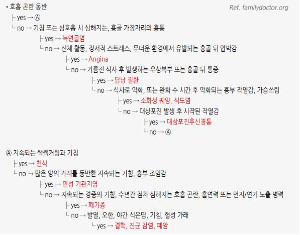

# 흉통 Chest Pain

## <mark style="color:green;">일반 사항</mark>

* 흉통의 정의 : 가슴의 통증 뿐 아니라 가슴, 어깨, 팔, 목, 상복부, 턱의 압박감, 조임, 무거움, 작열감을 포함(2021 AHA/ACC)
  * 특히 고령자, 당뇨병 환자, 여성에서는 통증 대신 호흡곤란, 실신, 메스꺼움, 심한 피로감 등 '협심증 동등 증상(Anginal equivalents)'으로 나타날 수 있
* Red flags, Acute coronary syndrome 등 응급 의뢰 필요 여부를 판단
* 심장 기원 가능성이 낮으면 다른 원인 감별

### <mark style="color:$danger;">🚩 Red Flags!</mark>

<mark style="color:$danger;">**즉각적 생명 위협 징후**</mark>

| Red Flag           | 임상적 의미                  |
| ------------------ | ----------------------- |
| Shock, 정신 상태 변화    | 순환 붕괴의 최종 지표 — 즉각 응급 이송 |
| 호흡 곤란, 빠른 호흡       | ACS·PE·기흉 공통 — 즉각 평가    |
| 잿빛 피부색, 발한, 차가운 피부 | 심박출량 저하 — 심인성 쇼크 시사     |
| 빠른 맥 또는 느린 맥, 저혈압  | 부정맥·쇼크 동반 — 심전도 즉시 시행   |

<mark style="color:$danger;">**ACS / 불안정 협심증 시사**</mark>

| Red Flag               | 임상적 의미               |
| ---------------------- | -------------------- |
| 새로이 발생한 심한 증상          | ACS 고위험              |
| 휴식 시 증상 발생             | 불안정 협심증/NSTEMI 강력 시사 |
| 야간통증; 통증으로 인하여 잠에서 깨어남 | 불안정 협심증 특이 패턴        |
| 걷거나 계단 오를 때 악화         | 노력성 협심증 — 운동부하 고려    |
| 과거에 비해 적은 활동에서 발생      | 진행성 협심증 — 임계값 저하     |
| 새로 발견된 심잡음             | 판막 기능이상·유두근 허혈 시사    |

<mark style="color:$danger;">**대동맥 박리 특이 징후**</mark>

| Red Flag                  | 임상적 의미                      |
| ------------------------- | --------------------------- |
| 양측 상지 혈압 차이 (>20 mmHg)    | 대동맥 박리 특이 소견 — 즉시 CTA       |
| 흉통과 동반된 신경학적 결손           | 박리의 경동맥·척추동맥 침범 시사          |
| 비대칭적 맥박 (사지 간 박동 차이)      | 박리에 의한 분지혈관 폐색 시사           |
| Pulsus paradoxus >10 mmHg | 심낭 압전(cardiac tamponade) 시사 |
| 비대칭적 호흡음                  | 기흉·흉막삼출 동반 시사               |

<mark style="color:$danger;">**기타 중증 원인 시사**</mark>

<table><thead><tr><th width="276.631591796875">Red Flag</th><th>임상적 의미</th></tr></thead><tbody><tr><td>연하 통증 (odynophagia)</td><td>식도 파열(Boerhaave) 시사 — 생명 위협적</td></tr><tr><td>반복되는 구토</td><td>식도 파열 유발 요인, ACS 동반 가능</td></tr><tr><td>위장 출혈</td><td>소화관 출혈·대동맥장누공 가능성</td></tr><tr><td>설명할 수 없는 체중 감소</td><td>악성 종양·만성 중증 질환 시사</td></tr></tbody></table>

## <mark style="color:green;">원인</mark>

### <mark style="color:$primary;">Cardiac (심장성)</mark>

* 심장 허혈 또는 심장 구조에서 직접 기인하는 흉통
* 흉통 전체의 약 15% 차지

#### 허혈성

* ACS(불안정 협심증, NSTEMI, STEMI)
* 안정 협심증
* 관상동맥연축(Prinzmetal 협심증)
* INOCA(Ischemia with Non-Obstructive Coronary Arteries) : 미세혈관 기능장애, 관상동맥 내피기능 이상
* 대동맥판 협착증, 비후성 심근병증에 의한 허혈

#### 비허혈성 심장성

* 급성 대동맥 증후군(대동맥박리, 대동맥류, 벽내혈종)
* 심막염 / 심근염 / 심근심막염
* 심부전(급성 폐부종)
* 판막질환(승모판 탈출증, 대동맥판 역류 등)
* Takotsubo 심근병증

### <mark style="color:$primary;">Possible Cardiac (심장성 가능)</mark>

* 심장 기원 가능성을 완전히 배제할 수 없는 상태. 추가 평가 필요
* 흉통 특성이나 위험 인자가 허혈성이지만 검사에서 확인되지 않은 경우
* 폐색전증(심장에 직접적 영향을 미치는 비허혈성 원인)
* 비특이적 ECG 변화 동반 흉통
* 심장 외 원인이 확인되기 전까지의 미분류 흉통

### <mark style="color:$primary;">Noncardiac (비심장성)</mark>

* 심장 질환이 의심되지 않는 흉통
* 근골격 (\~50%) : 늑연골염, Tietze 증후군, 늑골 골절, 신경근병증, 섬유근통
* 위장관 (\~20%) : 역류성 식도염, 식도연축, 식도천공, 위염, 소화성 궤양, 담석증
* 호흡기 : 기흉, 흉막염, 폐렴, 폐암
* 기타 : 공황장애, 불안장애, 대상포진

## <mark style="color:green;">검사</mark>

* 진찰, vital sign(pulse oximetry 포함), 병력 청취
* 12-lead ECG : 심장 허혈이 의심되는 모든 환자에서 시행; 증상 발생 또는 내원 후 10분 이내 시행 및 판독 권고 (2021 AHA/ACC, Class I)
* 영상 검사 : 흉부 X선, 심초음파, CCTA(관상동맥 CT 혈관조영술), nuclear heart scanning, heart catheterization, treadmill

#### 실험실 검사 (심장 기원 평가)

* 검사 항목 : CBC, 고감도 심장 트로포닌 (hs-cTn), CRP, fibrinogen, homocysteine, lipoprotein, triglyceride, brain natriuretic peptide, prothrombin
* hs-cTn
  * 급성 MI 진단의 현 표준 바이오마커; 기존 CK-MB·myoglobin은 1차 검사로 권고되지 않음
  * 트로포닌은 허혈성 질환 외에 만성 신부전, 심부전, 폐색전증, 패혈증 등에서도 상승하므로 Baseline 대비 동적 변화(Rise and/or Fall, Δ)가 급성 MI 진단의 핵심임
  * 초기값이 검출 한계(LoD) 미만 또는 assay별 rule-out cut-off 이하이면 NSTEMI 배제 가능(rule-out); 중등도 이상 상승이면 rule-in; 경계값이면 1시간 또는 3시간 후 재측정하여 절대 변화량(Δ, absolute change)으로 판단 — 이를 ESC 신속 배제·확진 프로토콜(0/1h 또는 0/3h)이라 함
  * 만성 신부전·심부전 등으로 트로포닌이 기저치부터 상승해 있는 환자에서는 이전 측정값과의 비교(Δ) 및 임상 소견을 병행하여 급성 MI를 판단

#### 영상 검사 선택 전략 (2021 AHA/ACC 권고)

<table><thead><tr><th width="319">임상 상황</th><th width="242.26318359375">권고 검사</th><th width="94.329833984375">권고 등급</th></tr></thead><tbody><tr><td>중등도 위험 급성 흉통, CAD 기왕력(-)</td><td>CCTA(1차) or stress imaging*</td><td>Class I</td></tr><tr><td>중등도-고위험 안정형 흉통, CAD 기왕력 (-)</td><td>CCTA or stress imaging</td><td>Class I</td></tr><tr><td>저위험 안정형 흉통, CAD 기왕력 (-)</td><td>CAC score or 운동부하검사</td><td>Class IIa</td></tr><tr><td>고위험 / ACS 의심</td><td>침습적 관상동맥 조영술</td><td>Class I</td></tr><tr><td>CCTA에서 협착 확인 또는 판정 불가</td><td>FFR-CT (혈류예비분획-CT)</td><td>Class IIa</td></tr></tbody></table>

_\*65세 미만에서 CCTA 선호_

## <mark style="color:green;">심장 기원 흉통</mark>

**Myocardial ischemia**

| 시작 / 기간                                                                                                              | 증상                                                 | 부위                                                                                                           | 동반 특징                                                                                                                                                                        |
| -------------------------------------------------------------------------------------------------------------------- | -------------------------------------------------- | ------------------------------------------------------------------------------------------------------------ | ---------------------------------------------------------------------------------------------------------------------------------------------------------------------------- |
| 
• Stable angina: 운동, 추위, 스트레스에 의해 유발; 2–10분 • Unstable angina: 휴식 시 발생 또는 이전보다 적은 활동에서 유발 • MI: ≥30분 지속
 | pressure, tightness, squeezing, heaviness, burning | 
retrosternal; 종종 방사통 (neck, jaw, shoulder, arm); 때때로 상복부  ※ 여성·고령·당뇨에서 호흡곤란, 오심, 피로 등 비전형 증상 빈번
 | 
통증 중 드물게 S4 gallop or mitral regurgitation murmur; 경색 시 S3 or rale  ※ MINOCA(폐색 없는 MI): 여성·젊은 환자에 더 흔함; 관상동맥 연축·미세혈관 기능장애 포함 (2021 AHA/ACC; 2025 ACS Guideline)
 |

**Pericarditis**

| 시작 / 기간                           | 증상                                | 부위                                                                  | 동반 특징                                                                                                                                                                                                                               |
| --------------------------------- | --------------------------------- | ------------------------------------------------------------------- | ----------------------------------------------------------------------------------------------------------------------------------------------------------------------------------------------------------------------------------- |
| variable: 수 시간–수일; 급성·재발성·만성으로 분류 | pleuritic, sharp; 눕거나 심호흡·기침 시 악화 | retrosternal 또는 cardiac apex 방향; 방사통 (Lt shoulder, trapezius ridge) | 
앉거나 앞으로 기울이면 호전; pericardial friction rub (≤33%)  ※ 진단: 흉통·friction rub·광범위 ST 상승/PR 하강·새 삼출 중 ≥2개 (2025 ESC/ACC) ※ Troponin 상승 시 myopericarditis 의심; CRP 상승은 질환 활성도 지표 ※ 고위험: 발열 >38°C, 대량 삼출, 심낭압전, NSAIDs 무반응
 |

**Acute aortic syndrome**

| 시작 / 기간                          | 증상              | 부위                                   | 동반 특징                                                                                                                                                                                             |
| -------------------------------- | --------------- | ------------------------------------ | ------------------------------------------------------------------------------------------------------------------------------------------------------------------------------------------------- |
| 통증이 갑자기 시작되어 줄어들지 않음; 최대강도 즉시 도달 | 찢어지는, 칼로 찌르는 느낌 | ant chest; 종종 방사통 (back, 양 견갑골 사이)\* | 
HTN, 기저 결합조직 질환; 대동맥부전 의심 잡음; 말초 맥박 소실·비대칭  ※ AAS = 대동맥 박리(AD) + 벽내혈종(IMH) + 침투성 동맥경화 궤양(PAU) (2022 ACC/AHA; 2024 ESC) ※ ADD-RS 활용 권장; 확진은 ECG-gated CT angiography (neck–pelvis)
 |

\*등 아래쪽이나 복부로 통증이 이동(Migrating pain)하는 양상은 대동맥 박리 범위를 시사하는 중요한 단서가 됨

_<mark style="color:$info;">Ref. Harrison's Principles of internal medicine 20th ed. 2020. Table 11-1; 2021 AHA/ACC Chest Pain Guideline, 2022 ACC/AHA Aortic Disease Guideline, 2025 ESC Myocarditis & Pericarditis Guidelines, 2025 ACC/AHA ACS Guideline</mark>_

#### 급성 심근경색 가능성

* 가능성 높음 : 활동과 관련, 어깨 및 팔 방사통, 발한, 구역/구토, 압박감, 과거에 경험했던 심근경색 증상과 유사하거나 더 심함
* 가능성 낮음 : 압박에 의해 재현됨, 예리한 느낌, 위치가 명확, 흉막 통증 느낌, 통증 부위 감염(연조직염, 대상포진 등)
* 여성에서의 비전형적 ACS 증상 : 여성은 전형적인 흉부 압박감 외에 다음 증상이 더 흔하게 나타남; 어지럼증, 실신, 오심, 구토, 턱·등 통증, 호흡곤란, 견갑골 사이 통증, 두근거림, 피로; 이러한 비전형 증상만 있어도 ACS를 배제하지 않도록 주의(2023 ESC)

#### 허혈성 심질환의 전형적인 흉통

* 징후 : ① 특징적인 증상 및 증상 발생 기간 동안 흉골 뒤 통증, ② 운동 또는 정신적 스트레스에 의해 유발, ③ nitroglycerin에 의해 30초\~수 분 내 호전(통증은 20분 이상 지속될 수 있음)
*   판정 : 3가지 모두 해당 시 전형적 허혈성 심질환 흉통, 2가지 해당 시 비전형적 흉통, ≤1가지 해당 시 심장 외 요인에 의한

    흉통

### <mark style="color:$primary;">위험도 평가 툴</mark>

*   외래/일차의료 → MHS, INTERCHEST 같은 도구가 적합

    응급실/일차진료 → HEART Score + hs-troponin 기반 CDP

#### Marburg Heart Score (coronary artery disease predictive value)

<table><thead><tr><th width="359.52630615234375">소견</th><th width="82.803466796875">배점</th></tr></thead><tbody><tr><td>≥55세 남성 또는 ≥65세 여성</td><td>1</td></tr><tr><td>CAD, 뇌혈관 질환 또는 말초혈관 질환 병력</td><td>1</td></tr><tr><td>압박에 의해 통증 재현 안 됨</td><td>1</td></tr><tr><td>운동 시 통증 악화</td><td>1</td></tr><tr><td>환자 스스로 심장에 의한 통증으로 생각함</td><td>1</td></tr></tbody></table>

▶CAD predictive : 0\~1점=0.6% (저위험), 2\~3점=12.1%(중등위험), 4\~5점=62.7%(고위험) ☞ [계산기](https://www.mdcalc.com/calc/4022/marburg-heart-score-mhs)

#### INTERCHEST Rule (coronary artery disease predictive value)

<table><thead><tr><th width="359.52630615234375">소견</th><th width="90.171875">배점</th></tr></thead><tbody><tr><td>흉벽 압박으로 통증 재현</td><td>-1</td></tr><tr><td>≥55세 남성 또는 ≥65세 여성</td><td>+1</td></tr><tr><td>의료진이 처음에 심각한 상태를 의심</td><td>+1</td></tr><tr><td>흉부 압박 느낌의 불편감</td><td>+1</td></tr><tr><td>운동 (effort)과 관련된 흉통</td><td>+1</td></tr><tr><td>CAD, 뇌혈관 질환 또는 말초혈관 질환 병력</td><td>+1</td></tr></tbody></table>

▶CAD predictive : ≤1점=저위험(\~2%), 2점=중등위험, ≥3점=고위험(\~43%) ☞ [계산기](https://www.mdcalc.com/calc/10225/interchest-clinical-prediction-rule-chest-pain-primary-care)

#### HEART Score (ACS 위험도)

* History, ECG, Age, Risk factors, Troponin 5개 항목, 각 0–2점, 총 0–10점
* ACS 단기 예후(6주 내 MACE) 예측 도구; AHA 권고 scoring tool

<table><thead><tr><th width="101.57894897460938">항목</th><th width="48.4210205078125">점수</th><th width="507.0666809082031">기준</th></tr></thead><tbody><tr><td><strong>H</strong>istory</td><td>2</td><td>허혈성 심질환의 전형적 흉통 3가지 모두 해당</td></tr><tr><td></td><td>1</td><td>위 3가지 중 1~2가지만 해당 (비전형적)</td></tr><tr><td></td><td>0</td><td>심장 기원 가능성이 낮은 병력</td></tr><tr><td><strong>E</strong>CG</td><td>2</td><td>유의한 ST 하강, 완전 LBBB, 또는 좌심실 비후 소견</td></tr><tr><td></td><td>1</td><td>비특이적 재분극 장애</td></tr><tr><td></td><td>0</td><td>정상</td></tr><tr><td><strong>A</strong>ge</td><td>2</td><td>≥65세</td></tr><tr><td></td><td>1</td><td>45~64세</td></tr><tr><td></td><td>0</td><td>&#x3C;45세</td></tr><tr><td><strong>R</strong>isk factors</td><td>2</td><td>3개 이상의 심혈관 위험 인자(고혈압, 고지혈증, 당뇨, 흡연, 비만 BMI>30, CAD 가족력) 또는 죽상동맥경화증(CAD, 뇌졸중, 말초혈관질환) 병력</td></tr><tr><td></td><td>1</td><td>1~2개의 위험 인자</td></tr><tr><td></td><td>0</td><td>위험 인자 없음</td></tr><tr><td><strong>T</strong>roponin</td><td>2</td><td>정상 상한치(ULN)의 3배 초과 상승</td></tr><tr><td></td><td>1</td><td>ULN의 1~3배 상승</td></tr><tr><td></td><td>0</td><td>정상 범위 이내</td></tr></tbody></table>

▶판정 : 0\~3점 = 저위험(6주 MACE \~2%, 퇴원 고려), 4\~6점 = 중등위험(입원·추가 검사), 7\~10점 = 고위험(적극적 처치); 저위험이더라도 임상 맥락(증상 지속, 변화 등)을 반드시 종합하여 최종 판단 ☞ [계산기](https://www.mdcalc.com/calc/1752/heart-score-major-cardiac-events)

### <mark style="color:$primary;">Acute Coronary Syndrome (ACS)</mark>

* 급성 심근 허혈로 인한 일련의 임상증후군
* 분류 : unstable angina, ST elevation MI (STEMI), non–ST segment elevation MI (NSTEMI)
* ACS 초기 평가의 핵심 원칙: **A**bnormal ECG(즉각 ECG 시행) → **C**linical context(임상 맥락 및 검사 결과 종합) → **S**table(혈역학적 안정 여부 확인).
* ACS 의심 ECG 소견 : ST elevation, new-onset LBBB, Q wave 존재, new T-wave inversions

## <mark style="color:green;">폐 기원 흉통</mark>

<table><thead><tr><th width="139.42108154296875"></th><th width="106.89471435546875">시작 / 기간</th><th width="138.1578369140625">증상</th><th width="109.73681640625">부위</th><th width="150.22454833984375">동반 특징</th></tr></thead><tbody><tr><td><strong>Pulmonary embolism</strong></td><td>sudden onset</td><td>pleuritic (말초 PE); pressure/angina-like (중심 PE, RV ischemia)</td><td>종종 환측 측부</td><td>호흡 곤란, 빈호흡, 빈맥, 저혈압</td></tr><tr><td><strong>Pulmonary hypertension</strong></td><td>variable; often exertional</td><td>pressure</td><td>substernal</td><td>호흡 곤란, 정맥압 증가 소견</td></tr><tr><td><strong>Pneumonia or Pleuritis</strong></td><td>variable</td><td>pleuritic</td><td>편측, 종종 국소화</td><td>호흡 곤란, 기침, 열, rale, 가끔 rub</td></tr><tr><td><strong>Spontaneous pneumothorax</strong></td><td>sudden onset</td><td>pleuritic</td><td>환측 측부</td><td>호흡 곤란, 이환부 호흡음 감소</td></tr></tbody></table>

_<mark style="color:$info;">Ref. Harrison's Principles of internal medicine 20th ed. 2020. Table 11-1.</mark>_

#### Wells Score (폐색전증 가능성 평가)

<table><thead><tr><th width="359.5263671875">소견</th><th width="90.17181396484375">배점</th></tr></thead><tbody><tr><td>DVT 증상: 통증, red or discolored, warmth</td><td>3</td></tr><tr><td>증상에 대한 다른 적당한 진단이 없음</td><td>3</td></tr><tr><td>빈맥 ＞100/분</td><td>1.5</td></tr><tr><td>≥3일 비활동 또는 최근 4주 내 수술</td><td>1.5</td></tr><tr><td>DVT 또는 폐색전증 진단 과거력</td><td>1.5</td></tr><tr><td>객혈 (+)</td><td>1</td></tr><tr><td>6개월 내 치료 또는 완화 상태의 악성 종양 (+)</td><td>1</td></tr></tbody></table>

▶판정 : 폐색전증 가능성 : ＞6점=가능성 높음, 2\~6점=중등도, ＜2점=낮음 ☞ [계산기](https://www.mdcalc.com/calc/115/wells-criteria-pulmonary-embolism)

#### PERC Rule for Pulmonary Embolism (PE 배제)

Wells Score <2점(저위험)인 환자에서 아래 8가지 항목을 모두 충족하면 D-dimer 검사 없이 PE 배제 가능:

<table><thead><tr><th width="209">항목</th><th width="208.06658935546875">기준</th></tr></thead><tbody><tr><td>나이</td><td>&#x3C;50세</td></tr><tr><td>심박수</td><td>&#x3C;100회/분</td></tr><tr><td>SpO₂</td><td>≥95%</td></tr><tr><td>하지 부종</td><td>편측 하지 부종 없음</td></tr><tr><td>객혈</td><td>없음</td></tr><tr><td>최근 수술/외상</td><td>없음 (4주 이내)</td></tr><tr><td>DVT/PE 기왕력</td><td>없음</td></tr><tr><td>에스트로겐 투여</td><td>없음</td></tr></tbody></table>

▶ 8가지 모두 해당 시 PE 가능성 약 1% 미만 → 추가 검사 불필요 ☞ [계산기](https://www.mdcalc.com/calc/347/perc-rule-pulmonary-embolism)

## <mark style="color:green;">비-심폐 기원 흉통</mark>

### <mark style="color:$primary;">식도 기원 흉통의 특징</mark>

* 음식물 삼킴에 의해 통증 유발
* 자세 변화에 의해 통증 유발
* 운동과 관련 없는 증상
* 방사되지 않는 흉골 뒤 통증
* 자주 발생하는 spontaneous pain
* nocturnal pain
* 심한 통증, 수 시간 동안 지속
* 가슴쓰림, 구강으로의 위산 역류와 관련된 통증
* 제산제에 의해 증상 완화

### <mark style="color:$primary;">근골격 기원 흉통의 특징</mark>

#### 근골격 원인에 의한 증상 특징

* squeezing 또는 oppressive 통증이 아님
* 국소 압통; 압박으로 증상이 재현됨
* 자세 또는 움직임에 의해 영향 받음

#### 질환별 특징

* Costosternal syndrome (Costochondritis) : 보통 upper costochondral/costosternal junction 부위의 늑연골 압통, 여러 부위 압통; 부종 없음
* Tietze's syndrome : sternoclavicular, costosternal, costochondral joint의 비화농성 국소 통증성 부종; 대부분 2번째 및 3번째 늑골 관절에서 발생
* Sternalis syndrome : 흉골 몸체 부위의 국소 압통, 종종 양측으로 방사됨
* Spontaneous sternoclavicular subluxation : 반복되는 힘든 작업과 관련하여 발생. 대부분 dominant side에 발생; 대부분 중년 여성에서 발생
* Lower rib pain syndrome : costal margin에 압통점이 있는 하부 흉부 또는 상복부 통증
* Posterior chest wall syndrome : 흉추 추간판탈출증에 의해 야기; 이환부 압통, 편측 dermatome을 따라 통증, 기침/심호흡에 의해 악화
* Fibromyalgia : 강하지 않은 자극에 대하여 통증을 느낌; 다른 부위 통증 및 통증 외 증상 동반. 예) 피로, 수면 장애, 인지 장애, 우울, 불안
* Rib fracture : 압통, 국소 늑막염성 통증; 보통 외상 병력이 있음 (✽외상 병력 없이도 발생할 수 있음)

<table><thead><tr><th width="149.9473876953125"></th><th>시작 / 기간</th><th width="121.68426513671875">증상</th><th width="122.73687744140625">부위</th><th>동반 특징</th></tr></thead><tbody><tr><td><strong>Esophageal reflux</strong></td><td>10–60분</td><td>burning</td><td>substernal, 상복부</td><td>식후 누웠을 때 악화; 제산제로 호전</td></tr><tr><td><strong>Esophageal spasm</strong></td><td>2–30분</td><td>pressure, tightness, burning</td><td>retrosternal</td><td>angina 유사, dysphagia</td></tr><tr><td><strong>Peptic ulcer</strong></td><td>장시간; 식후 60–90분</td><td>burning</td><td>상복부, substernal</td><td>음식/제산제로 호전</td></tr><tr><td><strong>Gallbladder disease</strong></td><td>장시간</td><td>aching or colicky</td><td>상복부, RUQ, 때때로 back</td><td>식후 발생 가능</td></tr><tr><td><strong>Costochondritis</strong></td><td>variable</td><td>aching</td><td>sternal</td><td>때때로 관절 위 부종/압통/열감; 이환부 압박으로 증상 재현</td></tr><tr><td><strong>Cervical disk disease</strong></td><td>variable; 갑자기</td><td>aching; numbness 포함</td><td>팔, 어깨</td><td>목 움직임으로 악화</td></tr><tr><td><strong>Trauma or strain</strong></td><td>보통 일정함</td><td>aching</td><td>이환부</td><td>움직임/촉지로 증상 재현</td></tr><tr><td><strong>Herpes zoster</strong></td><td>보통 장기간</td><td>sharp or burning</td><td>피부 분절 분포</td><td>통증부 수포성 발적</td></tr><tr><td><strong>Emotional &#x26; psychiatric conditions</strong></td><td>variable; 순식간 또는 장시간</td><td>variable; 종종 공포가 있는 호흡곤란/조임</td><td>variable; substernal</td><td>증상을 유발하는 상황 요인이 있음; 공황/우울 병력</td></tr></tbody></table>

_<mark style="color:$info;">Ref. Harrison's Principles of internal medicine 20th ed. 2020. Table 11-1.</mark>_

### <mark style="color:$primary;">흉통 환자의 평가</mark>

<figure><figcaption>
<strong>Patient-Centric Algorithms for Acute Chest Pain</strong> ECG=electrocardiogram, STEMI=ST-segment–elevation myocardial infarction. <em>Ref. 2021 AHA/ACC Guideline for the Evaluation and Diagnosis of Chest Pain. Fig 7</em>
</figcaption></figure>

***

<figure><figcaption>
<strong>General Approach to Risk Stratification of Patients With Suspected ACS</strong> ACS=acute coronary syndrome, CDP=clinical decision pathway, ECG=electrocardiogram <em>Ref. 2021 AHA/ACC Guideline for the Evaluation and Diagnosis of Chest Pain. Fig 8</em>
</figcaption></figure>

***

<figure><figcaption>
<strong>Clinical Decision Pathway for Patients With Stable Chest Pain and No Known CAD</strong> <em>Test choice should be guided by local availability and expertise.</em> <em>*Test choice guided by patient’s exercise capacity, resting ECG abnormalities; CCTA preferable in those &#x3C;65 years of age and not on optimal preventive therapies; stress testing favored in those ≥65 years of age (with a higher likelihood of ischemia).</em> <em>†High-risk CAD means left main stenosis ≥50%; anatomically significant 3-vessel disease (≥70% stenosis).</em> CAD=coronary artery disease, CCTA=coronary CT angiography, CMR=cardiovascular MRI, FFR-CT=fractional flow reserve with CT, GDMT=guideline-directed medical therapy, INOCA=ischemia and no obstructive CAD, PET=positron emission tomography, SPECT=single-photon emission CT <em>Ref. 2021 AHA/ACC Guideline for the Evaluation and Diagnosis of Chest Pain. Fig 12</em>
</figcaption></figure>

***

<figure><figcaption>
<strong>Clinical Decision Pathway for Patients With Stable Chest Pain (or Equivalent) Symptoms With Prior MI, Prior Revascularization, or Known CAD on Invasive Coronary Angiography or CCTA, Including Those With Nonobstructive CAD</strong> Test choice should be guided by local availability and expertise. *Known CAD means prior MI, revascularization, known obstructive CAD, nonobstructive CAD. †High-risk CAD means left main stenosis ≥50%; or obstructive CAD with FFR-CT ≤0.80. ‡Test choice guided by the patient’s exercise capacity, resting electrocardiographic abnormalities. §Patients with prior CABG or stents >3.0 mm. Follow-up Testing and Intensification of GDMT Guided by Initial Test Results and Persistence / Worsening / Frequency of Symptoms and Shared Decision Making. <em>CABG=coronary artery bypass graft, ICA=invasive coronary angiography, iFR=instant wave-free ratio, MPI=myocardial perfusion imaging, SIHD=stable ischemic heart disease</em> <em>Ref. 2021 AHA/ACC Guideline for the Evaluation and Diagnosis of Chest Pain. Fig 13</em>
</figcaption></figure>

### <mark style="color:$primary;">증상/병력에 따른 감별</mark>

#### 급성 흉통

<figure><figcaption></figcaption></figure>

#### 만성 흉통

<figure><figcaption></figcaption></figure>

***

### <mark style="color:purple;">**질병코드**</mark>

R07.4 상세불명의 흉통
