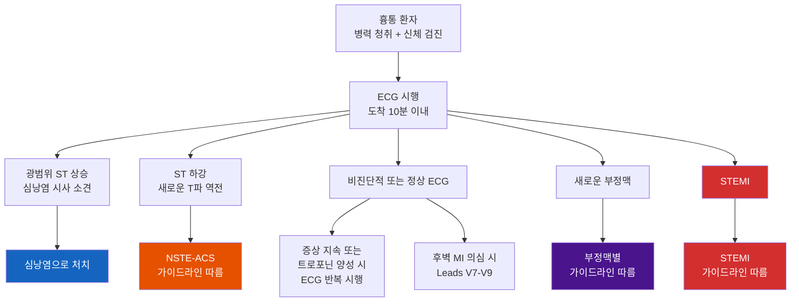
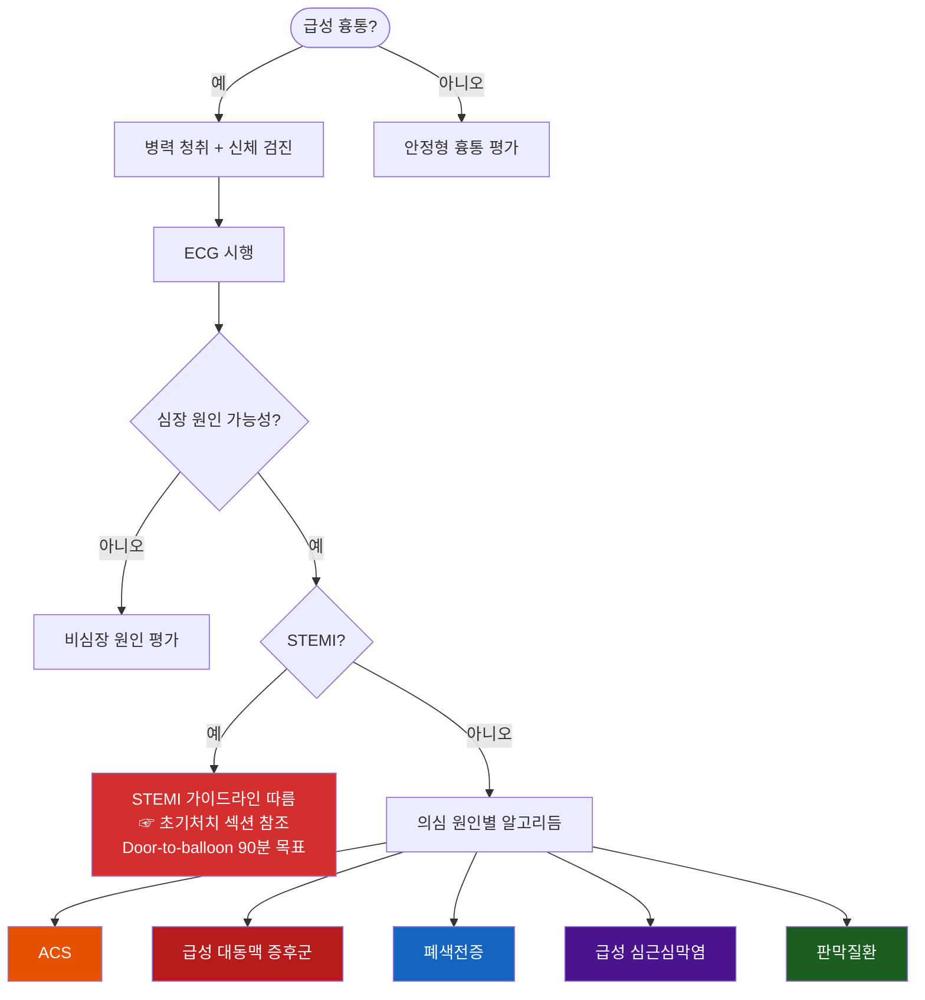

# 흉통 Chest Pain

## <mark style="color:green;">일반 사항</mark>

* 흉통의 정의 : 가슴의 통증 뿐 아니라 가슴, 어깨, 팔, 목, 상복부, 턱의 압박감, 조임, 무거움, 작열감을 포함(2021 AHA/ACC)
  * 특히 고령자, 당뇨병 환자, 여성에서는 통증 대신 호흡곤란, 실신, 메스꺼움, 심한 피로감 등 '협심증 동등 증상(Anginal equivalents)'으로 나타날 수 있음
* Red flags 및 Acute coronary syndrome(ACS) 등 응급 의뢰 필요 여부를 판단
* 심장 기원 가능성이 낮으면 다른 원인 감별

## <mark style="color:green;">원인</mark>

### <mark style="color:orange;">Cardiac (심장성)</mark>

* 심장 허혈 또는 심장 구조에서 직접 기인하는 흉통
* 흉통 전체의 약 15% 차지

**허혈성**

* ACS (불안정 협심증, NSTEMI, STEMI)
* 안정 협심증
* 관상동맥연축 (Prinzmetal 협심증)
* INOCA (Ischemia with Non-Obstructive Coronary Arteries) : 미세혈관 기능장애, 관상동맥 내피기능 이상
* 대동맥판 협착증, 비후성 심근병증에 의한 허혈

**비허혈성 심장성**

* 급성 대동맥 증후군(대동맥박리, 대동맥류, 벽내혈종)
* 심막염 / 심근염 / 심근심막염
* 심부전(급성 폐부종)
* 판막질환(승모판 탈출증, 대동맥판 역류 등)
  * 대동맥판 협착증: 특징적 수축기 잡음, 지연·소맥(tardus et parvus)
  * 대동맥판 역류: 흉골 우측 이완기 잡음, 급속 상승 맥박
  * 비후성 심근병증(HCM): 좌심실 충격 증가, 경정맥 prominent a파, 수축기 잡음
* Takotsubo 심근병증

### <mark style="color:orange;">Possible Cardiac (심장성 가능)</mark>

* 심장 기원 가능성을 완전히 배제할 수 없는 상태. 추가 평가 필요
* 흉통 특성이나 위험 인자가 허혈성이지만 검사에서 확인되지 않은 경우
* 폐색전증(심장에 직접적 영향을 미치는 비허혈성 원인)
* 비특이적 ECG 변화 동반 흉통
* 심장 외 원인이 확인되기 전까지의 미분류 흉통

### <mark style="color:orange;">Noncardiac (비심장성)</mark>

* 심장 질환이 의심되지 않는 흉통
* 근골격 (\~50%) : 늑연골염, Tietze 증후군, 늑골 골절, 신경근병증, 섬유근통
* 위장관 (\~20%) : 역류성 식도염, 식도연축, 식도천공, 위염, 소화성 궤양, 담석증
* 호흡기 : 기흉, 흉막염, 폐렴, 폐암
  * 자연기흉 (Spontaneous pneumothorax): 키가 크고 마른 젊은 남성(10\~30대)에서 빈발; 별다른 외상 없이 갑자기 발생하는 편측 흉통 + 호흡곤란이 특징
* 기타 : 공황장애, 불안장애, 대상포진
  * 대상포진 (Herpes Zoster): 발진 출현 전(pre-eruptive) 수일\~1주간은 피부 분절 (dermatome)을 따르는 편측성 흉통만 나타나 ACS로 오인하기 쉬움; 통증 분포가 dermatome 패턴이면 감별이 필요; 이환 부위의 피부 과민감각(allodynia, 가벼운 접촉에도 심한 통증)이 특징적이며, 발진 전 단계에서도 allodynia 확인이 조기 감별에 유용함

### <mark style="color:$danger;">🚩 Red Flags!</mark>

<mark style="color:$danger;">**즉각 응급 조치 및 이송**</mark>

* 쇼크(저혈압·빈맥) 또는 정신 상태 변화 (순환 붕괴 시사) `ACS` `PE` `대동맥 박리`
* 심한 호흡 곤란, 빠른 호흡 `ACS` `PE` `기흉`
* 잿빛 피부색, 발한, 차가운 피부 (심인성 쇼크 시사) `ACS`
* 찢어지는(tearing)·칼로 베는 듯한(sharp/stabbing) 흉통이 갑자기 최대 강도로 시작되며 등·복부로 이동(migration)하는 경우 `대동맥 박리`
* 찢어지는 흉통 + 양측 상지 혈압 차이 ≥20 ㎜Hg (≥15 ㎜Hg도 의심 신호로 주의 깊게 관찰) 또는 비대칭적 맥박 `대동맥 박리`
* 흉통 + 신경학적 결손 (경동맥·척추동맥 침범 시사) `대동맥 박리`
* 연하 통증(odynophagia) 또는 반복되는 구토 `식도 파열`
* 편측 호흡음 소실 + 저혈압·빈맥 + 기관 변위 (즉각 바늘 감압 필요) `긴장성 기흉`

<mark style="color:$warning;">**수 시간 내 긴급 평가 (응급실 방문)**</mark>

* 휴식 시 흉통 발생 `불안정 협심증` `NSTEMI`
* 야간 흉통; 통증으로 잠에서 깨어남 `불안정 협심증`
* 새로 발생한 심한 흉통 `ACS`
* 과거에 비해 적은 활동에서 흉통 발생 (진행성 협심증) `ACS`
* Pulsus paradoxus ＞10 ㎜Hg (≥12\~15 ㎜Hg에서 임상적 의미 증가) `심낭 압전`
* 위장 출혈 동반 (특히 복부대동맥류/대동맥 수술 병력 시) `대동맥장누공`
* 최근 1\~2주 이내 동일 증상으로 재내원 (진단되지 않은 ACS/AAS의 위험 신호)

<mark style="color:$info;">**당일 \~ 수일 내 조기 평가 (외래 진료)**</mark>

* 걷거나 계단 오를 때 흉통 악화 (운동부하검사 고려) `안정형 협심증`
* 새로 발견된 심잡음 `판막 기능이상` `유두근 허혈`
* 설명할 수 없는 체중 감소 `악성 종양` `만성 중증 질환`

## <mark style="color:green;">흉통 성상에 따른 허혈 가능성</mark>

> 흉통 기술어는 허혈 가능성의 연속선상에 위치한다. "비전형적(atypical)"이라는 표현은 오해를 유발하므로 사용하지 않으며, 심장성·심장성 가능·비심장성으로 분류할 것을 2021 AHA/ACC 가이드라인은 권고한다.

#### <mark style="color:$primary;">임상 적용 포인트</mark>

* 압박·조임·무거움·쥐어짜는 느낌 → 허혈 가능성 높음; 즉각 ECG 및 트로포닌 평가
* 찌르는·예리한·흡기 관련·자세 의존성 → 허혈 가능성 낮음 (심낭염, 근골격, 흉막 원인 고려)
* 단독 소견만으로 ACS를 배제할 수 없음 : burning은 허혈에서도 나타날 수 있으며, right-sided pain도 특히 여성·고령자에서 ACS의 표현일 수 있음
* 여성·고령자·당뇨 환자는 전형적 흉통 없이도 ACS일 수 있음; 호흡곤란·오심·피로만 있어도 배제 금지
* 니트로글리세린으로 호전된다는 사실만으로 허혈을 진단하지 말 것 (식도 연축도 반응함)

<table data-header-hidden><thead><tr><th width="84"></th><th></th></tr></thead><tbody><tr><td><strong>허혈가능성</strong></td><td>Central, Pressure, Squeezing, Gripping, Heaviness, Tightness, 운동/스트레스 관련, Retrosternal</td></tr><tr><td><strong>높음</strong></td><td>Left-sided, Dull, Aching</td></tr><tr><td>↓</td><td>Stabbing</td></tr><tr><td><strong>낮음</strong></td><td>Right-sided, Tearing, Ripping, Burning</td></tr><tr><td></td><td>Sharp, Fleeting, Shifting, Pleuritic*, Positional</td></tr></tbody></table>

 _<mark style="color:$info;">\*Pleuritic: related to inspiration / †Right-sided pain 및 burning은 단독으로 ACS를 배제하는 근거가 되지 않음; 전체 임상 맥락과 함께 판단</mark>_

_<mark style="color:$info;">Ref. 2021 AHA/ACC Guideline for the Evaluation and Diagnosis of Chest Pain. Fig 2</mark>_

## <mark style="color:green;">검사</mark>

* 진찰, vital sign (pulse oximetry 포함), 병력 청취
* 12-Lead ECG : 심장 허혈이 의심되는 모든 환자에서 시행
* 'Door-to-ECG 10분' : 내원 후 10분 이내 시행 및 판독하는 것이 긴요 (2021 AHA/ACC, Class I)

#### <mark style="color:$primary;">ECG 소견에 따른 처치 알고리즘</mark>

* 급성 흉통 환자에서 ECG는 처치 방향을 결정하는 핵심 도구임
* 정상 ECG라도 ACS를 배제할 수 없으므로 반드시 트로포닌 등 추가 평가를 병행해야 함
* STEMI 확인 시 즉각 재관류 치료. Door-to-balloon 90분 이내가 목표
* 정상 ECG ≠ ACS 배제
  * 정상 ECG에서도 ACS 환자의 최대 6%가 응급실에서 퇴원할 수 있음
  * 좌회선동맥·우관상동맥 폐색은 표준 12유도에서 '전기적 침묵' 가능 → 후벽 MI 의심 시 V7-V9 추가
  * 좌심실 비대, 각차단, 심실 페이싱은 허혈 소견을 가릴 수 있음

_<mark style="color:$info;">Ref. 2021 AHA/ACC Guideline for the Evaluation and Diagnosis of Chest Pain. Fig 4</mark>_

#### <mark style="color:$primary;">실험실 검사 (심장 기원 평가)</mark>

* 검사 항목 : CBC, 고감도 심장 트로포닌 (hs-cTn), CRP, fibrinogen, homocysteine, lipoprotein, triglyceride, brain natriuretic peptide, prothrombin

**hs-cTn**

* 급성 MI 진단의 현 표준 바이오마커; 기존 CK-MB·myoglobin은 1차 검사로 권고되지 않음
* 트로포닌은 허혈성 질환 외에 만성 신부전, 심부전, 폐색전증, 패혈증, 심방세동, 격렬한 운동 후 등에서도 상승할 수 있으므로 baseline 대비 동적 변화(Rise and/or Fall, Δ)가 급성 MI 진단의 핵심임; 단독 수치만으로 과잉 진단하지 않도록 주의
* 초기값이 검출 한계(LoD) 미만 또는 assay별 rule-out cut-off 이하이면 NSTEMI 배제 가능(rule-out); 중등도 이상 상승이면 rule-in; 경계값이면 1시간 또는 3시간 후 재측정하여 절대 변화량(Δ, absolute change)으로 판단 — 이를 신속 배제·확진 프로토콜(CDP)이라 함
  * **ESC 0/1h 알고리즘**: 가장 빠르고 광범위하게 검증됨 (validated). 0시간·1시간 hs-cTn 측정으로 rule-out/rule-in 결정
  * **AHA/ACC 0/2h 알고리즘**: 현실적 대안; 0시간·2시간 측정 후 임상 위험도(HEART score 등)와 병합하여 판단
* Early presenter 주의 : 증상 발현 후 2–3시간 미만인 경우 단일 측정으로 rule-out 시 false negative 가능; 0/1h 또는 0/3h 프로토콜에서도 증상 시작 <2–3시간이면 반복 측정 필수
* Assay별 cut-off 수치가 상이하므로 검사 기관의 assay 종류(예: hs-cTnI, hs-cTnT)와 해당 제조사의 rule-out/rule-in 기준값을 반드시 확인하여 적용할 것
* 만성 신부전·심부전 등으로 트로포닌이 기저치부터 상승해 있는 환자에서는 이전 측정값과의 비교(Δ) 및 임상 소견을 병행하여 급성 MI를 판단

#### <mark style="color:$primary;">영상 검사 선택 전략</mark>

<table><thead><tr><th width="323.21051025390625">임상 상황</th><th width="242.26318359375">권고 검사</th><th width="70.11932373046875">권고 등급</th></tr></thead><tbody><tr><td>중등도 위험 급성 흉통, CAD 기왕력(-)</td><td>CCTA(1차) or stress imaging*</td><td>I</td></tr><tr><td>중등도~고위험 안정형 흉통, CAD 기왕력 (-)</td><td>CCTA or stress imaging</td><td>I</td></tr><tr><td>저위험 안정형 흉통, CAD 기왕력 (-)</td><td>CAC score or 운동부하검사</td><td>IIa</td></tr><tr><td>고위험 / ACS 의심</td><td>침습적 관상동맥 조영술</td><td>I</td></tr><tr><td>CCTA에서 협착 확인 또는 판정 불가</td><td>FFR-CT (혈류예비분획-CT)</td><td>IIa</td></tr></tbody></table>

_\*65세 미만에서 CCTA 선호 ._ 2021 AHA/ACC 권고


**CCTA 활용 추세**: 저\~중등위험 급성 흉통(acute chest pain)에서 ED fast-track 프로토콜로 CCTA를 활용하는 빈도가 증가하고 있음. 빠른 rule-out과 조기 퇴원을 가능하게 하는 전략으로 국내외 응급의학 현장에서 채택 중.


**이전 심장 검사의 유효 기간**

* 증상이 변하지 않은 환자에서 최근 정상 검사 결과가 있다면 불필요한 재검사를 피할 수 있음. 단, 증상의 빈도·양상·안정성이 변화했다면 유효 기간 내라도 재평가가 필요
* 정상 관상동맥 조영술 (협착 또는 플라크 없음) 시 2년
* CCTA에서 협착이 없는 경우 2년 (CCTA 정상 소견은 부하 검사 정상보다 사건 발생률이 낮음)
* 부하 검사 정상 부하 검사 (충분한 운동 또는 약물부하 조건 충족, 영상 품질 양호) 시 1년
* 이전 검사가 비-진단적이었거나 경도 이상 소견이 있었던 경우에는 새로운 증상 발생 시 재평가

## <mark style="color:green;">흉통 성상 및  원인</mark>

* 병력 청취 시 아래 6가지 항목을 체계적으로 확인

<table><thead><tr><th width="192">항목</th><th>허혈성 심질환을 시사하는 소견</th><th>허혈성 심질환 가능성이 낮은 소견</th></tr></thead><tbody><tr><td><strong>성상 (Nature)</strong></td><td>흉골하 불편감 (압박·무거움·조임·쥐어짜는 느낌·압박감·수축감)</td><td>흡기 시 악화되고 반듯이 누웠을 때 심해지는 예리한 통증 → 허혈성 질환보다 급성 심낭염 가능성 시사</td></tr><tr><td><strong>시작·기간 (Onset &#x26; Duration)</strong></td><td>수 분에 걸쳐 점차 강도가 증가</td><td>수 초 단위의 순간적 통증 → 허혈성 질환 가능성 낮음</td></tr><tr><td></td><td></td><td>갑자기 최대 강도로 시작되는 찢어지는 흉통 (등·복부로 방사) → 급성 대동맥 증후군 강력 시사</td></tr><tr><td><strong>위치·방사 (Location &#x26; Radiation)</strong></td><td>흉골하; 특징적 방사통 (좌측 팔·목·턱·상복부)</td><td>매우 국소적으로 한 점에 한정된 통증, 배꼽 아래로 방사되는 통증 → 심근 허혈 가능성 낮음</td></tr><tr><td><strong>중증도 (Severity)</strong></td><td>—</td><td>"생애 최악의 통증"이라고 표현되는 찢어지는 흉통, 특히 고혈압 환자·이첨판 대동맥판·대동맥 확장 병력자 → 급성 대동맥 증후군 시사</td></tr><tr><td><strong>유발·악화 인자 (Precipitating factors)</strong></td><td>운동 또는 정신적 스트레스로 유발</td><td>자세 변화에 의한 흉통 → 대개 비허혈성 (근골격계)</td></tr><tr><td></td><td>휴식 시 또는 최소 활동에서 발생하는 협심증 증상 → ACS 시사</td><td></td></tr><tr><td><strong>완화 인자 (Relieving factors)</strong></td><td>니트로글리세린 반응: 진단 기준으로 사용 불가 (식도 연축도 반응함)</td><td>—</td></tr><tr><td><strong>동반 증상 (Associated symptoms)</strong></td><td>호흡곤란·두근거림·발한·어지럼증·실신 전조·상복부 통증·식사와 무관한 속쓰림·오심·구토</td><td>—</td></tr><tr><td></td><td>당뇨·여성·고령 환자에서는 좌측 흉통·우측 흉통·찌르는 통증·인후부/복부 불편감이 나타날 수 있음</td><td></td></tr></tbody></table>


**병력청취 핵심 원칙 (2021 AHA/ACC)** 흉통의 특성은 반드시 환자로부터 직접 청취해야 한다. 허혈 여부 판단에 병력이 가장 중요한 근거이지만, 심장 증상의 발현은 복합적이고 다양하므로 병력만으로 허혈을 배제할 수 없다. 겉보기에 비심장성으로 보이는 흉통도 허혈 기원일 수 있다.


_<mark style="color:$info;">Ref. 2021 AHA/ACC Guideline for the Evaluation and Diagnosis of Chest Pain. Table 3</mark>_

## <mark style="color:green;">심장 기원 흉통</mark>

#### <mark style="color:$primary;">Myocardial ischemia</mark>

<table><thead><tr><th width="109.52630615234375">항목</th><th>내용</th></tr></thead><tbody><tr><td><strong>시작 / 기간</strong></td><td>• Stable angina: 운동, 추위, 스트레스에 의해 유발; 2~10분 • Unstable angina: 휴식 시 발생 또는 이전보다 적은 활동에서 유발 • MI: ≥30분 지속</td></tr><tr><td><strong>증상</strong></td><td>pressure, tightness, squeezing, heaviness, burning</td></tr><tr><td><strong>부위</strong></td><td>retrosternal; 종종 방사통 (neck, jaw, shoulder, arm); 때때로 상복부 ※ 여성·고령·당뇨에서 호흡곤란, 오심, 피로 등 비전형 증상 빈번</td></tr><tr><td><strong>동반 특징</strong></td><td>통증 중 드물게 S4 gallop or mitral regurgitation murmur; 경색 시 S3 or rale ※ MINOCA(폐색 없는 MI): 여성·젊은 환자에 더 흔함; 관상동맥 연축·미세혈관기능장애 포함 (2021 AHA/ACC Chest Pain Guideline) ※ 젊은 연령 + 심혈관 위험인자 없는 ACS: 코카인·암페타민 등 교감신경자극제에 의한 관상동맥 연축 감별 요 ※ **Young patient trap**: 젊고 위험인자가 없어도 ACS 가능 — ① SCAD(자연 관상동맥 박리; 특히 젊은 여성, 임신/산후 시기에 호발) ② 심근염(myocarditis; 최근 바이러스 감염 후 흉통 + 트로포닌 상승 시 고려) ③ 코카인·암페타민 유발 연축 — 이들 세 상황에서 "젊으니까 괜찮다"는 판단은 위험한 인지 오류</td></tr></tbody></table>

#### <mark style="color:$primary;">Pericarditis</mark>

<table><thead><tr><th width="106.05267333984375">항목</th><th>내용</th></tr></thead><tbody><tr><td><strong>시작 / 기간</strong></td><td>variable: 수 시간–수일; 급성·재발성·만성으로 분류</td></tr><tr><td><strong>증상</strong></td><td>pleuritic, sharp; 눕거나 심호흡·기침 시 악화</td></tr><tr><td><strong>부위</strong></td><td>retrosternal 또는 cardiac apex 방향; 방사통 (Lt shoulder, trapezius ridge)</td></tr><tr><td><strong>동반 특징</strong></td><td>앉거나 앞으로 기울이면 호전; pericardial friction rub (≤33%) ※ 진단: 흉통·friction rub·광범위 ST 상승/PR 하강·새 삼출 중 ≥2개 (2015 ESC guideline; Adler et al.) ※ Troponin 상승 시 myopericarditis 의심; CRP 상승은 질환 활성도 지표 ※ 고위험: 발열 >38°C, 대량 삼출, 심낭압전, NSAIDs 무반응</td></tr></tbody></table>

#### <mark style="color:$primary;">Acute aortic syndrome</mark>

<table><thead><tr><th width="120.0526123046875">항목</th><th>내용</th></tr></thead><tbody><tr><td><strong>시작 / 기간</strong></td><td>통증이 갑자기 시작되어 줄어들지 않음; 최대 강도 즉시 도달</td></tr><tr><td><strong>증상</strong></td><td>찢어지는, 칼로 찌르는 느낌</td></tr><tr><td><strong>부위</strong></td><td>ant chest; 종종 방사통 (back, 양 견골 사이)</td></tr><tr><td><strong>동반 특징</strong></td><td>HTN, 기저 결합조직 질환; 대동맥박동 의심 잡음; 말초 맥박 소실·비대칭 ※ 사지 맥박 비대칭: 환자의 약 30% (Type A > B); 심한 통증 + 급성 발생 + 맥박 차이 + 흉부 X선 종격동 확장 → 박리 가능성 >80% ※ 실신 빈도 >10%; 대동맥판 역류 40~75% (Type A) ※ AAS = 대동맥 박리(AD) + 벽내혈종(IMH) + 침투성 동맥경화 궤양(PAU) (2022 ACC/AHA; 2024 ESC) ※ 진단 전략 : ADD-RS 0~1점 + D-dimer 음성 → rule-out 보조 가능 (단, ADD-RS ≥2이면 D-dimer 없이 즉시 CT); 확진은 ECG-gated CT angiography (neck–pelvis)</td></tr></tbody></table>

\*등 아래쪽이나 복부로 통증이 이동(Migrating pain)하는 양상은 대동맥 박리 범위를 시사하는 중요한 단서가 됨

_<mark style="color:$info;">Ref. Harrison's Principles of internal medicine 20th ed. 2020. Table 11-1; 2021 AHA/ACC Chest Pain Guideline, 2022 ACC/AHA Aortic Disease Guideline, 2025 ESC Myocarditis & Pericarditis Guidelines</mark>_

### <mark style="color:orange;">Acute Coronary Syndrome (ACS)</mark>

* 급성 심근 허혈로 인한 일련의 임상증후군
* 분류 : unstable angina, ST elevation MI (STEMI), non–ST segment elevation MI (NSTEMI)
* ACS 초기 평가의 핵심 원칙: **A**bnormal ECG(즉각 ECG 시행) → **C**linical context(임상 맥락 및 검사 결과 종합) → **S**table(혈역학적 안정 여부 확인)
* ACS 의심 ECG 소견 : ST elevation, Q wave 존재, new T-wave inversions
  * new LBBB 단독은 더 이상 STEMI equivalent로 보지 않음; LBBB 동반 시 Sgarbossa 기준(또는 modified Smith-Sgarbossa 기준) 적용 권장

#### <mark style="color:$primary;">급성 심근경색 가능성</mark>

* 가능성 높음 : 활동과 관련, 어깨 및 팔 방사통, 발한, 구역/구토, 압박감, 과거에 경험했던 심근경색 증상과 유사하거나 더 심함
* 가능성 낮음 : 압박에 의해 재현됨, 예리한 느낌, 위치가 명확, 흉막 통증 느낌, 통증 부위 감염(연조직염, 대상포진 등)
* 여성에서의 ACS 증상 : 여성은 전형적인 흉부 압박감 외에 다음 증상이 더 흔하게 나타남; 어지럼증, 실신, 오심, 구토, 턱·등 통증, 호흡곤란, 견갑골 사이 통증, 두근거림, 피로; 이러한 증상만 있어도 ACS를 배제하지 않도록 주의 (2023 ESC)

#### <mark style="color:$primary;">허혈성 심질환의 전형적인 흉통</mark>

* 징후
  1. 특징적인 증상 및 증상 발생 기간 동안 흉골 뒤 통증
  2. 운동 또는 정신적 스트레스에 의해 유발
  3. nitroglycerin에 의해 30초\~수 분 내 호전(통증은 20분 이상 지속될 수 있음)
* 판정 : 3가지 모두 해당 시 전형적(typical) 허혈성 심질환 흉통, 2가지 해당 시 possibly cardiac (비전형적; ※ 현 권장 용어: 'possibly cardiac'), ≤1가지 해당 시 심장 외 요인에 의한 흉통

### <mark style="color:orange;">위험도 평가 툴</mark>


**위험도 평가 도구 — 임상 상황별 선택 가이드**


| 상황                    | 권장 도구                       |
| --------------------- | --------------------------- |
| 1차 진료 (외래, 급성·비급성 모두) | MHS, INTERCHEST             |
| 응급실 / 1차 진료 급성 흉통     | HEART Score + hs-cTn 기반 CDP |


* MHS/INTERCHEST: CAD 사전 확률 추정에 특화; 검사 전 단계에서 활용
* HEART: 6주 내 MACE 예측; hs-cTn과 병합 시 disposition 결정에 유용


#### <mark style="color:$primary;">Marburg Heart Score (CAD 예측)</mark>

<table><thead><tr><th width="359.52630615234375">소견</th><th width="82.803466796875">배점</th></tr></thead><tbody><tr><td>≥55세 남성 또는 ≥65세 여성</td><td>1</td></tr><tr><td>CAD, 뇌혈관 질환 또는 말초혈관 질환 병력</td><td>1</td></tr><tr><td>압박에 의해 통증 재현 안 됨</td><td>1</td></tr><tr><td>운동 시 통증 악화</td><td>1</td></tr><tr><td>환자 스스로 심장에 의한 통증으로 생각함</td><td>1</td></tr></tbody></table>

▶CAD 예측 : 0\~1점=0.6% (저위험), 2\~3점=12.1%(중등위험), 4\~5점=62.7%(고위험) ☞ [계산기](https://www.mdcalc.com/calc/4022/marburg-heart-score-mhs)

#### <mark style="color:$primary;">INTERCHEST Rule (CAD 예측)</mark>

<table><thead><tr><th width="359.52630615234375">소견</th><th width="90.171875">배점</th></tr></thead><tbody><tr><td>흉벽 압박으로 통증 재현</td><td>-1</td></tr><tr><td>≥55세 남성 또는 ≥65세 여성</td><td>+1</td></tr><tr><td>의료진이 처음에 심각한 상태를 의심</td><td>+1</td></tr><tr><td>흉부 압박 느낌의 불편감</td><td>+1</td></tr><tr><td>운동 (effort)과 관련된 흉통</td><td>+1</td></tr><tr><td>CAD, 뇌혈관 질환 또는 말초혈관 질환 병력</td><td>+1</td></tr></tbody></table>

▶CAD 예측 : ≤1점=저위험(\~2%), 2점=중등위험, ≥3점=고위험(\~43%) ☞ [계산기](https://www.mdcalc.com/calc/10225/interchest-clinical-prediction-rule-chest-pain-primary-care)

#### <mark style="color:$primary;">HEART Score (ACS 위험도)</mark>

* History, ECG, Age, Risk factors, Troponin 5개 항목, 각 0–2점, 총 0–10점
* ACS 단기 예후(6주 내 MACE) 예측 도구; AHA 권고 scoring tool

<table><thead><tr><th width="101.57894897460938">항목</th><th width="48.4210205078125">점수</th><th width="507.0666809082031">기준</th></tr></thead><tbody><tr><td><strong>H</strong>istory</td><td>2</td><td>허혈성 심질환의 전형적 흉통 3가지 모두 해당</td></tr><tr><td></td><td>1</td><td>위 3가지 중 1~2가지만 해당 (비전형적)*</td></tr><tr><td></td><td>0</td><td>심장 기원 가능성이 낮은 병력</td></tr><tr><td><strong>E</strong>CG</td><td>2</td><td>LBBB·LVH·digoxin에 의하지 않은 유의한 ST 편위(하강 또는 상승)</td></tr><tr><td></td><td>1</td><td>ST 편위 없는 LBBB, LVH, digoxin 효과, 또는 기존의 재분극 이상</td></tr><tr><td></td><td>0</td><td>정상</td></tr><tr><td><strong>A</strong>ge</td><td>2</td><td>≥65세</td></tr><tr><td></td><td>1</td><td>45~64세</td></tr><tr><td></td><td>0</td><td>&#x3C;45세</td></tr><tr><td><strong>R</strong>isk factors</td><td>2</td><td>3개 이상의 심혈관 위험 인자(고혈압, 고지혈증, 당뇨, 흡연, 비만 BMI>30, CAD 가족력) 또는 죽상동맥경화증(CAD, 뇌졸중, 말초혈관질환) 병력</td></tr><tr><td></td><td>1</td><td>1~2개의 위험 인자</td></tr><tr><td></td><td>0</td><td>위험 인자 없음</td></tr><tr><td><strong>T</strong>roponin</td><td>2</td><td>정상 상한치(ULN)의 3배 초과 상승</td></tr><tr><td></td><td>1</td><td>ULN의 1~3배 상승</td></tr><tr><td></td><td>0</td><td>정상 범위 이내</td></tr></tbody></table>

▶판정 : 0\~3점 = 저위험(6주 내 MACE \~2%, 퇴원 고려) → 외래 추적, 4\~6점 = 중등위험(입원·추가 검사) → 관찰 입원, 7\~10점 = 고위험(적극적 처치) → 침습적 평가 고려; 저위험이더라도 임상 맥락(증상 지속, 변화 등)을 반드시 종합하여 최종 판단 ☞ [계산기](https://www.mdcalc.com/calc/1752/heart-score-major-cardiac-events)

_<mark style="color:$info;">\*HEART score 원문의 "비전형적(atypical)" 표현은 scoring 도구 자체의 용어임. 2021 AHA/ACC는 임상 기술 시 "atypical" 대신 "possibly cardiac" 사용을 권고함.</mark>_

## <mark style="color:green;">폐 기원 흉통</mark>

<table><thead><tr><th width="139.42108154296875"></th><th width="106.89471435546875">시작 / 기간</th><th width="138.1578369140625">증상</th><th width="109.73681640625">부위</th><th width="150.22454833984375">동반 특징</th></tr></thead><tbody><tr><td><strong>Pulmonary embolism</strong></td><td>sudden onset</td><td>pleuritic (말초 PE); pressure/angina-like (중심 PE, RV ischemia)</td><td>종종 환측 측부</td><td>호흡 곤란, 빈호흡, 빈맥, 저혈압</td></tr><tr><td><strong>Pulmonary hypertension</strong></td><td>variable; often exertional</td><td>pressure</td><td>substernal</td><td>호흡 곤란, 정맥압 증가 소견</td></tr><tr><td><strong>Pneumonia or Pleuritis</strong></td><td>variable</td><td>pleuritic</td><td>편측, 종종 국소화</td><td>호흡 곤란, 기침, 열, rale, 가끔 rub</td></tr><tr><td><strong>Spontaneous pneumothorax</strong></td><td>sudden onset</td><td>pleuritic</td><td>환측 측부</td><td>호흡 곤란, 이환부 호흡음 감소</td></tr></tbody></table>

_<mark style="color:$info;">Ref. Harrison's Principles of internal medicine 20th ed. 2020. Table 11-1.</mark>_

#### <mark style="color:$primary;">Wells Score (폐색전증 가능성 평가)</mark>

<table><thead><tr><th width="359.5263671875">소견</th><th width="90.17181396484375">배점</th></tr></thead><tbody><tr><td>DVT 증상: 통증, red or discolored, warmth</td><td>3</td></tr><tr><td>증상에 대한 다른 적당한 진단이 없음</td><td>3</td></tr><tr><td>빈맥 ＞100/분</td><td>1.5</td></tr><tr><td>≥3일 비활동 또는 최근 4주 내 수술</td><td>1.5</td></tr><tr><td>DVT 또는 폐색전증 진단 과거력</td><td>1.5</td></tr><tr><td>객혈 (+)</td><td>1</td></tr><tr><td>6개월 내 치료 또는 완화 상태의 악성 종양 (+)</td><td>1</td></tr></tbody></table>

▶판정 : 폐색전증 가능성 : ＞6점=가능성 높음, 2\~6점=중등도, ＜2점=낮음 ☞ [계산기](https://www.mdcalc.com/calc/115/wells-criteria-pulmonary-embolism)


**PESI / sPESI — PE 중증도 및 예후 분류**

Wells score가 **진단 가능성** 평가 도구라면, PESI(Pulmonary Embolism Severity Index) / sPESI(simplified PESI)는 PE 확진 후 **중증도 분류 및 입원·외래 처치 결정**에 사용하는 도구임.

* **sPESI 0점**: 30일 사망률 약 1% → 외래 치료 또는 조기 퇴원 고려 가능
* **sPESI ≥1점**: 고위험 → 입원 치료
* sPESI 항목(각 1점): 나이 >80세, 암 병력, 만성 심폐질환, 맥박 ≥110, 수축기 혈압 <100 ㎜Hg, SpO₂ <90%

☞ [sPESI 계산기](https://www.mdcalc.com/calc/1247/simplified-pesi-pulmonary-embolism-severity-index)


#### <mark style="color:$primary;">PERC Rule for Pulmonary Embolism (PE 배제)</mark>

* Wells Score <2점(저위험)인 환자에서 아래 8가지 항목을 모두 충족하면 D-dimer 검사 없이 PE 배제 가능

<table><thead><tr><th width="209">항목</th><th width="208.06658935546875">기준</th></tr></thead><tbody><tr><td>나이</td><td>&#x3C;50세</td></tr><tr><td>심박수</td><td>&#x3C;100회/분</td></tr><tr><td>SpO₂</td><td>≥95%</td></tr><tr><td>하지 부종</td><td>편측 하지 부종 없음</td></tr><tr><td>객혈</td><td>없음</td></tr><tr><td>최근 수술/외상</td><td>없음 (4주 이내)</td></tr><tr><td>DVT/PE 기왕력</td><td>없음</td></tr><tr><td>에스트로겐 투여</td><td>없음</td></tr></tbody></table>

▶ 8가지 모두 해당 시 PE 가능성 약 1% 미만 → 추가 검사 불필요 ☞ [계산기](https://www.mdcalc.com/calc/347/perc-rule-pulmonary-embolism)

## <mark style="color:green;">비-심폐 기원 흉통</mark>

### <mark style="color:orange;">식도 기원 흉통의 특징</mark>

* 음식물 삼킴에 의해 통증 유발
* 자세 변화에 의해 통증 유발
* 운동과 관련 없는 증상
* 방사되지 않는 흉골 뒤 통증
* 자주 발생하는 spontaneous pain
* nocturnal pain
* 심한 통증, 수 시간 동안 지속
* 가슴쓰림, 구강으로의 위산 역류와 관련된 통증
* 제산제에 의해 증상 완화

#### <mark style="color:$primary;">GERD vs 심장성 흉통 vs 근골격 감별</mark>

<table><thead><tr><th width="120">구분</th><th width="200">ACS (심근허혈)</th><th width="190">GERD</th><th>근골격</th></tr></thead><tbody><tr><td><strong>통증 성상</strong></td><td>압박감, 조임, 무거움</td><td>작열감(burning), 쓰림</td><td>쑤심, 찌름, 국소 통증</td></tr><tr><td><strong>위치</strong></td><td>흉골 뒤 (retrosternal)</td><td>흉골 뒤/상복부</td><td>국소 (손가락으로 짚음)</td></tr><tr><td><strong>방사</strong></td><td>팔, 턱, 등</td><td>드묾</td><td>없음</td></tr><tr><td><strong>유발</strong></td><td>운동, 스트레스</td><td>식후, 눕기</td><td>움직임, 자세</td></tr><tr><td><strong>완화</strong></td><td>휴식, NTG</td><td>제산제, 직립</td><td>휴식, 자세 변경</td></tr><tr><td><strong>지속 시간</strong></td><td>수분~30분+</td><td>수분~수시간</td><td>수초~수시간</td></tr><tr><td><strong>동반 증상</strong></td><td>발한, 호흡곤란, 오심</td><td>신물, 트림</td><td>압통, 근육통</td></tr></tbody></table>


**감별 시 주의**: Burning pain은 허혈에서도 나타날 수 있으며, 제산제·NTG 반응만으로 원인을 확정할 수 없음. 압통 재현은 ACS 가능성을 낮추지만 배제하지 못함.



**PPI 진단적 치료 시험 (PPI trial)** GERD 의심 흉통에서 심장 원인 배제 후 PPI 2주 투여 → 증상 현저히 호전되면 GERD 가능성 높음. 단, PPI 반응 자체가 진단 확정은 아님.


**Alarm symptoms (즉시 추가 평가 필요)**

* 연하 곤란(dysphagia) 또는 연하 통증(odynophagia)
* 의도치 않은 체중 감소
* 반복되는 구토 또는 토혈(hematemesis)
* 빈혈 또는 흑색변(melena)
* 55세 이상 새로 발생한 지속성 증상

#### <mark style="color:$primary;">4대 응급 흉통 감별 — ACS / 폐색전증 / 대동맥 박리 / 공황발작</mark>

### <mark style="color:orange;">근골격 기원 흉통의 특징</mark>

#### <mark style="color:$primary;">근골격 원인에 의한 증상 특징</mark>

* squeezing 또는 oppressive 통증이 아님
* 국소 압통; 압박으로 증상이 재현됨
* 자세 또는 움직임에 의해 영향 받음

#### <mark style="color:$primary;">질환별 특징</mark>

* Costosternal syndrome (Costochondritis) : 보통 upper costochondral/costosternal junction 부위의 늑연골 압통, 여러 부위 압통; 부종 없음
* Tietze's syndrome : sternoclavicular, costosternal, costochondral joint의 비화농성 국소 통증성 부종; 대부분 2번째 및 3번째 늑골 관절에서 발생
* Sternalis syndrome : 흉골 몸체 부위의 국소 압통, 종종 양측으로 방사됨
* Spontaneous sternoclavicular subluxation : 반복되는 힘든 작업과 관련하여 발생. 대부분 dominant side에 발생; 대부분 중년 여성에서 발생
* Lower rib pain syndrome : costal margin에 압통점이 있는 하부 흉부 또는 상복부 통증
* Posterior chest wall syndrome : 흉추 추간판탈출증에 의해 야기; 이환부 압통, 편측 dermatome을 따라 통증, 기침/심호흡에 의해 악화
* Fibromyalgia : 강하지 않은 자극에 대하여 통증을 느낌; 다른 부위 통증 및 통증 외 증상 동반. 예) 피로, 수면 장애, 인지 장애, 우울, 불안
* Rib fracture : 압통, 국소 늑막염성 통증; 보통 외상 병력이 있음 (✽외상 병력 없이도 발생할 수 있음)

<table><thead><tr><th width="149.9473876953125"></th><th>시작 / 기간</th><th width="121.68426513671875">증상</th><th width="122.73687744140625">부위</th><th>동반 특징</th></tr></thead><tbody><tr><td><strong>Esophageal reflux</strong></td><td>10–60분</td><td>burning</td><td>substernal, 상복부</td><td>식후 누웠을 때 악화; 제산제로 호전</td></tr><tr><td><strong>Esophageal spasm</strong></td><td>2~30분</td><td>pressure, tightness, burning</td><td>retrosternal</td><td>angina 유사, dysphagia</td></tr><tr><td><strong>Peptic ulcer</strong></td><td>장시간; 식후 60~90분</td><td>burning</td><td>상복부, substernal</td><td>음식/제산제로 호전</td></tr><tr><td><strong>Gallbladder disease</strong></td><td>장시간</td><td>aching or colicky</td><td>상복부, RUQ, 때때로 back</td><td>식후 발생 가능</td></tr><tr><td><strong>Costochondritis</strong></td><td>variable</td><td>aching</td><td>sternal</td><td>때때로 관절 위 부종/압통/열감; 이환부 압박으로 증상 재현</td></tr><tr><td><strong>Cervical disk disease</strong></td><td>variable; 갑자기</td><td>aching; numbness 포함</td><td>팔, 어깨</td><td>목 움직임으로 악화</td></tr><tr><td><strong>Trauma or strain</strong></td><td>보통 일정함</td><td>aching</td><td>이환부</td><td>움직임/촉지로 증상 재현</td></tr><tr><td><strong>Herpes zoster</strong></td><td>보통 장기간</td><td>sharp or burning</td><td>피부 분절 분포</td><td>통증부 수포성 발적</td></tr><tr><td><strong>Emotional &#x26; psychiatric conditions</strong></td><td>variable; 순식간 또는 장시간</td><td>variable; 종종 공포가 있는 호흡곤란/조임</td><td>variable; substernal</td><td>증상을 유발하는 상황 요인이 있음; 공황/우울 병력</td></tr></tbody></table>

_<mark style="color:$info;">Ref. Harrison's Principles of internal medicine 20th ed. 2020. Table 11-1.</mark>_

### <mark style="color:orange;">흉통 환자의 평가</mark>

#### <mark style="color:$primary;">급성 흉통의 초기 접근 알고리즘</mark>


**🔴 1차 진료 Triage — 먼저 물어야 할 3가지**

1. **생명 위협 가능한가?** — ACS / 대동맥 박리 / PE / 긴장성 기흉 / 식도 파열 / 심낭 압전 중 하나라도 해당 → **즉시 응급실 이송**
2. **ECG에 이상이 있는가?** — ST 변화·새로운 LBBB·부정맥 → **즉시 응급실 이송**
3. **트로포닌 상승 또는 고위험 병력이 있는가?** — 상승 또는 이전 CAD/다발 위험인자 → **즉시 응급실 이송**

**위 3가지 중 하나라도 YES → ER**



**⚠️ 흉통 진료 시 흔한 인지 오류 — 반드시 피할 것**

* "젊으니까 → 심장 문제 아닐 것" ✕ (SCAD·심근염·약물 연축 가능)
* "ECG 정상 → 안심" ✕ (정상 ECG에서도 ACS 약 6% 존재)
* "압통 있음 → ACS 아님" ✕ (압통 재현은 ACS 가능성을 낮추지만 배제하지 못함)
* "NTG 반응 → ACS 확진" ✕ (식도 연축도 NTG에 반응함)
* "Burning pain → GERD만" ✕ (ACS에서도 burning 양상 가능)
* "제산제 반응 → GERD" ✕ (ACS에서도 상복부 증상이 제산제로 일시 호전 가능)


_<mark style="color:$info;">Ref. 2021 AHA/ACC Guideline for the Evaluation and Diagnosis of Chest Pain. Fig 7</mark>_

### <mark style="color:orange;">증상/병력에 따른 감별</mark>

#### <mark style="color:$primary;">급성 흉통</mark>

<figure><figcaption></figcaption></figure>

#### <mark style="color:$primary;">만성 흉통</mark>

<figure><figcaption></figcaption></figure>

***

## <mark style="color:green;">초기 처치 - 의뢰 전 1차 진료</mark>


다음은 1차 진료 환경에서 응급실 이송 또는 전문의 의뢰 전 시행 가능한 처치이다. STEMI·대동맥 박리 의심 시 처치와 이송을 동시에 진행한다.


#### <mark style="color:$primary;">ACS 의심</mark>

* Aspirin 300 mg 즉시 씹어 복용 (loading dose); 아스피린 알레르기 또는 활동성 소화관 출혈 시 금기
* Nitroglycerin 0.4 ㎎ 설하 투여; 5분 간격 최대 3회
  * 금기: 수축기 혈압 <90 ㎜Hg, 48시간 내 PDE-5 억제제(실데나필 등) 복용, 우심실 경색 의심
* **산소**: SpO₂ <90% 또는 호흡곤란 시에만 투여 (SpO₂ 정상이면 routine 투여 불필요; 오히려 해로울 수 있음)
* STEMI 확인 또는 강력 의심 시 → 즉시 PCI 가능 병원으로 이송 (Door-to-balloon 90분 목표)

#### <mark style="color:$primary;">PE 의심</mark>

* 활력징후 안정 + Wells score 중등도 이상 → 즉시 응급실 이송
* 활력징후 불안정(저혈압·저산소) → 즉각 이송; 이송 중 산소 투여
* Anticoagulation 시작 여부는 진단 확인 후 결정이 원칙이나, 이송 지연 + 고위험 PE 의심 시 이송 전 항응고제 투여 고려

#### <mark style="color:$primary;">대동맥 박리 의심</mark>

* 통증 조절 + 즉각 이송이 우선
* 혈압·심박수 조절: Beta-blocker (목표: HR <60 bpm, SBP 100\~120 ㎜Hg)
  * Labetalol IV 또는 Esmolol IV (1차 진료에서는 경구 metoprolol 고려)
* 니트로글리세린 단독 사용 금지 (반사성 빈맥으로 대동맥 벽 전단력 증가)
* CT angiography 가능 병원으로 즉시 이송

<table><thead><tr><th width="110">구분</th><th width="140">ACS</th><th width="155">Pulmonary Embolism</th><th width="160">Aortic Dissection</th><th>Panic Attack</th></tr></thead><tbody><tr><td><strong>시작</strong></td><td>점진적 ↑ (수분)</td><td>갑작스러움</td><td>순간 최대 강도</td><td>갑작스러움 (수분 내 peak)</td></tr><tr><td><strong>통증 성상</strong></td><td>압박, 조임, 무거움</td><td>흡기 시 악화 ± 압박감</td><td>찢어짐/칼로 베는 느낌</td><td>조임, 답답함, 비특이</td></tr><tr><td><strong>위치/방사</strong></td><td>흉골 뒤 → 팔/턱/등</td><td>편측 흉부, 측부</td><td>전흉부 → 등/복부 이동</td><td>비특이, 국소화 어려움</td></tr><tr><td><strong>유발</strong></td><td>운동, 스트레스</td><td>활동/휴식 무관</td><td>갑작스러운 발생</td><td>스트레스/특정 상황</td></tr><tr><td><strong>지속</strong></td><td>수분–30분+</td><td>수분–수시간</td><td>지속적, 감소 없음</td><td>보통 10–30분</td></tr><tr><td><strong>호흡곤란</strong></td><td>흔함</td><td>핵심 소견</td><td>가능</td><td>과호흡 동반</td></tr><tr><td><strong>활력징후</strong></td><td>정상~불안정</td><td>빈맥/저산소</td><td>BP 차이/저혈압 가능</td><td>대개 안정</td></tr><tr><td><strong>특징적 단서</strong></td><td>발한, 오심, 방사통</td><td>DVT 증상, 최근 수술/고정</td><td>pulse deficit, 양측 BP 차 ≥15–20 ㎜Hg</td><td>죽을 것 같은 공포, 재발성</td></tr><tr><td><strong>신체 진찰</strong></td><td>S4, MR murmur 가능</td><td>하지 부종/압통</td><td>AR murmur, pulse asymmetry</td><td>정상</td></tr><tr><td><strong>ECG</strong></td><td>ST 변화/비특이</td><td>S1Q3T3, sinus tachycardia (비특이)</td><td>비특이</td><td>정상</td></tr><tr><td><strong>Troponin</strong></td><td>↑ (동적 변화)</td><td>↑ 가능 (RV strain)</td><td>↑ 가능</td><td>정상</td></tr></tbody></table>

***

### <mark style="color:red;">질병코드</mark>

R07.4 상세불명의 흉통

***

### <mark style="color:$success;">핵심 복약 지도</mark>

> **니트로글리세린 설하정 — 협심증 흉통**
>
> * 흉통 발생 시 앉거나 누운 상태에서 혀 아래에 1정을 녹이십시오. 삼키지 마십시오.
> * 5분 후에도 증상이 지속되면 즉시 119에 신고하십시오. 신고 후 대기하면서 2정째를 복용할 수 있으며, 최대 3정까지 가능합니다.
> * 기립성 저혈압(갑자기 일어날 때 어지럼)이 생길 수 있으므로 복용 중에는 앉거나 누운 자세를 유지하십시오.
> * 발기부전 치료제를 복용 중인 경우 절대 함께 사용하지 마십시오 — 실데나필(비아그라 등)은 복용 후 24시간 이내, 타다라필(시알리스 등)은 복용 후 48시간 이내 니트로글리세린 사용 금기. 심각한 저혈압이 발생할 수 있습니다.
> * 직사광선과 열을 피해 보관하고, 개봉 후 6개월 이내에 사용하십시오.

> **아스피린 — 심근경색 의심 시 응급 처치**
>
> * 심근경색이 의심되면 아스피린 300\~325 ㎎을 씹어서 삼키십시오 (아스피린 알레르기나 금기가 없는 경우에 한합니다).
>   * ※ 국내 유통 아스피린은 100 ㎎ 또는 500 ㎎ 정; 표준 용량(162–325 ㎎) 제품이 없을 경우 500 ㎎ 1정 사용 가능. 처방의 지시에 따르십시오.
> * **일반 아스피린(비장용정)을 사용하십시오.** 장용정(enteric-coated)은 흡수가 지연되어 응급 시 효과가 떨어집니다.
> * 씹어서 삼켜야 흡수가 빠릅니다 (설하 약물인 니트로글리세린과 달리 아스피린은 반드시 삼켜야 효과가 있습니다).
> * 위궤양, 출혈 병력이 있는 분은 반드시 의사에게 미리 알려 주십시오.
> * 이 복용법은 응급 상황 시 1회에 한하며, 평소 아스피린 복용 방법과 다를 수 있습니다. 의사 지시에 따르십시오.

***

### <mark style="color:blue;">환자 안내서</mark>


**흉통은 반드시 원인을 확인해야 합니다**

흉통의 원인은 매우 다양하며, 일부는 생명을 위협할 수 있어 신속한 평가가 중요합니다.


#### <mark style="color:$primary;">흉통이란 무엇인가요?</mark>

* 가슴 부위에 느끼는 통증, 압박감, 조임, 타는 듯한 느낌을 포함합니다
* 원인은 심장(협심증, 심근경색), 폐(폐색전증, 기흉), 소화기(역류성 식도염, 위경련), 근골격계, 불안 등 다양합니다
* 심장 원인 흉통은 생명과 직결될 수 있으므로 즉각적인 평가가 필요합니다

#### <mark style="color:$primary;">이럴 때는 즉시 119를 부르거나 응급실로 가세요</mark>

* 가슴을 쥐어짜거나 압박하는 듯한 통증이 왼쪽 팔·턱·등으로 퍼지는 경우
* 흉통과 함께 식은땀, 구역, 극심한 피로감이 동반되는 경우
* 호흡 곤란, 어지럼, 실신이 함께 발생하는 경우
* 안정 시에도 흉통이 지속되거나 점점 심해지는 경우
* 이전에 협심증을 진단받은 분이 니트로글리세린 3정 투여 후에도 흉통이 지속되는 경우

#### <mark style="color:$primary;">흉통 시 이렇게 하세요</mark>

* **즉시 안정** : 활동을 멈추고 편안한 자세로 쉬십시오
* **니트로글리세린** : 협심증을 진단받은 분은 설하정 1정을 혀 아래에 놓고 녹이십시오. 5분 후에도 호전이 없으면 즉시 119에 신고하십시오. 신고 후 대기하면서 2정째를 복용할 수 있으며, 최대 3정까지 가능합니다
* **아스피린** : 심근경색이 의심되면 씹어서 복용하면 도움이 됩니다 (아스피린 알레르기 또는 금기가 없는 경우). 단, 의사 지시 없이 임의 복용은 피하십시오

#### <mark style="color:$primary;">비심장성 흉통(역류성 식도염 등)의 관리</mark>

* 과식·야식·기름진 음식·카페인·음주를 줄이십시오
* 식후 바로 눕지 말고 최소 2\~3시간 후에 누우십시오
* 체중 감량과 금연이 증상 완화에 도움이 됩니다

***

### <mark style="color:red;">흉통 자가 체크리스트 (Self-Checklist)</mark>


이 체크리스트는 응급 상황 여부를 확인하고 의료진에게 증상을 정확히 전달하기 위한 도구입니다.

**처음 경험하는 흉통이라면 아래 항목과 무관하게 반드시 진료를 받으십시오.**


**1 단계: 통증의 양상 (복수 응답 가능)**

* [ ] 가슴 중앙이나 왼쪽이 쥐어짜듯 아프다
* [ ] 가슴에 무거운 돌을 올려놓은 것처럼 꽉 누르는 압박감이 든다
* [ ] 가슴이 답답하고 좁아지는 느낌(조임)이 든다
* [ ] 가슴 속이 타는 듯이 쓰리거나 아프다 (작열감)
* [ ] 칼로 찌르는 듯이 날카롭게 아프다
* [ ] 숨 쉴 때마다 콕콕 찌른다
* [ ] 특정 부위를 누르면 더 아프다

**2 단계: 통증의 퍼짐 (복수 응답 가능)**

* [ ] 통증이 왼쪽 팔이나 어깨로 퍼진다
* [ ] 통증이 턱, 목, 또는 등으로 퍼진다
* [ ] 통증이 명치(상복부) 쪽으로 느껴진다
* [ ] 통증 부위가 계속 바뀐다 (이동한다) - _대동맥 박리 시 특징적 소견: 즉각 응급 평가 필요_

**3 단계: 동반 증상 (가장 중요)**

* [ ] 숨이 차서 호흡하기가 매우 힘들다 (호흡곤란)
* [ ] 식은땀이 나거나 피부가 차갑고 창백해진다
* [ ] 속이 메스껍거나 토할 것 같다 (구역/구토)
* [ ] 심하게 어지럽거나 눈앞이 캄캄해진다 (실신 전조)
* [ ] 극심한 피로감이나 불안감이 든다


고령자·당뇨 환자·여성은 통증 없이 호흡곤란, 메스꺼움, 극심한 피로만 나타나도 심장 응급일 수 있습니다.


**4 단계: 통증의 유발 및 완화 요인**

* [ ] 유발: 걷거나 계단을 오를 때, 흥분했을 때 통증이 심해진다
* [ ] 완화: 쉬거나 앉으면 통증이 수 분 내 좋아진다
* [ ] 지속: 쉬어도 통증이 가라앉지 않고 20\~30분 이상 계속된다

***

### <mark style="color:red;">응급 대처 요령</mark>


**아래 증상 중 하나라도 해당하면 즉시 119에 신고하십시오**

* 쥐어짜거나 누르는 듯한 가슴 통증이 20분 이상 지속될 때
* 통증이 팔·턱·등으로 퍼지거나 찢어지는 듯한 느낌이 들 때
* 식은땀·호흡곤란·극심한 피로·어지러움이 함께 나타날 때
* 고령자·당뇨 환자·여성에서 통증 없이 호흡곤란이나 메스꺼움만 있어도 응급일 수 있습니다


**STEP 1. 즉시 119 신고 후 절대 안정**

* 활동을 멈추고 가장 편안한 자세로 앉거나 눕습니다
* 침착하게 심호흡하며 119 연결 상태를 유지합니다
* **혼자 운전하여 병원에 가지 마십시오** (운전 중 의식 소실 위험)

**STEP 2. 응급 약물 복용 (의사 처방이 있는 경우에만)**

> **니트로글리세린 (협심증 환자)**
>
> * 앉은 자세에서 1정을 혀 아래에 넣고 녹입니다. 삼키지 마십시오.
> * **5분 후에도 호전이 없으면 즉시 119에 신고하십시오.** 신고 후 대기하면서 2정째를 복용할 수 있으며, 최대 3정까지 가능합니다.
> * ⚠️ 발기부전 치료제를 복용 중이라면 절대 사용 금지 — 실데나필(비아그라 등) 복용 후 24시간 이내, 타달라필(시알리스 등) 복용 후 48시간 이내는 치명적 저혈압 유발 가능

> **아스피린 (심근경색 의심 시)**
>
> * 아스피린 알레르기·출혈 금기가 없다면 300\~325 ㎎을 씹어서 삼키십시오.
>   * ※ 국내 유통 아스피린은 100 ㎎ 또는 500 ㎎ 정; 500 ㎎ 1정 사용 가능.
> * 씹어서 삼켜야 흡수가 빠릅니다. 니트로글리세린과 달리 아스피린은 삼켜야 효과가 있습니다.


**절대 금지**\
통증이 사라질 때까지 기다리지 마십시오 — 심장 근육은 매 분마다 손상됩니다.\
혼자 운전하여 병원에 가지 마십시오.


_<mark style="color:$info;">Ref. 2021 AHA/ACC Guideline for the Evaluation and Diagnosis of Chest Pain; 질병관리청</mark>_
