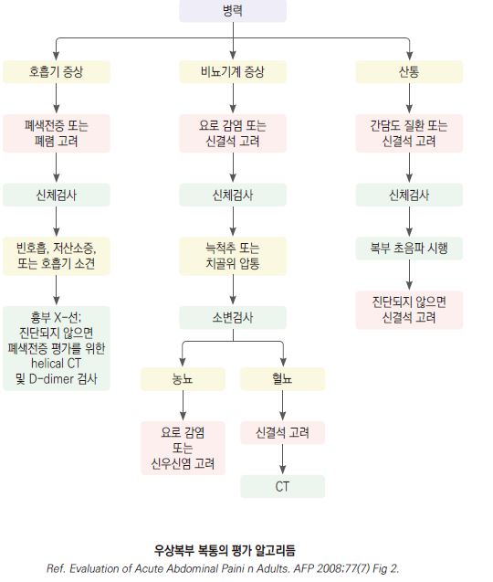
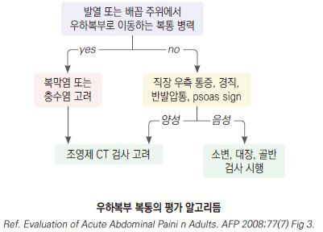
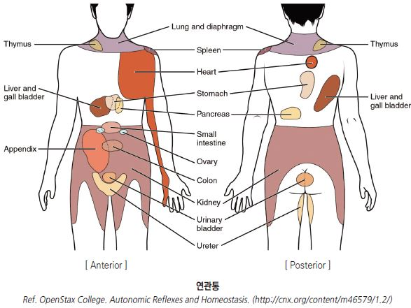
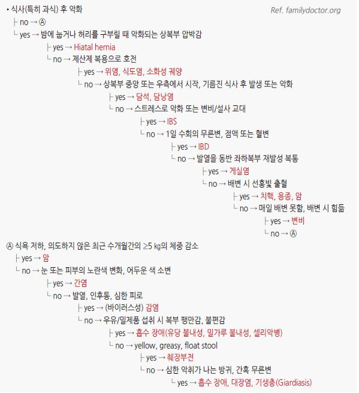

# 복통 Abdominal Pain

### <mark style="color:$danger;">🚩 Red Flags!</mark>

<mark style="color:$danger;">**즉각 응급 조치 / 입원 필요**</mark>

* Vital sign 불안정
* 복막염 소견 : 복부 강직, 반동 압통
* 원인 불명의 빈혈, 위장관 출혈 의심 병력 또는 증상 (혈액 또는 검은색 토물 또는 대변)
* 박동성 복부 종괴 (복부 대동맥류 파열 위험)

<mark style="color:$warning;">**조기 평가 필요 (당일 \~ 수일 내)**</mark>

* 8\~12시간 내 호전되지 않거나 악화
* 발열 동반
* 황달 증상
* 복부 종괴 또는 복부 장기 비대 (박동성 제외)
* 고령(＞60세) - 비전형적 증상 발현, 악성·혈관 질환 위험 증가

<mark style="color:$info;">**계획적 정밀 검사 필요**</mark>

* 설명되지 않는 체중 감소
* 복통 양상의 변화
* 같은 문제로 반복적인 진료 ※ 진단 누락 또는 만성 질환 가능성 경고
* 가족력 : 난소 또는 창자의 악성 종양, 가족성 대장폴립증

## <mark style="color:green;">검사</mark>

* 진찰, vital sign, 병력 청취
* 가임기 여성 : 소변 또는 혈청 β-hCG (자궁외임신 배제)

#### 실험실 검사

* 기본 : CBC, 전해질, BUN/Cr, 간기능(AST/ALT/ALP/bilirubin), lipase/amylase, UA
* 추가 고려 : CRP/ESR(염증 평가), coagulation(출혈 의심), lactate(장간막 허혈 의심)
* 가임기 여성 : β-hCG (반드시 포함)

#### 영상 검사

* 복부 X선 : 장 폐쇄, 천공(free air) 선별
* 복부 초음파 : 담낭·담도·신장·부속기 평가; 1차 선택 검사
* 복부-골반 CT : 급성 복통의 원인 불명 또는 중증 의심 시; 충수염, 게실염, 장간막 허혈 등 평가
* 부인과 초음파 : 자궁외임신, 난소 병변 의심 시

## <mark style="color:green;">통증 기원에 따른 특징</mark>

#### Visceral pain (내장통)

* 기전 : 내장 기관(소장, 대장, 담낭, 요관, 신장 등)의 폐쇄 또는 염증(소화성 궤양, 담낭염, 간염, 충수염, IBD, 신우신염, PID 등)
* 통증 부위 : embryologic origin 관련 부위에 통증이 나타남
  * foregut 기원 : 식도, 위장, 십이지장 근위부, 간, 담낭, 췌장, 비장, 하부 호흡기관 → 상복부 통증
  * midgut 기원 : 십이지장 제2부 원위부\~횡행결장 prox ⅔ & hepatic flexure → 배꼽 주위 통증
  * hindgut 기원 : 횡행결장 distal ⅓ 이하 & splenic flexure → 치골 상부 통증
* 임상 양상
  * 복부 팽만
  * 내장 근육 경련 시 지속적이고 심한 통증
  * 허혈 시 극심한 광범위 통증
  * 염증이 복벽까지 확장되면 국소 압통 발생
  * 허혈성 장질환(acute mesenteric ischemia) 시 심한 통증에 비해 복부 진찰 소견이 경미함

#### Parietal pain (체성통)

* 기전 : 위액, 담즙, 췌장 효소, 대변, 고름, 혈액 등에 의한 복벽의 염증에 의해 발생; 복막 긴장의 변화에 의해 악화
* 임상 양상 : 날카로운, 국소 통증; rebound tenderness

#### Referred pain (연관통)

* 이환된 neurosegment의 지배를 받는 부위에 통증이 나타남

☞ 아래

#### Abdominal wall pain (복벽통)

* 복벽 근육, 근막, 피부 신경의 병변에 의한 통증; 복강 내 장기와 무관
* 원인 질환: 근육 긴장(muscle strain), 늑간신경포착, 복직근 혈종, 대상포진, 수술 후 신경종
* 특징 : 국소 압통, 자세 변화·움직임에 의해 악화, 복강 내 병변과 달리 복부 강직·반동 압통 없음
* Carnett's sign : 환자가 상체를 들어올리거나 복근을 긴장시킬 때 압통이 유지되거나 악화되면 복벽 기원 가능성 높음 (＊복강 내 병변 시 통증 감소)

## <mark style="color:green;">위치에 따른 복부 통증의 감별</mark>

#### 우상복부 복통

* Biliary colic : RUQ 또는 epigastrium의 심한, 우둔한 통증(＞30분 지속), 구역, 구토, 발한
* Acute cholecystitis : RUQ 또는 epigastrium의 심한 통증(＞4시간 지속), 발열, 복부 강직, Murphy's sign
* Acute cholangitis : RUQ 통증, 발열, 황달
* Acute hepatitis : RUQ 통증; 피로, 구역, 구토, 식욕 부진, 황달, 검은색 소변, pale or clay-colored stool; 음주 병력
* Liver abscess : RUQ 통증, 발열; 특히 당뇨병, 간/담도/췌장에 기저 질환이 있는 경우 의심

#### 상복부 복통

* Acute MI : MI 증상(예: 흉통, 호흡 곤란) 동반; 관상동맥병 위험이 있는 환자에서 의심
* Pancreatitis : 점차 심해진 후 지속, 앞으로 기대면 호전, 등으로의 방사통; 음주 병력
* GERD : 가슴쓰림, 역류, 삼킴곤란
* Gastritis, Gastropathy : 가슴쓰림, 구역, 구토
* 십이지장궤양 : 식사로 완화, 식후 수 시간 후 발생
* Functional dyspepsia : 식후 팽만감, 조기 포만감
* Gastroparesis : 구역, 구토, 조기 포만감, 식후 팽만감

#### 좌상복부 복통

* Splenomegaly : 왼쪽 어깨 방사통, 조기 포만감

#### 하복부 복통

* Appendicitis : 상복부에서 시작 → RLQ로 이동, 간혹 복부 전체 통증; 식욕 부진, 구역, 구토
* Diverticulitis : 구역, 구토; 임상 증상은 기저 염증의 중증도에 의존; 수일간 지속
* Infectious colitis : 심한 통증, 설사
* Nephrolithiasis : 편측 옆구리 통증, 등 통증
* Pyelonephritis : 편측 옆구리 통증, 늑골척추각 압통, 빈뇨, 급뇨, 배뇨통, 혈뇨, 발열, 오한, 오심
* Cystitis : 치골상부 통증; 배뇨통, 빈뇨, 급뇨, 혈뇨
* Acute urinary retention : 치골상부 통증

#### 여성 특이 하복부 복통

* Ectopic pregnancy : 편측 하복부 통증, 질 출혈, 무월경; β-hCG 양성; 파열 시 급성 복막염 → 응급
* 골반염 : 양측 하복부 통증, 발열, 질 분비물; cervical motion tenderness
* 난소낭종 파열 : 갑작스런 편측 하복부 통증; 성적 활동 또는 운동 후 발생 가능
* 난소 염전 : 갑작스런 심한 편측 하복부 통증, 구역, 구토; 초음파로 확인 → 응급
* 원발성 월경통 : 월경 시작 전후 하복부 경련성 통증; 요통, 오심 동반 가능

#### 미만성 복통

* 복막염 : 움직이거나 흔들리면 악화, 반동 압통, 복부 강직
* 장 폐쇄 : 경련성 복통, 구역, 구토, 변비, 복부 팽만, 높은 음조의 증가된 장음 또는 무음
* GI 천공 : 갑작스런 심한 복통
* Viral gastroenteritis : 상대적으로 덜 심한 복통, 설사, 구역, 구토
* 식중독 : 설사, 구역, 구토, 발열; 원인으로 의심되는 음식 섭취 경력
* 셀리악병 : 부피가 큰 설사, 나쁜 냄새의 지방변, 복부 가스
* Lactose intolerance : 경련성 복통, 복부 팽만, 복부 가스, 설사
* IBS : 만성 복통, 배변 습관 변화
* Diverticulosis : 변비, 종종 무증상
* IBD : 혈성 설사, 급뇨, 뒤무직, 발열, 장외 증상(관절염, 포도막염); 장기간(수년 이상) 지속
* Acute mesenteric ischemia : 급성의 심하고 지속적인 복통
* Chronic mesenteric ischemia : 식후 통증, 구역, 구토, 설사, 체중 감소

***

***

***

***

## <mark style="color:green;">연관통</mark>

* 보통 소화관 문제는 복부 중앙부 증상으로 나타남
* 콩팥, 요관, 난소, 상행/하행 결장 문제는 이환된 쪽의 편측 증상으로 나타남
* 소장 문제는 배꼽 주위 증상으로 나타남 (T8\~L1)
* 게실염 등에서는 국소, 복막염에서는 미만성으로 복부 강직이 발생
* 깊은 장기의 질환(예: 콩팥 산통, 췌장염)에서는 흔히 복부 강직이 발생하지 않음

## <mark style="color:green;">증상에 따른 감별</mark>

* 고령(특히 당뇨병, 신부전 환자)에서는 통증, 복부 강직, 발열 등의 증상이 적게 발현되므로 증상이 전형적이지 않더라도 중증 질환 가능성을 항상 염두에 두어야 함
* 가임기 여성에서는 항상 임신 가능성을 고려 → β-hCG 확인

### <mark style="color:$primary;">급성 복통</mark>

<figure><figcaption></figcaption></figure>

### <mark style="color:$primary;">만성 복통</mark>

<figure><figcaption></figcaption></figure>

***

### <mark style="color:purple;">**질병코드**</mark>

R10.4 기타 및 상세불명의 복통

R10.0 급성 복증
