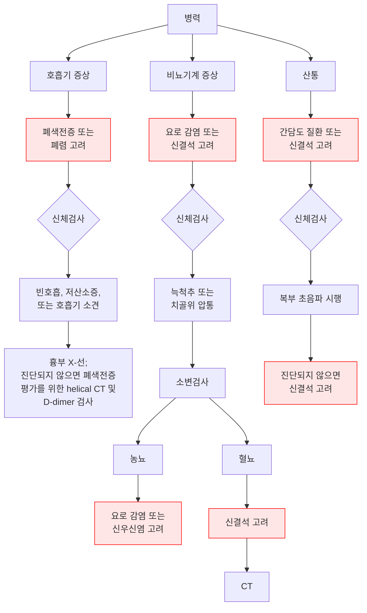
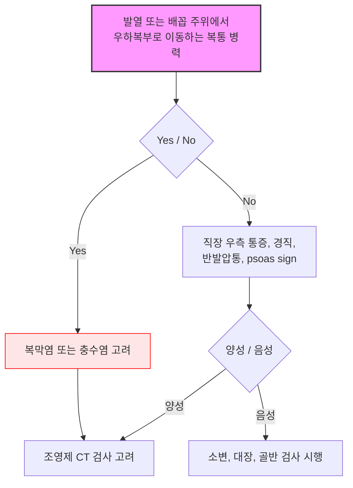
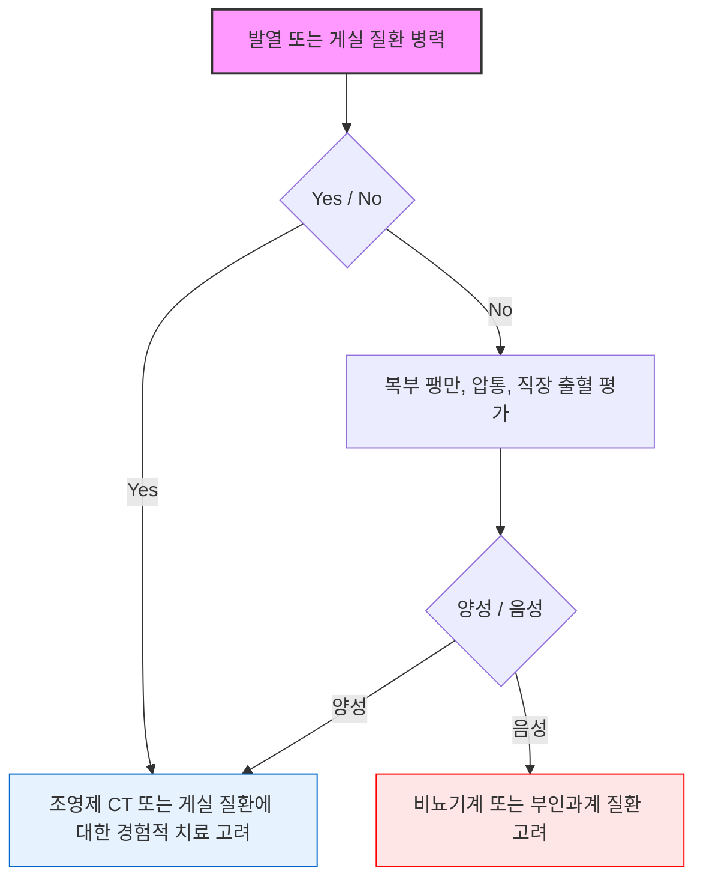
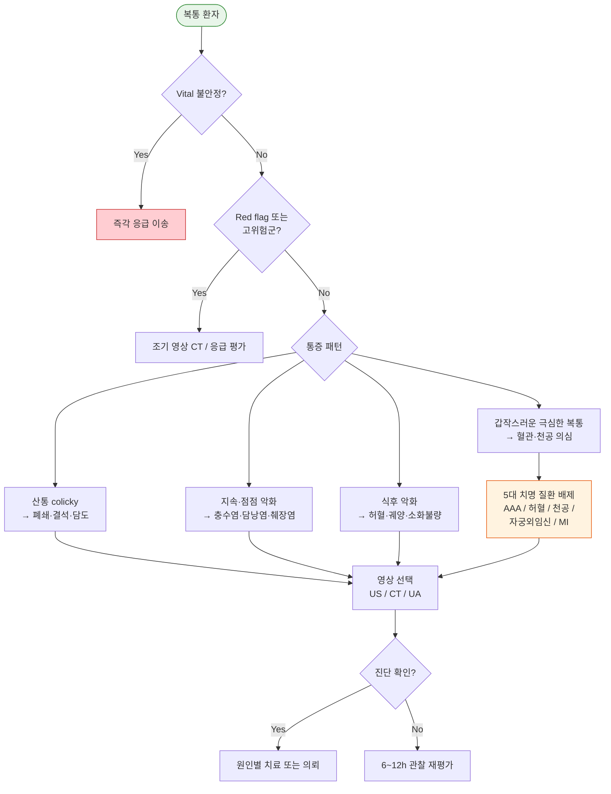

# 복통 Abdominal Pain

## <mark style="color:green;">일반 사항</mark>

* 복통은 1차 진료에서 가장 흔한 주소 중 하나로, 양성 기능성 질환부터 즉각적인 처치가 필요한 응급 질환까지 원인이 매우 다양함
* 통증의 위치·성질·시작·지속 시간·방사·악화·완화 인자와 동반 증상(발열, 구역·구토, 설사, 혈변, 황달 등)을 체계적으로 파악하는 것이 감별 진단의 핵심
* 고령 환자(특히 당뇨병·신부전)는 통증·발열·복부 강직 등이 경미하게 발현될 수 있어 중증 질환을 간과하기 쉬움. 비전형적 증상에도 악성·혈관 질환 가능성을 항상 염두에 두어야 함
* 가임기 여성에서는 항상 자궁외임신 가능성을 먼저 배제 (β-hCG 확인)
* 복용 중인 약물을 반드시 확인
  * NSAIDs(소화성 궤양·천공), 항생제(항생제 관련 장염) 등은 복통의 직접적 원인이 될 수 있음
  * 약물 유발 췌장염은 드물지만 고려 가능 - 주요 원인 약물 : azathioprine, valproate, thiazide계 이뇨제
  * 스테로이드는 잠재적 위험 인자이나 주요 원인은 아님
  * DPP-4 억제제 및 GLP-1 수용체 작용제도 드물지만 췌장염 발생이 보고되므로 당뇨·비만 치료 중인 환자의 복통에서 약물 복용력 확인 필요

### <mark style="color:$danger;">🚩 Red Flags!</mark>

<mark style="color:$danger;">**즉각 응급 조치 및 이송**</mark>

* Vital sign 불안정 (저혈압, 빈맥, 빈호흡)
* 복막염 소견 : 복부 강직, 반동 압통
* 원인 불명의 빈혈, 위장관 출혈 의심 병력 또는 증상 (혈액·검은색 토물·대변)
* 박동성 복부 종괴 → 고령·흡연·죽상동맥경화 환자에서 AAA 파열 → 즉각 이송
* 가임기 여성의 급성 복통 → 자궁외임신 파열 → β-hCG 즉시 확인
* 갑작스러운 극심한 복통 ("내 인생 최악의 통증") → 혈관 사고(AAA, 대동맥 박리), 천공, 장간막 허혈

<mark style="color:$warning;">**조기 평가 필요 (당일 \~ 수일 내)**</mark>

* 8\~12시간 내 호전되지 않거나 악화
* 발열 동반
* 황달 증상
* 복부 종괴 또는 복부 장기 비대 (박동성 제외)
* 고령(≥60세) - 비전형적 증상 발현, 악성·혈관 질환 위험 증가
* 심방세동·혈관 질환 환자의 급성 복통 → 장간막 허혈

<mark style="color:$info;">**계획적 정밀 검사 필요**</mark>

* 설명되지 않는 체중 감소
* 복통 양상의 변화
* 같은 문제로 반복적인 진료 → 진단 누락 또는 만성 질환
* 가족력 : 난소 또는 창자의 악성 종양, 가족성 대장폴립증

## <mark style="color:green;">검사</mark>

* 진찰, vital sign, 병력 청취
* 가임기 여성 : 소변 또는 혈청 β-hCG (자궁외임신 배제)

#### <mark style="color:$primary;">실험실 검사</mark>

* 기본 : CBC, 전해질, BUN/Cr, 간기능(AST/ALT/ALP/bilirubin), lipase (amylase보다 특이도 우수; 발병 4\~6시간 이후 상승; 우선 시행), UA
* 추가 고려 : CRP/ESR(염증 평가), coagulation(출혈 의심), lactate (장간막 허혈 의심 - 초기에는 정상일 수 있으므로 음성이어도 배제 불가), glucose/ketone (당뇨 환자에서 DKA에 의한 가성 복막염 배제)
* 가임기 여성 : β-hCG (반드시 포함)

**Lab 해석**

<table><thead><tr><th width="268.888916015625">검사 소견</th><th width="335.7777099609375">시사 질환</th></tr></thead><tbody><tr><td>AST/ALT 현저히 상승</td><td>간염 (바이러스·허혈·약물)</td></tr><tr><td>ALP + bilirubin 상승</td><td>담도 폐쇄</td></tr><tr><td>Lipase 상승 (≥3×ULN)</td><td>급성 췌장염</td></tr><tr><td>Lactate 상승</td><td>장간막 허혈, 패혈증</td></tr><tr><td>WBC 현저히 상승 + CRP 상승</td><td>세균 감염·복막염·충수염</td></tr><tr><td>β-hCG 양성</td><td>임신 (자궁외임신 배제 필수)</td></tr></tbody></table>

#### <mark style="color:$primary;">심전도(ECG)</mark>

* 상복부 통증 환자에서 심혈관 위험인자(고령, 당뇨, 고혈압, 흡연, 관상동맥 질환 병력)가 있는 경우 기본 시행 — Acute MI는 상복부 통증으로 발현될 수 있음; ECG와 함께 troponin 포함 심근효소 확인 (초기 NSTEMI는 ECG 단독으로 놓칠 수 있음)
* 폐경 후 여성에서는 전형적인 흉통 대신 복통·구역·피로감으로 MI가 발현되는 경우가 많으므로, 심혈관 위험인자가 있는 중년 이상 여성의 상복부 증상에서도 ECG + troponin을 적극 고려

#### <mark style="color:$primary;">영상 검사</mark>

* 복부 X선 : 장 폐쇄(air-fluid level) 또는 천공(free air) 초기 선별로 사용 가능하나 민감도가 낮으며, 확진을 위해서는 CT가 필요함
* 복부 초음파(US) : 담낭·담도·신장·부속기 평가; 방사선 노출 없음; 임신·소아에서 1차 선택
* 복부-골반 CT : 미분화 급성 복통의 표준 검사; 충수염·게실염·장간막 허혈·폐쇄·AAA 등 광범위 평가. 원인 불명의 급성 복통에서 조기 CT 시행은 진단 정확도를 높이고 불필요한 입원 및 수술을 줄임
* 부인과 초음파 : 자궁외임신, 난소 병변 의심 시 (경질초음파가 우선)
* POCUS (point-of-care 초음파) : 1차 진료·응급에서 bedside 시행 가능 — AAA 선별, 담낭 평가, 수신증(hydronephrosis) 확인에 유용

**CT vs 초음파 선택 원칙**

<table><thead><tr><th width="382.22216796875">임상 상황</th><th width="311.3333740234375">권장 영상</th></tr></thead><tbody><tr><td>RUQ 통증 (담낭·담도 의심)</td><td>초음파 먼저</td></tr><tr><td>LLQ 통증 (게실염 의심)</td><td>CT</td></tr><tr><td>옆구리 통증 (요로 결석 의심)</td><td>비조영 CT</td></tr><tr><td>충수염 의심 - 성인</td><td>CT</td></tr><tr><td>충수염 의심 - 소아·임신</td><td>초음파 먼저; 불명확 시 MRI 고려</td></tr><tr><td>골반 통증 (부인과 의심)</td><td>경질초음파</td></tr><tr><td>미분화 급성 복통 (고령·혈관 위험·diffuse pain)</td><td>CT</td></tr><tr><td>AAA 의심 (bedside 선별)</td><td>POCUS → CT (확진)</td></tr></tbody></table>

## <mark style="color:green;">통증 기원에 따른 특징</mark>

#### <mark style="color:$primary;">Visceral pain (내장통)</mark>

* 기전 : 내장 기관(소장, 대장, 담낭, 요관, 신장 등)의 폐쇄 또는 염증(소화성 궤양, 담낭염, 간염, 충수염, IBD, 신우신염, PID 등)

**기원별 통증 부위** : embryologic origin 관련 부위에 통증이 나타남

* foregut 기원 : 식도, 위장, 십이지장 근위부, 간, 담낭, 췌장, 비장, 하부 호흡기관 → 상복부 통증
* midgut 기원 : 십이지장 제2부 원위부 \~ 횡행결장 proximal ⅔ (hepatic flexure 포함, splenic flexure 제외) → 배꼽 주위 통증
* hindgut 기원 : 횡행결장 distal ⅓ 이하(splenic flexure 포함) \~ 직장상부 → 치골 상부 통증

**임상 양상**

* 복부 팽만
* 내장 근육 경련 시 지속적이고 심한 통증
* 허혈 시 극심한 광범위 통증
* 염증이 복벽까지 확장되면 국소 압통 발생
* 허혈성 장질환(acute mesenteric ischemia)에서는 심한 통증에 비해 복부 진찰 소견이 경미함

#### <mark style="color:$primary;">Parietal pain (체성통)</mark>

* 기전 : 위액, 담즙, 췌장 효소, 대변, 고름, 혈액 등에 의한 복벽의 염증에 의해 발생; 복막 긴장의 변화에 의해 악화
* 임상 양상 : 날카로운, 국소 통증; 반동 압통(rebound tenderness)

#### <mark style="color:$primary;">Referred pain (연관통)</mark>

* 이환된 neurosegment의 지배를 받는 부위에 통증이 나타남
* 보통 소화관 문제는 복부 중앙부 증상으로 나타남
* 콩팥, 요관, 난소, 상행/하행 결장 문제는 이환된 쪽의 편측 증상으로 나타남
* 소장 문제는 배꼽 주위 증상으로 나타남 (T8\~L1)
* 게실염 등에서는 국소, 복막염에서는 미만성으로 복부 강직이 발생
* 깊은 장기의 질환(예: 콩팥 산통, 췌장염)에서는 흔히 복부 강직이 발생하지 않음


#### <mark style="color:$primary;">Abdominal wall pain (복벽통)</mark>

* 복벽 근육, 근막, 피부 신경의 병변에 의한 통증; 복강 내 장기와 무관
* 원인 질환: 근육 긴장(muscle strain), 늑간신경포착, 복직근 혈종, 대상포진(Herpes zoster — 발진 출현 전 전구기에 편측 복통으로 발현될 수 있으며, 특히 고령·면역저하 환자에서 진단 지연에 주의), 수술 후 신경종
* 특징 : 국소 압통, 자세 변화·움직임에 의해 악화, 복강 내 병변과 달리 복부 강직·반동 압통 없음
* Carnett's sign : 압통 부위를 누른 상태에서 환자에게 고개를 들게 하거나(또는 상체를 들어 올리거나) 복근을 긴장시킬 때 압통이 유지되거나 악화되면 복벽 기원 가능성 높음 (※ 복강 내 병변 시 통증 감소). 양성 시 CT 반복보다 복벽 원인 치료를 먼저 고려. 단, 초기 복막염에서도 복근 수축 시 통증이 악화될 수 있어 위양성 가능성이 있으므로, 반동 압통·발열·전신 상태 악화 등 다른 소견과 함께 종합 판단해야 함

## <mark style="color:green;">통증 패턴 인식</mark>

 ※ 통증 발생 양상은 원인 감별의 첫 번째 단서임

<table><thead><tr><th width="250">통증 패턴</th><th>시사 원인</th></tr></thead><tbody><tr><td>갑작스러운 극심한 통증</td><td>혈관 사고(AAA, 대동맥 박리), 천공, 장간막 허혈</td></tr><tr><td>산통(colicky) - 파도처럼 반복</td><td>장 폐쇄, 담도 산통, 요관 결석</td></tr><tr><td>지속적·점점 악화</td><td>충수염, 담낭염, 췌장염 등 염증성 질환</td></tr><tr><td>식후 악화 (postprandial)</td><td>만성 장간막 허혈, 소화성 궤양, 기능성 소화불량</td></tr><tr><td>상복부→우하복부 이동</td><td>충수염 (전형적 이동 패턴)</td></tr><tr><td>자세·움직임으로 악화</td><td>복벽통, 근골격계 원인</td></tr><tr><td>배변 후 호전</td><td>IBS, 게실 질환</td></tr></tbody></table>

## <mark style="color:green;">위치에 따른 복부 통증의 감별</mark>

#### <mark style="color:$primary;">우상복부 및 상복부 복통</mark>


GERD·위염(gastritis)·기능성 소화불량(functional dyspepsia)은 해부학적으로 **상복부(epigastric)** 통증이 더 정확하나, 임상적으로 RUQ와 겹치는 경우가 많아 함께 기술함


* Biliary colic : RUQ 또는 epigastrium의 심한 우둔한 통증(＞30분 지속), 구역, 구토, 발한
* Acute cholecystitis : RUQ 또는 epigastrium의 심한 통증(＞4시간 지속), 발열, 복부 강직, Murphy's sign
* Acute cholangitis : RUQ 통증, 발열, 황달
* Acute hepatitis : RUQ 통증; 피로, 구역, 구토, 식욕 부진, 황달, 검은색 소변, pale or clay-colored stool; 음주 병력
* Liver abscess : RUQ 통증, 발열; 특히 당뇨병, 간/담도/췌장에 기저 질환이 있는 경우 의심
* Fitz-Hugh-Curtis 증후군 : 젊은 여성에서 RUQ 통증; PID의 합병증으로 발생하는 간 주위염(perihepatitis) — 하복부 증상 없이 RUQ 통증만 있을 수 있어 담낭염과의 감별이 필요; PID 병력 또는 STI 위험인자 확인
* Acute MI : MI 증상(예: 흉통, 호흡 곤란) 동반; 관상동맥병 위험이 있는 환자에서 의심 → ECG 즉시 시행; troponin 포함 심근효소 확인 (NSTEMI는 ECG 정상일 수 있음)
* Pancreatitis : 점차 심해진 후 지속, 앞으로 기대면 호전, 등으로의 방사통; 음주 병력
* GERD : 가슴쓰림, 역류, 삼킴곤란
* Gastritis, Gastropathy : 가슴쓰림, 구역, 구토
* 십이지장궤양 : 식사로 완화, 식후 수 시간 후 발생
* Functional dyspepsia : 식후 팽만감, 조기 포만감
* Gastroparesis : 구역, 구토, 조기 포만감, 식후 팽만감



<p align="center"><strong>우상복부 복통의 평가 알고리듬</strong><br><em><mark style="color:$info;">Ref. Evaluation of Acute Abdominal Pain in Adults. AFP 2008;77(7) Fig 2.</mark></em></p>

#### <mark style="color:$primary;">좌상복부 복통</mark>

* Splenomegaly : 왼쪽 어깨 방사통, 조기 포만감

#### <mark style="color:$primary;">하복부 복통</mark>

* Appendicitis : 상복부에서 시작 → RLQ로 이동, 간혹 복부 전체 통증; 식욕 부진, 구역, 구토
  * 단순 충수염(uncomplicated appendicitis)에서는 선택적으로 항생제 치료 고려 가능 (APPAC, CODA trial); 단, 재발 위험(1년 내 약 30\~40%)이 있으며 환자와 충분한 상의 후 결정
* Diverticulitis : 구역, 구토; 수일간 지속
  * 경증 비복잡 게실염(uncomplicated, Hinchey I) : 최신 가이드라인에서 항생제 없이 보존적 치료(식이 조절, 경과 관찰) 가능 (AVOD trial, DIABOLO trial). 발열·전신 염증 반응·합병증 의심 시에는 항생제 유지
  * 우측 게실염 : 동양인에서 흔함; 충수염과 임상 양상 매우 유사 — CT로 감별 필요
  * 좌측 게실염 : 서구형의 전형적 위치(LLQ); 고령, 저섬유·고지방 식이 환자에서 호발
* Ischemic colitis (허혈성 결장염) : 주로 LLQ 또는 좌측 복통; 혈성 설사, 복통이 갑자기 시작; 고령, 동맥경화, 저혈압, 심방세동 환자에서 주의 — CT 또는 대장내시경으로 확인
* Nephrolithiasis : 편측 옆구리 통증, 등 통증
* Pyelonephritis : 편측 옆구리 통증, 늑골척추각 압통, 빈뇨, 급뇨, 배뇨통, 혈뇨, 발열, 오한, 오심
* Cystitis : 치골상부 통증; 배뇨통, 빈뇨, 급뇨, 혈뇨
* Acute urinary retention : 치골상부 통증



<p align="center"><strong>우하복부 복통의 평가 알고리듬</strong><br><em><mark style="color:$info;">Ref. Evaluation of Acute Abdominal Pain in Adults. AFP 2008;77(7) Fig 3.</mark></em></p>



<p align="center"><strong>좌하복부 복통의 평가 알고리듬</strong><br><em><mark style="color:$info;">Ref. Evaluation of Acute Abdominal Pain in Adults. AFP 2008;77(7) Fig 4.</mark></em></p>

#### <mark style="color:$primary;">여성 특이 하복부 복통</mark>

* Ectopic pregnancy : 편측 하복부 통증, 질 출혈, 무월경; β-hCG 양성; 파열 시 급성 복막염 → 응급
* 골반염(PID) : 양측 하복부 통증, 발열, 질 분비물; 자궁경부 운동통(cervical motion tenderness, CMT) — 골반염 진단의 핵심 신체 검진 소견; Fitz-Hugh-Curtis 증후군(간 주위염) 합병 시 RUQ 통증 동반 가능
* 난소낭종 파열 : 갑작스런 편측 하복부 통증; 성적 활동 또는 운동 후 발생 가능
* 난소 염전 : 갑작스런 심한 편측 하복부 통증, 구역, 구토; 초음파로 확인 → 응급
* 원발성 월경통 : 월경 시작 전후 하복부 경련성 통증; 요통, 오심 동반 가능

#### <mark style="color:$primary;">미만성 복통</mark>

* 복막염 : 움직이거나 흔들리면 악화, 반동 압통, 복부 강직
* 장 폐쇄 : 경련성 복통, 구역, 구토, 변비, 복부 팽만, 높은 음조의 증가된 장음 또는 무음
* GI 천공 : 갑작스런 심한 복통
* 복부 대동맥류(AAA) 파열 : 갑작스러운 심한 복통 또는 요통, 박동성 복부 종괴, 혈압 저하; 고령·흡연력·죽상동맥경화 병력이 있는 환자에서 강하게 의심 — 여성에서도 발생하며 흡연력이 있는 여성의 위험 증가; 즉각 응급 처치 필요
* Acute mesenteric ischemia : 급성의 심하고 지속적인 복통; 통증에 비해 복부 진찰 소견이 경미한 것이 특징(pain out of proportion); 심방세동·최근 MI·심부전 환자에서 강하게 의심; 조기 CT angiography가 필수 진단 도구; 초기에는 lactate가 정상일 수 있으므로 정상 결과로 배제 불가
* Chronic mesenteric ischemia : 식후 30분\~1시간 내 발생하는 심한 상복부 통증, 구역, 구토, 설사, 체중 감소; 통증에 대한 공포로 식사 기피(food fear) → 체중 감소 심화
* 급성 감염성 위장관염 : 상대적으로 덜 심한 복통, 설사, 구역, 구토; 바이러스성(norovirus 등)과 세균성(식중독 포함) 원인 모두 포함. 독소 매개형 식중독은 섭취 후 1\~6시간 내 급격한 구역·구토·설사로 발현하는 점에서 감별 단서가 됨. 세부 내용은 소화기 감염 챕터 참조
* 셀리악병 : 부피가 큰 설사, 나쁜 냄새의 지방변, 복부 가스
* IBS : 배변과 연관된 반복성 복통, 배변 후 증상 호전, 배변 빈도·형태 변화 동반 (Rome IV 기준); Lactose intolerance(경련성 복통, 복부 팽만·가스, 설사)와 감별 필요
* Diverticulosis : 변비, 종종 무증상
* IBD : 혈성 설사, 배변 긴박감, 뒤무직, 발열, 장외 증상(관절염, 포도막염); 장기간(수년 이상) 지속

## <mark style="color:green;">복강 외 원인 (Extra-abdominal Causes)</mark>

<table><thead><tr><th width="220">질환</th><th>복통 양상 및 진단 단서</th></tr></thead><tbody><tr><td>급성 심근경색 (MI)</td><td>상복부 통증; 고령·당뇨·심혈관 위험인자; ECG + troponin 필수</td></tr><tr><td>폐렴 (Pneumonia)</td><td>하폐엽 폐렴에서 상복부·옆구리 통증 가능; 호흡기 증상, 흉부 X선</td></tr><tr><td>폐색전증 (PE)</td><td>흉막 자극 시 복통 발생 가능; 호흡 곤란, D-dimer, CTA</td></tr><tr><td>당뇨병 케톤산증 (DKA)</td><td>미만성 복통, 구역·구토; 혈당·케톤 확인</td></tr><tr><td>대상포진 (Herpes zoster)</td><td>발진 전구기 편측 복통; 피부 과민, 수포 출현 시 확진</td></tr></tbody></table>

## <mark style="color:green;">고령자 복통의 특징</mark>

 ※ 고령자는 동일 질환에서도 증상이 경미하게 발현되어 진단이 지연되고 사망률이 높음

* 통증 강도가 낮아 심각한 질환을 과소평가하기 쉬움
* 발열·백혈구 증가·복부 강직 등이 뚜렷하지 않은 경우가 많음
* 충수염 천공·장 폐쇄·장간막 허혈의 지연 진단이 흔함
* CT 시행 역치를 낮추고, 진단 불명 시 6\~12시간 관찰 후 재평가 또는 입원 적극 고려
* 심방세동·동맥경화 병력 → 장간막 허혈 강하게 의심

## <mark style="color:green;">증상에 따른 감별</mark>

* 고령(특히 당뇨병, 신부전 환자)에서는 통증, 복부 강직, 발열 등의 증상이 적게 발현되므로 증상이 전형적이지 않더라도 중증 질환 가능성을 항상 염두에 두어야 함
* 가임기 여성에서는 항상 임신 가능성을 고려 → β-hCG 확인

### <mark style="color:orange;">급성 복통</mark>

<figure><figcaption></figcaption></figure>

### <mark style="color:orange;">만성 복통</mark>

<figure><figcaption></figcaption></figure>

***

## <mark style="background-color:$warning;">Management</mark>

#### <mark style="color:$primary;">1차 진료 접근 원칙</mark>

**Step 1. Vital sign 안정 여부 확인**

* 활력징후 불안정(저혈압·빈맥) 또는 복막염 소견 → 즉각 응급 이송 (소생술 + CT/수술 준비)

**Step 2. Red flag 및 고위험군 확인**

* 고령(≥60세), 심방세동·혈관 질환, 당뇨·CKD·면역저하, 가임기 여성 → CT 역치 낮춤; β-hCG 확인

**Step 3. 치명 질환 배제**

<table><thead><tr><th width="200">질환</th><th>핵심 단서</th></tr></thead><tbody><tr><td>AAA 파열</td><td>고령·흡연·박동성 종괴·저혈압</td></tr><tr><td>장간막 허혈</td><td>AF·심혈관 병력·pain out of proportion</td></tr><tr><td>GI 천공</td><td>갑작스러운 극심한 통증·복막염 소견</td></tr><tr><td>자궁외임신</td><td>가임기 여성·β-hCG 양성</td></tr><tr><td>Acute MI</td><td>상복부 통증·심혈관 위험인자·ECG 변화</td></tr></tbody></table>

**Step 4. 통증 패턴 + 위치 기반 감별 → 검사 선택**

  (☞ [통증 패턴 인식](003_-abdominal-pain.md#통증-패턴-인식), [CT vs 초음파 선택 원칙](003_-abdominal-pain.md#영상-검사) 참조)

**Step 5.  Disposition 결정**

* 응급 의뢰 또는 이송 : vital 불안정, 복막염, 치명 질환 의심
* 6\~12시간 관찰 후 재평가 : 진단 불명확, 충수염 초기 의심
* 외래 추적 + safety-net 설명 : 경증, 기능성 가능성 높음

***



<p align="center"><strong>복통 관리 알고리듬</strong></p>

***

#### <mark style="color:$primary;">진통제 사용 원칙</mark>

 ※ 진단 지연을 우려하여 진통제를 제한하는 것은 권장되지 않으며, 적절한 통증 조절은 표준 치료임. 오히려 통증이 완화되면 신체 검진의 질이 향상됨

<table><thead><tr><th width="241.111083984375">임상 상황</th><th>권장 진통제</th></tr></thead><tbody><tr><td>신장·요관 산통 (renal colic)</td><td>NSAIDs 우선 - ketorolac <mark style="color:blue;">[케토펜]</mark> 30㎎ IM/IV(빠른 onset, 강한 진통 효과)</td></tr><tr><td>담도 산통</td><td>NSAIDs 또는 진경제(hyoscine) 병용</td></tr><tr><td>급성 췌장염</td><td>Opioid 사용 가능 - 과거 Oddi 괄약근 경련 우려는 임상적 근거 불충분</td></tr><tr><td>중등도 이상 복통 (원인 평가 중)</td><td>Tramadol 또는 저용량 opioid 고려; 진단 평가와 병행 가능</td></tr></tbody></table>

#### <mark style="color:red;">주요 진단 오류</mark>

* **심근경색(MI)을 위장 질환으로 오진**
  * 상복부 통증을 "위염/GERD"로 단정 - 특히 고령·당뇨 환자에서 atypical MI는 복통만으로 발현 가능
  * 상복부 통증 + 심혈관 위험인자 → ECG + troponin 반드시 시행
* **AAA 놓침**
  * 급성 요통 또는 복통을 근골격계로 판단 - 고령 + 흡연 + 갑작스러운 복통·요통은 AAA until proven otherwise
  * POCUS(bedside US) 또는 CT 즉시 시행
* **장간막 허혈 과소 진단**
  * 심한 복통인데 신체 검진 정상 → "기능성"으로 판단하는 실수. Pain out of proportion이 핵심 단서
  * AF·심혈관 병력 있으면 무조건 의심; lactate 정상이어도 배제 불가; CTA 조기 시행
* **자궁외임신 누락**
  * 가임기 여성의 하복부 통증을 단순 GI 문제로 처리 - 파열 시 급사 가능
  * 가임기 여성 = 무조건 β-hCG; 양성이면 골반 초음파
* **충수염 초기에 귀가**
  * 애매한 통증 + 영상 없이 discharge → 몇 시간 후 천공
  * 진단이 불확실하면 6\~12시간 관찰 + repeat exam; "진단이 아니라 경과를 본다"
* **게실염을 IBS로 오진**
  * LLQ 통증 + 만성 병력 → IBS로 단정 - abscess·천공으로 진행 가능
  * LLQ + 발열/CRP 상승 → CT; IBS는 red flag가 없어야만 진단
* **요관 결석에서 영상 미시행**
  * 옆구리 통증에 진통제만 주고 귀가 - obstruction/infection 놓침 가능
  * UA + 비조영 CT 고려; 고령에서는 AAA도 반드시 배제
* **복벽 통증을 복강 내 질환으로 오진**
  * 국소 압통에 CT 반복 시행 - Carnett's sign(+)이면 복벽 원인 우선 고려
  * 불필요한 방사선 노출 및 비용 절감
* **고령자 복통 과소평가**
  * 경미한 통증 → benign으로 판단 - 고령자는 증상이 약해도 중증 질환 가능성 높음
  * CT 역치 낮추고, 입원 관찰 적극 고려
* **진통제를 참게 하면 진단에 도움이 된다는 오해**
  * 통증 조절 거부 → 환자 고통 증가, 신체 검진 질 저하
  * 적절한 진통은 표준 치료; renal colic → NSAIDs, 췌장염 → opioid 모두 안전하게 사용 가능

***

### <mark style="color:red;">질병코드</mark>

R10.0 급성 복증

R10.1 상복부 통증

R10.2 골반 및 회음부 통증

R10.3 하복부의 다른 국소 통증

R10.4 기타 및 상세불명의 복통

***

### <mark style="color:purple;">처방례</mark>

> **처방례 1. 요관 산통 (신장 결석, 비복잡성)**
>
> ```
> 케토펜주 (ketorolac tromethamine) 30 ㎎/1 ㎖    1회 IM 또는 IV
> ```
>
> _✽ NSAIDs가 1차 선택; 통증 재발 시 반복 투여 가능 (최대 5일). 신기능 저하·출혈 경향 있으면 opioid로 전환. 통증 조절 후 비조영 CT로 결석 확인 권장_

> **처방례 2. 중등도 급성 복통 (원인 평가 중 통증 조절)**
>
> ```
> 트라마돌 캡슐 50 ㎎    q6h prn (최대 400 ㎎/day)
> 맥페란정 (metoclopramide) 10 ㎎    tid pc    — 오심 동반 시
> ```
>
> _✽ 진단 확인 전이라도 적절한 통증 조절은 표준 치료. 원인 파악과 병행하여 사용_

> **처방례 3. 급성 췌장염 통증 조절 (입원 전 또는 경증)**
>
> ```
> 트라마돌 캡슐 50 ㎎    q6h prn
> IV fluid (NS 또는 LR) 병행; NPO 유지
> ```
>
> _✽ 췌장염에서 opioid 사용은 과거 Oddi 괄약근 경련 우려로 기피했으나, 임상적 근거는 불충분하며 적절한 통증 조절이 우선. 중등도 이상은 입원 의뢰_

***

### <mark style="color:$success;">핵심 복약 지도</mark>

* **NSAIDs (ketorolac, loxoprofen 등)** — 반드시 식후 복용; 신기능 저하·소화성 궤양 병력·고령자에서 주의; 5일 이상 장기 사용 삼가; 위장 보호를 위해 PPI 병용 고려
* **Tramadol** — 초기 복용 시 어지러움·구역이 흔함; 음주·운전 주의; MAO 억제제 병용 금기; 간질 병력자 주의; 신기능 저하 시 용량 감량
* **Opioid 계열** — 변비 예방(수분·섬유소 섭취); 졸음·어지러움 발생 시 운전·기계 조작 금지; 급성기 단기 사용은 의존성 위험 낮음
* **진경제 (hyoscine butylbromide 등)** — 녹내장·전립선 비대·구강 건조증 병력자 주의; 구강 건조 부작용 흔함

***

### <mark style="color:blue;">환자 안내서</mark>


**복통은 원인이 매우 다양합니다 — 위험 신호를 놓치지 마세요**

대부분의 복통은 일시적이고 자연히 회복되지만, 일부는 즉각적인 치료가 필요한 심각한 질환의 신호일 수 있습니다.


#### <mark style="color:$primary;">복통이란 무엇인가요?</mark>

* 배 전체 또는 특정 부위에 발생하는 통증·경련·불편감을 말합니다
* 원인은 소화기(위염, 장염, 충수염(맹장염), 담석, 변비), 비뇨기(요로결석, 방광염), 부인과(난소 낭종, 자궁외임신), 근육·혈관 질환 등 매우 다양합니다

#### <mark style="color:$primary;">이럴 때는 즉시 119를 부르거나 응급실로 가세요</mark>

* 갑자기 찢어지는 듯한 극심한 복통이 발생한 경우
* 복통과 함께 복부 전체가 딱딱하게 굳거나 반동 압통(손을 뗄 때 더 아픔)이 있는 경우
* 고열(38.5℃ 이상), 구토가 멈추지 않거나 혈변이 동반되는 경우
* 혈압 저하, 식은땀, 의식 저하가 동반되는 경우
* 가임기 여성에서 갑작스러운 심한 하복통 (자궁외임신 가능성)
* **소아의 경우** : 의사소통이 어려운 영유아가 평소보다 심하게 보채거나, 다리를 배 쪽으로 끌어올리며 울음을 멈추지 않을 때는 즉시 진료를 받으십시오

#### <mark style="color:$primary;">복통 시 주의사항</mark>

* **자의로 강한 진통제(특히 마약성 진통제)를 복용하지 마십시오** — 증상 변화를 놓쳐 진단이 늦어질 수 있습니다. 통증이 심할 경우 반드시 의료진에게 알리십시오; 진료 중 통증 조절은 의료진이 판단하며, 적절한 진통제 사용은 치료에 도움이 됩니다
* **복통 위치와 시작 시간, 동반 증상을 메모**해 두면 진료 시 도움이 됩니다
* **식이 조절** : 소화기 원인의 복통은 기름지고 자극적인 음식, 과음을 피하고 소량씩 자주 드시는 것이 도움됩니다
* **수분 보충** : 구토나 설사가 동반된 경우 탈수가 되지 않도록 물이나 이온 음료를 조금씩 자주 드십시오
