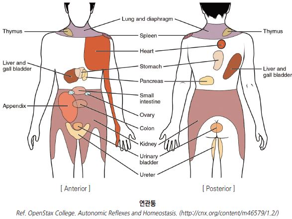
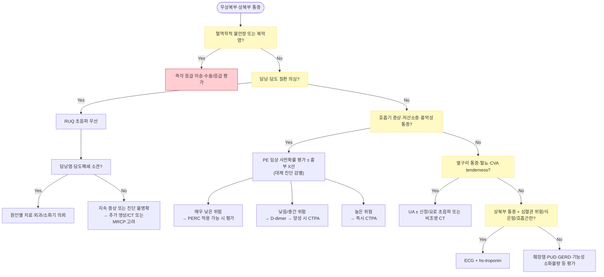
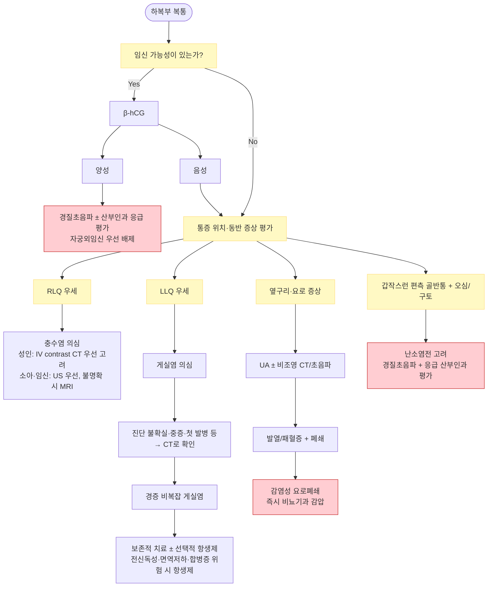
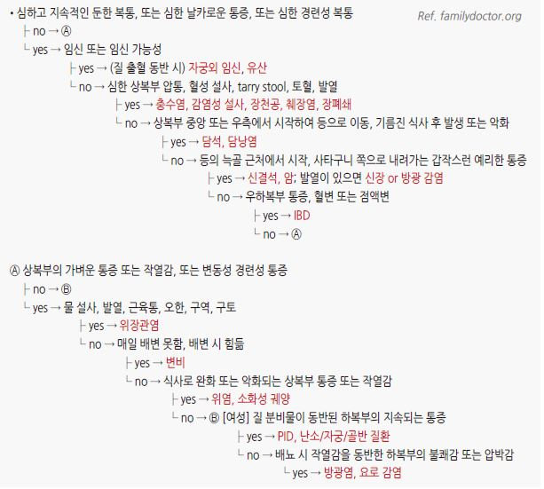
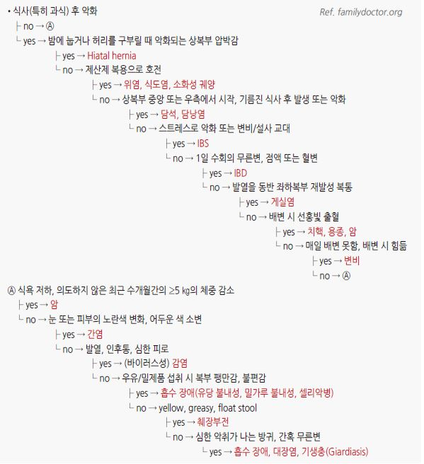
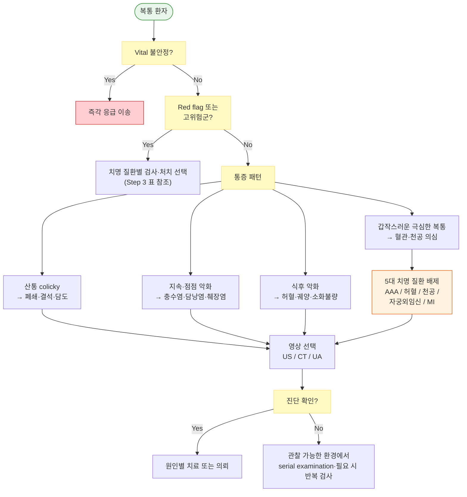

# 복통 Abdominal Pain

## <mark style="color:green;">일반 사항</mark>

* 복통은 1차 진료에서 가장 흔한 주소 중 하나로, 양성 기능성 질환부터 즉각적인 처치가 필요한 응급 질환까지 원인이 매우 다양함
* 통증의 위치·성질·시작·지속 시간·방사·악화·완화 인자와 동반 증상(발열, 구역·구토, 설사, 혈변, 황달 등)을 체계적으로 파악하는 것이 감별 진단의 핵심
* 고령 환자(특히 당뇨병·신부전)는 통증·발열·복부 강직 등이 경미하게 발현될 수 있어 중증 질환을 간과하기 쉬움. 비전형적 증상에도 악성·혈관 질환 가능성을 항상 염두에 두어야 함
* 임신 가능성이 있는 가임기 여성의 급성 하복부·골반통에서는 임신 여부를 우선 확인하고 β-hCG를 시행; 임신이 확인되면 자궁외임신을 반드시 배제
* 복용 중인 약물을 반드시 확인
  * NSAIDs(소화성 궤양·천공), 항생제(항생제 관련 장염) 등은 복통의 직접적 원인이 될 수 있음
  * 약물 유발 췌장염은 드물지만 고려 가능 - 주요 원인 약물 : azathioprine, valproate, thiazide계 이뇨제
  * 스테로이드는 잠재적 위험 인자이나 주요 원인은 아님
  * DPP-4 억제제 및 GLP-1 수용체 작용제도 췌장염 발생이 보고되나 인과성에는 논란이 있어 과도하게 강조하지 않되, 당뇨·비만 치료 중인 환자의 복통에서는 약물 복용력을 확인
  * SGLT2 억제제 복용 환자는 혈당이 정상 또는 경도 상승만 보이는 euglycemic DKA가 가능함을 우선 고려 (혈당만으로 DKA를 배제하지 말 것)
  * 항응고제·항혈소판제 복용 환자의 복통·옆구리 통증에서는 복벽혈종(rectus sheath hematoma) 또는 retroperitoneal bleeding 가능성 고려
  * Metformin은 복통·설사·구역 등 소화기 부작용이 흔하며, 드물지만 탈수·신기능 저하 동반 시 metformin 관련 젖산산증(lactic acidosis) 가능성 고려

### <mark style="color:$danger;">🚩 Red Flags!</mark>

<mark style="color:$danger;">**즉각 응급 조치 및 이송**</mark>

* Vital sign 불안정 (저혈압, 빈맥, 빈호흡)
* 복부 강직, 반동 압통 복막염[^1]
* 대량 토혈·지속적 위장관 출혈, 또는 혈역학적 불안정·실신·복막자극이 동반된 출혈
* 박동성 복부 종괴 → 고령·흡연·죽상동맥경화 환자에서 AAA 파열 → 즉각 이송
* 임신 가능성이 있는 가임기 여성의 급성 하복부·골반통 ± 질출혈 → β-hCG 조기 확인 후 자궁외임신 배제 절차 진행. 단, 임신반응검사 양성은 임신 위치를 알려주지 않으며 단일 β-hCG 수치나 이른 시기의 음성 초음파만으로는 배제되지 않음(임신 위치 미상(pregnancy of unknown location)인 경우 정량 β-hCG 및 반복 경질초음파 추적 필요); β-hCG 양성 + 혈역학적 불안정·복막자극·심한 통증이 있으면 파열된 자궁외임신을 의심하고 β-hCG 추이나 discriminatory level을 기다리지 않고 응급 산부인과 평가·수술을 지연하지 않음
* 갑작스러운 극심한 복통 ("내 인생 최악의 통증") → 혈관 사고(AAA, 대동맥 박리), 천공, 장간막 허혈; 고령·당뇨 환자에서는 비전형적 급성 MI도 고려
* 갑작스러운 상복부·복부 통증 + 흉통 또는 등 통증 + 사지 간 맥박·혈압 차이 또는 신경학적 증상 동반 → 대동맥 박리(aortic dissection) 의심

<mark style="color:$warning;">**당일 평가 필요**</mark>

* 통증이 지속적으로 악화되거나, 반복 구토로 경구 섭취가 불가능하거나, 새로운 발열·출혈·황달·국소 압통·복막자극 소견이 나타나거나, 재평가 시 활력징후·진찰 소견이 변화하는 경우 - 고정된 관찰 시간(예: 8\~12시간)보다 임상 경과 자체를 기준으로 판단
* 흑변·혈변·토혈이 있으나 활력징후가 안정적인 경우
* 발열 동반
* 황달 증상
* 복부 종괴 또는 복부 장기 비대 (박동성 제외)
* 고령(특히 ≥60\~65세), frailty 또는 중대한 동반질환 - 독립적인 응급 red flag라기보다 중증 질환의 비전형적 발현 위험을 높이는 risk modifier로 보고 검사·영상 및 관찰 역치를 낮춤
* 심방세동·혈관 질환 환자의 급성 복통 → 장간막 허혈

<mark style="color:$info;">**계획적 정밀 검사 필요**</mark>

* 설명되지 않는 체중 감소
* 원인이 설명되지 않는 빈혈 (예: 철결핍빈혈)
* 복통 양상의 변화
* 같은 문제로 반복적인 진료 → 진단 누락 또는 만성 질환
* 가족력 : 난소 또는 창자의 악성 종양, 가족성 대장폴립증

## <mark style="color:green;">검사</mark>

* 진찰, vital sign, 병력 청취
* 가임기 여성 : 소변 또는 혈청 β-hCG (자궁외임신 배제 목적; 단일 수치나 조기 음성 초음파만으로는 배제되지 않으므로 임신 위치 미상 시 정량 β-hCG·경질초음파 추적 필요)

#### <mark style="color:$primary;">실험실 검사</mark>

* 기본 (미분화 급성 복통의 초기 평가로 흔히 함께 시행하나, 병력·통증 위치·임상 가설에 따라 항목 조정 가능) : CBC, 전해질, BUN/Cr, 간기능(AST/ALT/ALP/bilirubin) - RUQ 통증·황달·담도 질환 의심 시 특히 유용, lipase(amylase보다 진단 정확도가 높아 상복부 통증 등 췌장염 의심 시 우선 시행; 임상적으로 췌장염이 의심되면 증상 발생 시점과 관계없이 검사; lipase는 amylase보다 상승이 오래 지속되어(약 8\~14일 vs 3\~7일) 증상 발생 후 수일이 지나 내원한 경우에도 진단 유용성이 더 높음), UA(요로 증상·옆구리 통증 또는 임신 관련 감별 시)
* 추가 고려 : CRP/ESR(염증 평가), coagulation(출혈 의심), lactate (장간막 허혈 의심 - 초기에는 정상일 수 있으므로 음성이어도 배제 불가), glucose/ketone/anion gap metabolic acidosis (당뇨 환자에서 DKA에 의한 가성 복막염 배제) - SGLT2 억제제 복용 환자는 혈당이 정상 또는 경도 상승만 보이는 euglycemic DKA가 가능하므로, glucose만으로 DKA를 배제하지 말고 ketone/혈액가스 및 anion gap을 확인
* 임신 가능성이 있는 가임기 여성 : β-hCG

**Lab 해석**

<table><thead><tr><th width="268.888916015625">검사 소견</th><th width="335.7777099609375">시사 질환</th></tr></thead><tbody><tr><td>AST/ALT 현저히 상승</td><td>간염 (바이러스·허혈·약물)</td></tr><tr><td>ALP + bilirubin 상승</td><td>담도 폐쇄</td></tr><tr><td>Lipase ≥3×ULN + 전형적 상복부 통증</td><td>급성 췌장염 강하게 시사 (Revised Atlanta Criteria: 전형적 통증·lipase/amylase ≥3×ULN·영상 소견 중 2개 이상 충족 시 진단)</td></tr><tr><td>Lactate 상승</td><td>장간막 허혈, 패혈증 시사; 단, 정상 lactate가 장간막 허혈을 배제하지는 못함(초기에는 정상일 수 있음)</td></tr><tr><td>WBC 현저히 상승 + CRP 상승</td><td>염증성·감염성 복강내 질환 가능성을 높이나 비특이적; 단독으로 세균감염·충수염을 확진하거나 배제할 수 없음; procalcitonin은 중증도 평가 등 보조적 역할이 연구되고 있으나 미분화 복통의 routine 선별 검사로는 아직 근거가 확립되지 않음</td></tr><tr><td>β-hCG 양성</td><td>임신 (자궁외임신 배제 필수)</td></tr></tbody></table>

#### <mark style="color:$primary;">심전도(ECG)</mark>

* 고령 또는 심혈관 위험인자(당뇨, 고혈압, 흡연, 관상동맥 질환 병력)가 있는 환자의 설명되지 않는 상복부 통증, 특히 흉부 불편감·호흡곤란·식은땀·구역 등이 동반되면 ECG 및 hs-troponin을 적극 고려 (초기 NSTEMI는 ECG 단독으로 놓칠 수 있음)
* 여성 및 고령자, 당뇨병 환자에서는 비전형적 ACS 증상(흉통 없이 복통·구역·피로감 등)이 나타날 수 있음

#### <mark style="color:$primary;">영상 검사</mark>

* 복부 X선 : 장폐쇄 또는 천공이 의심되는 일부 상황에서 보조적으로 사용할 수 있으나, 민감도가 낮아 CT를 대체하지 못함
* 복부 초음파(US) : 담낭·담도·신장·부속기 평가; 방사선 노출 없음; 임신·소아에서 1차 선택
* 복부-골반 CT : 성인의 미분화 급성 복통, 특히 고령·전신상태 이상·혈관 위험 또는 중증 질환이 의심되는 경우 중요한 초기 영상검사. 충수염·게실염·폐쇄·천공 등 광범위한 원인을 평가할 수 있으며, 장간막 허혈·AAA 등 혈관질환이 의심되면 적절한 CTA protocol을 선택. 연령·임신 여부·통증 위치와 의심 질환에 따라 US 또는 MRI를 우선 선택할 수 있음
* MRI : 방사선 노출을 피해야 하는 임신·소아에서 초음파로 진단이 불명확한 충수염 평가에 유용; 담도계 평가에서는 MRCP가 담관·췌관을 비침습적으로 시각화하여 담석·협착 감별에 도움
* 부인과 초음파 : 자궁외임신, 난소 병변 의심 시 (경질초음파가 우선)
* POCUS (point-of-care 초음파) : 1차 진료·응급에서 bedside 시행 가능 - AAA 선별, 담낭 평가, 수신증(hydronephrosis) 확인에 유용

**CT vs 초음파 선택 원칙**

<table><thead><tr><th width="382.22216796875">임상 상황</th><th width="311.3333740234375">권장 영상</th></tr></thead><tbody><tr><td>RUQ 통증 (담낭·담도 의심)</td><td>초음파 먼저</td></tr><tr><td>LLQ 통증 (게실염 의심)</td><td>CT</td></tr><tr><td>옆구리 통증 (요로 결석 의심) - 성인</td><td>비조영 CT (가장 정확); 임신에서는 초음파 우선</td></tr><tr><td>충수염 의심 - 성인</td><td>CT abdomen/pelvis with IV contrast를 일반적으로 우선 고려 (조영제 금기 등 상황에 따라 protocol 조정)</td></tr><tr><td>충수염 의심 - 소아·임신</td><td>초음파 먼저; 불명확 시 MRI 고려</td></tr><tr><td>골반 통증 (부인과 의심)</td><td>경질초음파</td></tr><tr><td>미분화 급성 복통 (고령·혈관 위험·diffuse pain)</td><td>CT</td></tr><tr><td>AAA 의심 - 혈역학적 불안정</td><td>CT를 위해 지체하지 말고 즉시 수술/혈관외과 협진 및 응급 이송; bedside POCUS는 신속한 확인 용도로만 활용</td></tr><tr><td>AAA 의심 - 안정</td><td>CT angiography</td></tr></tbody></table>

## <mark style="color:green;">통증 기원에 따른 특징</mark>

#### <mark style="color:$primary;">Visceral pain (내장통)</mark>

* 기전 : 내장 기관(소장, 대장, 담낭, 요관, 신장 등)의 폐쇄 또는 염증(소화성 궤양, 담낭염, 간염, 충수염, IBD, 신우신염, PID 등)

**기원별 통증 부위** : embryologic origin 관련 부위에 통증이 나타남 (임상적으로는 "배꼽 주위 → 우하복부 이동"과 같은 국소화(localization) 패턴이 실제 감별에 더 직접적으로 활용됨)

* foregut 기원 : 식도, 위장, 십이지장 근위부, 간, 담낭, 췌장, 비장, 하부 호흡기관 → 상복부 통증
  * ✽비장은 발생학적으로는 중배엽(dorsal mesentery) 기원으로 엄밀한 의미의 foregut(내배엽) 유래 장기는 아니나, celiac trunk 지배 영역이라는 임상적 특성상 관례적으로 foregut 통증군에 함께 분류하여 설명함
* midgut 기원 : 십이지장 제2부 원위부 \~ 횡행결장 proximal ⅔ (hepatic flexure 포함, splenic flexure 제외) → 배꼽 주위 통증
* hindgut 기원 : 횡행결장 distal ⅓ 이하(splenic flexure 포함) \~ 직장상부 → 치골 상부 통증

**임상 양상**

* 복부 팽만
* 중공 장기의 폐쇄·강한 연동운동 → 경련성 또는 산통성(colicky) 통증
* 염증·허혈 또는 벽측 복막 침범 → 지속적이며 국소화되는 통증 가능
* 허혈 시 극심한 광범위 통증 가능
* 염증이 복벽까지 확장되면 국소 압통 발생
* 허혈성 장질환(acute mesenteric ischemia) 초기에는 심한 통증에 비해 복부 진찰 소견이 경미할 수 있음

#### <mark style="color:$primary;">Parietal pain (체성통)</mark>

* 기전 : 위액, 담즙, 췌장 효소, 대변, 고름, 혈액 등에 의해 벽측 복막(parietal peritoneum)이 자극·염증되면서 발생 (벽측 복막은 체성 신경 지배를 받아 통증이 날카롭고 비교적 정확히 국소화됨); 움직임·기침·복막 긴장의 변화에 의해 악화
* 임상 양상 : 날카롭고 잘 국소화된 통증; 국소 압통, guarding, 반동 압통(rebound tenderness) 등이 나타날 수 있음

#### <mark style="color:$primary;">Referred pain (연관통)</mark>

* 병변이 있는 장기와 같은 척수 분절의 체성 감각 영역으로 통증이 느껴지는 현상
* 담낭·우측 횡격막 자극 → 우측 어깨 또는 우측 견갑부 통증
* 비장·좌측 횡격막 자극 → 좌측 어깨 통증(Kehr sign)
* 췌장 질환 → 등으로 방사되는 상복부 통증
* 요관 결석 → 옆구리에서 서혜부·고환 또는 대음순으로 방사
* 하엽 폐렴·흉막질환 → 상복부 또는 옆구리 통증으로 발현 가능
* 급성 심근경색 → 상복부 통증으로 발현 가능, 특히 고령·당뇨 환자에서 주의

※ 내장통의 초기 위치(localization)와 연관통은 구분해야 함. 내장성 통증은 초기에는 미만성·정중선에 가깝게 느껴질 수 있고, 염증이 벽측 복막으로 진행하면 국소 압통·반발통 등 체성통 소견이 나타남

<figure><figcaption><p>복부 장기의 연관통(referred pain) 부위 - Ref. OpenStax College. Autonomic Reflexes and Homeostasis.</p></figcaption></figure>

#### <mark style="color:$primary;">Abdominal wall pain (복벽통)</mark>

* 복벽 근육, 근막, 피부 신경의 병변에 의한 통증; 복강 내 장기와 무관
* 원인 질환: 근육 긴장(muscle strain), 늑간신경포착, 복직근 혈종, 대상포진(Herpes zoster - 발진 출현 전 전구기에 편측 복통으로 발현될 수 있으며, 특히 고령·면역 저하 환자에서 진단 지연에 주의), 수술 후 신경종
* 특징 : 국소 압통, 자세 변화·움직임에 의해 악화, 복강 내 병변과 달리 복부 강직·반동 압통 없음
* Carnett's sign : 압통 부위를 누른 상태에서 환자에게 고개를 들게 하거나(또는 상체를 들어 올리거나) 복근을 긴장시킬 때 압통이 유지되거나 악화되면 복벽 기원 가능성 높음 (※ 복강 내 병변 시 통증 감소). 양성 시 CT 반복보다 복벽 원인 치료를 먼저 고려. 단, 초기 복막염에서도 복근 수축 시 통증이 악화될 수 있어 위양성 가능성이 있으므로, 반동 압통·발열·전신 상태 악화 등 다른 소견과 함께 종합 판단해야 함

## <mark style="color:green;">통증 패턴 인식</mark>

※ 통증 발생 양상은 원인 감별의 첫 번째 단서임

<table><thead><tr><th width="250">통증 패턴</th><th>시사 원인</th></tr></thead><tbody><tr><td>갑작스러운 극심한 통증</td><td>혈관 사고(AAA, 대동맥 박리), 천공, 장간막 허혈</td></tr><tr><td>산통(colicky) - 파도처럼 반복</td><td>장 폐쇄, 담도 산통, 요관 결석</td></tr><tr><td>지속적·점점 악화</td><td>충수염, 담낭염, 췌장염 등 염증성 질환</td></tr><tr><td>식후 악화 (postprandial)</td><td>만성 장간막 허혈, 기능성 소화불량, 소화성 궤양 등</td></tr><tr><td>상복부→우하복부 이동</td><td>충수염 (전형적 이동 패턴)</td></tr><tr><td>자세·움직임으로 악화</td><td>복벽통, 근골격계 원인</td></tr><tr><td>배변 후 호전</td><td>IBS, 게실 질환</td></tr></tbody></table>

## <mark style="color:green;">위치에 따른 복부 통증의 감별</mark>

#### <mark style="color:$primary;">우상복부 및 상복부 복통</mark>


GERD·위염(gastritis)·기능성 소화불량(functional dyspepsia)은 해부학적으로 **상복부(epigastric)** 통증이 더 정확하나, 임상적으로 RUQ와 겹치는 경우가 많아 함께 기술함


* Biliary colic : RUQ 또는 epigastrium의 심한 둔한 통증(＞30분 지속), 구역, 구토, 발한
* Acute cholecystitis : RUQ 또는 epigastrium의 심한 통증(＞4시간 지속), 발열, 복부 강직, Murphy's sign
* Acute cholangitis : RUQ 통증, 발열, 황달
* Acute hepatitis : RUQ 통증; 피로, 구역, 구토, 식욕 부진, 황달, 검은색 소변, pale or clay-colored stool; 음주 병력
* Liver abscess : RUQ 통증, 발열; 특히 당뇨병, 간/담도/췌장에 기저 질환이 있는 경우 의심
* Fitz-Hugh-Curtis 증후군 : 젊은 여성에서 RUQ 통증; PID의 합병증으로 발생하는 간 주위염(perihepatitis) - 하복부 증상 없이 RUQ 통증만 있을 수 있어 담낭염과의 감별이 필요; PID 병력 또는 STI 위험인자 확인
* Acute MI : MI 증상(예: 흉통, 호흡 곤란) 동반; 관상동맥병 위험이 있는 환자에서 의심 → ECG 즉시 시행; troponin 포함 심근효소 확인 (NSTEMI는 ECG 정상일 수 있음)
* Pancreatitis : 점차 심해진 후 지속, 앞으로 기대면 호전, 등으로의 방사통; 음주 병력
* GERD : 가슴쓰림, 역류, 삼킴곤란
* Gastritis, Gastropathy : 상복부 불편감·통증, 오심·구토 ± 소화불량
* 소화성 궤양 : 상복부 통증·쓰림, 식사와 연관될 수 있음; NSAID 사용력과 H. pylori 위험 확인
* Functional dyspepsia : 식후 팽만감, 조기 포만감
* Gastroparesis : 구역, 구토, 조기 포만감, 식후 팽만감


```mermaid
flowchart TD
    A([우상복부·상복부 통증]) --> B["혈역학적 불안정 또는 복막염?"]
    B -- Yes --> C["즉각 응급 이송·수술/응급 평가"]
    B -- No --> D["담낭·담도 질환 의심?"]
    D -- Yes --> E["RUQ 초음파 우선"]
    E --> F["담낭염·담도폐쇄 소견?"]
    F -- Yes --> G["원인별 치료·외과/소화기 의뢰"]
    F -- No --> H["지속 증상 또는 진단 불명확<br/>→ 추가 영상/CT 또는 MRCP 고려"]

    D -- No --> I["호흡기 증상·저산소증·흉막성 통증?"]
    I -- Yes --> J["PE 임상 사전확률 평가 ± 흉부 X선<br/>(대체 진단 감별)"]
    J --> K["매우 낮은 위험<br/>→ PERC 적용 가능 시 평가"]
    J --> L["낮음/중간 위험<br/>→ D-dimer → 양성 시 CTPA"]
    J --> R["높은 위험<br/>→ 즉시 CTPA"]

    I -- No --> M["옆구리 통증·혈뇨·CVA tenderness?"]
    M -- Yes --> N["UA ± 신장/요로 초음파 또는 비조영 CT"]
    M -- No --> O["상복부 통증 + 심혈관 위험/식은땀/호흡곤란?"]
    O -- Yes --> P["ECG + hs-troponin"]
    O -- No --> Q["췌장염·PUD·GERD·기능성 소화불량 등 평가"]

    classDef red fill:#ffcdd2,stroke:#c62828
    class C red
    classDef yellow fill:#fff9c4,stroke:#ffe082
    class B,D,I,M,O yellow
```

<p align="center"><strong>우상복부·상복부 복통의 평가 알고리듬</strong><br><em><mark style="color:$info;">저자 재구성 (관련 문헌: ACR Appropriateness Criteria 등)</mark></em></p>

#### <mark style="color:$primary;">좌상복부 복통</mark>

* Splenomegaly : 왼쪽 어깨 방사통, 조기 포만감

#### <mark style="color:$primary;">하복부 복통</mark>

* Appendicitis : 상복부에서 시작 → RLQ로 이동, 간혹 복부 전체 통증; 식욕 부진, 구역, 구토
  * 단순 충수염(uncomplicated appendicitis)에서는 선택적으로 항생제 치료 고려 가능 (APPAC, CODA trial); 재발 위험이 있으며 장기적으로 상당수에서 충수절제술이 필요할 수 있음. Appendicolith 동반 시 치료 실패·합병증 위험이 더 높음. 환자와 충분한 상의 후 결정
* Diverticulitis : 구역, 구토; 수일간 지속
  * 면역정상 성인의 비복잡 게실염(농양·유리천공·누공·폐쇄가 없는 국소 결장벽 염증 및 주변 지방 침윤; modified Hinchey Ia에 해당하며, 국소 농양이 동반된 Ib는 제외)에서는 routine 항생제 사용에 반대하고 관찰·보존적 치료를 권고 (AVOD, DIABOLO trial 기반; ACG 2026 Colonic Diverticulitis Guideline에서 저위험 비복잡 게실염에 대한 공식 권고로 명시). 고위험 소견, 면역저하, frailty, 안전한 외래 관리가 어려운 경우에는 항생제 치료가 적절
  * 첫 발병이거나 중증·진단이 불확실한 경우 CT로 진단을 확인; complicated diverticulitis 회복 후에는 대장내시경을 권고하고, uncomplicated disease도 alarm symptom이 있거나 대장암 검진이 최신 상태가 아니면 대장내시경을 고려 (ACG 2026)
  * 우측 게실염 : 동양인에서 흔함; 충수염과 임상 양상 매우 유사 - CT로 감별 필요
  * 좌측 게실염 : 서구형의 전형적 위치(LLQ); 고령, 저섬유·고지방 식이 환자에서 호발
* Ischemic colitis (허혈성 결장염) : 주로 LLQ 또는 좌측 복통; 혈성 설사, 복통이 갑자기 시작; 고령, 동맥경화, 저혈압, 심방세동 환자에서 주의 - CT가 초기 평가에 유용하며, 필요시 대장내시경으로 확인. Acute mesenteric ischemia(CTA가 핵심)와는 구분되는 질환임
* Nephrolithiasis : 편측 옆구리 통증, 등 통증
  * 발열/패혈증 소견 + 요로폐쇄(수신증) 동반 = infected obstructed kidney → 비뇨기과적 응급, 즉시 감압(경피적 신루설치술 또는 요관 스텐트) 필요
* Pyelonephritis : 편측 옆구리 통증, 늑골척추각 압통, 빈뇨, 급뇨, 배뇨통, 혈뇨, 발열, 오한, 오심
* Cystitis : 치골상부 통증; 배뇨통, 빈뇨, 급뇨, 혈뇨
* Acute urinary retention : 치골상부 통증

***


```mermaid
flowchart TD
    A([하복부 복통]) --> B["임신 가능성이 있는가?"]
    B -- Yes --> C["β-hCG"]
    C --> D["양성"]
    D --> E["경질초음파 ± 산부인과 응급 평가<br/>자궁외임신 우선 배제"]
    C --> F["음성"]
    B -- No --> G["통증 위치·동반 증상 평가"]
    F --> G

    G --> H["RLQ 우세"]
    H --> I["충수염 의심<br/>성인: IV contrast CT 우선 고려<br/>소아·임신: US 우선, 불명확 시 MRI"]

    G --> J["LLQ 우세"]
    J --> K["게실염 의심"]
    K --> L["진단 불확실·중증·첫 발병 등<br/>→ CT로 확인"]
    L --> M["경증 비복잡 게실염"]
    M --> N["보존적 치료 ± 선택적 항생제<br/>전신독성·면역저하·합병증 위험 시 항생제"]

    G --> O["옆구리·요로 증상"]
    O --> P["UA ± 비조영 CT/초음파"]
    P --> Q["발열/패혈증 + 폐쇄"]
    Q --> R["감염성 요로폐쇄<br/>즉시 비뇨기과 감압"]

    G --> S["갑작스런 편측 골반통 + 오심/구토"]
    S --> T["난소염전 고려<br/>경질초음파 + 응급 산부인과 평가"]

    classDef red fill:#ffcdd2,stroke:#c62828
    class E,R,T red
    classDef yellow fill:#fff9c4,stroke:#ffe082
    class B,G,H,J,O,S yellow
```

<p align="center"><strong>하복부 복통의 평가 알고리듬</strong><br><em><mark style="color:$info;">저자 재구성 (관련 문헌: ACR Appropriateness Criteria 등)</mark></em></p>

***

#### <mark style="color:$primary;">여성 특이 하복부 복통</mark>

* Ectopic pregnancy : 편측 하복부 통증, 질 출혈, 무월경; β-hCG 양성; 파열 시 급성 복막염 → 응급
* 골반염(PID) : 양측 하복부 통증, 발열, 질 분비물; 자궁경부 운동통(cervical motion tenderness, CMT) - 골반염 진단의 핵심 신체 검진 소견; Fitz-Hugh-Curtis 증후군(간 주위염) 합병 시 RUQ 통증 동반 가능
* 난소낭종 파열 : 갑작스런 편측 하복부 통증; 성적 활동 또는 운동 후 발생 가능
* 난소 염전 : 갑작스런 심한 편측 하복부 통증, 구역, 구토; 경질초음파를 시행하되 정상 Doppler 혈류만으로는 배제하지 않으며, 임상적으로 강하게 의심되면 영상 결과와 관계없이 즉시 산부인과 응급 평가 및 진단적 복강경을 고려 → 응급
* 원발성 월경통 : 월경 시작 전후 하복부 경련성 통증; 요통, 오심 동반 가능

#### <mark style="color:$primary;">미만성 복통</mark>

* 복막염 : 움직이거나 흔들리면 악화, 반동 압통, 복부 강직
* 장 폐쇄 : 경련성 복통, 구역, 구토, 변비, 복부 팽만, 높은 음조의 증가된 장음 또는 무음; 성인 소장 폐쇄의 가장 흔한 원인(약 60\~70%)은 수술 후 유착(postoperative adhesion)이므로 복부 수술력 확인이 중요한 진단 단서
* GI 천공 : 갑작스런 심한 복통
* 복부 대동맥류(AAA) 파열 : 갑작스러운 심한 복통 또는 요통, 박동성 복부 종괴, 혈압 저하; 고령·흡연력·죽상동맥경화 병력이 있는 환자에서 강하게 의심 - 여성에서도 발생하며 흡연력이 있는 여성의 위험 증가; 즉각 응급 처치 필요
* Acute mesenteric ischemia : 급성의 심하고 지속적인 복통; 통증에 비해 복부 진찰 소견이 경미한 것이 특징(pain out of proportion); 심방세동·최근 MI·심부전 환자에서 강하게 의심; 조기 CT angiography가 필수 진단 도구; 초기에는 lactate가 정상일 수 있으므로 정상 결과로 배제 불가
* Chronic mesenteric ischemia : 식후 30분\~1시간 내 발생하는 심한 상복부 통증, 구역, 구토, 설사, 체중 감소; 통증에 대한 공포로 식사 기피(food fear) → 체중 감소 심화
* 급성 감염성 위장관염 : 상대적으로 덜 심한 복통, 설사, 구역, 구토; 바이러스성(norovirus 등)과 세균성(식중독 포함) 원인 모두 포함. 독소 매개형 식중독은 섭취 후 1\~6시간 내 급격한 구역·구토·설사로 발현하는 점에서 감별 단서가 됨. 세부 내용은 소화기 감염 챕터 참조
* 셀리악병 : 부피가 큰 설사, 나쁜 냄새의 지방변, 복부 가스
* IBS : 배변과 연관된 반복성 복통(배변 후 호전 또는 악화 가능), 배변 빈도 또는 형태 변화 동반 (Rome IV 기준); Lactose intolerance(경련성 복통, 복부 팽만·가스, 설사)와 감별 필요
* Diverticulosis : 대부분 무증상; 일부에서 복부 불편감 또는 배변 습관 변화가 동반될 수 있음
* IBD : 혈성 설사, 배변 긴박감, 뒤무직, 발열, 장외 증상(관절염, 포도막염); 장기간(수년 이상) 지속

## <mark style="color:green;">복강 외 원인 (Extra-abdominal Causes)</mark>

<table><thead><tr><th width="220">질환</th><th>복통 양상 및 진단 단서</th></tr></thead><tbody><tr><td>급성 심근경색 (MI)</td><td>상복부 통증; 고령·당뇨·심혈관 위험인자; ECG + troponin 필수</td></tr><tr><td>폐렴 (Pneumonia)</td><td>하폐엽 폐렴에서 상복부·옆구리 통증 가능; 호흡기 증상, 흉부 X선</td></tr><tr><td>폐색전증 (PE)</td><td>흉막 자극 시 복통 발생 가능; 호흡 곤란, D-dimer, CTA</td></tr><tr><td>당뇨병 케톤산증 (DKA)</td><td>미만성 복통, 구역·구토; 혈당·케톤·anion gap 확인 (SGLT2 억제제 사용자는 정상~경도 혈당에서도 가능 - euglycemic DKA)</td></tr><tr><td>대상포진 (Herpes zoster)</td><td>발진 전구기 편측 복통, 피부 과민(allodynia), 띠 모양(dermatomal) 통증; 수포 출현 시 확진</td></tr></tbody></table>

## <mark style="color:green;">고령자 복통의 특징</mark>

※ 고령자는 동일 질환에서도 증상이 경미하게 발현되어 진단이 지연되고 사망률이 높음

* 통증 강도가 낮아 심각한 질환을 과소평가하기 쉬움
* 발열·백혈구 증가·복부 강직 등이 뚜렷하지 않은 경우가 많음
* 충수염 천공·장 폐쇄·장간막 허혈의 지연 진단이 흔함
* 고령자의 진단 불명 급성 복통에서는 영상검사 및 관찰의 역치를 낮추고, 진단이 불확실하면 serial abdominal exam(반복 신체 검진)으로 증상·소견의 변화를 추적하는 것이 단일 시점 검진보다 유용; 외래 귀가 시 조기 재평가와 명확한 safety-net을 제공
* 심방세동·동맥경화 병력 → 장간막 허혈 강하게 의심

## <mark style="color:green;">소아 복통의 특징</mark>

※ 본 챕터는 성인 복통 중심으로 구성되어 있으나, 소아에서 흔하거나 반드시 감별해야 할 원인은 다음과 같음

* 장중첩증(intussusception) : 주로 영유아, 간헐적 발작성 복통 + 무기력이 반복, 담즙성 구토, 혈변("currant jelly stool"); 초음파로 확인
* Henoch-Schönlein purpura(IgA 혈관염) : 복통 + 촉지성 자반(palpable purpura, 주로 하지) + 관절통 ± 혈뇨; 복통이 자반보다 먼저 나타날 수 있음
* 급성 충수염 : 소아, 특히 어린 연령에서는 증상 표현이 불명확하여 진단이 지연되고 천공률이 높음
* 고환염전(testicular torsion) : 음낭통 없이 하복부·서혜부 통증만으로 발현할 수 있어 진단이 지연되기 쉬우므로, 남아의 하복부·서혜부 통증에서는 외부 생식기 진찰을 반드시 병행
* 기능성 변비(functional constipation) : 1차 진료 소아 급성/재발성 복통의 매우 흔한 원인; 배꼽 주위 또는 하복부의 쥐어짜는 듯한 통증이 배변 후 씻은 듯이 호전되는 패턴이 특징적; red flag(체중 감소, 혈변, 발열, 야간통 등) 없이 이러한 패턴이면 기능성 변비를 우선 고려
* 의사소통이 어려운 영유아는 보챔·다리를 배 쪽으로 끌어당기는 자세·수유 거부 등이 복통의 대리 지표가 될 수 있음

## <mark style="color:green;">증상에 따른 감별</mark>

* 고령(특히 당뇨병, 신부전 환자)에서는 통증, 복부 강직, 발열 등의 증상이 적게 발현되므로 증상이 전형적이지 않더라도 중증 질환 가능성을 항상 염두에 두어야 함
* 임신 가능성이 있는 가임기 여성의 급성 하복부·골반통에서는 임신 여부를 우선 확인 → β-hCG 확인

### <mark style="color:orange;">급성 복통</mark>

<figure><figcaption><p>급성 복통 감별 알고리듬 - Ref. familydoctor.org</p></figcaption></figure>

### <mark style="color:orange;">만성 복통</mark>

<figure><figcaption><p>만성 복통 감별 알고리듬 - Ref. familydoctor.org</p></figcaption></figure>

***

## <mark style="background-color:$warning;">Management</mark>

#### <mark style="color:$primary;">1차 진료 접근 원칙</mark>

**Step 1. Vital sign 안정 여부 확인**

* 활력징후 불안정(저혈압·빈맥) 또는 복막염 소견 → 즉각 응급 이송 (소생술 + CT/수술 준비)

**Step 2. Red flag 및 고위험군 확인**

* 고령(특히 ≥60\~65세), frailty, 심방세동·혈관 질환, 당뇨·CKD·면역 저하 등은 중증 질환의 비전형적 발현 위험을 높이는 risk modifier이므로 영상검사·관찰 역치를 낮춤; 임신 가능성이 있는 가임기 여성은 β-hCG 확인

**Step 3. 치명 질환 배제**

<table><thead><tr><th width="200">질환</th><th>핵심 단서</th></tr></thead><tbody><tr><td>AAA 파열</td><td>고령·흡연·박동성 종괴·저혈압</td></tr><tr><td>장간막 허혈</td><td>AF·심혈관 병력·pain out of proportion</td></tr><tr><td>GI 천공</td><td>갑작스러운 극심한 통증·복막염 소견</td></tr><tr><td>자궁외임신</td><td>가임기 여성·β-hCG 양성</td></tr><tr><td>Acute MI</td><td>상복부 통증·심혈관 위험인자·ECG 변화</td></tr></tbody></table>

**Step 4. 통증 패턴 + 위치 기반 감별 → 검사 선택**

  (☞ [통증 패턴 인식](003_-abdominal-pain.md#통증-패턴-인식), [CT vs 초음파 선택 원칙](003_-abdominal-pain.md#영상-검사) 참조)

**Step 5. Disposition 결정**

* 응급 의뢰 또는 이송 : vital 불안정, 복막염, 치명 질환 의심
* 응급실 또는 관찰 가능한 환경에서 serial examination 및 필요 시 반복 검사·영상 : 진단 불명확하나 중증 질환을 완전히 배제하기 어려운 경우(예: 초기 충수염 의심)
* 외래 추적 + 명확한 safety-net 설명 : 활력징후 안정, 중증 질환 가능성이 낮고 경증·기능성 가능성이 높은 경우 - "통증 악화, 발열, 구토 지속, 혈변 발생 시 즉시 재내원" 등 구체적인 재내원 기준을 제시

***


```mermaid
graph TD
    A([복통 환자]) --> B["Vital 불안정?"]
    B -- Yes --> C[즉각 응급 이송]
    B -- No --> D["Red flag 또는 <br/>고위험군?"]
    D -- Yes --> E["치명 질환별 검사·처치 선택<br/>(Step 3 표 참조)"]
    D -- No --> F["통증 패턴"]
    F --> G["갑작스러운 극심한 복통<br/>→ 혈관·천공 의심"]
    F --> H["산통 colicky <br/>→ 폐쇄·결석·담도"]
    F --> I["지속·점점 악화 <br/>→ 충수염·담낭염·췌장염"]
    F --> J["식후 악화 <br/>→ 허혈·궤양·소화불량"]
    G --> K["5대 치명 질환 배제 <br/>AAA / 허혈 / 천공 / <br/>자궁외임신 / MI"]
    H --> L["영상 선택 <br/>US / CT / UA"]
    I --> L
    J --> L
    K --> L
    L --> M["진단 확인?"]
    M -- Yes --> N["원인별 치료 또는 의뢰"]
    M -- No --> O["관찰 가능한 환경에서<br/>serial examination·필요 시 반복 검사"]
    classDef startNode fill:#e8f5e9,stroke:#388e3c
    class A startNode
    classDef red fill:#ffcdd2,stroke:#c62828
    class C red
    classDef orangeBox fill:#fff3e0,stroke:#e65100
    class K orangeBox
    classDef yellow fill:#fff9c4,stroke:#ffe082
    class B,D,F,M yellow
```

<p align="center"><strong>복통 관리 알고리듬</strong></p>

***

#### <mark style="color:$primary;">진통제 사용 원칙</mark>

※ 진단 지연을 우려하여 진통제를 제한하는 것은 권장되지 않으며, 적절한 통증 조절은 표준 치료임. 오히려 통증이 완화되면 신체 검진의 질이 향상됨

<table><thead><tr><th width="241.111083984375">임상 상황</th><th>권장 진통제</th></tr></thead><tbody><tr><td>신장·요관 산통 (renal colic)</td><td>NSAIDs 우선 - ketorolac <mark style="color:blue;">\[케토락]</mark> 15\~30 ㎎ IM/IV(빠른 onset, 강한 진통 효과; 고령·저체중·신기능 저하에서는 15 ㎎ 등 감량 고려); NSAID에 진경제 병용은 통증 조절 개선 근거 부족</td></tr><tr><td>담도 산통</td><td>NSAID 우선; 필요 시 추가 진통제 고려</td></tr><tr><td>급성 췌장염</td><td>Opioid 사용 가능 - 과거 우려되던 Oddi 괄약근 경련은 임상적으로 큰 문제가 되지 않는 것으로 정리됨</td></tr><tr><td>원인 평가 중의 급성 복통</td><td>경증~중등도는 acetaminophen 또는 원인에 적합한 NSAID를 우선 고려; 중등도~중증에서 비opioid로 불충분하거나 금기인 경우 short-acting opioid를 최소 유효용량·최단기간 고려. 진통제 투여 때문에 진단 평가를 지연하지 않음</td></tr></tbody></table>

#### <mark style="color:$primary;">주요 진단 오류</mark>

* **심근경색(MI)을 위장 질환으로 오진**
  * 상복부 통증을 "위염/GERD"로 단정 - 특히 고령·당뇨 환자에서 atypical MI는 복통만으로 발현 가능
  * 고령 또는 심혈관 위험인자가 있는 환자의 설명되지 않는 상복부 통증에서 흉부 불편감·호흡곤란·식은땀·구역 등이 동반되면 ECG + troponin을 적극 고려
* **AAA 놓침**
  * 급성 요통 또는 복통을 근골격계로 판단 - 고령 + 흡연 + 갑작스러운 복통·요통은 AAA until proven otherwise
  * 혈역학적으로 불안정하면 CT를 위해 지체하지 말고 즉시 수술/혈관외과 협진 및 응급 이송; bedside POCUS는 신속한 확인 용도로만 활용; 안정 시 CT angiography
* **장간막 허혈 과소 진단**
  * 심한 복통인데 신체 검진 정상 → "기능성"으로 판단하는 실수. Pain out of proportion이 핵심 단서
  * AF·심혈관 병력 있으면 무조건 의심; lactate 정상이어도 배제 불가; CTA 조기 시행
* **자궁외임신 누락**
  * 가임기 여성의 하복부 통증을 단순 GI 문제로 처리 - 파열 시 급사 가능
  * 임신 가능성이 있는 가임기 여성의 하복부·골반통에서는 임신 여부를 우선 확인; 임신이 확인되면 경질초음파로 자궁외임신 평가를 시작하되, 단일 검사로 배제되지 않으면 정량 β-hCG 추적 등 임신 위치 미상(PUL) 워크업을 이어감
* **충수염 초기에 귀가**
  * 애매한 통증 + 영상 없이 discharge → 몇 시간 후 천공; 소아·고령자는 증상 표현이 불명확하거나 비전형적이어서 특히 위험
  * 진단이 불확실하면 6\~12시간 관찰 + repeat exam; "진단이 아니라 경과를 본다"
* **기능성 질환을 성급히 진단**
  * 만성·반복적 복통만으로 IBS·기능성 소화불량으로 단정하지 않음
  * IBS는 적절한 증상 기준(Rome IV)을 이용해 제한적 검사만으로 positive diagnosis가 가능하나(ACG 2021), 체중 감소·출혈·빈혈·발열·새로운 증상 변화·관련 가족력 등 alarm feature가 있으면 기질적 질환에 대한 추가 평가가 필요
* **게실염을 IBS로 오진**
  * LLQ 통증 + 만성 병력 → IBS로 단정 - abscess·천공으로 진행 가능
  * LLQ + 발열/CRP 상승 → CT; alarm feature가 있으면 IBS로 단정하지 말고 기질적 질환을 추가 평가
* **요관 결석에서 영상 미시행 / 감염동반 폐쇄 놓침**
  * 옆구리 통증에 진통제만 주고 귀가 - obstruction/infection 놓침 가능
  * UA + 비조영 CT 고려; 고령에서는 AAA도 반드시 배제
  * 발열/패혈증 + 요로폐쇄가 동반된 infected obstructed kidney는 응급 감압이 필요한 비뇨기과적 응급 상황임을 놓치지 않아야 함
* **복벽 통증을 복강 내 질환으로 오진**
  * 국소 압통에 CT 반복 시행 - Carnett's sign(+)이면 복벽 원인 우선 고려
  * 불필요한 방사선 노출 및 비용 절감
* **고령자 복통 과소평가**
  * 경미한 통증 → benign으로 판단 - 고령자는 증상이 약해도 중증 질환 가능성 높음
  * CT 역치 낮추고, 입원 관찰 적극 고려
* **진통제를 참게 하면 진단에 도움이 된다는 오해**
  * 통증 조절 거부 → 환자 고통 증가, 신체 검진 질 저하
  * 적절한 진통은 표준 치료; renal colic → NSAIDs, 췌장염 → opioid 모두 안전하게 사용 가능

***

### <mark style="color:red;">질병코드</mark>

R10.0 급성 복증

R10.1 상복부 통증

R10.2 골반 및 회음부 통증

R10.3 하복부의 다른 국소 통증

R10.4 기타 및 상세불명의 복통

***

### <mark style="color:purple;">처방례</mark>

> **처방례 1. 요관 산통 (신장 결석, 비복잡성)**
>
> ```
> 케토락주 (ketorolac tromethamine) 30 ㎎/1 ㎖    1회 IM 또는 IV
> ```
>
> _✽ NSAIDs가 1차 선택; 통증 재발 시 반복 투여 가능 (최대 5일). 고령·저체중·신기능 저하에서는 15 ㎎ 등 감량 고려. 신기능 저하·출혈 경향 있으면 opioid로 전환. 통증 조절 후 비조영 CT로 결석 확인 권장(임신 시 초음파 우선)_

> **처방례 2. 중등도\~중증 급성 복통 (비opioid 진통제로 불충분하거나 금기인 경우, 진단 미확정 상태에서의 단기 통증 조절)**
>
> ```
> 아세트아미노펜 650 ㎎    q6h prn    - 1차 고려
> 트라마돌 캡슐 50 ㎎    1회 투여 후 재평가; 필요시 q6-8h prn (일반 성인에서 총 400 ㎎/day를 초과하지 않음)
> 맥페란정 (metoclopramide) 10 ㎎    오심 동반 시 필요할 때마다 투여
> ```
>
> _✽ 진단 확인 전이라도 적절한 통증 조절은 표준 치료이나, 진단 미확정 상태에서의 반복적 opioid 투여는 증상 변화 인지와 재평가를 방해할 수 있으므로 경증\~중등도는 acetaminophen 또는 원인에 적합한 NSAID를 우선 고려하고, tramadol은 비opioid로 불충분하거나 금기인 경우 최소 유효용량·최단기간·재평가를 전제로 사용. Tramadol의 400 ㎎/day는 일반 성인의 상한선이지 목표 용량이 아니며, 세로토닌 증후군·경련·어지럼·낙상 위험이 있어 serotonergic drug(SSRI/SNRI/MAOI 등) 병용·간질 병력자에서 주의; 고령자, 신·간기능 저하에서는 감량 또는 투여 간격 연장 필요. Metoclopramide는 정규 반복 투여보다 오심 시 필요에 따라 사용하고, 장폐쇄가 의심되면 사용을 피하며 추체외로 증상(EPS) 발생 가능성을 설명. 진단 미확정 환자는 1회 투여 후 통증·전신 상태 재평가와 disposition 결정이 우선임_

> **처방례 3. 급성 췌장염 의심 - 응급실 이송/입원 평가 전 통증 조절**
>
> ```
> 트라마돌 캡슐 50 ㎎    q6h prn
> IV fluid (LR 우선) 병행 - 초기에는 적절한 수액을 투여하되 반복 재평가
> ```
>
> _✽ 급성 췌장염이 의심되면 응급실/입원 평가가 원칙이며, 아래는 이송 전 통증 조절의 예시임. 급성 췌장염은 원칙적으로 NPO를 유지하는 질환이 아니며, 구역·구토가 없고 임상적으로 안정되면 24\~48시간 이내 저지방 고형식으로 조기 경구섭취를 시작 (2024 ACG guideline). 수액은 LR을 우선 고려하되 과도한 aggressive hydration보다 활력징후·BUN/Cr·소변량 및 임상 상태를 반복 평가하며 조절하고, 고령·심부전·CKD에서는 volume overload에 특히 주의. 췌장염에서 opioid 사용은 과거 Oddi 괄약근 경련 우려로 기피했으나 임상적 근거는 불충분하며 적절한 통증 조절이 우선. 중등도 이상은 입원 의뢰_

***

### <mark style="color:$success;">핵심 복약 지도</mark>

* **NSAIDs** - 경구 NSAID는 위장관 부작용을 줄이기 위해 음식과 함께 복용할 수 있음; 신기능 저하 환자는 급성 신손상 위험이 있어 특히 주의하고 용량·기간을 최소화; 소화성 궤양 병력·고령자에서도 주의. **Ketorolac은 전체 투여기간을 5일 이내로 제한**하고, loxoprofen 등 기타 NSAIDs는 가능한 최저 유효용량을 최단기간 사용; 위장관 고위험군에서는 PPI 병용 고려
* **Tramadol** - 초기 복용 시 어지러움·구역이 흔함; 음주·운전 주의; MAO 억제제 병용 금기; 간질 병력자 주의; 신기능 저하 시 용량 감량
* **Opioid 계열** - 필요한 최소 용량·최단기간 사용; 졸음·어지러움 발생 시 운전·기계 조작 금지. 반복·장기 사용 시 의존·과량복용 위험이 증가할 수 있으며, 변비 예방과 병용 진정제·음주 여부를 함께 확인
* **진경제 (hyoscine butylbromide 등)** - 녹내장·전립선 비대·구강 건조증 병력자 주의; 구강 건조 부작용 흔함

***

### <mark style="color:blue;">환자 안내서</mark>


**복통은 원인이 매우 다양합니다 - 위험 신호를 놓치지 마세요**

대부분의 복통은 일시적이고 자연히 회복되지만, 일부는 즉각적인 치료가 필요한 심각한 질환의 신호일 수 있습니다.


#### <mark style="color:$primary;">복통이란 무엇인가요?</mark>

* 배 전체 또는 특정 부위에 발생하는 통증·경련·불편감을 말합니다
* 원인은 소화기(위염, 장염, 충수염(맹장염), 담석, 변비), 비뇨기(요로결석, 방광염), 부인과(난소 낭종, 자궁외임신), 근육·혈관 질환 등 매우 다양합니다

#### <mark style="color:$primary;">이럴 때는 즉시 119를 부르거나 응급실로 가세요</mark>

* 갑자기 찢어지는 듯한 극심한 복통이 발생한 경우
* 복통과 함께 복부 전체가 딱딱하게 굳거나 반동 압통(손을 뗄 때 더 아픔)이 있는 경우
* 고열과 함께 심한·지속적 복통, 의식 저하·탈수·호흡 곤란·복부 강직 등이 있거나, 구토가 지속되어 수분 섭취가 불가능하거나 혈변이 동반되는 경우
* 혈압 저하, 식은땀, 의식 저하가 동반되는 경우
* 가임기 여성에서 갑작스러운 심한 하복통 (자궁외임신 가능성)
* **소아의 경우** : 의사소통이 어려운 영유아가 평소보다 심하게 보채거나, 다리를 배 쪽으로 끌어올리며 울음을 멈추지 않을 때는 즉시 진료를 받으십시오

#### <mark style="color:$primary;">복통 시 주의사항</mark>

* **원인을 모르는 심한 복통에서는 진통제를 임의로 반복 복용하기보다 의료진의 평가를 받으십시오** - 진료 과정에서 적절한 진통제를 사용하는 것은 안전하며 진단을 방해하지 않습니다
* **진료 후에도 통증이 심해지거나, 새로운 증상(발열, 구토 지속, 혈변 등)이 나타나면 즉시 재내원하십시오** - 처음 진료 시 원인이 명확하지 않았더라도 경과를 지켜보며 재평가하는 것이 안전한 진료 과정입니다
* **복통 위치와 시작 시간, 동반 증상을 메모**해 두면 진료 시 도움이 됩니다
* **식이 조절** : 소화기 원인의 복통은 기름지고 자극적인 음식, 과음을 피하고 소량씩 자주 드시는 것이 도움됩니다
* **수분 보충** : 구토나 설사가 동반된 경우 탈수가 되지 않도록 물이나 이온 음료를 조금씩 자주 드십시오

[^1]: 
