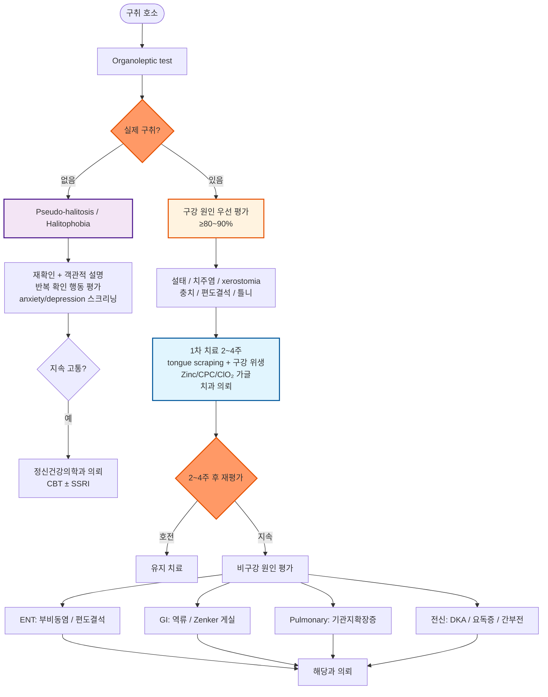

# 구취증 Halitosis, Bad Breath

## <mark style="color:green;">일반 사항</mark>

* 사회적으로 받아들여지는 정도를 넘어선, 일상생활에 지장을 줄 수 있는 구강 악취
* 유병률 : \~30%
* 보통 환자 자신은 악취를 느끼지 못하고, 주위 사람에 의해서 감지됨
  * 이는 후각 적응(olfactory adaptation) 현상으로, 지속적으로 같은 냄새에 노출되면 뇌가 이를 배경 자극으로 처리하여 스스로 감지하지 못하게 됨
* 주된 원인 물질 : 구강 내 혐기성 세균이 단백질을 분해하여 생성하는 휘발성 황 화합물(VSC; volatile sulfur compounds - hydrogen sulfide, methyl mercaptan, dimethyl sulfide 등); dimethyl sulfide는 유제품·초콜릿 섭취 또는 간질환·호흡기 질환에서 특이적으로 증가하는 지표임; VSC 외에도 cadaverine, putrescine(polyamines) 및 단쇄 지방산 등 복합 휘발성 유기 화합물(VOCs)도 기여함
* 구취는 단순 위생 문제를 넘어 구강 내 혐기성 세균의 불균형(oral dysbiosis)이 핵심 기전이며, 설태·치주질환·구강 건조 등이 dysbiosis를 촉진함
* 구강·치과적 원인 배제 후에도 지속되는 경우에는 이비인후과(부비동염, 편도결석), 호흡기(기관지확장증, 폐농양), 소화기(GERD, 위장관 폐쇄) 질환 고려

#### <mark style="color:$primary;">용어</mark>

* Physiologic halitosis : 특정한 병적 원인이 없는 구강 악취
* Pathologic halitosis : 특정한 병적 원인이 있는 구강 악취
* Pseudo-halitosis : 환자 자신만 느끼는, 다른 사람들에게는 느껴지지 않는 구강 악취; 환자를 안심시키는 것이 필요
* Halitophobia : 의사에 의해 구강 악취가 없음을 확인했음에도 불구하고 환자 스스로 구강 악취로 인한 지속되는 고통을 지님; 입 냄새 문제로 진료 받는 사람의 ¼은 실제 구강 악취가 없음; 사회적 위축 및 타인에게 반복적으로 냄새를 확인하는 행동(반복 확인 행동)이 특징; 정신건강의학과적 협진(CBT ± SSRI) 고려
* 설태 (tongue coating; 백태) : 혀 표면 유두 사이(특히 혀 후방 1/3)에 음식물 찌꺼기, 세균, 탈락 상피세포가 쌓여 형성되며, 이 부위의 혐기성 세균이 VSC를 생성하는 주요 원천이 됨; 구강 건조, 흡연, 불충분한 구강 위생이 주요 원인

### <mark style="color:$danger;">🚩 Red Flags!</mark>

<mark style="color:$danger;">**즉각 조치 또는 의뢰**</mark>

* 토혈, 혈변·흑색변 동반 (위장관 출혈 시사)
* 의식 변화, 황달, 급격한 전신 쇠약 (간부전·요독증 시사)

<mark style="color:$warning;">**당일 또는 조기 의뢰**</mark>

* 당뇨병 환자에서 아세톤·과일 냄새 + 구역/구토 (DKA 시사)
* 신부전 환자에서 생선·암모니아 냄새 + 소변량 감소

<mark style="color:$info;">**외래 추적 / 추가 평가 계획**</mark> <mark style="color:$info;">- 즉각 위험 낮으나 호전 없으면 의뢰</mark>

* 치과 치료 및 구강 위생 관리 후에도 2\~4주 이상 지속되는 구취
* 체중 감소, 지속 기침, 연하 곤란 동반 (소화기·호흡기 악성 종양 배제)

## <mark style="color:green;">원인</mark>

#### <mark style="color:$primary;">Physiologic</mark>

* 아침 입 냄새 : 침 분비 감소(예: 입마름, 약물), 구강 호흡(예: 코골이, 코 막힘)
  * 생리적 현상으로 수면 중 침 분비가 줄어 혐기성 세균이 증식하면서 발생; 기상 후 수분 섭취와 식사만으로도 대부분 해소됨
  * 구강 건조 유발 약물 : 항히스타민제, 항우울제(SSRI, TCA), 항불안제(벤조디아제핀), 항고혈압제, 항콜린제
* 음식 : 마늘, 양파, 술, 양배추, 무, 향신료, 숯불구이; 음식 향이 트림 또는 호흡을 통해 배출
* 커피(카페인) : 카페인에 의한 구강 건조 및 구강 내 산성 환경 조성으로 구취 악화 가능
* 입안의 음식 찌꺼기, 설태 : 구강 원인의 핵심 요소; 특히 혀 후방 1/3 부위의 혐기성 세균 biofilm이 VSC 생성의 주요 원천임

#### <mark style="color:$primary;">Pathologic</mark>

* 구강 : 충치, 치은/치주염, 입마름, 침샘 염증, 편도염, 편도결석(편도 은와에 노란 알갱이 형태로 보임; 입을 벌려 구개편도를 직접 확인), 편도 틈새, 틀니/교정기
* 코 : 위축성 비염, 비부비동염, 비용종, 코 이물, 종양
* 호흡기 : 기관지염, 폐렴, 기관지확장증, 폐농양, 결핵, 폐종양
* 위장관 : 소화불량, 위식도 역류(GERD; 역류·트림과 연관될 수 있으나 VSC 직접 생성 원인으로서의 근거는 제한적), 식도게실(특히 Zenker's diverticulum - 고령 환자에서 음식물이 게실에 고여 부패하며 심한 구취와 연하 곤란을 유발; 확진 검사는 식도 조영술(Barium swallow)이 우선이며, 내시경 선행 시 게실 천공 위험이 있어 주의 필요), 식도 저류(예: 이완불능증, 협착), 위암
* 전신 질환 : Vit 결핍, 당뇨병, 알코올 남용, 간/신질환, 요독증, 류마티스 질환, 고열, 탈수

#### <mark style="color:$primary;">Psychologic</mark>

* 신체화 증상, 우울, 기질적 뇌 증후군, 조현병

### <mark style="color:orange;">위험 인자</mark>

* 다이어트 또는 식사 시 씹는 동작을 잘 하지 않음(→ 침 분비 감소 → 구강 위생 악화)
* 아침 식사 거르기 : 저작 운동 부재로 타액 분비가 자극되지 않아 기상 후 설태 세균이 지속 증식함
* 고령, 임신
* 흡연, 입마름 유발 약물(예: 항콜린제, SSRI, 벤조디아제핀)
* 커피 과다 섭취 (구강 건조 및 산성화)

## <mark style="color:green;">진단</mark>

* 병력 : 특히 입 냄새가 나는 상황을 확인
* 주변 의견 : 주변에서 제대로 알려주지 않을 수 있음을 유의
* 전자코(electronic nose/halimeter/OralChroma) : VSC를 정량적으로 측정하는 기기; 진단의 표준은 아니나 치료 전후 비교 등 보조적 정량 평가 도구로 활용 가능

#### <mark style="color:$primary;">Xerostomia 동반 여부 선별 (3문항)</mark>

아래 3가지 중 2가지 이상 해당 시 xerostomia 고기능의심 → 구강 건조가 구취의 주요 원인일 가능성

1. 입이 자주 마르거나 불편한가?
2. 물 없이 음식을 삼키기 어려운가?
3. 밤에 물을 마시러 깨는가?

#### <mark style="color:$primary;">냄새 감별</mark>

* 진찰 3시간 전부터 금식(물 포함), 양치질, 흡연 중지; 일중 변동이 있음을 유의
*   관능 검사 (Organoleptic test) : 구취 진단의 표준. 냄새 원인 부위를 감별

    1. 입으로 숨을 내쉬게 하면서 환자의 5\~10 ㎝ 앞에서 냄새를 맡음
    2. 코로 숨을 내쉬게 하여 냄새를 맡음
    3. 코와 입에서 나는 냄새의 강도 차이를 평가(척도로 기록)

    * 코보다 입에서 현저히 강한 악취 → 구강 원인
    * 입보다 코에서 현저히 강한 악취 (드묾) → 코 원인
    * 코와 입에서 나는 냄새의 강도가 비슷 → 전신 질환

    ※ Organoleptic test 평가 척도 (0\~5단계) : 단계 2 이상을 임상적으로 유의한 구취로 판정; 치료 전후 비교 및 의뢰 기준으로 활용

    <table><thead><tr><th width="80">단계</th><th>기준</th></tr></thead><tbody><tr><td>0</td><td>구취 없음</td></tr><tr><td>1</td><td>의심스러운 구취 (불확실)</td></tr><tr><td>2</td><td>경미한 구취</td></tr><tr><td>3</td><td>중등도 구취</td></tr><tr><td>4</td><td>심한 구취</td></tr><tr><td>5</td><td>매우 심한 구취</td></tr></tbody></table>
* 틀니 냄새 감별 : 틀니를 봉투에 수 분 동안 넣어 놓은 후 냄새를 맡음
* 숟가락 검사 : 혀 냄새 감별을 위하여 고려
  1. 혀를 최대한 길게 밖으로 내밀게 하고 거즈로 환자의 혀끝을 잡고 숨을 멈추게 한 상태에서 숟가락을 혀 후방 1/3 부위(혀 뒤쪽)에 엎어 덮어 scraping함
  2. 수 초 후 꺼내어 숟가락의 냄새를 맡음
  3. 환자에게 숟가락에서 나는 냄새가 평소 느끼는 냄새인지를 확인시킴

#### <mark style="color:$primary;">질환별 냄새 특성</mark>

<table><thead><tr><th width="160">냄새 특성</th><th width="200">시사 질환</th><th>주요 동반 증상</th></tr></thead><tbody><tr><td>썩은 달걀/황 냄새</td><td>VSC (구강 원인)<br>설태, 치주염</td><td>치아 변색, 잇몸 출혈, 설태 육안 확인</td></tr><tr><td>아세톤/과일 냄새</td><td>당뇨병성 케톤산증 (DKA)</td><td>구역/구토, 복통, 빠른 호흡, 고혈당</td></tr><tr><td>생선/암모니아 냄새</td><td>요독증 (신부전)</td><td>소변량 감소, 부종, 피로</td></tr><tr><td>달콤하고 곰팡이 냄새</td><td>간부전 (fetor hepaticus)</td><td>황달, 복수, 의식 변화</td></tr><tr><td>썩은 음식 냄새</td><td>Zenker's diverticulum</td><td>연하 곤란, 음식 역류, 고령 환자</td></tr></tbody></table>

***



<p align="center"><strong>구취증 관리 알고리듬</strong></p>

***

## <mark style="background-color:$warning;">Management</mark>

* 금연
* 원인 치료, 입 냄새 유발 음식 회피
* 채소와 과일 섭취는 늘리고, 고기 섭취는 줄임, 알코올 섭취를 피함
* 당분 음식 회피 : 설탕, 특히 엿, 캐러멜, 초콜릿 등 치아에 오래 머무를 수 있는 음식을 피함
* 구강 위생 관리 : 감염 치료, 혀를 포함한 정확한 칫솔질(1일 ≥2회, 특히 야간에 시행; 칫솔질 시 지나친 마찰을 피함), 치간 칫솔 및 치실 사용, 혀 클리너(tongue scraper)로 백태(설태) 제거(VSC 감소에 효과적), 야간 취침 시 틀니 제거 및 소독
* 입마름 치료 : 충분한 수분 섭취, 무설탕 껌이나 음료 섭취 (☞ [입안마름증](../222_/056_-dry-mouth-xerostomia.md))
* 정기적 치과 진료

#### <mark style="color:$primary;">가글</mark>

장기간 지속 사용 시 약간의 효과가 있으나 약의 성분 및 첨가제에 의한 부작용(치아 착색, 미각 변화, 어지럼)이 증가할 수 있음. 매 칫솔질 후 30초 정도 입안을 헹군 후 뱉음 (삼키지 않도록 주의).

**1차 선택 (장기 사용 가능)**

* 아연(Zinc) 또는 세틸피리디늄(CPC, Cetylpyridinium chloride) 함유 제품 : VSC를 직접 억제; 장기 사용 가능; CPC 함유 제품은 칫솔질 직후 사용 시 치아 착색 가능성이 있어 30분 간격 권장
* 이산화염소(ClO₂, chlorine dioxide) 함유 제품 : VSC 산화 억제 기전; 장기 사용 가능; 국내 시판 제품 다수 유통 중

**단기 사용 (통상 2주 이내)**

* 클로르헥시딘(chlorhexidine) 0.1\~0.2% 함유 제품 <mark style="color:blue;">\[헥사메딘 액]</mark> : 광범위 항균 효과로 급성 치주/구강 감염 동반 구취에 효과적; 장기 사용 시 치아 착색·미각 변화 유발 가능; 필요 시 간헐적 사용으로 전환 (보험기준 ☞ [가글 용제](https://www.hira.or.kr/rc/insu/insuadtcrtr/InsuAdtCrtrPopup.do?mtgHmeDd=20181201\&sno=1\&mtgMtrRegSno=23\&brdScnBltNo=4\&brdBltNo=\&isPopupYn=Y)); 보험 급여는 치은염·구내염·틀니 관련 염증 등에 국한되며, 구취 단독 처방 시에는 비급여 적용 가능성에 유의

**피할 것**

* 알코올(에탄올) 함유 제품 : 구강을 건조하게 하여 장기적으로 구취를 악화시킬 수 있음; 성분표에서 알코올 미포함 제품을 선택할 것
* 단순 입 냄새 제거제(마스킹 제품) : 냄새를 일시적으로 가려주는 효과만 있으며, 알코올 성분 함유 시 입마름 악화

#### <mark style="color:$primary;">권고하지 않는 방법들</mark>

* H. pylori 제균 : 일부 메타분석에서 제균 후 구취 개선이 보고되나 결과의 이질성이 크고 일관성이 부족하여, 구취 단독 목적의 제균은 루틴하게 권고하지 않음. 단, 소화성 궤양 등 별도의 제균 적응증이 동반된 경우 구취 개선에도 부수적으로 도움이 될 수 있음
* 구취 단독으로 내시경 등 소화기 검사를 루틴 시행하는 것은 권고하지 않음; 연하 곤란, 체중 감소, 지속 기침 등 alarm feature가 동반되지 않는 한 과잉 검사를 지양함

***

### <mark style="color:red;">질병코드</mark>

R19.6 구취증

***

## <mark style="color:purple;">처방례</mark>

> **처방례 1.** 구강 원인 구취 - 클로르헥시딘 가글 단기
>
> ```
> 헥사메딘 액 0.1%  200 ㎖/병  1병  bid (아침·저녁 칫솔질 후)
> ※ 30초간 헹군 후 뱉음; 삼키지 않도록 주의
> ※ 급성 치주/구강 감염 동반 시 우선 사용; 통상 1~2주 이내 단기 사용
> ※ 치아 착색·미각 변화 발생 시 중단 또는 간헐적 사용으로 전환
> ※ 2주 이상 지속 사용이 필요한 경우 Zinc/CPC 또는 ClO₂ 제품(OTC)으로 전환 안내
> ```

> **처방례 2.** Xerostomia 동반 구취
>
> ```
> 헥사메딘 액 0.1%  200 ㎖/병  1병  hs (취침 전)
> ※ 구강 건조 동반 시 취침 전 단회 사용으로 취침 중 세균 증식 억제
> ※ 낮에는 무설탕 껌으로 타액 분비 자극
> ※ 구강 건조 원인 약물(항히스타민제, SSRI, 항콜린제 등) 재검토; 필요 시 대체제 고려
> ※ 지속 시 입안마름증 챕터 참고 (☞ 입안마름증)
> ```

***

### <mark style="color:$success;">핵심 복약 지도</mark>

> **혀 클리너(tongue scraper) 사용법**
>
> * 아침 칫솔질 전 혀를 최대한 내밀고, 클리너를 혀 뒤쪽(후방 1/3 부위)에서 앞쪽으로 부드럽게 2\~3회 긁어냅니다
> * 지나치게 강하게 긁으면 혀 표면에 미세 손상이 생길 수 있으므로 가볍게 사용합니다
> * 구취 감소에 가장 효과적인 단일 자가 관리법입니다 — 매일 시행을 권고합니다

> **가글 제품 선택 안내**
>
> * **1차 선택** — 아연(Zinc), CPC(세틸피리디늄), 또는 ClO₂(이산화염소) 함유 무알코올 제품; 장기 사용 가능

* CPC 제품은 칫솔질 직후 사용 시 치아 착색 가능성이 있으며, 치약의 음이온 계면활성제(SLS)와 CPC의 양이온이 결합하여 항균 효과가 상쇄되므로 칫솔질 후 30분 간격 권장

> - **단기 사용** — 클로르헥시딘 <mark style="color:blue;">\[헥사메딘 액]</mark>; 급성 감염 동반 구취에 효과적이나 통상 2주 이내 사용
> - **피할 것** — 알코올(에탄올) 함유 제품; 구강 건조를 악화시켜 장기적으로 구취를 악화시킵니다
> - 가글은 원인 치료(칫솔질, 혀 클리너, 치과 치료)를 대체하지 않으며 보조 수단입니다

> **클로르헥시딘 가글 사용 시 주의사항**
>
> * 통상 2주 이내 단기 사용을 원칙으로 합니다
> * 치아 착색이 생길 수 있으나 스케일링으로 제거 가능합니다
> * 미각 변화(음식 맛이 변하는 느낌)가 일시적으로 발생할 수 있으며 중단 후 회복됩니다
> * 만 6세 미만 소아는 삼킴 위험으로 사용하지 않습니다

> **언제 다시 병원을 방문해야 하나요?**
>
> * 구강 위생 관리를 2\~4주 시행해도 구취가 호전되지 않는 경우 — 치과 또는 이비인후과 추가 평가
> * 달콤한 아세톤 냄새 또는 생선·암모니아 냄새가 나는 경우 — 당뇨·신부전 가능성으로 당일 내원
> * 구취와 함께 삼킴 곤란이 동반되는 경우 — 특히 고령 환자에서 식도 문제 가능성
> * 체중 감소, 지속 기침, 객혈이 동반되는 경우 — 즉시 내원

***

### <mark style="color:blue;">환자 안내서</mark>


**입 냄새의 약 90%는 입 안에서 시작됩니다**

구취의 대부분은 설태(혀의 백태), 치주 질환, 구강 건조에서 비롯됩니다. 원인을 파악하고 꾸준히 관리하면 충분히 개선할 수 있습니다. 부끄러운 것이 아니라 관리가 필요한 건강 문제입니다.


#### <mark style="color:$primary;">왜 입 냄새가 생기나요?</mark>

* 원인의 약 85\~90%는 구강 내 문제입니다 — 설태(혀의 백태), 치주 질환, 충치, 구강 건조증
* 그 외 : 편도 결석, 축농증, 역류성 식도염, 당뇨병(아세톤 냄새), 신부전(암모니아 냄새) 등

#### <mark style="color:$primary;">내 입 냄새를 스스로 확인하는 방법</mark>

* **손목 테스트** : 손목 안쪽을 혀로 핥고 2\~3초 후 말린 다음 냄새를 맡습니다
* **치실 테스트** : 치실 사용 후 치실에서 나는 냄새를 확인합니다
* **혀 scraping 테스트** : 숟가락이나 혀 클리너로 혀 뒤쪽을 가볍게 긁은 후 냄새를 맡습니다
* 단, 후각 적응으로 인해 본인이 느끼지 못하는 냄새도 있을 수 있으므로 주변의 객관적인 의견도 중요합니다

#### <mark style="color:$primary;">생활 속 관리 방법</mark>

* **칫솔질** : 하루 2회 이상, 특히 자기 전 꼼꼼히 닦으십시오. 혀(특히 뒤쪽 설태)도 함께 닦으십시오
* **혀 클리너** : 혀 클리너(tongue scraper)로 설태를 매일 제거하면 구취 감소에 가장 효과적입니다. 혀 뒤쪽에서 앞쪽으로 부드럽게 사용하십시오
* **치간 칫솔·치실** : 치아 사이의 음식 찌꺼기와 세균막 제거에 필수입니다
* **수분 섭취** : 충분한 물 마시기로 구강 건조를 예방하십시오. 구강 건조는 구취를 악화시킵니다
* **커피 섭취 주의** : 커피 후에는 물을 충분히 마시십시오
* **가글** : 아연(Zinc), CPC, 이산화염소(ClO₂) 계열의 무알코올 제품을 사용하십시오. 알코올 함유 제품은 구강 건조를 악화시킵니다
* **정기적 치과 방문** : 6개월마다 검진 및 스케일링을 받으십시오
* **식습관** : 채소·과일을 늘리고 육류·음주는 줄이십시오
* **금연** : 흡연은 구취의 주요 원인이며 잇몸 질환도 악화시킵니다

#### <mark style="color:$primary;">이런 경우 추가 진료가 필요합니다</mark>

* 구강 위생 관리를 열심히 해도 2\~4주 이상 구취가 지속되는 경우
* 달콤한 아세톤 냄새 또는 생선·암모니아 냄새가 나는 경우 — 당뇨·신부전 가능성
* 구취와 함께 심한 인후통, 코막힘, 속쓰림이 동반되는 경우
* 구취와 함께 삼킴 곤란(음식이 걸리는 느낌)이 동반되는 경우 — 특히 고령 환자에서 식도 문제 가능성
* 구취 때문에 사람들을 피하게 되거나 일상생활에 지장이 생기는 경우 — 심리적 영향도 치료가 필요합니다
