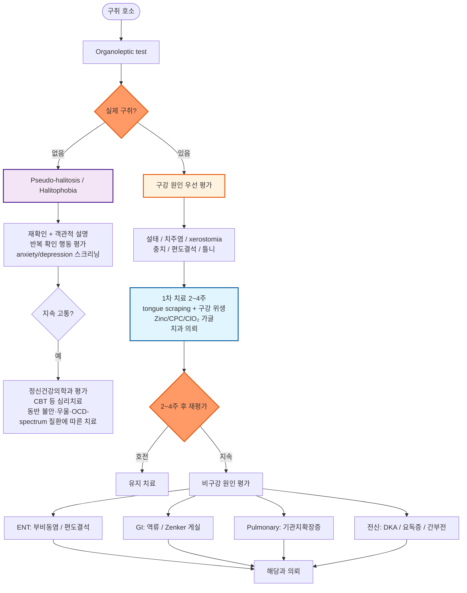

# 구취증 Halitosis, Bad Breath

## <mark style="color:green;">일반 사항</mark>

* 사회적으로 받아들여지는 정도를 넘어선, 일상생활에 지장을 줄 수 있는 구강 악취
* 유병률 : 약 30% (systematic review에서 pooled prevalence 31.8%, 95% CI 24.6\~39.0%; 연구 간 이질성 큼) (Silva et al., Clin Oral Investig 2018)
* 보통 환자 자신은 악취를 느끼지 못하고, 주위 사람에 의해서 감지됨
  * 이는 후각 적응(olfactory adaptation) 현상으로, 지속적으로 같은 냄새에 노출되면 뇌가 이를 배경 자극으로 처리하여 스스로 감지하지 못하게 됨
* 주된 원인 물질 : 구강 내 혐기성 세균이 단백질을 분해하여 생성하는 휘발성 황 화합물(VSC; volatile sulfur compounds - hydrogen sulfide, methyl mercaptan, dimethyl sulfide 등); dimethyl sulfide를 포함한 VSC와 다양한 휘발성 유기화합물(VOCs)이 구취에 관여하며, 일부 extraoral halitosis(예: 간질환)에서는 dimethyl sulfide가 증가할 수 있음; VSC 외에도 cadaverine, putrescine(polyamines) 및 단쇄 지방산 등도 기여함
* 구취의 주요 기전은 혀 후방의 설태 및 치주낭 등에 존재하는 단백질 분해성 혐기성 세균이 VSC 등을 생성하는 것이며, 구강 건조와 구강 위생 불량이 이를 촉진함(구강 내 세균 불균형, oral dysbiosis)
* 구강·치과적 원인 배제 후에도 지속되는 경우에는 이비인후과(부비동염, 편도결석), 호흡기(기관지확장증, 폐농양), 소화기(GERD, 위장관 폐쇄) 질환 고려

#### <mark style="color:$primary;">용어</mark>

* Physiologic halitosis : 특정한 병적 원인이 없는 구강 악취
* Pathologic halitosis : 특정한 병적 원인이 있는 구강 악취
* Pseudo-halitosis : 환자 자신만 느끼는, 다른 사람들에게는 느껴지지 않는 구강 악취; 환자를 안심시키는 것이 필요
* Halitophobia : 객관적 구취가 없음을 확인한 뒤에도 구취에 대한 지속적인 고통과 확신이 남아 사회적 위축이나 반복 확인 행동을 보이는 상태; 구취를 호소하는 환자 중 상당수에서는 객관적 구취가 확인되지 않을 수 있음; 지속적인 고통·기능 저하가 있으면 정신건강의학과 평가를 고려하고, CBT 등 심리치료 및 동반 불안·우울·OCD-spectrum 질환에 따른 치료를 개별화
* 설태 (tongue coating; 백태) : 혀 표면 유두 사이(특히 혀 후방 1/3)에 음식물 찌꺼기, 세균, 탈락 상피세포가 쌓여 형성되며, 이 부위의 혐기성 세균이 VSC를 생성하는 주요 원천이 됨; 구강 건조, 흡연, 불충분한 구강 위생이 주요 원인

### <mark style="color:$danger;">🚩 Red Flags!</mark>

<mark style="color:$danger;">**즉각 조치 또는 의뢰**</mark>

* 당뇨병 환자에서 아세톤·과일 냄새 + 구역/구토, 복통, 빠른 호흡, 의식 변화 등 (DKA 시사)
* 의식 변화가 동반된 황달·간부전 또는 진행된 신부전/요독증

<mark style="color:$warning;">**당일 또는 조기 의뢰**</mark>

* 지속성 구강 궤양·종괴 또는 경부 종괴
* 연하 곤란, 설명되지 않는 체중 감소
* 편측성 혈성 비루 또는 지속성 편측 비강 증상
* 객혈 또는 반복적인 폐렴
* 신부전 환자에서 생선·암모니아 냄새 + 소변량 감소·부종 등 신기능 악화 소견

<mark style="color:$info;">**외래 추적 / 추가 평가 계획**</mark> <mark style="color:$info;">- alarm feature가 없으나 호전 없으면 추가 평가</mark>

* 치과 치료 및 구강 위생 관리 후에도 객관적 구취가 2\~4주 이상 지속되는 경우

## <mark style="color:green;">원인</mark>

#### <mark style="color:$primary;">Physiologic</mark>

* 아침 입 냄새 : 침 분비 감소(예: 입마름, 약물), 구강 호흡(예: 코골이, 코 막힘)
  * 생리적 현상으로 수면 중 침 분비가 줄어 혐기성 세균이 증식하면서 발생; 기상 후 수분 섭취와 식사만으로도 대부분 해소됨
  * 구강 건조 유발 약물 : 항히스타민제, 항우울제(SSRI, TCA), 항불안제(벤조디아제핀), 항고혈압제, 항콜린제
* 음식 : 마늘, 양파, 술, 양배추, 무, 향신료, 숯불구이; 음식 향이 트림 또는 호흡을 통해 배출
* 커피 : 자체 향 및 일부 환자에서의 구강 건조 등으로 일시적으로 구취를 악화시킬 수 있음
* 입안의 음식 찌꺼기, 설태 : 구강 원인의 핵심 요소; 특히 혀 후방 1/3 부위의 혐기성 세균 biofilm이 VSC 생성의 주요 원천임

#### <mark style="color:$primary;">Pathologic</mark>

* 구강 : 충치, 치은/치주염, 입마름, 침샘 염증, 편도염, 편도결석(편도 은와에 노란 알갱이 형태로 보임; 입을 벌려 구개편도를 직접 확인), 편도 틈새, 틀니/교정기
* 코 : 위축성 비염, 비부비동염, 비용종, 코 이물, 종양
* 호흡기 : 기관지염, 폐렴, 기관지확장증, 폐농양, 결핵, 폐종양
* 위장관 : 위식도 역류(GERD; 역류·트림과 연관될 수 있으나 VSC 직접 생성 원인으로서의 근거는 제한적), 식도게실(특히 Zenker's diverticulum - 고령 환자에서 음식물이 게실에 고여 부패하며 심한 구취와 연하 곤란을 유발; 확진 검사는 식도 조영술(Barium swallow)이 우선이며, 내시경 선행 시 게실 천공 위험이 있어 주의 필요), 식도 저류(예: 이완불능증, 협착), 위암(체중 감소·연하곤란·출혈 등 alarm feature 동반 시 고려)
* 전신 질환 : DKA 등 케톤증, 진행된 간부전(fetor hepaticus), 진행된 신부전/요독증(uremic fetor), 심한 탈수·xerostomia를 유발하는 전신질환 등

#### <mark style="color:$primary;">Psychologic</mark>

* 신체화 증상, 우울, 기질적 뇌 증후군, 조현병; halitophobia와의 감별 필요, 정신건강의학과 협진 고려

### <mark style="color:orange;">위험 인자</mark>

* 다이어트 또는 식사 시 씹는 동작을 잘 하지 않음(→ 침 분비 감소 → 구강 위생 악화)
* 아침 식사 거르기 : 저작 운동 부재로 타액 분비가 자극되지 않아 기상 후 설태 세균이 지속 증식함
* 고령, 임신 중 치은염·구강위생 변화
* 흡연, 입마름 유발 약물(예: 항콜린제, SSRI, 벤조디아제핀)
* 커피 과다 섭취 (자체 향 및 일부 환자에서의 구강 건조)

## <mark style="color:green;">진단</mark>

* 병력 : 특히 입 냄새가 나는 상황을 확인
* 주변 의견 : 주변에서 제대로 알려주지 않을 수 있음을 유의
* VSC 측정기(Halimeter, OralChroma 등) : VSC를 정량적으로 측정하는 기기; 진단의 표준은 아니나 치료 전후 비교 등 보조적 정량 평가 도구로 활용 가능 (organoleptic 평가와의 상관성이 항상 높지는 않음)

#### <mark style="color:$primary;">Xerostomia 동반 여부 간이 선별</mark>

다음 증상이 있으면 구강 건조(xerostomia) 가능성을 고려하고 구강 상태, 원인 약물, 필요 시 타액 분비 등을 추가 평가 → 구강 건조가 구취의 주요 원인일 수 있음

1. 입이 자주 마르거나 불편한가?
2. 물 없이 음식을 삼키기 어려운가?
3. 밤에 구강 건조로 물을 마시러 깨는가?

※ 본 3문항은 간이 임상 선별용이며, 특정 개수 이상을 진단 기준으로 사용하지 않음

#### <mark style="color:$primary;">냄새 감별</mark>

* 검사 전 준비 : 검사 전 수 시간 동안 음식·흡연·향이 강한 음식 및 구강세정제 사용을 피하고, 검사 직전 칫솔질·혀 세척은 피함; 물은 제한하지 않음; 검사 전 준비 조건에 따라 구취 강도가 달라질 수 있으므로 가능한 한 동일한 조건에서 평가; 일중 변동이 있음을 유의
*   관능 검사 (Organoleptic test) : 구취 진단의 표준. 냄새 원인 부위를 감별

    1. 코를 막고 입으로만 숨을 내쉬게 하면서 환자의 5\~10 ㎝ 앞에서 냄새를 맡음 (구강 내 원인 평가)
    2. 입을 다물고 코로만 숨을 내쉬게 하여 냄새를 맡음 (비강·부비동 또는 혈액 매개 전신 원인 평가)
    3. 코와 입에서 나는 냄새의 강도 차이를 평가(척도로 기록)

    * 입에서 나는 냄새가 뚜렷하면 구강 원인을 우선 평가
    * 코에서 나는 냄새가 뚜렷하거나 비강 증상이 동반되면 비강·부비동 원인을 평가
    * 구강 및 이비인후과적 원인이 뚜렷하지 않으면 병력과 동반 증상에 따라 전신·소화기·호흡기 원인을 고려 (코·입 냄새 강도 비교만으로 원인을 확정할 수는 없음)

    ※ Organoleptic test 평가 척도 (0\~5단계) : 단계 2 이상은 객관적 구취가 있는 것으로 판정하는 데 흔히 사용됨; 치료 전후 비교 및 의뢰 기준으로 활용

    <table><thead><tr><th width="80">단계</th><th>기준</th></tr></thead><tbody><tr><td>0</td><td>구취 없음</td></tr><tr><td>1</td><td>의심스러운 구취 (불확실)</td></tr><tr><td>2</td><td>경미한 구취</td></tr><tr><td>3</td><td>중등도 구취</td></tr><tr><td>4</td><td>심한 구취</td></tr><tr><td>5</td><td>매우 심한 구취</td></tr></tbody></table>
* 틀니 냄새 감별 : 틀니를 봉투에 수 분 동안 넣어 놓은 후 냄새를 맡음
* 숟가락 검사 : 혀 냄새 감별을 위하여 고려
  1. 혀를 최대한 길게 밖으로 내밀게 하고 거즈로 환자의 혀끝을 잡고 숨을 멈추게 한 상태에서 숟가락을 혀 후방 1/3 부위(혀 뒤쪽)에 엎어 덮어 scraping함
  2. 수 초 후 꺼내어 숟가락의 냄새를 맡음
  3. 환자에게 숟가락에서 나는 냄새가 평소 느끼는 냄새인지를 확인시킴

#### <mark style="color:$primary;">질환별 냄새 특성</mark>

※ 냄새의 특성은 진단적 특이도가 낮으므로 단독으로 질환을 진단하지 않으며, 병력·동반 증상·검사 결과와 함께 해석

<table><thead><tr><th width="160">냄새 특성</th><th width="200">시사 질환</th><th>주요 동반 증상</th></tr></thead><tbody><tr><td>썩은 달걀/황 냄새</td><td>VSC (구강 원인)<br>설태, 치주염</td><td>치아 변색, 잇몸 출혈, 설태 육안 확인</td></tr><tr><td>아세톤/과일 냄새</td><td>당뇨병성 케톤산증 (DKA)</td><td>구역/구토, 복통, 빠른 호흡, 고혈당</td></tr><tr><td>생선/암모니아 냄새</td><td>요독증 (신부전)<br>신기능 정상 시 트리메틸아민뇨증(Trimethylaminuria, Fish Odor Syndrome) 감별</td><td>소변량 감소, 부종, 피로</td></tr><tr><td>달콤하고 곰팡이 냄새</td><td>간부전 (fetor hepaticus)</td><td>황달, 복수, 의식 변화</td></tr><tr><td>썩은 음식 냄새</td><td>Zenker's diverticulum</td><td>연하 곤란, 음식 역류, 고령 환자</td></tr><tr><td>악취성 고름/가래 냄새</td><td>기관지확장증, 폐농양</td><td>만성 기침, 다량의 화농성 가래, 발열</td></tr></tbody></table>

***


```mermaid
graph TD
    A([구취 호소]) --> B[Organoleptic test]
    B --> C{실제 구취?}
    C -->|없음| D[Pseudo-halitosis / Halitophobia]
    D --> E[재확인 + 객관적 설명 <br/>반복 확인 행동 평가<br/>anxiety/depression 스크리닝]
    E --> F{지속 고통?}
    F -->|예| G[정신건강의학과 평가<br/>CBT 등 심리치료<br/>동반 불안·우울·OCD-spectrum 질환에 따른 치료]
    C -->|있음| H[구강 원인 우선 평가]
    H --> I[설태 / 치주염 / xerostomia<br/>충치 / 편도결석 / 틀니]
    I --> J[1차 치료 2~4주<br/>tongue scraping + 구강 위생<br/>Zinc/CPC/ClO₂ 가글<br/>치과 의뢰]
    J --> K{2~4주 후 재평가}
    K -->|호전| L[유지 치료]
    K -->|지속| M[비구강 원인 평가]
    M --> N[ENT: 부비동염 / 편도결석]
    M --> O[GI: 역류 / Zenker 게실]
    M --> P[Pulmonary: 기관지확장증]
    M --> Q[전신: DKA / 요독증 / 간부전]
    N --> R[해당과 의뢰]
    O --> R
    P --> R
    Q --> R

    style C fill:#f96,stroke:#e65100,stroke-width:2px
    style K fill:#f96,stroke:#e65100,stroke-width:2px
    style J fill:#e1f5fe,stroke:#01579b,stroke-width:2px
    style D fill:#f3e5f5,stroke:#4a148c,stroke-width:2px
    style H fill:#fff3e0,stroke:#e65100,stroke-width:2px
```

<p align="center"><strong>구취증 관리 알고리듬</strong></p>

<p align="center"><em><mark style="color:$info;">Ref. Silva MF, et al. Clin Oral Investig. 2018;22:47-55; 저자 정리</mark></em></p>

***

## <mark style="background-color:$warning;">Management</mark>

* 금연
* 원인 치료, 입 냄새 유발 음식 회피
* 균형 잡힌 식사, 규칙적인 식사(장시간 금식 피하기), 충분한 수분 섭취; 알코올 섭취를 피함
* 당분 음식 회피 : 설탕, 특히 엿, 캐러멜, 초콜릿 등 치아에 오래 머무를 수 있는 음식을 피함
* 구강 위생 관리 : 감염 치료, 혀를 포함한 정확한 칫솔질(1일 ≥2회, 특히 야간에 시행; 칫솔질 시 지나친 마찰을 피함), 치간 칫솔 및 치실 사용, 설태가 많은 경우 혀 클리너(tongue scraper)로 부드럽게 백태(설태)를 제거하면 구취 감소에 도움이 될 수 있음, 야간 취침 시 틀니 제거 및 소독
* 입마름 치료 : 충분한 수분 섭취, 무설탕 껌이나 음료 섭취 (☞ [입안마름증](056_-dry-mouth-xerostomia.md))
* 정기적인 치과 검진 및 필요 시 치석 제거·치주 치료 (주기는 개인의 치주질환 위험도에 따라 다름)

#### <mark style="color:$primary;">가글</mark>

구강세정제는 원인 치료를 대체하지 않는 보조요법이며, 성분에 따라 치아 착색·미각 변화·구강 자극 등이 발생할 수 있음. 제품별 용법에 따라 일정 시간 입안을 헹군 후 뱉고 삼키지 않도록 주의.

**보조요법**

* 아연(Zinc), 세틸피리디늄(CPC, Cetylpyridinium chloride), 이산화염소(ClO₂, chlorine dioxide) 등을 함유한 구강세정제는 VSC 및 구취를 단기간 감소시킬 수 있음; 다만 Cochrane review에서는 관련 개입들의 근거 수준이 낮음\~매우 낮음(low\~very-low certainty)이었고 특정 제품·농도의 우월성은 확정하기 어려웠음; 임상적으로는 어디까지나 보조적 수단에 국한되며, 기본적인 구강위생·설태 제거·치주질환 치료를 대체하지 않으며 제품 허가사항에 따라 사용
* CPC 함유 제품은 일부 치약 성분과 함께 사용할 때 효과에 영향을 받을 수 있으므로 제품 사용법에 따름

**단기 사용 (헥사메딘 액 국내 허가사항상 통상 10일 이내)**

* 클로르헥시딘(chlorhexidine) 0.1\~0.2% 함유 제품 <mark style="color:blue;">\[헥사메딘 액]</mark> : 광범위 항균 효과로 급성 치주/구강 감염 동반 구취에 보조적으로 사용할 수 있음; 장기 사용 시 치아 착색·미각 변화 유발 가능; 헥사메딘 액 국내 허가사항상 치료는 보통 10일을 넘지 않음 (보험기준 ☞ [가글 용제](https://www.hira.or.kr/rc/insu/insuadtcrtr/InsuAdtCrtrPopup.do?mtgHmeDd=20181201\&sno=1\&mtgMtrRegSno=23\&brdScnBltNo=4\&brdBltNo=\&isPopupYn=Y)); 보험 급여는 치은염·구내염·틀니 관련 염증 등에 국한되며, 구취 단독 처방 시에는 비급여 적용 가능성에 유의

**구강 건조가 있는 환자에서 피하거나 무알코올 제품을 우선 고려**

* 알코올(에탄올) 함유 제품 : 일부 환자에서 자극감·건조감을 악화시킬 수 있으므로 xerostomia가 있으면 무알코올 제품을 우선 선택
* 단순 입 냄새 제거제(마스킹 제품) : 냄새를 일시적으로 가려주는 효과만 있으며, 알코올 성분 함유 시 입마름 악화

#### <mark style="color:$primary;">권고하지 않는 방법들</mark>

* H. pylori 제균 : 일부 메타분석에서 제균 후 구취 개선이 보고되나 결과의 이질성이 크고 일관성이 부족하여, 구취 단독 목적의 제균은 루틴하게 권고하지 않음. 단, 소화성 궤양 등 별도의 제균 적응증이 동반된 경우 구취 개선에도 부수적으로 도움이 될 수 있음
* 구취 단독으로 내시경 등 소화기 검사를 루틴 시행하는 것은 권고하지 않음; 연하 곤란, 체중 감소, 지속 기침 등 alarm feature가 동반되지 않는 한 과잉 검사를 지양함

#### <mark style="color:$primary;">Pseudo-halitosis / Halitophobia 상담</mark>

* Organoleptic test 등 객관적 평가에서 구취가 확인되지 않으면, 이를 환자에게 명확히 설명하고 불필요한 반복 검사·가글 사용을 줄이도록 안내
* 반복적인 냄새 확인 행동, 사회적 위축, 대인관계·업무 지장 여부를 함께 평가
* 지속적인 고통이나 기능 저하가 있으면 정신건강의학과 평가를 고려; CBT 등 심리치료 및 동반 불안·우울·OCD-spectrum 질환에 따른 치료를 개별화

***

### <mark style="color:red;">질병코드</mark>

R19.6 구취증

***

## <mark style="color:purple;">처방례</mark>

> **처방례 1.** 치은염/치주염 동반 구취 - 클로르헥시딘 가글 단기
>
> ```
> 헥사메딘 액 0.1%  200 ㎖/병  1병  bid (아침·저녁 칫솔질 후)
> ※ 30초간 헹군 후 뱉음; 삼키지 않도록 주의
> ※ 급성 치주/구강 감염 동반 시 보조적으로 사용; 국내 헥사메딘 액 허가사항상 치료는 보통 10일을 넘지 않음
> ※ 치아 착색·미각 변화 발생 시 중단하고 원인을 재평가
> ※ 10일 후에도 구취가 지속되면 장기간 클로르헥시딘을 계속하기보다 설태·치주질환·구강 건조 등 원인을 재평가하고, 필요 시 Zinc/CPC 또는 ClO₂ 함유 제품을 보조요법으로 고려
> ```

> **처방례 2.** Xerostomia 동반 구취
>
> ```
> 무설탕 껌 또는 자일리톨 제품  타액 분비 자극용  1일 수회 씹기
> 인공타액(saliva substitute)  구강 건조 시 수시로 사용
> 불소 함유 치약  충치 예방용  칫솔질 시 사용
> ```
>
> ※ 구강 건조 원인 약물(항히스타민제, SSRI, 항콜린제 등) 재검토; 필요 시 대체제 고려
> ※ 충분한 수분 섭취; 구강 건조가 있으면 알코올 함유 가글보다 무알코올 제품을 우선 고려
> ※ 클로르헥시딘의 장기 사용(치아 착색·미각 변화)에 유의
> ※ 증상 지속 시 치과적 평가 및 입안마름증 챕터 참고 (☞ [입안마름증](056_-dry-mouth-xerostomia.md))

***

### <mark style="color:$success;">핵심 복약 지도</mark>

> **혀 클리너(tongue scraper) 사용법**
>
> * 아침 칫솔질 전 혀를 최대한 내밀고, 클리너를 혀 뒤쪽(후방 1/3 부위)에서 앞쪽으로 부드럽게 2\~3회 긁어냅니다
> * 지나치게 강하게 긁으면 혀 표면에 미세 손상이 생길 수 있으므로 가볍게 사용합니다
> * 설태가 있는 구취에서 도움이 될 수 있는 대표적인 자가관리 방법입니다. 혀에 손상을 주지 않도록 부드럽게 사용합니다

> **가글 제품 선택 안내**
>
> * **보조요법** - 아연(Zinc), CPC(세틸피리디늄), 또는 ClO₂(이산화염소) 함유 무알코올 제품; 기본적인 구강위생·설태 제거를 대체하지 않음
> * CPC 함유 제품은 일부 치약 성분과 함께 사용할 때 효과에 영향을 받을 수 있으므로 제품 사용법에 따릅니다
> * **단기 사용** - 치은염·치주염 등 명확한 구강 염증이 동반된 경우 클로르헥시딘 <mark style="color:blue;">\[헥사메딘 액]</mark>을 보조적으로 사용; 국내 허가사항상 치료는 보통 10일을 넘지 않습니다
> * **구강 건조가 있는 경우** - 알코올(에탄올) 함유 제품은 자극감·건조감을 악화시킬 수 있으므로 무알코올 제품을 우선 고려합니다
> * 가글은 원인 치료(칫솔질, 혀 클리너, 치과 치료)를 대체하지 않으며 보조 수단입니다

> **클로르헥시딘 가글 사용 시 주의사항**
>
> * 국내 헥사메딘 액 허가사항상 치료는 보통 10일을 넘지 않습니다
> * 치아 착색이 생길 수 있으나 스케일링으로 제거 가능합니다
> * 미각 변화(음식 맛이 변하는 느낌)가 일시적으로 발생할 수 있으며 중단 후 회복됩니다
> * 18세 미만에서는 국내 허가사항상 유효성·안전성이 확립되어 있지 않습니다. 특히 가글액을 삼킬 가능성이 있는 소아에서는 사용하지 않습니다
> * 치약과 동시에 사용하면 효과가 감소할 수 있으므로 서로 다른 시간대에 사용하거나, 양치 후 충분히 헹군 뒤 일정 간격을 두어 사용합니다

> **언제 다시 병원을 방문해야 하나요?**
>
> * 구강 위생 관리를 2\~4주 시행해도 구취가 호전되지 않는 경우 - 치과 또는 이비인후과 추가 평가
> * 달콤한 아세톤 냄새와 함께 구역·구토, 복통, 빠른 호흡, 의식 변화가 있거나, 생선·암모니아 냄새와 함께 소변량 감소·부종이 있는 경우 - 당일 또는 즉시 평가
> * 구취와 함께 삼킴 곤란이 동반되는 경우 - 조기 진료가 필요하며, 특히 고령 환자에서는 식도 문제를 평가
> * 설명되지 않는 체중 감소, 지속적인 객혈, 구강·경부 종괴, 편측 혈성 비루가 동반되는 경우 - 조기 진료

***

### <mark style="color:blue;">환자 안내서</mark>


**입 냄새의 대부분은 입 안에서 시작됩니다**

구취의 대부분은 설태(혀의 백태), 치주 질환, 구강 건조에서 비롯됩니다. 원인을 파악하고 꾸준히 관리하면 충분히 개선할 수 있습니다. 부끄러운 것이 아니라 관리가 필요한 건강 문제입니다.


#### <mark style="color:$primary;">왜 입 냄새가 생기나요?</mark>

* 원인의 대부분은 구강 내 문제입니다 - 설태(혀의 백태), 치주 질환, 충치, 구강 건조증
* 그 외 : 편도 결석, 축농증, 당뇨병(아세톤 냄새), 신부전(암모니아 냄새) 등; 역류성 식도염은 직접적인 원인이라기보다는 일부 환자에서 관련될 수 있습니다

#### <mark style="color:$primary;">내 입 냄새를 스스로 확인하는 방법</mark>

* **치실 테스트** : 치실 사용 후 치실에서 나는 냄새를 확인합니다
* **혀 scraping 테스트** : 숟가락이나 혀 클리너로 혀 뒤쪽을 가볍게 긁은 후 냄새를 맡습니다
* 단, 후각 적응으로 인해 본인이 느끼지 못하는 냄새도 있을 수 있으므로 주변의 객관적인 의견도 중요합니다
* 스스로 손목이나 손을 핥아 냄새를 반복적으로 확인하는 방법은 객관적인 구취 평가에 적합하지 않으며, 지나치게 반복하면 오히려 불안을 키울 수 있습니다
* 병원에서 냄새를 평가받기 전에는 강한 향의 음식, 가글, 칫솔질을 피해야 객관적인 평가가 가능합니다

#### <mark style="color:$primary;">생활 속 관리 방법</mark>

* **칫솔질** : 하루 2회 이상, 특히 자기 전 꼼꼼히 닦으십시오. 혀(특히 뒤쪽 설태)도 함께 닦으십시오
* **혀 클리너** : 설태가 많은 경우 혀 클리너(tongue scraper)로 부드럽게 제거하면 구취 감소에 도움이 될 수 있습니다. 혀 뒤쪽에서 앞쪽으로 가볍게 사용하십시오
* **치간 칫솔·치실** : 치아 사이의 음식 찌꺼기와 세균막 제거에 필수입니다
* **수분 섭취** : 충분한 물 마시기로 구강 건조를 예방하십시오. 구강 건조는 구취를 악화시킵니다
* **커피 섭취 주의** : 커피 후에는 물을 충분히 마시십시오
* **가글** : 아연(Zinc), CPC, 이산화염소(ClO₂) 계열 제품은 보조적으로 사용할 수 있습니다. 구강 건조가 있다면 알코올 함유 제품보다 무알코올 제품을 우선 선택하십시오
* **정기적 치과 방문** : 정기적으로 검진을 받고 필요 시 스케일링·치주 치료를 받으십시오 (주기는 치과에서 개인 상태에 맞게 안내)
* **식습관** : 균형 잡힌 식사를 하고, 장시간 공복을 피하며, 지나친 음주는 삼가십시오
* **금연** : 흡연은 구취의 주요 원인이며 잇몸 질환도 악화시킵니다

#### <mark style="color:$primary;">이런 경우 추가 진료가 필요합니다</mark>

* 구강 위생 관리를 열심히 해도 2\~4주 이상 구취가 지속되는 경우
* 달콤한 아세톤 냄새와 함께 구역·구토, 복통, 빠른 호흡 등이 있거나, 생선·암모니아 냄새와 함께 소변량 감소·부종이 있는 경우 - 당뇨병성 케톤산증 또는 신기능 악화 가능성
* 구취와 함께 심한 인후통, 코막힘, 속쓰림이 동반되는 경우
* 구취와 함께 삼킴 곤란(음식이 걸리는 느낌)이 동반되는 경우 - 특히 고령 환자에서 식도 문제 가능성
* 구취 때문에 사람들을 피하게 되거나 일상생활에 지장이 생기는 경우 - 이는 치료 가능한 심리적 문제이므로 전문가 상담이 필요합니다
