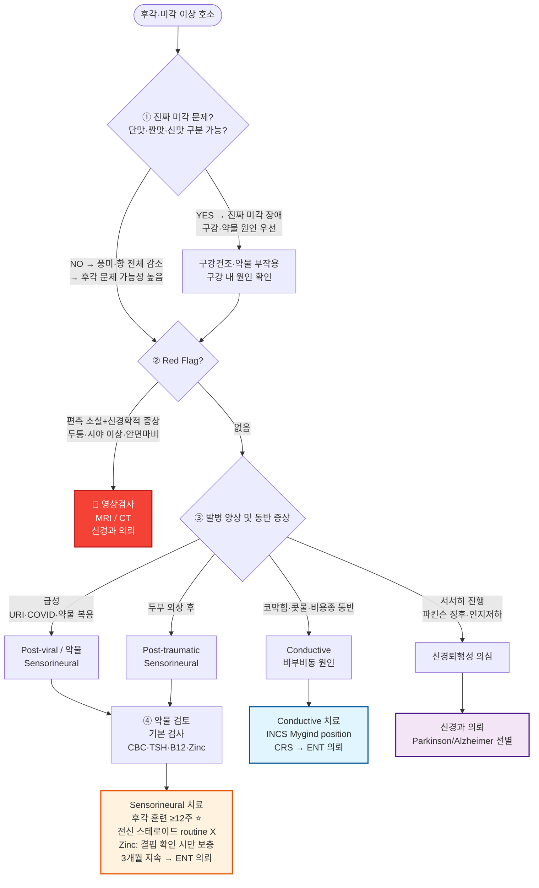

# 후각, 미각 이상 Smell, Taste Disorders

## <mark style="color:green;">일반 사항</mark>

* 후각 및 미각은 소화액 분비를 촉진하므로 이 기능의 장애는 소화 장애, 식욕 감퇴, 체중 감소, 영양실조, 삶의 질 저하 및 사망률 증가와 연관됨
* 점차적인 후각 및 미각 저하는 고령에서 흔한 현상임
  * 후각 장애 : ≥40세의 약 23%, ≥80세의 약 39%에서 보고됨
  * 미각 장애 : ≥40세의 19%, ≥80세의 27%에서 보고됨
* 후각 저하가 미각 저하보다 흔하며, 상당수의 경우 환자가 "맛을 못 느낀다"고 호소할 때 실제로는 코 뒤로 넘어가는 향(Retronasal olfaction)의 문제임 - 이는 엄밀히 '미각(Taste)'이 아닌 '풍미(Flavor)'의 소실이며, 코 문제 해결 후 미각 회복까지는 시간이 필요함
* 후각 상실은 알츠하이머병·파킨슨병 등 뇌 퇴행성 질환의 조기 증상일 수 있음
* 후각 장애의 자연 회복률은 **원인에 따라 크게 다름**
  * Post-viral (바이러스 감염 후) : 약 60\~80%에서 부분 이상 회복
  * Post-traumatic (두부 외상 후) : 약 10\~30%로 회복률 낮음
  * Idiopathic (특발성) : 다양하며 예측 어려움
  * 공통 : 고령·흡연·남성에서 회복이 덜함
* 미각 관련 신경은 뇌신경 7·9·10번의 여러 경로로 분산되어 있으므로 완전한 미각 소실은 드묾
* 후각 장애의 임상적 분류 (치료 방향 결정에 핵심)
  * **Conductive (전도성)** : 비용종, 비중격 만곡, 비염 등 기류(Airflow) 장애가 원인 - 비강 치료에 반응 가능
  * **Sensorineural (신경감각성)** : 바이러스 감염, 두부 외상, 신경퇴행성 질환 등 - 후각 훈련 중심 치료

## <mark style="color:green;">원인 및 관련 인자</mark>

#### <mark style="color:$primary;">후각 장애 — Conductive (전도성)</mark>

* 알레르기 비염, 만성 비부비동염(CRS), 비용종
* 비중격 만곡증, 비갑개 비대
* 상기도 감염(URI)으로 인한 일시적 점막 부종

#### <mark style="color:$primary;">후각 장애 — Sensorineural (신경감각성)</mark>

* 바이러스 감염 후(Post-viral) : COVID-19, 인플루엔자, rhinovirus 등 URI 이후
  * COVID-19 후 후각 장애 : 초기에는 후각 상피의 지지세포(Sustentacular cells) 손상이 주요 기전으로 제시되었으나, 최근 연구에서는 후각 신경구(Olfactory bulb) 수준의 신경염증 및 중추 신경 회로 변화도 관여하는 것으로 이해됨 → 비강 국소 치료보다 후각 훈련이 1차적 접근으로 권고됨
* 두부 외상(Post-traumatic) : 사골판 손상, 후각 신경(CN I) 절단
* 신경퇴행성 질환 : 알츠하이머병, 파킨슨병 (조기 전구 증상으로 나타남)
* 두경부 방사선 치료, 독소 노출, SLE, 벨마비(Bell's palsy)
* 혈액 투석, 신부전
* 흡연

#### <mark style="color:$primary;">미각 장애</mark>

* 구강 장치(틀니 등), 치은염, 구강 칸디다증
* 입마름(Xerostomia) : 침 분비 감소 → 미뢰(Taste bud) 기능 저하
* 구강 작열감 증후군(Burning mouth syndrome)

#### <mark style="color:$primary;">공통 원인</mark>

* 영양 : 영양실조, Vit 결핍, 간질환, 악성 빈혈
  * 아연(Zinc) 결핍 : 미각 이상의 중요한 교정 가능 원인; 만성 질환(간경화, 신부전, 염증성 장질환), 흡수 불량, 채식 위주 식단, 이뇨제·ACE 억제제 장기 복용 시 주의; 혈청 아연 측정 후 결핍 확인 시 보충 권고 (원소 아연 기준 25\~40 ㎎/일; 고용량 장기 복용 시 구리 결핍 주의 → 하단 참조)
* 내분비 : 갑상선 기능 저하증, 당뇨병, 신질환
* 독소 노출, 편두통, Sjögren syndrome
* 신경계 질환 : 다발경화증, 알츠하이머병, 파킨슨병, 뇌신경 손상(뇌혈관 질환, 두부 외상)
* 감염 : URI, 구강 질환, 칸디다증, coxsackievirus, COVID-19

#### <mark style="color:$primary;">후각 왜곡 증상 — Parosmia / Phantosmia</mark>

* **이취증(Parosmia)** : 실제 냄새가 다른 냄새(주로 불쾌한 냄새)로 왜곡되어 인식되는 증상; 바이러스 감염 후(특히 COVID-19) 회복 과정에서 흔히 발생
  * **기전** : 후각 신경의 재생(Regeneration) 과정에서 수용체와 후각구(Olfactory bulb) 사이의 연결이 잘못 재연결(Miswiring)되어 발생하는 것으로 이해됨; 따라서 신경 재생이 진행 중이라는 징후이며, 완전한 후각 소실보다 회복 예후가 나은 경우도 있음
  * 대표 증상 : "커피에서 타는 고무 냄새", "음식에서 하수구·썩은 냄새" 등 특정 냄새 유발 물질에 의해 유발됨; 증상이 불쾌하여 식욕 저하·체중 감소로 이어질 수 있음
  * 환자 설명 시 : "냄새 신경이 다시 자라면서 일시적으로 신호 혼선이 생기는 과정"임을 설명하면 불안감 완화에 도움
* **환각취(Phantosmia)** : 아무런 냄새 자극이 없는 상황에서 냄새를 느끼는 증상
  * 감별 중요 : 측두엽 간질(Temporal lobe epilepsy, 발작 전조 증상으로 발생), 두개내 종양 - 특히 **후각구 수막종(Olfactory groove meningioma)**, 전두엽·측두엽 종양, 파킨슨병, 정신질환(조현병, 우울증)
  * 새로 발생한 Phantosmia는 반드시 영상 검사(MRI) 고려 → Red Flags 참조

#### <mark style="color:$primary;">약물 원인</mark>

1. **항생제 및 항균제**

<table data-header-hidden><thead><tr><th width="159"></th><th width="257"></th><th></th></tr></thead><tbody><tr><td>세부 분류</td><td>약물 명칭</td><td>특징 및 비고</td></tr><tr><td>마크롤라이드계</td><td>Clarithromycin, Azithromycin</td><td>쓴맛 또는 금속성 맛 유발이 흔함</td></tr><tr><td>퀴놀론계</td><td>Ciprofloxacin, Ofloxacin</td><td>미각 변화 보고</td></tr><tr><td>테트라사이클린계</td><td>Doxycycline, Tetracycline</td><td>설태 침착 및 미각 이상, Black hairy tongue 가능성</td></tr><tr><td>기타 항균제</td><td>Metronidazole</td><td>금속성 맛의 대표적 원인 약물; Black hairy tongue 보고가 있음</td></tr><tr><td>아미노글리코사이드</td><td>Amikacin</td><td>가역적 후각 소실(일과성 무후각증) 보고</td></tr><tr><td>페니실린</td><td>Ampicillin</td><td>일시적 후각 저하 보고</td></tr><tr><td>β-lactam 억제제</td><td>Amoxicillin-clavulanate 등</td><td>Black hairy tongue 유발 보고</td></tr><tr><td>항진균제</td><td>Terbinafine</td><td>드물게 장기적인 미각 상실 유발 가능; 복용 중단 후에도 수개월간 지속될 수 있으므로 처방 전 환자에게 고지 필요</td></tr><tr><td>구강 세정제</td><td>Chlorhexidine</td><td>장기 사용 시 치아 착색 및 미각 저하</td></tr></tbody></table>

2\. **항고혈압제 및 심혈관계 약물** : 가장 흔하게 미각 이상을 일으키는 범주로, 특히 아연(Zinc) 대사에 영향을 주는 경우가 많음

<table data-header-hidden><thead><tr><th width="159"></th><th width="257"></th><th></th></tr></thead><tbody><tr><td>세부 분류</td><td>약물 명칭</td><td>특징 및 비고</td></tr><tr><td>ACE 억제제</td><td>Captopril, Enalapril</td><td>미각상실증(Ageusia)·미각 왜곡의 대표적 원인 계열; captopril이 가장 잘 알려짐; 아연 킬레이션 기전</td></tr><tr><td>ARB</td><td>Losartan</td><td>미각 이상 보고; ACE 억제제에 비해 빈도 낮으나 주의</td></tr><tr><td>칼슘채널차단제</td><td>Diltiazem, Nifedipine</td><td>구강 건조 및 잇몸 증식 동반 가능</td></tr><tr><td>이뇨제</td><td>Hydrochlorothiazide, Spironolactone, Amiloride, Acetazolamide</td><td>아연 배설 촉진으로 인한 미각 저하</td></tr><tr><td>베타차단제</td><td>Propranolol</td><td>미각 저하 및 구강 건조 보고</td></tr></tbody></table>

3\. **신경정신과 약물** (항우울제/항경련제/기타)

<table data-header-hidden><thead><tr><th width="159"></th><th width="257"></th><th></th></tr></thead><tbody><tr><td>세부 분류</td><td>약물 명칭</td><td>특징 및 비고</td></tr><tr><td>SSRI</td><td>Paroxetine (기타 SSRI 포함)</td><td>미각 이상, 구강 건조 보고; paroxetine에서 상대적으로 흔하게 보고됨</td></tr><tr><td>삼환계 항우울제</td><td>Amitriptyline, Nortriptyline, Doxepin, Imipramine</td><td>강력한 항콜린 작용으로 구강 건조 유발</td></tr><tr><td>항경련제</td><td>Carbamazepine</td><td>쓴 맛의 환각미각(Bitter phantogeusia) 보고; 드물게 미각 소실 가능</td></tr><tr><td></td><td>Phenytoin</td><td>미각 저하(Hypogeusia) 또는 미각 소실 보고; 특히 정맥 투여 시</td></tr><tr><td>조울증 치료제</td><td>Lithium</td><td>금속성 맛 유발 가능</td></tr></tbody></table>

4\. **기타 약물** (내분비/항암제/파킨슨)

<table data-header-hidden><thead><tr><th width="159"></th><th width="257"></th><th></th></tr></thead><tbody><tr><td>세부 분류</td><td>약물 명칭</td><td>특징 및 비고</td></tr><tr><td>항이상지질혈증</td><td>Statin (Atorvastatin 등)</td><td>미각 이상 보고; 일부에서 금속성 환각 미각</td></tr><tr><td>항갑상선제</td><td>Methimazole, Propylthiouracil</td><td>미각 및 후각 기능 저하 보고</td></tr><tr><td>항파킨슨병제</td><td>Levodopa, Carbidopa</td><td>파킨슨병 자체가 후각 저하를 유발하므로 질환과 약물 효과를 구분하기 어려움</td></tr><tr><td>항암제</td><td>Platinum 계열 (Cisplatin, Oxaliplatin), 기타 세포독성 항암제</td><td>미뢰 세포 손상으로 인한 심한 미각 왜곡; platinum 계열에서 특히 빈도 높음</td></tr><tr><td>항당뇨병제</td><td>Metformin</td><td>금속성 맛 유발; 비교적 흔함</td></tr><tr><td>항류마티스제</td><td>Penicillamine</td><td>아연 길항 작용으로 미각 소실 잘 알려짐</td></tr></tbody></table>

※ 대표적인 금속성 맛(Metallic taste) : metronidazole, clarithromycin, metformin, lithium - 해당 약물 복용 중 금속 맛 호소 시 우선 확인

## <mark style="color:green;">임상 양상</mark>

* **후각 저하(Hyposmia)** / **후각 소실(Anosmia)** : 냄새 감지 능력 부분 또는 완전 소실
* **이취증(Parosmia)** : 실제 냄새가 왜곡(주로 불쾌한 냄새)되어 인식됨 - COVID-19 이후 빈도 증가
* **환각취(Phantosmia)** : 자극 없이 냄새를 느끼는 증상 - 두개내 병변 감별 필요
* **미각 저하(Hypogeusia)** / **미각 소실(Ageusia)** : 기본 맛(단·짠·신·쓴·감칠맛) 감지 저하
* **미각 왜곡(Dysgeusia)** : 금속성 맛, 쓴맛 등 비정상적 미각 인식 (약물 부작용으로 흔함)
* 공통 영향 : 식욕 감소, 체중 감소, 영양 불량, 우울감, 대인관계 어려움

### <mark style="color:$danger;">🚩 Red Flags!</mark>

<mark style="color:$danger;">**즉각 조치 또는 의뢰**</mark> <mark style="color:$danger;">- 두개내 병변 또는 뇌신경 병변 시사</mark>

* 갑작스러운 편측 후각 완전 소실 + 두통, 시야 이상, 국소 신경학적 증상 (뇌종양·뇌졸중 시사)
* 미각 이상 + 안면 편측 마비·감각 저하 (뇌신경 병변 시사)

<mark style="color:$warning;">**당일 또는 조기 의뢰**</mark>

* 두부 외상 후 발생한 후각 소실
* 후각 소실 + 파킨슨 징후(서동, 경직) 또는 인지 저하 동반 (퇴행성 신경질환 조기 증상 가능)
* 새로 발생한 Phantosmia - **후각구 수막종(Olfactory groove meningioma)** 등 두개내 종양, 측두엽 간질 감별 필요 → MRI 권고

<mark style="color:$info;">**외래 추적 / 추가 평가 계획**</mark> <mark style="color:$info;">- 즉각 위험 낮으나 호전 없으면 의뢰</mark>

* 비부비동 치료 후에도 4주 이상 지속되는 후각 장애
* 후각·미각 소실 + 설명되지 않는 체중 감소

## <mark style="color:green;">진단</mark>

### <mark style="color:orange;">후각 장애 분류 — Conductive vs Sensorineural</mark>


**후각 장애를 Conductive(전도성)과 Sensorineural(신경감각성)으로 구분하면 치료 방향이 결정됩니다**


<table><thead><tr><th width="140">구분</th><th width="210">주요 원인</th><th width="190">임상 특징</th><th>치료 방향</th></tr></thead><tbody><tr><td>Conductive (전도성)</td><td>비용종, 만성 비부비동염(CRS), 비염, 비중격 만곡증</td><td>코막힘·콧물 동반; 간헐적 변동 가능</td><td>INCS, 비염 치료, 비용종 치료(FESS); 치료 반응 가능성 높음</td></tr><tr><td>Sensorineural (신경감각성)</td><td>바이러스 감염 후, 두부 외상, 신경퇴행성 질환, COVID-19</td><td>코막힘 없이 발생; 급성 발병 또는 서서히 진행</td><td>후각 훈련 중심; 전신 스테로이드 routine X; 지속 시 ENT·신경과 의뢰</td></tr></tbody></table>

### <mark style="color:orange;">검사</mark>

* 보통 필요 없음; 감별을 위하여 선별적으로 고려
* **기본 혈액 검사** : CBC, LFT, 혈당, Cr, Vit B12, TSH, IgE, 혈청 아연
* **영상 검사** : 비경/내시경(비중격만곡증, 비용종), CT(비부비동 구조 검사), MRI(연조직·중추 병변 의심 시)
* **후각 기능 검사** : KVSS II (Korean Version of Sniffin' Sticks II) - 이비인후과 의뢰
  * Threshold (역치) : 가장 낮은 감지 가능 농도 측정
  * Discrimination (변별) : 서로 다른 냄새를 구분하는 능력
  * Identification (동정) : 냄새를 인식·명명하는 능력
  * TDI 점수 (3항목 합산, 최고 48점) : \<30점 → 후각 기능 이상 판정
* **미각 기능 검사** : 이비인후과 의뢰

### <mark style="color:orange;">감별 진단</mark>

* **진짜 미각 장애 vs 후각 기인 풍미 소실** 구분 : 단맛·짠맛·신맛 등 기본 맛 구분 가능 → 진짜 미각 장애 가능성; 음식의 풍미·향 전체 감소 → 후각 문제 가능성 높음
* **구강건조증(Xerostomia)** : 침 분비 저하로 미뢰 자극 감소 → 미각 저하 유사 증상 (☞ [입안마름](../222_/056_-dry-mouth-xerostomia.md))
* **약물 부작용** : 최근 시작한 약물 검토 - 금속성 맛·구강건조 유발 약물 여부 확인 (☞ 약물 원인 표 참조)

***



<p align="center"><strong>후각·미각 이상 1차 진료 알고리듬</strong></p>

<p align="center"><em><mark style="color:$info;">Ref. Hummel T et al. Olfactory training. Laryngoscope 2009; EPOS 2020; 처방가이드 편저</mark></em></p>

***

## <mark style="background-color:$warning;">Management</mark>

### <mark style="color:orange;">치료 방침</mark>

* **원인 치료 우선** : 기저 질환 치료, 비염·비부비동 치료, 원인 약물 중단 또는 변경 고려
* **분류별 접근** : Conductive vs Sensorineural 구분 후 치료 방향 결정 (☞ 진단 알고리듬 참조)
* 적절하고 고른 영양 섭취
  * 아연 과잉 보충 주의 : 결핍이 확인된 경우에만 보충; 고용량(>40 ㎎/일) 장기 복용 시 구리 결핍(빈혈, 신경병증) 위험 → 장기 복용 시 구리 상태 모니터링
* 구강 관리(☞ [입안마름](../222_/056_-dry-mouth-xerostomia.md)), 규칙적 치과 진료
* 금연
* 독성 물질 노출 회피


**후각 소실과 신경퇴행성 질환**

후각 소실은 파킨슨병의 전구 증상(Prodrome)으로 진단 수년 전부터 나타날 수 있으며, 알츠하이머병에서도 조기에 관찰됨. 후각 소실 + REM 수면 행동 장애(RBD) 조합은 파킨슨 스펙트럼 질환의 고위험 신호 → 신경과 의뢰 고려.


## <mark style="color:green;">비-약물 치료 및 예방</mark>

### <mark style="color:orange;">후각 훈련 (Olfactory Training)</mark>

* **적응증** : 바이러스 감염 후(post-viral), 두부 외상 후, 특발성, COVID-19 후, 파킨슨병 관련 후각 장애
* **기간** : 최소 12\~24주 이상 꾸준히 시행; 기간이 길수록 효과 큼
* **기본 방법** (하루 2회, 각 향 20초씩) \[Hummel et al., 2009 오리지널 프로토콜]
  * 장미(Rose), 유칼립투스(Eucalyptus), 레몬(Lemon), 정향(Clove) 4가지 향
  * 깊게 들이마시는 것보다 짧게 킁킁거리는 방식(Sniffing)이 후각 수용체 자극에 효과적
  * 냄새를 맡을 때 해당 사물(장미꽃 등)을 머릿속으로 시각적으로 떠올리며 집중(Mental imagery) - 후각 피질과 기억 회로 연결 강화, 훈련 효과 향상
  * ✽오리지널 4종 향이 없는 경우, 환자에게 친숙한 향(예: 한약재, 원두커피, 참기름, 된장 등)으로 대체하여 훈련하는 것도 임상적으로 실용적임; 단, 이 대체 접근은 공식 가이드라인 권고 수준은 아님
* **Modified Training Protocol** : 12주마다 향 세트를 순차적으로 변경하면 효과 향상
  * 1단계 (1\~12주) : Floral 계열 (장미, 제비꽃 등 꽃향기)
  * 2단계 (13\~24주) : Fruity 계열 (레몬, 사과, 바나나 등 과일향)
  * 3단계 (25\~36주) : Spicy 계열 (정향, 계피, 생강 등 향신료)
  * 4단계 (37주\~) : Resinous 계열 (유칼립투스, 소나무, 수지향)
* **기전** : 후각 뉴런의 신경 재구성(Neural reorganization) 촉진
* 바이러스 감염 후 후각 장애 전반에서 효과 확립(COVID-19 포함); 적용 기간이 길수록 효과 큼

### <mark style="color:orange;">안전 및 생활 지도</mark>

* 상한 음식 감지 능력 저하 → 음식의 유효 기간 자주 확인
* 화재·가스 감지 능력 저하 → 연기/가스 감지기 설치, 가스 밸브 잠금 습관화; 가능하면 인덕션(전기레인지) 사용 권고
* 저하된 미각에 대한 보상 작용으로 향신료·감미료를 과다 사용하지 않도록 주의 (고혈압·당뇨 악화 위험)
* 미각이 저하된 경우 음식의 질감, 색, 향을 조절하면 식사의 즐거움 향상; 계량 스푼·저울 사용 권고
* **체중 감소·영양 불량 위험** : 주기적 체중 측정 및 영양 상태 평가; 단백질 식품(육류·어류·두부·달걀) 충분 섭취 권고; 심한 경우 영양 상담 병행
* 항암 치료 중인 환자 : 미뢰 세포 손상으로 금속성 맛·미각 왜곡 흔함 - 금속 식기 대신 플라스틱·도자기 사용, 고기류는 레몬즙·소스로 재워 두거나 차갑게 조리하면 금속 맛 완화에 도움
* 미각·후각 소실로 인한 우울감, 고독감 → 정기적 추적 관찰(☞ [우울증](../221_/027_-depression.md))

## <mark style="color:green;">약물 치료</mark>

### <mark style="color:orange;">비강 내 스테로이드 (INCS) — Conductive 후각 장애 1차 치료</mark>

* **적응증** : 비부비동 질환(비염, CRS, 비용종) 원인의 Conductive 후각 장애
* **투여 자세** : 후각 장애 목적의 INCS는 일반 비염 치료와 다르게 투여함 — 약물이 상비갑개(Olfactory cleft) 부위에 도달해야 효과적; **Mygind position** (고개를 앞으로 숙인 자세) 또는 비강 점적액(Nasal drops) 제형 권장
* Fluticasone furoate <mark style="color:blue;">\[아바미스 나잘 스프레이]</mark> 각 비공 1\~2회 qd
* Mometasone furoate <mark style="color:blue;">\[나조넥스 나잘 스프레이]</mark> 각 비공 2회 qd
* 효과 판정 : 4\~8주 사용 후 재평가; 반응 없으면 ENT 의뢰 \[EPOS 2020 권고]
* **Budesonide nasal irrigation** : CRS 동반 중증 후각 장애에서 ENT 전문의 지도 하에 사용 가능(off-label); 1차 진료에서는 선택적 사용 또는 ENT 의뢰 후 지속

### <mark style="color:orange;">전신 스테로이드 — 선택적 사용, 일상적 권고 아님</mark>

* **비특이적 후각 장애(post-viral 포함)에서 전신 스테로이드는 일상적(Routine) 사용 권고되지 않음**
* 선택적 사용 가능 상황 : 비용종 동반 CRS, 급성 심한 염증성 비부비동 질환 (단기 처방 후 ENT 의뢰)
* Prednisolone 20\~30 ㎎/일, 7\~14일 tapering; 당뇨·고혈압·골다공증 동반 시 신중 사용

### <mark style="color:orange;">아연(Zinc) 보충 — 결핍 확인 시에만</mark>

* 혈청 아연 결핍 확인된 경우에만 보충 권고 (정상치 : 70\~110 ㎍/㎗)
* **결핍이 확인되지 않은 경우 routine 보충은 권고되지 않음** - RCT 근거 일관되지 않음
* 원소 아연 기준 25\~40 ㎎/일, 식후 복용
* 8\~12주 보충 후 재검사; 장기 복용 시 구리(Copper) 상태 모니터링 (고용량 장기 복용 시 구리 결핍 위험)
* **적극적 아연 선별 검사 권고 환자군** : 아연 킬레이션 기전 약물 장기 복용자에서는 실제 결핍이 흔하므로 증상 발생 시 혈청 아연을 적극적으로 확인할 것
  * ACE 억제제(Captopril, Enalapril 등) 장기 복용
  * Penicillamine 복용 (아연 길항 기전으로 결핍 유발 잘 알려짐)
  * 이뇨제(Thiazide, Loop diuretic) 장기 복용

### <mark style="color:orange;">기타 약물적 접근</mark>

* **기저 질환 치료** : 갑상선 기능 저하증, 당뇨병 등 교정 가능한 원인 우선 치료
* **원인 약물 중단 또는 대체제 변경** : 금속성 맛, 미각 장애 유발 약물 확인 후 가능하면 교체 (☞ 약물 원인 표 참조)
* **Vitamin A intranasal (비강 내 레티놀)** : 일부 소규모 연구에서 후각 상피 재생 효과 시사; 아직 표준 치료 아님 - 실험적(Experimental) 단계로 일상적 권고 없음

***

### <mark style="color:red;">질병코드</mark>

R43 후각 및 미각 장애

R43.0 무후각증 (Anosmia)

R43.1 이취증 (Parosmia)

R43.2 이미각증 (Parageusia)

R43.8 기타 및 상세불명의 후각 및 미각 장애

***

## <mark style="color:purple;">처방례</mark>

> **처방례 1.** 비부비동염/비용종 동반 후각 장애 (Conductive type) — INCS
>
> ```
> 나조넥스 나잘 스프레이 50 ㎍/spray   각 비공 2회 qd   (Mygind position으로 투여)
> ※ 고개를 앞으로 숙인 자세(Mygind position)로 분사 후 1~2분 유지
> ※ 최소 4~8주 사용 후 효과 판정; 무반응 시 ENT 의뢰
> ※ 비용종 동반 CRS는 내과적 치료 반응 불충분 시 FESS 고려 (ENT 협진)
> ```

> **처방례 2.** CRS with 비용종 — 단기 경구 스테로이드 + INCS (선택적 사용)
>
> ```
> Prednisolone 5 mg/T   4T   qd   pc   14일 (이후 tapering 또는 종료)
> 나조넥스 나잘 스프레이   각 비공 2회 qd   지속
> ※ 전신 스테로이드는 비용종 동반 CRS에서 선택적 단기 처방; post-viral에서는 routine X
> ※ 당뇨·고혈압·골다공증 기저 질환 시 신중 사용
> ※ 단기 사용 후 ENT 의뢰 — FESS 수술 가능성 평가
> ```

> **처방례 3.** 혈청 아연 결핍 확인된 미각 장애
>
> ```
> 아연황산 제제 (원소 아연 25~40 ㎎/일 기준)   qd~bid   pc   8~12주
> ※ 혈청 아연 결핍 (정상 70~110 ㎍/㎗) 확인 후 투여
> ※ 고용량·장기 복용 시 구리 결핍 (빈혈, 신경병증) 위험 — 8~12주 후 재검
> ※ 결핍이 확인되지 않은 경우 routine 보충은 권고되지 않음
> ```

***

### <mark style="color:$success;">핵심 복약 지도</mark>

> **비강 내 스테로이드(INCS) — 후각 장애 목적 투여 시 주의사항**
>
> 1. 후각 장애 치료 목적의 INCS는 **일반 비염 치료와 투여 자세가 다릅니다.** 약물이 상비갑개(후각 틈새) 부위에 도달해야 효과가 있습니다.
> 2. **Mygind position**으로 투여하십시오 — 고개를 앞으로 숙이고 아래를 향한 채 분사 후 1\~2분 유지. 일반 자세에서는 약물이 하비갑개 쪽으로만 흘러 효과가 제한적입니다.
> 3. 최소 **4\~8주 이상** 꾸준히 사용해야 효과를 평가할 수 있습니다.
> 4. 장기 사용 시 비점막 자극, 코피가 생길 수 있습니다 — 심할 경우 의사와 상의하십시오.

> **후각 훈련 — 바이러스 감염 후(COVID-19 포함) 후각 장애**
>
> 1. 후각 훈련은 현재 post-viral 후각 장애의 **가장 근거 있는 치료법**입니다. 전신 스테로이드는 이 경우 일상적으로 권고되지 않습니다.
> 2. 장미·유칼립투스·레몬·정향 4가지 향을 하루 **2회**, 각 20초씩 맡습니다.
> 3. **최소 12주 이상** 지속해야 효과가 나타납니다 — 이상적으로는 24주 이상.
> 4. 12주마다 향 종류를 바꾸면(꽃향 → 과일향 → 향신료 → 수지향) 효과가 향상될 수 있습니다.
> 5. 냄새를 맡을 때 해당 사물을 **머릿속으로 시각적으로 떠올리며 집중**하십시오 — 훈련 효과가 향상됩니다.

> **아연(Zinc) 보충 시 주의사항**
>
> 1. 혈청 아연 검사에서 **결핍이 확인된 경우에만** 보충을 권고합니다. 결핍이 없는 경우 routine 보충은 권고되지 않습니다.
> 2. 원소 아연 기준 **25\~40 ㎎/일** 식사 후 복용; 8\~12주 후 재검.
> 3. 고용량(>40 ㎎/일) 장기 복용 시 **구리 결핍**(빈혈, 신경병증)이 발생할 수 있습니다 — 장기 복용 시 구리 상태 모니터링.
> 4. **ACE 억제제(Captopril, Enalapril 등), Penicillamine, Thiazide 이뇨제를 장기 복용 중인 환자**에서는 아연 결핍이 흔히 발생합니다 — 미각·후각 이상 호소 시 혈청 아연을 적극적으로 확인하십시오.

> **언제 다시 병원을 방문해야 하나요?**
>
> * 비강 스테로이드 4\~8주 사용 후에도 후각이 개선되지 않는 경우 — ENT 의뢰 고려
> * 후각·미각 이상이 3개월 이상 지속되는 경우
> * 편측 후각 소실, 두통, 신경학적 증상이 새로 발생하는 경우 — **즉시 내원**
> * 체중이 지속적으로 감소하거나 식사가 어려운 경우

***

### <mark style="color:blue;">환자 안내서</mark>


**후각·미각 이상은 삶의 질에 큰 영향을 미치지만, 꾸준한 훈련과 치료로 회복될 수 있습니다**

바이러스 감염(COVID-19 포함) 후 후각 손실은 많은 경우 수개월 내 자연 회복되며, 후각 훈련이 회복을 앞당깁니다.


#### <mark style="color:$primary;">맛을 못 느낀다고 하셨나요? — 미각과 후각의 차이</mark>

* 우리가 느끼는 '맛의 풍부함'은 대부분 **후각**에서 옵니다. 단맛·짠맛·신맛 등 기본 맛은 혀가 담당하지만, 음식의 풍미(Flavor)는 코로 느끼는 향기입니다.
* "맛을 못 느낀다"고 하셔도 **실제로는 코의 문제**인 경우가 많습니다. 코 문제를 치료하면 맛도 돌아올 수 있습니다.

#### <mark style="color:$primary;">후각 훈련 방법 (하루 2회, 최소 12주 이상)</mark>

* 장미, 유칼립투스, 레몬, 정향(Clove) 등 **4가지 향을 각각 20초씩** 맡으십시오
* 깊게 들이마시는 것보다 **짧게 킁킁거리는 방식(Sniffing)**이 더 효과적입니다
* 냄새를 맡을 때 해당 사물(예: 장미꽃)을 **머릿속으로 떠올리면서 집중**하십시오 — 훈련 효과가 향상됩니다
* 꾸준히 할수록 효과가 크며, 이상적으로는 **24주 이상** 시행하는 것이 권장됩니다
* 12주마다 향 종류를 바꾸면 더 효과적일 수 있습니다 (꽃향기 → 과일향 → 향신료 → 솔·수지향 순서)

#### <mark style="color:$primary;">이취증(Parosmia) — "음식에서 이상한 냄새가 난다"고 하신다면</mark>

* COVID-19 등 바이러스 감염 후 회복 과정에서 음식에서 **타는 고무 냄새, 하수구 냄새** 등 불쾌한 냄새가 나는 경우가 있습니다. 이를 이취증(Parosmia)이라고 합니다.
* 이 증상은 **후각 신경이 다시 자라나는 과정에서 신호 연결이 일시적으로 혼선**을 빚기 때문에 생깁니다. 나쁜 징조가 아니라, 신경이 회복 중이라는 신호일 수 있습니다.
* 증상 유발 음식(커피, 고기류, 양파 등)을 일시적으로 피하고, 이취증 유발이 적은 음식(쌀밥, 감자, 달걀 등 담백한 식품)을 위주로 드시면 식사를 유지하는 데 도움이 됩니다.
* 대부분 수개월\~1년 이내에 개선되지만, 이 기간 동안 식욕 저하와 체중 감소가 생길 수 있으므로 주치의와 정기적으로 상담하십시오.

* 미각이 저하된 경우 **감각에 의존하지 말고** 계량 스푼이나 레시피의 정해진 양으로 간을 맞추십시오. 과도한 소금·설탕·조미료 사용은 고혈압·당뇨 등 다른 건강 문제로 이어질 수 있습니다.
* 신맛(레몬즙, 식초)이나 허브·향신료를 활용하면 후각을 통한 풍미를 보완할 수 있습니다. 바삭하거나 부드러운 식감, 다채로운 색감도 먹는 즐거움을 되찾는 데 도움이 됩니다.
* **후각이 저하된 경우 상한 음식을 감지하는 능력이 떨어집니다** — 식품의 유통기한을 자주 확인하십시오.
* 가스 누출이나 화재를 인지하지 못할 수 있으므로 **가스·연기 감지기를 설치**하고, 사용 후 가스 밸브 잠금을 습관화하십시오. 가능하면 도시가스 대신 인덕션(전기레인지) 사용을 권장합니다.

#### <mark style="color:$primary;">영양 및 체중 관리</mark>

* 후각·미각 저하로 식욕이 줄면 **체중 감소와 영양 불균형**이 생길 수 있습니다.
* 주기적으로 **체중을 측정**하고, 의도하지 않게 체중이 줄고 있다면 주치의에게 알리십시오.
* 고기·생선·두부·달걀 등 **단백질 식품을 충분히** 섭취하려고 노력하십시오. 식욕이 없어도 정해진 시간에 규칙적으로 드시는 것이 중요합니다.
* 증상이 심해 식사가 어려운 경우 영양 상담을 받으십시오.

#### <mark style="color:$primary;">이럴 때는 진료가 필요합니다</mark>

* 후각·미각 손실이 갑자기 발생하거나 **3개월 이상 지속**되는 경우
* 특정 약물 복용 후 미각 이상이 생긴 경우 — 임의로 약을 중단하지 말고 의사와 상의하십시오
* 냄새가 왜곡되어 불쾌한 냄새로 느껴지거나(이취증, Parosmia), 실제로 없는 냄새가 느껴지는 경우(환각취, Phantosmia) — 특히 새로 발생한 경우
* 체중이 지속적으로 감소하거나 식사가 어려운 경우
* 후각·미각 소실로 인한 **우울감, 고독감**이 생기면 주치의와 상담하십시오 (☞ [우울증](../221_/027_-depression.md))
