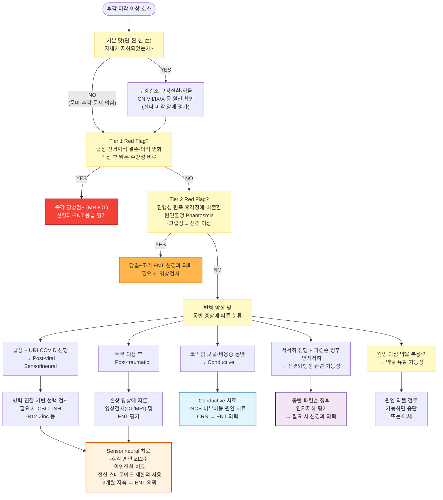

# 후각·미각 이상 Smell & Taste Disorders

## <mark style="color:green;">일반 사항</mark>

* 후각 및 미각은 소화액 분비를 촉진하는 등 섭식과 밀접하게 연관되며, 이 기능의 장애는 식욕 감퇴·체중 감소·영양실조와 연관되고 삶의 질 저하, 정신건강 문제, 사망률 증가와도 연관성이 보고됨(인과관계가 확립된 것이라기보다는 역학적 연관성 수준)
* 다른 이름 : 후각 저하/소실(Hyposmia/Anosmia), 미각 저하/소실(Hypogeusia/Ageusia), 미각 왜곡(Dysgeusia), 이취증(Parosmia), 환각취(Phantosmia)
* 분류
  * 후각 장애 : 기능과 원인에 따라
    * 기능 양상 : 정량적 장애 - anosmia/hyposmia; 정성적 장애 - parosmia/phantosmia
    * 원인 : 비부비동성, 감염 후, 외상 후, 신경계 질환, 선천성, 약물·독소, 의인성, 노화 관련, 특발성 등
    - [ ] 전도성(Conductive)/감각신경성(Sensorineural) 구분은 해부학적 관점의 실용적 구분으로 1차 진료에서 치료 방향을 잡는 데 유용하나 공식 주분류는 아니며, 신경퇴행성 질환처럼 중추성 요소가 큰 경우 단순히 sensorineural로 묶기에는 한계가 있음
  * 미각 장애 : 구강·신경계·전신 원인
* 후각 및 미각 기능 저하는 고령에서 흔하며 연령 증가에 따라 유병률이 증가함; 자가 보고와 객관적 기능검사 등 측정 방법에 따라 보고되는 유병률에는 상당한 차이가 있음
* 후각 저하가 미각 저하보다 흔하며, 상당수의 경우 환자가 "맛을 못 느낀다"고 호소할 때 실제로는 코 뒤로 넘어가는 향(Retronasal olfaction)의 문제임 - 이는 엄밀히 '미각(Taste)'이 아닌 '풍미(Flavor)'의 소실이며, 코 문제(후각)가 회복되면 풍미도 함께 호전될 수 있음
* 후각 상실은 알츠하이머병·파킨슨병 등 뇌 퇴행성 질환의 조기 증상일 수 있음
* 후각 장애의 자연 회복률은 원인에 따라 크게 다름
  * Post-viral (감기, 독감 등) : 회복이 더 느리고 예측하기 어려우며, 장기간(수개월\~1년 이상) 지속되는 경우가 상대적으로 흔함
    * COVID-19 : 초기 유행기 자료의 모델 추정치에서 30일 74%, 90일 90%, 180일 96%가 회복했으며, 약 5\~6%에서는 지속성 장애로 이행(Tan et al., BMJ 2022)
  * Post-traumatic (두부 외상 후) : 약 10\~30%로 회복률 낮음
  * Idiopathic (특발성) : 다양하며 예측 어려움
  * 공통 : 고령, 흡연, 심한 초기 후각 손실, 긴 이환 기간은 불량한 회복과 연관됨; 성별의 영향은 연구마다 일관되지 않음
* 미각 관련 신경은 뇌신경 7·9·10번의 여러 경로로 분산되어 있으므로 완전한 미각 소실은 드묾
* 후각 장애의 임상적 분류 (치료 방향 결정에 유용)
  * 임상적으로 Conductive와 Sensorineural 기전으로 구분하면 치료 방향 설정에 유용하나, 특히 CRS 등에서는 두 기전이 함께 존재할 수 있음
  * 전도성 : 비용종, 비중격 만곡, 비염 등 기류(Airflow) 장애가 원인 - 비강 치료에 반응 가능
  * 감각신경성 : 바이러스 감염, 두부 외상, 신경퇴행성 질환 등 - 후각 훈련 중심 치료

## <mark style="color:green;">원인 및 위험 인자</mark>

#### <mark style="color:$primary;">공통 원인</mark>

* 영양 : 영양실조, Vit 결핍, 간질환, 악성 빈혈
  * [아연 결핍](005_-smell-taste-disorders.md#undefined-15) : 미각 이상의 중요한 교정 가능 원인; 만성 질환(간경화, 신부전, 염증성 장질환), 흡수 불량, 채식 위주 식단, 이뇨제·ACE 억제제 장기 복용 시 주의
* 내분비 : 갑상선 기능 저하증, 당뇨병, 신질환
* 독소 노출, 편두통, Sjögren syndrome
* 신경계 질환 : 다발경화증, 알츠하이머병, 파킨슨병, 뇌신경 손상(뇌혈관 질환, 두부 외상)
* 감염 : URI, 구강 질환, 칸디다증, coxsackievirus, COVID-19

#### <mark style="color:$primary;">미각 장애</mark>

* 구강 장치(틀니 등), 치은염, 구강 칸디다증
* 입마름(Xerostomia) : 침 분비 감소 → 미뢰 기능 저하
* 구강 작열감 증후군(Burning mouth syndrome)
* 신경성 미각 장애 : Bell's palsy 및 기타 CN VII(chorda tympani), CN IX, CN X 병변

#### <mark style="color:$primary;">후각 장애 - 전도성(Conductive)</mark>

* 알레르기 비염, 만성 비부비동염(CRS), 비용종
* 비중격 만곡증, 비갑개 비대
* 상기도 감염(URI)으로 인한 일시적 점막 부종

#### <mark style="color:$primary;">후각 장애 - 감각신경성(Sensorineural)</mark>

* 바이러스 감염 후(Post-viral)
* 두부 외상(Post-traumatic) : 사골판 손상, 후각 신경(CN I) 절단
* 신경퇴행성 질환 : 알츠하이머병, 파킨슨병 (조기 전구 증상으로 나타남)
* 두경부 방사선 치료, 독소 노출, SLE
* 혈액 투석, 신부전
* 흡연

#### <mark style="color:$primary;">후각 왜곡 증상 - Parosmia / Phantosmia</mark>

<mark style="color:cyan;">**이취증(Parosmia)**</mark>

* 실제 냄새가 다른 냄새(주로 불쾌한 냄새)로 왜곡되어 인식되는 증상
* 바이러스 감염 후(특히 COVID-19) 회복 과정에서 흔히 발생
* 기전 : 후각 신경 재생 과정의 비정상적 신호 전달과 후각구·중추 후각 회로의 처리 변화 등이 관여하는 것으로 추정됨; 바이러스 감염 후 회복 과정에서 흔히 나타날 수 있으나 단순한 말초 신경의 ‘miswiring’만으로 설명되지는 않음
* 증상 : "커피에서 타는 고무 냄새", "음식에서 하수구·썩은 냄새" 등 특정 냄새 유발 물질에 의해 유발됨; 증상이 불쾌하여 식욕 저하·체중 감소로 이어질 수 있음
* 환자에게 바이러스 감염 후 후각이 회복되는 과정에서 흔히 나타날 수 있으며 반드시 나쁜 예후를 의미하지 않음을 설명
* 치료 : 후각 훈련이 1차 접근(☞ 비-약물 치료 참조); 성상신경절차단술(Stellate Ganglion Block)은 이중맹검 대조 연구에서 위약 대비 유의한 효과가 없어 권고되지 않음; theophylline·sodium citrate·비강 내 인슐린·후각 틈새 PRP 주사 등 정량적 후각장애 전반에 대해 연구된 기타 실험적 치료는 비급여 문의 시 근거 수준을 설명(☞ 기타 약물 치료 참조)

<mark style="color:cyan;">**환각취(Phantosmia)**</mark>

* 아무런 냄새 자극이 없는 상황에서 냄새를 느끼는 증상
* 감별 : 측두엽 간질(Temporal lobe epilepsy, 발작 전조 증상으로 발생), 두개내 종양(특히 olfactory groove meningioma), 전두엽·측두엽 종양, 파킨슨병, 정신질환(조현병, 우울증)
* 새로 발생하거나 지속되는 원인 불명의 phantosmia는 ENT 평가 및 비내시경을 고려하고, 신경학적 증상·편측성·비전형적 경과가 있거나 원인이 설명되지 않으면 CT/MRI 등 영상 검사를 고려

#### <mark style="color:$primary;">약물 원인</mark>

* 약물 관련 후각·미각 장애의 근거 수준은 약제마다 차이가 크며 일부는 증례보고 또는 약물감시 자료에 근거함
* 증상 발생 시 투약 시작·용량 변경과의 시간적 연관성, 다른 원인 가능성, 중단 또는 변경 후 회복 여부를 함께 평가

<mark style="color:cyan;">1.</mark> <mark style="color:cyan;">**항생제 및 항균제**</mark>

<table data-search="false"><thead><tr><th width="159">세부 분류</th><th width="252">약물</th><th>특징 및 비고</th></tr></thead><tbody><tr><td>마크롤라이드계</td><td>clarithromycin, azithromycin</td><td>쓴맛 또는 금속성 맛 유발; clarithromycin이 대표적으로 흔하며 azithromycin은 상대적으로 빈도 낮음</td></tr><tr><td>퀴놀론계</td><td>ciprofloxacin, ofloxacin</td><td>미각 변화 보고</td></tr><tr><td>테트라사이클린계</td><td>doxycycline, tetracycline</td><td>설태 침착 및 미각 이상, Black hairy tongue 가능성</td></tr><tr><td>기타 항균제</td><td>metronidazole</td><td>금속성 맛의 대표적 원인 약물; Black hairy tongue 보고가 있음</td></tr><tr><td>아미노글리코사이드</td><td>amikacin</td><td>가역적 후각 소실(일과성 무후각증)이 드물게 보고됨(증례 수준)</td></tr><tr><td>페니실린</td><td>ampicillin</td><td>일시적 후각 저하가 드물게 보고됨(증례 수준)</td></tr><tr><td>아미노페니실린/β-lactamase 억제제 복합제</td><td>amoxicillin-clavulanate 등</td><td>Black hairy tongue 유발 보고</td></tr><tr><td>항진균제</td><td>terbinafine</td><td>드물게 장기적인 미각 상실 유발 가능; 복용 중단 후에도 수개월간 지속될 수 있으므로 처방 전 환자에게 고지 필요</td></tr><tr><td>구강 세정제</td><td>chlorhexidine</td><td>장기 사용 시 치아 착색 및 미각 저하</td></tr></tbody></table>

<mark style="color:cyan;">**2. 항고혈압제 및 심혈관계 약물**</mark>

* 미각 이상과 연관될 수 있으며 일부 약물은 구강 건조 또는 아연 대사 변화가 관여할 수 있음

<table><thead><tr><th width="159">세부 분류</th><th width="256">약물</th><th>특징 및 비고</th></tr></thead><tbody><tr><td>ACE 억제제</td><td>captopril, enalapril</td><td>미각상실증(Ageusia)·미각 왜곡의 대표적 원인 계열; captopril이 가장 잘 알려짐; 아연 킬레이션이 기전으로 제시되나 확립된 것은 아님</td></tr><tr><td>ARB</td><td>losartan</td><td>미각 이상 보고; ACE 억제제에 비해 빈도 낮으나 주의</td></tr><tr><td>칼슘채널차단제</td><td>diltiazem, nifedipine</td><td>구강 건조 및 잇몸 증식 동반 가능</td></tr><tr><td>이뇨제</td><td>hydrochlorothiazide, spironolactone, amiloride</td><td>아연 배설 촉진이 관여할 것으로 추정되는 미각 저하 보고</td></tr><tr><td>탄산탈수효소 억제제</td><td>acetazolamide</td><td>탄산탈수효소 억제와 관련된 것으로 추정되는 특징적인 미각 변화가 나타날 수 있으며, 특히 탄산음료가 밍밍하거나 '김빠진 맛'으로 느껴질 수 있음; 구체적인 미각 경로와 carbonic anhydrase VI의 역할은 확립되지 않음</td></tr><tr><td>베타차단제</td><td>propranolol</td><td>미각 저하 및 구강 건조 보고</td></tr></tbody></table>

<mark style="color:cyan;">**3. 신경정신과 약물**</mark> (항우울제/항경련제/기타)

<table><thead><tr><th width="159">세부 분류</th><th width="257">약물</th><th>특징 및 비고</th></tr></thead><tbody><tr><td>SSRI</td><td>paroxetine (기타 SSRI 포함)</td><td>미각 이상, 구강 건조 보고; paroxetine에서 상대적으로 흔하게 보고됨</td></tr><tr><td>삼환계 항우울제</td><td>amitriptyline, nortriptyline, doxepin, imipramine</td><td>강력한 항콜린 작용으로 구강 건조 유발</td></tr><tr><td>항경련제</td><td>carbamazepine</td><td>쓴 맛의 환각미각(Bitter phantogeusia) 보고; 드물게 미각 소실 가능</td></tr><tr><td>항경련제</td><td>phenytoin</td><td>미각 저하(Hypogeusia) 또는 미각 소실 보고(정맥 투여 시 보고가 더 많음)</td></tr><tr><td>항경련제</td><td>topiramate</td><td>탄산음료가 밍밍하거나 금속성으로 느껴지는 특징적 미각 변화가 비교적 잘 알려짐; 탄산탈수효소 억제와 관련된 것으로 추정되나 기전은 확립되지 않음</td></tr><tr><td>조울증 치료제</td><td>lithium</td><td>금속성 맛 유발 가능</td></tr></tbody></table>

<mark style="color:cyan;">**4. 기타 약물**</mark> (내분비/항암/항파킨슨제)

<table><thead><tr><th width="159">세부 분류</th><th width="257">약물</th><th>특징 및 비고</th></tr></thead><tbody><tr><td>항이상지질혈증</td><td>statin (atorvastatin 등)</td><td>미각 이상 보고; 일부에서 금속성 환각 미각</td></tr><tr><td>항갑상선제</td><td>methimazole, propylthiouracil</td><td>미각 및 후각 기능 저하 보고</td></tr><tr><td>항파킨슨병제</td><td>levodopa, carbidopa</td><td>파킨슨병 자체가 후각 저하를 유발하므로 질환과 약물 효과를 구분하기 어려움</td></tr><tr><td>항암제</td><td>platinum 계열 (cisplatin, oxaliplatin), 기타 세포독성 항암제</td><td>미뢰 세포 손상으로 인한 심한 미각 왜곡; platinum 계열에서 특히 빈도 높음; 치료 시작 전 환자에게 미리 안내 권장</td></tr><tr><td>항당뇨병제</td><td>metformin</td><td>금속성 맛 유발; 비교적 흔함</td></tr><tr><td>항류마티스제</td><td>penicillamine</td><td>아연 길항 작용으로 미각 소실 잘 알려짐</td></tr></tbody></table>

* 금속성 맛(metallic taste) 유발 약제: metronidazole, clarithromycin, metformin, lithium - 해당 약물 복용 중 금속 맛 호소 시 우선 확인

## <mark style="color:green;">임상 양상</mark>

* 후각 저하(Hyposmia) / 후각 소실(Anosmia) : 냄새 감지 능력 부분 또는 완전 소실
* 이취증(Parosmia) : 실제 냄새가 왜곡(주로 불쾌한 냄새)되어 인식됨 - COVID-19 이후 빈도 증가
* 환각취(Phantosmia) : 자극 없이 냄새를 느끼는 증상 - post-infectious, 편두통, 비부비동 질환, 외상, 약물, 특발성 등 다양한 원인으로 발생 가능하며, 병력·동반 소견에 따라 구조적 중추 병변 감별이 필요
* 미각 저하(Hypogeusia) / 미각 소실(Ageusia) : 기본 맛(단·짠·신·쓴·감칠맛) 감지 저하
* 미각 왜곡(Dysgeusia) : 금속성 맛, 쓴맛 등 비정상적 미각 인식 (약물 부작용으로 흔함)
* 공통 영향 : 식욕 감소, 체중 감소, 영양 불량, 우울감, 대인관계 어려움

### <mark style="color:$danger;">🚩 Red Flags!</mark>

<mark style="color:$danger;">**즉각 조치**</mark>

* 갑작스러운 후각 소실과 함께 새로 발생한 국소 신경학적 결손, 심한 두통, 의식 변화, 시야 이상 등이 동반 `급성 중추신경계 병변(뇌졸중)`
* 두부 외상 후 후각 소실 + 일측성 맑은 수양성 비루(간헐적 또는 지속적) `CSF leak` `두개저 골절`

<mark style="color:$warning;">**당일\~수일 내 평가**</mark>

* 진행성 또는 지속성 편측 후각 장애, 비출혈·비강 종괴
* 미각 이상 + 새로 발생한 안면 편측 마비·감각 저하 `뇌신경 이상`
* 새로 발생하거나 지속되는 원인 불명의 phantosmia

<mark style="color:$info;">**조기 평가 및 추적**</mark>

* 명확한 감염 후 원인의 양측성 후각 장애가 예상된 경과 없이 객관적으로 지속되는 경우
  * 절대적 기간보다 임상 경과로 판단하며, 통상 3개월을 재평가·ENT 의뢰 시점의 기준으로 삼음 (편측성·진행성·구조적 병변 의심 등은 기간과 무관하게 조기 의뢰 - Tier 2 참조)
* 후각 소실 + 파킨슨 징후(서동, 경직), REM 수면 행동 장애 또는 인지 저하
* 후각·미각 소실 + 설명되지 않는 체중 감소 또는 영양 섭취 장애

## <mark style="color:green;">진단</mark>

### <mark style="color:orange;">후각 장애 분류 - '전도성 vs 감각신경성'</mark>

<table><thead><tr><th width="140">구분</th><th width="210">주요 원인</th><th width="190">임상 특징</th><th>치료 방향</th></tr></thead><tbody><tr><td>Conductive<br>(전도성)</td><td>비용종, 만성 비부비동염(CRS), 비염, 비중격 만곡증</td><td>코막힘·콧물 동반; 간헐적 변동 가능</td><td>비내스테로이드, 비염 치료, 비용종 치료; 치료 반응 가능성 높음</td></tr><tr><td>Sensorineural<br>(감각신경성)</td><td>바이러스 감염 후, 두부 외상, 신경퇴행성 질환</td><td>코막힘 없이 발생; 급성 발병 또는 서서히 진행</td><td>후각 훈련 중심; 지속 시 ENT·신경과 의뢰</td></tr></tbody></table>

### <mark style="color:orange;">병력 청취</mark>

* 발생 시점 및 경과 : 급성/점진적 발생, 이후 호전·변동 여부
* 편측성 여부 : 양측성 vs 편측성
* 정량적 저하(hyposmia/anosmia)와 정성적 이상(parosmia/phantosmia) 동반 여부
* 선행 요인 : URI/COVID-19, 두부 외상, 비강·부비동·두개저 수술 병력
* 동반 비증상 : 코막힘, 비루, 안면통, 비출혈
* 약물력·노출력 : 최근 시작·증량된 약물, 흡연, 직업성 독성물질 노출
* 소아·청소년에서는 선천성 가능성 및 사춘기 지연 여부 확인 : 어릴 때부터 지속된 후각소실 ± 사춘기 지연 → 선천성 무후각증, Kallmann syndrome 고려
* 신경퇴행성 질환 관련 : 파킨슨병 징후(서동, 경직), 인지 저하, REM 수면 행동 장애, 발작 의심 증상
* 영양·정신 상태 : 체중 감소, 섭취 제한, 우울·불안
* 미각 장애가 주 호소인 경우 : 구강 점막·치아·보철물·구강 칸디다증·타액 분비 확인, CN VII(chorda tympani)·CN IX 중심 뇌신경 진찰

### <mark style="color:orange;">검사</mark>

* 모든 환자에게 일률적인 혈액검사나 영상검사가 필요한 것은 아니나, 지속성·원인 불명 후각 장애는 비내시경과 검증된 객관적 후각기능검사를 고려함
  * 자가보고식 문진만으로는 객관적 후각기능과 잘 일치하지 않으므로 단독으로 의존하지 않음
* 혈액검사 : CBC, 혈당, Cr, TSH, Vit B12, 혈청 아연 등을 의심 원인에 따라 고려
  * 모든 환자에게 routine 검사가 필요한 것은 아니며 병력·진찰에 따라 선택; 알레르기 질환이 의심되면 관련 검사를 선택적으로 고려
* 신체진찰 및 비내시경 : 비강·구강·혀·치아·타액분비·뇌신경 진찰; 비내시경으로 비중격 만곡, 비용종, 비강·후각 틈새 병변을 평가(전문 평가에서 후각 틈새를 포함한 비내시경이 중요)
* 영상검사
  * CT sinus 검사 : CRS·비용종·후각 틈새 폐쇄 등 sinonasal disease 평가에 사용
  * brain/olfactory pathway MRI : 명확한 감염 후·비부비동성 원인이 없고 객관적으로 지속되는 원인 불명 후각 장애, 편측성 장애, 진행성 경과, 신경학적 소견에서 ENT 평가 후 고려하며 '특발성'으로 확정하기 전 구조적 원인을 배제하는 목적으로 사용; 다만 고립성 후각장애에서 MRI로 치료 가능한 병변이 발견되는 진단수율은 낮으므로 모든 감염 후 후각장애에 일률적으로 시행하지 않음
* 후각 기능 검사 : KVSS II(Korean Version of Sniffin' Sticks II) 또는 YOF test(YSK Olfactory Function Test, 한국 문화 친화적 후각검사)
  * KVSS II : 가장 낮은 감지 가능 농도 측정(Threshold), 서로 다른 냄새를 구분하는 능력(Discrimination), 냄새를 인식·명명하는 능력(Identification)의 3항목 합산, TDI 최고 48점
  * YOF test : 동일 3항목 구성이나 TDI 최고 36점; 무후각증 cut-off ≤14.5점, 저후각증 14.5\<TDI≤21.0점 - KVSS II와 점수 체계·cut-off가 다르므로 서로 바꿔 적용하지 않음
  * 두 검사 모두 연령 및 검사실 정상 참고 범위를 함께 고려하여 판정하며, 국내 연구에서 제시된 cut-off는 연구·대상에 따라 차이가 있어 단일 수치를 모든 환자에게 일률적으로 적용하지 않음
* 미각 기능 검사 : 1차 진료에서 단맛·짠맛·신맛·쓴맛(필요 시 감칠맛)의 양측 또는 부위별 인지를 간단히 확인할 수 있음; 이상이 확인되거나 정량적 평가가 필요하면 taste strips, 전기미각검사 등 전문 검사를 위해 의뢰

### <mark style="color:orange;">감별</mark>

* 진짜 '미각 장애' vs 후각 기인 '풍미 소실' 구분
  * 단맛·짠맛·신맛·쓴맛 등 기본 맛을 정상적으로 구분함 → 진짜 미각 장애보다는 후각 저하에 따른 풍미(flavor) 소실 가능성
  * 기본 맛 자체의 감지가 저하됨 → 진짜 미각 장애(hypogeusia/ageusia) 가능성; 구강·약물·신경학적 원인 평가
* [구강건조증](../222_/056_-dry-mouth-xerostomia.md) : 침 분비 저하로 미뢰 자극 감소 → 미각 저하 유사 증상
* 약물 부작용 : 최근 시작한 약물 검토 - 금속성 맛·구강 건조 유발 약물 여부 확인 (☞ 약물 원인 표 참조)

***


```mermaid
graph TD
    A([후각·미각 이상 호소]) --> B["기본 맛(단·짠·신·쓴)<br/>자체가 저하되었는가?"]
    B -->|"YES"| C["구강건조·구강질환·약물<br/>CN VII/IX/X 등 원인 확인<br/>(진짜 미각 장애 평가)"]
    B -->|"NO<br/>(풍미·후각 문제 의심)"| D["Tier 1 Red Flag?<br/>급성 신경학적 결손·의식 변화<br/>외상 후 맑은 수양성 비루"]
    C --> D
    D -->|"YES"| E1["즉각 영상검사(MRI/CT)<br/>신경과·ENT 응급 평가"]
    D -->|"NO"| D2["Tier 2 Red Flag?<br/>진행성 편측 후각장애·비출혈<br/>원인불명 Phantosmia<br/>·고립성 뇌신경 이상"]
    D2 -->|"YES"| E2["당일~조기 ENT·신경과 의뢰<br/>필요 시 영상검사"]
    D2 --->|"NO"| F["발병 양상 및 <br/>동반 증상에 따른 분류"]
    F --> G["급성 + URI·COVID 선행<br/>→ Post-viral <br/>Sensorineural"]
    F --> H["두부 외상 후<br/>→ Post-traumatic"]
    F --> I["코막힘·콧물·비용종 동반<br/>→ Conductive"]
    F --> J["서서히 진행 + 파킨슨 징후<br/>·인지저하<br/>→ 신경퇴행성 관련 가능성"]
    F --> P["원인 의심 약물 복용력<br/>→ 약물 유발 가능성"]
    G --> K["병력·진찰 기반 선택 검사<br/>필요 시 CBC·TSH<br/>·B12·Zinc 등"]
    H --> H2["손상 양상에 따른<br/>영상검사(CT/MRI) 및 <br/>ENT 평가"]
    I --> L["<u>Conductive 치료</u><br/>INCS·비부비동 원인 치료<br/>CRS → ENT 의뢰"]
    J --> M["동반 파킨슨 징후<br/>·인지저하 평가<br/>→ 필요 시 신경과 의뢰"]
    P --> P2["원인 약물 검토<br/>가능하면 중단<br/> 또는 대체"]
    K --> N["<u>Sensorineural 치료</u><br/>·후각 훈련 ≥12주<br/>·원인질환 치료<br/>·전신 스테로이드 제한적 사용<br/>·3개월 지속 → ENT 의뢰"]
    H2 --> N
classDef yellow fill:#fff9c4,stroke:#ffe082
class B,D,D2,F,P yellow
    style E1 fill:#f44336,stroke:#b71c1c,color:#fff,stroke-width:2px
    style E2 fill:#ffb74d,stroke:#e65100,stroke-width:2px
    style L fill:#e1f5fe,stroke:#01579b,stroke-width:2px
    style N fill:#fff3e0,stroke:#e65100,stroke-width:2px
    style M fill:#f3e5f5,stroke:#4a148c,stroke-width:2px
```

<p align="center"><strong>후각·미각 이상 관리 알고리듬</strong></p>

<p align="center"><em><mark style="color:$info;">Ref. Position Paper on Olfactory Dysfunction, 2023 (Rhinology, Suppl. 33)</mark></em></p>

***

## <mark style="background-color:$warning;">Management</mark>

### <mark style="color:orange;">치료 방침</mark>

* 원인 치료 우선 : 기저 질환 치료, 비염·비부비동 치료, 원인 약물 중단 또는 변경 고려
* 분류별 접근 : 전도성 vs 감각신경성 구분 후 치료 방향 결정
* 적절하고 고른 영양 섭취
* 구강 관리(☞ [입안마름](../222_/056_-dry-mouth-xerostomia.md)), 규칙적 치과 진료
* 금연
* 독성 물질 노출 회피


**후각 소실과 신경퇴행성 질환** : 후각 소실은 파킨슨병의 전구 증상으로 진단 수년 전부터 나타날 수 있으며, 알츠하이머병에서도 조기에 관찰됨. 후각 소실 + REM 수면 행동 장애(RBD) 조합은 파킨슨 스펙트럼 질환의 고위험 신호 → 신경과 의뢰 고려; 다만 고립된 후각 저하 소견만으로 파킨슨병·알츠하이머병을 예측하거나 선별진단하지 않으며, 다른 위험 신호(RBD, 인지저하, 파킨슨 징후)가 동반될 때 의뢰를 고려함


## <mark style="color:green;">비-약물 치료 및 예방</mark>

### <mark style="color:orange;">후각 훈련 (Olfactory Training)</mark>

* 주요 적용 대상 : 바이러스 감염 후(post-viral, COVID-19 포함), 두부 외상 후, 특발성 후각 장애; 신경퇴행성 질환 관련 후각 장애에서도 연구되고 있음
  * 저위험 치료이므로 시행을 권장하되 자연 회복 가능성과 연구 이질성을 함께 설명
* 기간 : 최소 12주 이상 꾸준히 시행하고 임상 반응에 따라 24주 이상 연장 고려
* 기본 방법 : 하루 2회, 각 향을 약 10\~20초씩 맡는 방식으로 시행
  * 장미(Rose), 유칼립투스(Eucalyptus), 레몬(Lemon), 정향(Clove) 4가지 향
  * 무리하게 깊이 흡입하기보다 부드럽게 짧게 냄새를 맡는 방식(Sniffing)이 후각 수용체 자극에 유리하다는 생리학적 근거가 있으나, 이 방식 자체의 우월성을 직접 비교한 임상시험 근거는 부족함
  * 냄새를 맡을 때 해당 냄새를 의식적으로 인지하고 해당 사물을 떠올리며 집중하도록 지도할 수 있음
  * 오리지널 4종 향이 없는 경우에 환자에게 친숙한 향(예: 한약재, 원두커피, 참기름, 된장 등)으로 대체하여 훈련하는 것도 실용적임; 단, 이러한 대체 접근은 공식 가이드라인 권고 수준은 아님
* Modified Olfactory Training : 총 36주 동안 12주마다 향 세트를 변경하는 방법이 연구됨; 일부 후각 지표의 추가 개선 가능성이 보고되었으나 표준 4종 향 훈련보다 일관되게 우월하다고 확정된 것은 아님
  * 1단계 (1\~12주) : eucalyptus, lemon, clove, rose
  * 2단계 (13\~24주) : menthol, thyme, tangerine, jasmine
  * 3단계 (25\~36주) : green tea, bergamot, rosemary, gardenia
* 기전 : 반복적 후각 자극에 따른 말초 및 중추 후각계의 가소성·재구성이 관여하는 것으로 추정


후각 훈련은 post-infectious 후각 장애에서 가장 널리 권고되는 저위험 치료 중 하나임. 개별 placebo-controlled RCT에서는 음성 결과도 보고되었으나, 2026년 RCT 메타분석(10개 RCT, 628명, COVID-19 후 후각장애)에서는 객관적 후각기능(SMD 0.30)과 삶의 질(SMD -0.40) 모두에서 유의한 개선이 보고됨; 다만 삶의 질 결과는 단일 연구 제외 시 유의성이 사라지는 등 민감도가 높고, 훈련 기간·향 종류·대조군 설계가 연구마다 이질적이어서 효과 크기는 불확실함.


### <mark style="color:orange;">안전 및 생활 지도</mark>

* 상한 음식 감지 능력 저하 → 음식의 소비기한과 보관 상태를 자주 확인
* 화재·가스 감지 능력 저하 → 연기/가스 감지기 설치, 가스 밸브 잠금 습관화; 가능하면 인덕션(전기레인지) 사용 권고
* 저하된 미각에 대한 보상 작용으로 향신료·감미료를 과다 사용하지 않도록 주의 (고혈압·당뇨 악화 위험)
* 미각이 저하된 경우 음식의 질감, 색, 향을 조절하면 식사의 즐거움 향상; 계량 스푼·저울 사용 권고
* 체중 감소·영양 불량 위험 : 주기적 체중 측정 및 영양 상태 평가. 단백질 식품(육류·어류·두부·달걀) 충분 섭취 권고. 심한 경우 영양 상담 병행
* 항암 치료 중인 환자 : 미뢰 세포 손상으로 금속성 맛·미각 왜곡 흔함
  * 금속 맛 완화 tip : 금속 식기 대신 플라스틱·도자기 사용. 고기류는 레몬즙·소스로 재워 두거나 차갑게 조리
* 미각·후각 소실로 인한 우울감, 고독감 → 정기적 추적 관찰(☞ [우울증](../221_/027_-depression.md))

## <mark style="color:green;">약물 치료</mark>

### <mark style="color:orange;">비내 스테로이드 (INCS)</mark>

* 적응증 : 비부비동 질환(비염, CRS, 비용종) 원인의 Conductive 후각 장애
* 투여 방법 : 비강 분무제는 올바른 일반 사용법을 교육하고, CRS 등에서는 전문의 판단에 따라 점적액 또는 irrigation 제형을 고려; 특정 자세를 표준으로 권고할 근거는 충분하지 않음
* fluticasone furoate <mark style="color:blue;">\[아바미스 나잘 스프레이]</mark> 각 비공 1\~2분무 qd
* mometasone furoate <mark style="color:blue;">\[나조넥스 나잘 스프레이]</mark> 각 비공 2분무 qd
* 효과 판정 : 원인 질환과 치료 반응에 따라 수주 후 재평가; 지속되거나 구조적 병변·CRS가 의심되면 의뢰 고려
* budesonide nasal irrigation : CRS 동반 중증 후각 장애에서 ENT 전문의 지도 하에 사용 가능(off-label); 1차 진료에서는 선택적 사용 또는 ENT 의뢰 후 지속

### <mark style="color:orange;">전신 스테로이드</mark>

* 선택적 사용, 일상적 권고 아님
* 비특이적 후각 장애(post-viral 포함)에서 전신 스테로이드의 routine 사용은 권고하지 않음
* 선택적 사용 가능 상황 : 비용종 동반 CRS, 급성 심한 염증성 비부비동 질환 (단기 처방 후 ENT 의뢰)
* 비용종 동반 CRS에서 단기 경구 스테로이드를 고려할 수 있으나 용량·기간은 질환 중증도와 환자 위험을 평가하여 결정; 반복 투여를 피하고 당뇨·고혈압·골다공증 등 동반 질환 시 특히 신중 사용
* 적절한 국소 치료(INCS 등)에도 조절되지 않거나 전신 스테로이드가 반복적으로 필요한 중증의 비용종을 동반한 만성 비부비동염 → 의뢰(수술 및 생물학적 제제 치료등 고려)

### <mark style="color:orange;">아연 보충</mark>

* 아연 결핍이 확인되었거나 임상적으로 결핍 가능성이 높은 미각 장애에서 우선 고려
  * 2023년 RCT 메타분석에서는 특발성 및 아연 결핍 미각장애에서도 개선 비율이 유의하게 높았으나(RR 1.38), 제형·용량(연구에서는 원소 아연 17\~86.7 ㎎/일까지 다양하게 사용)·평가법의 이질성이 커 고용량·장기 투여를 일률적으로 권고하지는 않음
* 혈청 아연은 채혈 조건과 검사실 참고범위에 따라 해석
* 원인 불명의 후각 장애에 routine 아연 보충은 권고하지 않음
* 아연 결핍 또는 결핍 위험이 있는 미각 장애에서는 원인과 검사 결과를 고려하여 보충
* 실용적 보충 예 : 원소 아연 25\~40 ㎎/일, 식후 복용; 미각 장애에 대한 단일 표준 용량으로 확립된 것은 아니므로 결핍 정도·제제·환자 상태에 따라 조정
* 8\~12주 보충 후 임상 반응과 필요 시 혈청 아연을 재평가; 2025 한국인 영양소 섭취기준상 성인 상한은 35 ㎎/d로 일반 영양섭취 기준이며, 치료 목적의 고용량 사용을 직접 제한하지는 않음
* 장기간 고용량 사용 시에는 구리 결핍(빈혈, 신경병증) 위험을 고려하여 기간과 구리 상태를 함께 모니터링
* 혈청 아연 측정 고려 : 영양불량, 흡수장애, 만성 설사, 만성 간·신질환 등 결핍 위험이 있거나 임상적으로 아연 결핍이 의심되는 경우
* tetracycline·quinolone계 항생제, penicillamine과는 아연이 흡수를 저하시킬 수 있어 복용 간격을 두거나 제품별 허가사항을 확인


**비강 내(intranasal) 아연 제제는 사용하지 않음** : 경구 아연 보충과 달리, 비강 스프레이·젤 형태의 아연 제제는 후각 상피 손상으로 인한 영구적 후각 소실 사례가 다수 보고되어 미국 FDA가 사용 중단을 경고한 바 있음


### <mark style="color:orange;">기타 약물 치료</mark>

* 기저 질환 치료 : 갑상선 기능 저하증, 당뇨병 등 교정 가능한 원인 우선 치료
* 원인 약물 중단 또는 대체제 변경 : 금속성 맛, 미각 장애 유발 약물 확인 후 가능하면 교체
* Vitamin A intranasal (비강 내 레티놀) : 초기 소규모·후향적 연구에서는 후각 상피 재생 가능성이 제시되었으나, 2026년 APOLLO 이중맹검 위약대조 RCT(post-COVID 후각장애, 9,000 IU/d 12주)에서는 객관적 후각기능에 유의한 개선이 확인되지 않음(삶의 질 하위 지표 일부만 개선); 비-COVID 감염 후 후각장애에서의 효과도 확립되지 않아 일상적으로 권고하지 않음
* 기타 실험적 치료(정량적 후각장애 및 이취증 전반에 대해 연구됨, parosmia 특이 치료는 아님) : theophylline·sodium citrate·비강 내 인슐린은 소규모·단기 연구에서 일부 지표 개선 신호가 있었으나 표본 크기와 연구 설계가 이질적이어서 표준 치료로 권고되지 않음; 후각 틈새 혈소판 풍부 혈장(PRP) 주사는 여러 대조 연구와 메타분석에서 객관적 후각기능 개선 가능성이 보고되었고 소규모 추적 연구에서는 1년까지 효과가 지속될 가능성도 제시되었으나, 연구 규모가 작고 원인 질환·PRP 제조법·주사 횟수·평가법이 표준화되지 않아 아직 일상적 치료로 권고하지 않음; 비급여로 시행되는 시술을 문의하는 환자에게는 현재 근거 수준을 설명

***

### <mark style="color:red;">질병코드</mark>

* R43 후각 및 미각 장애 Disturbances of smell and taste
* R43.0 무후각증 Anosmia
* R43.1 이상후각 Parosmia
* R43.2 이상미각 Parageusia
* R43.8 후각 및 미각의 기타 및 상세불명의 장애 Other and unspecified disturbances of smell and taste

***

## <mark style="color:purple;">처방례</mark>

> **처방례 1.** 비부비동염/비용종 동반 후각 장애 (Conductive type) - INCS
>
> ```
> 나조넥스 나잘 스프레이 50 ㎍/spray 각 비공 2분무 qd
> ```
>
> _✽ 올바른 비강 분무법을 교육; 특정 두부 자세를 표준으로 권고할 근거는 충분하지 않음; 최소 4\~8주 사용 후 효과 판정; 무반응 시 ENT 의뢰; 비용종 동반 CRS는 내과적 치료 반응 불충분 시 ESS(내시경 부비동 수술) 고려 (ENT 협진)_

> **처방례 2.** 비용종 동반 만성 비부비동염(CRSwNP)의 심한 증상 - 단기 경구 스테로이드 + INCS (선택적 사용)
>
> ```
> prednisolone 25 ㎎ qd 14일
> 나조넥스 나잘 스프레이 각 비공 2분무 qd 지속
> ```
>
> _✽ 위 prednisolone 용량은 CRSwNP 무작위시험에서 사용된 대표 short-course 예시이며, 실제 용량·기간은 중증도와 환자 위험에 따라 조정; 전신 스테로이드는 CRSwNP에서 선택적으로 단기간 사용하며, post-viral/idiopathic 후각 장애 자체를 목적으로 routine 투여하지 않음; 당뇨·고혈압·골다공증·녹내장 등 기저 질환 및 반복 투여에 따른 누적 위험을 평가; 치료 반응이 불충분하거나 반복적으로 전신 스테로이드가 필요한 경우 ENT 의뢰 - ESS/생물학적 제제 등 추가 치료 평가_

> **처방례 3.** 혈청 아연 결핍 확인된 미각 장애 (예시 - 실제 처방 시 제품별 원소 아연 함량 확인 필요)
>
> ```
> 아연황산 제제 (원소 아연 25~40 ㎎/일 범위) qd~bid 8~12주
> ```
>
> _✽ 제품마다 아연염 종류(황산아연, 글루콘산아연 등)에 따라 정제당 원소 아연 함량이 다르므로, 실제 처방·권고 시 사용 제품의 원소 아연 함량을 확인; 전문의약품인지 건강기능식품인지 구분하여 안내; 혈청 아연은 채혈 조건과 검사실 참고범위에 따라 해석하고, 임상적 결핍 위험을 함께 평가; 미각 장애에 대한 단일 표준 용량은 확립되지 않았으므로 결핍 정도·제제·환자 상태에 따라 조정; 치료 목적으로 이를 초과하는 용량을 장기간 사용할 경우 구리 결핍(빈혈, 신경병증) 위험을 고려하여 모니터링; 결핍이 확인되지 않았고 결핍 위험도 낮은 경우 routine 보충은 권고되지 않음_

***

### <mark style="color:$success;">핵심 복약 지도</mark>

> **비강 내 스테로이드(INCS) - 후각 장애 목적 투여 시 주의사항**
>
> 1. 비강 분무제는 올바른 일반 분무법을 교육하고 처방된 용량을 꾸준히 사용하도록 합니다.
> 2. 후각 틈새(Olfactory cleft)로의 전달을 높이기 위한 여러 두부 자세·점적액·irrigation 제형이 연구되었으나, 특정 두부 자세를 표준으로 일률적으로 권고할 근거는 충분하지 않습니다. CRS 등에서는 전문의 판단에 따라 다른 제형을 고려할 수 있습니다.
> 3. 원인 질환과 치료 반응에 따라 보통 수주간 꾸준히 사용한 뒤 효과를 평가합니다.
> 4. 장기 사용 시 비점막 자극, 코피가 생길 수 있습니다 - 심할 경우 의사와 상의하십시오.

> **후각 훈련 - 바이러스 감염 후(COVID-19 포함) 후각 장애**
>
> 1. 후각 훈련은 post-infectious 후각 장애에서 가장 널리 권고되는 저위험 비약물 치료 중 하나입니다. 전신 스테로이드는 비특이적 post-viral 후각 장애에서 일상적으로 권고되지 않습니다.
> 2. 장미·유칼립투스·레몬·정향 4가지 향을 하루 2회, 각 향을 약 10\~20초씩 맡습니다.
> 3. 최소 12주 이상 꾸준히 시행하고, 필요에 따라 더 장기간 지속할 수 있습니다.
> 4. 12주마다 향 조합을 바꾸는 36주 modified training도 연구되어 있으나 표준 4종 향 훈련보다 확실히 우수하다고 단정할 근거는 충분하지 않습니다.
> 5. COVID-19 후 지속성 후각 장애에서도 시행할 수 있습니다. 2026년 RCT 메타분석(10개 연구, 628명)에서는 후각기능과 삶의 질 모두에서 통계적으로 유의한 개선이 보고되었으나, 연구마다 방법이 달라 효과의 크기에는 여전히 불확실성이 있습니다.
> 6. 냄새를 맡을 때 해당 냄새를 의식적으로 인지하고 해당 사물을 떠올리며 집중해 보십시오.

> **아연(Zinc) 보충 시 주의사항**
>
> 1. 아연 결핍이 확인되었거나 결핍 위험이 높은 미각 장애에서 보충을 고려합니다. 원인 불명의 후각 장애에 routine 보충은 권고되지 않습니다.
> 2. 실용적 보충 예로 원소 아연 25\~40 ㎎/일을 사용할 수 있으나 미각 장애의 단일 표준 용량은 아니며, 결핍 정도·제제·환자 상태에 따라 조정합니다. 8\~12주 후 재평가합니다.
> 3. 2025 한국인 영양소 섭취기준상 성인의 아연 상한섭취량(UL)은 원소 아연 35 ㎎/d입니다. 이는 일반적인 영양섭취 기준이며, 의사가 결핍 치료 목적으로 이보다 높은 용량을 처방할 수 있습니다. 다만 고용량을 장기간 복용하면 구리 결핍(빈혈, 신경병증)이 생길 수 있으므로 임의로 장기간 복용하지 마시고 정기적으로 진료받으십시오.
> 4. 영양불량, 흡수장애, 만성 설사, 만성 간·신질환 등 아연 결핍 위험이 있거나 임상적으로 의심되는 경우 혈청 아연 측정을 고려합니다.
> 5. 경구 아연만 안내합니다. 비강 스프레이·젤 형태의 아연 제제는 영구적 후각 소실을 유발할 수 있어 환자가 임의로 구입해 사용하지 않도록 반드시 확인하고 안내합니다.

> **언제 다시 병원을 방문해야 하나요?**
>
> * 비강 스테로이드 4\~8주 사용 후에도 후각이 개선되지 않는 경우 - 의뢰 고려
> * 후각·미각 이상이 3개월 이상 지속되는 경우
> * 갑작스러운 후각 소실과 함께 심한 두통·시야 이상·마비·감각 저하·의식 변화 등 신경학적 증상이 새로 발생하는 경우 - **즉시 내원**
> * 체중이 지속적으로 감소하거나 식사가 어려운 경우

***

## <mark style="color:blue;">환자 안내서</mark>


**후각·미각 이상은 삶의 질에 큰 영향을 미치지만, 원인에 따라 자연 회복되거나 치료로 호전될 수 있습니다**

바이러스 감염(COVID-19 포함) 후 후각 손실은 많은 경우 시간이 지나면서 부분적으로 회복됩니다. 다만 회복 정도와 기간에는 개인차가 크며, 두부 외상이나 신경퇴행성 질환이 원인인 경우에는 회복 가능성이 상대적으로 낮을 수 있습니다. 후각 훈련은 바이러스 감염 후 지속되는 후각 장애에서 흔히 시행되는 안전한 비약물 치료이지만, COVID-19 후 후각 장애에서 효과의 크기는 개인마다 다를 수 있습니다.


#### <mark style="color:$primary;">맛을 못 느낀다고 하셨나요? - 미각과 후각의 차이</mark>

* 우리가 느끼는 '맛의 풍부함'은 대부분 **후각**에서 옵니다. 단맛·짠맛·신맛 등 기본 맛은 혀가 담당하지만, 음식의 풍미(Flavor)는 코로 느끼는 향기입니다.
* "맛을 못 느낀다"고 하셔도 **실제로는 코의 문제**인 경우가 많습니다. 코 문제를 치료하면 맛도 돌아올 수 있습니다.

#### <mark style="color:$primary;">후각 훈련 방법 (하루 2회, 최소 12주 이상)</mark>

* 장미, 유칼립투스, 레몬, 정향(Clove) 등 **4가지 향을 각각 20초씩** 맡으십시오
* 무리하게 깊이 들이마시기보다 **부드럽게 짧게 냄새를 맡는 것**이 도움이 된다고 알려져 있습니다
* 냄새를 맡을 때 해당 사물(예: 장미꽃)을 **머릿속으로 떠올리면서 집중**하면 도움이 될 수 있습니다
* **최소 12주 이상** 꾸준히 시행하고, 필요에 따라 더 장기간 지속할 수 있습니다
* 12주마다 사용하는 향의 조합을 바꾸는 modified olfactory training도 연구되어 있습니다. 다만 표준 4종 향 훈련보다 확실히 더 효과적이라고 단정할 근거는 아직 충분하지 않습니다

#### <mark style="color:$primary;">이취증(Parosmia) - "음식에서 이상한 냄새가 난다"고 하신다면</mark>

* COVID-19 등 바이러스 감염 후 회복 과정에서 음식에서 **타는 고무 냄새, 하수구 냄새** 등 불쾌한 냄새가 나는 경우가 있습니다. 이를 이취증(Parosmia)이라고 합니다.
* 이 증상은 후각 신경 재생 과정의 비정상적 신호 전달과 중추 후각 처리 변화 등이 관여하는 것으로 추정됩니다. 바이러스 감염 후 회복 과정에서 흔히 나타날 수 있으며, 반드시 나쁜 예후를 의미하지는 않습니다.
* 증상 유발 음식(커피, 고기류, 양파, 달걀 등)을 일시적으로 피하고, 이취증 유발이 적은 담백한 음식(쌀밥, 감자 등)이나 차갑거나 미지근한 음식을 위주로 드시면 식사를 유지하는 데 도움이 됩니다. 유발 식품은 개인차가 크므로 본인에게 맞는 음식을 기록해 두는 것이 도움이 됩니다.
* 대부분 수개월에서 길게는 1년 이상에 걸쳐 서서히 호전되며, 일부는 더 오래 지속될 수 있습니다. 이 기간 동안 식욕 저하와 체중 감소가 생길 수 있으므로 주치의와 정기적으로 상담하십시오.
* 미각이 저하된 경우 **감각에 의존하지 말고** 계량 스푼이나 레시피의 정해진 양으로 간을 맞추십시오. 과도한 소금·설탕·조미료 사용은 고혈압·당뇨 등 다른 건강 문제로 이어질 수 있습니다.
* 신맛(레몬즙, 식초)이나 허브·향신료를 활용하면 후각을 통한 풍미를 보완할 수 있습니다. 바삭하거나 부드러운 식감, 다채로운 색감도 먹는 즐거움을 되찾는 데 도움이 됩니다.
* **후각이 저하된 경우 상한 음식을 감지하는 능력이 떨어집니다** - 식품의 소비기한과 보관 상태를 자주 확인하십시오.
* 가스 누출이나 화재를 인지하지 못할 수 있으므로 **가스·연기 감지기를 설치**하고, 사용 후 가스 밸브 잠금을 습관화하십시오. 가능하면 도시가스 대신 인덕션(전기레인지) 사용을 권장합니다.

#### <mark style="color:$primary;">영양 및 체중 관리</mark>

* 후각·미각 저하로 식욕이 줄면 **체중 감소와 영양 불균형**이 생길 수 있습니다.
* 주기적으로 **체중을 측정**하고, 의도하지 않게 체중이 줄고 있다면 주치의에게 알리십시오.
* 고기·생선·두부·달걀 등 **단백질 식품을 충분히** 섭취하려고 노력하십시오. 식욕이 없어도 정해진 시간에 규칙적으로 드시는 것이 중요합니다.
* 증상이 심해 식사가 어려운 경우 영양 상담을 받으십시오.

#### <mark style="color:$primary;">이럴 때는 진료가 필요합니다</mark>

* 후각·미각 손실이 **3개월 이상 지속**되거나 점차 악화되는 경우
* 갑작스러운 후각 소실과 함께 심한 두통·시야 이상·마비·감각 저하·의식 변화 등이 동반되는 경우 - **즉시 진료**
* 특정 약물 복용 후 미각 이상이 생긴 경우 - 임의로 약을 중단하지 말고 의사와 상의하십시오
* 냄새가 왜곡되어 불쾌한 냄새로 느껴지거나(이취증, Parosmia), 실제로 없는 냄새가 느껴지는 경우(환각취, Phantosmia) - 특히 새로 발생한 경우
* 체중이 지속적으로 감소하거나 식사가 어려운 경우
* 후각·미각 소실로 인한 **우울감, 고독감**이 생기면 주치의와 상담하십시오 (☞ [우울증](../221_/027_-depression.md))
