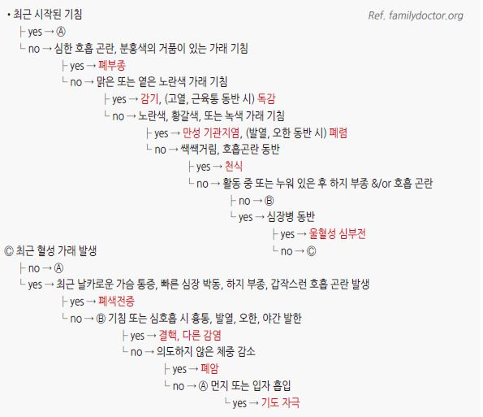
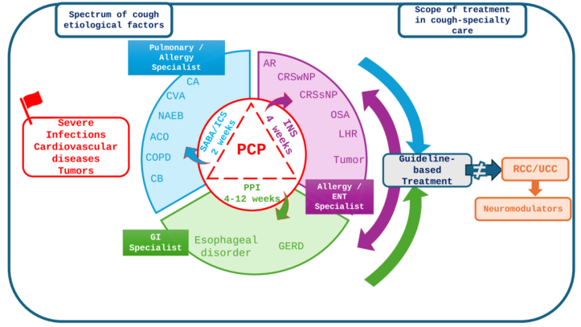

# 기침 Cough

## <mark style="color:green;">일반 사항</mark>

* 기침은 1차 진료에서 가장 흔한 주소 중 하나로, 기도 내 이물·분비물 제거를 위한 방어 반사이지만 지속 시 삶의 질을 크게 저하시킴
* 지속 기간에 따라 급성(＜3주), 아급성(3\~8주), 만성(＞8주)으로 분류하며, 이에 따라 원인과 접근법이 달라짐&#x20;
* 만성 기침의 흔한 원인 : 천식(cough-variant asthma 포함), 상기도기침증후군(UACS), 비천식성 호산구성 기관지염(NAEB), 위식도역류질환(GERD)
  * 위식도역류가 기침에 기여하는 환자가 있으나 인과관계 판단이 쉽지 않으며, 특히 전형적 역류 증상이 없는 환자에서는 PPI의 기침 개선 효과가 제한적임
* 흡연 관련 만성 기침은 금연 후 대부분 호전하므로 금연 상담을 우선 시행
* ACEI 복용 중인 환자에서는 약물 유발 기침을 항상 먼저 배제할 것
  * ACEI 외에도 opioid, 전립선 관련 및 안과용 prostanoid 점안액, statin, NSAID 등이 기침을 유발할 수 있으며, 비선택적 β차단제는 기침 수용체 자극이 아닌 직접적 기관지 수축을 통해 기침을 악화시킬 수 있음; ; DPP-4i는 보조적 원인으로 고려
* 급성 기침의 대부분은 바이러스 감염(감기, 급성 기관지염)이 원인으로 항생제의 관습적·일상적 처방은 삼가 해야 함
  * 가래 색깔(화농성 여부)만으로는 세균 감염 여부나 항생제 반응을 예측할 수 없으므로 단순 급성 기관지염에서 항생제의 근거로 사용하지 않음
  * 항생제는 폐렴, 백일해, 전신 상태가 매우 불량하거나 합병증 고위험군, COPD 급성악화의 별도 적응 기준 충족 등 확인된 세균성 감염이 있을 때에 한해 고려&#x20;

### <mark style="color:$danger;">🚩 Red Flags!</mark>

<mark style="color:$danger;">**즉각 응급 조치 및 이송**</mark>

* 아나필락시스 (갑작스러운 기침 및 호흡곤란)
* 호흡 곤란, 빈호흡(＞30회/분)
* 저혈압(SBP ＜90 또는 DBP ＜60 ㎜Hg)
* 빈맥(＞130회/분)
  * 소아에서는 연령별 정상 호흡수·심박수·혈압 및 호흡곤란 기준을 적용
* 설명할 수 없는 급성 흉통
* 이물 흡인, 독성 연기 흡인 의심

<mark style="color:$warning;">**조기 평가 (당일 \~ 수일 내)**</mark>

* 객혈
* ＞3일 지속되는 발열
* 결핵 또는 면역 저하 위험군
* 구토, 연하곤란 동반
* 잦은 흡인성 폐렴 병력 또는 섭식장애
* 55세 이상 30갑년 이상 흡연자, 또는 45세 이상 흡연자에서 새로 발생한 기침 또는 기존 기침 양상의 변화

<mark style="color:$info;">**계획적 정밀 검사 필요**</mark>

* 다음 증상이 ＞3주 동반 : 흉부/어깨 통증, 쉰 목소리, 곤봉지, 경부/쇄골 위 림프절병증
* 설명할 수 없는 체중 감소
* 경험적 치료에 반응하지 않음

## <mark style="color:green;">기간에 따른 분류 및 원인</mark>

#### <mark style="color:$primary;">급성 기침 (＜3주)</mark>

* 급성 호흡기 감염 : 감기(대부분), 급성 기관지염, 부비동염, 폐렴, 백일해, 세기관지염, COVID-19
* 만성 질환(예: 천식, COPD, CHF)의 급성 악화, 폐색전증
* 흡인 : 이물질, 독성 물질 흡입

#### <mark style="color:$primary;">급성\~만성 기침</mark>

* 알레르기비염, GERD, 감염후기침

#### <mark style="color:$primary;">아급성 기침 (3\~8주)</mark>

* 감염후기침, 백일해, 기저 폐질환의 악화
  * 감염후기침 (post-infectious cough) : 호흡기 감염 후 지속되는 3\~8주의 아급성 기침; 8주를 초과하면 천식/CVA, UACS, NAEB, GERD 등 다른 만성 기침 원인을 재평가
* 비감염성 : 만성 기침과 같은 원인들

#### <mark style="color:$primary;">만성 기침 (＞8주)</mark>

* 흔한 원인 : 천식/cough-variant asthma(CVA), 상기도기침증후군(UACS), 비천식성 호산구성 기관지염(NAEB), GERD
  * 역류에 의한 기침은 역류를 포함한 위장관의 자각 증상이 없어도 발생할 수 있음
* 덜 흔한 원인 : 약물, 만성기관지염, COPD, 기관지확장증, 결핵, 기관지 자극(예: 흡연, 연기, 향수, 표백제), 감염후기침, 폐쇄성 수면무호흡증(OSA), tic cough, somatic cough syndrome, 기침과민증후군
* 다인성 기침(multifactorial cough) : 단일 원인 치료에 반응하지 않는 만성 기침에서는 두 가지 이상의 원인이 동시에 작용할 가능성을 고려. 소아에서는 CVA와 UACS의 조합이, 성인에서는 atopic cough와 GERD의 조합이 흔한 것으로 보고됨

#### <mark style="color:$primary;">소아 기침 시 유의 사항</mark>

* 소아(14세 이하)의 만성기침 정의 : ＞4주 매일 지속되는 기침(CHEST 소아 기침 가이드라인, 2020; ERS 소아 만성기침 가이드라인)
* 성인에서 흔한 원인(천식/CVA, UACS, GERD 등)을 소아에게 그대로 적용하지 않으며, 특정 임상 단서(specific cough pointers) 없이 UACS·GERD 경험적 치료를 routine 시행하지 않음
* 소아 만성 습성기침(wet/productive cough)을 우선 감별함
  * protracted bacterial bronchitis(PBB) : 다른 위험 단서 없이 지속되는 소아 만성 습성기침의 중요한 원인이며, 적절한 기간의 항생제 치료에 반응
* 다음 소견 동반 시 이물 흡인, 낭성섬유증, 원발섬모운동이상증, 기관지확장증, 선천성 기도/심장 기형 등 기질적 질환을 적극 감별 : 영아기 발병, 습성/화농성 기침의 지속, 반복 폐렴, 성장 장애, 심잡음, 곤봉지
* 소아 만성기침 평가·치료는 가능한 한 소아 특화 프로토콜/알고리듬을 사용

## <mark style="color:green;">지속되는 기침의 원인 질환들</mark>

#### <mark style="color:$primary;">상기도기침증후군 (Upper airway cough syndrome)</mark>

* 기전 : 후비루(예: 비염, 부비동염, 알레르기) 또는 환경 자극(예: 가스, 먼지) → hypopharynx 또는 larynx의 기침 수용체 자극
* 임상 양상 : 후비루(느끼지 못할 수 있음), 목 청소(throat clearing), turbinate 부종, cobblestone throat
* 진단 : 후비루에 대한 경험적 치료에 반응하지 않으면 검사를 고려하며, 지속되는 경우에는 천식 및 다른 원인에 대하여 평가

#### <mark style="color:$primary;">Tic cough와 Somatic cough syndrome</mark>

**Tic cough** (과거 habit cough)

* 반복적 기침이 tic의 핵심 특성인 억제 가능성(suppressibility), 주의 전환 시 감소(distractibility), 암시에 의한 변화(suggestibility), 변동성(variability), 기침 직전의 전구 감각(premonitory sensation) 등을 보일 때 의심
* 소아·청소년에서 더흔하지만 성인에서도 발생 가능
* barking/honking 형태의 기침 소리 또는 수면 중 기침 소실만으로 진단하거나 배제해서는 안 됨
* 다른 의학적 원인을 충분히 평가한 후 진단하며, 필요 시 틱 장애 또는 신경정신의학적 동반 질환을 함께 평가

**Somatic cough syndrome** (somatic cough disorder; 과거 psychogenic cough)

* 다른 의학적 원인을 충분히 평가하여 배제한 뒤에도 기침이 지속되면서 신체증상장애(somatic symptom disorder)의 진단 기준을 충족하는 경우 고려
* 기침 자체 또는 이에 대한 과도하고 지속적인 생각·불안·행동으로 상당한 고통이나 일상 기능 저하가 나타날 수 있음
* 기침의 음색, 야간 소실 여부, 관찰자의 유무만으로 진단하지 않음
* 필요 시 [신체증상장애](../221_/031_-somatic-symptom-disorder.md), [우울증](../221_/027_-depression.md), [불안장애](../221_/025_-anxiety-disorder.md) 등 동반 질환을 평가

#### <mark style="color:$primary;">ACE inhibitor-induced cough</mark>

* 기전 : ACEI는 bradykinin 분해를 억제하여 기도 내 축적을 초래하고, 이것이 기침 수용체를 자극함
* 대부분 ACEI 투여 개시 수일\~수주 내 시작하지만 수개월 후 시작되는 경우도 있음
* 인후부 가려움, 따끔거림, 또는 긁는 느낌
* ACEI 중단 후 대개 1\~4주 이내 소실하며, 일부에서는 최대 약 3개월 지속될 수 있음; 재투약 시 재발
* 여성에서 더 흔함
* DPP-4 억제제는 보조적 약물 원인으로 고려할 수 있으며, 특히 ACEI 병용 시 bradykinin/substance P 관련 이상반응 위험이 증가할 수 있음

#### <mark style="color:$primary;">비천식성 호산구성 기관지염 (Non-asthmatic eosinophilic bronchitis, NAEB)</mark>

* 호산구성 기도 염증이 있으나 기도과반응성(airway hyperresponsiveness)은 없어 천식과 구별됨
* 임상 양상 : 만성 마른기침; 호흡곤란·천명 없음
* 진단 : 정상 spirometry 및 기관지유발시험에서 기도과민성 없음 + 유도객담 호산구 증가(통상 ≥3%)
  * FeNO 상승은 T2/eosinophilic airway inflammation을 시사하고 ICS 반응 가능성 평가에 도움이 되지만 NAEB에 특이적인 진단 기준은 아님
* 치료 : 흡입 스테로이드([ICS](../223_/071_-asthma.md#inhaled-corticosteroid-ics))에 잘 반응함

#### <mark style="color:$primary;">기침과민증후군 (Cough hypersensitivity syndrome, CHS)</mark>

* 정의 : 기저 질환의 유무·종류와 무관하게 기침반사 자체가 과민해진 병태생리적 특성(treatable trait)으로, 천식·GERD·UACS 등 다른 만성기침 원인과 동반될 수도 있고 단독으로 나타날 수도 있음 (BTS 2023)
  * 표준 치료에 반응하지 않거나 원인을 찾을 수 없는 상태 자체를 가리키는 진단명은 아니며, 이는 RCC(난치성 만성기침)·UCC(원인불명 만성기침)의 정의에 해당함
* 기전 : 미주신경 신호전달의 신경병증성 과민(neuropathic sensitization)으로 추정
* 임상 양상
  * 소량의 자극(대화, 웃음, 찬 공기, 향수, 연기 등)에도 기침 발작
  * 인후부 이물감, 따끔거림, 간지러움(laryngeal hypersensitivity)
  * 중년 여성에서 호발; 상기도 감염 후 시작되는 경우 많음
* 진단 : 다른 원인 및 치료 가능한 특성(treatable traits)을 충분히 평가·치료한 후에도 기침이 지속되는 경우 임상적으로 판단
* 치료 : neuromodulator(gabapentin, pregabalin, amitriptyline 등)
  * 기침 억제 재활 치료(cough suppression therapy)를 병행하거나 단독으로 시행 가능

#### <mark style="color:$primary;">후두 과민반응 / 성대기능이상 (Laryngeal hyperresponsiveness, LHR)</mark>

* 정의 : 역설적 성대 움직임(paradoxical vocal fold movement), 근긴장성 발성장애(muscle tension dysphonia), globus 등을 포괄하는 개념으로, 후두 감각신경의 과민반응이 공통 기전으로 추정됨
* 천식 동반 여부와 무관하게 다양한 만성기침 표현형에서 높은 연관성을 보이며, 만성기침 환자의 상당수(최대 절반 가까이)에서 동반될 수 있음&#x20;
* 임상 양상 : 인후부 조임·이물감, 흡기 시 협착음(stridor) 유사음, 특정 유발 요인(향수, 웃음, 운동, 찬 공기, 강한 냄새) 노출 시 급성 악화
* 진단 : 후두경검사(±Stroboscopy)로 확인; 진단이 모호하거나 치료 반응이 없으면 이비인후과 협진
* 치료 : 발성/호흡 치료(음성언어치료사 협진), 유발 요인 회피 교육; 치료 원칙은 기침과민증후군의 기침 억제 재활 치료와 상당 부분 중복됨

## <mark style="color:green;">진단</mark>

#### <mark style="color:$primary;">만성 기침</mark>

1. 약물, 흡연, 환경, COPD, 천식 등 유발 요인 및 기저 질환 확인
2. 경고 징후 배제
3. 흔한 원인(예: 천식/CVA, 상기도기침증후군, 역류성 질환) 감별
4. 경험적 치료 후 반응 관찰

* CVA(기침이형천식) 확진이 필요한 경우 기관지유발시험(methacholine challenge test) 시행; 경험적 흡입 스테로이드/기관지확장제 치료에 반응하면 임상적으로 진단 가능

#### <mark style="color:$primary;">간편기침평가검사 (COugh Assessment Test, COAT)</mark>

* 기침의 빈도·일상생활 지장·수면 장애·피로 등 기침의 다면적 영향을 표준화된 방식으로 평가하는 자가보고 설문 \[대한결핵 및 호흡기학회 기침연구회]
* 질문 : ① 기침을 얼마나 자주 하나요? ②기침 때문에 일상생활에 지장이 있나요? ③기침 때문에 잠자기 힘든가요? ④ 기침 때문에 피곤한가요? △먼지가 많을 때, 자극성 냄새, 찬공기를 마실 때 기침이 심해지나요?
  * 답변 : 없음=0점, 약함=1점, 보통=2점, 심함=3점, 매우심함=4점
* 평가 : 총점 20점, 점수가 높을수록 기침으로 인한 부담이 큼
* 재현성이 우수하고 K-LCQ, NRS(numeric rating scale)와 상관성이 좋으며, 치료 전후 반응 평가에 활용 가능

#### <mark style="color:$primary;">검사 및 대상</mark>

* 만성기침 기본 평가 : 흉부 X선, 진단적 폐활량측정(spirometry) 및 기관지확장제 반응, CBC 및 혈중 호산구, 가능하면 FeNO, 산소포화도
  * 가래가 있는 기침이면 객담 배양을 선택적으로 시행
  * 흉부 X선이 정상이어도 기관지확장증·간질성 폐질환·조기 폐암을 완전히 배제하지는 못하므로, 경험적 치료에 반응하지 않거나 비전형적 소견이 있으면 추가 영상검사(HRCT 등)를 고려
* 흉부 X선 : 폐렴·결핵·악성종양·심부전 등 특정 질환이 의심되거나, 객혈·호흡 곤란·저산소증·비정상 흉부 진찰·이물 흡인 의심·지속 또는 재발하는 발열 등 red flag가 있거나, 예상보다 기침이 지속·악화되는 경우 시행; 만성 기침에서는 기본 검사
  * 국내 결핵 역학을 고려하여 2주 이상 지속되는 기침에서는 활동성 폐결핵을 감별하기 위해 흉부 X선 및 필요시 결핵 검사(객담 도말/배양 등)를 시행
  * 고령은 단독 적응증으로 보기보다 동반 위험 인자와 임상 양상을 고려하여 검사 문턱을 낮춤
* 객담 검사 : 만성 productive cough 또는 감염·기관지확장증 등이 의심되는 경우 배양검사를 고려
  * 결핵 위험 인자 또는 임상·영상 소견이 있으면 AFB 도말/배양 및 분자검사 시행
  * 객담 세포진(sputum cytology)은 흡연자·고령자의 폐암 선별검사로, routine 시행하지 않음
* HRCT : 만성 기침에서 기본 평가(흉부 X선, 폐 기능 검사) 및 단계적 경험적 치료 실패 후 고려
  * 비전형적 양상이나 red flag 소견이 새로 나타난 경우에는 조기 시행
* FeNO(호기산화질소) : 호산구성 기도 염증을 직접 확진하는 검사가 아니라 간접적으로 추정하는 보조 검사
  * ＞25 ppb : ICS 반응 가능성이 높아 4주간 ICS trial을 고려할 수 있음
  * ＜25 ppb이고 다른 기도질환 단서도 없으면 ICS 반응 가능성이 낮음
  * 혈중 호산구 ≥0.3×10⁹/L도 보조 지표로 함께 고려
  * 흡연자에서는 FeNO가 낮게, 아토피·알레르기비염이 있으면 천식과 무관하게 높게 측정될 수 있어 해석에 주의; 천식과 NAEB를 구별하는 확정 기준은 아님

#### <mark style="color:$primary;">증상/병력에 따른 감별</mark>

* 콧물 동반 → 감기
* wheezing, rhonchi → 급성 기관지염
* stridor, barking cough → Croup, 세균성 기관염
* 인플루엔자 유행기, 급성 경과의 발열/오한/근육통을 동반한 기침 → 인플루엔자
* 빈맥, 빈호흡, 발열 등 vital sign 이상을 동반한 급성 기침 → 폐렴
* 발작적 기침(paroxysmal coughing), 기침 시 구토; 소아에서 흡기 시 whoop; 성인·청소년에서 지속적인 발작성 기침 → 백일해, 마이코플라스마 폐렴
* 만성적인 많은 가래(moist, wet) → 기관지확장증
* 기침 외 다른 증상 없음, 천식 치료 시 호전/중단 시 재발 → Cough-variant asthma
* 다른 알레르기 증상 동반 → 알레르기비염, 알레르기성 기관지염, 천식
* 돌발적 발생, 강한 기침 → 이물 흡입
* 목 칼칼, 반복적이며 강하지 않은 기침이나 목 청소; 콧물/가래/전신 증상 없음 → 역류성 인두염
* 객담 호산구 증가(통상 ≥3%), 기도과반응성 없음, ICS에 반응 → 비천식성 호산구성 기관지염(NAEB)
* 억제 가능성, 주의 전환 시 감소, 암시에 의한 변화, 변동성, 전구 감각 등 tic의 핵심 특성을 보이는 반복적 기침 → Tic cough
* 충분한 의학적 평가 후에도 지속되는 기침과 함께 신체증상장애의 진단 기준을 충족 → Somatic cough syndrome

***

<figure><figcaption></figcaption></figure>

***

```mermaid
```

¹⁾ _증상 지속 시 아급성 및 만성 기침 알고리듬에 따름_\
²⁾ _검사가 어려울 경우 경험적 치료를 고려할 수 있음_

<p align="center"><strong>급성 기침의 진단적 접근</strong><br><em><mark style="color:$info;">Ref. 대한결핵 및 호흡기학회. 개정 기침진료지침. 2020.</mark></em></p>

***

```mermaid
```

_\*임상적 특성을 고려하여 Pertussis 또는 Mycoplasma 감염이 의심되면 이에 대한 검사 및 치료를 시행할 수 있음_

<p align="center"><strong>아급성 기침의 진단적 접근</strong><br><em><mark style="color:$info;">Ref. 대한결핵 및 호흡기학회. 개정 기침진료지침. 2020.</mark></em></p>

***

```mermaid
```

<p align="center"><strong>만성기침의 진단과 치료 - treatable-traits 접근</strong><br><em><mark style="color:$info;">저자 재구성 (관련 문헌 : BTS Clinical Statement on chronic cough in adults. 2023;</mark></em> <br><em><mark style="color:$info;">WAO-ARIA consensus on chronic cough. 2025)</mark></em></p>

***

## <mark style="background-color:$warning;">Management</mark>

### <mark style="color:orange;">치료 방침</mark>

* 금연 : 흡연 관련 만성 기침은 금연 후 대부분 호전하며, 금연은 가장 중요한 치료 중 하나임
* 직업적 노출 회피 또는 차단; 미세먼지·황사 등 대기오염 심한 날에는 외출 자제 및 보건용 마스크(KF80 이상) 착용 권고
* 원인 치료, 기저 질환 치료
* 대증 치료 : [진해제](../223_/060_-common-cold.md#antitussive), [항히스타민제](../222_/051_-allergic-rhinitis.md#undefined-20), [코 울혈 제거제](../223_/060_-common-cold.md#decongestant), [흡입 steroid](../222_/051_-allergic-rhinitis.md#steroid)
* ACEI를 복용 중인 경우 ARB(안지오텐신 수용체 차단제)로 교체
  * ARB는 bradykinin 경로에 영향을 주지 않으므로 기침 부작용이 현저히 낮음

#### <mark style="color:$primary;">기침 억제 재활 치료 (Cough Suppression Therapy)</mark>

* 난치성 기침(RCC) 또는 기침과민증후군 환자에게 약물과 병행하거나 단독으로 시행
* 기전 : 기침을 유발하는 자극(따끔거림 등)이 느껴질 때 기침을 참는 행동을 통해 기침 반사 회로를 재훈련

**방법**

1. 호흡 조절 : 기침이 터져 나오려고 할 때 입술을 가볍게 오므리고 천천히 숨을 내쉼(pursed-lip breathing)
2. 삼키기 법(연하 동작 활용) : 마른 기침을 세게 하는 대신, 침을 삼키거나 미지근한 물을 소량 자주 마셔 인후부의 간지러운 감각을 완화시킴 (차가운 물보다 미지근한 물이 인후부 자극을 줄이는 데 효과적); 껌을 씹는 것도 인후부 보습 및 자극 완화에 도움이 됨
3. 이완 요법 : 목과 어깨, 상체 근육의 긴장을 풀어주는 스트레칭을 병행

## <mark style="color:green;">질환별 치료</mark>

#### <mark style="color:$primary;">알레르기비염, 후비루</mark>&#x20;

* 항히스타민제, 비내 steroid (☞ [알레르기비염](../222_/051_-allergic-rhinitis.md#management))

#### <mark style="color:$primary;">감염후기침</mark>&#x20;

* 대부분 자연 호전하므로 경과 관찰(safety netting)과 증상 완화 설명이 기본; 백일해, 천식/CVA, UACS 등 다른 원인을 배제
* ICS·기관지확장제 등이 감염후기침의 자연 경과를 의미 있게 바꾼다는 일관된 근거는 없으므로 routine 처방하지 않으며, 천식/CVA 등 별도 적응증이 별도로 의심될 때에만 제한적으로 trial 고려
* 전신 steroid의 routine 사용은 권장하지 않음

#### <mark style="color:$primary;">GERD</mark>&#x20;

* [PPI](../224_/081_-gerd.md#ppi-proton-pump-inhibitor)
  * heartburn/regurgitation 등 전형적 역류 증상 또는 객관적인 acid reflux 근거가 있을 때 생활습관 교정과 함께 PPI를 고려
  * 기침 외 다른 증상이 없고 acid reflux의 근거도 없는 경우 PPI의 기침 개선 효과는 제한적이며 routine 투여를 권장하지 않음
  * 투여 시 상용량으로 8\~12주(2\~3개월) 치료 후 반응 평가; 1일 1회 요법에 반응이 불충분하면 1일 2회 분할 투여를 시도할 수 있음
  * WAO-ARIA consensus(2025)는 PPI 오·남용을 줄이기 위해 4\~8주의 짧은 경험적 치료 후 감량을 권고하고 있어, 국내 지침보다 짧은 기간을 제시함. 치료 기간은 환자의 반응과 부작용을 고려하여 개별화
  * 식후 기침 악화(postprandial cough)는 역류성 기침 가능성을 시사할 수 있으나, heartburn과 마찬가지로 이것만으로 PPI 반응 여부를 신뢰성 있게 예측하기는 어려움 (BTS 2023)
* 생활습관 교정(야식·과식·기름진 음식 제한, 식후 눕지 않기, 취침 시 상체 거상)은 부작용이 적어 우선 시행할 수 있으며, 특히 전형적 역류 증상 없이 기침만 있는 경우에는 경험적 PPI보다 생활습관 교정과 다른 원인 평가를 먼저 고려. 다만 PPI 대비 직접적인 우월성이 확립된 것은 아님

#### <mark style="color:$primary;">백일해</mark>&#x20;

* 항생제 치료: azithromycin(1차), clarithromycin 또는 TMP-SMX(대안)
* 항생제는 전파 억제가 주목적이며, 후기 발작성 기침 자체의 지속 기간을 크게 줄이지는 못함
* 1세 이상은 기침 시작 3주 이내, 1세 미만 영아·임신 말기는 6주까지 치료 고려(그 이후는 균 배출이 없어 치료 의미가 제한적)
* 노출 후 예방은 동일 항생제를 노출 후 21일 이내에, 동거 가족 등 밀접접촉자 중 영아·고위험군 및 이들과 접촉할 사람을 중심으로 시행하며 모든 일상 접촉자에게 routine 시행하지는 않음

#### <mark style="color:$primary;">상기도기침증후군</mark>

* 비염·비부비동염 등 상기도 질환의 임상 소견에 따라 표적 치료
* 기침 및 코 증상 : 비내 분무 steroid ± 경구 항히스타민제
  * 알레르기비염에서는 2세대 항히스타민제를 우선 고려
* 후비루·비폐색 등 증상이 뚜렷한 경우 원인 질환에 따라 비강 세척, 비내 steroid 등을 병용
* 충분한 치료에도 호전되지 않거나 만성 비부비동염·구조적 질환이 의심되면 비부비동 CT 또는 이비인후과 평가를 고려
* 단순 UACS의 진단 목적으로 부비강 단순 X선 또는 전신 steroid를 routine 사용하지 않음
* 호전되지 않으면 천식/CVA, NAEB, GERD 및 다른 만성기침 원인을 재평가

#### <mark style="color:$primary;">Tic cough / Somatic cough syndrome</mark>

* **Tic cough** : 환자와 보호자에게 진단을 설명하고, 기침 억제·주의 전환·암시요법 등 행동중재를 고려
  * 기능 저하가 크거나 다른 tic이 동반되면 관련 전문 평가 고려
* **Somatic cough syndrome** : 충분한 의학적 평가 후 진단하며, 증상에 대한 반복적인 불필요 검사를 줄이고 기능 회복을 목표로 설명·상담 시행
* 심리적 고통 또는 기능 저하가 있으면 인지행동치료(CBT), 상담·심리치료 등을 고려
* 진해제나 benzodiazepine을 기침 자체의 routine 치료로 사용하지 않음

#### <mark style="color:$primary;">원인불명 만성기침(UCC)/난치성 만성기침(RCC)</mark>

* **원인불명 만성기침(Unexplained chronic cough, UCC)** : 충분한 검사에도 불구하고 원인 질환을 찾지 못했으나 기침이 지속되는 경우
* **난치성 만성기침(Refractory chronic cough, RCC)** : 원인 질환을 확인하여 지침에 따라 치료했음에도 기침이 지속되는 경우
* 둘 다 전체 만성기침의 일부를 차지하며, 기침과민증후군을 의심하며 말초 및 중추성 cough reflex 과민에 대한 neuromodulator 치료 고려

## <mark style="color:green;">만성기침 치료 약제들</mark>

* 아래 약제들은 국내에서 만성기침 적응증으로 허가된 것이 아니며(off-label), RCC/UCC 진단 하에 확인 가능한 원인 질환을 충분히 치료한 후에도 기침이 지속될 때 제한적으로 고려 (국내 만성기침 적응증 미승인·비급여 사용임을 처방 전에 설명)
* 가능하면 호흡기내과 등 전문진료에서 시작하고, 어지럼·졸림·인지저하·낙상 위험을 설명하며 신기능에 따라 감량하고, 임상적으로 의미 있는 효과가 없으면 지속하지 않음

[<mark style="color:cyan;">**Gabapentinoid**</mark> ](001_-pain.md#gabapentinoid-a2d-ligands)<mark style="color:cyan;">**(α2δ Ligands)**</mark>

* 기침에 대한 확립된 용법 기준은 없으며, 신경병증성 통증 용량 범위를 참고하여 저용량에서 시작 후 반응에 따라 증량
* 효과와 이상반응을 조기에 재평가하고 임상적으로 의미 있는 효과가 없으면 지속하지 않음; 오남용 위험 주의

**Gabapentin** <mark style="color:blue;">\[뉴론틴]</mark>

* 300 ㎎ qd hs → 1주 후 300 ㎎ bid → 2주 후 300 ㎎ tid, 최대 600 ㎎ tid
* 반응과 내약성에 따라 조정. 4주 시점에 치료 반응 평가
* 신기능 저하 시 감량

**Pregabalin** <mark style="color:blue;">\[리리카]</mark>

* 75 ㎎ qd hs → 1주 후 75 ㎎ bid. 최대 150 ㎎ bid
* 신기능 저하 시 감량

[<mark style="color:cyan;">**Amitriptyline**</mark>](../231_/213_-antidepressants-and-anxiolytics.md#tca)

* 시작 10 ㎎ qd hs → 2주 간격으로 10 ㎎씩 증량. 최대 25 ㎎ qd hs <mark style="color:blue;">\[에트라빌]</mark>&#x20;
* 고령 환자 : 10 ㎎ qd hs 유지 권장 (항콜린 부작용 위험)

<mark style="color:cyan;">**저용량 Opioid (Morphine)**</mark>

* RCC에서 근거 수준이 가장 높은 opioid는 저용량 서방형 morphine임(Morice 등, AJRCCM 2007).
  * codeine은 대사 변이가 크고 COPD 관련 기침 RCT에서 위약 대비 이점을 보이지 못해 BTS 2023은 만성기침 치료제로 권장하지 않음
* 예 : 서방형 morphine 5\~10 ㎎ bid로 단기 시작, 반응 확인 후 지속 여부 결정; 변비·졸림·오남용 위험 모니터링 (마약류 규정 준수 필수)

<mark style="color:cyan;">**P2X3 수용체 길항제**</mark>

**Gefapixant** <mark style="color:blue;">\[Lyfnua]</mark>

* RCC/UCC(난치성/원인불명 만성기침)에 대해 일본·유럽 등에서 승인되었으나 미국에서는 미승인(FDA 2차례 반려)
* 효과는 modest하며 주요 부작용은 미각 장애(dysgeusia). 국내 미승인

**Camlipixant**&#x20;

* 선택적 P2X3 길항제로 RCC 치료를 위한 phase III CALM 프로그램이 진행되었으나 두 연구에서 일관된 유효성을 입증하지 못해 GSK가 2026년 7월 RCC 적응증 개발을 중단함 (과민성 대장 증후군(IBS-D/IBS-M) 적응증에 대한 개발은 별도로 계속 중)

***

<figure><figcaption><p>“Propeller” model for management of chronic cough in primary (central circle) and cough specialty (propeller “blades”) care. ACO (asthma COPD overlap), AR (allergic rhinitis), CA (classic asthma), CB (chronic bronchitis), COPD (chronic obstructive pulmonary disease), CRS (chronic rhinosinusitis), CVA (cough variant asthma), GERD (gastroesophageal reflux disease), LHR (laryngeal hyperresponsiveness), NAEB (non-asthmatic eosinophilic bronchitis), NP (nasal polyp), OSA (obstructive sleep apnea), PCPs (primary care physicians), RCC (refractory chronic cough), UCC (unexplained chronic cough).<br>WAO - ARIA consensus on chronic cough: Executive summary 2025. Fig 2</p></figcaption></figure>

***

### <mark style="color:red;">질병코드</mark>

* R05 기침

***

## <mark style="color:purple;">처방례</mark>

> **처방례 1. 상기도 기침증후군**
>
> ```
> 페니라민 4 ㎎/T 3T #3 (클로르페니라민; 1세대 항히스타민제, 기침 반사 억제 효과)
> 비내 steroid (예: fluticasone) 제품별 용법에 따라 사용
> 프리비투스 현탁액 5 ㎖* tid (필요시) (500㎖ 병 제품)
> 트로키/사탕/껌 (필요시)
>
> ```
>
> _✽ 프리비투스 8 ㎖ 현탁액 포는 공급 중단되어 500 ㎖ 병 제품으로 조제; 포 단위 처방이 필요한 경우 다른 진해거담제를 별도 선택; Codeine 함유 제제는 상기도기침증후군의 적응에 해당하지 않으며, routine 기침에는 권장되지 않음. 난치성 만성기침(RCC)에 대한 근거는 codeine이 아니라 저용량 서방형 morphine에서 확립되어 있음(☞ "원인불명 만성기침(UCC)/난치성 만성기침(RCC)" 항목 참조); codeine을 RCC 치료 목적으로 권장하지 않음. 18세 미만 소아·청소년에서는 호흡 억제/부전 위험 때문에 기침 억제 목적의 codeine 함유 약물 사용을 피할 것을 권고함 (대한결핵 및 호흡기학회 기침진료지침, 2020)._


> **처방례 2. Tic cough / Somatic cough syndrome - 행동치료 중심**
>
> <pre><code><strong>① 충분한 의학적 평가 후 tic cough 또는 somatic cough syndrome의 진단 근거를 설명
> </strong>② 기침 억제·주의 전환·호흡 조절 등 행동중재 교육
> ③ 일상 기능 회복을 목표로 불필요한 반복 검사·진해제 사용을 줄임
> ④ 심리적 고통·기능 저하가 크면 CBT/상담·심리치료 또는 관련 전문의뢰 고려
> </code></pre>
>
> _✽ 진해제나 benzodiazepine을 기침 자체의 routine 치료로 처방하지 않음_

***

### <mark style="color:$success;">핵심 복약 지도</mark>

> **진해제 - codeine 함유 제제** (<mark style="color:blue;">\[코데닝]</mark> 등)
>
> * **18세 미만 소아·청소년은 기침 치료 목적으로 이 약을 사용하지 않습니다.** 호흡이 억제되는 위험한 부작용이 생길 수 있습니다
> * 졸음, 어지럼이 생길 수 있으므로 운전이나 기계 조작을 삼가 주십시오
> * 변비가 생기기 쉬우므로 충분한 수분 섭취와 식이 섬유 섭취를 늘리십시오
> * 의사 처방 없이 용량을 늘리거나 장기 복용하지 마십시오

> **흡입용 스테로이드 (budesonide, fluticasone 등)**
>
> * 흡입 후에는 반드시 입을 물로 헹궈 뱉어 내십시오. 구강 내 곰팡이(칸디다) 감염을 예방합니다
> * 기침이 즉시 멈추지 않아도 꾸준히 사용하십시오. 효과는 수 일\~수 주에 걸쳐 나타납니다
> * 임의로 중단하지 말고, 증상이 호전된 후에도 의사 지시에 따라 복용을 유지하십시오

> **항히스타민제 (상기도 기침증후군 치료 시)**
>
> * 졸음이 올 수 있습니다. 1세대 항히스타민제(클로르페니라민 등)는 특히 주의가 필요합니다
> * 구강 건조, 소변이 잘 나오지 않는 증상이 생기면 알려 주십시오. 전립선비대증이 있는 분은 반드시 미리 알려 주십시오

> **언제 다시 병원을 방문해야 하나요?**
>
> * 객혈(피가 섞인 가래)이 생기는 경우
> * 3주 이상 치료해도 기침이 지속되거나 오히려 악화되는 경우
> * 호흡 곤란, 흉통, 발열(38℃ 이상)이 동반되는 경우
> * 쉰 목소리, 체중 감소, 목 또는 쇄골 위 림프절 부종이 새로 생긴 경우

***

### <mark style="color:blue;">환자 안내서</mark>


**기침은 기도를 보호하는 자연 반응입니다 - 원인을 파악하면 효과적으로 조절할 수 있습니다**

대부분의 감염성 기침은 3\~4주 이내 호전됩니다. 3\~4주가 지나도 호전되지 않거나 악화되는 경우에는 원인 평가가 필요합니다.


#### <mark style="color:$primary;">기침이란 무엇인가요?</mark>

* 기도에 들어온 이물질이나 분비물을 제거하려는 신체 반응입니다
* 3주 미만은 급성(주로 감염), 3\~8주는 아급성, 8주 이상은 만성 기침으로 분류합니다
* 만성 기침의 흔한 원인에는 기침형 천식(cough-variant asthma), 상기도 기침 증후군, 비천식성 호산구성 기관지염(NAEB), 위식도 역류 등이 있습니다

#### <mark style="color:$primary;">기침 완화를 위해 이렇게 하세요</mark>

* **수분 충분히 섭취** : 물을 자주 마시면 기도 점막을 촉촉하게 유지하고 가래 배출을 도와줍니다
* **꿀 활용** : 상기도 감염 후 기침이 지속될 때 따뜻한 물이나 차에 꿀을 타서 마시면 증상 완화에 도움이 될 수 있습니다 (소아 대상 Cochrane review에서 무처치·디펜히드라민 대비 효과가 보고되었으나, 덱스트로메토르판 대비 우월성은 확인되지 않음; 성인에서는 참고 수준). 단, 1세 미만 영아에게는 절대 주지 마십시오 (보툴리누스균 위험)
* **가습기 사용** : 건조한 실내 공기는 기침을 악화시킵니다. 실내 습도를 30\~50%로 유지하십시오 (50%를 넘으면 오히려 곰팡이·집먼지진드기가 늘어날 수 있습니다). 가습기 물은 매일 갈아 주고 필터·물통을 주기적으로 세척하며, 벽이나 창에 결로가 생기면 습도를 낮추십시오
* **금연** : 흡연은 만성 기침의 가장 강력한 유발·악화 요인입니다
* **역류 관리** : 야식·과식·기름진 음식을 피하고, 식후 바로 눕지 마십시오
* **환경 관리** : 먼지, 반려동물 털, 향수, 연기 등 기도 자극 요인을 피하십시오. 미세먼지·황사 주의보 발령 시에는 외출을 자제하고, 외출 시 보건용 마스크(KF80 이상)를 착용하십시오

#### <mark style="color:$primary;">흡입제·약물 복용 시 주의사항</mark>

* 흡입 스테로이드 사용 후에는 반드시 입을 물로 헹궈 뱉어 내십시오 (구강 칸디다 예방)
* 기침이 바로 멎지 않아도 처방대로 꾸준히 복용하십시오. 효과는 수일\~수주에 걸쳐 나타납니다
* ACE 억제제(고혈압 약)를 복용 중인 경우, 약물 자체가 기침을 유발할 수 있습니다. 의사에게 알려 주십시오
* ACE 억제제를 중단하거나 다른 약으로 바꾸어도 기침이 즉시 없어지는 것은 아닙니다. 대개 1\~4주에 걸쳐 호전하며 일부에서는 더 오래 지속될 수 있습니다

#### <mark style="color:$primary;">이럴 때는 즉시 또는 조기에 진료받으세요</mark>

* 많은 양의 객혈, 심한 호흡 곤란, 흉통, 의식 저하 등 응급 증상이 동반되는 경우에는 즉시 진료
* 객혈이 새로 생기거나 고열·호흡 곤란이 지속되는 경우에는 조기에 진료
* 쉰 목소리, 설명되지 않는 체중 감소, 목 또는 쇄골 위 림프절 부종이 새로 생긴 경우에는 원인 평가
* 기침이 8주 이상 지속되거나 적절한 치료에도 호전되지 않는 경우에는 만성 기침 원인에 대한 계획적 평가
