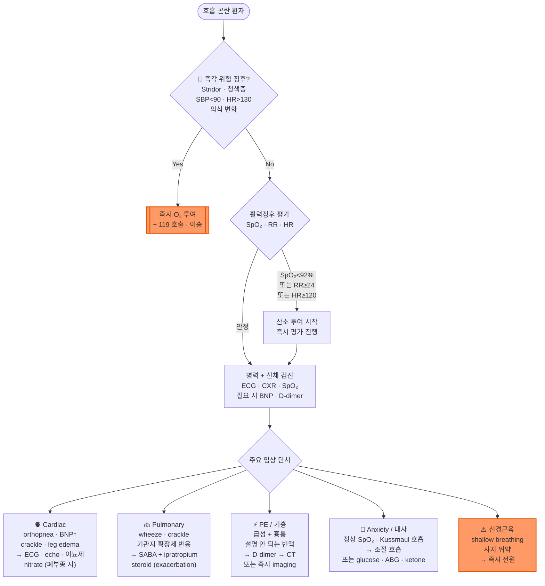

# 호흡 곤란 Dyspnea

## <mark style="color:green;">일반 사항</mark>

* 호흡 곤란 : 주관적으로 느끼는 다양한 정도의 숨가쁨
* 급성 : ≤4주
* 아급성 : 4\~8주
* 만성 : ≥8주


**호흡 곤란 병태생리 표현형 (Dyspnea Phenotype)**

진단 방향을 빠르게 좁히기 위해 표현형을 먼저 분류한다.

* **Airflow limitation** (천식, COPD) — wheeze, 기관지 확장제 반응
* **Parenchymal** (폐렴, 간질성 폐질환) — crackle, CXR 침윤
* **Circulatory** (심부전, 폐색전증) — orthopnea, BNP↑, 갑작스런 발생
* **Perception** (불안, 과호흡) — 정상 SpO₂·청진, 상황 유발


### <mark style="color:$danger;">🚩 Red Flags!</mark>

<mark style="color:$danger;">**즉각 응급 조치 및 이송**</mark>

* 저혈압(SBP ＜90 ㎜Hg or DBP ＜60 ㎜Hg)
* 청색증
* 빈호흡(＞30회/분)
* 호흡 시 부근육 사용
* 초조, 혼돈, 의식 저하
* 빈맥(＞130회/분)
* 흉통
* 흡기 시 Stridor(거친 고음성 호흡음) - 상기도 폐쇄(이물 흡인, 아나필락시스 등) 시사; 즉각 기도 확보 필요
* 휴식 중 발생 + 활력징후 이상(빈호흡, 빈맥, 저혈압, SpO₂ 저하 등) 동반
* 사지 위약·shallow breathing 동반 - 신경근육 질환 의심; 즉시 이송

<mark style="color:$warning;">**조기 평가 (당일 \~ 수일 내)**</mark>

* 휴식 중에도 발생 (활력징후 불안정 시 즉각 조치)
* 수포음(crackles), 호흡음 감소
* 발열(＞38.5℃)
* ≥65세에서 급성 발생
* 활동 저하

<mark style="color:$info;">**계획적 정밀 검사**</mark>

* 설명할 수 없는 체중 감소
* 치료에도 호전 없거나 원인 불명의 만성 호흡 곤란

## <mark style="color:green;">원인</mark>

#### <mark style="color:$primary;">호흡기계 질환 (Respiratory)</mark>

**급성**

* 호흡기 감염(예: 폐렴): 발열, 기침, 화농성 가래 동반
* 천식 또는 COPD의 급성 악화: 쌕쌕거림(wheezing), 기침 동반
* 기흉: 갑작스러운 흉통과 함께 발생
* 기도 폐쇄: 이물/음식물 흡인 병력, 급격한 질식감

**만성**

* 기도/폐질환: 천식, COPD, 결핵, 진폐증
* 흉막 질환: 반복성·만성 흉수(결핵성, 악성 등)

#### <mark style="color:$primary;">심혈관계 질환 (Cardiovascular)</mark>

**급성**

* 급성 관상동맥증후군(ACS): 흉통, 흉부 압박감, 식은땀 동반
* 급성 심부전: 공기 부족 느낌, 기좌 호흡(누우면 심해짐)
* 빈맥성 부정맥(예: 심방세동 with RVR): 심박수 급증 → 심실 충만 시간 단축 → 급성 폐부종 유발 가능; ECG로 즉시 확인
* 폐색전증: 갑자기 시작되는 흉막염성 흉통, 객혈 동반

**만성**

* 심기능 저하: 만성 심부전, 허혈성 심근병증
* 기타: 판막 질환, 만성 부정맥
* 폐혈관 질환: 폐동맥고혈압, 만성 혈전색전성 폐고혈압(CTEPH)

#### <mark style="color:$primary;">전신·기타 질환 (Systemic/Non-cardiopulmonary)</mark>

**급성**

* 아나필락시스(Anaphylaxis): 가려움, 부종, 발진, 혈압 저하 동반; 초기에는 목 조임(throat tightness)·쉰 목소리(voice change) 등 상기도 폐쇄 증상이 선행할 수 있으므로 조기 인식이 중요
* 심리적 요인: 불안 장애, 공황 장애(과호흡 동반 가능); 성대 기능 이상(Vocal Cord Dysfunction, VCD) - 흡기 시 목 주변에서 stridor(천명음)가 들리는 것이 특징; 천식과 달리 **호기** 시 wheeze가 아닌 **흡기** 시 stridor로 구별되며, 기관지 확장제에 반응하지 않음; 젊은 여성에서 빈발하며 갑작스런 onset/offset이 전형적; 후두경으로 확진
* 대사성 산증: DKA·패혈증·신부전에서 깊고 규칙적인 Kussmaul 호흡 동반; 폐 원인으로 오인하기 쉬우므로 glucose·ketone·ABG 확인

**만성**

* 대사/내과적: 빈혈(창백함 동반), 신부전(빈혈·폐부종 동반), 갑상선 질환
* 신체적/생리적: 비만, 신체 기능 저하(deconditioning; 외래 만성 호흡 곤란의 흔한 원인), 임신, 복수(가로막 압박)

#### <mark style="color:$primary;">신경근육 질환 (Neuromuscular)</mark>

* 대표 질환 : 길랭-바레 증후군(Guillain-Barré syndrome, GBS), 중증 근무력증(Myasthenia gravis, MG), 근위축성 측삭경화증(ALS)
* 특징 : 얕고 약한 호흡(shallow breathing), 역설 호흡(paradoxical respiration - 흡기 시 복부 함몰), 호흡근 위약
* 임상 단서 : 사지 위약, 구음 장애, 연하 곤란 동반; 초기에 폐 청진 및 SpO₂가 정상이어서 위험도를 과소평가하기 쉬움
* 처치 : 호흡근 침범이 확인되면 환기 부전으로 급격히 진행 가능 → 즉시 전원

#### <mark style="color:$primary;">약물 유발</mark>

* SGLT2 억제제 : 정상 혈당 범위의 당뇨병성 케톤산증(euglycemic DKA) 유발 → 대사성 산증에 의한 Kussmaul 호흡; 복통, 오심 동반 시 의심; **혈당이 정상이어도 혈중 또는 소변 ketone 확인 필수**
* Amiodarone : 폐독성(Amiodarone-induced pulmonary toxicity, AIPT); 복용 환자에서 잠행성 발병, 마른기침, 발열, 체중 감소 동반 시 의심
* Methotrexate : 간질성 폐렴

## <mark style="color:green;">진단</mark>

### <mark style="color:orange;">검사</mark>

**기본 패널 (외래 초기 평가)**

* SpO₂, 흉부 X선, ECG, CBC/anemia study, CRP, basic chemistry panel
* BNP 또는 NT-proBNP : 심부전 의심 시 시행
  * **NT-proBNP 해석 기준 (ESC 2021)**
    * Acute setting (응급·입원) : `<300 pg/㎖` → 심부전 배제 가능; 심부전 강력 시사 : `>450 pg/㎖` (＜50세), `>900 pg/㎖` (50\~75세), `>1,800 pg/㎖` (＞75세)
    * **Non-acute setting (외래·만성)** : NT-proBNP `<125 pg/㎖` 또는 BNP `<35 pg/㎖` → 심부전 배제 가능; 외래 환자에서는 이 낮은 기준치를 적용해야 과소진단을 방지할 수 있음
  * BNP 해석 주의 : 비만 환자에서는 지방조직의 BNP 분해 증가로 수치가 실제보다 낮게 측정될 수 있으므로(BNP deficiency) 심부전을 과소평가하지 않도록 주의; 반대로 고령·신부전·패혈증 환자에서는 기저치가 높아 위양성 가능성이 있음
* D-dimer : 폐색전증 저위험군에서 배제 목적으로 시행; PERC rule 음성(저위험군) 시 D-dimer 없이 PE 배제 가능 (☞ [PE 배제](002_-chest-pain.md#perc-rule-for-pulmonary-embolism-pe))
  * 위양성 주의 : 고령·암·임신부에서 기저 D-dimer가 높아 위양성이 많음; 50세 이상에서는 연령 보정 D-dimer (age × 10 ㎍/L)를 기준치로 적용하여 불필요한 CTPA를 줄일 수 있음 ([MDCalc Age-adjusted D-dimer](https://www.mdcalc.com/calc/10138/age-adjusted-d-dimer))

**선택적 시행 (확장 패널)**

* 폐 초음파(POCUS) : 외래 또는 응급 상황에서 신속 감별에 활용; **B-line ≥3개/zone(다수 구역에서 관찰)** → 간질성 증후군·폐부종 시사; focal consolidation + air bronchogram → 폐렴; lung sliding 소실 → 기흉; 심부전과 COPD 감별 시 BNP와 병용하면 정확도 향상
* 심장 초음파 : 좌심실 기능·판막 이상 평가
* PFT(폐기능 검사) : 만성 호흡 곤란에서 우선 고려 - 폐쇄성 패턴: 천식·COPD; 제한성 패턴: 간질성 폐질환·비만·흉막 질환
* ABG(동맥혈 가스 분석) : 중증 또는 CO₂ retention 의심 시; Kussmaul 호흡 + DKA/패혈증/신부전 감별 시
* CT, cardiac stress tests : 임상적 판단에 따라 선택

### <mark style="color:orange;">심장성 vs 폐성 vs 불안/과호흡 감별 진단</mark>

<table><thead><tr><th width="110">구분</th><th width="185">심장성 (Cardiac)</th><th width="185">폐성 (Pulmonary)</th><th>불안 / 과호흡 (Anxiety)</th></tr></thead><tbody><tr><td>주요 원인</td><td>심부전, ACS, 판막 질환</td><td>천식, COPD, 폐렴, 기흉</td><td>불안 장애, 공황 장애, VCD</td></tr><tr><td>발생 양상</td><td>점진적 또는 급성 (HF/ACS)</td><td>급성 또는 아급성</td><td>갑작스런 발작형; 스트레스·상황 유발</td></tr><tr><td>자세 영향</td><td>누우면 악화 (orthopnea, PND)</td><td>자세보다 유발 인자(먼지·연기) 영향</td><td>자세 무관</td></tr><tr><td>호흡 양상</td><td>얕고 빠름</td><td>wheeze / 기침 동반</td><td>깊고 빠름 (과호흡)</td></tr><tr><td>청진</td><td>crackle (폐울혈), S3</td><td>wheeze, crackle, 호흡음 감소</td><td>정상</td></tr><tr><td>흉통</td><td>압박감 (ACS)</td><td>흉막염성 통증</td><td>비특이적, 찌르는 느낌</td></tr><tr><td>동반 증상</td><td>leg edema, JVD, 핑크 거품 가래</td><td>기침, 화농성 가래, 발열</td><td>어지럼, 손발·입술 저림, 공포감</td></tr><tr><td>SpO₂</td><td>저하 가능</td><td>저하 가능</td><td>정상</td></tr><tr><td>CXR</td><td>심비대, 폐부종, Kerley B-line</td><td>침윤, 과팽창, 기흉</td><td>정상</td></tr><tr><td>BNP</td><td>상승</td><td>정상</td><td>정상</td></tr><tr><td>치료 반응</td><td>이뇨제로 호전</td><td>기관지 확장제·항생제 반응</td><td>안심·호흡 조절로 호전</td></tr></tbody></table>

\*고령 환자는 심부전과 COPD가 동반된 경우가 많아 단일 원인으로 단정하기 어렵다. BNP/NT-proBNP, 폐 초음파 B-line(≥3개/zone 이상 시 폐부종 시사), 기관지 확장제 반응을 복합적으로 평가하여 접근한다.

### <mark style="color:orange;">증상/병력에 따른 감별</mark>

#### <mark style="color:$primary;">자세/발생 시간</mark>

* 앉아서 숨을 쉬면 다소 호전 → 심부전, 비만, 위식도 역류성 천식
* 누우면 호흡 곤란 증상 악화, 발/발목 부종 → 심부전
* 야간 호흡 곤란 → 심부전, 천식
* recumbent position 시 다소 호전(편평호흡, Platypnea) → 좌심방 점액종, 간폐 증후군

#### <mark style="color:$primary;">급성</mark>

* 간헐적 → 급성 관상동맥증후군(ACS), bronchospasm, 폐색전증
* 심한 호흡 곤란, 흉통 또는 가슴 조임 → 급성 관상동맥증후군(ACS), 기흉, 폐색전증, 무기폐
  * Spontaneous pneumothorax : 일차성(기저 폐질환 없는 마른 체형의 젊은 남성에서 호발), 이차성(COPD·결핵 등 기저 폐질환 환자에서 발생; 예비 폐기능이 낮아 더 위험)
  * 폐색전증 : 갑자기 시작되는 흉막염성 흉통, 객혈 동반; 4주 내 최근 지속적인 immobilization 또는 수술 병력, estrogen 치료, DVT 위험 인자(thromboembolism, 암, 비만, 하지 외상); Wells score(사전 확률 분류 → D-dimer 또는 CTPA 결정) 또는 YEARS algorithm(hs-D-dimer와 결합하여 CTPA 필요 여부 직접 결정; CTPA 시행률 감소 효과)으로 폐색전증 확률 평가 (☞ [계산기](https://www.mdcalc.com/calc/4067/years-algorithm-for-pulmonary-embolism-pe))
* 지속적 → 폐렴, 급성 기관지염, 만성 질환의 급성 악화

#### <mark style="color:$primary;">호흡기 상태</mark>

* 쌕쌕거림, 기침 동반 → 천식, 기관지 감염
* 긴 호기 시간, 호기 시 쌕쌕거림 동반 → 폐쇄성 폐질환
* 양측 폐 하부의 수포음 → 심부전
* 빠른 호흡, 어지럼, 손/입술 주위의 감각 저하 또는 저림 → 과호흡
* 감기 증상, 점액성 가래 → 기관지염, 폐렴
* 얕고 약한 호흡 + 사지 위약 동반 → 신경근육 질환; 즉시 의뢰
* 깊고 규칙적인 과호흡(Kussmaul) → 대사성 산증; glucose·ketone·ABG 확인

#### <mark style="color:$primary;">발열</mark>

* 고열, 오한, 흉통, 농양성 객담(purulent sputum; 악취를 동반한 다량의 가래) → 폐농양
* 발열, 통증이 있는 기침, 혈성 가래 → 폐 감염, 폐암, 폐색전증
* 발열, 마른기침, 흉통, 체중 감소 → 히스토플라스마증, 진균 감염

#### <mark style="color:$primary;">전신 상태</mark>

* 만성 피로, 마른기침, 신체 활동 후 호흡 곤란 악화 → 간질성 폐질환, 폐동맥고혈압
* 만성 피로, 창백 → 빈혈
* 활동량 감소 후 서서히 발생, 다른 원인 배제 후 → 신체 기능 저하(deconditioning); 외래 만성 호흡 곤란의 흔한 원인

#### <mark style="color:$primary;">작업/환경 관련</mark>

* 일을 하지 않는 기간에는 증상 호전 → 직업적 노출
* 연기/먼지/담배 연기 등에 장기간 노출, 서서히 악화 → 만성 기관지염, COPD, 폐기종
* 석면/나무 먼지/산업용 가스/광산 등에 장기간 노출 → 직업성 폐질환


**⚠️ 1차 진료에서 흔한 진단 오류 — 주요 5가지**

1. **불안으로 성급히 단정** : 정상 SpO₂ + 젊은 환자여도 PE·arrhythmia 배제 먼저; 불안 진단은 배제 진단. 최소 rule-out 세트(SpO₂ + ECG + CXR) 의무화
2. **정상 SpO₂에 안심** : SpO₂는 산소화 지표이지 환기 상태가 아님; PE 초기·대사성 산증은 SpO₂ 정상 가능. RR(호흡수)를 더 중요하게 본다
3. **Cardiac asthma 오진** : wheeze → 천식으로만 해석하지 말 것; orthopnea·leg edema 동반 시 BNP 또는 폐 초음파(B-line) 확인
4. **신경근육 원인 간과** : GBS·MG·ALS는 초기 폐 청진 정상 → shallow breathing + 사지 위약 조합을 놓치면 급성 호흡 부전 직면; 즉시 전원
5. **단일 진단 편향(Premature closure)** : COPD + PE 동반, HF + 폐렴 등 복합 상황을 놓치지 않도록 "설명이 안 되는 소견 1개"를 항상 찾는다; 치료 반응 없으면 즉시 재평가


***

<strong>호흡 곤란 1차 진료 진단·처치 알고리듬</strong>

***

## <mark style="background-color:$warning;">Management</mark>

* 기도 확보 : 의식 저하 또는 심한 호흡 부전 시 우선 확보; 필요 시 즉시 119 호출 및 전원
* 앉은 자세 유지
* 과호흡(공황/불안) : 복식호흡 유도, 조절 호흡(pursed-lip breathing)
  * pursed-lip breathing : 코로 2초 들이쉬고, 입술을 오므린 채 4초 천천히 내쉼; 기도 내압을 높여 소기도 허탈을 방지하고 호흡수를 줄이는 효과
  * 종이 봉투 재호흡법은 저산소혈증 위험, 불안감 증폭, 심리적 의존, 오진 가능성으로 권장하지 않음
* 산소 공급 : SpO₂ 목표 및 임상 상황에 따라 투여 방식 선택
  * **일반 환자** → SpO₂ 목표 ≥92\~94%; 임신부 ≥95%
  * **CO₂ retention risk 환자** (과거 고탄산혈증 병력 있는 COPD, 신경근육 질환 등) → SpO₂ 목표 **88\~92%**; 모든 COPD에 일률 적용하지 않도록 주의 - CO₂ retention 병력이 없는 COPD는 ≥92\~94% 목표
    * 고농도 산소 투여 시 CO₂ 저류·이산화탄소 혼수 위험; 목표 범위를 초과하지 않도록 주의
      * 기전 ① 저산소성 호흡 드라이브 억제 ② V/Q 불균형 악화 ③ **Haldane 효과** - 산소가 헤모글로빈에 결합하면서 CO₂ 운반 능력이 감소하여 혈중 CO₂ 농도가 일시적으로 상승
  * 투여 방식 선택 기준
    * **비강 캐뉼러(nasal cannula)** : 1\~6 L/min; 저유량·장시간 투여에 우선 선택; SpO₂ 목표 달성 가능하면 마스크보다 편안함
    * **단순 마스크(simple face mask)** : 6\~10 L/min; 고유량 필요 시 사용; 6 L/min 미만 사용 금지(CO₂ 재호흡 위험)
    * **비재호흡 마스크(non-rebreather mask)** : 10\~15 L/min; 고농도 산소(FiO₂ ≥60%) 필요한 중증 저산소혈증 시
    * **고유량 비강 캐뉼러(HFNC)** : 2차 의료기관 이상에서 적용; COPD exacerbation·급성 저산소성 호흡 부전에서 표준 산소요법 대비 삽관율 감소 효과
* **비침습적 양압 환기(BiPAP)** : COPD exacerbation(hypercapnic) 및 급성 심인성 폐부종에서 삽관 예방 효과 입증; 2차 의료기관 이상에서 적용 또는 전원 결정의 지표로 활용; 의식 저하·구토·기도 보호 반사 소실 시 금기
* Nitrate : **급성 심인성 폐부종(acute cardiogenic pulmonary edema) 또는 협심증 의심** 시에만 적용; 일반 호흡 곤란에 루틴 사용하지 않음
  * nitroglycerin 0.6 ㎎ 설하 투여 <mark style="color:blue;">\[니트로글리세린 설하정 0.6 ㎎]</mark> (☞ [nitrate](../225_/097_-angina-pectoris.md#nitrate))
  * 금기 : SBP ＜90 ㎜Hg; PDE5 억제제(sildenafil 48시간, tadalafil 72시간 이내) 복용
  * ✽ 하벽 심근경색(inferior MI) 의심 시 우심실 경색 동반 가능성이 있으므로 투여에 주의; 우심실은 전부하(preload) 의존성이 높아 NTG로 인한 혈압 강하가 급격히 악화될 수 있음
* 이뇨제 : 폐부종에 적용; 빠른 효과를 위하여 가능하면 비경구로 투여
  * 투여 전 혈압 확인 필수 : SBP ＜90 ㎜Hg 시 투여 금기 (혈압 감소로 관류 저하 위험)
  * furosemide : 40 ㎎ IV, 1\~2분 이상 천천히 투여; 필요 시 반복 <mark style="color:blue;">\[라식스]</mark>(40 ㎎/T, 20 ㎎/A); 이뇨제 기사용 환자는 기존 경구 용량에 준하여 조정
* 빈맥(supraventricular tachycardia) : **modified Valsalva maneuver** 우선 시도(반좌위에서 15초간 Valsalva 후 즉시 상체를 눕히며(supine) 하지 45° 거상 15초 유지; 상체를 눕히는 것이 핵심 - 정맥 환류 증가로 미주신경 자극 효과 극대화; 표준 Valsalva보다 동율동 전환율 높음); 경동맥동 마사지는 죽상경화증·고령·허혈성 심질환 환자에서 피하며, 숙련된 환경에서만 시행
* 기관지 확장제
  * salbutamol(SABA) 네뷸라이저 또는 MDI <mark style="color:blue;">\[벤토린]</mark> (☞ [벤토린](../223_/071_-asthma.md#v-short-acting-inhaled-beta2-agonist-saba))
  * **COPD exacerbation 시** : ipratropium(SAMA) <mark style="color:blue;">\[아트로벤트]</mark>과 **병용**; SABA 단독보다 기관지 확장 효과 우월하며 재입원율 감소; nebulizer 또는 MDI + spacer로 투여
* Steroid : **COPD exacerbation 또는 asthma exacerbation에만 적용**; 적응증 없이 루틴 사용 금함
  * prednisolone 30\~60 ㎎/d <mark style="color:blue;">\[소론도]</mark>(5 ㎎/T), 5\~7일 단기 사용 (☞ [소론도](../223_/071_-asthma.md#undefined-50))

***

### <mark style="color:red;">질병코드</mark>

R06.0 호흡곤란

J80 성인호흡곤란증후군

***

### <mark style="color:$success;">핵심 복약 지도</mark>

> **니트로글리세린 설하정 — 협심증·급성 심인성 폐부종**
>
> * 흉통·호흡 곤란 발생 시 앉거나 누운 상태에서 혀 아래에 1정을 녹이십시오. 삼키지 마십시오.
> * 5분 후에도 증상이 지속되면 1정을 추가 복용할 수 있으며, 최대 3정까지 가능합니다. 3정 복용 후에도 증상이 지속되면 즉시 119를 부르십시오.
> * 기립성 저혈압(갑자기 일어날 때 어지럼)이 생길 수 있으므로 복용 중에는 앉거나 누운 자세를 유지하십시오.
> * 발기부전 치료제(실데나필, 타달라필 등)를 복용 중인 경우 절대 함께 사용하지 마십시오. 심각한 저혈압이 발생할 수 있습니다.
> * 직사광선과 열을 피해 보관하고, 개봉 후에는 6개월 이내에 사용하십시오.

> **살부타몰 흡입제 (벤토린) — 기관지 경련·천식·COPD 급성 악화**
>
> * 흡입 전 충분히 흔들고, 숨을 내쉰 후 흡입기를 입에 물고 천천히 깊게 들이마시면서 누르십시오.
> * 흡입 후 5\~10초간 숨을 참았다가 천천히 내쉬십시오.
> * 효과가 없거나 1회 사용 후 20\~30분 안에 증상이 다시 심해지면 병원을 방문하십시오.
> * 심장이 두근거리거나 손발이 떨리는 증상은 흔한 부작용으로 대개 일시적입니다. 심하거나 지속되면 알려 주십시오.

> **이프라트로피움 흡입제 (아트로벤트) — COPD 급성 악화**
>
> * COPD 급성 악화 시 살부타몰과 함께 사용하여 기관지를 더 효과적으로 넓혀 줍니다.
> * 눈에 들어가지 않도록 주의하십시오 — 녹내장이 있는 경우 악화될 수 있습니다.
> * 전립선 비대증이 있는 경우 소변이 더 어려워질 수 있으니 불편하면 알려 주십시오.

***

### <mark style="color:blue;">환자 안내서</mark>


**숨이 차다면 원인을 먼저 파악하는 것이 중요합니다**

호흡 곤란은 다양한 원인에 의해 발생하며, 원인에 따라 치료 방법이 달라집니다.


#### <mark style="color:$primary;">호흡 곤란이란 무엇인가요?</mark>

* 숨쉬기가 힘들거나 숨이 부족한 느낌을 말합니다
* 원인은 폐 질환(천식, COPD, 폐렴), 심장 질환(심부전, 협심증), 빈혈, 불안·공황, 비만 등 다양합니다
* 갑자기 발생하는 심한 호흡 곤란은 응급 상황일 수 있으므로 즉시 조치가 필요합니다

#### <mark style="color:$primary;">호흡이 힘들 때 즉시 이렇게 하세요</mark>

* **자세** : 앉거나 상체를 세운 자세(좌위 또는 반좌위)가 누운 자세보다 호흡에 유리합니다
* **조절 호흡** : 입술을 오므린 채로 코로 2초 들이쉬고, 입으로 4초 천천히 내쉬는 pursed-lip breathing을 시도하십시오
* **과호흡(공황)의 경우** : 종이봉투 재호흡은 위험할 수 있으므로 하지 마십시오. 조용히 앉아 복식호흡을 시도하십시오

#### <mark style="color:$primary;">생활 속 실천 사항</mark>

* **금연** : 흡연은 폐 기능을 지속적으로 손상시키는 가장 큰 원인입니다
* **체중 관리** : 과체중은 호흡 기능을 저하시킵니다
* **규칙적인 운동** : 주치의와 상의하여 본인의 상태에 맞는 운동을 꾸준히 하십시오 — 활동량이 줄어들수록 숨차는 증상이 점점 심해질 수 있습니다
* **알레르기·먼지·연기 회피** : 증상을 악화시키는 환경 요인을 피하십시오

#### <mark style="color:$primary;">이럴 때는 즉시 119를 부르거나 응급실로 가세요</mark>

* 갑자기 심한 호흡 곤란이 발생하거나, 흉통·식은땀이 동반되는 경우
* 입술이나 손발톱이 파랗게 변하는 경우 (청색증)
* 앉아 있어도 숨이 차서 말하기 어려운 경우
* 의식이 흐려지거나 기운이 없어 쓰러질 것 같은 경우
* 팔다리에 힘이 빠지거나 말이 어눌해지면서 숨이 차는 경우
