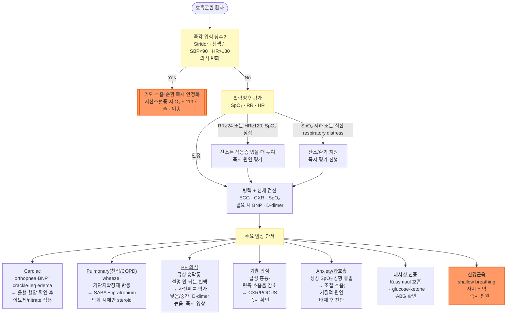

# 호흡 곤란 Dyspnea

## <mark style="color:green;">일반 사항</mark>

* 호흡곤란(dyspnea) : 주관적으로 느끼는 다양한 정도의 숨가쁨
* 정의 : 호흡 시 불편감에 대한 주관적 경험으로, 질적으로 다른 여러 감각이 다양한 강도로 나타나는 증상
* 기간에 따른 실용적 분류(문헌에 따라 기준이 다를 수 있음)
  * 급성 ≤4주, 아급성 4\~8주, 만성 ≥8주
* 유병률 : 응급실 내원 사유의 약 3\~4%를 차지
  * 지역사회 만성 호흡곤란은 고령·심폐질환 동반 인구에서 특히 흔함

#### <mark style="color:$primary;">초기 감별을 위한 임상 패턴</mark>


공식 분류 체계가 아니라, 진단 방향을 빠르게 좁히기 위한 실용적 패턴 분류임


* Airflow limitation : 천식, COPD; wheeze, 기관지 확장제에 반응
* Parenchymal : 폐렴, 간질성 폐질환; crackle, CXR 침윤
* Circulatory : 심부전, 폐색전증; orthopnea, BNP↑, 갑작스런 발생
* Breathing pattern disorder/functional dyspnea : 정상 SpO₂·청진, 상황 유발
  * 불안으로 성급히 단정하지 말고 기질적 원인을 먼저 배제한 후 판단

### <mark style="color:$danger;">🚩 Red Flags!</mark>

* SpO₂는 절대값 단독보다 평소 기저치 대비 저하, 측정 신뢰도(말초 관류·움직임·매니큐어 등), 호흡노력·임상상과의 일치 여부를 함께 고려하여 판단함

<mark style="color:$danger;">**즉각 응급 조치 및 이송**</mark>

* 쇼크 소견 : SBP ＜90 ㎜Hg 또는 말초 저관류·의식 변화를 동반하는 저혈압(DBP 단독 저하만으로는 판단하지 않음)
* 청색증
* 빈호흡(＞30회/분)
* 호흡 시 부근육 사용
* 초조, 혼돈, 의식 저하
* 빈맥(＞130회/분)
* 지속적인 압박성 흉통, 실신·식은땀·혈역학 이상이 동반된 흉통, 갑작스러운 흉막성 흉통
* 흡기 시 stridor(거친 고음성 호흡음) `상기도 폐쇄`(이물 흡인, 아나필락시스 등)
* 가능한 알레르겐 노출 후 갑작스러운 목 조임·쉰 목소리·호흡곤란·기관지경련 또는 저혈압/실신(피부 증상은 동반되지 않을 수 있음) `아나필락시스`
* 생명 위협 천식 징후 - 말을 끝까지 잇지 못함, silent chest(청진상 천명음마저 소실), 피로·의식 변화
* 휴식 중 발생 + 활력징후 이상(빈호흡, 빈맥, 저혈압, SpO₂ 저하 등) 동반
* 사지 위약·shallow breathing 동반 `신경근육 질환`

<mark style="color:$warning;">**당일 평가 또는 응급실 의뢰**</mark>

* 휴식 중에도 지속되는 호흡곤란 또는 새로 발생한 안정 시 호흡곤란; 활력징후 이상이 동반되면 Tier 1 적용
* 수포음(crackles), 호흡음 감소
* 발열(＞38.5℃) + 저산소혈증·빈호흡 동반, 또는 면역저하 상태
* ≥65세에서 급성 발생 + 전신 쇠약·의식 변화 동반
* 활동 저하가 뚜렷하고 빠르게 진행하는 경우

<mark style="color:$info;">**조기 원인 평가 및 면밀한 추적**</mark>

* 설명할 수 없는 체중 감소
* 치료에도 호전 없거나 원인 불명의 만성 호흡곤란

## <mark style="color:green;">원인</mark>

#### <mark style="color:$primary;">호흡기계 질환</mark>

**급성**

* 호흡기 감염(예: 폐렴) : 발열, 기침, 화농성 가래 동반
* 천식 또는 COPD의 급성 악화 : 쌕쌕거림(wheezing), 기침 동반
* 기흉 : 갑작스러운 흉통과 함께 발생
* 기도 폐쇄 : 이물/음식물 흡인 병력, 급격한 질식감

**만성**

* 기도/폐질환 : 천식, COPD, 결핵, 진폐증
* 흉막 질환 : 반복성·만성 흉수(결핵성, 악성 등)

#### <mark style="color:$primary;">심혈관계 질환</mark>

**급성**

* 급성 관상동맥증후군(ACS) : 흉통, 흉부 압박감, 식은땀 동반
* 급성 심부전 : 공기 부족 느낌, 기좌 호흡(누우면 심해짐)
* 빈맥성 부정맥(예: 심방세동 with RVR) : 심박수 급증 → 심실 충만 시간 단축 → 급성 폐부종 유발 가능; ECG로 즉시 확인
* 폐색전증 : 갑자기 시작되는 흉막염성 흉통, 객혈 동반
* 심낭압전(cardiac tamponade) : 대량 심낭삼출 또는 급속 축적 시 발생
  * 경정맥압 상승(JVD), 심음 감소(muffled heart sound), pulsus paradoxus(흡기 시 SBP ＞10 ㎜Hg 하강) 동반 시 강력 의심 → 즉시 심장 초음파 확인 및 응급 심낭천자 고려

**만성**

* 심기능 저하 : 만성 심부전, 허혈성 심근병증
* 기타 : 판막 질환, 만성 부정맥
* 폐혈관 질환 : 폐동맥고혈압, 만성 혈전색전성 폐고혈압(CTEPH)

#### <mark style="color:$primary;">전신·기타 질환 (Systemic/Non-cardiopulmonary)</mark>

**급성**

* 아나필락시스(Anaphylaxis) : 가능한 알레르겐 노출 후 갑작스러운 상기도 폐쇄·기관지경련 또는 저혈압/실신(피부 증상은 동반되지 않을 수 있음)
  * 초기에는 목 조임(throat tightness)·쉰 목소리(voice change) 등 상기도 폐쇄 증상이 선행할 수 있으므로 조기 인식이 중요
* 심리적 요인 : 불안 장애, 공황 장애(과호흡 동반 가능)
* Inducible laryngeal obstruction(ILO; 과거 Vocal cord dysfunction) : 갑작스러운 흡기성 호흡곤란, 목 조임(throat tightness), 흡기 시 stridor가 특징
  * 천식으로 오인될 수 있으며 기관지 확장제에 반응하지 않을 수 있음
  * 증상 시 또는 유발검사를 포함한 후두경으로 확인
* 대사성 산증 : DKA·패혈증·신부전에서 깊고 규칙적인 Kussmaul 호흡 동반
  * 폐 원인으로 오인하기 쉬우므로 glucose·ketone·ABG 확인

**만성**

* 대사/내과적 : 빈혈(창백함 동반), 신부전(빈혈·폐부종 동반), 갑상선 질환
* 신체적/생리적 : 신체 기능 저하(deconditioning - 외래 만성 호흡곤란의 흔한 원인), 비만, 임신, 복수(가로막 압박)

#### <mark style="color:$primary;">신경근육 질환 (Neuromuscular)</mark>

* 대표 질환 : 길랭-바레 증후군, 중증 근무력증, 근위축성 측삭경화증
* 특징 : 얕고 약한 호흡, 역설 호흡(paradoxical respiration - 흡기 시 복부 함몰), 호흡근 위약
* 임상 단서 : 사지 위약, 구음 장애, 연하 곤란 동반; 초기에 폐 청진 및 SpO₂가 정상이어서 위험도를 과소평가하기 쉬움
* 평가/처치 : SpO₂가 정상이어도 환기 부전을 배제할 수 없으므로 FVC(forced vital capacity) 및 NIF/MIP(negative inspiratory force / maximal inspiratory pressure)를 조기에 측정하고 추세를 평가
  * 호흡근 침범이 확인되면 급격히 진행 가능 → 즉시 전원

#### <mark style="color:$primary;">약물 유발</mark>

* SGLT2 억제제 : 정상 혈당 범위의 당뇨병성 케톤산증(euglycemic DKA) 유발 → 대사성 산증에 의한 Kussmaul 호흡
  * 복통, 오심 동반 시 의심
  * 혈당이 정상이어도 혈중 또는 소변 ketone 확인 필수
* Amiodarone : 폐독성(Amiodarone-induced pulmonary toxicity, AIPT)
  * 복용 환자에서 잠행성 발병, 마른기침, 발열, 체중 감소 동반 시 의심
* Methotrexate : 간질성 폐렴
* 항암치료 관련 : immune checkpoint inhibitor-associated pneumonitis, bleomycin 등
  * 항암치료 중 새로 발생한 마른기침·호흡곤란·저산소혈증에서 약물성 폐렴 고려

## <mark style="color:green;">진단</mark>

### <mark style="color:orange;">검사</mark>

<mark style="color:cyan;">**mMRC Dyspnea Scale (Modified Medical Research Council)**</mark>

* 활동에 따른 호흡곤란의 기능적 제한 정도를 평가하는 도구
* 0\~4점, 점수가 높을수록 제한이 심함
  * 0점 : 힘든 운동을 할 때만 숨이 참
  * 1점 : 평지에서 빨리 걷거나 약간 오르막을 걸을 때 숨이 참
  * 2점 : 동년배보다 평지에서 천천히 걷거나, 자기 속도로 걸어도 숨이 차서 멈춰야 함
  * 3점 : 평지에서 약 100 m 또는 몇 분 걷고 나면 숨이 차서 멈춤
  * 4점 : 숨이 너무 차서 외출이 어렵거나 옷을 입고 벗을 때도 숨이 참
* 활용 : GOLD ABE 그룹 분류에서 증상 부담 축(악화력과 함께 평가)으로 사용 \[GOLD 2026]

<mark style="color:cyan;">**기본 패널**</mark> (외래 초기 평가)

* SpO₂, 흉부 X선, ECG, CBC/anemia study, CRP, basic chemistry panel
* BNP 또는 NT-proBNP : 심부전 의심 시 시행
  * NT-proBNP 해석 기준 \[ESC 2021]
    * Acute setting (응급·입원) : ＜300 pg/㎖ 시 심부전 배제 가능
      * rule-in cut-off : ＞450 pg/㎖ (＜50세), ＞900 pg/㎖ (50\~75세), ＞1,800 pg/㎖ (＞75세)
    * Non-acute setting (외래·만성) : NT-proBNP ＜125 pg/㎖ 또는 BNP ＜35 pg/㎖ 시 심부전 배제 가능
      * 외래 환자에서는 이 낮은 기준치를 적용해야 과소 진단을 방지할 수 있음
  * BNP/NT-proBNP 해석 주의
    * 비만 환자에서는 수치가 실제보다 낮게 측정될 수 있어 심부전을 과소평가하지 않도록 주의
    * 고령·심방세동·신부전·패혈증 등에서는 기저치가 높아질 수 있으므로 단독으로 심부전을 확진하지 않음
* D-dimer : 임상적 사전확률에 따라 단계적으로 적용
  * 초저위험 사전확률 : PERC rule이 모두 음성이면 D-dimer 없이 [PE 배제](002_-chest-pain.md#perc-rule-for-pulmonary-embolism-pe) 가능
  * 낮음\~중간 사전확률 : D-dimer를 우선 시행하여 배제 여부 판단
  * 높은 사전확률 : D-dimer로 영상검사를 지연시키지 않고 바로 CTPA(CT Pulmonary Angiography) 등 영상검사 진행
  * 위양성 주의
    * 고령·암·임신부에서 기저 D-dimer가 높아 위양성이 많음
    * 50세 이상에서는 연령 보정 [D-dimer](https://www.mdcalc.com/calc/10138/age-adjusted-d-dimer)(age × 10 ㎍/L, FEU 기준)를 적용하여 불필요한 CTPA를 줄일 수 있음
    * 연령 보정 D-dimer와 YEARS의 임상확률 보정 절단값은 서로 다른 개념이므로 혼용하지 않음
  * 단위 확인 : 검사실마다 FEU(fibrinogen equivalent unit) 또는 DDU(D-dimer unit) 기준이 달라 절단치 해석 시 반드시 단위를 확인

<mark style="color:cyan;">**선택적 시행**</mark> (확장 패널)

* 폐 초음파(POCUS) : 외래 또는 응급 상황에서 신속 감별에 활용
  * B-line ≥3개/zone이 양측성·미만성·다구역으로 관찰되면 간질성 증후군·폐부종을 지지하나 단독으로 확진하지 않음(ILD·ARDS·폐렴 등에서도 관찰 가능)
  * focal consolidation + air bronchogram → 폐렴 의심
  * lung sliding 소실 → 기흉 의심(무기폐·흉막 유착·apnea 등에서도 나타날 수 있으므로 lung point 등 추가 소견과 임상상으로 판단)
  * 심부전과 COPD 감별 시 BNP와 병용하면 정확도 향상
* 심장 초음파 : 좌심실 기능·판막 이상 평가
* PFT(폐기능 검사) : 만성 호흡곤란에서 우선 고려
  * 폐쇄성 패턴 : 천식·COPD
  * 제한성 패턴(의심) : 스피로메트리에서 FVC 저하 + FEV₁/FVC 보존 소견은 제한성 장애를 "의심"할 뿐이며, TLC 감소로 확진(간질성 폐질환·비만·흉막 질환 등)
* 만성 원인불명 호흡곤란 단계적 평가 : bronchodilator spirometry → lung volume → DLCO 순으로 단계적 고려
  * 갑상선기능(TSH), 철결핍 평가(빈혈 의심 시) 병행
* 운동 시 증상 : 보행 중 SpO₂ 변화 또는 6분 보행검사(6MWT)로 운동유발 저산소혈증 평가
* ABG(동맥혈 가스 분석) : 중증 또는 CO₂ retention 의심 / Kussmaul 호흡 + DKA/패혈증/신부전 감별 시 시행
* 기본 검사로 원인이 불명확한 경우 : HRCT, 심장 초음파, CPET(심폐운동부하검사) 고려
* 폐동맥고혈압 의심 시 : 심장 초음파 후 순환기/호흡기 전문기관 정밀 평가
* CT, cardiac stress tests : 임상적 판단에 따라 선택

### <mark style="color:orange;">심장성 vs 폐성 vs 불안/과호흡 감별 진단</mark>

<table data-search="false"><thead><tr><th width="110">구분</th><th width="185">심장성 (Cardiac)</th><th width="185">폐성 (Pulmonary)</th><th>불안 / 과호흡 (Anxiety)</th></tr></thead><tbody><tr><td>주요 원인</td><td>심부전, ACS, 판막 질환</td><td>천식, COPD, 폐렴, 기흉</td><td>불안 장애, 공황 장애</td></tr><tr><td>발생 양상</td><td>점진적 또는 급성 (HF/ACS)</td><td>급성 또는 아급성</td><td>갑작스런 발작형; 스트레스·상황 유발</td></tr><tr><td>자세 영향</td><td>누우면 악화 (orthopnea, PND)</td><td>자세보다 유발 인자(먼지·연기) 영향</td><td>자세 무관</td></tr><tr><td>호흡 양상</td><td>얕고 빠름</td><td>wheeze / 기침 동반</td><td>깊고 빠름 (과호흡)</td></tr><tr><td>청진</td><td>crackle (폐울혈), S3</td><td>wheeze, crackle, 호흡음 감소</td><td>정상</td></tr><tr><td>흉통</td><td>압박감 (ACS)</td><td>흉막염성 통증</td><td>비특이적, 찌르는 느낌</td></tr><tr><td>동반 증상</td><td>leg edema, JVD, 핑크 거품 가래</td><td>기침, 화농성 가래, 발열</td><td>어지럼, 손발·입술 저림, 공포감</td></tr><tr><td>SpO₂</td><td>저하 가능</td><td>저하 가능</td><td>정상</td></tr><tr><td>CXR</td><td>심비대, 폐부종, Kerley B-line</td><td>침윤, 과팽창, 기흉</td><td>정상</td></tr><tr><td>BNP</td><td>상승</td><td>정상</td><td>정상</td></tr><tr><td>치료 반응</td><td>이뇨제로 호전</td><td>기관지 확장제·항생제 반응</td><td>안심·호흡 조절로 호전</td></tr></tbody></table>

✽_위 표는 전형적 경향을 정리한 것으로 단독 소견으로 배제·확진하지 않는다: BNP는 폐색전증·폐고혈압·우심부전·중증 COPD에서도 상승할 수 있고, 초기 심부전·폐색전증·천식에서도 CXR가 정상일 수 있다; "이뇨제·기관지확장제·항생제 반응"은 진단 검사가 아니라 치료적 시도로 해석한다._

✽_ILO(Inducible Laryngeal Obstruction, 과거 VCD)는 불안장애가 아닌 독립적인 상기도 질환으로 위 표의 불안/과호흡 범주에 포함되지 않는다; 흡기 시 stridor·목 조임이 특징이며 증상 시 또는 유발검사를 포함한 후두경으로 확인한다._

✽_고령 환자는 심부전과 COPD가 동반된 경우가 많아 단일 원인으로 단정하기 어렵다. BNP/NT-proBNP, 폐 초음파 B-line(양측성·미만성·다구역 관찰 시 폐부종 시사), 기관지 확장제 반응을 복합적으로 평가하여 접근한다._

### <mark style="color:orange;">증상/병력에 따른 감별</mark>

#### <mark style="color:$primary;">자세/발생 시간</mark>

* 앉아서 숨을 쉬면 다소 호전 → 심부전, 비만, 위식도 역류성 천식
* 누우면 호흡곤란 증상 악화, 발/발목 부종 → 심부전
* 야간 호흡곤란 → 심부전, 천식
* recumbent position 시 호전 → 간폐 증후군, PFO/ASD 등 intracardiac right-to-left shunt, 폐동정맥기형

#### <mark style="color:$primary;">급성</mark>

* 간헐적, 특별한 상황에서 발생 → bronchospasm(천식 등)
  * ACS·폐색전증은 일반적으로 간헐적이라기보다 급성·지속적 양상으로 발현
* 심한 호흡곤란, 흉통 또는 가슴 조임 → 급성 관상동맥증후군(ACS), 기흉, 폐색전증, 무기폐
  * Spontaneous pneumothorax
    * 일차성 : 기저 폐질환 없는 마른 체형의 젊은 남성에서 호발
    * 이차성 : COPD·결핵 등 기저 폐질환 환자에서 발생; 예비 폐기능이 낮아 더 위험
  * 폐색전증 : 갑자기 시작되는 흉막염성 흉통, 객혈 동반
    * 4주 내 최근 지속적인 immobilization 또는 수술 병력, estrogen 치료, DVT 위험 인자(thromboembolism, 암, 비만, 하지 외상)
    * [Wells score](002_-chest-pain.md#wells-score)(사전 확률 분류 → D-dimer 또는 CTPA 결정) 또는 [YEARS](https://www.mdcalc.com/calc/4067/years-algorithm-for-pulmonary-embolism-pe) algorithm(3개 임상 항목과 D-dimer cut-off를 결합하여 CTPA 필요 여부 결정; CTPA 시행률 감소 효과)으로 폐색전증 확률 평가
    * 임신부에서는 pregnancy-adapted YEARS algorithm 고려
* 지속적 → 폐렴, 만성 질환의 급성 악화
  * 뚜렷한 호흡곤란이 두드러지면 천식/COPD 악화·심부전 등을 우선 재평가 (단순 급성 기관지염은 뚜렷한 호흡곤란의 흔한 설명이 아님)

#### <mark style="color:$primary;">호흡기 상태</mark>

* 쌕쌕거림, 기침 동반 → 천식, 기관지 감염
* 긴 호기 시간, 호기 시 쌕쌕거림 동반 → 폐쇄성 폐질환
* 양측 폐 하부의 수포음 → 심부전
* 빠른 호흡, 어지럼, 손/입술 주위의 감각 저하 또는 저림 → 과호흡
* 감기 증상, 점액성 가래 → 기관지염, 폐렴
* 얕고 약한 호흡 + 사지 위약 동반 → 신경근육 질환
* 깊고 규칙적인 과호흡(Kussmaul) → 대사성 산증

#### <mark style="color:$primary;">발열</mark>

* 고열, 오한, 흉통, 농성 객담 → 악취를 동반하면 혐기성 감염·폐농양 시사
* 발열, 통증이 있는 기침, 혈성 가래 → 폐 감염, 폐암, 폐색전증
* 발열, 마른기침, 흉통, 체중 감소 → 결핵, 폐암, 아급성 폐 감염; 여행·지역 노출 또는 면역저하 시 진균 감염 고려

#### <mark style="color:$primary;">전신 상태</mark>

* 만성 피로, 마른기침, 신체 활동 후 호흡곤란 악화 → 간질성 폐질환, 폐동맥고혈압
* 만성 피로, 창백 → 빈혈
* 활동량 감소 후 서서히 발생, 다른 원인 배제 후 → 신체 기능 저하(deconditioning); 외래 만성 호흡곤란의 흔한 원인

#### <mark style="color:$primary;">작업/환경 관련</mark>

* 일을 하지 않는 기간에는 증상 호전 → 직업적 노출
* 연기/먼지/담배 연기 등에 장기간 노출, 서서히 악화 → 만성 기관지염, COPD, 폐기종
* 석면/나무 먼지/산업용 가스/광산 등에 장기간 노출 → 직업성 폐질환

***


```mermaid
graph TD
    A([호흡곤란 환자]) --> B["즉각 위험 징후?<br/>Stridor · 청색증<br/>SBP<90 · HR>130<br/>의식 변화"]
    B -->|Yes| C[["기도·호흡·순환 즉시 안정화<br/>저산소혈증 시 O₂ + 119 호출 · 이송"]]
    B -->|No| D["활력징후 평가<br/>SpO₂ · RR · HR"]
    D -->|SpO₂ 저하 또는 심한 respiratory distress| E["산소/환기 지원<br/>즉시 평가 진행"]
    D -->|RR≥24 또는 HR≥120, SpO₂ 정상| M["산소는 적응증 있을 때 투여<br/>즉시 원인 평가"]
    D -->|안정| F["병력 + 신체 검진<br/>ECG · CXR · SpO₂<br/>필요 시 BNP · D-dimer"]
    M --> F
    E --> F
    F --> G[주요 임상 단서]
    G --> H["<u>Cardiac</u><br/>orthopnea·BNP↑<br/>crackle·leg edema<br/>→ 울혈·혈압 확인 후<br/>이뇨제/nitrate 적용"]
    G --> I["<u>Pulmonary(천식/COPD)</u><br/>wheeze·<br/>기관지확장제 반응<br/>→ SABA ± ipratropium<br/>악화 시에만 steroid"]
    G --> J["<u>PE 의심</u><br/>급성 흉막통·<br/>설명 안 되는 빈맥<br/>→ 사전확률 평가<br/>낮음/중간: D-dimer<br/>높음: 즉시 영상"]
    G --> N["<u>기흉 의심</u><br/>급성 흉통·<br/>편측 호흡음 감소<br/>→ CXR/POCUS <br/>즉시 확인"]
    G --> K1["<u>Anxiety/과호흡</u><br/>정상 SpO₂·상황 유발<br/>→ 조절 호흡;<br/> 기질적 원인<br/>배제 후 진단"]
    G --> K2["<u>대사성 산증</u><br/>Kussmaul 호흡<br/>→ glucose·ketone<br/>·ABG 확인"]
    G --> L["<u>신경근육</u><br/>shallow breathing<br/>사지 위약<br/>→ 즉시 전원"]
    style C fill:#f96,stroke:#e65100,stroke-width:2px
    style L fill:#f96,stroke:#e65100,stroke-width:2px

classDef yellow fill:#fff9c4,stroke:#ffe082
class B,D,G yellow
```

<p align="center"><strong>호흡곤란 진단·처치 알고리듬</strong></p>

<p align="center"><em><mark style="color:$info;">저자 재작성 (관련 문헌 ESC 2021/2026 Heart Failure Guideline; BTS Emergency Oxygen Guideline (2017); GOLD/GINA 2026 Exacerbation Management; 2026 AHA/ACC Acute PE Guideline 등; NT-proBNP 절단치는 ESC 2021 기준 유지)</mark></em></p>

#### <mark style="color:$primary;">**1차 진료에서 흔한 진단 오류**</mark>

* **불안으로 성급히 단정** : 정상 SpO₂ + 젊은 환자여도 위험 원인을 임상적으로 충분히 배제한 뒤 진단
  * SpO₂·활력징후를 확인하고 흉통·심계항진·PE 위험 인자·비정상 진찰 소견 등에 따라 ECG, CXR, D-dimer 등을 선택
* **정상 SpO₂에 안심** : SpO₂는 산소화 지표이지 환기 상태가 아님
  * PE 초기·대사성 산증은 SpO₂ 정상 가능하며, RR(호흡수)를 더 중요하게 간주
* **Cardiac asthma 오진** : wheeze → 천식으로만 해석하지 말 것
  * orthopnea·leg edema 동반 시 BNP 또는 폐 초음파(B-line) 확인
* **신경근육 원인 간과** : GBS·MG·ALS는 초기 폐 청진·SpO₂가 정상일 수 있음
  * shallow breathing + 사지 위약을 놓치지 말고 FVC/NIF(MIP)를 조기에 평가; 악화 시 즉시 전원
* **단일 진단 편향(Premature closure)** : COPD + PE 동반, HF + 폐렴 등 복합 상황을 놓치지 않도록 "설명이 안 되는 소견 1개"를 찾음; 치료 반응 없으면 즉시 재평가

***

## <mark style="background-color:$warning;">Management</mark>

* 기도 확보 : 의식 저하 또는 심한 호흡 부전 시 우선 확보; 필요 시 즉시 119 호출 및 전원
* 앉은 자세 유지(대부분의 호흡곤란); 단, 쇼크·저혈압 또는 아나필락시스가 의심되면 해당 질환의 체위 원칙(눕히고 다리 거상 등)을 따름
* 과호흡(공황/불안) 관리 : 복식호흡 유도, 조절 호흡(pursed-lip breathing)
  * pursed-lip breathing : 코로 2초 들이쉬고, 입술을 오므린 채 4초 천천히 내쉼
    * 기도 내압을 높여 소기도 허탈을 방지하고 호흡수를 줄이는 효과
  * 종이 봉투 재호흡법은 저산소혈증 위험, 불안감 증폭, 심리적 의존, 오진 가능성으로 권장하지 않음
* 산소 공급 : SpO₂ 목표 및 임상 상황에 따라 투여 방식 선택
  * 저산소혈증이 있는 일반 환자 → SpO₂ 목표 94\~98%; 임신부는 일반적으로 ≥95% 유지
  * CO₂ retention risk 환자 (과거 고탄산혈증 병력 있는 COPD, 신경근육 질환 등) → ABG 확인 전 SpO₂ 잠정 목표 88\~92%
  * 고농도 산소 투여 시 CO₂ 저류·이산화탄소 혼수 위험
    * 기전 ⓵ V/Q 불균형 악화(저산소성 폐혈관수축 소실로 관류가 환기 불량 부위로 재분배) ⓶ Haldane 효과 - 산소가 헤모글로빈에 결합하면서 CO₂ 운반 능력이 감소하여 혈중 CO₂ 농도가 일시적으로 상승 ⓷ 저산소성 호흡 드라이브 억제(상대적으로 비중이 작은 기전)
  * 목표 범위를 초과하지 않도록 주의
  * ACS·급성 심부전 등에서는 비저산소혈증 환자에게 산소를 routine으로 투여하지 않음
  * 투여 방식 선택 기준
    * 비강 캐뉼러(nasal cannula) : 1\~6 L/min; 저유량·장시간 투여에 우선 선택; SpO₂ 목표 달성 가능하면 마스크보다 편함
    * 단순 마스크(simple face mask) : 일반적으로 5\~10 L/min(제품에 따라 최소 6 L/min을 권장하는 경우도 있음); 낮은 유량에서는 CO₂ 재호흡 위험이 있으므로 제품 사용 지침 확인
    * 비재호흡 마스크(non-rebreather mask) : 10\~15 L/min; 고농도 산소(FiO₂ ≥60%)가 필요한 중증 저산소혈증 시
    * 고유량 비강 캐뉼러(HFNC) : 2차 의료기관 이상에서 적용; 급성 저산소성 호흡 부전에서 고려. COPD 급성 악화에서는 선택적으로 사용할 수 있으나, 급성 고탄산혈증성 호흡 부전에서는 NIV가 우선이며 HFNC가 NIV를 대체하지 않음
  * 비침습적 양압 환기(NIV; CPAP 또는 bilevel PAP) : 고탄산혈증을 동반한 COPD 급성 악화 및 급성 심인성 폐부종에서 우선 고려; 2차 의료기관 이상에서 적용 또는 전원 결정의 지표로 활용. 기도 보호 불가, 지속적 구토/흡인 위험, 심한 의식 저하, 혈역학적 불안정/쇼크 등에서는 적용이 부적절하거나 실패 위험이 높아 조기 invasive airway/전원 고려
* [Nitrate](../225_/097_-angina-pectoris.md#nitrate) : 급성 심인성 폐부종 또는 협심증 의심 시에만 적용; 일반 호흡곤란에 루틴 사용하지 않음
  * nitroglycerin 0.6 ㎎ 설하 투여 <mark style="color:blue;">\[명문니트로글리세린설하정 0.6 ㎎]</mark>
  * 금기 : SBP ＜90 ㎜Hg; PDE5 억제제(sildenafil 24시간, tadalafil 48시간 이내) 복용
  * 하벽 심근경색(inferior MI) 의심 시 우심실 경색 동반 가능성이 있으므로 투여에 주의; 우심실은 preload 의존성이 높아 NTG로 인한 혈압 강하가 급격히 악화될 수 있음
* 이뇨제 : 폐부종에 적용; 빠른 효과를 위하여 가능하면 비경구로 투여
  * 투여 전 혈압 확인 필수 : SBP ＜90 ㎜Hg 등 쇼크·저관류 소견이 있으면 임의 투여하지 않고 즉시 전원
  * furosemide 40 ㎎ IV (= 20 ㎎/2 ㎖ × 2 앰플), 1\~2분 이상 천천히 투여; 필요 시 반복 <mark style="color:blue;">\[라식스주사 20 ㎎/2 ㎖]</mark>; 이뇨제 기사용 환자는 기존 경구 용량에 준하여 조정
* 빈맥 관리(혈역학적으로 안정된 규칙적 narrow-QRS SVT에 한정)
  * modified Valsalva maneuver 우선 시도(반좌위에서 15초간 Valsalva 후 즉시 상체를 눕히며(supine) 하지 45° 거상 15초 유지; 상체를 눕히는 것이 핵심 - 정맥 환류 증가로 미주신경 자극 효과 극대화; 표준 Valsalva보다 동율동 전환율 높음)
  * 경동맥동 마사지는 죽상경화증·고령·허혈성 심질환 환자에서 피하며, 숙련된 환경에서만 시행
  * 혈역학적으로 불안정(저혈압·의식 변화 동반)하면 즉시 동기화 심율동전환(synchronized cardioversion)이 가능한 기관으로 이송
* 기관지 확장제
  * salbutamol(SABA) : nebulizer 2.5\~5 ㎎ 또는 MDI + spacer <mark style="color:blue;">\[</mark>[벤토린](../223_/071_-asthma.md#v-short-acting-inhaled-beta2-agonist-saba)<mark style="color:blue;">]</mark>
  * 중증 천식 악화 또는 COPD exacerbation 시 : ipratropium(SAMA) nebulizer 0.5 ㎎ 또는 MDI + spacer <mark style="color:blue;">\[아트로벤트]</mark> 병용 고려(경증\~중등도 천식 악화에는 일률 병용하지 않음); 자세한 반복 간격·흡입 용량은 COPD 챕터 참조
* Steroid : COPD exacerbation 또는 asthma exacerbation에만 적용; 적응증 없이 루틴 사용 금함
  * [천식](../223_/071_-asthma.md) 급성 악화 : prednisolone 40\~50 ㎎/d <mark style="color:blue;">\[</mark>[소론도](../223_/071_-asthma.md#undefined-50)<mark style="color:blue;">]</mark>(5 ㎎/T), 5\~7일
  * [COPD](../223_/072_-copd.md) 급성 악화 : prednisone-equivalent 40 ㎎/d, 5일

***

### <mark style="color:red;">질병코드</mark>

* R06.0 호흡곤란

***

## <mark style="color:purple;">처방례</mark>

> **처방례 1. 급성 심인성 폐부종 / 협심증 의심**
>
> ```
> 명문니트로글리세린설하정 0.6 ㎎ 1정 설하
> ※ 협심증 병력 없이 새로 발생한 흉통·호흡곤란이면 1회 투여, 5분 내 호전 없으면 즉시 119 호출
> ※ 기존 진단된 협심증의 전형적 발작인 경우, 119 호출 후 기다리는 동안 5분 간격 최대 3회까지 투여 가능
> ```
>
> _✽SBP ＜90 ㎜Hg이거나 최근 24\~48시간 이내 PDE5 억제제(sildenafil 24시간, tadalafil 48시간 이내)를 복용한 경우 금기; 첫 투여 후 5분 내 완전히 또는 평소처럼 신속하게 소실되지 않으면 즉시 119 호출(부분 호전만으로 대기하지 않음); 니트로글리세린에 대한 반응 여부를 심근허혈 진단의 근거로 사용하지 않음._

> **처방례 2. 천식/COPD 급성 악화**
>
> ```
> 벤토린 에보할러(MDI) 100 mcg/puff 2~4 puff(spacer 사용) 필요시 반복
> 아트로벤트 에보할러(MDI) 20 mcg/puff 2 puff 살부타몰과 병용(중증 천식 악화 또는 COPD 악화 시)
> ```
>
> _✽기관지 확장제에 반응이 없거나 저산소혈증이 동반되면 즉시 재평가; steroid 병용 여부 및 상세 반복 간격·용량은_ [_천식_](../223_/071_-asthma.md)_/_[_COPD_](../223_/072_-copd.md) _챕터 참조; 네뷸라이저가 필요한 중증 상황이라면 해당 제형·용량으로 대체_

> **처방례 3. 아나필락시스 의심(상기도 폐쇄 증상 동반)**
>
> ```
> 에피네프린(1 ㎎/㎖) 0.01 ㎎/㎏ IM, 성인 최대 0.5 ㎎/회 대퇴 외측 근육주사, 즉시
> ※ 투여 즉시 119 호출(호전 여부를 기다리지 않음)
> ※ 5분 후에도 기도·호흡·순환 문제가 지속되면 반복 투여
> ```
>
> _✽자동주사기 사용 시 제품별 허가 체중 구간에 따라 용량 선택(예: 0.15 ㎎/0.3 ㎎ 등); 피부 증상(두드러기 등)이 없어도 아나필락시스를 배제하지 않음; 자세는 눕히고 다리를 올린 상태를 유지하되(저혈압형), 호흡곤란이 주된 경우에만 다리를 뻗은 반좌위 허용 - 서거나 걷게 하지 않음; 증상 호전 후에도 최소 4시간 이상 관찰(반복 투여·중증 천식 동반·야간 내원 등은 연장 또는 입원 관찰; biphasic reaction 대비)._

***

### <mark style="color:$success;">핵심 복약 지도</mark>

> **니트로글리세린 설하정 - 협심증·급성 심인성 폐부종**
>
> * 흉통·호흡곤란 발생 시 앉거나 누운 상태에서 혀 아래에 1정을 녹이십시오. 삼키지 마십시오.
> * 평소와 다르거나 처음 겪는 양상의 흉통이면, 1정 복용 후 5분 내 호전이 없을 시 추가로 복용하지 말고 즉시 119를 부르십시오.
> * 기존에 진단받은 협심증의 전형적인 발작이라도, 1정 복용 후 5분 내 완전히 또는 평소처럼 신속하게 좋아지지 않으면 곧바로 119를 부르십시오. 추가로 복용할 정이 있다면 119를 부른 뒤 기다리는 동안 5분 간격으로 최대 3정까지 복용할 수 있습니다.
> * 기립성 저혈압(갑자기 일어날 때 어지럼)이 생길 수 있으므로 복용 중에는 앉거나 누운 자세를 유지하십시오.
> * 발기부전 치료제(실데나필, 타달라필 등)를 복용 중인 경우 절대 함께 사용하지 마십시오. 심각한 저혈압이 발생할 수 있습니다.
> * 직사광선과 열을 피해 보관하고, 개봉 후에는 6개월 이내에 사용하십시오.

> **살부타몰 흡입제 (벤토린) - 기관지 경련·천식·COPD 급성 악화**
>
> * 흡입 전 충분히 흔들고, 숨을 내쉰 후 흡입기를 입에 물고 천천히 깊게 들이마시면서 누르십시오. 가능하면 spacer를 사용하면 흡입 효율이 높아집니다.
> * 흡입 후 5\~10초간 숨을 참았다가 천천히 내쉬십시오.
> * 효과가 없거나 1회 사용 후 20\~30분 안에 증상이 다시 심해지면 병원을 방문하십시오. 말을 잇지 못할 정도로 숨이 차거나 입술이 파랗게 변하는 등 심한 증상이면 병원 방문을 기다리지 말고 즉시 119를 부르십시오.
> * 심장이 두근거리거나 손발이 떨리는 증상은 흔한 부작용으로 대개 일시적입니다. 심하거나 지속되면 알려 주십시오.

> **이프라트로피움 흡입제 (아트로벤트) - COPD 급성 악화**
>
> * COPD 급성 악화 시 살부타몰과 함께 사용하여 기관지를 더 효과적으로 넓혀 줍니다.
> * 눈에 들어가지 않도록 주의하십시오 - 녹내장이 있는 경우 악화될 수 있습니다.
> * 전립선 비대증이 있는 경우 소변이 더 어려워질 수 있으니 불편하면 알려 주십시오.

> **에피네프린 자동주사기 (에피펜) - 아나필락시스**
>
> * 목 조임, 쉰 목소리, 전신 두드러기, 어지럼 등 아나필락시스 징후가 나타나면 지체 없이 대퇴 외측 근육에 주사하고, 호전 여부를 기다리지 말고 곧바로 119를 부르십시오. 옷 위에서도 주사할 수 있습니다.
> * 두드러기 같은 피부 증상이 없어도 아나필락시스일 수 있으니, 목 조임·호흡곤란·어지럼 등이 있으면 주저하지 마십시오.
> * 자세 : 눕고 다리를 올린 상태를 유지하십시오. 숨이 많이 찬 경우에는 다리를 편 채로 앉을 수 있으나, 서거나 걷지 마십시오(혈압이 급격히 떨어질 수 있습니다).
> * 5분 후에도 증상이 지속되면 두 번째 주사를 고려하십시오.
> * 증상이 호전되어도 반드시 응급실을 방문하여 최소 4시간 이상 관찰하십시오(반복 투여, 중증 천식 동반, 야간 내원 등은 더 길게 관찰). 초기 호전 후 수 시간 뒤 증상이 재발할 수 있습니다(biphasic reaction).
> * 사용한 자동주사기는 재사용하지 말고 그대로(바늘을 따로 만지거나 제거하지 말고) 보관하여 구급대원이나 의료진에게 전달하십시오.

***

## <mark style="color:blue;">환자 안내서</mark>


**숨이 차다면 원인을 먼저 파악하는 것이 중요합니다**

호흡곤란은 다양한 원인에 의해 발생하며, 원인에 따라 치료 방법이 달라집니다.


#### <mark style="color:$primary;">호흡곤란이란 무엇인가요?</mark>

* 숨쉬기가 힘들거나 숨이 부족한 느낌을 말합니다
* 원인은 폐 질환(천식, COPD, 폐렴), 심장 질환(심부전, 협심증), 빈혈, 불안·공황, 비만 등 다양합니다
* 갑자기 발생하는 심한 호흡곤란은 응급 상황일 수 있으므로 즉시 조치가 필요합니다

#### <mark style="color:$primary;">호흡이 힘들 때 즉시 이렇게 하세요</mark>

* **자세** : 앉거나 상체를 세운 자세(좌위 또는 반좌위)가 대부분의 호흡곤란에서 누운 자세보다 유리합니다. 다만 어지럽거나 쓰러질 것 같거나 알레르기 반응(아나필락시스)이 의심되면 눕고 다리를 올리는 자세가 우선입니다(서거나 걷지 마십시오)
* **조절 호흡** : 입술을 오므린 채로 코로 2초 들이쉬고, 입으로 4초 천천히 내쉬는 pursed-lip breathing을 시도하십시오
* **과호흡(공황)의 경우** : 종이봉투 재호흡은 위험할 수 있으므로 하지 마십시오. 조용히 앉아 복식호흡을 시도하십시오

#### <mark style="color:$primary;">생활 속 실천 사항</mark>

* **금연** : 흡연은 폐 기능을 지속적으로 손상시키는 가장 큰 원인입니다
* **체중 관리** : 과체중은 호흡 기능을 저하시킵니다
* **규칙적인 운동** : 주치의와 상의하여 본인의 상태에 맞는 운동을 꾸준히 하십시오 - 활동량이 줄어들수록 숨차는 증상이 점점 심해질 수 있습니다
* **호흡재활** : COPD·간질성 폐질환 등 만성 폐질환이 있는 경우 주치의와 상의하여 pulmonary rehabilitation 프로그램을 고려하십시오
* **알레르기·먼지·연기 회피** : 증상을 악화시키는 환경 요인을 피하십시오

#### <mark style="color:$primary;">이럴 때는 즉시 119를 부르거나 응급실로 가세요</mark>

* 갑자기 심한 호흡곤란이 발생하거나, 흉통·식은땀이 동반되는 경우
* 입술이나 손발톱이 파랗게 변하는 경우 (청색증)
* 앉아 있어도 숨이 차서 말하기 어려운 경우
* 의식이 흐려지거나 기운이 없어 쓰러질 것 같은 경우
* 팔다리에 힘이 빠지거나 말이 어눌해지면서 숨이 차는 경우
* 최근 큰 수술·장기간 침상 안정 후 갑자기 숨이 차거나 흉통이 발생한 경우
* 알레르겐 노출 후 목이 조이는 느낌, 쉰 목소리, 호흡곤란이 갑자기 나타나거나 어지럽고 쓰러질 것 같은 경우(두드러기 등 피부 증상이 없어도 해당) - 아나필락시스 의심
