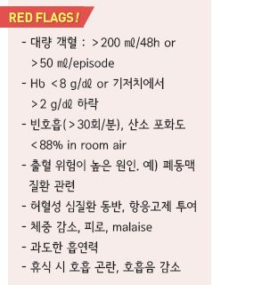
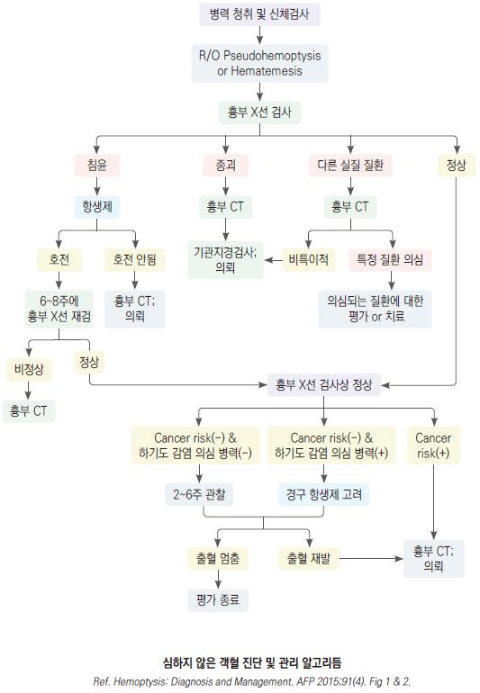

# 객혈 Hemoptysis

## 일반 사항

*   점액농성 또는 화농성 가래에 소량의 혈액이 줄무늬 또는

    점상으로 묻어 나옴
* 기관지 점막의 자극 또는 손상
* 병력 : 폐질환력; 구역/구토는 없음
* 가래 : 거품 있음, 액체 or clot, 선홍색 or 분홍색
*   건강한 젊은 비흡연자의 URI 상황에서의 소량의 객혈에

    대해서는 검사가 꼭 필요하지는 않음

## 원인 및 감별

* 심한 기침 : 보통 blood-streaked sputum
* 상기도 (비인두) 출혈 : 코피, 구강 또는 인후부 출혈
* 폐렴 : 혈액이 묻은 화농성 가래, 발열/오한 동반
*   만성 기관지염의 악화 : 기존의 만성적 가래가 최근 양 또는

    성상에 있어서 악화
* 기관지확장증 : 많은 양의 지속적 가래
* 결핵 : 결핵 의심 병력, 체중 감소, 일반적 치료에 반응하지 않는 지속되는 호흡기 증상
* 폐농양 : 부패성 악취가 나는 가래, 발열
* 폐색전증 : 갑자기 시작되는 흉막염성 흉통, 호흡 곤란 후 객혈
* 심장 질환 : 활동 시 또는 야간 발작 호흡 곤란, 기좌 호흡, 피로, 거품이 있는 분홍색 가래
* 항응고제 투여
* 기도 또는 폐 외상 : 외상력
* 이물 : 이물 흡입력 또는 영유아
* 위장관 출혈 : 구역/구토, 위장/식도 질환력, NSAID 장기 복용, 흑색 변, 알코올 남용
* 종양 : 흡연력, 체중 감소

## 진단

* 흉부 X선, CBC : 초기 진단 검사
* 흉부 CT : 대량 객혈, 흉부 X선상 이상, 흡연 등 암의 위험 인자가 있는 경우 시행
* 기관지 내시경 검사 : CT에 추가 고려
* 가래 검사 : 감염성 질환 의심 시 시행
*   응고 검사 : coagulopathy 병력, 항응고제 복용 중인 경우 고려

    

> **질병코드** R04.2 객혈
