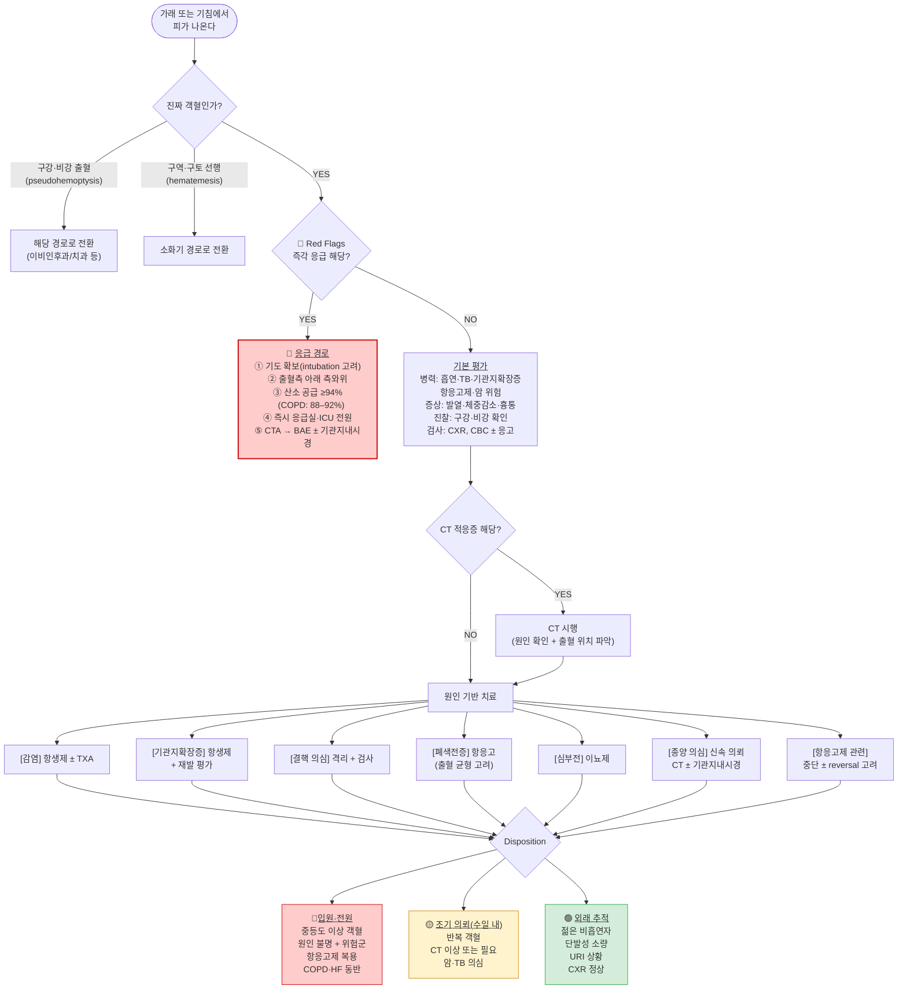

# 객혈 Hemoptysis

## <mark style="color:green;">일반 사항</mark>

* 점액농성 또는 화농성 가래에 소량의 혈액이 줄무늬 또는 점상으로 묻어 나옴
* 기관지 점막의 자극 또는 손상
* 병력 : 폐질환력; 구역/구토는 없음
* 가래 : 거품 있음, 액체 or clot, 선홍색 or 분홍색
* 건강한 젊은 비흡연자의 URI 상황에서의 소량의 객혈에 대해서는 검사가 꼭 필요하지는 않음

### <mark style="color:$danger;">🚩 Red Flags!</mark>

<mark style="color:$danger;">**즉각 조치 또는 이송**</mark>

* 기도 폐쇄 발생
* 대량 객혈 : ＞50 ㎖/episode or ＞200 ㎖/48h
* 빈호흡(＞30회/분), 산소 포화도 ＜88% in room air, 휴식 시 호흡 곤란, 호흡음 감소

<mark style="color:$warning;">**당일 또는 조기 의뢰**</mark>

* Hb ＜8 g/㎗ or 기저치에서 ＞2 g/㎗ 하락
* 출혈 위험이 높은 원인 (예: 폐동맥 질환 관련)
* 거품 섞인 분홍색 가래 + 기좌 호흡·야간 발작성 호흡 곤란 (심부전에 의한 객혈 시사)

<mark style="color:$info;">**외래 추적 / 추가 평가 계획**</mark> <mark style="color:$info;">- 즉각 위험 낮으나 호전 없으면 의뢰</mark>

* 체중 감소, 피로, malaise
* 과도한 흡연력
* 소량이라도 반복되는 객혈 : 폐암의 초기 증상일 수 있으므로 CT 포함 정밀 평가 권장

 ※ 기도 폐쇄(asphyxia) 위험 시 즉각 대응; 소량의 객혈이라도 기도를 막으면 질식사 가능.\
호흡 곤란·호흡음 감소·산소포화도 저하가 있으면 즉시 기도 확보 및 응급 의뢰

## <mark style="color:green;">원인 및 감별</mark>

* 심한 기침 : 보통 blood-streaked sputum
* 상기도 (비인두) 출혈 : 코피, 구강 또는 인후부 출혈
* 폐렴 : 혈액이 묻은 화농성 가래, 발열/오한 동반
* 만성 기관지염의 악화 : 기존의 만성적 가래가 최근 양 또는 성상에 있어서 악화
* 기관지확장증 : 많은 양의 지속적 가래; 비결핵 항산균(NTM) 폐질환 동반 가능성 고려; 반복 객혈이 매우 흔하며 대량 객혈로 이행될 위험이 높음
* 결핵 : 결핵 의심 병력, 체중 감소, 일반적 치료에 반응하지 않는 지속되는 호흡기 증상; NTM은 기관지확장증과 강하게 연관되어 동반 감별 필요
* 폐농양 : 부패성 악취가 나는 가래, 발열
* 폐색전증 : 갑자기 시작되는 흉막염성 흉통, 호흡 곤란 후 객혈; 객혈이 동반되면 폐경색(pulmonary infarction)을 시사
* 심장 질환 : 활동 시 또는 야간 발작 호흡 곤란, 기좌 호흡, 피로, 거품이 있는 분홍색 가래; 승모판 협착증(Mitral stenosis)은 좌심방 압력 상승 → 폐정맥 고혈압으로 객혈을 유발하는 고전적 원인
* 약제 유발
  * 항응고제(와파린, NOAC 등) : 용량 과다 또는 상호작용
  * 항혈관신생제 : Bevacizumab - 특히 편평세포폐암에서 치명적 대량 출혈 위험
  * 세포독성 항암제 : 일부 약제에서 폐출혈 유발 가능
* 의인성(iatrogenic) : 기관지 내시경 생검, 경피적 폐 생검, BAL 후 발생 가능; 최근 시술력 확인
* 기도 또는 폐 외상 : 외상력
* 이물 : 이물 흡입력 또는 영유아
* 위장관 출혈 : 구역/구토, 위장/식도 질환력, NSAID 장기 복용, 흑색 변, 알코올 남용
* 종양 : 흡연력, 체중 감소; 소량이라도 반복되는 객혈은 폐암의 초기 소견일 수 있음

## <mark style="color:green;">진단</mark>

### <mark style="color:orange;">객혈 vs 토혈 vs 상기도/구강 출혈 감별</mark>

※ 진찰 첫 단계 : 구강·비강 시진 우선 시행; 필요 시 후두경(laryngoscopy) 또는 비경 검사로 상기도 출혈원 확인. 특히 고령자·항응고제 복용 환자는 구인두 후벽에서 흐르는 혈액이 기침과 섞여 나와 객혈로 오인되는 경우가 흔하므로 주의. 감별 전 구강(잇몸, 혀, 인두) 및 비강을 육안으로 먼저 확인하여 출혈원을 배제해야 함

<table><thead><tr><th width="112.94735717773438"></th><th width="162">객혈</th><th width="172">토혈</th><th>상기도/구강 출혈 (Pseudohemoptysis)</th></tr></thead><tbody><tr><td>선행 증상</td><td>기침</td><td>구역/구토</td><td>비충혈, 후비루, 구강·인후 불편감</td></tr><tr><td>색깔</td><td>선홍색 또는 분홍색</td><td>암적색 또는 커피색</td><td>선홍색 (코피와 동일)</td></tr><tr><td>성상</td><td>거품 있음, 액체 or clot</td><td>음식 잔류물 혼재 가능</td><td>거품 없음, 인두 타고 넘어옴</td></tr><tr><td>pH</td><td>알칼리성</td><td>산성</td><td>—</td></tr><tr><td>기저 질환</td><td>폐/심장 질환</td><td>위장/식도 질환</td><td>비염, 비중격 질환, 구강·인후두 질환</td></tr><tr><td>이후 증상</td><td>혈성 가래 지속 가능</td><td>흑색 변 동반 가능</td><td>구강·비강 검진 시 출혈원 확인</td></tr></tbody></table>

_<mark style="color:$info;">※ pH는 참고 항목; 실제 임상에서 객혈·토혈 감별 시 pH 직접 측정은 거의 이루어지지 않음. 음식물 잔류물(food particles) 유무가 임상적으로 더 강력한 감별점임.</mark>_

### <mark style="color:orange;">검사</mark>

* 흉부 X선, CBC : 초기 진단 검사
*   흉부 CT : 다음 중 하나라도 해당하면 시행; CT (특히 조영증강 CT/CTA)는 출혈 위치·원인·책임 혈관 파악을 동시에 제공하여 기관지 내시경보다 진단율이 높고 비침습적이므로 first-line 검사로 우선 시행을 원칙으로 함

    * 흉부 X선상 이상
    * 암 위험군(흡연자, 고령) : X선이 정상이어도 조기 시행
    * 객혈 반복 : X선이 정상이어도 조기 시행
    * 원인 불명 객혈
    * 중등도 이상 객혈

    ※ 대량 객혈 또는 BAE 고려 시에는 조영증강 CT (Contrast-enhanced CT) 또는 CTA 우선 시행; 출혈 위치와 책임 혈관 파악에 필수 (단, 활력징후 불안정 시 기도 확보 후 시행)
* 기관지 내시경 검사 : CT 시행 후 추가 필요 시 고려; CT 음성이나 출혈이 지속되거나 기도 직접 조작이 필요한 경우에 한해 추가 시행
* 가래 검사 : 감염성 질환 의심 시 시행
* 응고 검사 : coagulopathy 병력, 항응고제 복용 중인 경우 고려

***



<p align="center"><strong>객혈 관리 알고리듬</strong></p>

_<mark style="color:$info;">저자 편집. BTS 2020 위험도 분류 기준 참조 (Radchenko C et al. Thorax. 2020;75(Suppl 2):2–17)</mark>_

***

## <mark style="background-color:$warning;">Management</mark>

## <mark style="color:green;">응급 관리</mark>

* 대량 객혈 : 즉시 응급 의뢰. 기도 확보 우선
* 자세 : 출혈 부위가 불명확한 경우 상체를 30–45° 거상한 Semi-Fowler's position 유지 (흡인 방지에 가장 안전); 출혈 부위가 확인된 경우에는 출혈 측을 아래로 하는 측와위를 취하여 건측 폐 보호 및 반대쪽 폐로의 혈액 유입 방지
* 산소 공급 : 목표 SpO₂ ≥94%; COPD 환자는 88–92% 목표 (고농도 산소에 의한 hypercapnia 악화 방지); 전원 후 상급 병원에서 저산소증이 지속되는 경우 고유량 비강 캐뉼러(HFNC)가 기도 가습 및 산소화 개선에 유용할 수 있음
* 원인 치료
  * 감염(폐렴, 결핵, 폐농양) : 적절한 항균제 투여
  * 항응고제 관련 : 항응고제 중단 또는 용량 조정 고려; 출혈이 임상적으로 의미 있는 경우 reversal 및 전원 고려 (☞ 처방례 3 참조)
  * 심부전 : 이뇨제, nitrate (☞ [호흡 곤란](007_-dyspnea.md#management))
* 소량\~중등도 객혈 지혈 보조
  * Tranexamic acid 경구 : 500\~1,000 ㎎ tid, 단기 사용 고려 (근거 수준 moderate)
    * DVT·PE 병력 환자에서는 혈전 형성 위험 증가 - 신중 투여
  * Tranexamic acid 흡입 : 500 ㎎ in 5 ㎖ NS, nebulizer (근거 수준 low–moderate; 소규모 RCT 및 메타분석에서 증상 조절 효과 일관; 가이드라인 등급은 아직 제한적)
* 기침 억제 : 대량 객혈 시에는 원칙적으로 사용하지 않는다; 기도 내 혈액 저류 → 질식(asphyxia) 위험이 기침 자체보다 크기 때문. 소량 객혈 시에는 객담 배출이 원활한지 먼저 확인한 후 제한적으로 고려; 객담 배출을 위한 productive cough는 완전 억제 금지 (예: codeine, dextromethorphan) (☞ [진해제](../223_/060_-common-cold.md#antitussive))
* 소량 객혈, 안정적 환자 : 원인 파악 후 외래 추적

#### <mark style="color:$primary;">위험도 분류 및 처치 방향</mark>

<table><thead><tr><th width="85.10528564453125">위험도</th><th width="345.15789794921875">기준</th><th>처치</th></tr></thead><tbody><tr><td><strong>고위험</strong></td><td>대량 객혈, 기도 위협, 활동성 출혈 지속</td><td>즉시 응급실 의뢰, 기도 확보</td></tr><tr><td><strong>중위험</strong></td><td>암·결핵 의심, 반복 객혈, 흉부 X선 이상, 항응고제 복용</td><td>수일 내 전문과 의뢰(CT, 기관지경)</td></tr><tr><td><strong>저위험</strong></td><td>젊은 비흡연자, 단발성 소량, URI 상황, X선 정상</td><td>외래 경과 관찰, 4주 내 재평가</td></tr></tbody></table>

_<mark style="color:$info;">Ref. Radchenko C et al. British Thoracic Society Guideline for the investigation and management of haemoptysis. Thorax. 2020;75(Suppl 2):2–17.</mark>_

#### <mark style="color:$primary;">전원 기준</mark>

다음 중 하나라도 해당하면 기관지 내시경 및 기관지동맥색전술(BAE)이 가능한 상급 종합병원으로 전원

* 대량 객혈 또는 활동성 출혈로 기도 위협
* 원인 불명으로 추가 평가(기관지 내시경, 혈관 조영술) 필요
* 종양 의심
* 적절한 치료에도 객혈 지속 또는 반복
* 항응고제(와파린, NOAC 등) 복용 중 : 소량의 객혈도 대량 출혈로 급격히 이행될 위험이 있음; 출혈이 임상적으로 의미 있으면 reversal agent 투여 가능 기관으로 즉시 전원
  * Dabigatran → idarucizumab <mark style="color:blue;">\[프락스바인드]</mark>
  * 리바록사반·아픽사반 → andexanet alfa (국내 가용성 확인)
  * 와파린 대량 출혈 → PCC 우선 (FFP보다 신속한 INR 교정); Vitamin K 단독보다 PCC 병용 고려

***

### <mark style="color:red;">질병코드</mark>

R04.2 객혈

***

## <mark style="color:purple;">처방례</mark>


**TXA는 지혈 보조제입니다.** 활동성 결핵·종양 등 근본 원인에 대한 평가가 TXA 투여로 인해 지연되어서는 안 됩니다.


> **처방례 1. 소량 객혈 - 감염성 원인 동반 (예: 폐렴·기관지염)**
>
> ```
> Amoxicillin/Clavulanate 625 mg 1T tid × 7일   (감염 원인 치료)
> Tranexamic acid 500 mg 1T tid × 3~5일          (지혈 보조)
>   ※ DVT·PE 병력 시 신중 투여
>   ※ 기관지확장증 기저 질환 의심 또는 반복 감염력이 있는 경우
>      Pseudomonas 커버리지를 고려한 항생제 선택
>      예) Levofloxacin 500 mg 1T qd × 7~14일
> ```
>
> **처방례 2. 소량 객혈 - 기침 억제 병용**
>
> ```
> Tranexamic acid 500 mg 1T tid × 3~5일
> Codeine phosphate 20 mg 1T bid~tid
>   ※ 소량 객혈에서 객담 배출이 원활한지 확인 후 단기 제한적 사용
>      대량 객혈 시에는 원칙적으로 사용하지 않음
>      (기침 억제 → 기도 내 혈액 저류 → 질식 위험)
>      객담 배출을 위한 productive cough는 완전 억제 금지
>   ※ 또는 Dextromethorphan 15 mg 1T tid
>   (☞ 진해제 참고)
> ```
>
> **처방례 3. 항응고제 복용 중 소량 객혈**
>
> ```
> [와파린]
> 즉시 중단 후 INR 확인
> → INR ≤5.0, 소량 객혈 : 중단 후 모니터링 (Vitamin K 투여 불필요)
> → INR >5.0 또는 출혈 조절 안 됨 : Vitamin K 2.5~5 mg 경구 투여 고려
>    (출혈이 의미 있는 경우 Vitamin K 단독보다 PCC 병용 고려)
> → 출혈 지속 또는 대량화 시 즉시 응급 의뢰
>
> [DOAC]
> 마지막 복용 시간 확인 (반감기가 짧아 중단만으로 빠르게 효과 감소)
> eGFR 확인 (신기능 저하 시 약물 축적 위험 증가)
> 즉시 중단 후 전문과 의뢰
> → 출혈이 임상적으로 의미 있는 경우 reversal agent 투여 기관으로 전원:
>    Dabigatran  → idarucizumab [프락스바인드]
>    리바록사반·아픽사반 → andexanet alfa (국내 가용성 확인)
> ```
>
> **처방례 4. Tranexamic acid 흡입 (nebulizer)**
>
> ```
> Tranexamic acid 500 mg (주사제 앰플 원액 또는 NS와 1:1 혼합) nebulizer 흡입
> 필요 시 반복 (근거 수준 low–moderate)
>   ※ 경구 투여가 어렵거나 국소 지혈 효과를 기대할 때 고려
>   ※ 천식·COPD 환자 : 흡입 시 기관지 경련(bronchospasm) 가능 — 주의
> ```

***

### <mark style="color:blue;">환자 안내서</mark>


**피가 섞인 가래나 기침은 반드시 원인을 확인해야 합니다**

대부분의 소량 객혈은 심각하지 않지만, 원인 파악이 우선입니다. 당황하지 말고 차분히 대처하십시오.


#### <mark style="color:$primary;">객혈이란 무엇인가요?</mark>

* 기침할 때 피가 섞여 나오거나 피 자체를 뱉는 것을 객혈이라 합니다
* 원인은 기관지염·폐렴 같은 흔한 감염부터 결핵, 기관지 확장증, 드물게 폐암까지 다양합니다
* 소화관 출혈(위·식도)이나 코·구강 출혈과 혼동될 수 있으므로, 출혈 부위를 의사에게 정확히 설명하는 것이 중요합니다

#### <mark style="color:$primary;">객혈 시 이렇게 하세요</mark>

* **안정** : 눕기보다 앉은 자세가 기도 유지에 유리합니다
* **기록** : 객혈량(티스푼·밥숟갈 단위 어림), 색(선홍색·갈색), 동반 증상(발열·기침·흉통)을 기억해 두십시오
* **금식** : 대량 객혈이 있거나 숨쉬기가 어려운 경우에는 흡인 위험이 있으므로 음식물과 물 섭취를 삼가십시오; 소량 안정 객혈에서는 일률적으로 금식할 필요는 없습니다
* **임의 약물 복용 금지** : 지혈제, 진해제를 의사 처방 없이 임의로 복용하지 마십시오

#### <mark style="color:$primary;">이럴 때는 즉시 119에 연락하거나 응급실로 가세요</mark>

* 한 번에 밥숟갈 이상의 많은 양의 피가 나오는 경우
* 피가 계속 멈추지 않거나 숨쉬기 힘든 경우
* 가슴 통증, 극심한 호흡 곤란, 의식 변화가 동반되는 경우
* 항응고제(와파린, 아픽사반 등)를 복용 중에 객혈이 발생한 경우
