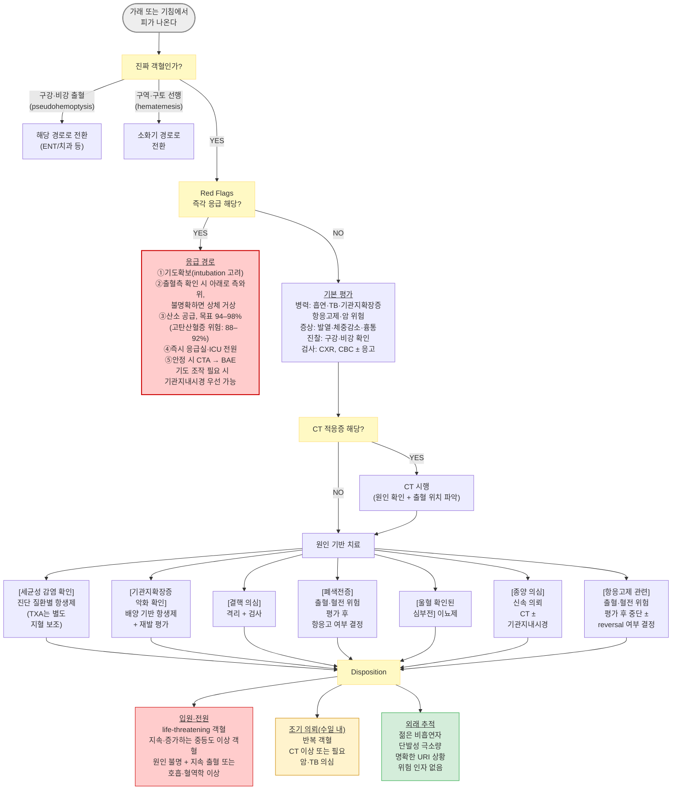

# 객혈 Hemoptysis

## <mark style="color:green;">일반 사항</mark>

* 객혈(hemoptysis) : 하기도에서 발생한 혈액을 기침과 함께 배출하는 것; blood-streaked sputum부터 다량의 혈액 배출까지 다양
* 소량 객혈은 점액농성 또는 화농성 가래에 혈액이 줄무늬 또는 점상으로 묻어 나오는 형태가 흔함
* 기관지 점막의 자극 또는 손상으로 발생할 수 있음
* 가래 : 거품 있음, 액체 or clot, 선홍색 or 분홍색
* 병력 : 폐질환력(+), 구역/구토(-)
* 건강한 젊은 비흡연자에서 명확한 URI와 연관된 일회성 극소량 객혈은 임상 판단에 따라 제한적 평가와 경과 관찰이 가능하나, 지속·반복되거나 위험 인자가 있으면 영상검사를 포함한 추가 평가 시행

### <mark style="color:$danger;">🚩 Red Flags!</mark>

<mark style="color:$danger;">**즉각 응급 조치 및 이송**</mark>

* 기도 폐쇄(asphyxia) 위험, 가스교환을 위협하거나 혈역학적 불안정을 초래하는, 생명을 위협하는 객혈 (출혈량 무관)
* 빠른 속도의 다량 출혈 (＞150 ㎖/24h 또는 약 ＞100 ㎖/h - 통일된 기준은 없음)
* 기도 폐쇄, 빈호흡(＞30회/분), 저산소혈증(예: room air SpO₂ ＜90%, 또는 산소 투여가 필요하거나 포화도가 빠르게 저하되는 경우), 휴식 시 호흡 곤란, 호흡음 감소
* 저혈압 또는 수액·승압제 투여가 필요한 혈역학적 불안정
* 실신 또는 의식 변화
* 응고장애 또는 혈소판감소증을 동반한 지속 출혈
* 즉각적인 수혈이 필요한 출혈
* 활동성 출혈과 동반된 급성 Hb 저하(기저치에서 ＞2 g/㎗ 하락) 또는 혈역학적 불안정을 동반한 경우

<mark style="color:$warning;">**당일 평가 또는 응급실 의뢰**</mark>

* Hb ＜8 g/㎗ (객혈과 관련된 급성 저하가 아니거나 혈역학적으로 안정된 경우)
  * 급성 저하·혈역학적 불안정이 동반되면 위 Tier 1 적용
* 폐동맥류/가성동맥류(예: 결핵성 Rasmussen aneurysm), 폐동정맥기형(PAVM), aspergilloma 또는 병변의 폐동맥 침범 등 고위험 혈관성 원인 의심
* 거품 섞인 분홍색 가래 + 기좌 호흡·야간 발작성 호흡 곤란 `심부전`

<mark style="color:$info;">**조기 원인 평가 및 면밀한 추적**</mark>

* 체중 감소, 피로, malaise
* 과도한 흡연력
* 소량이라도 반복되는 객혈 `폐암`

※ 기도 폐쇄(asphyxia) 위험 시 즉각 대응; 소량의 객혈이라도 기도를 막으면 질식사 가능. 호흡 곤란·호흡음 감소·산소포화도 저하가 있으면 즉시 기도 확보 및 응급 의뢰

## <mark style="color:green;">원인 및 감별</mark>

* 심한 기침 : 보통 blood-streaked sputum
* 상기도 (비인두) 출혈 : 코피, 구강 또는 인후부 출혈
* 폐렴 : 혈액이 묻은 화농성 가래, 발열/오한 동반
* 만성 기관지염의 악화 : 기존의 만성적 가래가 최근 양 또는 성상에 있어서 악화
* 기관지확장증 : 많은 양의 지속적 가래; 반복 객혈이 매우 흔하며 대량 객혈로 이행될 위험이 높음
* 결핵 : 결핵 의심 병력, 체중 감소, 일반적 치료에 반응하지 않는 지속되는 호흡기 증상
  * 비결핵 항산균(NTM) 폐질환은 기관지확장증과 강하게 연관되므로, 기관지확장증 환자에서는 NTM 폐질환 동반 여부를, NTM 폐질환 환자에서는 기관지확장증 동반 여부를 평가
* 결핵 후 공동 병변 등에서 발생하는 진균구(aspergilloma)/만성 폐아스페르길루스증 : 국내에서 반복 또는 생명위협성 객혈의 중요한 원인
  * 재출혈 위험이 높아 조기 조영증강 CT 또는 CT angiography(CTA) 및 전문의 평가가 필요하며, 원인 치료와 별개로 활동성 출혈에는 기관지동맥색전술(BAE) 고려
* 폐농양 : 부패성 악취가 나는 가래, 발열
* 폐색전증 : 갑자기 시작되는 흉막염성 흉통, 호흡 곤란 후 객혈; 객혈이 동반되면 폐경색을 시사
* 미만성 폐포출혈(diffuse alveolar hemorrhage, DAH)/폐-신 증후군 : ANCA 연관 혈관염(GPA, MPA), anti-GBM disease 등이 대표 원인; 양측성 폐침윤 또는 ground-glass opacity + Hb 감소 + 저산소혈증 ± 혈뇨·단백뇨·신기능 악화가 동반되면 의심; 일부 환자에서는 객혈이 없을 수 있으므로 객혈 부재만으로 배제하지 않음
* 심장 질환 : 활동 시 또는 야간 발작 호흡 곤란, 기좌 호흡, 피로, 거품이 있는 분홍색 가래
  * 승모판 협착증 : 좌심방 압력 상승 → 폐정맥 고혈압으로 객혈 유발
* 약제 유발
  * 항응고제(와파린, DOAC, 헤파린/저분자헤파린) : 용량 과다 또는 상호작용
  * 항혈관신생제(Bevacizumab) : 특히 편평세포폐암에서 치명적 대량 출혈 위험
  * 세포독성 항암제 : 일부 약제에서 폐출혈 유발 가능
* 의인성(iatrogenic) : 기관지 내시경 생검, 경피적 폐 생검, BAL 후 발생 가능; 최근 시술력 확인
* 기도 또는 폐 외상 : 외상력
* 이물 : 이물 흡입력 또는 영유아
* 종양 : 흡연력, 체중 감소; 소량이라도 반복되는 객혈은 폐암의 초기 소견일 수 있음
* 위장관 출혈을 오인 : 구역/구토, 위장/식도 질환력, NSAID 장기 복용, 흑색 변, 알코올 남용 등에 의한 위장관 출혈을 객혈로 오인

## <mark style="color:green;">진단</mark>

### <mark style="color:orange;">객혈 vs 토혈 vs 상기도/구강 출혈 감별</mark>

* 진찰 첫 단계 : 구인두 후벽에서 흐르는 혈액이 기침과 섞여 나와 객혈로 오인될 수 있음
  * 구강·비강 시진 우선 시행; 구강(잇몸, 혀, 인두) 및 비강을 육안으로 먼저 확인
  * 필요 시 후두경 또는 비경 검사로 상기도 출혈원 확인

<table><thead><tr><th width="113">항목</th><th width="162">객혈</th><th width="172">토혈</th><th>상기도/구강 출혈 (Pseudohemoptysis)</th></tr></thead><tbody><tr><td>선행 증상</td><td>기침</td><td>구역/구토</td><td>비충혈, 후비루, 구강·인후 불편감</td></tr><tr><td>색깔</td><td>선홍색 또는 분홍색</td><td>암적색 또는 커피색</td><td>선홍색 (코피와 동일)</td></tr><tr><td>성상</td><td>거품 있음, 액체 or clot</td><td>음식 잔류물 혼재 가능</td><td>거품 없음, 인두 타고 넘어옴</td></tr><tr><td>pH</td><td>알칼리성</td><td>산성</td><td>-</td></tr><tr><td>기저 질환</td><td>폐/심장 질환</td><td>위장/식도 질환</td><td>비염, 비중격 질환, 구강·인후두 질환</td></tr><tr><td>이후 증상</td><td>혈성 가래 지속 가능</td><td>흑색 변 동반 가능</td><td>구강·비강 검진 시 출혈원 확인</td></tr></tbody></table>

_<mark style="color:$info;">※ 표의 소견은 병력·진찰과 함께 참고하는 보조적 지표이며, 개별 소견만으로 단정하지 않음(예: 혈액을 삼킨 후 구토하거나, 객혈이 혈괴 형태·거품 없는 양상으로 나타나는 예외가 있을 수 있음). pH는 참고 항목이며 실제 임상에서 직접 측정은 거의 이루어지지 않음; 음식물 잔류물(food particles) 유무는 감별에 참고할 수 있는 소견 중 하나임. 최종 감별은 병력·구강 및 비강 진찰, 필요 시 후두경·상부위장관 내시경을 종합하여 판단</mark>_

### <mark style="color:orange;">검사</mark>

* 흉부 X선, CBC : 초기 진단 검사
* 흉부 CT : 아래 중 하나라도 해당하면 적극 고려; 조영증강 CT/CTA는 원인, 출혈 위치 및 책임 혈관 평가에 유용하며, 특히 반복·중등도 이상 객혈 또는 BAE를 고려하는 경우 우선적으로 활용
  * 흉부 X선상 이상
  * 폐암 위험 인자를 모두 충족 (＞40세 & ＞30갑년 흡연력) - X선이 정상이어도 조기 시행
  * 중등도 객혈(＞30 ㎖/24h) - X선이 정상이어도 조기 시행
  * 객혈 반복 - X선이 정상이어도 조기 시행
  * 원인 불명 객혈
* 기관지 내시경 검사 : CT에서 원인이 불명확하거나 출혈이 지속되는 경우, 또는 기도 내 혈액·혈괴 제거, 출혈 부위 직접 확인·지혈 등 즉각적인 기도 조작이 필요한 경우 시행
  * 안정된 환자 : CT/CTA로 원인 및 책임 혈관을 먼저 평가하는 것이 우선
  * 활동성 출혈 또는 기도 내 혈괴로 즉각적인 기도 조작이 필요한 경우 : 기관지내시경이 CT보다 우선될 수 있으며, 기도 확보·혈괴 제거·출혈 위치 확인에 사용 (활동성 출혈 중 또는 중단 후 24\~48시간 이내 시행 시 출혈 부위 확인율이 높음)
  * 책임 혈관이 확인된 생명위협성 또는 반복 객혈에서는 기관지동맥색전술(BAE)이 주요 확정적 지혈 치료
* 가래 검사 : 결핵 의심 시 공기매개 격리 후 객담 항산균(AFB) 도말·배양 및 결핵균 핵산증폭검사(NAAT). 그 외 세균성 감염 의심 시 일반 가래 배양
* 응고 검사 : coagulopathy 병력, 항응고제 복용 중인 경우 고려
* 중등도 이상 또는 지속 출혈 시 추가 검사
  * 활력징후 및 연속 SpO₂ 모니터링
  * CBC(혈소판 포함), PT/INR, aPTT, 전해질, BUN/Cr(조영제 및 DOAC 축적 평가), 간기능
    * DOAC 복용 환자에서는 정상 PT/aPTT만으로 잔존 항응고 효과를 배제할 수 없음에 유의
  * 혈액형 검사 및 type & screen/crossmatch
  * 호흡부전 시 ABGA
* 미만성 폐포출혈/폐-신 증후군 의심 시 : U/A, Cr, ANCA, anti-GBM Ab 등 추가 평가 및 긴급 의뢰

***


```mermaid
graph TD
    A(["가래 또는 기침에서 <br/>피가 나온다"]) --> B["진짜 객혈인가?"]
    B -- "구강·비강 출혈<br/>(pseudohemoptysis)" --> C["해당 경로로 전환<br/>(ENT/치과 등)"]
    B -- "구역·구토 선행<br/>(hematemesis)" --> D["소화기 경로로<br/> 전환"]
    B -- "YES" ---> E["Red Flags<br/>즉각 응급 해당?"]
    E -- "YES" --> F["<u>응급 경로</u><br/>①기도확보(intubation 고려)<br/>②출혈측 확인 시 아래로 측와위,<br/>   불명확하면 상체 거상<br/>③산소 공급, 목표 94–98%<br/>   (고탄산혈증 위험: 88–92%)<br/>④즉시 응급실·ICU 전원<br/>⑤안정 시 CTA → BAE<br/>   기도 조작 필요 시 <br/>기관지내시경 우선 가능"]
    E -- "NO" --> G["<u>기본 평가</u><br/>병력: 흡연·TB·기관지확장증<br/>항응고제·암 위험<br/>증상: 발열·체중감소·흉통<br/>진찰: 구강·비강 확인<br/>검사: CXR, CBC ± 응고"]
    G --> H["CT 적응증 해당?"]
    H -- "YES" --> I["CT 시행<br/>(원인 확인 + 출혈 위치 파악)"]
    H -- "NO" --> J["원인 기반 치료"]
    I --> J
    J --> J1["[세균성 감염 확인] <br/>진단 질환별 항생제<br/>(TXA는 별도 <br/>지혈 보조)"]
    J --> J2["[기관지확장증 <br/>악화 확인] <br/>배양 기반 항생제<br/>+ 재발 평가"]
    J --> J3["[결핵 의심] <br/>격리 + 검사"]
    J --> J4["[폐색전증] <br/>출혈·혈전 위험 <br/>평가 후<br/>항응고 여부 결정"]
    J --> J5["[울혈 확인된 <br/>심부전] 이뇨제"]
    J --> J6["[종양 의심] <br/>신속 의뢰<br/>CT ± <br/>기관지내시경"]
    J --> J7["[항응고제 관련] <br/>출혈·혈전 위험 <br/>평가 후 중단 ± <br/>reversal 여부 결정"]
    J1 & J2 & J3 & J4 & J5 & J6 & J7 --> K["Disposition"]
    K --> K1["<u>입원·전원</u><br/>life-threatening 객혈<br/>지속·증가하는 중등도 이상 객혈<br/>원인 불명 + 지속 출혈 또는<br/>호흡·혈역학 이상"]
    K --> K2["<u>조기 의뢰(수일 내)</u><br/>반복 객혈<br/>CT 이상 또는 필요<br/>암·TB 의심"]
    K --> K3["<u>외래 추적</u><br/>젊은 비흡연자<br/>단발성 극소량<br/>명확한 URI 상황<br/>위험 인자 없음"]

    classDef startNode fill:#eeeeee,stroke:#888888,stroke-width:2px
    classDef question fill:#fff9c4,stroke:#ffe082
    classDef emergency fill:#ffcccc,stroke:#cc0000,stroke-width:2px
    classDef admit fill:#ffcccc,stroke:#cc0000,stroke-width:1px
    classDef urgent fill:#fff3cd,stroke:#cc8800,stroke-width:1px
    classDef routine fill:#d4edda,stroke:#28a745,stroke-width:1px
    class A startNode
    class B,E,H,K question
    class F emergency
    class K1 admit
    class K2 urgent
    class K3 routine
```

<p align="center"><strong>객혈 관리 알고리듬</strong></p>

<p align="center"><em><mark style="color:$info;">저자 재구성 (참고 문헌 : ACR Appropriateness Criteria® Hemoptysis 2020,</mark></em><br><em><mark style="color:$info;">Society of Chest Imaging and Interventions Consensus Guidelines 2023,</mark></em><br><em><mark style="color:$info;">2018 Korean Clinical Imaging Guideline for Hemoptysis 등)</mark></em></p>

***

## <mark style="background-color:$warning;">Management</mark>

### <mark style="color:orange;">응급 관리</mark>

* 생명을 위협하는 객혈 : 즉시 응급 의뢰
  * 출혈량보다 기도·가스교환·혈역학적 안정 여부를 우선 평가하고 기도 확보를 최우선으로 함
* 자세 : 출혈 부위가 불명확한 경우 상체를 30\~45° 거상한 Semi-Fowler's position 유지(흡인 방지에 안전)
  * 출혈 부위가 확인된 경우에는 출혈 측을 아래로 하는 측와위를 취하여 건측 폐 보호 및 반대쪽 폐로의 혈액 유입을 방지
* 산소 공급 : 목표 SpO₂ 94\~98%
  * 고탄산혈증성 호흡부전 위험 환자는 88\~92% 목표로 조절 후 동맥혈가스검사로 재평가
  * 전원 후 상급 병원에서 저산소증이 지속되는 경우 고유량 비강 캐뉼러(HFNC)가 산소화 개선에 유용할 수 있으나, 활동성 다량 출혈에서 HFNC가 기관삽관·기도 내 혈괴 제거 등 확정적 기도 조치를 지연해서는 안 됨
* 원인 치료
  * 감염(폐렴, 결핵, 폐농양) : 적절한 항균제 투여
  * 항응고제 관련 : 마지막 복용 시간·신기능·출혈 중증도·혈전색전 위험을 함께 평가하여 중단 및 reversal 필요성 결정 (☞ 처방례 3 참조)
  * 심부전 : 임상적 울혈이 확인된 경우 이뇨제, nitrate (☞ [호흡곤란](007_-dyspnea.md#management))
* 소량\~중등도 객혈 지혈 보조
  * tranexamic acid 경구 : 국내 대표 경구 제제 허가사항 기준 보통 성인 1일 750\~2,000 ㎎을 3\~4회 분할 투여(예 500 ㎎ tid); 단기 사용 고려
    * 금기 : 활동성 혈전색전증, 중증 신부전(허가사항상 투여 금기)
    * 신중 투여 : 혈전증 병력 또는 고위험 상태(DVT·PE 병력 등), 신부전(혈중농도 상승 가능)
    * 혈뇨, 특히 상부요로 출혈 : 혈괴에 의한 요로폐쇄 가능성 고려
  * tranexamic acid 흡입 : 주사용 제제(500 ㎎/5 ㎖)를 그대로 nebulizer로 흡입, q8h; 투여 기간은 기관 protocol에 따름 (객혈에 대한 흡입 투여는 off-label; 최적 용량·장기 안전성 및 일반화에는 근거가 제한적)
* [기침 억제](../223_/060_-common-cold.md#antitussive) : codeine, dextromethorphan
  * 객담 배출을 위한 productive cough의 완전 억제 금지
  * 생명을 위협하거나 다량의 객혈 시에는 사용하지 않음 (기도 내 혈액 저류 → 질식 위험이 기침 자체보다 큼)
  * 소량 객혈 시에는 객담 배출이 원활한지 먼저 확인한 후 제한적으로 고려
* 소량 객혈, 안정적 환자 : 원인 파악 후 외래 추적

#### <mark style="color:$primary;">위험도 분류 및 처치 방향</mark>

<table><thead><tr><th width="80">위험도</th><th>기준</th><th>처치</th></tr></thead><tbody><tr><td><strong>고위험</strong></td><td>life-threatening hemoptysis, 기도 위협, 호흡·혈역학적 불안정, 활동성 출혈 지속</td><td>즉시 응급실 의뢰, 기도 확보; CTA/기관지내시경 및 BAE 가능 기관으로 전원</td></tr><tr><td><strong>중위험</strong></td><td>암·결핵 의심, 반복 객혈, 흉부 X선 이상, 항응고제 복용 + 지속·반복 출혈 또는 Hb 감소</td><td>수일 내 전문과 의뢰 및 CT 등 추가 평가</td></tr><tr><td><strong>저위험</strong></td><td>젊은 비흡연자, 단발성 극소량, 명확한 URI 상황, 위험 인자 없음</td><td>제한적 평가와 외래 경과 관찰; 지속·반복 시 영상검사</td></tr></tbody></table>

_<mark style="color:$info;">저자 편집. ACR Appropriateness Criteria® Hemoptysis (2020), Society of Chest Imaging and Interventions Consensus Guidelines (2023), ACC Expert Consensus Decision Pathway on Management of Bleeding in Patients on Oral Anticoagulants (2020), FDA Safety Communication on Andexxa (2025) 참조.</mark>_

#### <mark style="color:$primary;">전원 기준</mark>

* 다음 중 하나라도 해당하면 기관지 내시경 및 기관지동맥색전술(BAE)이 가능한 상급 기관으로 전원
  * 생명을 위협하는 객혈 또는 활동성 출혈로 기도·가스교환·혈역학 위협
  * 원인 불명으로 추가 평가(기관지 내시경, 혈관 조영술) 필요
  * 종양 의심
  * 적절한 치료에도 객혈 지속 또는 반복
  * 항응고제(와파린, DOAC, 헤파린/저분자헤파린 등) 복용 중이면서 지속·반복 출혈, Hb 감소, 과량 항응고 의심, 신기능 저하 또는 호흡·혈역학 이상이 있는 경우
    * 마지막 복용 시간·신기능·출혈 중증도·혈전색전 위험을 평가하고 적절한 기관으로 신속 전원

**항응고제 ↔ 역전제(해독제)**

* 국내에는 현재 시판되는 4F-PCC가 없음. aPCC인 <mark style="color:blue;">\[훼이바]</mark>는 국내 허가·공급되지만 허가 적응증은 응고인자 억제인자를 보유한 혈우병 환자의 출혈 관리이며, DOAC 역전 목적 사용은 허가 외 사용이므로 혈액학·수혈의학 전문의 및 기관 protocol에 따름
* dabigatran <mark style="color:blue;">\[프라닥사]</mark> ↔ idarucizumab <mark style="color:blue;">\[프락스바인드]</mark>
* rivaroxaban <mark style="color:blue;">\[자렐토]</mark>·apixaban <mark style="color:blue;">\[엘리퀴스]</mark> ↔ 국내에 승인·공급되는 특이 역전제 없음
  * andexanet alfa는 안전성 문제로 미국 판매 중단, 국내 미공급
  * FFP와 vitamin K는 역전제로 사용하지 않으며 비특이적 지혈제 사용 여부는 전문의 및 기관 protocol에 따라 결정
* edoxaban <mark style="color:blue;">\[릭시아나]</mark> ↔ 국내에 승인·공급되는 특이 역전제 없음
  * FFP와 vitamin K는 역전제로 사용하지 않으며 비특이적 지혈제 사용 여부는 전문의 및 기관 protocol에 따라 결정
* warfarin ↔ 4F-PCC + IV vitamin K가 우선이나, 국내에서 4F-PCC를 사용할 수 없으면 FFP + IV vitamin K
* UFH(미분획 헤파린)/LMWH(저분자량 헤파린) 복용 중인 경우 → protamine 고려 (LMWH는 부분적 중화만 가능)

***

### <mark style="color:red;">질병코드</mark>

* R04.2 객혈

***

## <mark style="color:purple;">처방례</mark>


**TXA는 지혈 보조제임.** 활동성 결핵·종양 등 근본 원인에 대한 평가가 TXA 투여로 인해 지연되어서는 안 됨.


> **처방례 1. 소량 객혈 - 지역사회획득폐렴(CAP)이 임상적으로 의심되는 경우**
>
> ```
> Amoxicillin/Clavulanate 625 mg 1T tid × 7일 (CAP 치료; 중증도·기저질환에 따라 항생제 선택 조정)
> Tranexamic acid 500 mg 1T tid × 3~5일 (지혈 보조)
>   ※ 활동성 혈전색전증에는 금기; DVT·PE 병력 시 신중 투여
>   ※ 객혈 자체는 항생제 적응증이 아니며, 세균성 감염이 임상적으로 확인된 경우에 한해 해당 질환의 표준 처방을 따름
>   ※ 단순 급성 기관지염에서는 일률적인 항생제 투여를 권고하지 않음
>   ※ 기관지확장증의 감염성 악화가 의심되는 경우 가능하면 항생제 투여 전 객담 배양검사를 시행하고,
>      이전 배양 결과·지역 내성 양상·임상적 중증도를 고려하여 항생제 선택
>      (중증 환자에서는 배양 결과를 기다리느라 치료를 지연하지 않음)
>      Pseudomonas 과거 배양력이 있으면 해당 감수성 결과에 따른 항녹농균 항생제 고려
> ```
>
> **처방례 2. 소량 객혈 - 기침 억제 병용**
>
> ```
> Tranexamic acid 500 mg 1T tid × 3~5일
> Codeine phosphate 20 mg 1T bid~tid
>   ※ 활동성 혈전색전증에는 금기; DVT·PE 병력 시 신중 투여
>   ※ 소량 객혈에서 객담 배출이 원활한지 확인 후 단기 제한적 사용
>      생명을 위협하거나 다량의 객혈 시에는 원칙적으로 사용하지 않음
>      (기침 억제 → 기도 내 혈액 저류 → 질식 위험)
>      객담 배출을 위한 productive cough는 완전 억제 금지
>   ※ 또는 Dextromethorphan 15 mg 1T tid
>   ※ Codeine 함유 제제는 국내 제품별 마약류/한외마약 분류 및 처방·관리 요건을 확인
>   (☞ 진해제 참고)
> ```
>
> **처방례 3. 항응고제 복용 중 객혈**
>
> ```
> [와파린]
> ※ 판단 기준 : 출혈 중증도, INR, 혈전색전 위험을 함께 평가
> → 비중증 소량 객혈 : warfarin 일시 중단 여부를 개별 결정하고 INR 확인; routine vitamin K는 일반적으로 필요하지 않음
> → major/life-threatening bleeding : 즉시 warfarin 중단 + FFP + IV vitamin K, 응급 전원
>    ※ 4F-PCC + IV vitamin K가 우선 권고되나 국내에는 시판되는 4F-PCC가 없어, FFP + IV vitamin K가 국내에서 사용 가능한 대안임
>
> [DOAC]
> ※ 판단 기준 : 마지막 복용 시간 및 eGFR 확인 (신기능 저하 시 약물 축적 가능)
> → 비중증 출혈 : 일시 중단 여부를 출혈 정도와 혈전색전 위험에 따라 결정
> → major/life-threatening bleeding : 즉시 중단하고 응급 전원
>    Dabigatran → idarucizumab [프락스바인드] 투여
>    리바록사반·아픽사반·에독사반 → 국내에 승인된 특이 역전제 없음(andexanet alfa는 안전성 문제로 미국 판매 중단, 국내 미공급)
>       FFP와 vitamin K는 factor Xa 억제제의 역전제로 사용하지 않으며 상급기관 응급 전원
>       ※ 해외 지침에서는 andexanet alfa를 사용할 수 없을 때 4F-PCC 등 비특이적 지혈제를 고려하나 국내에는 시판되는 4F-PCC가 없음
>       ※ aPCC인 FEIBA는 국내 허가·공급되지만 DOAC 역전 목적 사용은 허가 외 사용이므로 혈액학·수혈의학 전문의 및 기관 protocol에 따름
>
> [UFH/LMWH]
> → protamine 고려 (LMWH는 부분적 중화만 가능)
> ```
>
> **처방례 4. Tranexamic acid 흡입 (nebulizer)**
>
> ```
> Tranexamic acid 500 mg/5 mL (주사용 제제 원액) nebulizer 흡입 q8h
> 투여 기간은 기관 protocol에 따름
>   ※ 희석 여부(NS 혼합 등)는 제품 농도 및 기관별 protocol에 따름
>   ※ 객혈에 대한 흡입 투여는 허가 외 사용(off-label); 비생명위협성 객혈에서 효과를 보고한 소규모 RCT들이 있으나
>      최적 용량·장기 안전성 근거는 제한적
>   ※ 경구 투여가 어렵거나 국소 지혈 효과를 기대할 때 고려; 생명을 위협하는 객혈에서는
>      기도 확보·CTA·기관지내시경·BAE를 지연해서는 안 됨
>   ※ 천식·COPD 환자 : 흡입 시 기관지 경련(bronchospasm) 가능 - 주의
> ```

***

### <mark style="color:$success;">핵심 복약 지도</mark>

> **Tranexamic acid (경구/흡입)**
>
> * 경구는 보통 성인 1일 750\~2,000 ㎎을 3\~4회 분할 투여하며(제품별 허가사항 확인), 단기(3\~5일) 지혈 보조 목적으로 사용; 결핵·종양 등 근본 원인 평가를 지연시키지 않아야 합니다
> * 활동성 혈전색전증·중증 신부전 환자에게는 투여하지 않으며, DVT·PE 병력·고위험 상태에서는 신중 투여
> * 혈뇨, 특히 상부요로 출혈에서는 혈괴에 의한 요로폐쇄 가능성을 설명
> * 흡입(nebulizer) 투여는 허가 외 사용(off-label)이며 천식·COPD 환자에서 기관지 경련 가능성을 사전에 설명

> **기침 억제제 사용 원칙**
>
> * 생명을 위협하거나 다량의 객혈에는 원칙적으로 사용하지 않습니다 - 기침 억제로 인한 기도 내 혈액 저류가 기침 자체보다 질식 위험이 큽니다
> * 소량 객혈에서만, 객담 배출이 원활함을 확인한 후 제한적으로 사용
> * Codeine 함유 제제는 국내 제품별 마약류/한외마약 분류 및 처방·관리 요건을 처방 전 확인

> **항응고제 복용 중 객혈**
>
> * 출혈 중증도와 혈전색전 위험을 함께 평가하여 중단 여부를 개별 결정; 임의로 자가 중단하지 않도록 안내
> * Major/life-threatening bleeding이면 즉시 중단 + reversal 가능 기관으로 응급 전원 (andexanet alfa는 미국에서 안전성 문제로 판매가 중단되었으며 국내에는 승인·공급되지 않음)

> **언제 다시 병원을 방문해야 하나요?**
>
> * 객혈량이 늘거나 빈도가 증가하는 경우
> * 호흡 곤란, 저산소증, 어지럼·실신 등 새로운 증상이 동반되는 경우 - 즉시 응급실
> * Hb 저하 또는 항응고제 관련 출혈 소견이 확인되는 경우

***

## <mark style="color:blue;">환자 안내서</mark>


**피가 섞인 가래나 기침은 반드시 원인을 확인해야 합니다**

대부분의 소량 객혈은 심각하지 않지만, 원인 파악이 우선입니다. 당황하지 말고 차분히 대처하십시오.


#### <mark style="color:$primary;">객혈이란 무엇인가요?</mark>

* 기침할 때 피가 섞여 나오거나 피 자체를 뱉는 것을 객혈이라 합니다
* 원인은 기관지염·폐렴 같은 흔한 감염부터 결핵, 기관지확장증, 드물게 폐암까지 다양합니다
* 소화관 출혈(위·식도)이나 코·구강 출혈과 혼동될 수 있으므로, 출혈 부위를 의사에게 정확히 설명하는 것이 중요합니다

#### <mark style="color:$primary;">객혈 시 이렇게 하세요</mark>

* **안정** : 눕기보다 앉은 자세가 기도 유지에 유리합니다
* **기록** : 객혈량(티스푼·밥숟갈 단위 어림), 색(선홍색·갈색), 동반 증상(발열·기침·흉통)을 기억해 두십시오
* **금식** : 많은 양의 객혈, 의식 저하, 심한 호흡 곤란 등 흡인 위험이 있는 경우에는 음식물과 물을 섭취하지 마십시오; 소량의 안정된 객혈에서는 일률적으로 금식할 필요는 없습니다
* **임의 약물 복용 금지** : 지혈제, 진해제를 의사 처방 없이 임의로 복용하지 마십시오

#### <mark style="color:$primary;">이럴 때는 즉시 119에 연락하거나 응급실로 가세요</mark>

* 피가 계속 나오거나 빠르게 반복되면서 숨쉬기 힘든 경우
* 피 때문에 기도가 막히는 느낌, 극심한 호흡 곤란, 어지럼·실신 또는 의식 변화가 동반되는 경우
* 짧은 시간에 많은 양의 피가 나오는 경우
* 항응고제(와파린, 아픽사반 등)를 복용 중이며 객혈이 지속·반복되거나 양이 증가하는 경우
