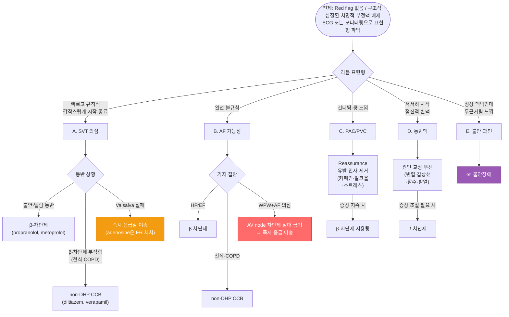

# 두근거림 Palpitation

## <mark style="color:green;">일반 사항</mark>

* 심장의 강하고 빠르고 불규칙한, 불쾌한 기분의 박동

### <mark style="color:$danger;">🚩 Red Flags!</mark>

<mark style="color:$danger;">**즉각 응급 조치 및 이송**</mark>

* 흉통
* 저혈압(SBP ＜90 ㎜Hg or DBP ＜60 ㎜Hg) 또는 의식 변화(altered mental status)
* 빈호흡(＞30회/분) 또는 호흡 곤란, 기좌 호흡
* 빈맥(＞150회/분)
* Syncope or near-syncope 동반 (☞ 실신)
* High degree AV block, 지속성 심실빈맥, WPW 증후군을 동반한 AF
* 고위험 구조적 심장 질환 있음
* Exercise 중 발생
* 유전적 심장 질환 or Sudden arrhythmic death syndrome 가족력

<mark style="color:$warning;">**조기 의뢰 (당일 \~ 수일 내)**</mark>

* 증상들과 관련된 두근거림 AND/OR 비정상 ECG AND/OR 심장의 구조적 질환 있음
* Tachyarrhythmia 반복 의심 병력
* 흉통 동반 또는 수면 장애 유발
* 하지 부종 (심부전 시사)
* 국소 신경학적 증상 (색전증 시사)
* 박동기(Pacemaker) 또는 ICD 삽입 환자에서 새로운 두근거림 - 기기 오작동(부적절 감지, 리드 이상, 부적절 쇼크) 감별 필요; 기기 클리닉 또는 심장내과 당일 의뢰

<mark style="color:$info;">**외래 추적 / 저위험 - 관찰**</mark>

* 빠르거나 / 쿵거리는 맥박
* Short fluttering
* 느린 박동 AND 정상 ECG AND 가족력 없음 AND 심장의 구조적 질환 없음

## <mark style="color:green;">원인</mark>

### <mark style="color:orange;">심장 원인</mark>

* 심방세동(AF, 15%) : 불규칙한 두근거림의 가장 흔한 심장 원인; P파 소실·불규칙한 RR 간격이 특징; 기저 원인으로 고혈압·심부전·갑상선 기능 항진증·OSA·과도한 음주 확인
  * Holiday heart : 폭음(binge drinking) 후 발생하는 AF; 음주력 청취 시 특히 확인
* 심실상성빈맥(SVT, 10%), 구조적 심장 질환
  1. "flip-flopping" (or "stop and start") : 심방이나 심실의 조기 수축
  2. rapid "fluttering in the chest"
     * regular "fluttering" : supraventricular 또는 ventricular tachycardia (sinus tachycardia 포함)
     * irregular "fluttering" : variable block(atrial fibrillation, atrial flutter, multifocal atrial tachycardia)
  3. "pounding in the neck"(neck pulsations) : right atrium contract(jugular venous pulsations); AV 해리 시 cannon A wave 발생
* Chest pain 동반 → 허혈성 심질환
* 몸을 앞으로 기울이면 호전 → 심막 질환
* Light-headedness, presyncope or syncope → 저혈압, 중증 부정맥
* 힘든 작업 시 발생 → rate-dependent bypass tract, hypertrophic cardiomyopathy

### <mark style="color:orange;">비심장 원인</mark>

* 정신적 요인(가장 흔함; 30%) : 공포, 불안, 우울, 신체화 증상, 스트레스; 보통 ＞15분 지속
  * 과호흡, hand tingling, 과민 반응 → 불안, 공황 장애
  * 기질적 심장 질환이 배제된 경우에도 심장 감각 과민(cardiac sensory hypervigilance) 상태로 설명할 수 있음; "심장에 이상이 없다"는 단순 부정보다 "심장이 예민해진 상태"임을 설명하고 신체 증상 장애(Somatic Symptom Disorder) 관점에서 접근하면 환자 수용도가 높아짐
* 부적절 동빈맥(Inappropriate Sinus Tachycardia, IST) : 안정 시 지속적 빈맥 + 경미한 활동에도 과도한 심박수 반응; 불안장애로 오진되는 경우 많음 - 구조적 심질환 및 이차 원인 배제 후 진단
* 체위성 기립성 빈맥 증후군(POTS) : 기립 시 HR ≥30 bpm 이상 증가(10분 내), 실신 없이 두근거림·피로·brain fog 동반; 젊은 여성에서 흔함 - 기립성 저혈압(기립 시 혈압 강하)과 구별 필요
* 대사/전해질 이상
  * 빈혈 : 두근거림의 흔한 대사적 원인; CBC로 확인 필수 (Hb ＜10 g/dL 시 특히 의심)
  * 전해질 이상 : 저칼륨혈증(hypokalemia), 저마그네슘혈증(hypomagnesemia)은 부정맥의 흔한 유발 원인 - 이뇨제 복용 환자에서 특히 확인 필요
  * thyrotoxicosis/갑상선항진증, 저혈압, 저혈당, 탈수(설사), 폐경기증후군
    * 체중 감소, 미세한 손 떨림(fine tremor), 심부 건반사 항진 → 갑상선항진증
    * 홍조, 일시적 고혈압, 두통, 불안, 발한 → pheochromocytoma, paraganglioma
* 수면무호흡증(OSA) : 야간 두근거림, 심방세동의 독립적 위험인자; 코골이·주간 과다졸음·비만 동반 시 의심
* 심박출량 증가 상태 : 발열, 임신, 월경, 운동, 기립성 저혈압
* 약물 : 교감 신경 항진제(예: 다이어트 약물, 충혈 제거제, 천식 흡입제), 항부정맥제, 혈관 확장제, 항콜린제, β-차단제 금단, 카페인(예: 커피, 코코아, 초콜릿, 에너지 드링크), 니코틴, 코카인, 암페타민, 알코올
  * GLP-1 수용체 작용제(삭센다, 오젬픽 등) : 경도의 심박수 증가(평균 2\~4 bpm) 유발 가능 - 체중 감량 목적 사용 증가로 확인 필요
  * Levothyroxine : 과잉 투여 시 빈맥·두근거림 유발 - TSH 확인 필수
  * SGLT2 억제제 : 삼투성 이뇨(osmotic diuresis) → 용적 감소(volume depletion) → 반사성 빈맥 기전; 두근거림 호소 시 수분 섭취 적절성 확인 + 혈압 저하 동반 여부 함께 평가 필요
* 허브 및 영양 보충제, 특정 음식

## <mark style="color:green;">진단</mark>

### <mark style="color:orange;">두근거림 표현형 분류</mark>

<table><thead><tr><th width="258">표현형</th><th width="180">시사 진단</th><th>우선 확인</th></tr></thead><tbody><tr><td>빠르고 규칙적, 갑자기 시작·종료</td><td>SVT</td><td>ECG, Holter</td></tr><tr><td>완전 불규칙</td><td>AF, AFL, MAT</td><td>ECG, TSH, 음주력</td></tr><tr><td>건너뜀·쿵 느낌 (flip-flop)</td><td>PAC/PVC</td><td>ECG, Holter</td></tr><tr><td>서서히 시작, 점진적 빈맥</td><td>동빈맥, IST</td><td>CBC, TSH, 탈수 여부</td></tr><tr><td>기립 시 심해짐 + 피로·brain fog</td><td>POTS</td><td>기립 전후 HR 측정</td></tr><tr><td>정상 맥박인데 두근거림 느낌</td><td>불안, 과민</td><td>불안 척도, 심장 이상 배제</td></tr></tbody></table>

* "두근거림이 갑자기 시작해서 갑자기 끝나나요?" → YES → SVT 가능성
* "맥이 규칙적인가요, 불규칙한가요?" → 불규칙 → AF 가능성
* "어지럼이나 실신이 동반되나요?" → YES → 고위험 부정맥 배제 필요


**증상-맥박 불일치 확인 (Pulse-Symptom Correlation)**

두근거림을 호소하지만 진료실 맥박이 정상인 경우, 증상 발생 시점의 실제 맥박수를 확인하는 것이 핵심이다. 환자에게 증상 발생 시 손목 또는 경동맥을 직접 짚어 15초간 맥박을 세거나, 스마트워치·심박 앱으로 기록하도록 교육한다.

* 증상 중 맥박수가 실제로 정상(60\~100회/분) → 불안·cardiac hypervigilance 접근이 적절; 불필요한 부정맥 검사를 줄일 수 있음
* 증상 중 맥박수가 빠르거나 불규칙 → 간헐적 부정맥 가능성 → 장기 심전도 모니터링 적극 고려


### <mark style="color:orange;">초기 평가</mark>

* 병력 청취 : 발생 양상(규칙/불규칙), 지속 시간, 유발·완화 요인(운동·식사·음주·스트레스), 동반 증상(흉통·실신·호흡 곤란)
* 신체 검진 : 맥박(rate·rhythm), 혈압, 갑상선 촉진, 심잡음
* 기본 검사 : 12-lead ECG, CBC, 전해질(K, Mg), TSH, 혈당
* 심초음파(ECHO) : 구조적 심장 질환 여부가 두근거림의 예후를 결정하는 핵심 인자 - 아래 경우 필수 시행
  * 심잡음 청취
  * 비정상 ECG (좌심실 비대, ST 변화, pre-excitation 등)
  * 운동 중 발생 또는 실신 동반
  * 심부전·심근병증·판막 질환 의심
* BNP/NT-proBNP : 하지 부종·호흡 곤란 등 심부전이 시사되는 경우 기본 검사에 추가 고려


**정상 ECG는 간헐적 부정맥을 배제하지 않는다.** 특히 SVT, 발작성 AF는 증상이 없는 시점의 ECG에서 정상 소견을 보일 수 있으므로, 반복·간헐 증상이 있다면 장기 심전도 모니터링이 필수다.


### <mark style="color:orange;">장기 심전도 모니터링</mark>

증상 빈도에 따라 아래 표를 참고해 검사를 선택한다.

<table><thead><tr><th width="200">증상 빈도</th><th>권장 검사</th></tr></thead><tbody><tr><td>매일</td><td>24시간 Holter 검사</td></tr><tr><td>수일 ~ 수주</td><td>패치형 장기 심전도 (예: 메모패치, KardiaMobile) — 수일~수주 연속 기록</td></tr><tr><td>수주 ~ 수개월</td><td>이벤트 기록기 (증상 발생 시 환자가 직접 기록)</td></tr><tr><td>수개월에 1회 + 실신 동반</td><td>이식형 루프 기록기 (ILR) — 상급병원 의뢰</td></tr></tbody></table>

* 스마트워치 ECG (Apple Watch, Samsung Galaxy Watch 등) : 환자가 증상 발생 시 직접 기록한 데이터를 외래에서 참고 자료로 활용 가능; AF 검출 false positive 주의 - 임상 확인(clinician confirmation) 필수, 스마트워치 단독 진단은 권장하지 않음
* 증상 기록지(Symptom Diary) : 심전도 데이터와 함께 당시의 활동(운동·식사·음주 등) 및 감정 상태(불안·스트레스 등)를 병기하도록 안내 - 진단 효율을 크게 높임

### <mark style="color:orange;">SVT vs AF vs 불안·과민 감별</mark>

<table><thead><tr><th width="148">항목</th><th width="190">SVT</th><th width="180">AF</th><th>불안·과민</th></tr></thead><tbody><tr><td>시작·종료</td><td>갑작스럽게 시작·종료</td><td>비교적 갑작스럽지만 지속적</td><td>서서히 시작, 점진적</td></tr><tr><td>리듬</td><td>매우 규칙적</td><td>완전 불규칙 (irregularly irregular)</td><td>대체로 규칙적</td></tr><tr><td>심박수</td><td>150 – 220</td><td>90 – 170 (variable)</td><td>80 – 130</td></tr><tr><td>환자 표현</td><td>갑자기 확 올라갔다 꺼짐</td><td>불규칙하게 두근거림</td><td>심장이 계속 신경 쓰임</td></tr><tr><td>Neck pounding</td><td>흔함 (cannon A wave)</td><td>드묾</td><td>없음</td></tr><tr><td>유발 요인</td><td>없음 (spontaneous)</td><td>음주·감염·수면 부족</td><td>스트레스·불안·과호흡</td></tr><tr><td>ECG</td><td>narrow regular tachycardia</td><td>P파 소실, 불규칙 RR</td><td>동빈맥</td></tr></tbody></table>

### <mark style="color:orange;">심방세동(AF) 의심 시</mark>

* ECG에서 P파 소실 및 불규칙한 RR 간격 확인 시 심방세동으로 진단
* 뇌졸중 위험도 평가(CHA₂DS₂-VASc), 항응고 요법, 심박수 조절, 의뢰 기준 등 세부 관리는 [심방세동](../225_/atrial-fibrillation.md) 참조

### <mark style="color:orange;">Pre-excitation 확인 시</mark>

* ECG에서 **delta wave(pre-excitation 소견)** 확인 시 — 증상 유무와 관계없이 심장내과 의뢰
* WPW 증후군 확진 및 돌연사 위험도 평가(전기생리학적 검사)를 위해 상급병원 의뢰가 원칙
* WPW + AF 동반 시 AV node 차단제 절대 금기 → 즉시 응급 이송 (☞ Management 항목 참조)

***


<p align="center"><em><mark style="color:$info;">Ref. Fay M, Wolff A. Management of palpitations in primary care guideline. NICE 2018.</mark></em></p>

※ HR>160은 vagal maneuver 후 지속 빈맥의 입원 기준이며, 일반 triage에서는 HR>150을 응급 기준으로 적용한다.

***

## <mark style="background-color:$warning;">Management</mark>

### <mark style="color:orange;">치료 방침</mark>

* 원인 질환에 대한 치료가 우선이며, 원인이 명확하고 위험성이 낮은 경우(예: 단독 PAC/PVC, 정상 ECG + 구조적 심질환 없음)에는 약물 치료 없이 경과 관찰 가능
* SVT 동반 두근거림 : Modified Valsalva Maneuver 우선 시도
* 불안, 스트레스 해소 : 명상, 바이오피드백
* 강화 : 매일 유산소 운동, 활발한 신체 활동
* 적당한 체중 유지
* 카페인 함유 음료, 술 등 원인 음식을 피함
* 금연
* 감기약, 허브 등 흥분을 일으키는 약물을 피함

**Modified Valsalva Maneuver** (REVERT trial, Lancet 2015)

* 표준 Valsalva에 비해 동율동 전환 성공률이 약 43% vs 17%로 유의하게 높음
* 적응증 : 혈역학적으로 안정적인 상심실성 빈맥 환자
* 금기 : 대동맥 박리, 최근의 심근경색, 녹내장, 망막 병증 등 복압 상승이 위험한 경우
* 방법
  1. 환자를 45도 반좌위로 앉힘
  2. 10 mL 주사기 피스톤을 입으로 불어 움직일 정도의 힘(40 mmHg의 압력)으로 15초간 Valsalva 시행
  3. 불기를 멈추자마자 즉시 수평으로 눕히고 다리를 45도 거상, 이 자세를 15초 유지
  4. 다시 45도 앉은 자세로 돌아와 리듬을 확인
* Valsalva 실패 시 → 즉시 응급실 이송 (adenosine 정주는 ER 처치)
* 고령, 허혈성 심질환, 최근 뇌졸중/TIA 병력 환자에서는 경동맥동 마사지 피함

### <mark style="color:orange;">대증 치료</mark>

* 심장 문제 등 원인 질환 배제 후 시행 (☞ [흉통](002_-chest-pain.md))
* 항불안제 : alprazolam <mark style="color:blue;">\[자낙스]</mark>, lorazepam <mark style="color:blue;">\[아티반]</mark> — 단기 bridge 목적에 한함; 중장기 불안 관리는 (☞ [불안장애](../231_/anxiety-disorder.md)) 참조
* β-차단제 : propranolol 10\~120 ㎎/d <mark style="color:blue;">\[인데놀]</mark>, metoprolol 100\~200 ㎎/d <mark style="color:blue;">\[베타록]</mark> (☞ [β-차단제](../225_/095_-hypertension.md#v-v-adrenergic-receptor-blocker-bb))
* non-DHP계 CCB : diltiazem 120\~180 ㎎/d <mark style="color:blue;">\[헤르벤]</mark>, verapamil 120\~360 ㎎/d <mark style="color:blue;">\[이솦틴]</mark> (☞ [CCB](../225_/095_-hypertension.md#calcium-ca-channel-blocker-ccb))

**β-차단제 금기·주의**

* 안정 시 맥박 ＜55회/분, 2-3도 AV block
* 중증 천식·COPD (기관지경련 위험 — 불가피 시 β₁-선택성 약물 저용량 사용)
* 증상성 저혈압

**non-DHP CCB 금기·주의**

* HFrEF (심수축 기능 저하 심부전) — 금기
* 2-3도 AV block
* 중증 저혈압

※ WPW 증후군 동반 심방세동 — AV node 차단제 절대 금기; WPW 증후군이 의심되거나 동반된 심방세동 환자에게 β-차단제·non-DHP CCB·Digoxin 등 AV node 차단제를 투여하면, 자극이 부전도로(accessory pathway)로 집중되어 심실세동(VF)으로 이행될 위험이 있음 → 즉시 응급 의뢰

***

### <mark style="color:orange;">약물 선택 알고리듬</mark>



<p align="center"><strong>두근거림 약물 선택 알고리듬</strong></p>

***

### <mark style="color:red;">질병코드</mark>

R00.2 두근거림

***

## <mark style="color:purple;">처방례</mark>

> **처방례 1. 기능성 두근거림 — 불안·스트레스 유발 (필요 시 단기 대증)**
>
> ```
> 인데놀 10 ㎎/T 2T 필요시
> 자낙스 0.25 ㎎/T 1T 필요시
> ※ 자낙스청구 시 불안·스트레스 관련 상병(F41, F45, K58, G90.8 등) 병기 고려; 
>    R05·R00 단독 청구 시 삭감 위험
> ```
>
> _✽항불안제는 단기 bridge 목적에 한하며, 반복·만성 불안이 있으면 (☞_ [_불안장애_](../231_/anxiety-disorder.md)_) 참조하여 SSRI/CBT 기반 치료로 전환_

> **처방례 2. 두근거림 — 심박수 조절 + 단기 항불안 병용**
>
> ```
> 헤르벤 서방정 90 ㎎/T 2T #2  
> 아티반 0.5 ㎎/T 2T #2
> ```
>
> _✽β-차단제 부적합(천식·COPD) 환자에서 non-DHP CCB 선택; 항불안제는 단기 사용_

**인데놀(Propranolol) 처방 시 주의**

* 비선택적 β-차단제로 기관지경련 위험 — 천식·COPD 환자에게는 원칙적으로 금기; 불가피하게 사용해야 하는 경우 [β₁-선택성 약물](../225_/095_-hypertension.md#v-v-adrenergic-receptor-blocker-bb)(예: metoprolol, bisoprolol)을 저용량부터 사용하고 호흡기 증상을 면밀히 모니터링
* 투여 전 및 추적 시 맥박 확인 - 안정 시 맥박 ＜55회/분이면 용량 감량 또는 보류
* 당뇨 환자 주의 : β-차단제(특히 비선택적 인데놀)는 저혈당 시 나타나는 두근거림·떨림 등의 경고 증상을 은폐할 수 있음 - 당뇨 환자에서 설명 필수
* 임산부·수유부, 중증 말초혈관질환, Raynaud 현상에도 주의

***

### <mark style="color:$success;">핵심 복약 지도</mark>

> **propranolol (인데놀) · metoprolol (베타록) — β-차단제**
>
> * 약을 갑자기 끊으면 심박수가 급격히 빨라지거나 혈압이 오를 수 있습니다. 중단이 필요하면 반드시 의사와 상의하여 서서히 줄이십시오.
> * 맥박이 분당 55회 미만으로 느려지거나 심한 어지럼, 호흡 곤란이 생기면 즉시 병원을 방문하십시오.
> * 천식 또는 만성 폐쇄성 폐질환(COPD)이 있으신 분은 반드시 의사에게 알려 주십시오.
> * **당뇨 환자** : 이 약은 저혈당 시 나타나는 두근거림·떨림 같은 경고 증상을 느끼지 못하게 할 수 있습니다. 혈당 측정을 더 자주 하시고, 식은땀·의식 변화 등 다른 저혈당 증상에 주의하십시오.

> **diltiazem (헤르벤) · verapamil (이솝틴) — 칼슘채널차단제**
>
> * 어지럼, 저혈압 증상(갑자기 일어날 때 핑 도는 느낌)이 생길 수 있으므로 천천히 움직이십시오.
> * 발목 부종이 새로 생기거나 심해지면 알려 주십시오.
> * 자몽 주스는 약 농도를 높여 부작용을 악화시킬 수 있으므로 피하십시오.
> * **심부전(좌심실 기능 저하)** 이 있으신 분은 반드시 의사에게 알려 주십시오 — 이 계열 약은 해당 상황에서 사용하지 않습니다.

> **alprazolam (자낙스) · lorazepam (아티반) — 항불안제**
>
> * 졸음, 집중력 저하가 생길 수 있으므로 운전이나 기계 조작을 삼가 주십시오.
> * 의사 처방 없이 용량을 늘리거나 임의로 중단하지 마십시오. 장기 복용 시 의존성이 생길 수 있습니다.
> * 이 약은 두근거림의 단기 증상 완화를 위한 것입니다. 불안·스트레스가 반복된다면 의사와 상의하여 보다 근본적인 치료(상담, 다른 약물)로 전환할 수 있습니다.

***

### <mark style="color:blue;">환자 안내서</mark>


**두근거림은 대부분 일시적이지만, 원인에 따라 치료가 필요할 수 있습니다**

심장이 빠르게 뛰거나 쿵쿵거리는 느낌이 들면 당황하지 말고 차분히 상태를 살피십시오.


#### <mark style="color:$primary;">두근거림이란 무엇인가요?</mark>

* 평소보다 심장이 빠르게 뛰거나, 세게 뛰거나, 불규칙하게 뛰는 느낌을 말합니다
* 원인은 불안·스트레스·과로, 카페인·음주, 갑상선 기능 이상, 부정맥 등 다양합니다
* 대부분은 일시적이고 무해하지만, 실신·흉통·호흡 곤란을 동반하면 즉시 평가가 필요합니다

#### <mark style="color:$primary;">두근거림 발생 시 이렇게 하세요</mark>

* **안정** : 활동을 멈추고 앉거나 누운 자세로 깊게 천천히 호흡하십시오
* **기록** : 발생 시각, 지속 시간, 동반 증상(어지럼·흉통·실신)과 함께 **당시의 활동(운동·식사·음주 등) 및 감정 상태(불안·스트레스 등)도 함께** 메모하십시오. 스마트워치나 스마트폰 심박 기록 기능을 활용하면 도움이 됩니다
* **미주신경 자극법** : 의사가 허락한 경우, 차가운 물로 세수하거나 숨을 참고 힘주는 방법(Valsalva)이 일부 부정맥에 효과적일 수 있습니다

#### <mark style="color:$primary;">생활 속 실천 사항</mark>

* **카페인·음주 줄이기** : 커피, 에너지 음료, 술은 두근거림을 유발하거나 악화시킬 수 있습니다
* **규칙적인 수면과 스트레스 관리** : 수면 부족과 만성 스트레스는 두근거림의 흔한 원인입니다
* **금연** : 니코틴은 심박수를 높이고 부정맥 위험을 증가시킵니다
* **처방약 지속 복용** : 부정맥 치료약은 임의로 중단하면 위험할 수 있습니다. 반드시 의사와 상의하십시오

#### <mark style="color:$primary;">이럴 때는 즉시 119를 부르거나 응급실로 가세요</mark>

* 두근거림과 함께 실신하거나 기절할 것 같은 느낌이 드는 경우
* 심한 흉통, 호흡 곤란, 식은땀이 동반되는 경우
* 두근거림이 수 시간 이상 지속되거나 점점 심해지는 경우
* 이전에 심장 질환을 진단받은 분에서 새로운 두근거림이 발생한 경우
