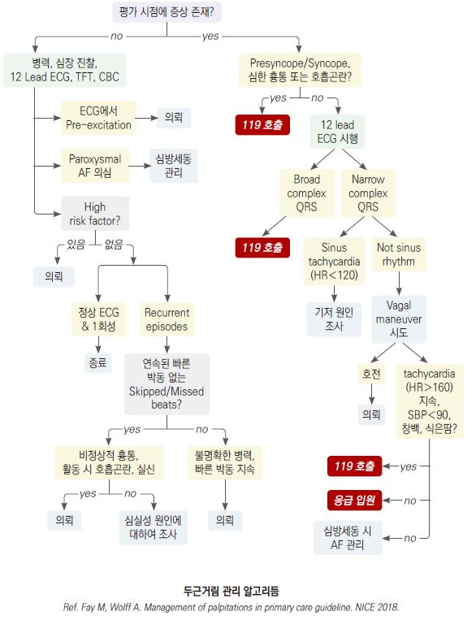

# 두근거림 Palpitation

## <mark style="color:green;">일반 사항</mark>

* 심장의 강하고 빠르고 불규칙한, 불쾌한 기분의 박동

### <mark style="color:$primary;">위험도 단계</mark>

#### <mark style="color:$danger;">응급 의뢰</mark> — 즉시 이송

* Exercise 중 발생
* Syncope or near-syncope 동반 (☞ 실신 참고)
* 고위험 구조적 심장 질환 있음
* 유전적 심장 질환 or Sudden arrhythmic death syndrome 가족력
* High degree AV block

🚩 **다음 활력징후·증상은 즉각 응급 처치 필요**

* 저혈압(SBP ＜90 ㎜Hg or DBP ＜60 ㎜Hg)
* 빈호흡(＞30회/분) 또는 호흡 곤란, 기좌 호흡
* 빈맥(＞130회/분)

#### <mark style="color:$warning;">**의뢰**</mark>&#x20;

* Tachyarrhythmia 반복 의심 병력
* 증상들과 관련된 두근거림 AND/OR 비정상 ECG AND/OR 심장의 구조적 질환 있음

🚩 **다음 동반 증상은 심장내과 의뢰 강화 근거**

* 흉통 동반 또는 수면 장애 유발
* 하지 부종 (심부전 시사)
* 국소 신경학적 증상 (색전증 시사)

#### <mark style="color:$info;">**저위험**</mark> <mark style="color:$info;"></mark><mark style="color:$info;">— 외래 관찰</mark>

* 빠르거나 / 쿵거리는 맥박
* Short fluttering
* 느린 박동 AND 정상 ECG AND 가족력 없음 AND 심장의 구조적 질환 없음

## <mark style="color:green;">원인</mark>

### <mark style="color:$primary;">심장 원인</mark>

* 심방세동(15%), 심실상성빈맥(10%), 구조적 심장 질환
  1. "flip-flopping" (or "stop and start") : 심방이나 심실의 조기 수축
  2. rapid "fluttering in the chest"
     * regular "fluttering" : supraventricular 또는 ventricular arrhythmias(sinus tachycardia 포함)
     * irregular "fluttering" : variable block(atrial fibrillation, atrial flutter, tachycardia)
  3. "pounding in the neck"(neck pulsations) : right atrium contract(jugular venous pulsations)
* Chest pain 동반 → 허혈성 심질환
* 몸을 앞으로 기울이면 호전 → 심막 질환
* Light-headedness, presyncope or syncope → 저혈압, 중증 부정맥
* 힘든 작업 시 발생 → rate-dependent bypass tract, hypertrophic cardiomyopathy

### <mark style="color:$primary;">비심장 원인</mark>

* 정신적 요인(가장 흔함; 30%) : 공포, 불안, 우울, 신체화 증상, 스트레스; 보통 ＞15분 지속
  * 과호흡, hand tingling, 과민 반응 → 불안, 공황 장애
  * 기질적 심장 질환이 배제된 경우에도 심장 감각 과민(cardiac sensory hypervigilance) 상태로 설명할 수 있음; "심장에 이상이 없다"는 단순 부정보다 "심장이 예민해진 상태"임을 설명하고 신체 증상 장애(Somatic Symptom Disorder) 관점에서 접근하면 환자 수용도가 높아짐
* 대사/전해질 이상 : thyrotoxicosis/갑상선항진증, 저혈압, 저혈당, 탈수(설사), 폐경기증후군
  * 체중 감소, tremulousness, 심부 건반사 항진, 미세한 손 떨림 → 갑상선항진증
  * 홍조, 일시적 고혈압, 두통, 불안, 발한 → pheochromocytoma, paraganglioma
* 수면무호흡증(OSA) : 야간 두근거림, 심방세동의 독립적 위험인자; 코골이·주간 과다졸음·비만 동반 시 의심
* 심박출량 증가 상태 : 빈혈, 발열, 임신, 월경, 운동, 기립성 저혈압
* 약물 : 교감 신경 항진제(예: 다이어트 약물, 충혈 제거제, 천식 흡입제), 항부정맥제, 혈관 확장제, 항콜린제, β-차단제 금단, 카페인(예: 커피, 코코아, 초콜릿, 에너지 드링크), 니코틴, 코카인, 암페타민, 알코올
* 허브 및 영양 보충제, 특정 음식

***



***

## <mark style="background-color:$warning;">Management</mark>

### <mark style="color:green;">치료 방침</mark>

* 원인 질환에 대한 치료. 그 외에는 대부분 치료 필요 없음
* SVT 동반 두근거림 : **Modified Valsalva Maneuver** 우선 시도 (아래 참고)
* 불안, 스트레스 해소 : 명상, 바이오피드백
* 강화 : 매일 유산소 운동, 활발한 신체 활동
* 적당한 체중 유지
* 카페인 함유 음료, 술 등 원인 음식을 피함
* 금연
* 감기약, 허브 등 흥분을 일으키는 약물을 피함


**Modified Valsalva Maneuver** (REVERT trial, Lancet 2015)

표준 Valsalva에 비해 동율동 전환 성공률이 약 43% vs 17%로 유의하게 높음

**적응증** : 혈역학적으로 안정적인 상심실성 빈맥 환자

**금기** : 대동맥 박리, 최근의 심근경색, 녹내장, 망막 병증 등 복압 상승이 위험한 경우

**방법**

1. 환자를 45도 반좌위로 앉힘
2. 10 mL 주사기 피스톤을 입으로 불어 움직일 정도의 힘(40 mmHg의 압력)으로 **15초간** Valsalva 시행
3. 불기를 멈추마자 즉시 **수평으로 눕히고 다리를 45도 거상**, 이자세를 15초 유지
4. 다시 45도앉은 자세로 돌아와 리듬을 확인

⚠️ 고령, 허혈성 심질환, 최근 뇌졸중/TIA 병력환자에서는 경동맥동 마사지 피함


### <mark style="color:$primary;">진단 보조 : 장기 심전도 모니터링</mark>

* 표준 12-lead ECG는 간헐적 두근거림 포착에 한계가 있음
* 증상 재현이 어렵거나 반복되는 경우 다음을 고려:
  * **패치형 장기 심전도** (예: 메모패치, KardiaMobile) : 수일\~수주 연속 기록 가능
  * **스마트워치 ECG** (Apple Watch, Samsung Galaxy Watch 등) : 환자가 증상 발생 시 직접 기록한 데이터를 외래에서 참고 자료로 활용 가능
  * **24시간 Holter 검사** : 증상 빈도가 매일인 경우

### <mark style="color:$primary;">대증 치료</mark>

* 심장 문제 등 원인 질환 배제 후 시행 (☞ p.19)
* 항불안제 : alprazolam \[자낙스], lorazepam \[아티반] (☞ p.1149)
* β-차단제 : propranolol 10\~120 ㎎/d \[인데놀], metoprolol 100\~200 ㎎/d \[베타록] (☞ p.487)
* non-DHP계 CCB : diltiazem 120\~180 ㎎/d \[헤르벤], verapamil 120\~360 ㎎/d \[이솦틴]

***

### <mark style="color:purple;">**질병코드**</mark>

R00.2 두근거림

***

## <mark style="color:orange;">처방례</mark>

> **처방례 1.**
>
> ```
> 인데놀 10 ㎎/T 2T 필요시
> 자낙스 0.25 ㎎/T 1T 필요시
> ```
>
> **처방례 2.**
>
> ```
> 헤르벤 서방정 90 ㎎/T 2T #2  
> 아티반 0.5 ㎎/T 2T #2
> ```


**인데놀(Propranolol) 처방 시 주의**

* 비선택적 β-차단제로 기관지경련 위험 — 천식·COPD 환자에게는 원칙적으로 금기; 불가피한 경우 cardioselective β-차단제(예: metoprolol) 대체 고려
* 투여 전 및 추적 시 맥박 확인 — 안정 시 맥박 ＜55회/분이면 용량 감량 또는 보류
* 임산부·수유부, 중증 말초혈관질환, Raynaud 현상에도 주의

