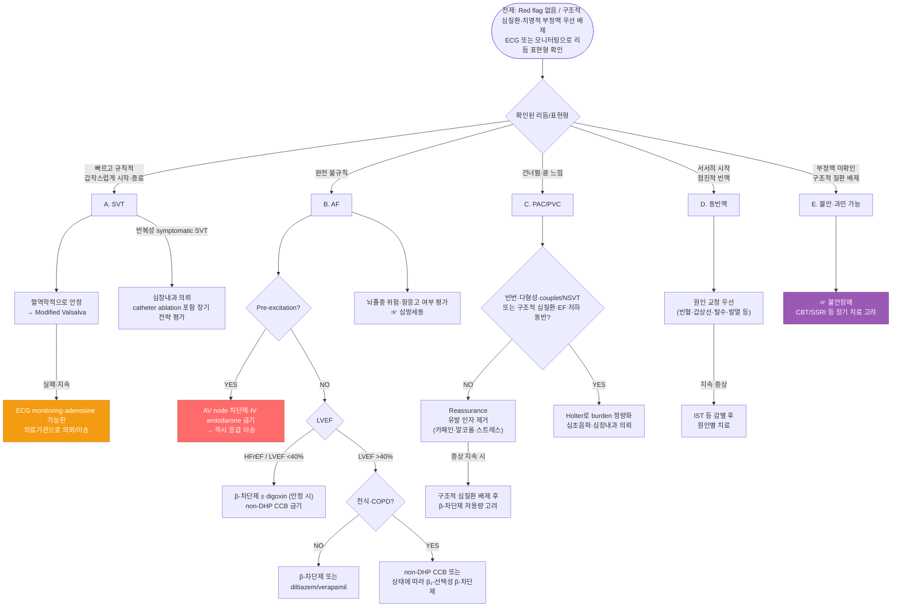

# 두근거림 Palpitation

## <mark style="color:green;">일반 사항</mark>

* 빠르게, 세게, 불규칙하게 또는 건너뛰는 것처럼 불쾌하게 심장 박동을 자각하는 증상
* 증상 당시 실제 심박수와 리듬은 정상일 수도 있음
* 원인은 크게 심장성, 정신과적, 대사/전신성, 약물/물질 관련 요인으로 나뉘며, 이런 원인 없이 생리적으로 발생하거나 뚜렷한 병인 없이 특발성으로 남는 경우도 많음
* 예후는 기저 원인에 따라 달라짐. 또한 구조적 심장 질환이나 지속성 부정맥 동반 여부에 따라 위험도가 크게 달라지므로 초기 단계에서 고위험군을 선별하는 것이 핵심

### <mark style="color:$danger;">🚩 Red Flags!</mark>

<mark style="color:$danger;">**즉각 응급 조치 및 이송**</mark>

* 지속적이거나 허혈성이 의심되는 심한 흉통
* 저혈압(SBP ＜90 ㎜Hg), 쇼크 징후 또는 의식 변화
* 심한 호흡 곤란, 기좌 호흡, 급성 심부전 소견
* 지속성 빈맥, 특히 HR ＞150회/분이면서 저혈압·의식 변화·허혈성 흉통·급성 심부전 등 혈역학적 불안정 동반
* [Syncope](../221_/021_-syncope.md) or near-syncope 동반, 특히 지속성 빈맥·비정상 ECG·구조적 심장 질환이 함께 있는 경우
* High degree AV block, 지속성 심실빈맥, pre-excited AF(WPW pattern을 동반한 AF)
* 갑작스러운 편측 마비·안면 마비·언어 장애 등 새로운 국소 신경학적 증상  `뇌졸중` `색전증`


HR ＞150회/분은 고위험 지속성 빈맥을 시사하는 실용적 기준이지만, 이보다 낮은 심박수에서도 저혈압·실신/의식 변화·허혈성 흉통·급성 심부전 또는 고위험 기저 심질환이 동반되면 응급 평가가 필요


<mark style="color:$warning;">**당일 평가 또는 응급실 의뢰**</mark>

* 증상과 연관된 비정상 ECG나 구조적 심장 질환 의심 또는 확인
* 반복되는 지속성(30초 이상) tachyarrhythmia가 의심되는 병력
* 운동 중 발생하는 두근거림
* 고위험 구조적 심장 질환이 있거나 유전성 심장 질환·Sudden arrhythmic death syndrome 가족력
* 경미하거나 비전형적인 흉부 불편감이 반복되면서 수면을 방해할 정도로 지속되는 두근거림
* 하지 부종 등 심부전 가능성을 시사하는 소견
* 박동기 또는 심장 제세동기 삽입 환자에서 새로운 두근거림 - 기기 오작동 감별 필요

조기 원인 평가 및 면밀한 추적

* 짧게 지속되는 빠르거나 쿵거리는 느낌, short fluttering이 있으나 상위 Red flag가 없는 경우
* 단독 PAC/PVC가 의심되고 정상 ECG이며 구조적 심장 질환·고위험 가족력이 없고, 빈번하지 않으며 다형성·couplet·NSVT 양상이 아닌 경우
* 느린 박동감이 있으나 정상 ECG이고 증상성 서맥·실신이 없으며 구조적 심장 질환·고위험 가족력이 없는 경우
* 흉부 불편감 동반 없이 수면을 방해하는 정도의 두근거림만 단독으로 있는 경우

## <mark style="color:green;">원인</mark>

### <mark style="color:orange;">심장 원인</mark>

* 부정맥, 구조적 심장 질환
* [심방세동](../225_/099_1-atrial-fibrillation.md)(AF) : 불규칙한 두근거림의 흔한 심장 원인
  * P파 소실, 불규칙한 RR 간격
  * 기저 원인으로 고혈압·심부전·갑상선 기능 항진증·OSA·과도한 음주 확인
    * Holiday heart : 폭음 후 발생하는 AF; 음주력 청취 시 확인 필요
* 심실상성빈맥(SVT), 구조적 심장 질환
  1. "flip-flopping" (or "stop and start") : 심방이나 심실의 조기 수축
  2. rapid "fluttering in the chest"
     * regular "fluttering" : supraventricular 또는 ventricular tachycardia (sinus tachycardia 포함)
     * irregular "fluttering" : variable block(atrial fibrillation, atrial flutter, multifocal atrial tachycardia)
  3. "pounding in the neck"(neck pulsations) : 규칙적이고 뚜렷한 경정맥 박동은 AVNRT 등 심방·심실이 거의 동시에 수축하는 SVT를 시사하며, 일부에서는 현저한 jugular venous pulsation(cannon A wave 양상)이 관찰될 수 있음
* Chest pain 동반 → 허혈성 심질환; 동반 흉통이 몸을 앞으로 숙일 때 호전되는 양상이면 심막 질환 고려
* Light-headedness, presyncope or syncope → 저혈압, 중증 부정맥
* 운동·힘든 작업 시 발생 → 동빈맥, SVT, 심실성 부정맥, 허혈성 심질환, 판막 질환·심근병증 등을 포괄하여 평가; 필요 시 운동부하검사 또는 운동 중 ECG 기록으로 확인

### <mark style="color:orange;">비심장 원인</mark>

**정신적 요인**

* 흔한 비심장성 원인으로 공포, 불안, 우울, 신체화 증상, 스트레스 등이 관련
* 비교적 오래 지속되는 경우가 흔함
* 과호흡, hand tingling, 과민 반응 시 불안, 공황 장애 의심


심장성 원인 평가와 불안·공황 평가는 병행하는 것이 원칙이며, 부정맥·구조적 심질환이 완전히 배제되어야만 불안을 고려할 수 있는 것은 아님; 기질적 심장 질환이 뚜렷하지 않은 경우 심장 감각 과민 상태로 설명할 수 있음 - 다만 이는 별도의 진단 요건(과도한 사고·불안·행동, 지속성 등)이 충족될 때 신체 증상 장애로 진단하며, 정상 심장검사 소견만으로 진단할 수 없음; "심장에 이상이 없다"는 단순 부정보다 "심장이 예민해진 상태"임을 설명하면 환자 수용도가 높아짐


**부적절 동빈맥(Inappropriate Sinus Tachycardia, IST)**&#x20;

* 안정 시 지속적 빈맥 + 경미한 활동에도 과도한 심박수 반응
* 불안장애로 오진되는 경우 많음 - 구조적 심질환 및 이차 원인 배제 후 진단

**체위성 기립성 빈맥 증후군(POTS)**&#x20;

* 기립 후 10분 이내 HR이 성인에서 ≥30 bpm, 12\~19세에서 ≥40 bpm 증가하고, 유의한 기립성 저혈압 없이 기립 시 악화되는 두근거림·어지럼·피로·brain fog 등의 증상이 기립성 증상으로서 ≥3개월 지속되는 상태
* 빈혈·탈수·발열·갑상선항진증·약물 등 이차성 동빈맥 원인을 배제

**대사/전해질 이상**

* 빈혈 : 두근거림의 흔한 대사적 원인
  * CBC로 확인하며 빈혈의 중증도와 발생 속도에 따라 증상 가능성이 증가
* 전해질 이상 : 저칼륨혈증, 저마그네슘혈증은 부정맥의 흔한 유발 원인&#x20;
  * 이뇨제 복용 환자에서 특히 확인 필요
* thyrotoxicosis/갑상선항진증, 저혈압, 저혈당, 탈수(설사), 폐경기증후군
  * 폐경기 혈관운동증상과 두근거림이 동반될 수 있으나, 새로 발생하거나 지속되는 불규칙한 두근거림은 연령만으로 폐경 증상으로 단정하지 말고 부정맥 등 심장 원인을 감별
  * 체중 감소, 미세한 손 떨림(fine tremor), 심부 건반사 항진 → 갑상선항진증
  * 홍조, 일시적 고혈압, 두통, 불안, 발한 → pheochromocytoma, paraganglioma

**수면무호흡증(OSA)**&#x20;

* 야간 두근거림, 심방세동의 독립적 위험 인자; 코골이·주간 과다졸음·비만 동반 시 의심

**생리적·이차성 동빈맥**&#x20;

* 운동, 발열, 임신, 빈혈, 탈수/저혈량, 기립성 저혈압 등

**약물**&#x20;

* 교감 신경 항진제(예: 다이어트 약물, 충혈 제거제, 천식 흡입제), 항부정맥제, 혈관 확장제, 항콜린제, β-차단제 금단, 카페인(예: 커피, 코코아, 초콜릿, 에너지 드링크), 니코틴, 코카인, 암페타민, 알코올
* GLP-1 수용체 작용제(삭센다, 오젬픽 등) : 경도의 심박수 증가(평균 2\~4 bpm) 유발 가능
* Levothyroxine : 과잉 투여 시 빈맥·두근거림 유발 - TSH 확인 필수
* SGLT2 억제제 : 직접적인 대표적 부정맥 유발 약물이라기보다, volume depletion·저혈압이 동반된 경우 이차적 빈맥/두근거림이 나타날 수 있으므로 수분 상태와 혈압을 함께 평가
* 항암 치료 : 일부  tyrosine kinase inhibitor는 QT 연장·AF·심실성 부정맥을, anthracycline는 심근손상/심부전을 통해 이차적으로 두근거림을 유발할 수 있음

**허브 및 영양 보충제, 특정 음식**

## <mark style="color:green;">진단</mark>

### <mark style="color:orange;">두근거림 표현형 분류</mark>

<table><thead><tr><th width="290">표현형</th><th>시사 진단</th><th>우선 확인</th></tr></thead><tbody><tr><td>빠르고 규칙적, 갑자기 시작·종료</td><td>SVT</td><td>ECG, Holter/이벤트 기록</td></tr><tr><td>완전 불규칙</td><td>AF, AFL, MAT</td><td>ECG, TSH, 음주력</td></tr><tr><td>건너뜀·쿵 느낌 (flip-flop)</td><td>PAC/PVC</td><td>ECG, Holter/이벤트 기록</td></tr><tr><td>서서히 시작, 점진적 빈맥</td><td>동빈맥, IST</td><td>CBC, TSH, 탈수 여부</td></tr><tr><td>기립 시 심해짐 + 피로·brain fog</td><td>POTS</td><td>기립 전후 HR·BP 측정</td></tr><tr><td>정상 범위의 맥박인데 두근거림 느낌</td><td>불안·과민, PAC/PVC 등</td><td>증상-리듬 상관관계 확인</td></tr></tbody></table>

* "두근거림이 갑자기 시작해서 갑자기 끝나나요?" → YES → SVT 가능성
* "맥이 규칙적인가요, 불규칙한가요?" → 불규칙 → AF 가능성
* "어지럼이나 실신이 동반되나요?" → YES → 고위험 부정맥 배제 필요


**증상-맥박 불일치 확인 (Pulse-Symptom Correlation)**

두근거림을 호소하지만 진료실 맥박이 정상인 경우, 증상 발생 시점의 실제 심박수와 리듬을 확인하는 것이 핵심임. 환자에게 증상 발생 시 요골동맥을 짚어 맥박수와 규칙성을 확인하거나, 스마트워치·휴대형 ECG 등으로 기록하도록 교육할 수 있음. 다만 wearable 기록은 참고 자료이며 최종 진단은 임상적으로 확인해야 함.

* 증상 중 평균 심박수가 정상 범위여도 PAC/PVC 또는 짧은 간헐성 부정맥을 배제할 수 없음 → 반복 증상이 있으면 증상 시 ECG 또는 ambulatory ECG로 symptom-rhythm correlation 확인
* 증상 중 맥박수가 빠르거나 불규칙 → 간헐적 부정맥 가능성 증가 → 증상 빈도에 맞춘 장기 심전도 모니터링 적극 고려
* 반복적인 증상에서 심전도상 부정맥이 확인되지 않고 구조적 심장 질환도 뚜렷하지 않다면 불안·cardiac hypervigilance 등 비심장성 원인의 비중을 높여 고려; 다만 심장성 평가를 완전히 종결한 뒤에만 비심장성 원인을 논의할 수 있는 것은 아니며, 두 갈래 평가는 병행하는 것이 원칙


### <mark style="color:orange;">초기 평가</mark>

* 병력 청취 : 발생 양상(규칙/불규칙), 지속 시간, 유발·완화 요인(운동·식사·음주·스트레스), 동반 증상(흉통·실신·호흡 곤란)
* 신체 검진 : 맥박(rate·rhythm), 혈압, 갑상선 촉진, 심잡음
* 기본 검사 : 12-lead ECG는 기본 시행; CBC, 전해질(K, Mg)·신기능, TSH, 혈당 등은 병력·진찰 및 의심 원인에 따라 선택
* 심초음파(ECHO) : 구조적 심장 질환이 의심되는 경우 시행
  * 심잡음 청취, 비정상 ECG(좌심실 비대, ST 변화, pre-excitation 등), 심부전·심근병증·판막 질환 의심 → 심초음파 적극 시행
  * 운동 중 두근거림 또는 실신 동반 → 구조적 심장 질환 여부에 따라 심초음파 및 필요 시 운동부하 평가/심장내과 의뢰 고려
* BNP/NT-proBNP : 하지 부종·호흡 곤란 등 심부전이 시사되는 경우 기본 검사에 추가 고려


**정상 ECG는 간헐적 부정맥을 배제하지 않는다.** 특히 SVT, 발작성 AF는 증상이 없는 시점의 ECG에서 정상 소견을 보일 수 있다. Red flag가 없고 매우 짧고 드물며 치료 결정에 영향을 주지 않는 증상까지 모두 장기 모니터링이 필수인 것은 아니지만, 반복되거나 설명되지 않는 증상으로 부정맥 가능성이 남아 있고 리듬 확인이 진단·치료 결정에 영향을 주는 경우에는 증상 빈도에 맞는 보행성 ECG를 시행한다.


### <mark style="color:orange;">장기 심전도 모니터링</mark>

증상 빈도에 따라 아래 표를 참고해 검사를 선택한다.

<table><thead><tr><th width="200">증상 빈도</th><th>권장 검사</th></tr></thead><tbody><tr><td>매일</td><td>24~48시간 Holter 검사</td></tr><tr><td>수일 ~ 수주</td><td>패치형 장기 심전도(예: 메모패치) - 수일~수주 연속 기록</td></tr><tr><td>수주 ~ 수개월</td><td>이벤트/외부 루프 기록기 또는 환자 작동형 휴대 ECG(예: KardiaMobile) - 증상 발생 시 기록</td></tr><tr><td>수개월에 1회 등 매우 드물고 실신·고위험 부정맥이 의심됨</td><td>이식형 루프 기록기(ILR) - 상급병원 의뢰</td></tr></tbody></table>

* 스마트워치 ECG (Apple Watch, Samsung Galaxy Watch 등) : 환자가 증상 발생 시 직접 기록한 데이터를 외래에서 참고 자료로 활용 가능; AF 검출 false positive 주의 - 임상 확인(clinician confirmation) 필수, 스마트워치 단독 진단은 권장하지 않음
* 증상 기록지(Symptom Diary) : 심전도 데이터와 함께 당시의 활동(운동·식사·음주 등) 및 감정 상태(불안·스트레스 등)를 병기하도록 안내 - 진단 효율을 크게 높임

### <mark style="color:orange;">SVT vs AF vs 불안·과민 감별</mark>

<table><thead><tr><th width="148">항목</th><th width="190">SVT</th><th width="180">AF</th><th>불안·과민</th></tr></thead><tbody><tr><td>시작·종료</td><td>갑작스럽게 시작·종료</td><td>비교적 갑작스럽지만 지속적 (발작성 AF는 갑자기 종료 가능)</td><td>대개 서서히 시작하나 급성 불안·공황은 갑자기 시작 가능</td></tr><tr><td>리듬</td><td>매우 규칙적</td><td>완전 불규칙 (irregularly irregular)</td><td>대체로 규칙적</td></tr><tr><td>심박수</td><td>150 – 220</td><td>90 – 170 (variable)</td><td>80 – 130</td></tr><tr><td>환자 표현</td><td>갑자기 확 올라갔다 꺼짐</td><td>불규칙하게 두근거림</td><td>심장이 계속 신경 쓰임</td></tr><tr><td>Neck pounding</td><td>AVNRT 등에서 규칙적이고 현저할 수 있음</td><td>드묾</td><td>드묾 (완전 배제 불가)</td></tr><tr><td>유발 요인</td><td>대개 spontaneous하나 운동·카페인·수면 부족 등이 촉발할 수 있음</td><td>음주·감염·수면 부족</td><td>스트레스·불안·과호흡</td></tr><tr><td>ECG</td><td>narrow regular tachycardia</td><td>P파 소실, 불규칙 RR</td><td>동빈맥</td></tr></tbody></table>

✽위 심박수·양상 범위는 흔한 경향이며 절대적 진단 기준은 아니다. 고령자·AV node 차단제 복용자에서는 SVT가 150회/분 미만일 수 있고, AF는 170회/분을 넘을 수 있으며, 공황·탈수·갑상선항진증에서는 130회/분을 넘을 수 있다.

### <mark style="color:orange;">빈번한 PAC/PVC - burden 확인이 필요한 경우</mark>

* 단독·산발적 PAC/PVC는 대개 양성이나, 다음 상황에서는 단순 안심 대상으로 분류하지 말고 Holter로 burden을 정량화하고 심초음파·심장내과 평가를 고려한다
  * 반복적 또는 매우 빈번한 PVC
  * 다형성 PVC, couplet, NSVT(non-sustained VT)
  * 운동 시 증가하는 양상
  * 구조적 심질환·실신·돌연사 가족력 동반
  * 좌심실 기능 저하 동반
* 설명되지 않는 EF 저하와 PVC burden ≥10%가 확인되면 PVC-induced cardiomyopathy를 고려한다

### <mark style="color:orange;">심방세동(AF) 의심 시</mark>

* AF는 임상의가 ECG tracing을 직접 확인하여 진단
* ECG에서 P파 소실 및 불규칙한 RR 간격 확인 시 심방세동으로 진단
* 뇌졸중 위험도 평가(2024 ESC AF Guideline은 CHA₂DS₂-VA를 제시하나, 2023 ACC/AHA 지침 및 국내 진료에서는 CHA₂DS₂-VASc가 여전히 통용됨 - 소속 기관 적용 지침 확인), 항응고 요법, 심박수 조절, 의뢰 기준 등 세부 관리는 [심방세동](../225_/atrial-fibrillation.md) 참조
* 새로 진단된 AF는 심박수 조절만으로 종결하지 말고 위험인자 관리·항응고 여부·조기 rhythm-control 적합성을 함께 평가

### <mark style="color:orange;">Pre-excitation 확인 시</mark>

* ECG에서 **delta wave(ventricular pre-excitation pattern)** 확인 시 - 증상 유무와 관계없이 심장내과 의뢰
* pre-excitation과 관련된 빈맥 증상이 동반되면 WPW syndrome으로 평가; 전기생리학적 검사(EPS)는 부전도로(accessory pathway)의 전도 특성·돌연사 위험 평가 및 catheter ablation 계획을 위해 고려
* pre-excited AF 동반 시 AV node 차단제 및 IV amiodarone은 금기 → 즉시 응급 이송 (☞ Management 항목 참조)

***


```mermaid
graph TD
    Start(["전제: Red flag 없음 / 구조적 심질환·치명적 부정맥 우선 배제<br/>ECG 또는 모니터링으로 리듬 표현형 확인"]) --> Rhythm{확인된 리듬/표현형}

    Rhythm -->|"빠르고 규칙적<br/>갑작스럽게 시작·종료"| SVT["A. SVT"]
    Rhythm -->|"완전 불규칙"| AF["B. AF"]
    Rhythm -->|"건너뜀·쿵 느낌"| PVC["C. PAC/PVC"]
    Rhythm -->|"서서히 시작<br/>점진적 빈맥"| Sinus["D. 동빈맥"]
    Rhythm -->|"부정맥 미확인<br/>구조적 질환 배제"| Anxiety["E. 불안·과민 가능"]

    SVT --> Vagal["혈역학적으로 안정<br/>→ Modified Valsalva"]
    Vagal -->|"실패·지속"| ER1["ECG monitoring·adenosine 가능한<br/>의료기관으로 의뢰/이송"]
    SVT -->|"반복성 symptomatic SVT"| SVTref["심장내과 의뢰<br/>catheter ablation 포함 장기 전략 평가"]

    AF --> PreEx{"Pre-excitation?"}
    PreEx -->|"YES"| WPW["AV node 차단제·IV amiodarone 금기<br/>→ 즉시 응급 이송"]
    PreEx -->|"NO"| EF{"LVEF"}
    EF -->|"HFrEF / LVEF <40%"| AFhf["β-차단제 ± digoxin (안정 시)<br/>non-DHP CCB 금기"]
    EF -->|"LVEF >40%"| Resp{"천식·COPD?"}
    Resp -->|"NO"| AFnormal["β-차단제 또는<br/>diltiazem/verapamil"]
    Resp -->|"YES"| AFcopd["non-DHP CCB 또는<br/>상태에 따라 β₁-선택성 β-차단제"]
    AF --> Stroke["뇌졸중 위험·항응고 여부 평가<br/>☞ 심방세동"]

    PVC --> PVCBurden{"빈번·다형성·couplet/NSVT<br/>또는 구조적 심질환·EF 저하 동반?"}
    PVCBurden -->|"NO"| PVC1["Reassurance<br/>유발 인자 제거<br/>(카페인·알코올·스트레스)"]
    PVC1 -->|"증상 지속 시"| BB3["구조적 심질환 배제 후<br/>β-차단제 저용량 고려"]
    PVCBurden -->|"YES"| PVCref["Holter로 burden 정량화<br/>심초음파·심장내과 의뢰"]

    Sinus --> Sinus1["원인 교정 우선<br/>(빈혈·갑상선·탈수·발열 등)"]
    Sinus1 -->|"지속 증상"| Sinus2["IST 등 감별 후<br/>원인별 치료"]

    Anxiety --> Anxiety1["☞ 불안장애<br/>CBT/SSRI 등 장기 치료 고려"]

    style WPW fill:#ff6b6b,stroke:#c0392b,color:#fff
    style ER1 fill:#f39c12,stroke:#e67e22,color:#fff
    style Anxiety1 fill:#9b59b6,stroke:#7d3c98,color:#fff
```

<p align="center"><strong>두근거림 - 확인된 리듬별 초기 관리 알고리듬</strong></p>

※ AF/HFrEF 분기의 β-차단제 ± digoxin은 혈역학적으로 안정된 만성 rate control 상황에 한함; 급성 대상부전 심부전 동반 시에는 별도 접근이 필요하다.

※ 심박수만으로 응급도를 결정하지 않는다. HR ＞150회/분의 지속성 빈맥은 고위험 소견이지만, 이보다 낮은 심박수에서도 혈역학적 불안정이나 고위험 기저 심질환이 동반되면 응급 평가가 필요하다.

***

## <mark style="background-color:$warning;">Management</mark>

### <mark style="color:orange;">치료 방침</mark>

* 원인 질환에 대한 치료가 우선이며, 원인이 명확하고 위험성이 낮은 경우(예: 단독 PAC/PVC, 정상 ECG + 구조적 심질환 없음)에는 약물 치료 없이 경과 관찰 가능
* SVT 동반 두근거림 : Modified Valsalva Maneuver 우선 시도
* 불안, 스트레스 해소 : 명상, 바이오피드백
* 규칙적인 유산소 운동 : 매일 또는 주 대부분의 날, 활발한 신체 활동
* 적당한 체중 유지
* 카페인 : 통상적 섭취를 모든 환자에게 일률적으로 금지할 근거는 부족함(2023 ACC/AHA/ACCP/HRS AF Guideline) - 본인이 증상 촉발을 명확히 경험하는 경우에 한해 감량 권고; 술 등 다른 유발 요인도 개별 반응에 따라 조정
* 금연
* 감기약, 허브 등 흥분을 일으키는 약물을 피함

**Modified Valsalva Maneuver** (REVERT trial, Lancet 2015; ESC 2019 SVT Guideline)

* 표준 Valsalva에 비해 동율동 전환 성공률이 약 43% vs 17%로 유의하게 높음
* 적응증 : 혈역학적으로 안정적인 상심실성 빈맥 환자
* 주의 : 대동맥 박리, 최근 심근경색 등 복압·흉강내압 상승이 이론적으로 위험할 수 있는 상황에서는 시행 전 위험-이익을 개별적으로 판단 (REVERT trial/ESC SVT 가이드라인에서 별도의 절대 금기로 명시하지는 않음)
* 방법
  1. 환자를 45도 반좌위로 앉힘
  2. 10 ㎖ 주사기 피스톤을 입으로 불어 움직일 정도의 힘(40 ㎜Hg의 압력)으로 15초간 Valsalva 시행
  3. 불기를 멈추자마자 즉시 수평으로 눕히고 다리를 45도 거상, 이 자세를 15초 유지
  4. 다시 45도 앉은 자세로 돌아와 12-lead ECG 또는 monitor rhythm strip으로 동율동 전환 여부를 확인
* Valsalva 실패 후 빈맥이 지속되는 경우 → ECG monitoring 및 adenosine 투여가 가능한 의료기관으로 즉시 의뢰/이송
* 경동맥동 마사지는 다음에 해당하면 피함 : 경동맥 잡음 또는 알려진 유의한 경동맥 협착, 최근 TIA·뇌졸중, 기타 뇌색전 고위험 상황

### <mark style="color:orange;">대증 치료</mark>

* 심장 문제 등 원인 질환 배제 후 시행 (☞ [흉통](002_-chest-pain.md))
* 항불안제 : alprazolam <mark style="color:blue;">\[자낙스]</mark>, lorazepam <mark style="color:blue;">\[아티반]</mark> - 단기 bridge 목적에 한함; 중장기 불안 관리는 (☞ [불안장애](../231_/anxiety-disorder.md)) 참조
* β-차단제 : propranolol 10\~120 ㎎/d <mark style="color:blue;">\[인데놀]</mark>, bisoprolol 2.5\~10 ㎎/d <mark style="color:blue;">\[콩코르]</mark> - 1차 진료에서는 저용량(예: bisoprolol 2.5 ㎎/d)으로 시작해 반응·내약성에 따라 서서히 증량 (☞ [β-차단제](../225_/095_-hypertension.md#v-v-adrenergic-receptor-blocker-bb))
  * ✽metoprolol(베타록)은 제조사 계약 종료에 따라 2026년 상반기 국내 공급이 중단되어 처방 시 유통 여부 확인 필요
* non-DHP계 CCB : diltiazem 120\~180 ㎎/d <mark style="color:blue;">\[헤르벤]</mark>, verapamil 120\~360 ㎎/d <mark style="color:blue;">\[이솦틴]</mark> (☞ [CCB](../225_/095_-hypertension.md#calcium-ca-channel-blocker-ccb))

**β-차단제 금기·주의**

* 안정 시 맥박 ＜55회/분은 감량·보류를 고려할 기준이나 모든 환자에게 동일하게 적용되는 절대 기준은 아님 - 운동선수·평소 서맥이 있는 무증상 환자에서는 정상일 수 있으므로 증상·혈압·AV conduction·기저 심박수를 함께 고려
* 2-3도 AV block
* 중증 천식·활동성 기관지경련 (기관지경련 위험 - 불가피 시 β₁-선택성 약물 저용량 사용); COPD 자체는 모든 β-차단제의 절대 금기는 아니며 심혈관 적응증이 있으면 β₁-선택성 약제를 신중히 사용할 수 있음
* 증상성 저혈압

**non-DHP CCB 금기·주의**

* HFrEF (심수축 기능 저하 심부전) - 금기
* 2-3도 AV block
* 중증 저혈압

※ β-차단제와 diltiazem/verapamil 병용 시 서맥·저혈압·고도 AV block 위험이 증가하므로 병용을 피하거나 병용이 불가피하면 면밀히 모니터링

※ pre-excited AF - AV node 차단제 및 IV amiodarone 금기; pre-excitation이 동반된 AF 환자에게 β-차단제·non-DHP CCB·digoxin·adenosine 등 AV node 차단제 또는 IV amiodarone을 투여하면 부전도로(accessory pathway) 전도가 촉진되어 매우 빠른 심실 반응 및 심실세동(VF)으로 이행할 위험이 있음 → 즉시 응급 의뢰

***

### <mark style="color:red;">질병코드</mark>

R00.2 두근거림

***

## <mark style="color:purple;">처방례</mark>

> **처방례 1. 확인된 증상성 동빈맥 또는 PAC/PVC - 구조적 심질환 배제 후 저용량 β-차단제**
>
> ```
> 인데놀 10 ㎎/T  1T  bid
> ※ 안정 시 맥박 55회/분 미만이면 감량 또는 보류
> ※ 반응·내약성에 따라 서서히 증량
> ```
>
> _✽구조적 심질환·고위험 부정맥이 배제되고 증상성 동빈맥 또는 빈번한 PAC/PVC로 확인된 경우에 한해 저용량 β-차단제 사용을 고려한다. 심박수·부정맥 유형이 확인되지 않은 두근거림에 경험적으로 β-차단제를 투여하는 근거는 제한적이다_

> **처방례 2. 불안장애·공황장애로 진단된 환자에서 두근거림 증상 동반 시 단기 항불안제**
>
> ```
> 자낙스 0.25 ㎎/T  1T  필요시 (1일 최대 2회, 최소 6시간 간격)
> ```
>
> _✽alprazolam은 두근거림 자체의 치료제가 아니라 불안장애·공황장애가 별도로 진단된 경우의 단기 bridge 치료다. β-차단제와 동시 병용을 원칙으로 하지 않으며, 최소 유효용량으로 가급적 1\~2주 이내 단기 사용에 한한다. 반복·만성 불안이 있으면_ (☞ [불안장애](../231_/anxiety-disorder.md)) _참조하여 SSRI/CBT 기반 치료로 전환하고, 중증·난치성 또는 진단이 불분명한 경우 정신건강의학과 협진을 고려한다. 실제 진단이 성립한 경우에만 해당 진단코드를 사용하며 최신 급여기준을 확인한다_

> **처방례 3. 재발성 AVNRT/orthodromic AVRT (안정 시 ECG에 pre-excitation 없음) - ablation을 원하지 않거나 시행하기 어려운 경우의 약물 치료**
>
> ```
> 헤르벤 서방정 90 ㎎/T 2T #2
> ```
>
> _✽2019 ESC SVT Guideline은 증상성 재발성 AVRT에서 catheter ablation을 우선 권고하며, diltiazem·verapamil·β-차단제는 안정 시 ECG에 pre-excitation이 없고 ablation이 불가능하거나 원하지 않을 때 고려하도록 한다. 안정 시 ECG에 delta wave(WPW pattern)가 있는 환자에게는 사용하지 않는다. HFrEF에는 non-DHP CCB를 사용하지 않으며, 천식·COPD에서는 non-DHP CCB 또는 임상 상황에 따라 β₁-선택성 β-차단제를 고려할 수 있다. 국내 허가사항상 경구 제형의 적응증 범위를 처방 전 확인한다. 독립적인 불안 증상이 뚜렷할 때만 항불안제(예: lorazepam 0.5 ㎎, 가급적 1\~2주 이내 단기)를 조건부로 병용하며, SVT 자체에 대한 표준 병용요법은 아니다_

> **처방례 4. 확인된 심방세동(AF), 혈역학적으로 안정 · LVEF ＞40% - 심박수 조절**
>
> ```
> 콩코르정 2.5 ㎎/T 1T qd
> ```
>
> _✽혈역학적으로 안정되고 LVEF ＞40%인 AF 환자에서 β1-선택성 β-차단제로 심박수 조절 시작; 목표 심박수는 증상에 따라 개별화하되 안정 시 대개 100\~110회/분 미만을 목표로 함. 다만 이는 주로 심부전이 없는 환자에 적용되는 목표이며, 심부전·tachycardia-induced cardiomyopathy·증상 지속 환자에게 일률 적용하지 않는다(2023 ACC/AHA/ACCP/HRS AF Guideline). 국내 허가사항상 이 용량의 적응증 범위를 처방 전 확인한다. 뇌졸중 위험도(CHA₂DS₂-VASc 등) 평가 및 항응고 여부는 (☞_ [_심방세동_](../225_/atrial-fibrillation.md)_) 참조; 새로 진단된 AF는 심박수 조절만으로 종결하지 않는다_

**인데놀(Propranolol) 처방 시 주의**

* 비선택적 β-차단제로 기관지경련 위험 - 천식·활동성 기관지경련 환자에게는 원칙적으로 금기; COPD 자체는 절대 금기는 아니나 신중해야 하며, 불가피하게 사용해야 하는 경우 [β₁-선택성 약물](../225_/095_-hypertension.md#v-v-adrenergic-receptor-blocker-bb)(예: bisoprolol)을 저용량부터 사용하고 호흡기 증상을 면밀히 모니터링
* 투여 전 및 추적 시 맥박 확인 - 안정 시 맥박 ＜55회/분은 감량·보류를 고려할 기준이나, 평소 서맥이 있는 무증상 환자 등에서는 증상·혈압·AV conduction을 함께 보아 개별화
* 당뇨 환자 주의 : β-차단제(특히 비선택적 인데놀)는 저혈당 시 나타나는 두근거림·떨림 등의 경고 증상을 은폐할 수 있음 - 당뇨 환자에서 설명 필수
* 임산부·수유부, 중증 말초혈관질환, Raynaud 현상에도 주의

***

### <mark style="color:$success;">핵심 복약 지도</mark>

> **propranolol (인데놀) · bisoprolol (콩코르) - β-차단제**
>
> * 약을 갑자기 끊으면 심박수가 급격히 빨라지거나 혈압이 오를 수 있습니다. 중단이 필요하면 반드시 의사와 상의하여 서서히 줄이십시오.
> * 맥박이 분당 55회 미만으로 느려지거나 심한 어지럼, 호흡 곤란이 생기면 즉시 병원을 방문하십시오.
> * 천식 또는 만성 폐쇄성 폐질환(COPD)이 있으신 분은 반드시 의사에게 알려 주십시오.
> * **당뇨 환자** : 이 약은 저혈당 시 나타나는 두근거림·떨림 같은 경고 증상을 느끼지 못하게 할 수 있습니다. 혈당 측정을 더 자주 하시고, 식은땀·의식 변화 등 다른 저혈당 증상에 주의하십시오.

> **diltiazem (헤르벤) · verapamil (이솦틴) - 칼슘채널차단제**
>
> * 어지럼, 저혈압 증상(갑자기 일어날 때 핑 도는 느낌)이 생길 수 있으므로 천천히 움직이십시오.
> * 발목 부종이 새로 생기거나 심해지면 알려 주십시오.
> * 자몽 주스는 약 농도를 높여 부작용을 악화시킬 수 있으므로 피하십시오.
> * **심부전(좌심실 기능 저하)** 이 있으신 분은 반드시 의사에게 알려 주십시오 - 이 계열 약은 해당 상황에서 사용하지 않습니다.

> **alprazolam (자낙스) · lorazepam (아티반) - 항불안제**
>
> * 졸음, 집중력 저하가 생길 수 있으므로 운전이나 기계 조작을 삼가 주십시오.
> * 의사 처방 없이 용량을 늘리거나 임의로 중단하지 마십시오. 장기 복용 시 의존성이 생길 수 있습니다.
> * 이 약은 두근거림의 단기 증상 완화를 위한 것입니다. 불안·스트레스가 반복된다면 의사와 상의하여 보다 근본적인 치료(상담, 다른 약물)로 전환할 수 있습니다.

> **언제 다시 병원을 방문해야 하나요?**
>
> * 맥박이 분당 55회 미만으로 느려지거나 심한 어지럼·실신이 생기는 경우
> * 새로운 흉통, 호흡 곤란, 하지 부종이 나타나거나 악화되는 경우
> * 항불안제 복용에도 두근거림·불안 증상이 반복되거나 악화되는 경우 - 근본적 치료로 전환 상담 필요
> * 처방약 복용 중 견디기 힘든 부작용(과도한 졸림, 기립성 어지럼 등)이 생겨 용량 조정이 필요한 경우

***

### <mark style="color:blue;">환자 안내서</mark>


**두근거림은 대부분 일시적이지만, 원인에 따라 치료가 필요할 수 있습니다**

심장이 빠르게 뛰거나 쿵쿵거리는 느낌이 들면 당황하지 말고 차분히 상태를 살피십시오.


#### <mark style="color:$primary;">두근거림이란 무엇인가요?</mark>

* 평소보다 심장이 빠르게 뛰거나, 세게 뛰거나, 불규칙하게 뛰는 느낌을 말합니다
* 원인은 불안·스트레스·과로, 카페인·음주, 갑상선 기능 이상, 부정맥 등 다양합니다
* 대부분은 일시적이고 무해하지만, 실신·흉통·호흡 곤란을 동반하면 즉시 평가가 필요합니다

#### <mark style="color:$primary;">두근거림 발생 시 이렇게 하세요</mark>

* **안정** : 활동을 멈추고 앉거나 누운 자세로 깊게 천천히 호흡하십시오
* **기록** : 발생 시각, 지속 시간, 동반 증상(어지럼·흉통·실신)과 함께 **당시의 활동(운동·식사·음주 등) 및 감정 상태(불안·스트레스 등)도 함께** 메모하십시오. 스마트워치나 스마트폰 심박 기록 기능을 활용하면 도움이 됩니다
* **미주신경 자극법** : 이전에 심전도로 규칙적인 SVT임이 확인된 경우, 의료진에게 교육받은 방법대로 숨을 참고 힘주는 방법(Valsalva)을 시도할 수 있습니다

#### <mark style="color:$primary;">생활 속 실천 사항</mark>

* **카페인·음주 줄이기** : 커피, 에너지 음료, 술은 두근거림을 유발하거나 악화시킬 수 있습니다
* **규칙적인 수면과 스트레스 관리** : 수면 부족과 만성 스트레스는 두근거림의 흔한 원인입니다
* **금연** : 니코틴은 심박수를 높이고 부정맥 위험을 증가시킵니다
* **처방약 지속 복용** : 부정맥 치료약은 임의로 중단하면 위험할 수 있습니다. 반드시 의사와 상의하십시오

#### <mark style="color:$primary;">이럴 때는 즉시 119를 부르거나 응급실로 가세요</mark>

* 두근거림과 함께 실신하거나 기절할 것 같은 느낌이 드는 경우
* 심하거나 지속되는 흉통, 심한 호흡 곤란, 의식 변화, 식은땀·창백이 동반되는 경우
* 갑자기 한쪽 팔다리에 힘이 빠지거나 얼굴이 처지고, 말이 어눌해지는 등 새로운 신경학적 증상이 발생한 경우

#### <mark style="color:$primary;">이럴 때는 당일 의료기관에서 평가받으세요</mark>

* 새로운 빠른 두근거림이 수시간 지속되거나 이전보다 빈도·강도가 증가하는 경우
* 이전에 구조적 심장 질환을 진단받은 분에서 새로운 두근거림이 발생한 경우
* 반복적인 두근거림과 함께 어지럼, 운동 시 증상, 하지 부종 등이 동반되는 경우
