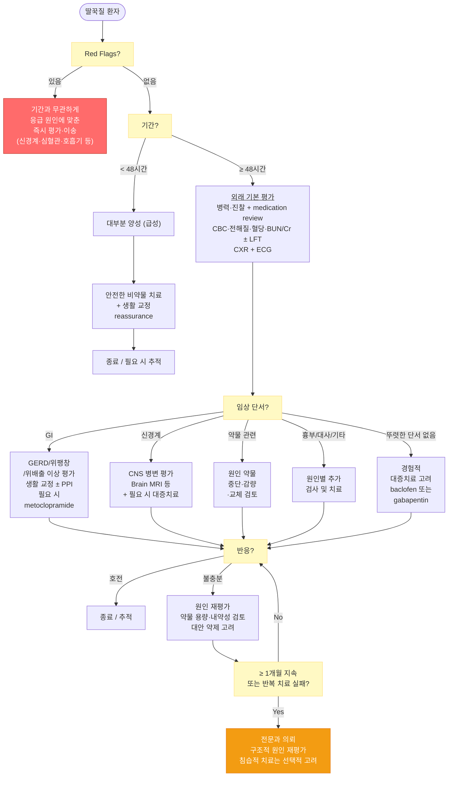

# 딸꾹질 Hiccups, Singultus

## <mark style="color:green;">일반 사항</mark>

* 횡격막 등 흡기 근육의 갑작스런 반복적인 불수의적 수축과 뒤이은 갑작스러운 성문(glottis) 폐쇄로 인하여 특징적인 "딸꾹" 소리가 발생하는 상태
* 유병률 : 성별·연령과 무관하게 흔히 발생하며 대부분 수 분 내 자연 소실
  * 지속성·난치성 딸꾹질은 드물고 남성에서 상대적으로 더 흔한 것으로 알려짐
* 합병증 : 지속 시 피로, 수면 장애, 체중 감소·탈수, 우울·불안 등 삶의 질 저하
  * 드물게 흡인·부정맥 유발 가능
  * 수술 후 환자에서는 상처 파열 위험

### <mark style="color:orange;">분류</mark>

* 급성 딸꾹질 : 48시간 미만 지속; 대부분 이에 해당하며 자연 소실되는 경우가 많음
* 지속성(persistent 또는 protracted) 딸꾹질 : 48시간 이상 지속
* 난치성(intractable) 딸꾹질 : 1개월 이상 지속

## <mark style="color:green;">원인</mark>

* 불명. 흔히 명백한 유발 요인 없이 발생
* 과식, 탄산음료 등 위장 팽창을 일으키는 음식
* GERD(위식도역류질환) - 지속성 딸꾹질의 흔한 원인 중 하나
* ＞48시간 지속되는 딸꾹질 - 간혹 기저 질환(중추신경계, 종격동, 위장관, 대사 이상 등) 또는 약물 관련
* 수면 중에도 지속되는 딸꾹질 - 기질적 원인 가능성을 높이는 단서이나 특정 병변 위치를 단독으로 진단하지는 못함
* 신경학적 증상(심한 두통, 복시, 구음장애, 보행실조, 국소 신경학적 결손, 의식 변화 등) 동반 - 뇌간 병변을 포함한 중추신경계 질환 의심

<mark style="color:cyan;">**관련 약물**</mark>

* benzodiazepine(드물게 역설적으로 유발 가능), barbiturate, steroid(특히 dexamethasone), α-methyldopa, propofol
* azithromycin, dopamine agonist, opioid(morphine, hydromorphone 등)에서도 드물게 보고됨
* aprepitant/fosaprepitant 등 NK1 수용체 길항제 : 딸꾹질이 알려진 이상반응이나 보고 빈도는 항암 regimen과 환자군에 따라 다양함; dexamethasone 등과 병용 투여되는 경우가 많아 개별 원인을 단정하기 어려움


**Dexamethasone 역설** : 항암 화학요법에서 항구토 목적으로 사용한 dexamethasone이 딸꾹질의 원인이 될 수 있음. 항암치료 관련 dexamethasone-induced hiccup에서는 methylprednisolone으로 steroid rotation을 고려할 수 있음 (용량 환산 참고: dexamethasone 0.75 ㎎ ≈ methylprednisolone 4 ㎎). 단, 임의로 중단하지 말고 반드시 항암치료 담당의와 상의하여 다음 항암 주기의 항구토 regimen에서 동등 항염증 용량 및 항구토 효과를 고려해 조정할 것.


### <mark style="color:$danger;">🚩 Red Flags!</mark>

<mark style="color:$danger;">**즉각 응급 조치 및 이송, 필요시 119 호출**</mark>

* 갑작스럽거나 심한 두통, 복시·구음장애·보행실조, 국소 신경학적 결손 또는 의식 변화 동반  `중추신경계 질환`
* 흉통·호흡 곤란·발한 동반  `심혈관 응급 질환`

<mark style="color:$warning;">**당일 \~ 수일 내 평가**</mark>

* 48시간 이상 지속&#x20;
  * 그 자체가 응급 경고징후는 아니나, 지속성 딸꾹질로서 기저 질환 배제를 위한 평가가 필요한 기준
* 수면 중에도 지속하거나 수면을 심하게 방해하는 경우  `기질적 원인`
* 발열, 복통, 황달 동반
* 지속적 구토, 경구 섭취 곤란, 탈수·쇠약 또는 흡인 위험

<mark style="color:$info;">**외래 추적 관찰**</mark>

* 이미 적절한 원인 평가와 치료를 받았고 상위 위험징후가 없는 상태에서 1개월 이상 지속되는 난치성 딸꾹질 → 전문과 의뢰 및 구조적 원인 재평가  `원인 재평가` `전문과 의뢰`

## <mark style="color:green;">진단</mark>

* 급성 딸꾹질은 대부분 검사 필요 없음
* 48시간 이상 지속되는 경우 기저 질환, 약물, 대사 이상 등을 평가
* 최근 시작·증량·변경·간헐 투여된 약물, 항암제·steroid·마취 관련 약물을 포함하여 전체 medication review

### <mark style="color:orange;">임상 단서에 따른 원인 접근</mark>

<table data-search="false"><thead><tr><th width="104">임상 범주</th><th>핵심 단서</th><th>동반 증상</th><th>주요 원인</th><th>1차 접근</th></tr></thead><tbody><tr><td><strong>위장관</strong></td><td>식후 악화, 트림, 속쓰림, 과식</td><td>복부 팽만, 구역</td><td>GERD, gastric distension, 위배출 지연</td><td>생활 교정 ± PPI; 위배출 지연·구역 시 metoclopramide 고려</td></tr><tr><td><strong>신경계</strong></td><td>지속적 딸꾹질 + 신경학적 단서</td><td>심한 두통, 복시, 구음장애, 보행실조, 국소 신경학적 결손, 의식 변화</td><td>brainstem lesion, stroke, 기타 CNS disease</td><td>신경계 원인 평가(Brain MRI 등) + 필요 시 대증치료</td></tr><tr><td><strong>약물 관련</strong></td><td>약물 시작·증량·변경·재투여와 시간적 연관</td><td>대개 비특이</td><td>steroid, benzodiazepine, propofol, opioid 등</td><td>원인 약물 확인 후 중단·감량·교체 가능성 검토</td></tr><tr><td><strong>흉부</strong></td><td>기침, 흉통, 호흡곤란</td><td>발열 가능</td><td>pneumonia, MI, mediastinal/other mass</td><td>CXR ± ECG/CT 등 원인 평가</td></tr><tr><td><strong>대사/전신</strong></td><td>전신 상태 변화</td><td>쇠약, confusion, 탈수</td><td>uremia, electrolyte imbalance, metabolic disorder</td><td>기본 혈액검사 및 원인 교정</td></tr><tr><td><strong>수술/시술 관련</strong></td><td>수술·내시경·마취 직후 발생</td><td>원인 시술에 따라 다양</td><td>vagal/phrenic irritation, 마취 관련 약물</td><td>원인 확인 + 대증치료</td></tr><tr><td><strong>기능성/심인성 가능성</strong></td><td>기질적 원인을 충분히 배제한 뒤 스트레스와 명확한 시간적 연관</td><td>불안, 스트레스</td><td>functional/psychogenic</td><td>reassurance; 필요한 경우 제한적 단기 보조치료</td></tr></tbody></table>

* 수면 중 지속 여부는 기질적 원인 가능성을 판단하는 보조 단서이며, 단독으로 중추성 원인을 진단하거나 병변 위치를 특정하지는 못함
* 식후 악화·속쓰림 → 위장관 원인 평가
* 최근 약물 변화와 시간적 연관 → 약물 유발 가능성 평가
* 흉통·호흡기 증상 → 흉부·심혈관 원인 평가
* 신경학적 증상 → CNS 병변 평가
* 전신 상태 변화 → 대사·전신 원인 평가

### <mark style="color:orange;">48시간 이상 지속 시 기본 평가</mark>

* 병력 및 신체진찰 : 신경학적·흉부·복부 진찰, 체중 변화, 연하곤란, 탈수·영양 상태 확인
* medication review : 최근 시작·증량·변경·간헐 투여된 약물, 항암제·steroid·마취 관련 약물 포함
* 기본 검사 : CBC, 전해질(Na, K, Ca ± Mg, HCO₃), 혈당, BUN/Cr ± LFT
* 흉부 X선(CXR) : 원인 불명 지속성 딸꾹질의 기본 검사
* ECG : 원인 불명 지속성 딸꾹질의 기본 검사; 심혈관 증상 동반, QT 연장 위험 평가, dopamine antagonist(metoclopramide, chlorpromazine 등) 사용 예정 시 특히 중요
* 기본 평가에서 원인이 불명확하거나 임상 단서가 있는 경우 선택적 추가 검사
  * Brain MRI : 신경학적 소견이 있거나 기본 평가 후에도 설명되지 않는 지속성·난치성 사례
  * 흉부/복부 CT : 흉부·복부 증상 또는 종격동·복강 내 병변 의심 시
  * 상부 소화기 내시경/pH 검사 : 연하곤란, 체중 감소, 역류 증상 또는 경험적 치료 실패 시

### <mark style="color:orange;">동반 증상별 추가 검사</mark>

**흉부 증상(흉통, 호흡 곤란, 발열) 동반 시**

* 흉부 X선, ECG
* CBC, CRP
* 필요 시 심장표지자 및 흉부 CT 등 원인별 검사

**신경학적 증상(심한 두통, 복시, 구음장애, 보행실조, 국소 신경학적 결손, 의식 변화) 동반 시**

* Brain MRI (뇌간·소뇌를 포함한 중추신경계 병변 평가)
* 필요 시 추가 혈관영상 또는 요추 천자 등 원인별 검사

**복부 증상(복통, 구역/구토, 황달, 체중 감소) 동반 시**

* LFT, lipase, BUN/Cr 등
* 복부 초음파 또는 복부 CT
* 적응증이 있으면 상부 소화기 내시경

**대사/전신 이상 증상(전신 쇠약, 부종, 의식 변화 등) 동반 시**

* 전해질(Na, K, Ca ± Mg, HCO₃), 혈당
* BUN/Cr (요독증)
* CBC
* 임상적으로 필요한 원인별 추가 검사

***



<p align="center"><strong>딸꾹질 진단 및 치료 알고리즘</strong></p>

<p align="center"><em><mark style="color:$info;">저자 재작성 (관련 문헌 : 딸꾹질 지속성/난치성 치료 체계적 문헌고찰 JPTCP 2024,</mark></em> <br><em><mark style="color:$info;">ESMO Clinical Practice Guidelines for orphan symptoms 2020,</mark></em><br> <em><mark style="color:$info;">Adam E. 등 baclofen 체계적 문헌고찰 2020, Steger M et al. Aliment Pharmacol Ther 2015  등)</mark></em></p>

***

## <mark style="background-color:$warning;">Management</mark>

### <mark style="color:orange;">치료 방침</mark>

* 원인이 확인되면 원인 치료를 우선
* 급성 딸꾹질은 우선 안전한 비약물 치료 및 생활 교정
* 48시간 이상 지속되거나 증상 부담이 큰 경우 원인 평가 후 약물 치료 고려
* 약물 치료에 대한 근거 수준은 전반적으로 낮으므로 환자 특성, 기저 질환, 부작용 위험을 고려하여 선택

## <mark style="color:green;">비-약물 치료 및 예방</mark>

* 비약물 방법의 근거는 제한적이며, 급성·일과성 딸꾹질에서 안전한 방법부터 시도

**복부 팽만 회피**

* 과식, 탄산음료 등 위 팽창을 유발하는 음식·음료를 피하고 천천히 섭취

**호흡·자세 조절**

* 숨 참기 (10\~20초)
* Valsalva maneuver : 코와 입을 막고 강하게 호기 시도, 10\~15초 유지
* 상체를 앞으로 숙이거나 양 무릎을 가슴 쪽으로 당겨 10\~20초 유지

**인두·삼킴 자극**

* 얼음물 또는 차가운 물을 천천히 마시기
* 입자가 굵은 설탕 1 teaspoon 삼키기
* 레몬 등 신맛을 소량 맛보기
* 혀를 가볍게 당기기


**안구 압박, carotid sinus massage, 직장 수지 마사지, 비인두 카테터 자극 등 침습적 방법 주의** : 서맥·실신 등의 위험이 있어 일상적인 1차 진료 비약물 치료로 권하지 않으며, 극히 선택된 난치성 상황에서 전문 환경의 증례 수준으로만 보고되어 있음.


## <mark style="color:green;">약물 치료</mark>

* 딸꾹질 약물 치료의 근거는 제한적이며, 비교적 사용 경험과 근거가 많은 baclofen 또는 gabapentin을 우선 고려
* metoclopramide는 위장관 유발 요인이 의심되거나 위배출 지연·구역이 동반된 경우 대안으로 고려
* chlorpromazine은 미국 FDA 및 국내 허가사항에 딸꾹질 적응증이 포함된 유일한 약제이며, baclofen, gabapentin, metoclopramide, domperidone은 딸꾹질 적응증이 국내 미승인(허가 외 사용)임을 처방 시 설명
* 가능한 최소 유효 기간 사용. 원인과 반응에 따라 치료 기간을 개별화하며, 장기간 사용한 baclofen, gabapentin은 갑작스러운 중단을 피함
* 근이완제, 항경련제, 항정신병제의 졸음, 어지럼, 저혈압, 낙상 위험 등에 주의

#### <mark style="color:$primary;">선호 약제</mark>

**Baclofen**&#x20;

* 5\~10 ㎎ tid <mark style="color:blue;">\[바크론]</mark>
* 고령자·인지저하·신기능 저하 환자 : 5 ㎎ qd 또는 bid 등 저용량으로 시작하여 3\~5일 간격으로 점진적 증량
* 신기능 저하에서는 축적에 따른 신경독성 위험이 있으므로 매우 신중히 투여
* 중증 CKD(eGFR ＜30 ㎖/min/1.73㎡), 특히 투석 환자에서는 가능한 한 회피를 고려
* 반응이 불충분한 불응성 사례에서는 최대 20 ㎎ tid(60 ㎎/day)까지 증량을 고려할 수 있음(ESMO orphan symptom guideline, 근거 수준 IV/C); 진정·어지럼 등 부작용을 면밀히 관찰
  * 국내 경직 적응증의 통상 유지량(30\~80 ㎎/day)과 혼동하지 않음
* 장기간 사용 후에는 갑작스러운 중단을 피하고 서서히 감량

**Gabapentin**&#x20;

* 300 ㎎ hs → 반응과 내약성에 따라 300\~400 ㎎ tid까지 증량 <mark style="color:blue;">\[뉴론틴]</mark>
* 고령자에서는 더 낮은 용량으로 시작 가능
* 신기능 저하 시 CrCl에 따라 감량 및 투여 간격 조정
* 장기간 사용 후에는 갑작스러운 중단을 피함

#### <mark style="color:$primary;">위장관 원인에서 고려</mark>

**Metoclopramide**&#x20;

* 5\~10 ㎎ tid, 국내 허가 상한인 최대 30 ㎎/day를 넘지 않도록 함 <mark style="color:blue;">\[맥페란]</mark>
* 딸꾹질에서는 원칙적으로 단기간(가능한 5일 이내) 사용
* 지연성 운동이상증(tardive dyskinesia), 급성 dystonia 등 EPS 위험 주의
* chlorpromazine, haloperidol 등 다른 dopamine antagonist와 병용은 EPS·NMS 위험 증가로 가능하면 피함
* 고령자에서는 EPS 및 섬망 위험이 높아 더욱 신중히 사용
* 신기능 저하 시 용량 조절 필요

**Domperidone**&#x20;

* baclofen, gabapentin, metoclopramide보다 딸꾹질에 대한 근거가 훨씬 부족하여 metoclopramide 사용이 어렵거나 금기인 경우에 한해 제한적으로 고려
* 필요한 경우 10 ㎎ tid 이하, 최대 30 ㎎/day <mark style="color:blue;">\[모티리움 엠]</mark>
* 유럽의약품청(EMA) 권고에 따라 최대 30 ㎎/day, 가능한 짧게(원칙적으로 7일 이내) 사용
* QTc 연장 및 심실성 부정맥 위험에 주의
* 고령자, 심장질환, 전해질 이상, QT 연장 약물(예: chlorpromazine) 또는 강력한 CYP3A4 억제제(예: clarithromycin, ketoconazole·itraconazole, ritonavir) 병용 시 특히 신중히 사용

#### <mark style="color:$primary;">후순위 약제</mark>

**Chlorpromazine**&#x20;

* 미국 FDA 및 국내 허가사항에 딸꾹질 적응증이 포함된 유일한 약제
* 국내 허가 용량은 비정신과 영역 기준 1일 30\~100 ㎎ 분할 투여이며, 미국에서는 25\~50 ㎎ tid\~qid(최대 200 ㎎/day)까지 보고되나 국내 일반 허가 용량을 초과할 수 있으므로 처방 시 상한에 유의 <mark style="color:blue;">\[클로르프로마진]</mark>
* 부작용 : 저혈압/기립성 저혈압, 과도한 진정, 추체외로 증상, QT 연장 및 부정맥, 항콜린성 이상반응, 드물게 신경이완제악성증후군(NMS)
* 노인·저혈압·낙상 위험 환자에서 특히 주의
* 파킨슨병·Lewy body dementia 환자에서는 증상 악화 가능성으로 신중히 사용
* metoclopramide, haloperidol, domperidone 등 다른 dopamine antagonist 또는 QT 연장 약물과의 병용은 가능하면 피함

#### <mark style="color:$primary;">제한적·저근거 대안</mark>

* haloperidol, carbamazepine, phenytoin, nefopam, viscous lidocaine 등은 증례·소규모 연구 또는 과거 문헌 수준으로 보고되며 표준적 1차 치료로 권하지 않음
* benzodiazepine은 일부에서 역설적 딸꾹질을 유발할 수 있으므로 장기·단독 1차 사용은 권장하지 않음
  * 기질적 원인이 충분히 배제되고 불안·스트레스와 명확한 연관성이 있는 경우에 한해 단기간 보조적으로 고려

#### <mark style="color:$primary;">PPI, 제산제</mark>

* GERD 또는 위산 관련 자극이 의심되는 경우 생활 교정과 함께 PPI 고려
* omeprazole : 20\~40 ㎎/d <mark style="color:blue;">\[오엠피]</mark>

#### <mark style="color:$primary;">항암치료 관련 dexamethasone-induced hiccup</mark>

* dexamethasone이 원인으로 의심되면 항암치료 상황에서 methylprednisolone으로 steroid rotation을 고려할 수 있음
* 반드시 항암치료 담당의와 상의하여 다음 항암 주기의 항구토 regimen에서 동등 항염증 용량과 항구토 효과를 함께 고려해 조정하며, dexamethasone을 임의로 단순 중단하지 않음

## <mark style="color:green;">시술 및 기타 처치</mark>

**난치성 딸꾹질 - 의뢰 대상**

* 1개월 이상 지속 (intractable)
* 적절한 원인 평가 및 약물 치료에도 지속
* 구조적 원인 의심

**난치성 딸꾹질에 선택적으로 고려되는 치료법**

* 횡격막 신경 차단술(Phrenic nerve block) : 극히 선택된 난치성 사례에서 전문 시술 환경에서 고려; 호흡기 합병증 위험에 주의
* 미주신경 자극술(Vagus nerve stimulation, VNS) : 극히 난치성 사례에서 제한적인 증례보고 수준이며 표준 치료는 아님
* 내시경적 접근 : GERD·식도 질환이 의심되는 경우 원인 확인 및 치료 목적으로 시행

***

### <mark style="color:red;">질병코드</mark>

* R06.6 딸꾹질

***

## <mark style="color:purple;">처방례</mark>

> **처방례 1.** _(선호 약제 - 신기능 정상, CNS 부작용 위험 낮은 경우)_
>
> ```
> 바크론 5 ㎎/T 3T #3  → 3~5일 후 반응과 내약성을 보며 10 ㎎ tid까지 증량 가능
> ```
>
> _✽ baclofen 단독 투여. 고령자·신기능 저하 환자에서는 더 낮은 용량으로 시작하며, 중증 CKD에서는 가능하면 회피를 고려_

> **처방례 2.** _(선호 대안 - 신경인성 원인 의심 또는 baclofen 부작용 우려 시)_
>
> ```
> 뉴론틴 300 ㎎/C 1C hs → 반응과 내약성을 보며 점진적으로 증량
> ```
>
> _✽ gabapentin 단독 투여. 신기능에 따라 감량 및 투여 간격 조정_

> **처방례 3.** _(위장관 유발 요인 - 위배출 지연·구역 등이 동반된 경우)_
>
> ```
> 맥페란 5 ㎎/T 1~2T tid
> ```
>
> _✽ 원칙적으로 단기간 사용. 최대 30 ㎎/day, 가능한 5일 이내, 투여 간격 최소 6시간을 지킬 것. 다른 dopamine antagonist와의 병용은 가능하면 피함_

> **처방례 4.** _(후순위 - persistent/intractable hiccup에서 선호 약제가 불충분하거나 사용하기 어려운 경우)_
>
> ```
> 클로르프로마진 50 ㎎/T ½T tid → 반응과 내약성에 따라 조정
> ```
>
> _✽ 저혈압·진정·추체외로 증상에 주의. metoclopramide와의 병용은 피하는 것이 안전_

***

### <mark style="color:$success;">핵심 복약 지도</mark>

> **baclofen (바크론) - 근이완제**
>
> * 복용 초기에 어지럼·졸음이 생길 수 있으므로 운전이나 기계 조작을 삼가 주십시오.
> * 신장 기능이 나쁜 경우 심한 졸음·의식 저하 등 부작용 위험이 커질 수 있으므로 반드시 의사에게 알려 주십시오.
> * 장기간 복용한 경우 갑자기 중단하면 경련·섬망 등 금단 증상이 나타날 수 있으므로 의사와 상의하여 서서히 줄이십시오.

> **gabapentin (뉴론틴) - 항경련제**
>
> * 어지럼·졸음·보행 불안정이 생길 수 있으며, 특히 고령자에서 낙상 위험이 높습니다.
> * 콩팥 기능이 저하된 경우 용량 조절이 필요합니다.
> * 마약성 진통제(opioid), 수면제, 항불안제 등 다른 중추신경계 억제제와 함께 복용하면 호흡 억제 위험이 증가할 수 있으므로 반드시 의사에게 알려 주십시오.
> * 장기간 복용한 경우 의사 처방 없이 갑자기 중단하지 마십시오.

> **chlorpromazine (클로르프로마진) - 항정신병제**
>
> * 혈압이 낮아지거나 갑자기 일어날 때 어지럼(기립성 저혈압)이 생길 수 있으므로 천천히 움직이십시오.
> * 강한 졸음이 올 수 있습니다. 운전이나 기계 조작을 피하십시오.
> * 손 떨림, 근육 뻣뻣함, 비정상적인 움직임 등이 생기면 즉시 알려 주십시오.
> * 딸꾹질이 멈추면 의사와 상의하여 복용을 중단합니다 (장기 복용 목적 약물이 아닙니다).

> **언제 다시 병원을 방문해야 하나요?**
>
> * 약을 충분한 용량과 기간 사용했는데도 딸꾹질이 호전되지 않는 경우
> * 심한 어지럼·실신, 걷기 힘들 정도의 보행 장애가 생긴 경우
> * 손 떨림, 근육 뻣뻣함, 고열, 의식 변화 등이 함께 나타나는 경우 — 즉시 내원
> * 갑작스러운 심한 두통, 시야 이상, 말이 어눌해짐, 팔다리 힘 빠짐이 동반되는 경우 — 즉시 내원
> * 새로운 흉통이나 호흡곤란이 생긴 경우 — 즉시 내원

***

## <mark style="color:blue;">환자 안내서</mark>


**딸꾹질은 대부분 수 분 내 저절로 멈추지만, 48시간 이상 지속되면 원인 평가가 필요합니다**

당황하지 말고 안전한 방법부터 시도해 보십시오.


#### <mark style="color:$primary;">딸꾹질이란 무엇인가요?</mark>

* 횡격막(가슴과 배 사이 근육)이 갑자기 수축하면서 성대가 닫혀 "딸꾹" 소리가 나는 현상입니다
* 급하게 먹거나 마시기, 탄산음료, 과식, 급격한 온도 변화 등이 흔한 원인입니다
* 대부분 48시간 이내 자연히 멈추며, 이를 넘어서 지속되면 기저 질환 평가가 필요합니다

#### <mark style="color:$primary;">딸꾹질 멈추는 방법</mark>

* **숨 참기** : 깊게 들이쉰 후 10\~20초간 숨을 참으십시오
* **차가운 물 천천히 마시기** : 작은 모금으로 연속해서 삼키면 도움이 될 수 있습니다
* **설탕 한 숟갈** : 설탕을 혀 위에 얹고 천천히 녹여 삼키는 방법이 도움이 되는 경우가 있습니다 (삼키기 어려움·흡인 위험이 있거나 당뇨병이 있는 분은 주의)
* **무릎을 가슴 쪽으로 당기기** : 앉은 자세에서 무릎을 끌어안아 10\~20초 유지해 보십시오

#### <mark style="color:$primary;">이럴 때는 병원을 방문하세요</mark>

**일반 진료 (외래 방문)**

* 딸꾹질이 48시간 이상 지속되는 경우
* 수면을 방해할 정도로 심하거나 반복되는 경우
* 지속적인 구토, 음식이나 물을 먹기 어려움, 탈수·심한 쇠약이 있는 경우
* 체중 감소, 연하 곤란(삼키기 어려움)이 동반되는 경우
* 처방약을 복용 중에도 딸꾹질이 멈추지 않는 경우

**즉시 119 또는 응급실 방문**

* 심하거나 지속되는 흉통·호흡곤란·식은땀이 동반되는 경우
* 갑작스러운 의식 변화가 있는 경우
* 심한 두통, 복시·시야 이상, 말이 어눌해짐, 한쪽 팔다리 힘 빠짐, 보행 이상이 동반되는 경우
