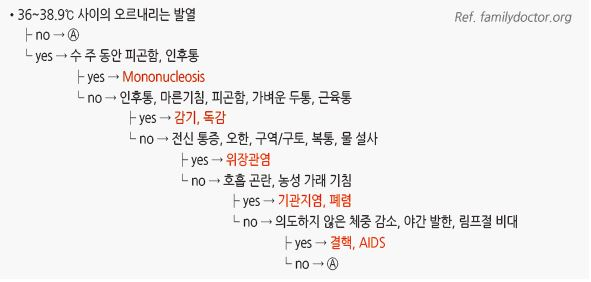
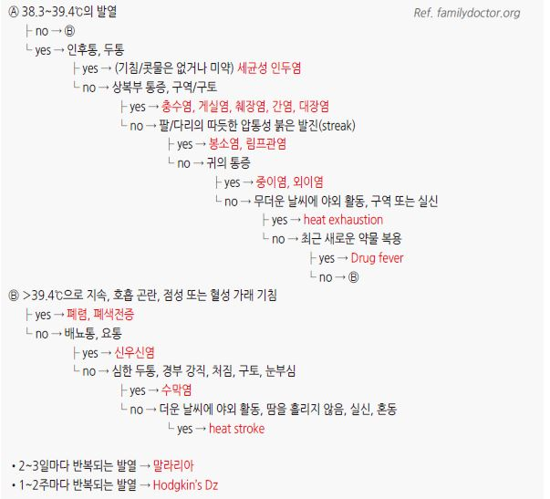

# 발열 Fever

## <mark style="color:green;">일반 사항</mark>

* 중심 체온- 36.5\~37.5℃; 평균 구강 체온(18\~40세)- 36.8±0.4℃
* 겨드랑이 ＜ 구강 ＜ 직장 체온 : 각각 0.5℃ 차이
* 고막 체온 : 변동성이 심함(특히 귀지가 차 있을 때, ＜3개월 영아에서 부정확); 직장보다 0.8℃ 낮음(기기에 따라 직장 기준으로 조정된(adjusted mode) 체온이 표시됨)
* 신생아(≤4주)에서는 겨드랑이 전자 체온계 사용 권고
* ≤5세에서는 구강/직장 체온계 사용은 피함
* 체온 일중 변동 : 0.5(\~1)℃; 오전 6시가 가장 낮고(\~37.2℃), 오후 4\~6시가 가장 높음(\~37.7℃); 식후에 높음
* 체온 상승의 정도가 반드시 병의 중증도와 관련된 것은 아님
* 열 반응은 성인보다 소아에서 큼
* 다음의 경우 감염이 되어도 열이 나지 않을 수 있음 : 신생아, 노인, 만성 간/신부전, steroid 투여
* 월경을 하는 여성은 배란 전 2주 동안 오전 체온이 낮아지고 배란과 함께 0.6℃ 상승하여 월경 시작 때까지 유지됨

### <mark style="color:$primary;">발열 용어</mark>

* 발열 : 일상적 변화 이상의 체온 상승; 통상 고막 체온계로(adjusted mode) ＞38℃
  * hyperpyrexia : ＞41.5℃; 주로 CNS 이상에 의하며, 감염에 의한 경우는 드묾
* sustained fever : 변동 폭이 ≤0.5℃로 지속되는 발열
* remittent fever : 변동 폭이 ＞0.5℃인 발열
* septic 또는 hectic fever : 변동 폭이 심한 발열
* intermittent fever : 하루 중 정상 체온인 때가 있는 발열
* relapsing fever : 발열 기간 중 체온이 정상인 날이 있는 발열; 말라리아
* double quotidian fever : 하루 중 2번의 정점이 있는 발열; 염증성 관절염
* biphasic fever : 한 질환에서 두 번의 발열 기간; 황열, 뎅기열, enterovirus, leptospirosis
* periodic fever : 규칙적인 주기가 있는 발열; PFAPA syndrome (☞ p.264)

### <mark style="color:$primary;">발열의 영향</mark>

* 위해 : 열이 O2 소모량/CO2 발생량/심박출량을 증가시킴; 현저하게 높은 체온은 빈혈, 심/폐질환, 대사 질환(예: 당뇨병) 등 만성 질환의 상태를 악화시킬 수 있음
* 이익 : 열이 병균의 증식을 낮추며 신체 면역 반응을 증가시킨다는 실험실 연구가 있음; 임상적 입증은 부족함

### <mark style="color:$primary;">발열 치료에 대한 논란</mark>

* 1회성의 돌발적인 발열은 유의미한 감염 질환과 관련 없음
* 고열이 특발성 간질 환자에서 발작 빈도를 증가시킬 수 있으나 뇌 손상을 초래한다는 근거는 없음
* 해열제가 세균이나 바이러스 감염에서 회복 촉진, 면역 체계 보조, 또는 치유 지연에 유의미하게 작용하지는 않으나, 진단이나 항생제 효과 평가 등의 적절한 치료를 방해할 수 있음

### <mark style="color:$danger;">🚩 Red Flags!</mark>

* 심한 빈맥, 저혈압
* 열과 발진이 함께 진행
* 심한 빈호흡, 호흡 곤란
* 심한 두통, 경부 경직
* 심한 구토/설사, 기타 심한 동반 증상
* 의식 변화
* ＞41℃의 고열
* 최근 벌레(진드기)에 물린 병력 또는 야외 활동
* 예상과 다르게 지속
* 최근 면역 억제/화학요법 시행
* 최근 말라리아/지카 유행 지역 방문; 남아시아, 중동, 아프리카, 남아메리카

## <mark style="color:green;">원인</mark>

* 감염
  * 바이러스 감염 : 급성 발열의 가장 흔한 원인; 보통 일주일에 걸쳐 서서히 하강하여 자연 회복
  * 세균 감염 : 적절한 항생제 사용 시 급속히 하강 (3일 내 반응)
* 염증, 종양
* 자가면역/자가 염증 반응
* 더운 환경(더운 날씨, 지나친 난방, 두꺼운 의복), 탈수열

## <mark style="color:green;">진단</mark>

* 진찰 소견으로 감별하며, 의심되는 질환에 대한 진단 검사를 고려
* 발열의 원인이 감별되지 않는 경우에는 의뢰를 고려

### 증상/병력에 따른 감별

<figure><figcaption></figcaption></figure>

<figure><figcaption></figcaption></figure>

## <mark style="color:green;">불명열 (Fever of Unknown Origin)</mark>

<table><thead><tr><th width="94.631591796875"></th><th>고전적 불명열 (Classic)</th><th>병원성 불명열 (Nosocomial; Healthcare-associated)</th></tr></thead><tbody><tr><td><strong>정의</strong></td><td>체온 ≥38.3℃, 기간 ≥3주, ≥3회 외래 방문 또는 입원 3일 후에도 원인 불명</td><td>체온 ≥38.3℃, 기간 >3일, 입원 당시 발열 상태 또는 당시 잠복기 아님</td></tr><tr><td><strong>환자 위치</strong></td><td>지역 사회, 병원</td><td>급성 질환을 다루는 병원</td></tr><tr><td><strong>흔한 원인</strong></td><td>감염, 염증, 악성 종양, 습관성 고열</td><td>원내 감염, 수술 후 합병증, drug fever</td></tr><tr><td><strong>병력</strong></td><td>여행, 접촉, 동물/벌레 노출, 약물, 예방접종, 가족력, 심장 판막 이상</td><td>수술, 시술, 장치 삽입, 해부학적 이상, 약물</td></tr></tbody></table>

#### 원인

* 특별하지 않은 상태의 비특이적 증상인 경우가 가장 흔함
* 감염(30%) : 복부/골반 농양, 간염, 카테터 감염, 치아 농양, 심막염, Mycobacterium 감염, 골수염, 신질환, 부비동염, 상처 감염
* 종양(18%), 교원혈관병(12%; RA, SLE), 기타(14%; drug fever 포함), 미상(7\~30%)

#### 검사

* 혈액 검사 : ESR, CRP, RF, CPK, ANA, protein electrophoresis, lactate dehydrogenase, Tb test, HIV, 배양 검사
* 소변 : U/A, 배양 검사
* 영상 검사 : CT

## <mark style="background-color:$warning;">Management</mark>

### <mark style="color:$primary;">치료 방침</mark>

* 원인에 따른 치료 시행
* 시험적 치료 : 불가피한 경우 임상적 증거에 기초하여 시험적 치료 시행
* 해열제 : 발작 병력이 있는 소아 또는 열 때문에 힘들어 하는 환자에 대하여 투여 고려
* 소위 shotgun approach(다제 처방)는 증상/징후를 모호하게 하여 진단을 어렵게 하고 의도하지 않은 문제를 일으킬 수 있으므로 삼가야 함

## <mark style="color:green;">비-약물 해열 치료</mark>

* 수분 섭취를 늘림
*   미지근한 물(30℃) 목욕

    •젖은 스펀지로 닦아 주거나 알코올을 사용하는 것은 권하지 않음

    •Cold water immersion : 찬물에 몸을 담그면 말초혈관 수축(peripheral vasoconstriction)이 발생할 수 있다는 주장이 있으나

    신체를 냉각시키는 전도 및 대류 작용에 비하여 의미 있는 수준은 아니라는 반론도 있음; 고열을 낮추기 위하여 주의하여

    적용 고려
* 옷을 벗기거나 더 많이 감싸는 것 모두 권하지 않음

## <mark style="color:green;">약물 해열 치료</mark>

* NSAID(예: ibuprofen), acetaminophen
*   정상 체온 상태에서는 NSAID나 aspirin의 PGE2에 대한 작용이 없기 때문에 열이 없는 상태에서 관절염 등의 치료를 위한

    이들 약제 투여로 정상 체온이 더 낮아지지는 않음
* ibuprofen 또는 acetaminophen이 효과가 없으면 체중에 따른 충분한 용량이 투여 되었는지 확인하며, 상호 전환하여 투여할 수 있음
  * 각각의 단독 투여에도 불구하고 고열이 지속되어 심한 보챔이나 통증 등 컨디션 저하를 보이거나, 다음 투약 시간까지 간격이 많이 남았으나 다시 고열로 인해 힘들어할 때 두 가지를 교대로 병용 투여할 수 있으나, 소아에서 교대 투여는 보호자의 실수나 불안감으로 인한 과량 투여 위험이 있으므로 주의가 필요함
  * 두 가지 약제의 동시 투여에 의한 추가 효과는 입증되지 않음
* NSAID들의 병용 투여는 추가 효과가 없으며 부작용이 증가하므로 피함

#### Acetaminophen

* 성인 : 650\~1,000 ㎎ q6hr; 최대 3 g/d(간/신 장애 시 2 g/d) \[타이레놀]
* 소아 : 10\~15 ㎎/㎏ q4\~6hr, 최대 5회/d; ≥3개월 연령 허가
  * \[세토펜 현탁액]\(32 ㎎/㎖. 0.4 ㎖/㎏ qid 또는 1.5\~2 ㎖/㎏/d #4)

#### Ibuprofen

* 성인 : 400 ㎎ q6hr \[부루펜]
* 소아 : 5\~10 ㎎/㎏ q6\~8hr, 최대 40 ㎎/㎏/d; ≥6개월 연령 허가
  * \[부루펜 시럽]\(20 ㎎/㎖. 0.25\~0.5 ㎖/㎏ tid\~qid 또는 1.5 ㎖/㎏/d #3\~4)

#### Aspirin

* 용법 : 325\~650 ㎎ q6hr \[로날]
* 소아 사용 금지

***

### <mark style="color:purple;">**질병코드**</mark>

R50 기타 및 원인 미상의 열
