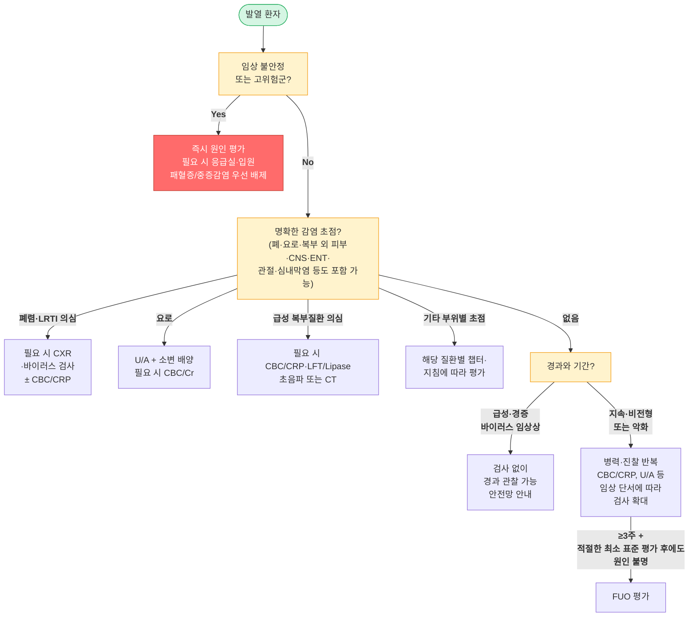
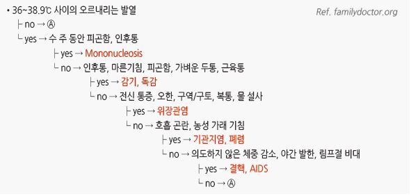
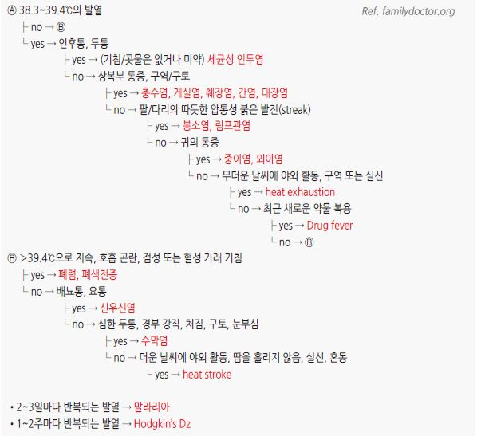
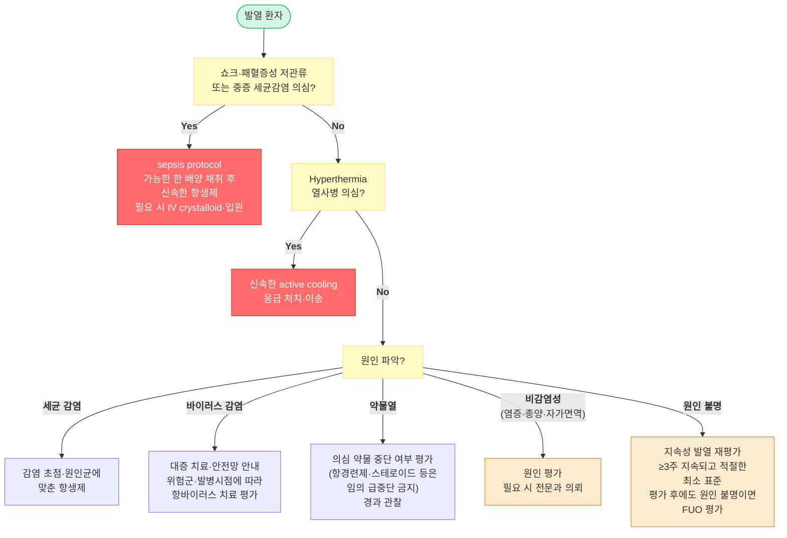

# 발열 Fever

## <mark style="color:green;">일반 사항</mark>

* 발열 : 일상적 변화 이상의 체온 상승
* 발열의 위해 : 열이 O2 소모량/CO2 발생량/심박출량을 증가시킴
  * 현저하게 높은 체온은 빈혈, 심/폐질환, 대사 질환(예: 당뇨병) 등 만성 질환의 상태를 악화시킬 수 있음
* 정상 체온은 측정 부위·연령·시간대·개인 및 측정기기에 따라 달라짐
* 건강한 성인의 측정부위별 집단 평균 체온은 대략 다음과 같음
  * 직장 : 약 37.0℃
  * 구강 : 약 36.6℃
  * 고막 : 약 36.6℃
  * 겨드랑이 : 약 36.0℃
  * 일반적으로 직장 체온은 구강 체온보다 높고 겨드랑이 체온은 낮게 측정되나, 그 차이는 기기·측정법·연령·체온 수준에 따라 달라 일정한 값을 더하거나 빼서 다른 부위의 체온으로 환산하지 않음 ([Geneva et al., Open Forum Infect Dis 2019](https://pmc.ncbi.nlm.nih.gov/articles/PMC6456186/))
* 체온은 하루 중 약 0.5℃ 내외로 변동하며, 대개 새벽에 가장 낮고 늦은 오후～초저녁에 가장 높음. 식사·운동·수면·월경주기 등의 영향도 받음
* 월경 주기에서는 배란 후 황체기에 기초체온이 대개 약 0.3\~0.5℃ 상승하여 월경 시작 무렵까지 유지될 수 있음
* 소아의 체온 측정법은 연령과 적용 지침에 따라 다름
  * 신생아(≤4주) : 겨드랑이 전자체온계 사용 권고
  * 4주\~5세 : 겨드랑이 또는 적절한 고막체온계를 고려
    * ≤5세에서는 구강·직장 체온 측정을 routine으로 권하지 않음
  * 체온 기록 시 측정 부위와 기기를 함께 기록
* 측정 부위별 통상 발열 기준
  * 직장 : ≥38.0℃
  * 구강 : ≥38.0℃. 일부 자료에서는 연령·시간대·임상상황에 따라 ≥37.8℃ 또는 평소 기초체온 대비 상승을 기준으로 사용
  * 고막·측두동맥 : ≥38.0℃; 기기·측정법·환경·귀지·발한 등의 영향을 많이 받음. 경계값이거나 임상상과 맞지 않으면 더 신뢰할 수 있는 방법으로 재확인
  * 겨드랑이 : 통상 ≥37.2\~37.5℃를 발열 의심 기준으로 사용하지만 중심체온 상승을 발견하는 민감도와 정확도가 낮으므로 선별값으로만 해석. 경계값이거나 임상적으로 발열이 의심되면 해당 연령과 진료 상황에 적절한 방법으로 재확인
* 다음과 같은 특수 상황에는 일반 외래의 부위별 기준과 구분되는 별도의 조작적 정의를 적용
  * 항암 치료 관련 호중구감소성 발열 : 일회성 구강 체온 ≥38.3℃ 또는 ≥38.0℃가 1시간 이상 지속
  * 성인 ICU에서 발생한 새로운 발열 : 단회 체온 ≥38.3℃ ([SCCM/IDSA 2023](https://www.idsociety.org/practice-guideline/new-fever-in-critically-ill-patients/))
  * 정확한 체온이 진단·치료 결정에 중요한 중환자에서 폐동맥카테터·방광카테터·식도 탐침 등의 thermistor가 이미 삽입되어 있거나 이를 통한 중심체온 측정이 가능하면 이를 우선하지만(체온 측정만을 위해 이러한 장치를 새로 삽입하지 않음), 그렇지 않으면 겨드랑이·고막·비접촉 측두동맥보다 구강 또는 직장 체온을 우선 고려 ([SCCM/IDSA 2023](https://www.idsociety.org/practice-guideline/new-fever-in-critically-ill-patients/))
* 영아·고령자·면역저하자·중환자는 중증 감염이 있어도 기준 이상의 발열이 없거나 저체온으로 나타날 수 있으므로, 임상적으로 중증 감염이나 패혈증이 의심되면 체온 기준 충족을 기다리지 않고 평가
* 이상의 절단값은 해당 임상 상황의 평가를 표준화하기 위한 기준이며 중증 감염을 배제하는 기준이 아님

#### <mark style="color:$primary;">발열 용어</mark>

* hyperpyrexia : ＞41.5℃의 극심한 발열; 중증 감염, CNS 손상, 약물·독성 원인 등을 감별
  * 정의와 별개로 체온 ＞41℃는 응급 평가가 필요한 위험 신호로 간주
* 고체온증(hyperthermia; 열사병 등) : 시상하부 set-point의 상승 없이 체온이 오르는 것
  * 해열제가 효과 없으며 냉각 요법이 우선임 (☞ [열 질환](../230_/205_-heat-illness.md))
* sustained fever : 변동 폭이 ≤0.5℃로 지속되는 발열
* remittent fever : 변동 폭이 ＞0.5℃인 발열
* septic 또는 hectic fever : 변동 폭이 심한 발열
* intermittent fever : 하루 중 정상 체온인 때가 있는 발열
* relapsing fever : 발열 기간 중 체온이 정상인 날이 있는 발열; 말라리아
* double quotidian fever : 하루 중 2번의 정점이 있는 발열; 성인형 스틸병
* biphasic fever : 한 질환에서 두 번의 발열 기간; 황열, 뎅기열, enterovirus, leptospirosis
* periodic fever : 규칙적인 주기가 있는 발열; [PFAPA syndrome](../222_/054_-stomatitis.md#pfapa)(소아의 주기성 발열-아프타구내염-인두염-경부림프절염 증후군)

#### <mark style="color:$primary;">발열 치료에 대한 논란</mark>

* 한 번의 체온 상승은 측정오류·운동·환경의 영향을 받을 수 있으므로 적절한 방법으로 재측정
  * 실제 발열이면 전신 상태와 위험군(면역저하, 영아, 고령 등) 여부에 따라 평가
* 발열의 이익 : 열이 병균의 증식을 낮추며 신체 면역 반응을 증가시킨다는 실험실 연구가 있음 - 임상적 입증은 부족함
* 고열이 특발성 간질 환자에서 발작 빈도를 증가시킬 수 있으나, hyperthermia(예: 열사병)를 제외한 대부분의 감염성 발열에서 뇌 손상을 초래한다는 근거는 없음
* 해열제가 세균이나 바이러스 감염에서 예후를 개선한다는 근거는 명확하지 않음
  * 해열제의 주목적은 증상 완화와 대사 부담 감소이며 무분별한 사용은 피함
  * 해열제 투여 후 체온이 내려가거나 전신 상태가 일시적으로 좋아졌다는 이유만으로 중증 세균 감염을 배제하지 않음

## <mark style="color:green;">원인</mark>

* 감염
  * 바이러스 감염 : 급성 발열의 가장 흔한 원인
    * 대부분의 단순 급성 바이러스 감염은 수일\~1주 이내 호전되지만 원인 바이러스와 환자 위험도에 따라 발열 기간과 경과가 다양함
  * 세균 감염 : 적절한 항생제 사용 시 보통 수일 내 임상적 호전이 나타나나, TB·농양·심내막염 등 원인에 따라 예외 존재
* 염증, 종양
* 자가면역/자가 염증 반응
* 약물

#### <mark style="color:$primary;">약물 유발열 (Drug fever)</mark>

* 약물 투여 중 다른 원인으로 설명되지 않는 발열이 발생하고 원인 약물 중단 후 호전되는 임상 진단으로, 감염·염증질환 등 다른 원인을 배제해야 함
* 약물 중단 후 대개 48\~72시간 내 소실되지만 약물·기전에 따라 더 오래 지속될 수 있음
* 발열에도 불구하고 환자 컨디션이 비교적 양호한 경우가 있으나 항상 나타나는 특징은 아님
  * 발열 정도에 비해 심박수 증가가 적은 '상대적 서맥'(Faget sign)이 관찰되기도 함. 다만 정의가 일정하지 않고 진단적 민감도·특이도가 확립되지 않았으며, 장티푸스·브루셀라·레지오넬라 등 일부 감염병에서도 나타나므로 보조적 단서로만 해석
* 백혈구는 정상·증가·감소 모두 가능하며 호산구 증가증이 동반될 수 있으나 빈도와 정의가 연구마다 다양함
* 발진, 점막 병변, 안면부종, 림프절병증, 간·신장 손상 또는 현저한 호산구 증가가 동반되면 단순 약물열로 간주하지 말고 DRESS, SJS/TEN 등 중증 약물이상반응을 우선 감별
* 발현 시점과 기전은 다양함
  * 과민 반응 : 투여 1\~3주 후; 동일 약물 재노출 시에는 수 시간\~수일 내로 단축될 수 있음; penicillin, cephalosporin, sulfonamides, nitrofurantoin, phenytoin, quinidine 등
  * 주입반응·사이토카인 방출 : 투여 직후\~수일; amphotericin B, 일부 항암제·생물학적 제제 등
  * 체온 조절 또는 약리 작용에 의한 고체온 : 항콜린제, sympathomimetic, serotonin syndrome, neuroleptic malignant syndrome 유발 약물 등
  * 약물유발 자가면역질환 : 수주\~수개월 이상 후; hydralazine, procainamide 등에 의한 drug-induced lupus; 단순한 '누적 독성'이 아니라 면역매개성 약물유발질환으로 분류

### <mark style="color:$danger;">🚩 Red Flags!</mark>

<mark style="color:$danger;">**즉각 응급 조치 및 이송, 필요시 119 호출**</mark>

* 의식 변화
* 쇼크 - 저혈압·빈맥; 구토·설사 등 원인 불문
* 심한 호흡 곤란 또는 빈호흡
* ＞41℃의 극심한 고열
* 패혈증 의심
* 발열과 경부 강직·심한 두통에 의식 변화, 경련, 새로운 국소신경학적 결손이 동반, 또는 수막염·뇌염이 의심
* 빠르게 진행하는 비창백성 점상출혈·자반 또는 이에 전신 상태 불량 동반
* 호중구감소성 발열 또는 호중구 감소가 예상(ANC ＜500/㎣ 또는 48시간 내 ＜500/㎣로 감소 예상)되는 항암 치료 환자의 발열 - 전신 상태가 양호해 보여도 즉시 응급 평가
* 열과 함께 점막 침범, 광범위 수포 또는 표피박리가 동반되어 SJS/TEN이 의심되는 경우 - 생명을 위협할 수 있어 즉시 응급 평가(중증도에 따라 화상병동·중환자실 치료 필요)

<mark style="color:$warning;">**당일\~수일 내 평가**</mark>

* 의식 변화·경련·국소신경학적 결손 없이 발열과 경부 강직 또는 심한 두통이 동반되는 경우 - 당일 긴급 평가; 평가 중 수막염·뇌염이 의심되면 즉시 응급 이송
* 전신 상태는 양호하나 원인 불명의 비창백성 점상출혈·자반이 동반되는 경우 - 당일 긴급 평가; 빠르게 진행하거나 전신 상태가 불량하면 즉시 응급 이송
* 열과 함께 광범위 피부 발진·호산구증가·림프절병증 등이 동반되어 DRESS 등 지연형 중증 약물이상반응이 의심되나 점막 침범이나 표피박리는 없는 경우 - 당일 긴급 평가; 점막 침범·광범위 수포·표피박리가 나타나면 즉시 응급 평가로 격상
* 구토·설사와 함께 중증 탈수, 담즙성 구토, 혈변 또는 심한 지속성 복통이 동반
* 생후 ≤60일 영아에서 체온 ≥38.0℃ 또는 ＜36.0℃ - 전신 상태가 양호해 보여도 당일 긴급 평가; 전신 상태 불량·쇼크·호흡곤란 등이 동반되면 즉각 응급 조치
* 생후 61\~90일 영아에서 체온 ≥38.0℃ 또는 ＜36.0℃이면서 전신 상태 불량, 미숙아 출생, 기저질환·면역저하, 최근 항생제 사용 또는 국소 세균 감염 등 위험 인자가 있는 경우 - 당일 긴급 평가; 쇼크·의식 변화·호흡곤란 등 불안정 소견 동반 시 즉각 응급 조치
* 중증 면역저하자의 발열 - 당일 긴급 평가; 쇼크·저혈압·의식 변화 등 불안정 소견 동반 시 즉각 응급 조치
* 생후 61\~90일의 평소 건강하고 전신 상태가 양호한 영아에서 체온 ≥38.0℃ 또는 ＜36.0℃ - 당일 평가하여 요로감염 등 세균 감염 가능성과 신속한 추적관찰 가능 여부 확인
* 최근 12개월 이내 말라리아 유행 지역 여행 후 발열 - 당일 긴급 평가 및 malaria 검사(후도말·박도말 ± 신속항원검사); _P. falciparum_ 의심, 전신 상태 불량 또는 중증 소견 시 즉시 응급실 평가
* 진드기 노출·야외 활동 후 발열 - 당일 평가; 저혈압, 의식 변화, 출혈, 호흡곤란 등 중증 소견이 있으면 즉시 응급 평가

<mark style="color:$info;">**외래 추적 관찰**</mark>

* 예상 경과보다 호전 없이 지속 또는 악화되는 열, 해열 후 다시 발생한 열, 새로운 국소 증상이 동반되거나 경미한 수분 섭취 저하·소변량 감소가 있는 경우. 수분 섭취나 소변량 감소가 현저하거나 진행하면 당일 평가하고, 의식 변화·심한 호흡 곤란 등 불안정 소견은 위 즉각 응급 조치 항목 참조
* ≥3주 지속되며 원인이 밝혀지지 않는 경우 → 불명열(FUO)로 재평가

## <mark style="color:green;">진단</mark>

* 진찰 소견으로 감별하며, 의심되는 질환에 대한 진단 검사를 고려
* 발열의 원인이 감별되지 않는 경우에는 의뢰를 고려

```mermaid
graph TD
    A([발열 환자]) --> B["임상 불안정<br/>또는 고위험군?"]
    B -->|<b>Yes</b>| C["즉시 원인 평가<br/>필요 시 응급실·입원<br/>패혈증/중증감염 우선 배제"]
    B --->|<b>No</b>| D["명확한 감염 초점?<br/>(폐·요로·복부 외 피부·CNS·ENT·<br/>관절·심내막염 등도 포함 가능)"]
    D -->|<b>폐렴·LRTI 의심</b>| E["필요 시 CXR<br/>·바이러스 검사<br/>± CBC/CRP"]
    D -->|<b>요로</b>| F["U/A + 소변 배양<br/>필요 시 CBC/Cr"]
    D -->|<b>급성 복부질환 의심</b>| G["필요 시 CBC/CRP·LFT/Lipase<br/>초음파 또는 CT"]
    D -->|<b>기타 부위별 초점</b>| G2["해당 질환별 챕터·<br/>지침에 따라 평가"]
    D -->|<b>없음</b>| H["경과와 기간?"]
    H -->|"<b>급성·경증<br/>바이러스 임상상</b>"| I["검사 없이 <br/>경과 관찰 가능<br/>안전망 안내"]
    H -->|"<b>지속·비전형<br/>또는 악화</b>"| J["병력·진찰 반복<br/>CBC/CRP, U/A 등<br/>임상 단서에 따라 <br/>검사 확대"]
    J -->|"<b>≥3주 +<br/>적절한 최소 표준 평가 후에도<br/>원인 불명</b>"| K["FUO 평가"]
    classDef green  fill:#d5f5e3,stroke:#27ae60
    classDef red    fill:#ff6b6b,stroke:#c0392b,color:#fff
    classDef yellow fill:#fff3cd,stroke:#f39c12
    class A green
    class C red
    class B,D,H yellow

```

<em><mark style="color:$info;">저자 재작성 (관련 문헌 : NICE NG143, Canadian Paediatric Society 영아 발열 지침, SCCM/IDSA 2023, Surviving Sepsis Campaign 2026, Wright et al., Clin Infect Dis 2026 등)</mark></em>

***

### <mark style="color:orange;">초기 평가 검사</mark>

* 임상적으로 안정한 저위험 환자에서 명백한 급성 바이러스 감염 임상상이라면 검사가 불필요한 경우가 많음
* 발열 기간이 짧더라도 영아·면역저하·항암치료 중·고령의 frailty·혈역학적 불안정 또는 중증 국소 감염이 의심되면 즉시 평가

#### <mark style="color:$primary;">임상 적응증에 따라 고려할 혈액 검사</mark>

* CBC with differential : 감염·염증 및 혈액학적 이상 평가; 단독으로 세균·바이러스 감염을 구별하지 못함
* CRP, ESR : 비특이적 염증 지표; 임상 소견 및 경과와 함께 해석
* Procalcitonin(PCT) : 세균 감염 가능성 평가와 치료 반응 모니터링에 유용한 생물학적 표지자로, 세균 감염 가능성 및 항생제 중단 판단의 보조 지표로 활용할 수 있음; 패혈증은 임상 진단이므로 PCT로 진단하지 않으며, 단독 cut-off로 세균 감염을 확진·배제하거나 항생제 시작 여부를 결정하지 않음
  * 초진 수치와 경과 중 변화 추세를 임상 맥락과 함께 해석하며, 신기능 저하(eGFR ＜30), 중증 외상·화상 등에서는 세균 감염 없이도 상승할 수 있음
  * 생후 90일 이하의 전신 상태가 양호한 발열 영아에서는 일부 검증된 연령별 위험도 분류 도구에서 초진 시 PCT를 소변검사·ANC·CRP 등과 조합하여 사용할 수 있음. 단, 일반 발열 환자의 PCT 해석 원칙을 그대로 적용하거나 PCT 하나만으로 저위험군을 판정하지 않음
* 혈당, BUN/Cr, 전해질 (대사 이상·탈수 평가)
* LFT (간염, 패혈증 관련 간기능 저하 확인)
* 위의 검사를 모든 발열 환자에게 일괄적으로 시행하지 않으며, 연령·전신 상태·면역상태·발열 기간과 병력·진찰에서 의심되는 원인에 따라 선택

#### <mark style="color:$primary;">감염 원인 검색</mark>

* 혈액 배양 : 패혈증·균혈증 의심 시 가능한 한 항생제 투여 전 채취하되, 중증 환자에서 배양 때문에 항생제 투여를 지연하지 않음
* 소변 검사(U/A), 요로감염 의심 시 소변 배양
* A형 연쇄구균 인두염 의심 시 인두 도말 신속항원검사 또는 배양
* 인플루엔자 의심 시 적절한 호흡기 검체로 신속분자검사 또는 항원검사
* 흉부 X선 (폐렴 의심 시)

#### <mark style="color:$primary;">특수 상황별 추가 검사</mark>

* 여행력 있는 경우 : 말라리아 도말검사(후도말·박도말) ± 신속항원검사; 첫 도말이 음성이어도 의심이 높으면 12\~24시간 간격으로 총 3세트까지 반복
  * 뎅기열은 발병 0\~7일에는 NAAT 또는 NS1과 IgM을 함께 고려하고, 7일 이후에는 IgM 중심으로 검사
* 진드기 노출 병력
  * 쯔쯔가무시증 : 유행 시기·야외 활동·가피·발진을 종합하고 급성기에는 PCR을 고려
    * 항체는 발병 초기 음성일 수 있어 회복기 혈청 또는 진단 확인에 활용
  * 중증열성혈소판감소증후군(SFTS) : SFTS 바이러스 혈액 PCR 검사
* 면역억제 환자 : β-D-glucan, galactomannan, CMV PCR 등은 일괄 선별검사로 시행하지 않고 숙주 위험인자, 의심 증후군 및 영상 소견에 따라 선택
* 발열·발진·호흡기 증상과 해외여행 또는 확진자 접촉력이 있어 홍역, MERS, 바이러스출혈열 등 법정감염병이 의심되면 마스크 착용과 신속한 분리 등 초기 감염 관리를 시행하고, 법정감염병 신고기준에 해당하면 의무적으로 신고(제1급은 즉시, 제2·3급은 24시간 이내)

#### <mark style="color:$primary;">패혈증 선별</mark>

* 패혈증은 임상 진단이며 단일 점수나 biomarker만으로 진단·배제하지 않음
* 급성 성인 입원 환자의 단독 선별 도구로는 [NEWS2](https://www.mdcalc.com/calc/10083/national-early-warning-score-2-news2), [SIRS](https://www.mdcalc.com/calc/1096/sirs-sepsis-septic-shock-criteria), [MEWS](https://www.mdcalc.com/calc/1875/modified-early-warning-score-mews-clinical-deterioration) 등을 qSOFA보다 우선하여 활용; 소아·임신 환자에게 그대로 적용하지 않음
* [qSOFA](https://www.mdcalc.com/calc/2654/qsofa-quick-sofa-score-sepsis) : ⓵ 빈호흡(≥22회/분), ⓶ 의식 변화, ⓷ 수축기혈압 ≤100 ㎜Hg 중 2개 이상; 중증도·불량예후 위험 파악에는 참고할 수 있으나 민감도가 낮아 단독 선별 도구로 사용하지 않음

### <mark style="color:orange;">동반 증상에 따른 감별</mark>

<table data-search="false"><thead><tr><th width="146">동반 증상</th><th width="196">주요 감별 진단</th><th>즉시 주목할 Red Flag</th><th>초기 조치</th></tr></thead><tbody><tr><td>두통 · 의식 변화</td><td>수막염, 뇌염</td><td>경부 강직, 광선공포, 경련</td><td>LP 적응증 평가; 심한 의식저하·새 국소신경학적 결손·유두부종·최근 경련 등 뇌 탈출 위험 소견이 있으면 neuroimaging 선행 고려. 영상검사 때문에 경험적 항생제 ± dexamethasone 지연 금지</td></tr><tr><td>기침 · 호흡 곤란</td><td>폐렴, 바이러스 LRTI, 폐색전</td><td>SpO₂ 저하, 빈호흡</td><td>CXR ± PCR; 필요 시 항생제 · 산소</td></tr><tr><td>흉통</td><td>심근염, 심낭염, 폐렴, 폐색전</td><td>저혈압, 부정맥</td><td>ECG + troponin + CXR; 심초음파 고려</td></tr><tr><td>요통 · 국소 통증</td><td>경막외 농양, 골수염</td><td>신경학적 결손</td><td>MRI (지연 금지)</td></tr><tr><td>배뇨 증상</td><td>UTI, 신우신염</td><td>옆구리 통증, 패혈증</td><td>U/A + 소변 배양; 필요 시 항생제</td></tr><tr><td>복통</td><td>충수염, 담낭염, 복강 농양</td><td>반발 압통</td><td>복부 CT 또는 초음파</td></tr><tr><td>발진</td><td>수막구균혈증, 바이러스, 약열·중증 약물이상반응</td><td>비창백성 점상출혈·자반, 점막 침범, 수포·표피박리</td><td>응급 평가; 세균 감염 의심 시 항생제 즉시 고려</td></tr><tr><td>심잡음 · 색전 소견</td><td>감염성 심내막염</td><td>정맥 약물 사용력, 색전 징후</td><td>말초정맥 혈액 배양 최소 3세트(항생제 투여 전) + 심초음파</td></tr><tr><td>야간 발한 · 체중 감소</td><td>TB, 림프종, 악성 종양</td><td>만성 경과</td><td>CT + TB workup + CBC/LDH</td></tr><tr><td>뚜렷한 증상 없음</td><td>약물열, TB, 악성 종양, 심내막염</td><td>상대적 서맥(약물열의 보조 단서)</td><td>약물 review → 의심 약물 중단 여부 평가 · 경과 관찰</td></tr></tbody></table>

### <mark style="color:orange;">열 패턴에서 참고할 수 있는 고전적 연관성</mark>

<table><thead><tr><th width="361">패턴</th><th>참고할 수 있는 연관 질환</th></tr></thead><tbody><tr><td>상대적 서맥 (Faget sign)</td><td>약물열, 장티푸스, 브루셀라, 레지오넬라</td></tr><tr><td>Biphasic (2회 발열기)</td><td>뎅기열, 황열, enterovirus</td></tr><tr><td>야간 발열 (nocturnal)</td><td>TB, 림프종</td></tr><tr><td>Relapsing (발열-정상 반복)</td><td>말라리아, 브루셀라</td></tr><tr><td>Double quotidian (일 2회 정점)</td><td>성인형 스틸병(염증성 관절염)</td></tr><tr><td>Pel-Ebstein fever (수일 발열 후 수일 정상 반복)</td><td>호지킨 림프종과의 역사적 연관성; 드물고 진단적 신뢰도가 낮음</td></tr></tbody></table>

* 열 패턴은 특이도가 낮고 해열제·항생제 사용 등에 의해 변형될 수 있으므로, 단독 진단 근거로 사용하지 않고 병력·노출·진찰 및 검사 소견과 함께 보조적으로만 해석

### <mark style="color:orange;">증상/병력에 따른 감별</mark>

<figure><figcaption></figcaption></figure>

<figure><figcaption></figcaption></figure>

***

### <mark style="color:orange;">생후 90일 이하 영아의 발열</mark>

* 생후 ≤90일 영아에서 체온 ≥38.0℃가 확인되면 열의 높이만으로 위험도를 판단하지 않고 정확한 일령, 전신 상태, 재태 연령, 기저질환, 최근 항생제 사용 및 국소 세균 감염 여부를 확인; ＜36.0℃의 저체온도 중증 감염 위험 신호이며, 특히 어린 영아에서는 발열과 유사하게 평가
* 생후 세 번째 달(연구상 60\~90일)의 이전에 건강하고 전신 상태가 양호했던 발열 영아를 분석한 메타분석에서 침습성 세균 감염(균혈증 또는 세균성 수막염)은 1.11%, 균혈증은 1.01%, 세균성 수막염은 0.11%였음 ([Dionisopoulos et al., JAMA Pediatr 2026](https://jamanetwork.com/journals/jamapediatrics/fullarticle/2849442))
* 사회적 미소, 눈맞춤·상호작용, 각성도, 수유 상태 등은 전신 상태 평가에 도움이 되는 보조 소견이나, 사회적 미소나 양호한 외관만으로 침습성 세균 감염을 배제하지 않음
* 생후 61\~90일의 이전에 건강하고 전신 상태가 양호했던 영아는 당일 평가하며, 요로감염이 상대적으로 흔하므로 소변검사와 오염을 최소화한 방법으로 채취한 소변배양을 시행. 혈액검사·혈액배양·요추천자·입원 여부는 전신 상태, 소변검사, 염증표지자, 보호자의 관찰 능력 및 신속한 재진 가능성을 종합하여 결정
* 특히 생후 ≤60일(생후 ≤28일은 더욱 엄격하게 적용)에서 체온 ≥38.0℃ 또는 ＜36.0℃이면 전신 상태가 양호해 보여도 당일 긴급 평가
* 미숙아 출생(재태연령 ＜37주), 이전 입원 또는 신생아실 장기 재원, 만성질환·염색체 이상·의료기기 의존, 면역저하, 최근 항생제 사용 또는 국소 세균 감염이 있거나, 전신 상태 평가가 불확실하면 저위험 경로를 적용하지 않고 더 적극적으로 평가
* 여러 합리적인 검사·관찰 선택지가 있는 저위험 영아에서는 보호자와 공유의사결정을 시행하고, 귀가 시 악화 징후, 재진 시점 및 검사결과 확인 방법을 포함한 명확한 추적계획을 마련 ([Canadian Paediatric Society, 2026](https://cps.ca/en/documents/position/management-of-well-appearing-febrile-young-infants-aged-90-days))

## <mark style="color:green;">불명열 (Fever of Unknown Origin)</mark>

<table><thead><tr><th width="94.631591796875"></th><th>고전적 불명열 (Classic)</th><th>병원성 불명열 (Nosocomial; Healthcare-associated)</th></tr></thead><tbody><tr><td><strong>정의</strong></td><td>면역정상 성인에서 반복적으로 확인되는 체온 ≥38.3℃, 기간 ≥3주, 적절한 최소 표준 진단평가 후에도 원인 불명</td><td>입원 당시 감염이 존재하거나 잠복 중이지 않았던 환자에서 반복적으로 체온 ≥38.3℃가 확인되고, 최소 3일간의 적절한 평가(미생물 배양을 최소 2일간 관찰하는 것을 포함) 후에도 원인 불명</td></tr><tr><td><strong>환자 위치</strong></td><td>지역 사회, 병원</td><td>급성 질환을 다루는 병원</td></tr><tr><td><strong>흔한 원인</strong></td><td>감염, 염증, 악성 종양, 인위성/허위성 발열(factitious fever)</td><td>원내 감염, 수술 후 합병증, drug fever</td></tr><tr><td><strong>병력</strong></td><td>여행, 접촉, 동물/벌레 노출, 약물, 예방접종, 가족력, 심장 판막 이상</td><td>수술, 시술, 장치 삽입, 해부학적 이상, 약물</td></tr></tbody></table>


**고전적 불명열의 진단 기준 변화** : Petersdorf & Beeson(1961)의 전통적 정의는 '≥3주 지속, 반복적으로 ≥38.3℃, 입원 1주 평가 후에도 원인 불명'이었고, Durack & Street(1991)는 이를 외래 방문 또는 입원 기간을 이용한 기준으로 수정함. 최근에는 특정 입원 기간보다 적절한 최소 표준 진단평가를 완료했음에도 원인이 밝혀지지 않았는지를 더 중시. 다만 ≥3주 지속 기준은 여전히 고전적 FUO의 기본 틀로 사용하며, 1주 집중 평가 기준 등은 대안적·역사적 기준으로 이해


#### <mark style="color:$primary;">원인</mark>

* 주요 범주 : 감염, 비감염성 염증질환(자가면역/자가염증), 악성 종양, 기타(약물열·혈전색전성 질환 등), 미진단
* 원인 분포는 지역·연령·referral setting·진단 기술에 따라 크게 달라지므로 고정된 백분율보다 임상 단서에 따른 단계적 접근이 중요

#### <mark style="color:$primary;">검사</mark>

* 최소 표준 혈액 검사 : CBC with differential, comprehensive metabolic panel(Ca·LFT 포함), ESR, CRP, ferritin, TSH, RF, ANA, ANCA
* 미생물 검사 : 말초정맥 혈액 배양 최소 3세트(간격을 두고 채취, 통상 5일 배양), U/A 및 필요 시 소변 배양, HIV 1/2 선별검사, 결핵 피부반응검사 또는 interferon-γ release assay
* 영상 검사 : 복부 초음파와 흉부 PA·측면 X선 또는 흉부·복부·골반 CT를 포함. FDG-PET/CT는 최소 표준 진단평가 후에도 원인이 불명이고 염증 소견이 지속될 때, 이용 가능성과 임상 단서를 고려하여 시행
* CPK, LDH, protein electrophoresis와 기타 혈청·영상·조직 검사는 일률적인 기본검사가 아니라 임상 단서에 따라 선택 ([Wright et al., Clin Infect Dis 2026](https://www.idsociety.org/journals/fever-of-unknown-origin/))

***

## <mark style="background-color:$warning;">Management</mark>

### <mark style="color:orange;">치료 방침</mark>

* 원인에 따른 치료 시행
* 시험적 치료 : 안정적인 고전적 불명열에서는 경험적 항생제·glucocorticoid가 진단 단서를 가릴 수 있으므로 원칙적으로 피함. 다만 호중구감소·중증 면역저하·혈역학적 불안정, 거대세포동맥염 등 치료 지연이 위험한 질환이 강하게 의심되는 경우에는 검체 채취 후 임상적 근거에 따라 신속히 치료
* 항생제 치료
  * 즉시 시작 : 패혈성 쇼크 또는 probable/definite sepsis에서는 인지 후 이상적으로 1시간 이내, 호중구감소성 발열 및 기타 중증 세균 감염에서는 임상적으로 신속히 시작
  * possible sepsis without shock : 감염 가능성을 신속히 재평가하고, 임상적으로 세균 감염 가능성이 지속되면 최초 의심 후 3시간 이내 항생제 시작
  * 안정적이고 바이러스 감염이 의심되며 세균 감염 근거가 부족한 경우에는 관찰 가능
  * PCT·CRP 등 biomarker의 단일 cut-off만으로 항생제 시작 또는 보류를 결정하지 않음
* 해열제 : 체온 수치 자체보다 통증·보챔 등 불편감(distress)이 있는 환자에서 투여 고려
  * 목적은 증상 완화와 대사 부담 감소이며, 열성경련 예방 또는 감염 예후 개선 효과는 명확하지 않음
* 소위 shotgun approach(불필요한 경험적 다제 투여)는 증상/징후를 모호하게 하여 진단을 어렵게 하고 의도하지 않은 문제를 일으킬 수 있으므로 삼가야 함

### <mark style="color:orange;">발열 치료 알고리듬</mark>

```mermaid
graph TD
    A([발열 환자]) --> B[쇼크·패혈증성 저관류<br/>또는 중증 세균감염 의심?]
    B -->|<b>Yes</b>| C["sepsis protocol<br/>가능한 한 배양 채취 후 <br/>신속한 항생제<br/>필요 시 IV crystalloid·입원"]
    B -->|<b>No</b>| D[Hyperthermia<br/>열사병 의심?]
    D -->|<b>Yes</b>| E["신속한 active cooling<br/>응급 처치·이송"]
    D --->|<b>No</b>| F[원인 파악?]
    F -->|<b>세균 감염</b>| G["감염 초점·원인균에 <br/>맞춘 항생제"]
    F -->|<b>바이러스 감염</b>| H["대증 치료·안전망 안내<br/>위험군·발병시점에 따라<br/>항바이러스 치료 평가"]
    F -->|<b>약물열</b>| I["의심 약물 중단 여부 평가<br/>(항경련제·스테로이드 등은<br/>임의 급중단 금지)<br/>경과 관찰"]
    F -->|"<b>비감염성</b><br/>(염증·종양·자가면역)"| J["원인 평가<br/>필요 시 전문과 의뢰"]
    F -->|<b>원인 불명</b>| K["지속성 발열 재평가<br/>≥3주 지속되고 적절한 <br/>최소 표준<br/>평가 후에도 원인 불명이면 <br/>FUO 평가"]
    classDef red    fill:#ff6b6b,stroke:#c0392b,color:#fff
    classDef green  fill:#d5f5e3,stroke:#27ae60
    classDef yellow fill:#fff9c4,stroke:#ffe082
    classDef orange fill:#fdebd0,stroke:#e67e22
    class A green
    class C,E red
    class B,D,F yellow
    class J,K orange
```

<em><mark style="color:$info;">저자 재작성 (관련 문헌 : Surviving Sepsis Campaign 2026,</mark></em>  <em><mark style="color:$info;">SCCM Heat Stroke Guideline 2025, SCCM/IDSA 2023 등)</mark></em>

***

## <mark style="color:green;">비-약물 치료 및 예방</mark>

* 수분 섭취를 늘림; 소아와 노인은 발열 중 탈수 위험이 높으므로 수분 보충에 특히 유의
* 감염성 발열에서는 tepid sponging, 찬물·얼음물 입욕 등 적극적 물리적 냉각을 routine으로 권하지 않음; 오한과 불편감을 유발할 수 있음
* 알코올 마사지·알코올 찜질은 권하지 않음
* 환자를 과도하게 벗기거나 두껍게 감싸지 말고 편안한 환경과 의복을 유지
* [열사병](../230_/205_-heat-illness.md#management) 등 hyperthermia는 해열제가 효과적이지 않으며 신속한 active cooling이 핵심 치료

## <mark style="color:green;">약물 치료</mark>

#### <mark style="color:$primary;">해열제</mark>

* 선택제 : acetaminophen, NSAID(예: ibuprofen)
* 뎅기열이 의심되거나 배제되지 않은 여행 후 발열에서는 출혈 위험 때문에 aspirin과 ibuprofen 등 NSAID를 피하고 acetaminophen을 우선 사용
* 정상 체온 상태에서는 시상하부 체온 조절 set-point가 상승되어 있지 않으므로 NSAID에 의한 체온 저하가 나타나지 않음 (관절염 등 치료 목적으로 투여해도 정상 체온이 더 낮아지지는 않음)
* acetaminophen 또는 ibuprofen 단독 제제를 체중에 맞는 정량으로 투여
* 한 약제로 불편감(distress)이 충분히 완화되지 않으면 다른 약제로 변경 고려
* 다음 투약 가능 시점 전에 불편감이 지속 또는 재발하는 특수 상황에서만 제한적으로 교대 투여를 고려
* 동시 투여는 하지 않으며, 교대 시 투약 오류·중복·과량 투여 위험에 특히 주의
* 해열제 교대 투여는 routine으로 권장하지 않음
* NSAIDs의 병용 투여는 추가 효과가 없으며 부작용이 증가하므로 피함

#### <mark style="color:$primary;">Acetaminophen</mark>

* 성인 속방형 : 500\~650 ㎎ q4\~6hr 또는 1,000 ㎎ q6hr; 모든 acetaminophen 함유 제품을 합산하여 일반 성인의 허용 최대 4 g/d. 반복·장기 사용에서는 3 g/d 이하를 보수적으로 권장하며, 간질환·만성 과음·영양불량·저체중 등 위험요인에서는 감량 고려
  * 650 ㎎ × 2정 q8hr; 최대 6정/d(3,900 ㎎), 12세 이상 <mark style="color:blue;">\[타이레놀8시간이알서방정]</mark>; 씹거나 쪼개지 말고 그대로 삼킬 것
* 소아 : 10\~15 ㎎/㎏ q4\~6hr, 최대 5회/d 및 75 ㎎/㎏/d; 국내 제품별 허가 연령 확인
  * <mark style="color:blue;">\[세토펜 현탁액]</mark>(32 ㎎/㎖. 0.4 ㎖/㎏ qid 또는 1.5\~2 ㎖/㎏/d #4)
    * 국내 허가 용량표는 생후 4개월부터 시작

#### <mark style="color:$primary;">Ibuprofen</mark>

* 성인 : 감기·발열에 200\~400 ㎎ tid\~qid; 연령·증상과 제품별 허가사항에 따라 조절 <mark style="color:blue;">\[부루펜]</mark>
* 소아 : 일반적으로 5\~10 ㎎/㎏ q6\~8hr, 최대 40 ㎎/㎏/d
  * <mark style="color:blue;">\[부루펜 시럽]</mark>(20 ㎎/㎖. 0.25\~0.5 ㎖/㎏ tid\~qid 또는 1.5 ㎖/㎏/d #3\~4)
    * 국내 허가 용량표는 1세부터 제시. 만 2세 미만은 투여 전 전문가와 상담. 체중 30 ㎏ 미만 소아는 국내 허가사항상 1일 500 ㎎(25 ㎖)을 초과하지 않음
* 탈수·섭취 저하, 신장질환 또는 심부전이 있으면 급성 신손상 위험에 주의

#### <mark style="color:$primary;">Aspirin</mark>

* 성인에서 허가된 해열·진통제이나 일반적인 1차 해열제로 routine 사용하지 않음
* 사용 시 소화성궤양·출혈 위험, 항응고제 병용, 신장질환, 과민반응 및 임신 여부 확인
* 용법 : 1회 500\~1,000 ㎎(1\~2정)을 최소 4시간 이상 간격으로 경구 투여, 1일 최대 4 g(8정); 만 15세 이상 <mark style="color:blue;">\[바이엘아스피린]</mark>(500 ㎎)
* 소아·청소년의 감염성 발열에 자가 투여 금지(라이 증후군 위험); 가와사키병 등 특수 적응증에서는 전문의 처방에 따라 사용

***

### <mark style="color:red;">질병코드</mark>

* R50 기타 및 원인 미상의 열
* R50.2 약물유발 열
* R50.8 기타 명시된 열
* R50.90 불명열(FUO)
* R50.99 상세불명의 열

***

### <mark style="color:$success;">핵심 복약 지도</mark>

> **아세트아미노펜 (타이레놀)**
>
> * 성인 속방형은 일반적으로 1회 500\~650 ㎎을 4\~6시간 간격 또는 1,000 ㎎을 6시간 간격으로 복용합니다. 하루 동안 복용한 모든 아세트아미노펜 함유 제품을 합산하여 4 g을 초과하지 마십시오. 반복·장기 사용은 3 g/d 이하를 보수적으로 권하며, 간질환·만성 음주·영양불량·저체중 등이 있으면 더 적은 용량이 필요할 수 있습니다.
> * **서방형(타이레놀 8시간 이알)** : 12세 이상에서 1회 2정씩 8시간 간격으로 복용하고, 24시간 동안 6정을 초과하지 마십시오. 반드시 통째로 삼키고 씹거나 쪼개지 마십시오. 효과가 늦게 느껴진다고 추가 복용하지 마십시오.
> * 감기약·두통약·수면제 등 다른 약에도 아세트아미노펜이 들어 있는 경우가 많습니다. 중복 복용에 주의하십시오.
> * 공복에 복용해도 위 자극이 적어 식사와 무관하게 복용 가능합니다.

> **이부프로펜 (부루펜)**
>
> * 위장장애를 줄이기 위해 가능하면 식후 또는 음식과 함께 복용하십시오.
> * 탈수되었거나 잘 먹지 못하는 경우, 위궤양, 신장 질환 또는 심부전이 있으면 반드시 의사에게 알려 주십시오.
> * 임신 20주 이후에는 의사의 지시 없이 복용하지 말고, 임신 30주 이후에는 사용하지 마십시오.
> * 다른 NSAIDs(예: 아스피린, 나프록센)와 함께 복용하지 마십시오. 부작용만 증가합니다.
> * 뎅기열이 의심되거나 배제되지 않은 여행 후 발열에는 출혈 위험 때문에 이부프로펜·아스피린을 복용하지 말고 진료를 받으십시오.

> **해열제 공통 주의사항**
>
> * 소아에게는 반드시 체중에 맞는 용량으로 복용하십시오. 어른 약을 임의로 나눠 주지 마십시오.
> * 아스피린은 소아·청소년의 감염성 발열에 임의로 사용하지 마십시오(라이 증후군 위험). 가와사키병 등 특수한 경우에만 전문의 처방에 따라 사용합니다.
> * 열이 내려갔다고 원인 질환이 나은 것이 아닙니다. 의사가 지시한 기간까지 원인 치료약을 계속 복용하십시오.
> * 해열제로 체온이 내려가는지보다 전신 상태가 좋아지는지가 중요합니다. 열이 예상보다 오래 지속되거나 악화되거나, 새로운 증상이 생기면 다시 진료받으십시오.

***

### <mark style="color:blue;">환자 안내서</mark>


**열이 날 때 당황하지 마세요 - 올바른 대처법을 알려드립니다**

열은 흔히 감염에 대한 면역 반응으로 나타나지만 염증질환·약물 등 다른 원인도 있습니다. 적절히 관리하면 대부분 안전하게 회복됩니다.


#### <mark style="color:$primary;">발열이란 무엇인가요?</mark>

* 대체로 체온이 **38℃ 이상**이면 발열로 보지만 측정 부위·연령·측정 방법에 따라 판단이 달라질 수 있습니다
* 대부분의 급성 발열은 바이러스·세균 감염에 대한 면역 반응이지만, 감염 이외의 원인도 있습니다
* 열 자체가 위험한 경우는 드물며 원인 질환의 치료가 우선입니다. 단, 열사병 등 고체온증과 41℃를 넘는 극심한 고열은 응급상황입니다

#### <mark style="color:$primary;">가정에서 이렇게 하세요</mark>

* **충분한 수분 보충** : 열이 나면 수분이 빠르게 손실됩니다. 물·경구수분보충액·죽 등을 자주 섭취하고, 이온음료는 당분 과다에 유의하여 적절히 이용하십시오
* **얇은 옷과 편안한 환경** : 두꺼운 이불로 땀을 내려 하면 오히려 열이 오를 수 있습니다. 시원하고 편안하게 유지하십시오
* **편안한 환경 유지** : 감염성 발열에서는 미온수 마사지·찬물 입욕 등 물리적 냉각을 routine으로 권하지 않습니다. 오한이 들 정도로 차갑게 하지 말고, 알코올 찜질은 피하십시오
* **상태 관찰** : 체온 숫자만 반복해서 확인하기보다 의식 상태, 호흡, 수분 섭취, 소변량, 통증·보챔 등 전신 상태를 함께 관찰하십시오

#### <mark style="color:$primary;">이럴 때는 즉시/당일 병원을 방문하세요</mark>

* 처음 발생한 경련은 신속히 의료평가를 받으십시오. 경련이 5분 이상 지속되거나 반복되거나 호흡이 불편하면 즉시 119를 호출하십시오
* 목이 뻣뻣하거나 피부에 사라지지 않는 붉은 반점이 생기는 경우
* 심한 두통, 가슴 통증, 호흡 곤란, 의식 변화가 동반되는 경우
* 생후 60일 이하 영아에서 체온이 38.0℃ 이상이거나 36.0℃ 미만인 경우에는 전신 상태가 양호해 보여도 즉시 소아 진료가 가능한 기관을 방문하십시오
* 생후 61\~90일 영아에서 체온이 38.0℃ 이상이거나 36.0℃ 미만이면 당일 진료를 받으십시오. 잘 먹지 못하거나 처지고, 호흡이 힘들거나 피부색이 나빠지는 등 전신 상태가 좋지 않으면 즉시 응급실을 방문하십시오

#### <mark style="color:$primary;">이럴 때는 다시 진료를 받으세요</mark>

* 열이 예상보다 오래 지속되거나 악화되거나, 수분 섭취 저하·지속되는 심한 통증·새로운 증상이 생기는 경우
