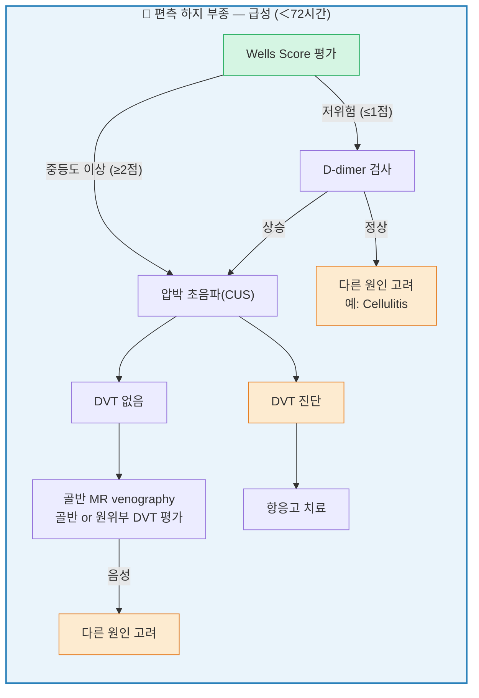
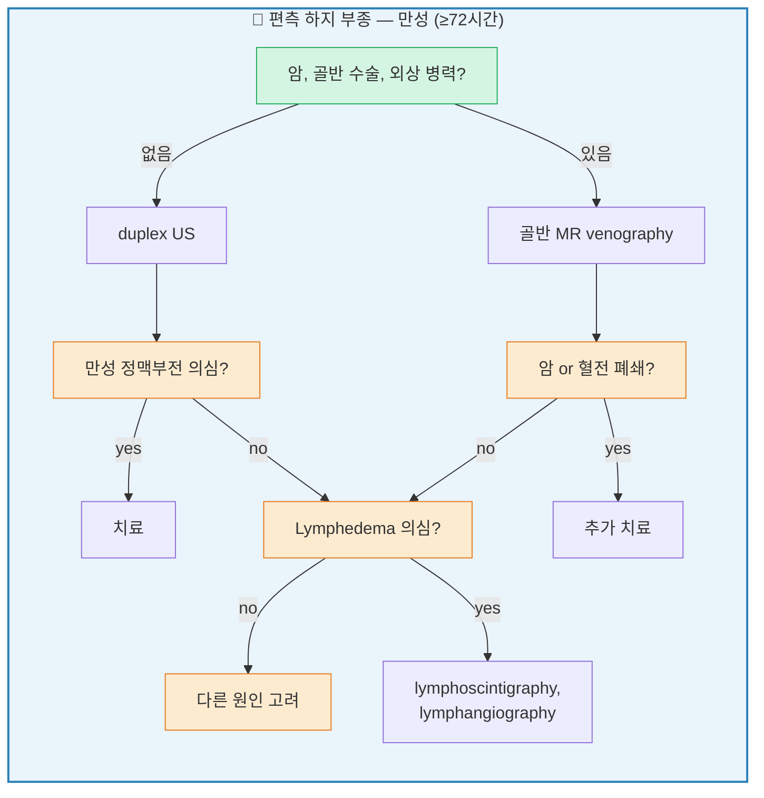
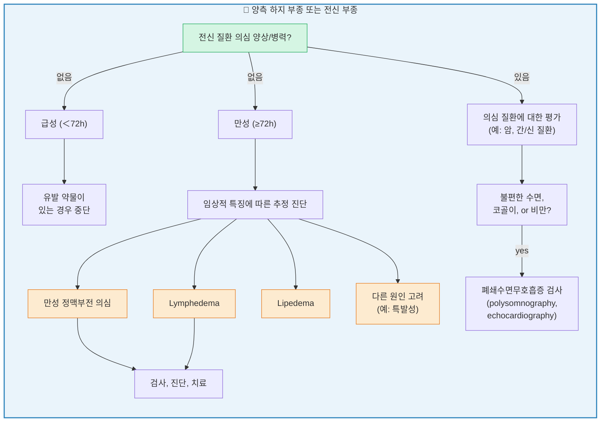
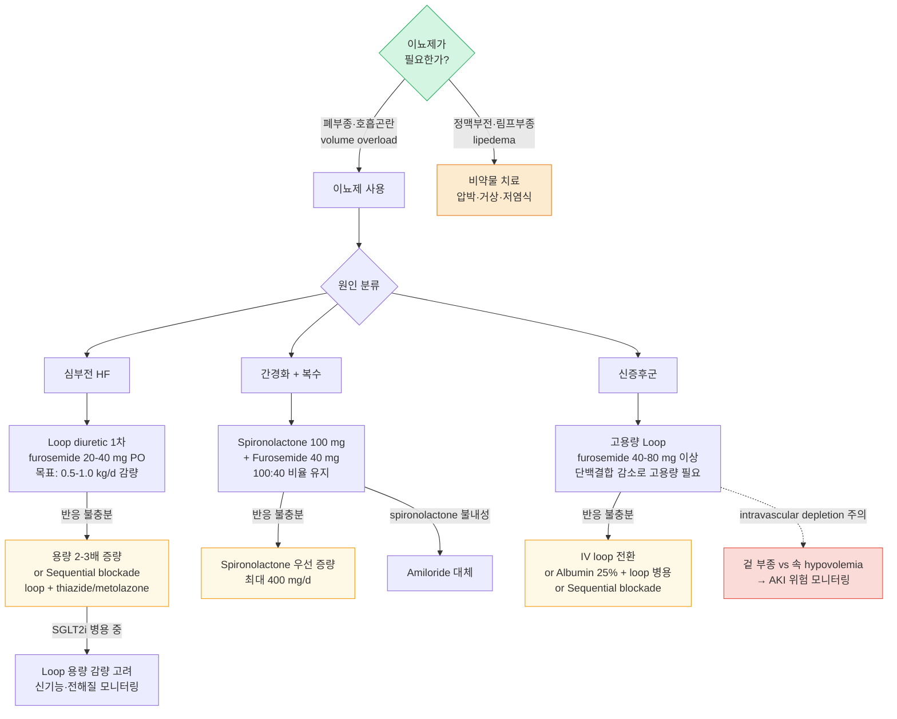

# 부종 Edema

## <mark style="color:green;">일반 사항</mark>

* 부종 : capillary hemodynamics 변화(모세혈관 수압↑, 삼투압↓, 투과성↑) 또는 신장의 Na·수분 정체 증가에 의해 간질(interstitium)에 체액이 과잉 축적된 상태
* 전신 부종은 **심장**(venous congestion)·**간**(oncotic 저하)·**신장**(Na 정체)·**저알부민 상태**의 4가지 축을 먼저 감별하고, 국소 부종은 DVT·정맥 부전·림프부종·봉와직염 등을 우선 고려
* 부종의 발생 부위, 좌우 대칭 여부, 발생 속도, pitting 여부, 동반 증상(호흡 곤란, 복수, 황달 등)이 원인 감별의 핵심
* 편측 하지 부종에서는 DVT를 항상 배제해야 하며, Wells score에 따라 D-Dimer 검사 및 압박 초음파 시행 여부를 결정; **급성 편측 부종 + 통증 + 열감 = DVT until proven otherwise**
  * 활성 암 환자에서는 Wells score 신뢰도가 감소하므로 저위험군이라도 영상 검사 우선 고려
* 이뇨제는 폐부종 외에는 서둘러 투여할 필요가 없으며, 만성 정맥 부전 등 volume overload가 없는 경우에는 권장되지 않음

### <mark style="color:$danger;">🚩 Red Flags!</mark>

<mark style="color:$danger;">**즉각 응급 조치 및 이송**</mark>

* 갑자기 발생한 호흡 곤란
* 객혈, 흉통, 저혈압, 또는 빈맥 동반

<mark style="color:$warning;">**수 시간 내 긴급 평가 (급성 혈관 및 간 기능 부전; 응급실 방문)**</mark>

* 압통이 있는 편측 하지 부종 (DVT 의심)
* 황달, 복수, 토혈 동반 (간부전 의심)
* 심장 질환 병력 + 급격히 악화되는 부종

<mark style="color:$info;">**당일 \~ 수일 내 조기 평가 (외래 진료)**</mark>

* 심장 이상 소견(심잡음, 부정맥 등)
* 유의미한 통증 동반 부종
* 일상생활이 어려운 수준의 부종
* 신기능 이상 의심(소변량 감소, 거품뇨)

## <mark style="color:green;">원인</mark>

### <mark style="color:orange;">전신 부종</mark>

#### <mark style="color:$primary;">Cardiac (심부전)</mark>

* 동반 소견 : 운동 유발 호흡 곤란(종종 orthopnea), 돌발성 야간 호흡 곤란, 말초 청색증, 사지 냉증
* uric acid↑, Na↓, 간 효소↑

#### <mark style="color:$primary;">Hepatic (간경화)</mark>

* 흔히 음주와 관련
* 동반 소견 : 간질환 소견(예: 복수, 황달, 손바닥 홍반, Dupuytren's contracture, spider angioma, 여성형유방증), 혈압↓
* 복수가 발생한 경우 이외에는 호흡 곤란은 드묾
* hepatic proteins(transferrin, fibrinogen, albumin)↓, 간 효소↑, cholesterol↓, K↓, 호흡성 알칼리증, macrocytosis(엽산 결핍 관련)

#### <mark style="color:$primary;">Renal — CKD / AKI</mark>

* 동반 소견 : 식욕 저하, 미각 변화(예: 쇠맛, 비릿함), 수면 변화, 집중력 장애, 하지불안증, myoclonus, 호흡 곤란(심부전보다 경미), 혈압↑, 고혈압성 망막증, 질소성 악취
* 기전 : Na/H₂O retention + volume overload (uremia)
* Cr↑, BUN↑, K↑, P↑, Ca↓, 대상성 산증, 빈혈(normocytic)

#### <mark style="color:$primary;">Renal — 신증후군 (Nephrotic syndrome)</mark>

* 기전 : 저알부민혈증에 의한 oncotic pressure 저하 → 안면(periorbital) 및 전신 부종
* 동반 소견 : 거품뇨, 아침 안면 부종, 고콜레스테롤혈증, 현미경혈뇨
* 단백뇨 ＞3.5 g/d, s-Alb↓↓, u-Alb↑

#### <mark style="color:$primary;">기타</mark>

* 알레르기, 두드러기, 혈관부종 : 모세혈관 투과성 증가
* 폐쇄수면무호흡증 : pulmonary hypertension
* protein-losing enteropathy, 심한 영양실조 : 단백질 저하/합성↓
* 임신, 월경 전 : 체액 증가
* 갑상선저하증 : generalized myxedema

### <mark style="color:orange;">국소 부종</mark>

* 원인 : 봉와직염, 정맥 부전, trauma, DVT, iliac vein obstruction, lipedema, lymphedema
* 만성 하지 부종(편측 or 양측)은 종종 정맥 부전과 관련
* 정맥/림프관 부전은 흔히 DVT의 합병증으로 발생
* DVT 관련 인자 : 활동성 암(치료 중이거나 6개월 내 치료를 받은 경우), 움직이지 않음, 1개월 내 주요 수술로 3일 이상 bed rest, 정맥류

### <mark style="color:orange;">만성 하지 부종의 감별</mark>

<table><thead><tr><th width="120.57894897460938"></th><th>Cardiac / Orthostatic</th><th>Venous</th><th>Lymphatic</th><th>Lipedema</th></tr></thead><tbody><tr><td><strong>부종 양상</strong></td><td>Pitting</td><td>Brawny*</td><td>Spongy</td><td>Non-pitting</td></tr><tr><td><strong>하지 거상으로 호전</strong></td><td>완전</td><td>완전</td><td>경미</td><td>최소</td></tr><tr><td><strong>부종 분포</strong></td><td>광범위, 원위부가 보다 심함</td><td>하지, 발목 (발은 무증상)</td><td>광범위, 원위부가 보다 심함 (<strong>발등 포함</strong>; Stemmer sign 양성)</td><td>하지, 발목 (<strong>발 제외: cuff sign</strong>); 양측 대칭</td></tr><tr><td><strong>피부 변화</strong></td><td>빛남, 경미한 착색</td><td>위축, 착색, 피하 섬유화</td><td>비후, 태선화</td><td>없음</td></tr><tr><td><strong>통증</strong></td><td>경미</td><td>심함: 통증, 조임, 파열</td><td>없거나 심한 통증</td><td>둔한 통증, 피부 과민, <strong>압통 + 멍 잘 듦</strong></td></tr><tr><td><strong>양측</strong></td><td>항상</td><td>때때로: 보통 비대칭</td><td>때때로: 보통 비대칭</td><td>항상</td></tr></tbody></table>

_<mark style="color:$info;">\* Brawny edema: 초기 venous edema는 pitting이나, 만성화되면 hemosiderin 침착·피하 섬유화로 인해 non-pitting의 brawny 양상으로 이행될 수 있음.</mark>_

_<mark style="color:$info;">Ref. Rakel Family medicine 9th ed. 2016. Table 27-23</mark>_

### <mark style="color:orange;">특발성 부종증후군 (Idiopathic edema syndrome)</mark>

* 기전 : capillary leak, re-feeding(급속한 다이어트 후 식사 증량), 이뇨제 유발 부종
* 얼굴, 손, 사지 부종; 활동 후 저녁에 악화되고 와위 후 아침에 호전되는 것이 전형적 (아침 안면 부종이 심한 경우는 신성 부종을 먼저 감별)
* 주로 20\~40대 여성에서 발생; 월경 전에 악화될 수 있으나 월경 주기와 무관하게 지속되는 것이 특징
* 심장, 간, 신장 질환 없음
* 관련 인자 : 당뇨병, 비만, 우울 등 정서적 문제
* 진단 : 다른 원인 배제

## <mark style="color:green;">진단</mark>


**빠른 감별 진단 프레임워크**

① 급성 + 편측 → DVT 먼저 배제\
② 호흡 곤란 동반 → 심부전 / 폐부종\
③ 아침 안면 부종 → 신증후군\
④ 복수 + 하지 부종 → 간경화\
⑤ 만성 + 피부 변화 → 정맥/림프 부전\
⑥ 약물 시작 후 → 약물 유발 부종


### <mark style="color:orange;">감별</mark>

#### <mark style="color:$primary;">발생 부위</mark>

* 말초 부종만 존재 → 국소 정맥/림프 질환
* 전신성(특히 눈꺼풀, 안면), 자고 일어난 아침에 심함 → 저단백(알부민＜3.0 g/㎗ 이하)
* dependent position, 오래 서 있은 후(저녁) 하지 부종 → 심부전

**Unilateral predominance**

* 원인 : 정맥 부전, DVT, lymphedema, 종양, complex regional pain syndrome

**Bilateral predominance**

* 원인 : 전신 질환(심장/간/신장 부전, 영양실조), lipedema, medication-induced edema, 폐쇄수면무호흡증, 고령(피부 탄력/근력 약화), Graves Dz(pretibial myxedema)
* 약물 : CCB(특히 dihydropyridine계; pre-capillary dilation에 의한 ankle edema), pregabalin/gabapentin, NSAID(Na 재흡수 증가), 호르몬제(예: steroid, estrogen, progesterone, testosterone), thiazolidinedione(Na 재흡수 증가), α-차단제, 항암제, minoxidil(혈관 확장), 인슐린(초기 투여 시 Na 정체 유발), **ACEi/ARB**(bradykinin 매개 angioedema; 일반적 peripheral edema와 구별 — ☞ 혈관부종 챕터 참조)

#### <mark style="color:$primary;">원인별 부종의 특징 비교</mark>

<table><thead><tr><th width="94.31576538085938">구분</th><th width="143.5789794921875">심부전</th><th width="137.368408203125">신증후군</th><th width="103.78948974609375">간경화</th><th>특발성 부종</th></tr></thead><tbody><tr><td>주요 부위</td><td>하지(심장보다 낮은 위치); ascending edema</td><td>안면(눈가) 및 전신; periorbital edema</td><td>복수 + 하지</td><td>안면, 손, 하지</td></tr><tr><td>심화 시간</td><td>저녁(활동 후)</td><td>아침(기상 직후)</td><td>비교적 일정</td><td>저녁(체중 일중 변동 심함)</td></tr><tr><td>동반 증상</td><td>호흡 곤란, 경정맥 확장, orthopnea</td><td>거품뇨, 단백뇨, 저알부민혈증</td><td>황달, 복수, 여성형 유방</td><td>정서적 스트레스, 월경 전 악화</td></tr></tbody></table>

#### <mark style="color:$primary;">국소 상태</mark>

* 압통 → DVT; 림프부종에서는 보통 압통이 없음 (때로 심한 통증)
* pitting edema : pretibial area(정강이뼈 앞), 발등, medial malleolus(안쪽 복사뼈) 부위를 엄지손가락으로 5초 이상 압박 후 함몰 여부 확인; DVT, 정맥 부전, 림프부종 초기에서 양성

<table><thead><tr><th width="100.3157958984375">등급</th><th width="137.26312255859375">함몰 깊이</th><th width="127.89471435546875">회복 시간</th><th>임상 소견</th></tr></thead><tbody><tr><td>1+</td><td>2 ㎜ 이하</td><td>즉시</td><td>경미한 부종</td></tr><tr><td>2+</td><td>2~4 ㎜</td><td>15초 이내</td><td>중등도; 하지 윤곽 유지</td></tr><tr><td>3+</td><td>4~6 ㎜</td><td>1분 이내</td><td>심한 부종; 하지 윤곽 변형</td></tr><tr><td>4+</td><td>6~8 ㎜ 이상</td><td>2분 이상</td><td>매우 심한 부종; 현저한 하지 변형</td></tr></tbody></table>

* non-pitting edema : 림프부종 후기(약한 pitting은 발생 가능), pretibial myxedema(갑상선 질환)
* Stemmer sign : lymphedema에 특이적인 징후로 2nd toe(또는 2nd finger) 근위부 등쪽 피부를 엄지·검지로 집어 올려집히지 않으면 양성; 음성이라도 배제 불가
* medial malleolus 부위의 크고 얕고 중등도 이하의 통증성 궤양 → 만성 정맥 부전
* 작고 깊고 심한 통증성 궤양 → 동맥 부전, 혈관염, 감염
* 통증이 없는 궤양 → diabetic vascular ulcer
* 다른 쪽보다 종아리가 ≥3 ㎝ 굵음 → 심부 정맥 폐쇄 의심
  * tibial tuberosity의 10 ㎝ 하방에서 측정; 일반적으로 왼쪽 종아리가 약간 더 굵음
* 피부 과각화(hyperkeratosis), 경결(dermal fibrosis) → 만성 림프 부종
* 갈색 피부, hemosiderin 침착 → 정맥 부전

#### <mark style="color:$primary;">동반 증상</mark>

* 호흡 곤란 → 좌심부전, 폐부종
* 복수 → 간경화

### <mark style="color:orange;">검사</mark>

* 초음파, D-Dimer : 명백한 원인이 없는 급성 하지 부종에 대하여 DVT 감별을 위하여 고려
  * D-Dimer는 [Wells score](https://www.mdcalc.com/calc/362/wells-criteria-dvt) 저위험군(≤1점)에서만 음성 예측도가 높음; 중등도 이상 위험군(≥2점)에서는 D-Dimer 음성이라도 압박 초음파(CUS)를 반드시 시행
* Ankle-brachial pressure index : 만성 정맥 부전과 동맥 질환 감별; 고령 및 당뇨병 환자에서는 동맥의 compressibility가 감소되어 있으므로 해석에 주의를 요함; 혈관 석회화로 ABI가 위양성으로 높게 측정될 수 있어 이 경우 toe-brachial index(TBI ＜0.7 시 이상) 또는 발등동맥·후경골동맥 맥박 촉진으로 보완
* s-Cr, 소변 시험지봉 검사 : 신질환(특히 신증후군) 감별을 위하여 고려


**Wells DVT Score** — ≤1점: 저위험 → D-dimer 먼저 / ≥2점: 중등도 이상 → 압박 초음파(CUS) 바로 시행

각 **+1점**: 활성 암 · 하지 마비/최근 석고 고정 · 최근 3일↑ 침상 안정 또는 12주 내 전신마취 수술 · 심부정맥 경로 국소 압통 · 증상측 하지 전체 부종 · 종아리 둘레 반대측보다 ≥3 ㎝ · 증상측에만 함요부종 · 표재정맥 측부순환 · 이전 DVT 과거력 / DVT만큼 가능성 있는 다른 진단 **−2점**


***







<p align="center"><strong>편측 또는 양측 하지, 전신 부종의 진단 알고리듬</strong>
<br><em><mark style="color:$info;">US=ultrasonography, DVT=deep venous thrombosis</mark></em>
<br><em><mark style="color:$info;">Ref. Edema: Diagnosis and Management. AFP 2013:88(2). Fig 1 & 2.</mark></em></p>

***

## <mark style="background-color:$warning;">Management</mark>


**⚠️ 절대 놓치지 말아야 할 부종 원인 Top 5**

① **DVT** — 압통성 급성 편측 부종 → 즉시 영상 검사\
② **급성 심부전** — 호흡 곤란 동반 부종\
③ **신증후군** — 아침 안면 부종 + 거품뇨 + 저알부민\
④ **간경화 + 복수** — 복부 팽만 + 황달\
⑤ **약물 유발 부종** — 최근 시작된 CCB·NSAID·TZD·gabapentin 등


### <mark style="color:orange;">치료 방침</mark>

* 원인 질환 치료; DVT에 대하여 항응고제, 필요시 이뇨제 투여
* 피부 관리 주의 (피부 손상 및 venous ulcer 예방)

#### <mark style="color:$primary;">이뇨제 투여 지침</mark>

* 서둘러 투여할 필요는 없음; 폐부종 외에는 일반적으로 응급을 요하지 않음
  * 예외 : 긴장성 복수(tense ascites with abdominal distension), cardiorenal syndrome 진행 시에는 신속한 대응이 필요하며 입원 또는 전문의 의뢰를 고려
* 주의 : 복수 환자 또는 정맥/림프관 폐쇄 환자에서는 체액 고갈을 유발할 수 있음
  * 만성 정맥 부전에서도 volume overload 상태가 아니면 이뇨제 사용을 권하지 않음
* 1차 선택 : loop diuretics(예: furosemide, bumetanide, torsemide)
* cirrhosis 시 spironolactone + loop diuretics
* furosemide : 야간 투여 시 수면 장애 초래 가능; PO 20\~40 ㎎, IV 10\~40 ㎎ <mark style="color:blue;">\[라식스]</mark>
  * 반응 불충분 시 24\~48시간 간격으로 용량 증량 가능 (최대 PO 600 ㎎/d, IV 200 ㎎/dose)
    * **1차 진료 기준** : 80\~160 ㎎/d 초과 사용 시 전문의 의뢰 고려; 외래에서 고용량 단독 투여는 전해질 이상·AKI 위험이 높음
  * 신부전 또는 신증후군 시 고용량 필요
  * 심부전 시 hypo-perfusion 증상을 모니터링하면서 사용

※ **이뇨제 저항성** 시 Sequential Nephron Blockade 전략 : 심한 부종 또는 신기능 저하로 loop 이뇨제 단독으로 반응이 불충분한 경우, metolazone(메토라존) 또는 hydrochlorothiazide를 loop 이뇨제 투여 30분\~1시간 전에 선행 투여하여 원위 세뇨관과 헨레고리를 동시에 차단하는 sequential nephron blockade를 고려한다. 단, 전해질(K, Mg) 불균형 및 과도한 이뇨에 의한 저혈압·신기능 악화에 주의하며 면밀히 모니터링한다.

※ **저알부민 상태에서의 이뇨제 저항성** (신증후군·간경화) : albumin 결합 감소로 loop 이뇨제의 세뇨관 내 약효가 저하된다. 입원 환경에서 albumin 25% 정주 후 loop 이뇨제를 투여하면 intravascular volume 보충으로 이뇨 반응이 개선될 수 있다 (1차 진료보다는 입원·전문의 환경에서 시행).

***



<p align="center"><strong>이뇨제 선택 및 저항성 대응 알고리듬</strong></p>

***


### <mark style="color:orange;">심부전에 의한 부종</mark>

* 부종 자체(이뇨제)보다 심부전의 신경호르몬 억제 치료가 장기 예후를 결정함 (ESC HF Guideline 2021)
* HFrEF (LVEF ＜40%) 에서 아래 4대 약제를 가능하면 조기에 병용 시작하고 최대 내약 용량을 유지함 (ESC 2021, ACC/AHA 2022)
  * ACE 억제제(또는 ARB, ARNI), 베타차단제, MRA(spironolactone/eplerenone), SGLT2 억제제(dapagliflozin, empagliflozin) (Class I, LOE A)
  * SGLT2 억제제 : 이뇨 효과 및 심혈관 사망·심부전 입원 감소; 당뇨 유무와 무관하게 권고
    * SGLT2 억제제의 삼투성 이뇨 효과로 인해 기존 loop 이뇨제와 병용 시 과도한 용적 감소·저혈압·전해질 이상이 발생할 수 있으므로 병용 시 loop 이뇨제 용량 감량을 고려하고 신기능 및 전해질을 모니터링
* HFpEF (LVEF ≥50%) : 증상 조절(이뇨제), 동반 질환(고혈압, AF, 관상동맥 질환) 치료가 중심; SGLT2 억제제 **권고됨 (Class IIa; 실질적 standard therapy)**; ACC/AHA 2023, ESC 2023 focused update
* 1차 진료에서 심부전 확인 시 심장내과 협진 또는 의뢰 권고 (약물 선택 및 용량 조절)

### <mark style="color:orange;">특발성 부종증후군, 하지 부종</mark>

* 이미 이뇨제를 사용하고 있는 경우에는 이뇨제 중단(diuretic withdrawal)을 먼저 시행한 후 약물 치료를 고려함; 2\~4주 동안 복용 중단 및 저염식 병행
  * **이뇨제 유발 부종 악순환** : 만성 이뇨제 사용 → RAAS 활성화 → aldosterone↑ → Na 정체 → 이뇨제 중단 시 반동 부종(rebound edema). 중단 후 일시적 체중 증가가 수주 내 자연 호전됨을 미리 설명하여 조기 재복용을 방지

#### <mark style="color:$primary;">이뇨제</mark>

* 이뇨제가 필요한 경우 최소 유효 용량으로, 단기 사용을 원칙으로 투여 (☞ p.485)
* 체액 저류가 저녁에 심해지므로 이른 저녁에 투여
*   spironolactone 50\~100 ㎎/d, 최대 100 ㎎ qid <mark style="color:blue;">\[알닥톤]</mark>

    ± hydrochlorothiazide 25 ㎎/d <mark style="color:blue;">\[다이크로짇]</mark>

#### <mark style="color:$primary;">기타</mark>

* 누워서 쉼 (단, 심부전에 의한 부종 환자는 누운 자세로 인한 정맥 환류량 증가가 호흡 곤란을 악화시킬 수 있으므로 주의)
* 더운 환경을 피함
* leg elevation : 하지 부종에 대하여 심장 높이 이상으로 30분씩 하루 3\~4회
* 하지 압박: 깨어 있을 때 압박 스타킹 착용; 취침 시에는 착용하지 않음
  * 1차 선택 : 일반적으로 AD type 스타킹(발목\~무릎 아래)
    * AG type(발목\~허벅지) : 병변이 허벅지 이상으로 명확히 존재하는 경우에 한해 선택적 적용; 순응도가 낮고, 무릎 뒤에서 접힐 경우 지혈대 효과(Tourniquet effect) 위험
  * 금기 : ABI ＜0.5 (중증 동맥 부전); 울혈성 심부전 NYHA Class III/IV (정맥 환류 급증으로 심장 부하 증가 위험); 취침 시 착용 금지; ABI 0.5\~0.8에서는 저압력(20 ㎜Hg 이하) 적용 시 주의 하에 사용 가능
  * ABI ＞1.3 : 혈관 석회화(calcification)로 위양성 가능 → 압박 적용 전 toe-brachial index(TBI) 또는 혈관외과 평가 필요
  * 주의 : 중증 말초신경병증(peripheral neuropathy) 환자는 압박에 의한 피부 손상을 감지하지 못할 수 있으므로 신중히 적용하고 정기적으로 피부 상태를 확인
* 단순 부종 조절 목적 시 20\~30 ㎜Hg, 궤양 등 중증 시 30\~40 ㎜Hg의 압력 적용
  * 저위험군의 장시간 비행기 여행 시 부종 및 무증상 혈전증 예방을 위하여 12\~18 ㎜Hg의 발목 압박 양말 적용
  * 림프 부종에 대하여 초기 집중 치료기(Reductive phase)에는 주 2회 이상의 다층압박붕대(Multi-layer bandaging) 적용, 이후 유지기(Maintenance phase)에는 압박 스타킹으로 전환
  * 활동 감소 상태의 환자에 대하여 간헐적 pneumatic compression 고려
  * 개선 후 유지를 위하여 inelastic grosgrain 스타킹 사용 고려
* 저염식, 과도한 수분 섭취를 피함
* 이뇨제에 반응하지 않는 경우 탄수화물 섭취 제한 (90 g/d)
* 적정 체중 유지, 섭식 장애 교정
* 우울 등 정서적 문제 교정
* 걷기 : 종아리 근육이 수축되며 정맥 회귀가 증가됨
* vitis vinifera leaf dry extract(포도엽 건조엑스) : 360 ㎎(2캡슐) 아침 식전 <mark style="color:blue;">\[안탁스]</mark>

### <mark style="color:orange;">부종 관련 건강보조제 및 정맥순환개선제</mark>

* 아래 성분들은 정맥 기능 부전(CVI)에 의한 경한 부종에 제한된 근거이며, 심부전·신부전·간경화·저알부민혈증에 의한 부종에는 효과 없음
* 부종의 원인 감별 없이 건강보조제를 복용하면 근본 치료가 지연될 수 있음

<table><thead><tr><th width="170">성분</th><th width="130">적용 부종 유형</th><th width="115">근거 수준</th><th>국내 시판 현황 및 주요 주의사항</th></tr></thead><tbody><tr><td>MPFF (미세정제플라보노이드 분획물; diosmin/hesperidin 등 5종 혼합)</td><td>정맥성</td><td>높음 (가이드라인 Class I, LOE B)</td><td>국내 일반의약품: 치퀵정(종근당), 베니톨정(광동제약) 등; 단순 diosmin보다 근거 높음</td></tr><tr><td>Diosmin 단일성분</td><td>정맥성</td><td>중등도 (가이드라인 2C)</td><td>국내 일반의약품: 치센캡슐·디오라인정(동아제약), 팜젠디오스민정 등 다수; MPFF보다 근거 낮음</td></tr><tr><td>HCSE (aescin; 마로니에 종자 추출물)</td><td>정맥성</td><td>낮음~중등도</td><td>국내 허가 의약품 없음 (해외직구 보조제); 표준화 추출물 사용; 장기 데이터 부족</td></tr><tr><td>포도씨 OPC (proanthocyanidin)</td><td>좌위 관련 부종</td><td>낮음</td><td>국내 건강기능식품으로 유통(식약처 고시형 미등재); 항응고제 상호작용 가능</td></tr><tr><td>민들레</td><td>수분 저류성(이론적)</td><td>매우 낮음</td><td>이뇨제·담낭질환·항생제 상호작용; 부종 목적 허가 제품 없음</td></tr></tbody></table>

***

### <mark style="color:red;">질병코드</mark>

R60.0 국소부종

R60.1 전신부종

R60.9 상세불명의 부종

E87.7 체액과부하

I89.0 림프 부종

***

## <mark style="color:purple;">처방례</mark>

> **처방례 1. 상세불명의 하지 부종**
>
> ```
> 라식스 40 ㎎/T 0.5 T qd 아침 (단기 사용)
> ```
>
> **처방례 2. 특발성 부종증후군**
>
> ```
> 알닥톤 필름코팅정 25 ㎎/T 2T #2 아침·점심
> 다이크로짇 25 ㎎/T 1T #2 아침·점심
> ```
>
> **처방례 3. 만성 정맥부전**
>
> ```
> 안탁스캡슐 180 ㎎/C 2C qd 아침 식전
> ※ 급여 적용: 만성정맥부전(I83·I87 등) 상병 필수; 단순 하지부종(R60) 단독 코드로는 삭감 위험
> ```

***

### <mark style="color:$success;">핵심 복약 지도</mark>

> **이뇨제 공통** (라식스, 알닥톤, 다이크로짇)
>
> * 투약 시간 : 의사 지시에 따라 복용하십시오 (야간뇨로 인한 수면 방해를 막기 위해 일반적으로 저녁 이전에 복용).
> * 기립성 저혈압 주의 : 복용 중 갑자기 일어나면 어지러울 수 있으니 천천히 움직이십시오.
> * 체중 측정 : 매일 아침 식전·소변 후 같은 조건에서 체중을 측정하여 부종 개선 정도를 확인하십시오.

> **특발성 부종증후군**
>
> * 이뇨제 반동 현상 : 이뇨제를 끊으면 일시적으로 체중이 더 늘 수 있습니다. 이는 몸이 적응하는 과정이므로 2\~4주간 저염식을 유지하며 경과를 지켜보는 것이 중요합니다.
> * 식단 관리 : 저녁 늦은 시간의 과도한 탄수화물 섭취나 짠 음식은 부종을 악화시킬 수 있습니다.

> **만성 정맥부전 및 압박 스타킹**
>
> * 착용 시간 : 부기가 가장 적은 아침에 일어나자마자 착용하고, 취침 전에는 반드시 벗으십시오.
> * 걷기 운동 : 가만히 서 있거나 앉아 있는 것보다 걷기가 종아리 근육을 수축시켜 부기 완화에 효과적입니다.
> * 안탁스 : 효과를 높이기 위해 아침 식사 전에 복용하십시오.

***

### <mark style="color:blue;">환자 안내서</mark>


**부종은 원인이 다양합니다 — 몸의 신호를 무시하지 마세요**

발이나 다리가 붓는 것은 심장·신장·간 질환의 초기 신호일 수 있습니다.


#### <mark style="color:$primary;">부종이란 무엇인가요?</mark>

* 체내 수분이 혈관 밖 조직에 고여 피부가 부어오르는 상태입니다
* 원인은 심부전, 신장 질환, 간 질환, 정맥 기능 부전, 약물 부작용, 영양 부족 등 다양합니다
* 오랫동안 앉아 있거나 서 있을 때 생기는 가벼운 발목 부종은 대부분 양성이지만, 급격히 악화되거나 호흡 곤란이 동반되면 즉시 평가가 필요합니다

#### <mark style="color:$primary;">부종 관리 시 이렇게 하세요</mark>

* **염분 제한** : 하루 소금 섭취를 5 g(나트륨 2,000 mg) 이하로 줄이십시오. 국물, 가공식품, 외식은 염분이 높습니다
* **수분 섭취** : 의사의 지시에 따르십시오. 심장·신장 질환이 있는 경우 과도한 수분 섭취가 오히려 부종을 악화시킬 수 있습니다
* **다리 올리기** : 쉬거나 누울 때 다리를 심장보다 높게 올리면 부종 완화에 도움이 됩니다
* **압박 스타킹** : 의사 처방에 따라 착용하고, 아침 일어나자마자 신고 취침 전에 벗으십시오
* **매일 체중 측정** : 아침 식전·소변 후 같은 조건에서 측정하여 부종 변화를 확인하십시오. 하루 1 kg 이상 증가하면 병원에 연락하십시오

#### <mark style="color:$primary;">이럴 때는 즉시 병원을 방문하세요</mark>

* 부종이 갑자기 심해지거나 얼굴·복부까지 퍼지는 경우
* 호흡 곤란, 누우면 숨이 차는 증상이 동반되는 경우
* 한쪽 다리만 붓고 통증·열감이 있는 경우 (심부정맥 혈전증 의심)
* 이뇨제 복용에도 부종이 줄지 않거나 오히려 악화되는 경우
