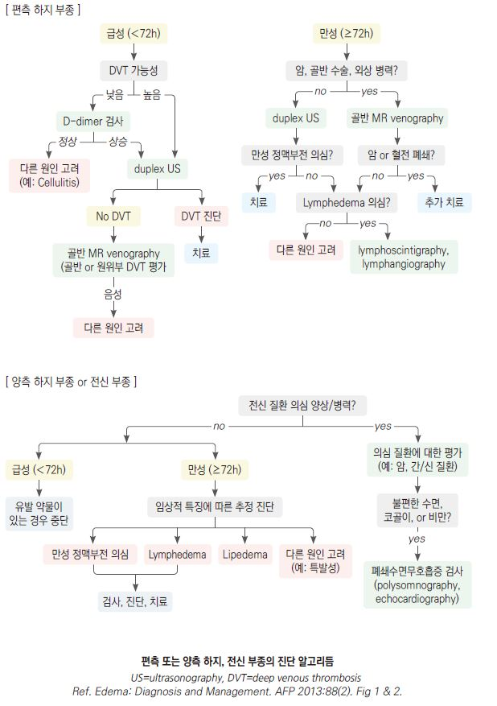

# 부종 Edema

## <mark style="color:green;">일반 사항</mark>

* 부종은 모세혈관 수압 상승, 혈장 삼투압 저하(저알부민혈증), 모세혈관 투과성 증가, 또는 신장의 Na·수분 정체에 의해 간질(interstitium)에 체액이 과잉 축적된 상태
* 전신 부종은 심부전·간경화·신부전·신증후군의 3대 원인을 먼저 감별하고, 국소 부종은 DVT·정맥 부전·림프부종·봉와직염 등을 우선 고려
* 부종의 발생 부위, 좌우 대칭 여부, 발생 속도, pitting 여부, 동반 증상(호흡 곤란, 복수, 황달 등)이 원인 감별의 핵심
* 편측 하지 부종에서는 DVT를 항상 배제해야 하며, Wells score에 따라 D-Dimer 검사 및 압박 초음파 시행 여부를 결정
* 이뇨제는 폐부종 외에는 서둘러 투여할 필요가 없으며, 만성 정맥 부전 등 volume overload가 없는 경우에는 권장되지 않음

#### 기전

* capillary hemodynamics의 변화에 의한 혈관으로부터 interstitium으로의 체액 이동
  * 모세 혈관의 수압↑, 삼투압↓(예: 저알부민혈증), 투과성↑
* 신장에 의한 Na 및 수분 정체 증가 (신부전)

### <mark style="color:$danger;">🚩 Red Flags!</mark>

<mark style="color:$danger;">**즉각 응급 조치 필요 (심폐 응급; 필요시 119 호출)**</mark>

* 갑자기 발생한 호흡 곤란
* 객혈, 흉통, 저혈압, 또는  빈맥 동반

<mark style="color:$warning;">**수 시간 내 긴급 평가 필요 (급성 혈관 및 간 기능 부전; 응급실 방문)**</mark>

* 압통이 있는 편측 하지 부종 (DVT 의심)
* 황달, 복수, 토혈 동반 (간부전 의심)
* 심장 질환 병력 + 급격히 악화되는 부종

<mark style="color:$info;">**당일 \~ 수일 내 조기 평가 필요 (외래 진료)**</mark>

* 심장 이상 소견(심잡음, 부정맥 등)
* 유의미한 통증 동반 부종
* 일상생활이 어려운 수준의 부종
* 신기능 이상 의심(소변량 감소, 거품뇨)

## <mark style="color:green;">전신 부종</mark>

#### Cardiac (심부전)

* 동반 소견 : 운동 유발 호흡 곤란(종종 orthopnea), 돌발성 야간 호흡 곤란, 말초 청색증, 사지 냉증
* uric acid↑, Na↓, 간 효소↑

#### Hepatic (간경화)

* 흔히 음주와 관련
* 동반 소견 : 간질환 소견(예: 복수, 황달, 손바닥 홍반, Dupuytren's contracture, spider angiomata, 여성형유방증), 혈압↓
* 복수가 발생한 경우 이외에는 호흡 곤란은 드묾
* hepatic proteins(transferrin, fibrinogen, albumin)↓, 간 효소↑, cholesterol↓, K↓, 호흡성 알칼리증, macrocytosis(엽산 결핍 관련)

#### Renal (신부전, 신증후군)

* 동반 소견 : 식욕 저하, 미각 변화(예: 쇠맛, 비릿함), 수면 변화, 집중력 장애, 하지불안증, myoclonus, 호흡 곤란(심부전 경우보다 덜함), 혈압↑, 고혈압성 망막증, 질소성 악취
* Cr↑, BUN↑, u-Alb↑/s-Alb↓, K↑, P↑, Ca↓, 대상성 산증, 빈혈(보통 normocytic)
* 신증후군 : 단백뇨(＞3.5 g/d), s-Alb↓, 고콜레스테롤혈증, 현미경혈뇨

#### 기타

* 알레르기, 두드러기, 혈관부종 : 모세혈관 투과성 증가
* 폐쇄수면무호흡증 : pulmonary hypertension
* protein-losing enteropathy, 심한 영양실조 : 단백질 저하/합성↓
* 임신, 월경 전 : 체액 증가
* 갑상선저하증 : generalized myxedema

## <mark style="color:green;">국소 부종</mark>

* 원인 : 봉와직염, 정맥 부전, trauma, DVT, iliac vein obstruction, lipedema, lymphedema
* 만성 하지 부종(편측 or 양측)은 종종 정맥 부전과 관련
* 정맥/림프관 부전은 흔히 DVT의 합병증으로 발생
* DVT 관련 인자 : 암 병력, 움직이지 않음, 1개월 내 주요 수술로 3일 이상 bed rest, 정맥류

### <mark style="color:$primary;">Unilateral predominance</mark>

* 원인 : 정맥 부전, DVT, lymphedema, 종양, complex regional pain syndrome

### <mark style="color:$primary;">Bilateral predominance</mark>

* 원인 : 전신 질환(심장/간/신장 부전, 영양실조), lipedema, medication-induced edema, 폐쇄수면무호흡증, 고령(피부 탄력/근력 약화), Graves Dz(pretibial myxedema)
* 약물 : CCB, pregabalin/gabapentin, NSAID, 호르몬제(예: steroid, estrogen, progesterone, testosterone), thiazolidinedione(Na 재흡수 증가), α-차단제, 항암제

### <mark style="color:$primary;">만성 하지 부종의 감별</mark>

<table><thead><tr><th width="120.57894897460938"></th><th>Cardiac / Orthostatic</th><th>Venous</th><th>Lymphatic</th><th>Lipedema</th></tr></thead><tbody><tr><td><strong>부종 양상</strong></td><td>Pitting</td><td>Brawny</td><td>Spongy</td><td>Non-pitting</td></tr><tr><td><strong>하지 거상으로 호전</strong></td><td>완전</td><td>완전</td><td>경미</td><td>최소</td></tr><tr><td><strong>부종 분포</strong></td><td>광범위, 원위부가 보다 심함</td><td>하지, 발목 (발은 무증상)</td><td>광범위, 원위부가 보다 심함</td><td>하지, 발목 (발은 무증상)</td></tr><tr><td><strong>피부 변화</strong></td><td>빛남, 경미한 착색</td><td>위축, 착색, 피하 섬유화</td><td>비후, 태선화</td><td>없음</td></tr><tr><td><strong>통증</strong></td><td>경미</td><td>심함: 통증, 조임, 파열</td><td>없거나 심한 통증</td><td>둔한 통증, 피부 과민</td></tr><tr><td><strong>양측</strong></td><td>항상</td><td>때때로: 보통 비대칭</td><td>때때로: 보통 비대칭</td><td>항상</td></tr></tbody></table>

_<mark style="color:$info;">Ref. Rakel Family medicine 9th ed. 2016. Table 27-23</mark>_

> ✽ **Brawny edema**: 초기 venous edema는 pitting이나, 만성화되면 hemosiderin 침착·피하 섬유화로 인해 non-pitting의 brawny 양상으로 이행될 수 있음.

### <mark style="color:$primary;">특발성 부종증후군 (Idiopathic edema syndrome)</mark>

* 기전 : capillary leak, re-feeding(급속한 다이어트 후 식사 증량), 이뇨제 유발 부종
* 체액 정체에 의한 얼굴, 손, 사지 부종; 아침에 심함
* 주로 20\~40대 여성에서 월경 전 기간에 발생
* 심장, 간, 신장 질환 없음
* 관련 인자 : 당뇨병, 비만, 우울 등 정서적 문제
* 진단 : 다른 원인 배제

## <mark style="color:green;">진단</mark>

### <mark style="color:$primary;">감별</mark>

#### 발생 부위

* 말초 부종만 존재 → 국소 정맥/림프 질환
* 전신성(특히 눈꺼풀, 안면), 자고 일어난 아침에 심함 → 저단백(알부민＜2.5 g/㎗)
* dependent position, 오래 서 있은 후(저녁) 하지 부종 → 심부전

#### 국소 상태

* 압통 → DVT; 림프부종에서는 보통 압통이 없음 (때로 심한 통증)
* pitting edema(＞5초) → DVT, 정맥 부전, 림프부종; fibrotic form에서는 보통 나타나지 않음
* non-pitting edema → lymphedema(약한 pitting은 발생 가능), pretibial myxedema(갑상선 질환)
* Stemmer sign 양성 (2nd toe 근위부 피부가 두꺼워 집히지 않음) → lymphedema에 특이적; 음성이라도 배제 불가
* medial malleolus 부위의 크고 얕고 중등도 이하의 통증성 궤양 → 만성 정맥 부전
* 작고 깊고 심한 통증성 궤양 → 동맥 부전, 혈관염, 감염
* 통증이 없는 궤양 → diabetic vascular ulcer
* 다른 쪽보다 종아리가 ≥3 ㎝ 굵음 → 심부 정맥 폐쇄 의심\
  <mark style="color:$info;">✽tibial tuberosity의 10 ㎝ 하방에서 측정; 일반적으로 왼쪽 종아리가 약간 더 굵음</mark>
* 피부 과각화(hyperkeratosis), 경결(dermal fibrosis) → 만성 림프 부종
* 갈색 피부, hemosiderin 침착 → 정맥 부전

#### 동반 증상

* 호흡 곤란 → 좌심부전, 폐부종
* 복수 → 간경화

### <mark style="color:$primary;">검사</mark>

* 초음파, D-Dimer : 명백한 원인이 없는 급성 하지 부종에 대하여 DVT 감별을 위하여 고려
  * D-Dimer는 [Wells score](https://www.mdcalc.com/calc/362/wells-criteria-dvt) 저위험군(≤1점)에서만 음성 예측도가 높음; 중등도 이상 위험군(≥2점)에서는 D-Dimer 음성이라도 압박 초음파(CUS)를 반드시 시행
* Ankle-brachial pressure index : 만성 정맥 부전 감별; 고령 및 당뇨병 환자에서는 동맥의 compressibility가 감소되어 있으므로 해석에 주의를 요함
* s-Cr, 소변 시험지봉 검사 : 신질환(특히 신증후군) 감별을 위하여 고려

***



***

## <mark style="background-color:$warning;">Management</mark>

### <mark style="color:$primary;">치료 방침</mark>

* 원인 질환 치료; DVT에 대하여 항응고제, 필요시 이뇨제 투여
* 피부 관리 주의 (피부 손상 및 venous ulcer 예방)

#### 이뇨제 투여 지침

* 서둘러 투여할 필요는 없음; 폐부종 외에는 일반적으로 응급을 요하지 않음
* 주의 : 복수 환자 또는 정맥/림프관 폐쇄 환자에서는 체액 고갈을 유발할 수 있음
  * 만성 정맥 부전에서도 volume overload 상태가 아니면 이뇨제 사용을 권하지 않음
* 1차 선택 : loop diuretics(예: furosemide, bumetanide, torsemide)
* cirrhosis 시 spironolactone + loop diuretics
* furosemide : 야간 투여 시 수면 장애 초래 가능; PO 20\~40 ㎎, IV 10\~40 ㎎ \[라식스]
  * 반응 불충분 시 24\~48시간 간격으로 용량 증량 가능 (최대 PO 600 ㎎/d, IV 200 ㎎/dose)
  * 신부전 또는 신증후군 시 고용량 필요
  * 심부전 시 hypo-perfusion 증상을 모니터링하면서 사용

### <mark style="color:$primary;">특발성 부종증후군, 하지 부종</mark>

* 이미 이뇨제를 사용하고 있는 경우에는 이뇨제 중단(diuretic withdrawal)을 먼저 시행한 후 약물 치료를 고려함; 2\~4주 동안 복용 중단 및 저염식 병행
  * 이뇨제 중단 후 일시적으로 체중 증가가 나타날 수 있으나 수주 내 호전됨을 미리 설명

#### 이뇨제

* 이뇨제가 필요한 경우 최소 유효 용량으로, 단기 사용을 원칙으로 투여 (☞ p.485)
* 체액 저류가 저녁에 심해지므로 이른 저녁에 투여
*   spironolactone 50\~100 ㎎/d, 최대 100 ㎎ qid \[알닥톤]

    ± hydrochlorothiazide 25 ㎎/d \[다이크로짇]

#### 기타

* 누워서 쉼 (단, 심부전에 의한 부종 환자는 누운 자세로 인한 정맥 환류량 증가가 호흡 곤란을 악화시킬 수 있으므로 주의)
* 더운 환경을 피함
* leg elevation : 하지 부종에 대하여 심장 높이 이상으로 30분씩 하루 3\~4회
* 하지 압박: 깨어 있을 때 압박 스타킹 착용; 취침 시에는 착용하지 않음
  * 1차 선택: 무릎 아래(Below-knee, AD) 스타킹; 허벅지까지(AG)는 병변이 허벅지 이상으로 명확히 존재하는 경우에 한해 선택적 적용; AG 타입은 순응도가 낮고, 무릎 뒤에서 접힐 경우 지혈대 효과(Tourniquet effect) 위험
  * 금기 : ABI ＜0.5 (중증 동맥 부전); 울혈성 심부전 NYHA Class III/IV (정맥 환류 급증으로 심장 부하 증가 위험); 취침 시 착용 금지; ABI 0.5\~0.8에서는 저압력(20 ㎜Hg 이하) 적용 시 주의 하에 사용 가능
* 단순 부종 조절 목적 시 20\~30 ㎜Hg, 궤양 등 중증 시 30\~40 ㎜Hg의 압력 적용
  * 저위험군의 장시간 비행기 여행 시 부종 및 무증상 혈전증 예방을 위하여 12\~18 ㎜Hg의 발목 압박 양말 적용
  * 림프 부종에 대하여 초기 집중 치료기(Reductive phase)에는 주 2회 이상의 다층압박붕대(Multi-layer bandaging) 적용, 이후 유지기(Maintenance phase)에는 압박 스타킹으로 전환
  * 주 2회 bandaging system 고려
  * 활동 감소 상태의 환자에 대하여 간헐적 pneumatic compression 고려
  * 개선 후 유지를 위하여 inelastic grosgrain 스타킹 사용 고려
* 저염식, 과도한 수분 섭취를 피함
* 이뇨제에 반응하지 않는 경우 탄수화물 섭취 제한 (90 g/d)
* 적정 체중 유지, 섭식 장애 교정
* 우울 등 정서적 문제 교정
* 걷기 : 종아리 근육이 수축되며 정맥 회귀가 증가됨
* vitis vinifera leaf dry extract : 360 ㎎ 아침 식전 \[안탁스]

***

### <mark style="color:purple;">질병코드</mark>

R60.0 국소부종

R60.1 전신부종

R60.9 상세불명의 부종

E87.7 체액과부하

I89.0 림프 부종

***

## <mark style="color:orange;">처방례</mark>

> **처방례 1. 상세불명의 하지 부종**
>
> ```
> 라식스 40 ㎎/T 0.5 T qd 아침 (단기 사용)
> ```
>
> **처방례 2. 특발성 부종증후군**
>
> ```
> 알닥톤 필름코팅정 25 ㎎/T 2T #2 
> 다이크로짇 25 ㎎/T 1T #2
> ```
>
> **처방례 3. 만성 정맥부전**
>
> ```
> 안탁스 160 ㎎/C 2C qd 아침 식전
> ```

***

### <mark style="color:purple;">핵심 복약 지도</mark>

> **이뇨제 공통** (라식스, 알닥톤, 다이크로짇)
>
> * 투약 시간 : 의사 지시에 따라 복용하십시오 (야간뇨로 인한 수면 방해를 막기 위해 일반적으로 저녁 이전에 복용).
> * 기립성 저혈압 주의 : 복용 중 갑자기 일어나면 어지러울 수 있으니 천천히 움직이십시오.
> * 체중 측정 : 매일 아침 식전·소변 후 같은 조건에서 체중을 측정하여 부종 개선 정도를 확인하십시오.

> **특발성 부종증후군**
>
> * 이뇨제 반동 현상 : 이뇨제를 끊으면 일시적으로 체중이 더 늘 수 있습니다. 이는 몸이 적응하는 과정이므로 2\~4주간 저염식을 유지하며 경과를 지켜보는 것이 중요합니다.
> * 식단 관리 : 저녁 늦은 시간의 과도한 탄수화물 섭취나 짠 음식은 부종을 악화시킬 수 있습니다.

> **만성 정맥부전 및 압박 스타킹**
>
> * 착용 시간 : 부기가 가장 적은 아침에 일어나자마자 착용하고, 취침 전에는 반드시 벗으십시오.
> * 걷기 운동 : 가만히 서 있거나 앉아 있는 것보다 걷기가 종아리 근육을 수축시켜 부기 완화에 효과적입니다.
> * 안탁스 : 효과를 높이기 위해 아침 식사 전에 복용하십시오.
