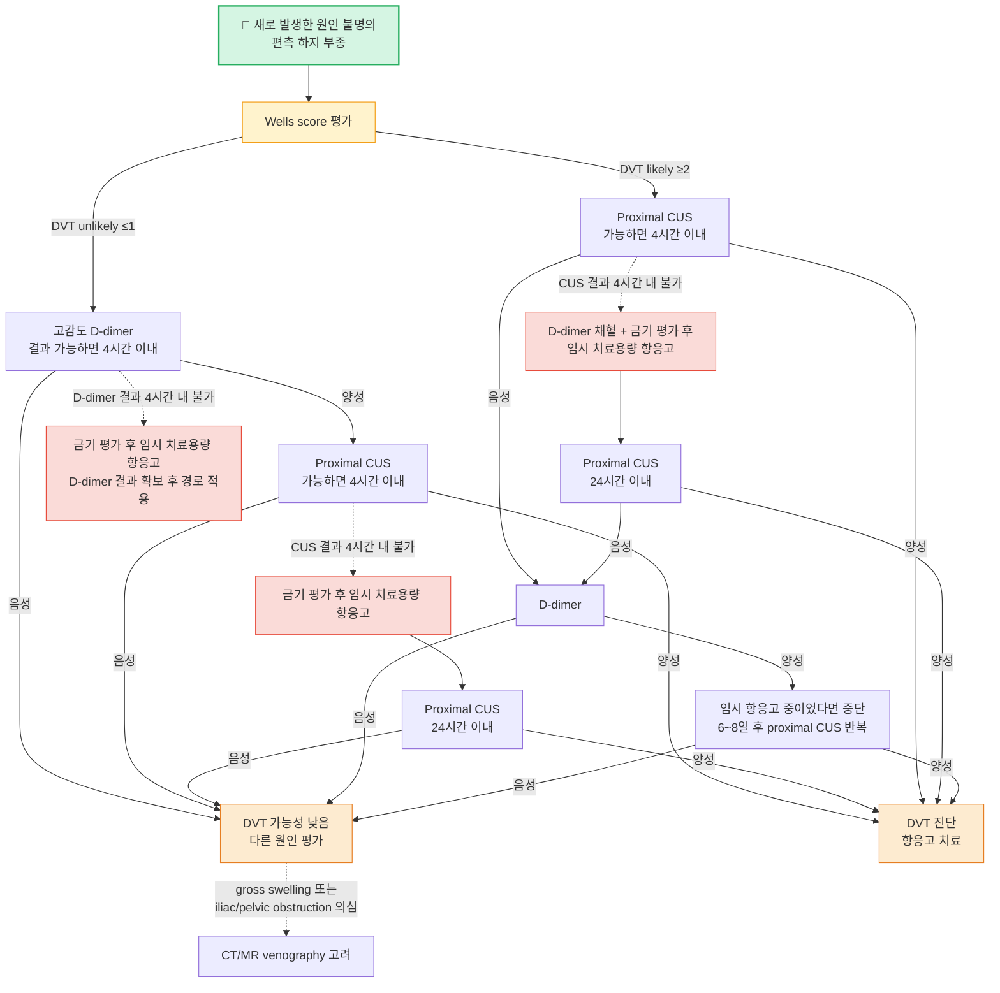
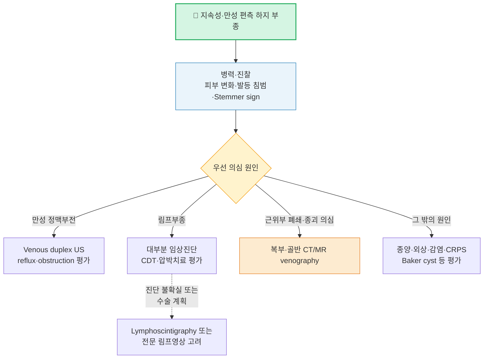
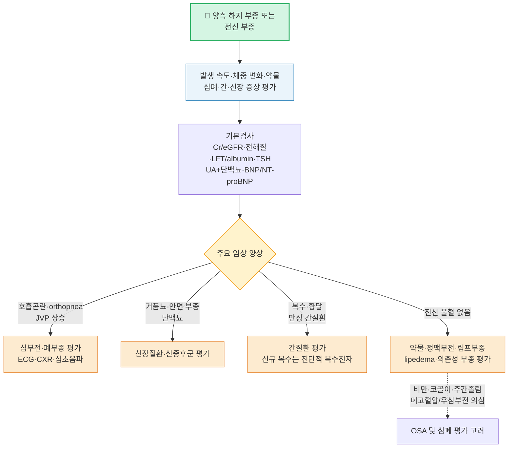
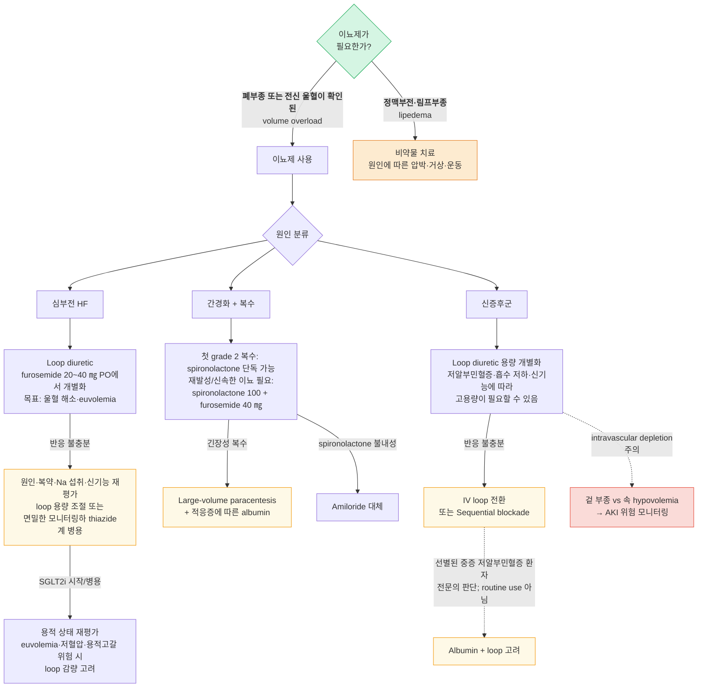

# 부종 Edema

## <mark style="color:green;">일반 사항</mark>

* 부종 : capillary hemodynamics 변화(모세혈관 정수압↑, 혈장 교질삼투압↓, 투과성↑), 림프 배액 장애 또는 신장의 Na·수분 정체 증가에 의해 간질(interstitium)에 체액이 과잉 축적된 상태
* 전신 부종은 심장(정맥 울혈)·간(문맥압항진, 유효동맥혈량 감소 및 Na 정체)·신장(Na 정체)·저알부민 상태를 먼저 감별하고, 국소 부종은 DVT·정맥 부전·림프부종·봉와직염 등을 우선 고려
* 부종의 발생 부위, 좌우 대칭 여부, 발생 속도, pitting 여부, 동반 증상(호흡 곤란, 복수, 황달 등)이 원인 감별의 핵심
* 새로 발생한 원인 불명의 편측 하지 부종에서는 통증·압통 여부와 관계없이 DVT 가능성을 평가하며, Wells score를 이용해 D-dimer 및 압박 초음파 시행 여부를 결정
  * 활성 암은 중요한 DVT 위험 인자이며 Wells score에서 +1점으로 반영한다. 암 환자에서 임상적 의심이 높거나 D-dimer 해석이 어려운 경우에는 영상검사의 문턱을 낮춘다.
* 안정된 말초 부종만으로 이뇨제를 서둘러 투여하지 않으며, 만성 정맥부전·림프부종·lipedema 등 전신 volume overload가 없는 경우에는 권장되지 않음

## <mark style="color:green;">원인</mark>

### <mark style="color:orange;">전신 부종</mark>

#### <mark style="color:$primary;">Cardiac (심부전)</mark>

* 동반 소견 : 운동 시 호흡 곤란, orthopnea, 돌발성 야간 호흡 곤란, 경정맥압 상승 등; 진행된 저심박출·저관류 상태에서는 말초 청색증, 사지 냉증이 동반될 수 있음
* 검사 : BNP/NT-proBNP, ECG, 흉부 X선 및 심초음파를 임상 상황에 따라 시행; 저Na혈증·신기능 저하·간 효소 상승은 진행된 울혈에서 동반될 수 있으나 비특이적

#### <mark style="color:$primary;">Hepatic (간경화)</mark>

* 원인 간질환 병력(예: MASLD, 바이러스성 간염, 알코올 관련 간질환 등)을 확인
* 동반 소견 : 간질환 소견(예: 복수, 황달, 손바닥 홍반, Dupuytren's contracture, spider angioma, 여성형유방증); 진행된 비대상성 간경화에서는 저혈압이 동반될 수 있음
* 복수가 발생한 경우 이외에는 호흡 곤란은 드묾
* 검사 : CBC, AST/ALT, ALP/GGT, bilirubin, albumin, PT/INR, Cr/eGFR 및 Na/K를 평가; 진행된 간질환에서는 저알부민혈증·응고 이상·저Na혈증 등이 동반될 수 있으며 K는 질환 상태와 이뇨제에 따라 감소하거나 증가할 수 있음

#### <mark style="color:$primary;">Renal - CKD / AKI</mark>

* 기전 : Na/H₂O retention에 의한 volume overload
* 동반 소견 : 양측 하지 또는 전신 부종, 체중 증가, 혈압↑; 심한 volume overload에서는 호흡 곤란·폐부종
* 검사 : Cr/eGFR, BUN, K, bicarbonate, urinalysis 및 단백뇨 평가; 진행된 CKD에서는 대사성 산증·빈혈 등이 동반될 수 있음

#### <mark style="color:$primary;">Renal - 신증후군 (Nephrotic syndrome)</mark>

* 기전 : 저알부민혈증에 따른 혈장 교질삼투압 저하와 신장의 일차적 또는 이차적 Na 정체가 함께 관여 → 안면(periorbital) 및 전신 부종
* 동반 소견 : 거품뇨, 아침 안면 부종, 고콜레스테롤혈증, 현미경혈뇨
* 단백뇨 ≥3.5 g/24 h 또는 이에 상응하는 spot urine protein/Cr ratio, serum albumin 감소(흔히 ＜3.0 g/dL), 고지질혈증

#### <mark style="color:$primary;">기타</mark>

* 알레르기, 두드러기, 혈관부종 : 모세혈관 투과성 증가
* 폐쇄수면무호흡증 : 비만, 폐고혈압 또는 우심부전이 동반된 경우 하지 부종과 연관될 수 있으나, OSA 자체를 부종의 직접 원인으로 단정하지 않음
* protein-losing enteropathy, 심한 영양실조 : 단백질 저하/합성↓
* 임신, 월경 전 : 체액 증가
* 갑상선저하증 : generalized myxedema

### <mark style="color:orange;">국소 부종</mark>

* 원인 : 봉와직염, 정맥 부전, trauma, DVT, iliac vein obstruction, lymphedema
  * lipedema는 대개 양측 대칭성으로 나타나 엄밀히는 전신적 지방조직 이상에 가까우나, 하지에 국한되어 나타나므로 임상에서는 국소 부종의 감별 대상으로 함께 다룸
* 만성 하지 부종(편측 or 양측)은 종종 정맥 부전과 관련
* DVT 후에는 post-thrombotic syndrome에 의한 만성 정맥부전이 발생할 수 있으나, DVT가 림프부종의 흔한 원인은 아님
* DVT 위험 인자 : 활동성 암, DVT/PE 과거력, 최근 수술·외상·입원 또는 활동 제한, 임신·산후, estrogen 사용, 혈전성향증, 고령·비만 등. 정맥류는 일반 위험 인자일 수 있으나 Wells score 항목은 아님

### <mark style="color:orange;">만성 하지 부종의 감별</mark>

<table><thead><tr><th width="120.57894897460938"></th><th>Systemic / Dependent</th><th>Venous</th><th>Lymphatic</th><th>Lipedema</th></tr></thead><tbody><tr><td><strong>부종 양상</strong></td><td>Pitting</td><td>Brawny*</td><td>Spongy</td><td>Non-pitting</td></tr><tr><td><strong>하지 거상으로 호전</strong></td><td>호전</td><td>뚜렷하게 호전될 수 있음</td><td>경미</td><td>최소</td></tr><tr><td><strong>부종 분포</strong></td><td>광범위, 원위부가 보다 심함</td><td>주로 발목·하퇴; 진행 시 발에도 부종 가능</td><td>광범위, 원위부가 보다 심함 (발등 포함; Stemmer sign 양성)</td><td>하지, 발목 (발 제외: cuff sign); 양측 대칭</td></tr><tr><td><strong>피부 변화</strong></td><td>빛남, 경미한 착색</td><td>위축, 착색, 피하 섬유화</td><td>비후, 태선화</td><td>대개 정상; 진행 시 결절성 지방조직·피부 표면 변화 가능</td></tr><tr><td><strong>통증</strong></td><td>경미</td><td>통증·무거움·조임이 흔함</td><td>대개 무통성 또는 중압감; 현저한 통증 시 다른 원인 평가</td><td>둔한 통증, 피부 과민, 압통 + 멍 잘 듦</td></tr><tr><td><strong>양측</strong></td><td>대개 양측</td><td>양측 또는 편측; 비대칭 가능</td><td>편측 또는 양측</td><td>대개 양측 대칭</td></tr></tbody></table>

_<mark style="color:$info;">\* Brawny edema: 초기 venous edema는 pitting이나, 만성화되면 hemosiderin 침착·피하 섬유화로 인해 non-pitting의 brawny 양상으로 이행될 수 있음.</mark>_

_<mark style="color:$info;">※ Systemic/dependent edema에는 심장성 등 전신 volume overload와 장시간 기립·근육펌프 저하 등에 의한 의존성 부종이 포함되지만 병태생리는 서로 다르므로 임상 소견과 전신 울혈 여부를 함께 평가한다.</mark>_

_<mark style="color:$info;">Ref. Rakel Family medicine 9th ed. 2015. Table 27-23을 변형·재구성함.</mark>_

### <mark style="color:orange;">특발성 부종증후군 (Idiopathic edema syndrome)</mark>

* 기전 : 기립 시 모세혈관 여과 증가, 이차성 RAAS 활성화 및 Na 정체 등이 관여할 수 있음; re-feeding(급속한 다이어트 후 식사 증량)과 만성 이뇨제 사용·중단도 부종을 유발하거나 악화시킬 수 있음
* 얼굴, 손, 사지 부종; 활동 후 저녁에 악화되고 와위 후 아침에 호전되는 것이 전형적 (아침 안면 부종이 심한 경우는 신성 부종을 먼저 감별)
* 주로 가임기 여성에서 흔하며 남성에서는 드묾; 월경 전에 악화될 수 있으나 월경 주기와 무관하게 지속되는 것이 특징
* 심장, 간, 신장 질환 없음
* 관련 인자 : 비만, 섭식 장애, 반복적인 체중 감량, 만성 이뇨제·하제 사용 등; 정서적 문제의 동반 여부는 개별적으로 평가하되 부종의 원인으로 단정하지 않음
* 진단 : 다른 원인 배제

### <mark style="color:$danger;">🚩 Red Flags!</mark>

<mark style="color:$danger;">**즉각 응급 조치 및 이송, 필요시 119 호출**</mark>

* 갑자기 발생하거나 안정 시에도 심한 호흡 곤란, 저산소증 또는 분홍빛 거품 가래 (폐부종 등 의심)
* 편측 하지 부종과 함께 갑작스러운 호흡 곤란, 흉통, 객혈, 실신·저혈압 또는 설명되지 않는 빈맥이 있는 경우 (PE 의심)
* 입술·혀·목 부종과 쉰 목소리, 연하곤란, 천명 또는 호흡 곤란 (기도를 침범한 혈관부종 의심)
* 간경화·문맥압항진이 의심되는 환자의 토혈·흑변 또는 활동성 위장관 출혈, 특히 저혈압·빈맥·실신/의식 변화 동반
* 전체 하지의 급격하고 심한 종창과 심한 통증·청색증, 감각저하 또는 운동 이상 (phlegmasia cerulea dolens/사지 허혈 의심)
* 통증이 피부 소견에 비해 현저하거나 빠르게 확산하는 부종·발적과 수포, 피부 괴사, 염발음 또는 전신 독성 소견 (괴사성 연조직감염 의심)
* 임신 20주 이후 또는 산후 6주 이내 수축기 BP ≥160 mmHg 또는 이완기 BP ≥110 mmHg, 경련, 의식 변화, 호흡 곤란·폐부종 등 중증 자간전증/자간증 소견

<mark style="color:$warning;">**당일 긴급 평가**</mark>

* 새로 발생한 원인 불명의 편측 하지 부종, 특히 전체 하지 부종·종아리 둘레 차이·통증·압통·열감 또는 DVT 위험 인자 동반 (당일 CUS가 가능한 의료기관에서 평가)
* 황달 또는 새로 발생하거나 급격히 증가한 복수 (비대상성 간질환 의심)
* 심장 질환 병력 + 급격히 악화되는 부종
* 임신 20주 이후 또는 산후 6주 이내 얼굴·손 부종과 고혈압, 지속 두통, 시야 변화, 우상복부/심와부 통증 중 하나 이상 동반하되 위의 중증 소견은 없는 경우 (자간전증 의심)
* 급격한 소변량 감소와 빠른 체중 증가, 전신 부종 또는 신기능 악화 의심 소견
* 발열 또는 국소 발적·열감·압통을 동반한 급성 부종 (봉와직염·감염성 원인 감별)

<mark style="color:$info;">**외래 추적 관찰**</mark>

* 심장 이상 소견(심잡음, 부정맥 등)
* 만성으로 원인이 확인된 정맥부전·림프부종·근골격계 질환 등에서 새 위험징후 없이 지속되는 통증성 부종
* 보행 또는 일상 활동에 지장을 줄 정도로 진행하는 부종
* 급격한 소변량 감소 없이 반복되는 거품뇨 또는 신장질환 의심 소견
* 원인 교정 및 압박·거상 등 표준 치료에 4\~6주간 반응이 없는 만성 부종

## <mark style="color:green;">진단</mark>

※**빠른 감별 진단 프레임워크**\
 ⓵ 새로 발생한 원인 불명의 편측 부종 → 통증 유무와 관계없이 DVT 평가\
 ⓶ 호흡 곤란 동반 → 심부전·폐부종, PE 및 신부전성 volume overload 우선 감별\
 ⓷ 아침 안면 부종 → 신장질환·신증후군 및 저알부민혈증 우선 평가\
 ⓸ 복수 + 하지 부종 → 간경화, 우심부전 및 악성종양 등 감별\
 ⓹ 만성 + 피부 변화 → 정맥/림프 부전 우선 고려\
 ⓺ 약물 시작 후 → 약물 유발 부종 우선 고려

### <mark style="color:orange;">감별</mark>

#### <mark style="color:$primary;">발생 부위</mark>

* 말초 부종만 존재 → 국소 정맥/림프 질환을 우선 고려하되 약물 유발 부종과 초기 전신질환도 배제하지 않음
* 전신성(특히 눈꺼풀, 안면), 자고 일어난 아침에 심함 → 신성 부종 또는 저알부민혈증을 우선 고려
* 오래 서 있거나 앉아 있을수록 악화되고 거상 시 호전되는 하지 부종 → 만성 정맥부전/의존성 부종 우선 고려
* 양측 dependent edema + 호흡 곤란·orthopnea·경정맥 확장 등 전신 울혈 소견 → 심부전 고려

**Unilateral predominance**

* 원인 : 정맥 부전, DVT, lymphedema, 종양, complex regional pain syndrome

**Bilateral predominance**

* 원인 : 전신 질환(심장/간/신장 부전, 영양실조), lipedema, medication-induced edema, 폐쇄수면무호흡증, 고령(피부 탄력/근력 약화), Graves Dz(pretibial myxedema)
* 말초 pitting edema 유발 약물 : CCB(특히 dihydropyridine계; pre-capillary dilation에 의한 ankle edema), pregabalin/gabapentin, NSAID(Na 재흡수 증가), 호르몬제(예: steroid, estrogen, progesterone, testosterone), thiazolidinedione(Na 재흡수 증가), α-차단제, 항암제, minoxidil(혈관 확장), 인슐린(초기 투여 시 Na 정체 유발)
* 혈관부종(angioedema) : ACE inhibitor가 대표적이며 얼굴·입술·혀 부종이 발생하면 기도 침범 여부를 즉시 평가; ARB에서도 드물게 발생 가능
* DHP-CCB 유발 발목 부종 : 용량 감량 또는 중단/교체를 우선 고려하고, 혈압 적응증이 있으면 ACEi/ARB 병용으로 부종이 감소할 수 있음; lercanidipine 등 일부 newer/lipophilic DHP CCB로 전환을 고려할 수 있음
  * DHP-CCB 부종은 혈관 확장에 따른 모세혈관 내 압력 변화가 주기전이므로, 전신 volume overload가 없다면 이뇨제로 교정하려 하지 않음

#### <mark style="color:$primary;">원인별 부종의 특징 비교</mark>

<table><thead><tr><th width="94.31576538085938">구분</th><th width="143.5789794921875">심부전</th><th width="137.368408203125">신증후군</th><th width="103.78948974609375">간경화</th><th>특발성 부종</th></tr></thead><tbody><tr><td>주요 부위</td><td>하지(심장보다 낮은 위치); ascending edema</td><td>안면(눈가) 및 전신; periorbital edema</td><td>복수 + 하지</td><td>안면, 손, 하지</td></tr><tr><td>심화 시간</td><td>저녁(활동 후)</td><td>아침(기상 직후)</td><td>비교적 일정</td><td>저녁(체중 일중 변동 심함)</td></tr><tr><td>동반 증상</td><td>호흡 곤란, 경정맥 확장, orthopnea</td><td>거품뇨, 단백뇨, 저알부민혈증</td><td>황달, 복수, 여성형 유방</td><td>정서적 스트레스, 월경 전 악화</td></tr></tbody></table>

#### <mark style="color:$primary;">국소 상태</mark>

* 압통은 DVT뿐 아니라 봉와직염, 표재성 혈전정맥염, 외상 등에서도 발생 가능; 림프부종은 대개 비압통성 또는 중압감이 주이며 현저한 통증이 있으면 다른 원인을 함께 평가
* pitting edema : pretibial area(정강이뼈 앞), 발등, medial malleolus(안쪽 복사뼈) 부위를 엄지손가락으로 5초 이상 압박 후 함몰 여부 확인; DVT, 정맥 부전, 림프부종 초기에서 양성

<table><thead><tr><th width="79.3157958984375">등급</th><th width="122.26312255859375">함몰 깊이</th><th width="108.89471435546875">회복 시간</th><th>임상 소견</th></tr></thead><tbody><tr><td>1+</td><td>2 ㎜ 이하</td><td>즉시</td><td>경미한 부종</td></tr><tr><td>2+</td><td>2~4 ㎜</td><td>15초 이내</td><td>중등도; 하지 윤곽 유지</td></tr><tr><td>3+</td><td>4~6 ㎜</td><td>1분 이내</td><td>심한 부종; 하지 윤곽 변형</td></tr><tr><td>4+</td><td>6~8 ㎜ 이상</td><td>2분 이상</td><td>매우 심한 부종; 현저한 하지 변형</td></tr></tbody></table>

_<mark style="color:$info;">※ 위 수치는 임상에서 사용하는 여러 관행 중 하나이며 보편적으로 표준화된 절단값은 아니다. Pitting edema 1+~4+ 등급은 관찰자 간 재현성이 제한적이므로 추적 시 동일한 부위·자세·압박시간으로 평가하고, 같은 조건의 체중·발목/종아리 둘레와 피부 상태를 함께 기록하는 것이 좋다.</mark>_

* non-pitting edema : 림프부종 후기(약한 pitting은 발생 가능), pretibial myxedema(갑상선 질환)
* Stemmer sign : 2nd toe(또는 2nd finger) 근위부 등쪽 피부가 집어 올려지지 않으면 양성으로 림프부종을 지지하나 단독 확진 소견은 아님; 비만 등에서 위양성이 가능하고 음성이라도 초기 림프부종을 배제할 수 없음 (Goss & Greene, Plast Reconstr Surg Glob Open 2019 : 민감도 92%, 특이도 57%)
* medial malleolus 부위의 크고 얕고 중등도 이하의 통증성 궤양 → 만성 정맥 부전
* 작고 깊고 심한 통증성 궤양 → 동맥 부전, 혈관염, 감염
* 신경병증성 당뇨발 궤양 → 발바닥 등 압박 부위에 흔하며 감각저하로 통증이 적을 수 있음; 동맥성·정맥성 궤양과 감별
* 다른 쪽보다 종아리가 ≥3 ㎝ 굵음 → 심부 정맥 폐쇄 의심
  * tibial tuberosity의 10 ㎝ 하방에서 양측을 동일한 자세로 측정
* 피부 과각화(hyperkeratosis), 경결(dermal fibrosis) → 만성 림프 부종
* 갈색 피부, hemosiderin 침착 → 정맥 부전

#### <mark style="color:$primary;">동반 증상</mark>

* 호흡 곤란 → 심부전·폐부종뿐 아니라 PE, 신부전성 volume overload 및 폐질환 등을 함께 감별
* 복수 → 간경화 외에 심부전, 악성종양, 결핵, 췌장질환 등도 감별

### <mark style="color:orange;">검사</mark>

* 초음파, D-dimer : 새로 발생한 원인 불명의 편측 하지 부종에서 DVT 감별을 위하여 시행
  * Wells score ≤1(DVT unlikely)에서는 고감도 D-dimer를 이용한 배제 전략을 적용할 수 있음; Wells ≥2(DVT likely)에서는 pretest probability가 높으므로 D-dimer 단독 배제 전략을 사용하지 않고 proximal CUS를 우선 시행
  * 50세 초과에서는 검사법에 적합한 age-adjusted D-dimer cutoff 사용을 고려
* Ankle-brachial pressure index : 만성 정맥 부전과 동맥 질환 감별; 고령 및 당뇨병 환자에서는 동맥의 compressibility가 감소되어 있으므로 해석에 주의를 요함; 혈관 석회화로 ABI가 위양성으로 높게 측정될 수 있어 이 경우 toe-brachial index(TBI ＜0.7 시 이상) 또는 발등동맥·후경골동맥 맥박 촉진으로 보완
* 원인 불명의 양측 하지 또는 전신 부종에서는 병력·진찰과 임상 가능성에 따라 BMP/electrolytes, BUN/Cr/eGFR, LFT + serum albumin, TSH, BNP 또는 NT-proBNP, urinalysis + urine protein/Cr ratio(또는 uACR)를 선택하여 시행하고, 임상 상황에 따라 CBC 추가
  * BNP/NT-proBNP는 비만에서 예상보다 낮고 CKD·고령·AF에서는 높을 수 있으므로 임상 소견과 함께 해석
* [Wells score](https://www.mdcalc.com/calc/362/wells-criteria-dvt) : DVT 임상 가능성 평가
  * 배점 : 다음 항목들에 대하여 각 **+1점**: ⓵ 활성 암(치료 중, 최근 6개월 이내 치료 또는 완화치료), ⓶ 최근 3일 이상 침상 안정 또는 12주 이내 전신·부위마취가 필요했던 주요 수술, ⓷ 종아리 둘레가 반대측보다 ≥3 ㎝, ⓸ collateral(비정맥류) 표재 정맥, ⓹ 증상측 하지 전체 부종, ⓺ 심부정맥 경로를 따라 국소 압통, ⓻ 증상측 다리에 국한된 pitting edema, ⓼ 하지 마비·불완전마비 또는 최근 석고 고정, ⓽ 확인된 DVT 과거력; 다음 항목에 대하여 **−2점**: ⓾ DVT만큼 가능성 있는 다른 진단
  * 판정 : ≤1점=DVT unlikely, ≥2점=DVT likely
  * Wells score는 임상 판단을 보조하는 도구이며, 임신·산후 및 일부 특수 환자군에서는 별도의 진단 경로와 전문 평가가 필요함

***


```mermaid
graph TD
SG1["🔷 새로 발생한 원인 불명의<br/>편측 하지 부종"] --> B["Wells score 평가"]
        B -- "DVT unlikely ≤1" --> C["고감도 D-dimer<br/>결과 가능하면 4시간 이내"]
        C -- "음성" --> E["DVT 가능성 낮음<br/>다른 원인 평가"]
        C -- "양성" --> D1["Proximal CUS<br/>가능하면 4시간 이내"]
        C -. "D-dimer 결과 4시간 내 불가" .-> I1["금기 평가 후 임시 치료용량 항응고<br/>D-dimer 결과 확보 후 경로 적용"]
        B -- "DVT likely ≥2" --> D2["Proximal CUS<br/>가능하면 4시간 이내"]
        D1 -- "양성" --> G["DVT 진단<br/>항응고 치료"]
        D1 -- "음성" --> E
        D1 -. "CUS 결과 4시간 내 불가" .-> I3["금기 평가 후 임시 치료용량 항응고"]
        I3 --> D4["Proximal CUS<br/>24시간 이내"]
        D4 -- "양성" --> G
        D4 -- "음성" --> E
        D2 -- "양성" --> G
        D2 -- "음성" --> DD["D-dimer"]
        D2 -. "CUS 결과 4시간 내 불가" .-> I2["D-dimer 채혈 + 금기 평가 후<br/>임시 치료용량 항응고"]
        I2 --> D3["Proximal CUS<br/>24시간 이내"]
        D3 -- "양성" --> G
        D3 -- "음성" --> DD
        DD -- "음성" --> E
        DD -- "양성" --> R["임시 항응고 중이었다면 중단<br/>6~8일 후 proximal CUS 반복"]
        R -- "양성" --> G
        R -- "음성" --> E
        E -. "gross swelling 또는<br/>iliac/pelvic obstruction 의심" .-> H["CT/MR venography 고려"]

    style SG1 fill:#d5f5e3,stroke:#27ae60,stroke-width:2px
    style B fill:#fff3cd,stroke:#f39c12
    style I1 fill:#fadbd8,stroke:#e74c3c
    style I2 fill:#fadbd8,stroke:#e74c3c
    style I3 fill:#fadbd8,stroke:#e74c3c
    style E fill:#fdebd0,stroke:#e67e22
    style G fill:#fdebd0,stroke:#e67e22
```

_<mark style="color:$info;">※ 임시 치료용량 항응고 전 CBC, 신·간기능, PT, aPTT를 채혈하되 결과를 기다리느라 치료를 지연하지 않는다. 출혈 위험·금기와 임신 여부를 확인하고, 국내 진료 환경과 환자별 위험에 따라 적용한다.</mark>_



```mermaid
graph TD
SG2["🔷 지속성·만성 편측 하지 부종"] --> B2["병력·진찰<br/>피부 변화·발등 침범·Stemmer sign"]
        B2 --> C2{"우선 의심 원인"}
        C2 -- "만성 정맥부전" --> D2["Venous duplex US<br/>reflux·obstruction 평가"]
        C2 -- "림프부종" --> E2["대부분 임상진단<br/>CDT·압박치료 평가"]
        C2 -- "근위부 폐쇄·종괴 의심" --> F2["복부·골반 CT/MR venography"]
        C2 -- "그 밖의 원인" --> G2["종양·외상·감염·CRPS<br/>Baker cyst 등 평가"]
        E2 -. "진단 불확실 또는<br/>수술 계획" .-> H2["Lymphoscintigraphy 또는<br/>전문 림프영상 고려"]

    style SG2 fill:#d5f5e3,stroke:#27ae60,stroke-width:2px
    style B2 fill:#eaf4fb,stroke:#2980b9
    style C2 fill:#fff3cd,stroke:#f39c12
    style F2 fill:#fdebd0,stroke:#e67e22
```


```mermaid
graph TD
SG3["🔷 양측 하지 부종 또는 <br/>전신 부종"]
        SG3 --> A3["발생 속도·체중 변화·약물<br/>심폐·간·신장 증상 평가"]
        A3 --> B3["기본검사<br/>Cr/eGFR·전해질·LFT/albumin·TSH<br/>UA+단백뇨·BNP/NT-proBNP"]
        B3 --> C3{"주요 임상 양상"}
        C3 -- "호흡곤란·orthopnea<br/>JVP 상승" --> D3a["심부전·폐부종 평가<br/>ECG·CXR·심초음파"]
        C3 -- "거품뇨·안면 부종<br/>단백뇨" --> D3b["신장질환·신증후군 평가"]
        C3 -- "복수·황달<br/>만성 간질환" --> D3c["간질환 평가<br/>신규 복수는 진단적 복수천자"]
        C3 -- "전신 울혈 없음" --> D3d["약물·정맥부전·림프부종<br/>lipedema·의존성 부종 평가"]
        D3d -. "비만·코골이·주간졸림<br/>폐고혈압/우심부전 의심" .-> E3["OSA 및 심폐 평가 고려"]

    style SG3 fill:#d5f5e3,stroke:#27ae60,stroke-width:2px
    style A3 fill:#eaf4fb,stroke:#2980b9
    style C3 fill:#fff3cd,stroke:#f39c12
    style D3a fill:#fdebd0,stroke:#e67e22
    style D3b fill:#fdebd0,stroke:#e67e22
    style D3c fill:#fdebd0,stroke:#e67e22
    style D3d fill:#fdebd0,stroke:#e67e22
```

<p align="center"><strong>편측 또는 양측 하지, 전신 부종의 진단 알고리듬</strong><br><em><mark style="color:$info;">CUS=compression ultrasonography, DVT=deep venous thrombosis, CDT=complete decongestive therapy</mark></em><br><em><mark style="color:$info;">Ref. 급성 DVT 경로는 NICE NG158의 2-level Wells strategy 및 검사 지연 시 interim therapeutic anticoagulation 권고를 반영하여 수정.</mark></em></p>

***

## <mark style="background-color:$warning;">Management</mark>


**놓치지 말아야 할 부종 원인 Top 5**

⓵ **DVT** - 새로 발생한 원인 불명의 편측 하지 부종(압통이 없어도 가능) → Wells score 평가 후 D-dimer/CUS 경로 적용\
⓶ **비대상성 심부전** - 호흡 곤란·orthopnea·전신 울혈 동반 부종\
⓷ **신증후군** - 아침 안면 부종 + 거품뇨 + 저알부민\
⓸ **간경화 + 복수** - 복부 팽만 + 황달\
⓹ **약물 유발 부종** - 최근 시작된 CCB·NSAID·TZD·gabapentin 등


### <mark style="color:orange;">치료 방침</mark>

* 원인 질환을 우선 치료함. DVT에는 적응증에 따라 항응고 치료를 시행하고, 이뇨제는 전신성 Na·수분 저류 또는 울혈이 확인된 경우에 사용
* 피부 관리 주의 (피부 손상 및 venous ulcer 예방)

#### <mark style="color:$primary;">이뇨제 투여 지침</mark>

* 안정된 말초 부종만으로 이뇨제를 서둘러 투여하지 않음. 폐부종·저산소증을 동반한 울혈, 진행성 cardiorenal syndrome, 긴장성 복수 등은 신속한 평가와 입원 또는 전문의 의뢰가 필요
* 주의 : 간경화성 복수·신증후군 등에서는 겉으로 부종이 심해도 유효 순환혈액량이 감소해 있을 수 있어 과도한 이뇨에 의한 저혈압·AKI에 주의
  * 만성 정맥 부전에서도 volume overload 상태가 아니면 이뇨제 사용을 권하지 않음
* 심부전·신장질환 등 전신 volume overload : loop diuretics(예: furosemide, bumetanide, torsemide)를 주로 사용
* 간경화성 복수 : aldosterone antagonist가 치료의 중심이며, 시작 전략은 아래 간경화 항목과 같이 환자 상태와 지침에 따라 단독 또는 loop 병합을 선택
  * AASLD는 spironolactone 100 ㎎ + furosemide 40 ㎎ 병합 시작을 선호
  * EASL은 첫 발생 grade 2 복수에서 spironolactone 단독 시작 후 반응 불충분 또는 고K혈증 시 furosemide 추가를 권고하며, 재발성 복수에는 병합요법 권고
  * 긴장성/grade 3 복수에서는 단순 이뇨제 증량보다 large-volume paracentesis와 적응증에 따른 albumin 투여를 우선 고려
  * 이뇨 중 체중 감소는 일반적으로 말초 부종이 없으면 ≤0.5 kg/d, 말초 부종이 있으면 ≤1 kg/d를 목표로 하며 저Na혈증·AKI·저혈압·간성뇌증 발생 시 감량·중단하고 재평가
  * 5 L를 초과하여 복수를 제거하는 large-volume paracentesis에서는 일반적으로 제거한 복수 1 L당 albumin 6~8 g 투여
* furosemide : 야간 투여 시 수면 장애 초래 가능; PO 20\~40 ㎎, IV 10\~40 ㎎ <mark style="color:blue;">\[라식스]</mark>
  * 반응 불충분 시 원인, 복약순응도, Na 섭취, 신기능 및 흡수 장애를 재평가한 뒤 용량을 조절
  * 허가사항상 중증 부종에서 PO 600 ㎎/d까지 기술되어 있으나 일반적인 외래 상한이 아니며, 80 ㎎/d를 장기간 초과하면 면밀한 임상·검사실 모니터링이 필요함. 고용량 경구 또는 정주 치료는 전문의·급성기 관리 영역으로 봄
  * 신부전 또는 신증후군 시 고용량 필요
  * 심부전 시 hypo-perfusion 증상을 모니터링하면서 사용

※ 이뇨제 저항성 시 sequential nephron blockade 전략 : loop 이뇨제 단독으로 반응이 불충분한 저항성 울혈에서 thiazide계 이뇨제 등을 병용할 수 있다. 투여 시점과 용량은 환자별로 조절하며, 저Na·저K·저Mg혈증, 저혈압 및 신기능 악화 위험이 크므로 전문의 판단 또는 단기간 내 검사실 추적이 가능한 상황에서 시행한다. Metolazone은 국내 허가·유통 여부를 확인한 후 기술·사용한다.

※ 저알부민 상태에서의 이뇨제 저항성 : 중증 저알부민혈증 및 유효 순환혈액량 감소가 있는 일부 입원 환자에서 전문의 판단하에 albumin 정주 + loop 이뇨제를 고려할 수 있으나 routine use는 권장되지 않는다. 간경화에서는 단순 저알부민혈증 자체가 albumin 투여 적응증은 아니며, large-volume paracentesis 등 별도 적응증에 따라 사용한다.

※ 신증후군성 부종은 신기능·유효순환혈액량·저알부민혈증 정도에 따라 이뇨제 용량·전략이 크게 달라지므로, 일률적인 외래 처방례를 제시하지 않고 개별화하여 접근함

***


```mermaid
graph TD
    A{"이뇨제가<br/>필요한가?"}
    A -- "<b>폐부종 또는 전신 울혈이 확인된</b><br/>volume overload" --> B["이뇨제 사용"]
    A -- "<b>정맥부전·림프부종</b><br/>lipedema" --> Z["비약물 치료<br/>원인에 따른 압박·거상·운동"]

    B --> C{"원인 분류"}
    C --> HF["심부전 HF"]
    C --> CI["간경화 + 복수"]
    C --> NS["신증후군"]

    HF --> HF1["Loop diuretic<br/>furosemide 20~40 ㎎ PO에서 개별화<br/>목표: 울혈 해소·euvolemia"]
    HF1 -- "반응 불충분" --> HF2["원인·복약·Na 섭취·신기능 재평가<br/>loop 용량 조절 또는<br/>면밀한 모니터링하 thiazide계 병용"]
    HF2 -- "SGLT2i 시작/병용" --> HF3["용적 상태 재평가<br/>euvolemia·저혈압·용적고갈 위험 시<br/>loop 감량 고려"]

    CI --> CI1["첫 grade 2 복수: spironolactone 단독 가능<br/>재발성/신속한 이뇨 필요:<br/>spironolactone 100 + furosemide 40 ㎎"]
    CI1 -- "긴장성 복수" --> CI2["Large-volume paracentesis<br/>+ 적응증에 따른 albumin"]
    CI1 -- "spironolactone 불내성" --> CI3["Amiloride 대체"]

    NS --> NS1["Loop diuretic 용량 개별화<br/>저알부민혈증·흡수 저하·신기능에 따라<br/>고용량이 필요할 수 있음"]
    NS1 -- "반응 불충분" --> NS2["IV loop 전환<br/>또는 Sequential blockade"]
    NS2 -. "선별된 중증 저알부민혈증 환자<br/>전문의 판단; routine use 아님" .-> NS3["Albumin + loop 고려"]
    NS1 -. "intravascular depletion <br/>주의" .-> NS_w["겉 부종 vs 속 hypovolemia<br/>→ AKI 위험 모니터링"]

    style A fill:#d5f5e3,stroke:#27ae60
    style Z fill:#fdebd0,stroke:#e67e22
    style HF2 fill:#fef9e7,stroke:#f39c12
    style CI2 fill:#fef9e7,stroke:#f39c12
    style NS2 fill:#fef9e7,stroke:#f39c12
    style NS3 fill:#fef9e7,stroke:#f39c12
    style NS_w fill:#fadbd8,stroke:#e74c3c
```

<p align="center"><strong>이뇨제 선택 및 저항성 대응 알고리듬</strong></p>

***

### <mark style="color:orange;">심부전에 의한 부종</mark>

* 이뇨제는 울혈 증상을 완화하지만, 장기 예후는 심부전 표현형에 맞는 foundational medical therapy(FMT)와 동반 질환 치료가 결정함
* 2026 ESC 분류
  * HFrEF : LVEF ＜50% (기존 HFmrEF 41~49%를 별도 표현형으로 구분하지 않고 포함)
  * HFpEF : LVEF ≥50%
  * 기존 임상시험 및 ACC/AHA 지침의 ≤40%, 41~49%, ≥50% 분류와 다르므로 근거를 인용할 때 사용된 분류 기준을 함께 확인
* HFrEF의 FMT는 가능한 한 조기에 병용하고 최대 내약 용량으로 조절
  * renin-angiotensin system 억제: 적응되는 환자에서 ARNI를 우선 고려하고, ARNI 사용이 어렵거나 부적절하면 ACE 억제제, ACE 억제제 불내성 시 ARB 고려
  * 근거 기반 베타차단제, MRA(spironolactone/eplerenone), SGLT2 억제제
* HFpEF : 울혈 시 이뇨제, SGLT2 억제제와 MRA를 포함한 FMT 및 고혈압·AF·관상동맥질환·비만 등 동반 질환 치료
* SGLT2 억제제를 시작한다고 loop 이뇨제를 일률적으로 감량하지 않음. 울혈이 지속되면 유지하고, euvolemia·저혈압 또는 용적 고갈 위험이 있으면 감량을 고려하며 체중·혈압·신기능을 추적
* 2026 ESC에서는 기존 acute HF 대신 decompensated HF라는 용어를 사용함
* 1차 진료에서 심부전 확인 시 심장내과 협진 또는 의뢰 권고 (약물 선택 및 용량 조절)

_<mark style="color:$info;">Ref. 2026 ESC Guidelines for the management of heart failure.</mark>_

### <mark style="color:orange;">특발성 부종증후군, 하지 부종</mark>

* 다음 순서로 접근함: ⓵ 심장·간·신장 질환, 정맥/림프질환 및 약물 유발 부종 배제 → ⓶ 불필요한 기존 이뇨제의 감독하 감량·중단 → ⓷ 염분 과잉·섭식 장애·장시간 기립 등 생활 요인 교정 → ⓸ 지속되는 선별 환자에서만 제한적으로 약물 고려
* 이미 이뇨제를 사용하고 있는 경우에는 심장·간·신장 질환 등 지속 적응증이 없음을 확인한 후 의사의 감독 아래 감량·중단(diuretic withdrawal)을 우선 고려함; 중단 후 2\~4주 동안 반동 부종을 관찰하고 필요 시 저염식 병행
  * 이뇨제 유발 부종 악순환 : 만성 이뇨제 사용 → RAAS 활성화 → aldosterone↑ → Na 정체 → 이뇨제 중단 시 반동 부종(rebound edema). 중단 후 일시적 체중 증가가 수주 내 자연 호전됨을 미리 설명하여 조기 재복용을 방지

#### <mark style="color:$primary;">이뇨제</mark>

* 이뇨제가 필요한 경우 최소 유효 용량으로, 단기 사용을 원칙으로 투여 (☞ p.485)
* 야간뇨를 피하기 위해 아침 또는 이른 오후에 투여
* spironolactone 50\~100 ㎎/d에서 시작하여 최소 유효 용량 사용 <mark style="color:blue;">\[알닥톤]</mark> (특발성 부종에 대한 근거가 제한적인 경험적 사용이며 장기 투여를 피함)
  * 시작 전 K, Cr/eGFR 및 혈압을 확인하고, 시작 또는 증량 후 통상 1주 이내 재검한 뒤 환자 위험도에 따라 주기적으로 추적
  * ACE 억제제/ARB, NSAID, K 보충제 병용 및 CKD·고령에서는 고K혈증 위험에 특히 주의
  * 필요 시 hydrochlorothiazide 12.5\~25 ㎎ qAM을 선택적으로 병용할 수 있으나 저Na·저K혈증과 체액고갈 위험이 있어 조기에 전해질·신기능을 추적 <mark style="color:blue;">\[다이크로짇]</mark>

#### <mark style="color:$primary;">기타</mark>

* 누워서 쉼 (단, 심부전에 의한 부종 환자는 누운 자세로 인한 정맥 환류량 증가가 호흡 곤란을 악화시킬 수 있으므로 주의)
* 더운 환경을 피함
* leg elevation : 하지 부종에 대하여 심장 높이 이상으로 30분씩 하루 3\~4회
* 하지 압박: 깨어 있을 때 압박 스타킹 착용; 취침 시에는 착용하지 않음
  * 1차 선택 : 일반적으로 AD type 스타킹(발목\~무릎 아래)
    * AG type(발목\~허벅지) : 병변이 허벅지 이상으로 명확히 존재하는 경우에 한해 선택적 적용; 순응도가 낮고, 무릎 뒤에서 접힐 경우 지혈대 효과(Tourniquet effect) 위험
  * ABI ＜0.6, ankle pressure ＜60 mmHg 또는 toe pressure ＜30 mmHg이면 sustained compression은 일반적으로 피하고 혈관 전문 평가를 고려; ABI 0.6\~0.8에서는 동맥 관류를 확인한 뒤 저압력 압박을 전문가 판단하에 신중히 적용
  * 심부전 : NYHA IV에서는 sustained compression을 피하고, NYHA III에서는 routine 사용을 권하지 않으며 명확한 적응증이 있을 때 임상·혈역학적 모니터링하에 선택적으로 적용
  * 취침 시에는 일반적으로 압박 스타킹을 착용하지 않음
  * ABI ＞1.3 : 혈관 석회화(calcification)로 위양성 가능 → 압박 적용 전 toe-brachial index(TBI) 또는 혈관외과 평가 필요
  * 주의 : 중증 말초신경병증(peripheral neuropathy) 환자는 압박에 의한 피부 손상을 감지하지 못할 수 있으므로 신중히 적용하고 정기적으로 피부 상태를 확인
* 경증 정맥성 부종에는 일반적으로 20\~30 ㎜Hg를 고려하며, 정맥성 궤양은 동맥 순환이 충분한지 확인한 후 발목 목표압 약 40 ㎜Hg의 다층·비탄력 붕대 또는 조절형 압박기구를 우선 고려
  * 추가 VTE 위험 인자가 없는 저위험 장거리 여행자에게 압박 스타킹을 routine으로 권하지 않음. 과거 VTE, 최근 수술, 활동성 암, 임신·산후 또는 복합 위험 인자가 있는 경우 개별 위험 평가 후 무릎 아래 graduated compression stockings를 고려
  * 림프부종의 초기 집중 치료기(reductive phase)에는 숙련된 치료자가 complete decongestive therapy의 일부로 다층압박붕대를 환자 상태에 맞게 적용하고, 이후 유지기(maintenance phase)에는 적합한 압박의류로 전환
  * 활동 감소 상태의 환자에 대하여 간헐적 pneumatic compression 고려
* 저염식과 수분 조절은 심부전·신장질환·간경화 등 Na·수분 저류성 부종에서 원인 질환과 혈청 Na·용적 상태에 맞게 적용하며, 단순 정맥부전·림프부종·lipedema의 핵심 치료로 일률 적용하지 않음
* 적정 체중 유지, 섭식 장애 교정
* 동반된 우울·불안 또는 섭식 장애 등이 있으면 별도로 평가·치료
* 걷기 : 종아리 근육이 수축되며 정맥 회귀가 증가됨
* vitis vinifera leaf dry extract(포도엽 건조엑스) : 360 ㎎(2캡슐) 아침 식전 <mark style="color:blue;">\[안탁스]</mark>

### <mark style="color:orange;">부종 관련 건강보조제 및 정맥순환개선제</mark>

* 아래 성분들은 정맥 기능 부전(CVI)에 의한 경한 부종에 제한된 근거이며, 심부전·신부전·간경화·저알부민혈증에 의한 부종에는 효과 없음
* 부종의 원인 감별 없이 건강보조제를 복용하면 근본 치료가 지연될 수 있음

<table><thead><tr><th width="170">성분</th><th width="130">적용 부종 유형</th><th width="150">근거 수준</th><th>국내 시판 현황 및 주요 주의사항</th></tr></thead><tbody><tr><td>MPFF (micronized purified flavonoid fraction)</td><td>증상이 있는 만성 정맥질환</td><td>조건부·중등도 (SVS/AVF/AVLS 2023: Grade 2B); ESVS 2022는 개별 약제의 근거를 전제로 venoactive drugs를 Class IIa, Level A로 고려</td><td>국내 일반의약품으로 유통. 단순 diosmin과 동일 성분군으로 묶지 말고 제품별 조성·허가사항 확인</td></tr><tr><td>Diosmin 단일성분</td><td>정맥성 증상</td><td>제제별 근거가 이질적이며 MPFF의 Grade 2B를 그대로 적용할 수 없음</td><td>국내 일반의약품 다수; 증상 완화의 보조요법이며 압박·운동 및 원인 치료를 대체하지 않음</td></tr><tr><td>Red vine leaf extract<br>(포도엽 건조엑스)</td><td>정맥 관련 통증·무거움·부종감</td><td>조건부·낮음~매우 낮음 (SVS/AVF/AVLS 2023: Grade 2C)</td><td>국내 허가 제품의 용법·금기 및 최신 유통 상태 확인</td></tr><tr><td>HCSE (horse chestnut seed extract)</td><td>정맥 관련 증상</td><td>조건부·낮음~매우 낮음 (SVS/AVF/AVLS 2023: Grade 2C)</td><td>표준화된 경구 추출물에 한한 근거이며 생종자·비표준화 제품은 독성 우려; 국내 경구 허가·유통 여부를 제품별 확인</td></tr></tbody></table>

_<mark style="color:$info;">※ 포도씨 OPC, 민들레 등은 부종 치료 효과를 뒷받침하는 임상 근거가 부족하여 권고하지 않음.</mark>_

***

### <mark style="color:red;">질병코드</mark>

R60.0 국소부종

R60.1 전신부종

R60.9 상세불명의 부종

E87.7 체액과부하

I89.0 림프 부종

***

## <mark style="color:purple;">처방례</mark>

> **처방례 1. 심부전에 의한 volume overload - 안정된 외래 환자**
>
> ```
> 라식스 40 ㎎/T 0.5\~1 T qd 아침
> ※ 체중·혈압·Cr/eGFR·Na/K를 추적하며 euvolemia 도달 후 최소 유효 용량으로 조절
> ※ 급성 악화 또는 신규 발생 심부전은 외래 단독 처방 대상이 아니며 전문의 의뢰를 고려
> ```
>
> **처방례 2. 간경화에 의한 재발성 복수/하지 부종 또는 병합요법이 적절한 안정된 외래 환자**
>
> ```
> 알닥톤 필름코팅정 25 ㎎/T 4T qd 아침 (총 100 ㎎/d)
> 라식스 40 ㎎/T 1T qd 아침 (spironolactone : furosemide = 100 : 40 비율)
> ※ Na/K/Cr, 혈압, 체중을 모니터링하며 저나트륨혈증·AKI·간성뇌증 발생 시 재평가
> ※ 체중 감소는 일반적으로 말초 부종이 없으면 ≤0.5 kg/d, 말초 부종이 있으면 ≤1 kg/d를 목표로 조절
> ※ 신규 발생 복수는 진단적 복수천자 등 원인 평가가 선행되어야 하며, 첫 grade 2 복수에서는 spironolactone 단독 시작 전략도 가능
> ※ 5 L 초과 large-volume paracentesis 시 일반적으로 제거한 복수 1 L당 albumin 6~8 g 투여
> ```
>
> **처방례 3. 특발성 부종증후군 - 심장·간·신장·정맥/림프질환 및 약물 원인을 충분히 배제한 경우**
>
> ```
> 알닥톤 필름코팅정 25 ㎎/T 1T bid 아침·점심 (총 50 ㎎/d)
> ※ 시작 전 K, Cr/eGFR, 혈압을 확인하고 시작 또는 증량 후 통상 1주 이내 재검한 뒤 주기적으로 추적
> ※ ACE 억제제/ARB, NSAID, K 보충제 병용 및 CKD·고령에서는 고K혈증 위험에 특히 주의
> ※ hydrochlorothiazide 병용이 필요한 경우 12.5~25 ㎎ qAM을 선택적으로 고려하되 저Na·저K혈증, 체액고갈 및 신기능 악화를 조기에 추적
> ```
>
> **처방례 4. 만성 정맥부전**
>
> ```
> 안탁스캡슐 180 ㎎/C 2C qd 아침 식전
> ※ 급여 여부 및 인정 상병은 제품별 최신 HIRA 기준을 확인
> ```

***

### <mark style="color:$success;">핵심 복약 지도</mark>

> **이뇨제 공통** (라식스, 알닥톤, 다이크로짇)
>
> * 투약 시간 : 의사 지시에 따라 복용하십시오 (야간뇨로 인한 수면 방해를 막기 위해 일반적으로 저녁 이전에 복용).
> * 기립성 저혈압 주의 : 복용 중 갑자기 일어나면 어지러울 수 있으니 천천히 움직이십시오.
> * 체중 측정 : 매일 아침 식전·소변 후 같은 조건에서 체중을 측정하여 부종 개선 정도를 확인하십시오.

> **특발성 부종증후군**
>
> * 이뇨제를 임의로 중단하거나 다시 복용하지 마십시오. 심장·간·신장 질환 등 지속 적응증이 없음을 확인한 뒤 의사의 지시에 따라 감량·중단합니다.
> * 이뇨제 반동 현상 : 의사의 지시에 따라 이뇨제를 줄이거나 끊으면 일시적으로 체중과 부종이 증가할 수 있습니다. 2\~4주 동안 체중·혈압·증상을 관찰하되, 호흡 곤란·소변량 감소 또는 빠른 악화가 있으면 즉시 재평가받으십시오.
> * 식단 관리 : 저녁 늦은 시간의 과도한 탄수화물 섭취나 짠 음식은 부종을 악화시킬 수 있습니다.

> **만성 정맥부전 및 압박 스타킹**
>
> * 착용 시간 : 부기가 가장 적은 아침에 일어나자마자 착용하고, 취침 전에는 반드시 벗으십시오.
> * 걷기 운동 : 가만히 서 있거나 앉아 있는 것보다 걷기가 종아리 근육을 수축시켜 부기 완화에 효과적입니다.
> * 안탁스 : 효과를 높이기 위해 아침 식사 전에 복용하십시오.

***

### <mark style="color:blue;">환자 안내서</mark>


**부종은 원인이 다양합니다 - 몸의 신호를 무시하지 마세요**

발이나 다리가 붓는 것은 심장·신장·간 질환의 초기 신호일 수 있습니다.


#### <mark style="color:$primary;">부종이란 무엇인가요?</mark>

* 체내 수분이 혈관 밖 조직에 고여 피부가 부어오르는 상태입니다
* 원인은 심부전, 신장 질환, 간 질환, 정맥 기능 부전, 약물 부작용, 영양 부족 등 다양합니다
* 오랫동안 앉아 있거나 서 있을 때 가벼운 의존성 발목 부종이 생길 수 있지만, 반복되거나 지속되면 원인 평가가 필요하며 급격히 악화되거나 호흡 곤란이 동반되면 즉시 진료받아야 합니다

#### <mark style="color:$primary;">부종 관리 시 이렇게 하세요</mark>

* **염분 제한** : 심장·신장·간 질환 등 염분 제한이 필요한 경우 의사의 지시에 따르십시오. 일반적으로 하루 소금 5 g(나트륨 2,000 ㎎) 이하가 사용되지만, 원인 질환·영양 상태에 따라 목표가 달라질 수 있습니다
* **수분 섭취** : 의사의 지시에 따르십시오. 심장·신장 질환이 있는 경우 과도한 수분 섭취가 오히려 부종을 악화시킬 수 있습니다
* **다리 올리기** : 쉬거나 누울 때 다리를 심장보다 높게 올리면 부종 완화에 도움이 됩니다
* **압박 스타킹** : 의사 처방에 따라 착용하고, 아침 일어나자마자 신고 취침 전에 벗으십시오
* **매일 체중 측정** : 아침 식전·소변 후 같은 조건에서 측정하여 부종 변화를 확인하십시오. 하루 1 kg 이상 증가하면 병원에 연락하십시오

#### <mark style="color:$primary;">이럴 때는 즉시 119 또는 응급실을 이용하세요</mark>

* 갑작스러운 호흡 곤란, 흉통, 객혈, 실신 또는 의식 변화가 있는 경우
* 입술·혀·목이 붓거나 쉰 목소리, 삼키기 어려움, 천명 또는 호흡 곤란이 있는 경우
* 호흡 곤란과 함께 누우면 더 숨이 차거나 분홍빛 거품 가래가 나오는 경우
* 한쪽 다리 전체가 갑자기 심하게 붓고 극심한 통증, 푸르스름한 변색, 감각저하 또는 움직이기 어려운 증상이 있는 경우
* 붓고 붉어진 부위의 통증이 매우 심하거나 빠르게 번지면서 물집·피부 변색, 의식 저하 또는 심한 전신 쇠약이 있는 경우
* 임신 20주 이후 또는 출산 후 수축기 혈압이 160 mmHg 이상이거나 이완기 혈압이 110 mmHg 이상, 경련, 의식 변화 또는 호흡 곤란이 있는 경우

#### <mark style="color:$primary;">이럴 때는 당일 진료받으세요</mark>

* 원인 없이 새로 한쪽 다리만 부은 경우 — 통증이나 열감이 없어도 심부정맥혈전증 가능성이 있습니다
* 소변량이 줄거나 얼굴·복부까지 빠르게 붓고 체중이 급격히 증가하는 경우
* 붓는 부위에 발열, 발적, 열감 또는 압통이 있는 경우
* 임신 20주 이후 또는 출산 후 얼굴·손 부종과 고혈압, 지속 두통, 시야 변화 또는 명치·우상복부 통증이 있으나 위의 즉시 응급실 이용 기준에는 해당하지 않는 경우
* 이뇨제를 복용해도 부종이 빠르게 악화되거나 심한 어지럼, 탈수 증상이 있는 경우
