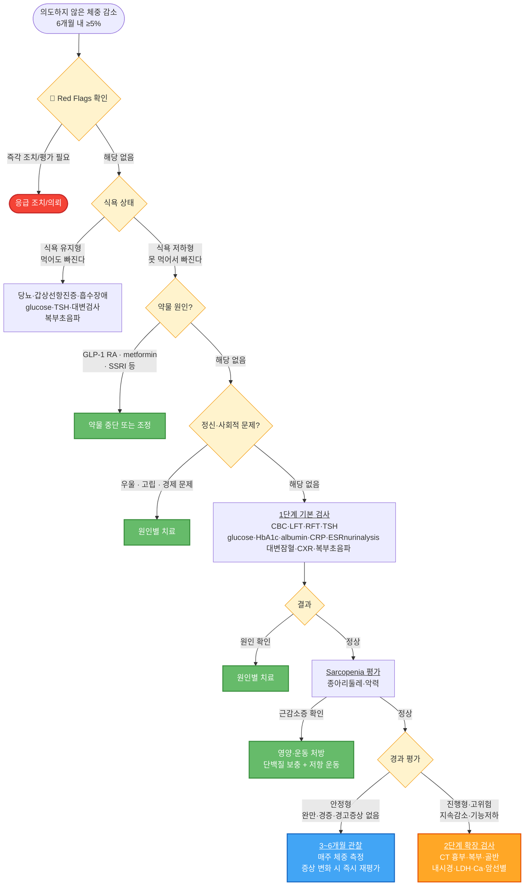

# 체중 감소 Weight loss

## <mark style="color:green;">일반 사항</mark>

* 일반적 체중 변화 : 40\~50대까지 증가, 이후 10년에 1\~2 ㎏씩 점차 감소
* 의도하지 않게 6(\~12)개월 내 평소 체중의 ≥5% 감소 시 유의미
  * 고령(≥65세)에서는 ≥5%/6개월 또는 ≥10%/12개월을 유의미한 기준으로 별도 적용하기도 함
* 고령에서의 의도하지 않은 체중 감소는 일상 생활 기능 저하, 중증 질환 증가, 고관절 골절 증가, 전체 사망률 증가와 관련됨

### <mark style="color:$danger;">🚩 Red Flags!</mark>

<mark style="color:$danger;">**즉각 응급 조치 및 이송**</mark>

* 심한 영양실조로 인한 의식 변화 또는 활력징후 불안정(저혈압, 빈맥)

<mark style="color:$warning;">**수 시간 내 긴급 평가 (응급실 방문)**</mark>

* 심한 탈수
* 단기간 내 급격한 쇠약, 급격한 체중 감소
* 조절되지 않는 정신질환(거식증 등)으로 인한 진행성 체중 감소

<mark style="color:$info;">**당일 \~ 수일 내 조기 평가 (외래 진료)**</mark>

* 단백질·에너지 영양실조
* 비의도적 체중 감소 (6개월 내 체중의 5% 이상)

## <mark style="color:green;">원인</mark>

* 암(연구에 따라 차이가 있으나 약 16\~30%) : 혈변, 연하곤란, 지속되는 기침, 혈뇨 등 동반
* 위장 장애 (약 15%) : 잘 맞지 않는 틀니, 충치, 삼킴 장애, 흡수 장애, 췌장 부전
* 심리적 문제 (약 15%) : 치매, 우울증, 편집증
* 내분비 장애 : 당뇨병, 갑상선기능항진증
* 만성 감염 : 결핵, HIV 등; 발열, 야간 발한, 림프절 비대 동반
* 심부전
* 약물 부작용 : 칼슘통로차단제, NSAID(장기 복용)
* 사회적 문제 : 알코올 사용 장애, 사회적 고립, 식사 접근성 저하(이동 불편·장보기 어려움), 경제적 문제(식비 부족), 돌봄 공백(caregiver 부재)
* 섭식 문제 : 식이 제한, 가난
* 비타민 결핍 증후군 : 신경 증상, 피부 병변, 구내염 등 동반
* 원인 미상 : 검사에도 불구하고 약 ¼에서는 원인을 찾을 수 없음

#### <mark style="color:$primary;">체중 감소와 관련된 부작용이 있는 약물들</mark>

* 미각/후각 변화 : allopurinol, 항생제, 항콜린제, 항히스타민제, ACEI, levodopa, CCB, propranolol, selegiline, spironolactone
* 식욕 저하 : 항생제, 항경련제, 항정신병약, benzodiazepine, digoxin, levodopa, metformin, neuroleptics, opiates, SSRIs, theophylline, GLP-1 수용체 작용제(예: semaglutide, liraglutide)
* 체중 감소 : SGLT-2 억제제 (당뇨 고령 환자에서 의도하지 않은 체중 감소를 악화시킬 수 있음)


**GLP-1 수용체 작용제(semaglutide, liraglutide 등) - 의인성 체중 감소 주의**

GLP-1 계열은 현재 의인성(iatrogenic) 체중 감소의 가장 흔한 원인 약물 중 하나입니다. 특히 고령·frailty·근감소증 동반 환자에서 식욕 억제 효과가 과도하게 나타날 수 있습니다. GLP-1 계열 복용 중 의도하지 않은 체중 감소가 발생하면 용량 감량 또는 중단을 적극 고려하십시오.


* 입마름 : 항콜린제, 항히스타민제, clonidine, loop diuretics
* 소화불량 : bisphosphonate, doxycycline, gold, iron, NSAID, potassium
* 구역/구토 : 항생제, bisphosphonate, digoxin, dopamine agonist, metformin, statins, SSRIs, TCA

## <mark style="color:green;">진단</mark>

* 체중 변화 경과, 약물 복용력, 신체검사
* 식욕 상태에 따른 감별
  * <mark style="color:red;">**식욕 유지형**</mark> (Hypermetabolic pattern, '먹어도 빠지는' 경우) : 당뇨병, 갑상선기능항진증, 흡수 장애 우선 고려 → 대변 검사(기생충, 지방변), 복부 초음파(췌장) 추가
  * <mark style="color:red;">**식욕 저하형**</mark> (Hypometabolic/Anorexic pattern, 식욕 부진) : 암, 우울증, 만성 염증, 약물 부작용, 장기부전(심부전·신부전) 우선 고려

#### <mark style="color:$primary;">1단계 검사</mark>

* 체중 변화 경과, 약물 복용력
* 신체검사(특히 치아 문제), 정서/인지 문제 평가(예: 우울증, 치매)
* 실험실 검사 : CBC, LFT, RFT, TSH, 혈당, HbA1c(신규 당뇨 또는 혈당 조절 실패 감별), albumin(negative acute-phase reactant; 영양 상태보다 염증·질병 부담을 반영하는 지표에 가까우므로 수치 단독으로 영양 상태를 판단하지 않도록 주의), CRP, ESR, urinalysis, 대변 잠혈, HIV, **Vitamin B12/Folate**(흡수장애·영양 불량 평가; 원인 목록 중 비타민 결핍 배제)
  * 고령(≥65세) 또는 진행형 경과 해당 시 1단계에 추가 고려 : **LDH, 혈청 칼슘(Ca)** — 림프종·다발성 골수종·암 골전이 조기 배제 목적
* 영상 검사 : 흉부 X선, 복부 초음파
  * 위내시경/UGI : 연하곤란, 철결핍빈혈, 상복부 통증·조기 포만감 등 증상이 있는 경우에 한해 시행 (일상적 1단계 검사로는 권장하지 않음)
* 1단계 검사에서 특이점이 없는 경우 → 아래 안정형 vs 진행형 기준으로 관찰 또는 확장 검사 결정

#### <mark style="color:$primary;">2단계 검사 - 진행형 또는 고위험 환자</mark>

**1단계 검사 정상 + 아래 기준 해당 시 확장 검사 진행**

| 구분                    | 기준                                 | 대응                                    |
| --------------------- | ---------------------------------- | ------------------------------------- |
| **안정형** (Stable)      | 완만한 감소, 전신 상태 양호, 경고 증상 없음         | 3–6개월 관찰; 매주 체중 측정 교육; 증상 변화 시 즉시 재평가 |
| **진행형** (Progressive) | 지속 감소, 기능 저하, 고령·frailty, 경고 증상 동반 | 아래 검사 진행                              |

* CT(흉부·복부·골반) : 임상적 의심이 있거나 1단계 검사에서 원인 불명인 경우에 한해 고려; 무증상 환자에 대한 전신 CT는 권장되지 않음 (근거 수준 제한적)
* LDH, 혈청 칼슘 : 림프종, 다발성 골수종, 암의 골전이 등을 시사하는 단서; 암 의심 또는 1단계 검사에서 원인 불명일 때 추가
* Prealbumin(transthyretin) : 반감기 2\~3일로 단기 영양 변화에 민감; albumin과 마찬가지로 **음성(negative) 급성기 반응 물질**로, 염증·급성 질환 시 수치가 저하되므로 영양 상태 단독 지표로 해석하면 오판 가능; 입원 환자 또는 영양 집중 모니터링이 필요한 경우 고려
* 흡수 장애 검사, 위/대장 내시경
* 암 선별 검사 : Pap-smear, mammography, PSA

※ 국가 암검진 수검 여부 확인 및 미수검 항목 시행 권고 : 의도하지 않은 체중 감소가 있는 경우 검진 주기와 무관하게 해당 암종 검사를 적극 시행; 증상 기반의 추가 검사(예: 대장내시경, 흉부 CT)는 선별검진과 별도로 임상적 판단에 따라 결정

#### <mark style="color:$primary;">암 의심 조기 의뢰 기준</mark>

(NICE 2023)

* 의도하지 않은 체중 감소가 다음 증상과 동반되는 경우 2주내 전문과 의뢰 고려

<table><thead><tr><th width="347.94732666015625">동반 증상</th><th>의심 암종</th></tr></thead><tbody><tr><td>연하 곤란</td><td>식도암, 위암</td></tr><tr><td>상복부 종괴, 조기 포만감, 오심 지속</td><td>위암</td></tr><tr><td>직장 출혈, 배변 습관 변화(6주 이상)</td><td>대장암</td></tr><tr><td>객혈, 3주 이상 지속 기침, 쉰 목소리</td><td>폐암</td></tr><tr><td>혈뇨(통증 없음)</td><td>신장암, 방광암</td></tr><tr><td>폐경 후 질 출혈</td><td>자궁내막암</td></tr><tr><td>유방 종괴, 피부 함몰</td><td>유방암</td></tr><tr><td>쇄골 위·겨드랑이 비통증성 림프절 비대</td><td>림프종, 전이암</td></tr><tr><td>신규 당뇨 또는 갑작스러운 혈당 조절 악화</td><td>췌장암</td></tr><tr><td>60세 이상에서 체중 감소 + 복통(특히 등 방사통 동반)</td><td>췌장암</td></tr></tbody></table>

※ 고령 환자에서 체중 감소와 함께 갑작스러운 혈당 조절 악화 또는 상복부·등 통증이 동반될 경우 췌장암을 적극 배제; 복부 CT 시행 고려

_<mark style="color:$info;">Ref. NICE. Suspected cancer: recognition and referral. NG12. 2023 update.</mark>_

#### <mark style="color:$primary;">고령 환자 문진 : 9 Ds + 사회적 고립</mark>

* 고령(≥65세)의 의도하지 않은 체중 감소에서 원인을 빠뜨리지 않기 위한 체크 도구

<table><thead><tr><th width="120.3157958984375">D</th><th width="130.94732666015625">항목</th><th>확인 내용</th></tr></thead><tbody><tr><td>Dentition</td><td>치아/구강 문제</td><td>틀니 불량, 충치, 구강 통증 → 섭취량 감소</td></tr><tr><td>Dysphagia</td><td>삼킴 장애</td><td>사레, 음식물 걸림, 연하 통증</td></tr><tr><td>Dysgeusia</td><td>미각/후각 변화</td><td>약물(ACEI, 항생제 등) 포함 원인 확인</td></tr><tr><td>Diarrhea</td><td>설사/흡수 장애</td><td>만성 설사, 지방변, 췌장 부전</td></tr><tr><td>Depression</td><td>우울증</td><td>식욕 저하, 무기력, 고립감</td></tr><tr><td>Disease</td><td>기저 질환</td><td>암, 심부전, 당뇨, 갑상선, 만성 감염 등</td></tr><tr><td>Dementia</td><td>인지 장애</td><td>식사 잊음, 식사 거부, 조리 불가</td></tr><tr><td>Dysfunction</td><td>기능 저하</td><td>ADL 저하 → 장보기·조리·식사 동작 불가</td></tr><tr><td>Drugs</td><td>약물</td><td>식욕 저하·미각 변화·소화 장애 유발 약물 (위 목록 참조)</td></tr></tbody></table>

**사회적 고립(Social Isolation)**

* 혼자 식사하는 환경('혼밥') 자체가 고령자 섭취량 감소의 독립적인 원인이 됨
* 9 Ds 항목 외에 식사 동반자 유무, 가족·지역사회 연결 여부 확인 필요

**고령 환자 영양·기능 평가 보조 도구**

* 종아리 둘레(Calf Circumference) : 31 ㎝ 미만이면 근감소증(sarcopenia) 의심; 측정이 간편하여 외래에서 선별 도구로 활용 가능
* 악력(Grip Strength) : 남성 <28 ㎏, 여성 <18 ㎏ 미만 시 근감소증 의심 (AWGS 2019 기준)
* 간이영양평가 단축형(MNA-SF) : 고령 환자 영양 상태 선별 도구 (총 14점); 12점 이상 정상, 8\~11점 영양불량 위험, 7점 이하 영양불량 → 자세한 평가 항목은 [아래](013_-weight-loss.md#mna-sf) 참조


**체중 감소 = 근육 감소 여부 확인이 핵심**

단순 체중 감소보다 **근감소증(sarcopenia) 동반 여부**가 예후 예측에 더 중요합니다. 체중 감소 + 근감소증이 함께 있으면 사망률이 유의미하게 증가하므로, 체중 측정과 함께 반드시 근육량 선별 평가를 병행하십시오.


**고령 환자 빠른 선별 (Quick Screen) - 5가지 질문**

 하나라도 '예'이면 해당 항목 집중 평가

* Eat? 식사량이 줄었나요?
* Chew? 씹거나 삼키기 불편한가요?
* Mood? 기분이 가라앉거나 의욕이 없나요?
* Meds? 식욕을 떨어뜨리는 약을 복용 중인가요?
* Move? 혼자 장보거나 식사를 준비할 수 있나요?

***



<p align="center"><strong>체중 감소 진단 및 치료 알고리듬</strong></p>

<p align="center"><em><mark style="color:$info;">저자 편집. Gaddey HL &#x26; Holder KK. Am Fam Physician 2021;104(1):34-40;</mark></em><br><em><mark style="color:$info;">NICE NG12. Suspected cancer: recognition and referral. 2023. 참조</mark></em></p>

***

## <mark style="background-color:$warning;">Management</mark>

### <mark style="color:orange;">치료 방침</mark>

* 기저 질환 치료, 식사를 저해할 수 있는 약물 사용 중단
* 식사 환경 개선 : 여유로운 식사, 즐거운 식사, 함께하는 식사
* 식단 수정 : 금기증이 없다면 향신료(예: 소금) 사용, 씹기 쉬운 음식, 환자 선호 음식
* 칼로리 보충 : 체중 감소 정도에 따라 200\~1,000 ㎉/d 또는 30\~40 ㎉/㎏/d의 영양식을 정상 식사를 방해하지 않도록 식후 또는 식사 2시간 이전에 제공 <mark style="color:blue;">\[뉴케어, 에너지바]</mark>
* exercise training : 저항 운동, 유산소 운동
* 약물 치료 고려


**Refeeding syndrome 예방**

* 장기간 굶거나 영양실조 상태였던 사람에게 갑자기 영양(특히 탄수화물)을 공급할 때, 체내 전해질(인, 칼륨, 마그네슘)이 급격히 감소하면서 심부전, 부정맥, 호흡부전 등 치명적인 대사 이상이 발생하는 증후군.
* 영양 보충 시작 전 고위험군을 반드시 확인해야 함
* **고위험 기준** : BMI <18.5 ㎏/㎡ / 최근 급격한 체중 감소 / 장기간 섭취 부족(>5일)
* **관리** : 영양 공급 시작 전 또는 동시에 **Thiamine(비타민 B1) 먼저 투여** — 포도당 투여 전 thiamine 선투여가 원칙 (결핍 시 Wernicke 뇌병증 위험); 이후 영양 공급을 천천히 시작(target의 25%부터 단계적 증량); 첫 72시간은 전해질(P, K, Mg) 집중 모니터링; 이상 시 즉시 입원 또는 전문과 의뢰


## <mark style="color:green;">약물 치료</mark>

**약물 투여 전제 조건**&#x20;

* 다음이 이행되지 않으면 약물 시작 금지 : 가역적 원인 교정(약물·치아·우울·사회적 문제) → 기본 검사 완료 → 심각한 기저 질환 평가 진행 중 또는 배제
* 약물을 단독 사용하는 것은 금함. 다음을 반드시 병행 - 단백질 보충 + 저항 운동 + 식사 환경 개선

#### <mark style="color:$primary;">A. 식욕 저하형 + 우울·불면 동반</mark>

**1차 선택 : mirtazapine** <mark style="color:blue;">\[레메론]</mark>

* 식욕 ↑, 체중 ↑, 수면 개선; 고령·불면 동반 환자에서 특히 유용
* 용량 : 7.5\~15 ㎎/d (식욕 목적) → 15\~30 ㎎/d (우울 치료)
* 역용량 효과 : 저용량(7.5\~15 ㎎)에서 H₁·α₁ 차단 효과가 우세하여 진정·식욕 촉진 효과가 더 강하게 나타남; 고용량으로 갈수록 노르아드레날린 활성이 증가하면서 진정 효과가 감소 → 식욕 촉진 목적으로만 사용할 때는 저용량 유지가 원칙
* 주의 : daytime sedation, 고령에서 delirium risk; 보험 주의 (우울증 동반 시 급여)

#### <mark style="color:$primary;">B. Cancer cachexia / 불응성 식욕부진</mark>

**선택 : megestrol acetate** <mark style="color:blue;">\[메게이스]</mark>

* 식욕 ↑, 체지방 ↑; 단, lean mass 증가 효과 제한적 → 저항 운동·단백질 보충 병행 필수
* 용량 : 160\~800 ㎎/d (유효 용량 400\~800 ㎎/d)
* 강력한 제한 조건 : 혈전 위험 ↑, fluid retention, adrenal suppression, mortality benefit 없음
* 사용 기준 : 암 환자 또는 불응성 식욕부진에 한정; frailty·고령 환자에서는 위험 > 이득
* 급여 : 암·AIDS 환자에 한함; 그 외 상병은 비급여
* 당뇨 환자 : 혈당 급격 상승 가능 → 혈당 모니터링 강화
* 장기 복용(≥3개월) : 쿠싱 증후군·약물 유발 부신부전 가능; 임의 중단 금지

#### <mark style="color:$primary;">C. 약물 유발 체중 감소 의심</mark>

* 원칙 : 약물 추가보다 약물 제거가 치료
* **GLP-1 agonist** : 용량 감량 또는 중단 우선
* **Metformin** : 용량 감량 고려
* **SSRI** : 다른 계열로 교체 고려 (mirtazapine 전환이 유리한 경우 많음)

#### <mark style="color:$primary;">D. 식욕 유지형 체중 감소</mark>

* 식욕촉진제 사용 금지 — 원인(당뇨·갑상선기능항진증·흡수장애 등) 치료가 우선
* 식욕촉진제를 투여해도 근본 원인이 교정되지 않으면 체중이 회복되지 않음

#### <mark style="color:$primary;">E. Frailty / 근감소증 중심</mark>

* 약물보다 단백질 보충 + 저항 운동이 핵심 - 식욕촉진제의 역할 거의 없음
* megestrol : frailty 고령 환자에서 위험 > 이득으로 권장하지 않음

#### <mark style="color:$primary;">2차 선택 (제한적)</mark>

* **Cyproheptadine** <mark style="color:blue;">\[트레스탄]</mark> (비보험) : 일부 환자에서 식욕 촉진 효과; 단, anticholinergic burden 주의 — Beers Criteria 해당 약물로 고령 환자에서 2선 이하 위치; confusion, 소변 저류 risk; 젊은 환자에서만 제한적 고려
* **Dronabinol** : 식욕 ↑ 가능; CNS 부작용·근거 제한으로 제한적
* **Steroid** : 단기 식욕 ↑; 근손실·고혈당 문제로 terminal setting에만 사용
* **오메가-3 (EPA)** : 암 관련 악액질에서 일부 근거; EPA 기준 1.5\~2 g/d, 최소 4\~8주; 체중 증가보다 삶의 질 개선 및 체중 감소 속도 완화에 의의를 둠

***

### <mark style="color:red;">질병코드</mark>

R63.4 이상체중감소

***

## <mark style="color:purple;">처방례</mark>

> **처방례 1.**
>
> ```
> 메게이스 10 ㎖(400 ㎎) 1P qd
> ※ 급여 적용: 암·AIDS 환자에 한함. 그 외 상병은 비급여
> ```
>
> **처방례 2.**
>
> ```
> 트레스탄 4㎎/T 1T bid 식전
> ```
>
> **처방례 3.** 우울증 동반 체중 감소
>
> ```
> 레메론 15 ㎎/T 1T hs (보험주의; 우울증 동반 시 급여)
> ```

***

### <mark style="color:$success;">핵심 복약 지도</mark>

> **식욕 촉진제 — megestrol (메게이스)**
>
> * 식욕 개선 효과는 복용 후 수 주에 걸쳐 나타납니다. 처음부터 효과를 기대하기보다 꾸준히 복용하십시오.
> * 체지방을 늘리는 효과는 있으나, 근육량 증가 효과는 제한적입니다. 가능하면 가벼운 근력 운동과 단백질 섭취를 함께 유지하십시오.
> * 혈전(혈액 응고) 위험이 있으므로, 다리가 붓거나 통증이 생기면 즉시 알려 주십시오.
> * 혈당을 높일 수 있습니다. 당뇨가 있으신 분은 혈당 모니터링을 더 자주 하십시오.
> * 장기 복용 시 쿠싱 증후군(얼굴이 둥그래지거나 살이 찌는 증상)이나 부신 기능 저하가 나타날 수 있습니다. 임의로 갑자기 중단하지 마시고 의사와 상담 후 서서히 줄이십시오.

> **식욕 촉진제 — cyproheptadine (트레스탄)**
>
> * 식사 직전에 복용하십시오. 항히스타민 계열 약물로, 식욕을 자극하는 효과가 있습니다.
> * 졸음이 올 수 있으므로 운전이나 기계 조작 시 주의하십시오.
> * **고령 환자의 경우** 입마름, 변비, 소변이 잘 나오지 않는 증상, 인지 저하가 생기면 즉시 알려 주십시오.
> * 비보험 약제입니다.

> **항우울제 — mirtazapine (레메론)**
>
> * 초기에 강한 졸음이 올 수 있으므로 취침 전 복용이 권장됩니다. 대개 1\~2주 후 적응됩니다.
> * 식욕 증가와 체중 증가 효과가 있으며, 이것이 처방 목적 중 하나입니다.
> * 갑자기 중단하면 어지럼·오심·불안이 생길 수 있습니다. 반드시 서서히 줄이십시오.
> * 효과는 2\~4주 후부터 나타납니다. 효과가 없다고 임의로 중단하지 마십시오.

> **언제 다시 병원을 방문해야 하나요?**
>
> * 6개월 이내 체중이 5% 이상 계속 줄어드는 경우
> * 혈변, 연하 곤란, 지속되는 기침, 혈뇨 등이 새로 생긴 경우
> * 약 복용 후에도 식욕이 전혀 개선되지 않는 경우

***

### <mark style="color:blue;">환자 안내서</mark>


**의도하지 않은 체중 감소는 몸의 중요한 신호입니다**

6개월 내 5% 이상의 체중 감소는 원인 평가가 필요합니다.


#### <mark style="color:$primary;">의도하지 않은 체중 감소란 무엇인가요?</mark>

* 식사를 줄이거나 운동을 늘리지 않았는데도 체중이 줄어드는 현상입니다
* 6개월 이내에 평소 체중의 5% 이상(예: 60 kg인 분이 3 kg 이상) 감소하면 임상적으로 의미 있는 체중 감소로 간주합니다
* 원인은 갑상선 기능 항진증, 당뇨병, 소화기 질환, 우울증, 악성 종양 등 다양합니다

#### <mark style="color:$primary;">체중 유지를 위해 이렇게 하세요</mark>

* **규칙적인 식사** : 하루 3끼를 거르지 마십시오. 소화 기능이 떨어진 경우 소량씩 자주 드십시오
* **고단백 식사** : 살코기, 생선, 달걀, 두부, 콩류를 충분히 드십시오. 근육량 유지에 도움이 됩니다
* **칼로리 밀도 높이기** : 적은 양으로도 칼로리를 보충하려면 기호에 따라 견과류, 치즈, 올리브유 등을 식단에 추가하십시오. 부피가 작아 부담 없이 드실 수 있습니다
* **식사 기록** : 매일 먹은 음식과 양을 기록하면 진료에 도움이 됩니다
* **체중 측정** : 매주 **같은 시간(아침 공복, 소변 후), 같은 옷차림으로** 체중을 측정하여 변화를 추적하십시오
* **식욕 저하 원인 관리** : 우울, 불안, 통증, 구강 문제가 식욕을 떨어뜨리는 경우가 많습니다. 해당 증상이 있으면 의사에게 알려 주십시오

#### <mark style="color:$primary;">이럴 때는 즉시 병원을 방문하세요</mark>

* 6개월 내 체중이 5% 이상 감소하고 원인을 모르는 경우
* 혈변, 검은 변, 연하 곤란(삼키기 힘듦), 지속되는 기침이 새로 생긴 경우
* 심한 피로, 황달(피부·눈이 노래짐), 복부 덩어리가 만져지는 경우
* 체중 감소와 함께 극심한 갈증·다뇨·야뇨가 동반되는 경우 (당뇨 의심)

***

### <mark style="color:green;">간이영양평가 단축형 (MNA-SF)</mark>

고령 환자(≥65세)의 영양 상태를 신속하게 선별하기 위한 도구입니다. 지난 3개월간의 변화를 기준으로 점수를 합산합니다.

<table><thead><tr><th width="60">항목</th><th width="276">질문</th><th>점수 기준</th></tr></thead><tbody><tr><td><strong>A</strong></td><td>식사량 감소<br><em>지난 3개월간 식욕부진, 소화기 문제, 씹기/삼키기 곤란 등으로 식사량이 줄었습니까?</em></td><td>0 : 심한 식사량 감소<br>1 : 중등도의 식사량 감소<br>2 : 식사량 감소 없음</td></tr><tr><td><strong>B</strong></td><td>체중 감소<br><em>지난 3개월간 의도하지 않은 체중 감소가 있었습니까?</em></td><td>0 : 3 ㎏ 초과 감소<br>1 : 감소 여부 모름<br>2 : 1~3 ㎏ 감소<br>3 : 체중 감소 없음</td></tr><tr><td><strong>C</strong></td><td>이동성 (Mobility)</td><td>0 : 침대나 의자에 누워/앉아 지냄<br>1 : 일어설 수 있으나 외출은 못 함<br>2 : 자유롭게 외출 가능</td></tr><tr><td><strong>D</strong></td><td>정신적 스트레스<br><em>지난 3개월간 급성 질환이나 심리적 스트레스를 겪었습니까?</em></td><td>0 : 예<br>2 : 아니오</td></tr><tr><td><strong>E</strong></td><td>신경정신적 문제</td><td>0 : 심한 치매 또는 우울증<br>1 : 경증의 치매<br>2 : 심리적 문제 없음</td></tr><tr><td><strong>F1</strong></td><td>체질량지수 (BMI, ㎏/㎡)<br><em>BMI 측정이 가능한 경우</em></td><td>0 : BMI 19 미만<br>1 : 19 이상 ~ 21 미만<br>2 : 21 이상 ~ 23 미만<br>3 : 23 이상</td></tr><tr><td><strong>F2*</strong></td><td>종아리 둘레 (CC)</td><td>0 : 31 ㎝ 미만<br>3 : 31 ㎝ 이상</td></tr></tbody></table>

_\*BMI 측정이 불가능한 경우 F1 대신 사용_


**판정 기준 (총점 14점)**

* **12\~14점** : 정상 영양 상태 (Normal nutritional status)
* **8\~11점** : 영양 불량 위험 (At risk of malnutrition) → 영양 상담 및 식이 개선 권고
* **0\~7점** : 영양 불량 (Malnourished) → 영양사 의뢰 및 적극적 영양 보충 개입

