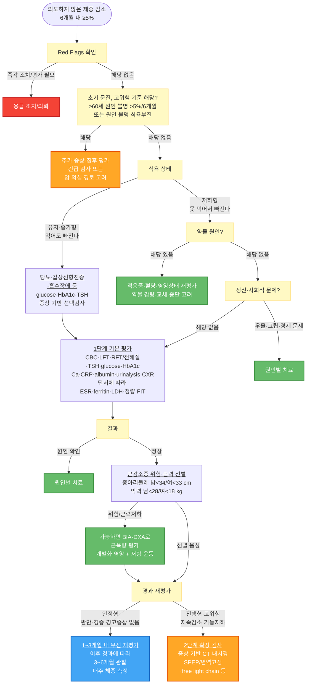

# 체중 감소 Weight loss

## <mark style="color:green;">일반 사항</mark>

* 유의미한 체중 감소 : 의도하지 않은 6(\~12)개월 내 평소 체중의 5% 이상 감소
* 고령(≥65세)에서는 6개월  동안 ≥5% 또는 12개월  동안 ≥10%을 유의미한 기준으로 별도 적용하기도 함
* 고령에서의 의도하지 않은 체중 감소는 일상 생활 기능 저하, 중증 질환 증가, 고관절 골절 증가, 전체 사망률 증가와 관련됨
* 연령 증가에 따른 평균 체중 변화가 있더라도, 임상적으로 의미 있는 비의도적 체중 감소를 정상 노화로 단정하지 않음

## <mark style="color:green;">원인</mark>

* 암(고령 환자 연구에서 약 16\~30%) : 혈변, 연하곤란, 지속되는 기침, 혈뇨 등 동반
* 위장·구강 장애(고령 환자 연구에서 약 15%) : 잘 맞지 않는 틀니, 충치, 삼킴 장애, 흡수 장애, 췌장 부전
* 심리·인지 문제(고령 환자 연구에서 약 15%) : 우울증, 치매, 편집증, 섭식장애
* 내분비 장애 : 당뇨병, 갑상선기능항진증
* 만성 감염 : 결핵, HIV 등; 발열, 야간 발한, 림프절 비대 동반
* 만성 장기질환 : 심부전, 만성폐쇄성폐질환, 만성콩팥병, 만성 간질환 등
* 약물 부작용 : metformin, GLP-1 수용체 작용제, digoxin, SSRIs, opioids, 일부 항경련제 등(식욕 저하·오심·미각 변화 등 기전)
* 사회적 문제 : 알코올 사용 장애, 사회적 고립, 식사 접근성 저하(이동 불편·장보기 어려움), 경제적 문제(식비 부족), 돌봄 공백(caregiver 부재)
* 섭식·영양 문제 : 과도한 식이 제한, 음식 불안정성(food insecurity), 섭식장애
* 원인 미상 : 고령 환자 연구에서는 검사에도 불구하고 약 25%에서 원인을 찾지 못함

#### <mark style="color:$primary;">체중 감소와 관련된 부작용이 있는 약물들</mark>

* 미각/후각 변화 : allopurinol, 항생제, 항콜린제, 항히스타민제, ACEI, levodopa, CCB, propranolol, selegiline, spironolactone
* 식욕 저하 : 항생제, 일부 항경련제, 일부 항정신병약, benzodiazepine, digoxin, levodopa, metformin, opioids, SSRIs, theophylline, GLP-1 수용체 작용제(예: semaglutide, liraglutide)
* 체중 감소 : SGLT-2 억제제 (당뇨 고령 환자에서 의도하지 않은 체중 감소를 악화시킬 수 있음)
* 입마름 : 항콜린제, 항히스타민제, clonidine, loop diuretics
* 소화불량 : bisphosphonate, doxycycline, gold, iron, NSAID, potassium
* 구역/구토 : 항생제, bisphosphonate, digoxin, dopamine agonist, metformin, statins, SSRIs, TCA


**GLP-1 수용체 작용제(semaglutide, liraglutide 등) - 의인성 체중 감소 주의** : GLP-1 계열은 의인성(iatrogenic) 체중 감소의 중요한 원인 약물임. 특히 고령·frailty·근감소증 동반 환자에서는 식욕 억제와 체중 감소가 과도해질 수 있음. GLP-1 계열 복용 중 의도하지 않은 과도한 체중 감소, 근감소증 또는 frailty가 발생하면 치료 적응증, 혈당 조절 상태, 심혈관·신장 이득과 영양 상태를 함께 재평가하여 용량 감량 또는 중단을 고려


### <mark style="color:$danger;">🚩 Red Flags!</mark>

<mark style="color:$danger;">**즉각 응급 조치 및 이송, 필요시 119 호출**</mark>

* 심한 영양실조와 의식 변화·실신 또는 활력징후 불안정(저혈압, 심한 서맥/빈맥, 저체온)
* 중증 저혈당, 중증 K·P·Mg 이상, 부정맥 또는 심부전·호흡부전
* 심한 탈수 또는 음식·수분을 거의 섭취할 수 없는 상태&#x20;
* 섭식장애 등 정신질환에 의한 진행성 체중 감소와 의학적 불안정, 자살 위험 또는 급성 정신과적 위험

<mark style="color:$warning;">**당일\~수일 내 평가**</mark>

* 단기간 내 급격한 쇠약·체중 감소와 기능 저하 또는 대사 이상

<mark style="color:$info;">**외래 추적 관찰**</mark>

* 단백질·에너지 영양실조

## <mark style="color:green;">진단</mark>

* 과거 진료 기록의 실측 체중과 현재 체중을 비교하여 감소량·기간·감소율을 확인하고 BMI를 함께 평가
* 부종 감소, 이뇨제 시작, 심부전 치료 등 체액 변화에 따른 겉보기 체중 감소를 감별
* 식사·활동 변화, 약물 복용력, 전신 증상 및 신체검사
* 식욕 상태에 따른 감별
  * 식욕 저하형(식욕 부진) : 암, 우울증, 만성 염증, 약물 부작용, 장기부전(심부전·신부전) 등을 우선 고려
  * 식욕 유지 또는 증가형('먹어도 빠지는' 경우) : 당뇨병, 갑상선기능항진증, 흡수 장애, 만성 감염, 일부 악성 종양 등을 우선 고려
    * 만성 설사·지방변·여행/노출력·췌장질환 위험 인자 등 임상 단서가 있을 때 대변 검사(지방변·기생충 등), 췌장 평가 등을 선택적으로 시행

#### <mark style="color:$primary;">영양불량과 악액질 평가</mark>

* MNA-SF 등은 영양 위험을 찾는 선별 도구이며, 양성이면 섭취량·신체계측·근육량·기능·질병 부담을 포함한 종합 영양 평가를 시행
* GLIM 기준에서는 선별 후 표현형 기준(비의도적 체중 감소, 낮은 BMI, 감소한 근육량) 1개 이상과 원인 기준(섭취/흡수 감소, 염증 또는 질병 부담) 1개 이상을 함께 충족할 때 영양불량으로 진단
* 악액질(cachexia)은 기저 질환에 의한 염증·대사 이상을 동반하여 통상적인 영양 공급만으로 완전히 회복되지 않을 수 있는 증후군으로, 단순 기아·영양불량과 구분

#### <mark style="color:$primary;">1단계 검사</mark>

* 체중 변화 경과·섭취량·약물 복용력과 체액 상태 확인
* 신체검사(구강·치아, 갑상선, 림프절, 심폐, 복부, 피부·신경계 등), 정서/인지·알코올·섭식장애·사회적 문제 평가
* 일반적으로 고려할 검사 : CBC, LFT, RFT 및 전해질, TSH, 혈당, HbA1c(신규 당뇨 또는 혈당 조절 실패 감별), 혈청 칼슘(Ca), CRP, albumin, urinalysis
  * albumin은 영양불량의 단독 진단 지표가 아님. negative acute-phase reactant로 염증·감염·장기질환 등에 의해 감소할 수 있으므로, 낮은 수치만으로 영양불량 또는 그 중증도를 판단하지 않음
  * ESR, ferritin, LDH는 빈혈·염증성 질환·혈액질환·악성종양 등을 시사하는 임상 단서나 기본검사 이상이 있을 때 추가하고 결과를 비특이적 보조 소견으로 해석
  * HIV, Vitamin B12/Folate 등은 위험 인자·식이력·흡수장애·혈구 이상 등 임상 단서가 있을 때 선택적으로 시행
  * 빈혈, 고칼슘혈증, 신기능 저하, 골통, globulin gap, 현저한 ESR 상승 등 단클론감마병증/다발성 골수종이 의심되면 SPEP ± serum immunofixation, serum free light chain을 고려
  * 대장암 평가가 필요한 경우 일반적인 정성 대변잠혈검사보다 정량적 FIT를 사용하고 연령·철결핍빈혈·복통·직장출혈·배변 습관 변화 및 국내 진료 기준에 따라 해석
* 영상 검사 : 흉부 X선
  * 복부 초음파 : 증상·진찰 소견 또는 복부 질환 의심 시 고려
  * 위내시경, UGI : 연하곤란, 철결핍빈혈, 상복부 통증·조기 포만감 등 증상이 있는 경우에 한해 시행&#x20;
    * 일상적 1단계 검사로는 권장하지 않음
  * 호흡곤란, orthopnea, 부종, 경정맥압 상승, 심질환 병력 등 심부전 의심 소견이 있으면 ECG, BNP/NT-proBNP ± echocardiography를 선택적으로 시행
* 1단계 검사에서 특이점이 없는 경우 → 아래 안정형 vs 진행형 기준으로 관찰 또는 확장 검사 결정

#### <mark style="color:$primary;">2단계 검사 - 진행형 또는 고위험 환자</mark>

* 1단계 검사 정상 + 아래 기준 해당 시 확장 검사 진행

<table><thead><tr><th width="197">구분</th><th>기준</th><th>대응</th></tr></thead><tbody><tr><td>안정형 (Stable)</td><td>완만한 감소, 전신 상태 양호, 경고 증상·원인 불명 식욕부진 또는 NICE 고위험군 해당 없음</td><td>1–3개월 내 우선 재평가하고 이후 경과에 따라 3–6개월까지 관찰; 매주 체중 측정 교육; 증상 변화 시 즉시 재평가</td></tr><tr><td>진행형/고위험 (Progressive/High risk)</td><td>지속 감소, 기능 저하, 고령·frailty, 경고 증상 또는 고위험 동반</td><td>긴급도에 따라 조기 평가 및 아래 검사 진행</td></tr></tbody></table>

* CT(흉부·복부·골반) : 진행성 체중 감소, 기능 저하, 이상 진찰/검사 소견 또는 특정 질환의 임상적 의심이 있을 때 고려
  * 아무 단서가 없는 안정형 환자에서 전신 CT를 일률적으로 시행하지 않음
* LDH, 혈청 칼슘 : 림프종, 골수종, 전이암 등을 시사할 수 있는 보조 단서이며 정상이라고 해당 질환을 배제할 수 없음
* 단클론감마병증/다발성 골수종 의심 시 : SPEP ± serum immunofixation, serum free light chain
  * 필요 시 urine electrophoresis/immunofixation 추가
* prealbumin(transthyretin) : albumin과 마찬가지로 염증의 영향을 크게 받으므로 영양불량의 진단·중증도 판정 또는 영양중재 반응 모니터링을 위한 표준 지표로 권장하지 않음
  * 측정했다면 질병·염증 상태와 함께 제한적으로 해석
* 흡수 장애 검사, 위/대장 내시경 : 증상·징후 및 위험 인자에 따라 선택
* 암 평가 : 연령·성별·위험도에 맞는 정기 암 선별검사 시행 여부를 확인


**NICE CG32 고위험군**

* 다음 중 **1개 이상** : ① BMI ＜16 ㎏/㎡, ② 최근 3\~6개월간 비의도적 체중 감소 ＞15%, ③ 10일 이상 거의 또는 전혀 섭취하지 못함, ④ 급식 전 K·P·Mg 저하
* 또는 다음 중 **2개 이상** : ① BMI ＜18.5 ㎏/㎡, ② 최근 3\~6개월간 비의도적 체중 감소 ＞10%, ③ 5일 이상 거의 또는 전혀 섭취하지 못함, ④ 알코올 사용 장애 또는 insulin·chemotherapy·antacid·diuretic 등 위험 약물 사용



체중 감소와 특정 암을 시사하는 증상·징후가 있는 경우에는 정기 선별검사 주기와 별개로 진단 목적의 영상검사·내시경 등을 시행. 비의도적 체중 감소 자체만을 이유로 Pap-smear, mammography, PSA 등의 선별검사를 검진 주기와 무관하게 반복 시행하는 것은 권장하지 않음


#### <mark style="color:$primary;">암 의심 조기 평가 기준</mark>

* 60세 이상에서 원인 불명 체중 감소가 있으면 대장암·위식도암·폐암·전립선암·췌장암·비뇨기암 등을 시사하는 증상으로 간주하여 동반 증상·징후 및 1차 검사 결과에 따라 urgent investigation, suspected cancer pathway 또는 non-specific symptoms pathway를 고려 \[NICE NG12 1.13.2, 2026 amended]
* 원인 불명 식욕부진은 연령 제한 없이 폐암, 식도암, 위암, 대장암, 췌장암, 방광암, 신장암 등 여러 암종의 비특이적 시사 증상으로 평가 \[NICE NG12 1.13.3, 2026 amended]
* 다음과 같은 site-specific 증상·징후가 동반되면 해당 암종에 대한 진단적 평가를 우선

<table data-search="false"><thead><tr><th>동반 증상·징후</th><th>우선 고려할 암종/평가</th></tr></thead><tbody><tr><td>연하 곤란</td><td>식도암, 위암</td></tr><tr><td>상복부 종괴, 조기 포만감, 지속되는 오심</td><td>위암·췌장암 등 상부 위장관/췌담도 질환 평가</td></tr><tr><td>직장 출혈, 지속되는 배변 습관 변화</td><td>대장암</td></tr><tr><td>객혈, 지속되는 기침, 쉰 목소리</td><td>폐암</td></tr><tr><td>육안적 또는 원인 불명 혈뇨</td><td>신장암, 방광암</td></tr><tr><td>폐경 후 질 출혈</td><td>자궁내막암</td></tr><tr><td>유방 종괴, 피부 함몰 등 유방 이상</td><td>유방암</td></tr><tr><td>지속되는 비통증성 림프절 비대</td><td>림프종, 전이암</td></tr><tr><td>고령에서 신규 당뇨 또는 갑작스러운 혈당 조절 악화와 체중 감소</td><td>췌장암을 포함한 원인 평가; 임상적으로 의심되면 복부 CT 등 고려</td></tr><tr><td>60세 이상에서 체중 감소 + 복통 또는 등 통증</td><td>췌장암 등 췌담도 질환에 대한 urgent imaging 고려</td></tr></tbody></table>

<p align="center"><em><mark style="color:$info;">Ref. NICE. Suspected cancer: recognition and referral. NG12. Updated 15 April 2026.</mark></em></p>

#### <mark style="color:$primary;">고령 환자 문진 : 9 Ds + 사회적 고립</mark>

* 고령(≥65세)의 의도하지 않은 체중 감소에서 원인을 빠뜨리지 않기 위한 체크 도구

<table data-search="false"><thead><tr><th width="120.3157958984375">D</th><th width="130.94732666015625">항목</th><th>확인 내용</th></tr></thead><tbody><tr><td>Dentition</td><td>치아/구강 문제</td><td>틀니 불량, 충치, 구강 통증 → 섭취량 감소</td></tr><tr><td>Dysphagia</td><td>삼킴 장애</td><td>사레, 음식물 걸림, 연하 통증</td></tr><tr><td>Dysgeusia</td><td>미각/후각 변화</td><td>약물(ACEI, 항생제 등) 포함 원인 확인</td></tr><tr><td>Diarrhea</td><td>설사/흡수 장애</td><td>만성 설사, 지방변, 췌장 부전</td></tr><tr><td>Depression</td><td>우울증</td><td>식욕 저하, 무기력, 고립감</td></tr><tr><td>Disease</td><td>기저 질환</td><td>암, 심부전, 당뇨, 갑상선, 만성 감염 등</td></tr><tr><td>Dementia</td><td>인지 장애</td><td>식사 잊음, 식사 거부, 조리 불가</td></tr><tr><td>Dysfunction</td><td>기능 저하</td><td>ADL 저하 → 장보기·조리·식사 동작 불가</td></tr><tr><td>Drugs</td><td>약물</td><td>식욕 저하·미각 변화·소화 장애 유발 약물 (위 목록 참조)</td></tr></tbody></table>

**사회적 고립**

* 고령자의 혼자 식사하는 환경은 섭취량 감소 및 영양불량과 연관될 수 있음
* 9 Ds 항목 외에 식사 동반자 유무, 가족·지역사회 연결 여부 확인 필요

<mark style="color:cyan;">**고령 환자 영양·기능 평가 보조 도구**</mark>

* 종아리 둘레 : 남성 ＜34 ㎝, 여성 ＜33 ㎝이면 근감소증 위험 선별 양성; 외래에서 case-finding에 활용 가능
* 악력(Grip Strength) : ≥65세에서 남성 ＜28 ㎏, 여성 ＜18 ㎏이면 낮은 근력으로 평가
* 선별 양성 또는 낮은 근력이 확인되면 가능한 경우 BIA·DXA 등으로 근육량을 평가
  * 종아리 둘레는 위험 선별, 악력은 근력 평가이며 어느 하나만으로 근감소증을 확진하지 않음
  * AWGS 2025에서는 낮은 근육량과 낮은 근력이 함께 있을 때 근감소증으로 진단
* [간이영양평가 단축형](013_-weight-loss.md#mna-sf)(MNA-SF) : 고령 환자 영양 상태 선별 도구 (총 14점); 12점 이상 정상, 8\~11점 영양불량 위험, 7점 이하 영양불량


**체중 감소에서는 근감소증 동반 평가가 중요** : 체중 감소에 근감소증(sarcopenia)이 동반되면 불량한 예후와 연관될 수 있음. 체중 측정과 함께 종아리 둘레·악력으로 위험과 근력을 선별하고, 양성이면 BIA·DXA 등 근육량 평가를 고려


<mark style="color:cyan;">**고령 환자 빠른 선별 (Quick Screen) - 5가지 질문**</mark>

* 하나라도 '예'이면 해당 항목 집중 평가
  * Eat? 식사량이 줄었나요?
  * Chew? 씹거나 삼키기 불편한가요?
  * Mood? 기분이 가라앉거나 의욕이 없나요?
  * Meds? 식욕을 떨어뜨리는 약을 복용 중인가요?
  * Move? 혼자 장보거나 식사를 준비할 수 있나요?

***


```mermaid
graph TD
    A([의도하지 않은 체중 감소<br/>6개월 내 ≥5%]) --> B[Red Flags 확인]
    B -->|즉각 조치/평가 필요| C[응급 조치/의뢰]
    B -->|해당 없음| W["초기 문진, 고위험 기준 해당?<br/>≥60세 원인 불명 >5%/6개월<br/>또는 원인 불명 식욕부진"]
    W -->|해당| X["추가 증상·징후 평가<br/>긴급 검사 또는 <br/>암 의심 경로 고려"]
    W -->|해당 없음| E[식욕 상태]
    E -->|유지·증가형<br/>먹어도 빠진다| F["<u>당뇨·갑상선항진증<br/>·흡수장애 등</u><br/>glucose·HbA1c·TSH<br/>증상 기반 선택검사"]
    F --> K
    E -->|저하형<br/>못 먹어서 빠진다| G[약물 원인?]
    G -->|해당 있음| H["적응증·혈당·영양상태 재평가<br/>약물 감량·교체·중단 고려"]
    G -->|해당 없음| I[정신·사회적 문제?]
    I -->|우울·고립·경제 문제| J[원인별 치료]
    I -->|해당 없음| K["<u>1단계 기본 평가</u><br/>CBC·LFT·RFT/전해질·TSH·glucose·HbA1c<br/>Ca·CRP·albumin·urinalysis·CXR<br/>단서에 따라 <br/>ESR·ferritin·LDH·정량 FIT"]
    K --> L[결과]
    L -->|원인 확인| M[원인별 치료]
    L -->|정상| N["<u>근감소증 위험·근력 선별</u><br/>종아리둘레 남&lt;34/여&lt;33 cm<br/>악력 남&lt;28/여&lt;18 kg"]
    N -->|위험/근력저하| R["가능하면 BIA·DXA로 <br/>근육량 평가<br/>개별화 영양 + 저항 운동"]
    R --> O[경과 재평가]
    N -->|선별 음성| O
    O -->|안정형<br/>완만·경증·경고증상 없음| P["<u>1~3개월 내 우선 재평가</u><br/>이후 경과에 따라 <br/>3~6개월 관찰<br/>매주 체중 측정"]
    O -->|진행형·고위험<br/>지속감소·기능저하| Q["<u>2단계 확장 검사</u><br/>증상 기반 CT·내시경<br/>SPEP/면역고정<br/>·free light chain 등"]
classDef green fill:#66bb6a,stroke:#388e3c,color:#fff,stroke-width:2px
class H,J,M,R green
    style C fill:#f44336,stroke:#c62828,color:#fff,stroke-width:2px
    style X fill:#ffa726,stroke:#e65100,color:#fff,stroke-width:2px
    style P fill:#42a5f5,stroke:#1565c0,color:#fff,stroke-width:2px
    style Q fill:#ffa726,stroke:#e65100,color:#fff,stroke-width:2px
classDef yellow fill:#fff9c4,stroke:#ffe082
class B,W,E,G,I,L,O yellow
```

<p align="center"><strong>체중 감소 진단 및 치료 알고리듬</strong></p>

<p align="center"><em><mark style="color:$info;">저자 재작성 (참고 문헌 : Gaddey HL &#x26; Holder KK. Am Fam Physician 2021;104(1):34-40;</mark></em><br><em><mark style="color:$info;">NICE NG12. Suspected cancer: recognition and referral. Updated 15 April 2026. 등)</mark></em></p>

***

## <mark style="background-color:$warning;">Management</mark>

### <mark style="color:orange;">치료 방침</mark>

* 기저 질환 치료
  * 식사를 저해할 수 있는 약물의 적응증과 시간적 연관성을 재평가하여 필요 시 안전하게 감량·교체·중단
* 식사 환경 개선 : 여유로운 식사, 즐거운 식사, 함께하는 식사
* 식단 수정 : 허브·향신료·산미 등을 활용하고 씹기 쉬운 음식과 환자 선호 음식을 제공
  * 고혈압·심부전·콩팥병 등 나트륨 제한이 필요한 환자에서는 소금 증량을 피함
* 총 열량 목표 : 일반적으로 25\~35 ㎉/㎏/d 범위에서 연령·질환·활동량·비만도·재급식 위험에 따라 개별화
* 경구영양보충식 : 기존 섭취량과 부족분을 계산하여 정상 식사를 방해하지 않도록 식간 또는 식후에 제공 <mark style="color:blue;">\[뉴케어, 에너지바]</mark>
* exercise training : 저항 운동, 유산소 운동
* 약물 치료 고려


**Refeeding syndrome 예방**

* 장기간 굶거나 영양실조 상태였던 환자에게 영양(특히 탄수화물)을 빠르게 공급하면 인(P), 칼륨(K), 마그네슘(Mg)이 급격히 감소하면서 심부전, 부정맥, 호흡부전, 신경학적 이상 등 치명적인 대사 이상이 발생할 수 있음
* 영양 보충 시작 전 NICE 고위험군 여부 확인
* 관리(NICE 기준) : 영양 또는 dextrose-containing fluid 시작 직전부터 초기 10일간 thiamine 200\~300 ㎎/d와 균형 잡힌 비타민 보충을 시행. 고위험군은 최대 10 ㎉/㎏/d로 시작하여 4\~7일에 걸쳐 서서히 증량; 극단적 고위험군(예: BMI ＜14 또는 15일 이상 거의 무섭취)은 5 ㎉/㎏/d부터 시작하고 심전도 모니터링 고려
* K·P·Mg를 초기부터 면밀히 모니터링하고 필요 시 보충. NICE 예상 요구량은 K 2\~4 mmol/㎏/d, phosphate 0.3\~0.6 mmol/㎏/d, Mg 0.2 mmol/㎏/d IV 또는 0.4 mmol/㎏/d PO이며, 실제 투여량은 혈중 농도·신기능·투여 경로와 임상 상태에 따라 조정
* 초기 수일간 체액 균형, 활력징후, 전해질 및 임상 증상을 면밀히 추적하고 중증 전해질 이상·부정맥·심부전·신경학적 이상이 있으면 입원 또는 전문과 협진


## <mark style="color:green;">약물 치료</mark>

<mark style="color:cyan;">**약물 투여 전제 조건**</mark>

* 일반적인 원인 불명 체중 감소에서는 가역적 원인 교정과 원인 평가가 우선이며, 식욕촉진제가 평가를 대신하지 않음
* 고령자의 원인 불명 비의도적 체중 감소 자체를 적응증으로 처방 식욕촉진제를 일상적으로 사용하지 않음
* 진행암·완화의료에서는 원인 평가와 동시에 증상 완화 목적의 약물을 고려할 수 있음
* 영양·운동·식사 환경 중재는 환자의 기능, 기저 질환과 치료 목표에 따라 가능한 범위에서 병행

#### <mark style="color:$primary;">A. 식욕 저하 + 우울증 치료가 필요한 경우</mark>

<mark style="color:cyan;">**Mirtazapine**</mark>

* 우울증 치료 적응증이 있으면서 식욕 저하·체중 감소 또는 불면이 동반된 환자에서 고려할 수 있음
* 용량 : 일반적으로 15 ㎎ hs에서 시작하여 임상 반응과 내약성에 따라 우울증 치료 용량으로 조정 <mark style="color:blue;">\[레메론]</mark>
  * 고령·frailty 환자는 더 낮은 시작 용량을 고려할 수 있음
* 저용량에서 진정 효과가 상대적으로 두드러질 수 있다고 알려져 있음
  * 용량 증가에 따라 진정·식욕 촉진 효과가 일관되게 감소한다는 역용량 효과는 확립된 원칙이 아님
* 주의 : daytime sedation, 어지럼, 낙상, 고령에서 혼돈 위험
  * 단순 식욕촉진 목적으로 routine 사용하지 않음
* 국내 급여/허가 : 우울증 치료 적응증에 따라 사용하며, 단순 식욕촉진 목적 사용은 적응증 외 사용이 될 수 있으므로 최신 허가·급여 기준 확인

#### <mark style="color:$primary;">B. 암성 악액질 / 불응성 식욕부진</mark>

* 암성 악액질(cancer cachexia)은 염증·대사 이상을 동반하여 영양 공급만으로 완전히 회복되지 않을 수 있으므로, 단순 영양불량과 구분하여 다학제적으로 관리

<mark style="color:cyan;">**Low-dose olanzapine**</mark>

* 진행암 환자의 식욕 및 체중 개선을 위해 저용량(2.5 ㎎/d) olanzapine 1일 1회를 고려할 수 있음 <mark style="color:blue;">\[자이프렉사]</mark>
  * 진정·대사 이상·고혈당·기립성 저혈압 등 부작용을 고려하여 용량개별화
* 처방 시 암성 악액질·식욕부진 목적 사용이 허가 외 사용임을 설명 (최신 허가·급여 기준 확인)
* olanzapine을 사용하지 않거나 내약성이 없는 경우 progesterone analog(megestrol acetate 등) 또는 corticosteroid의 단기 사용을 고려할 수 있음

<mark style="color:cyan;">**Megestrol acetate**</mark>

* 효과 : 식욕 ↑, 체지방 ↑
  * lean mass 증가 효과는 제한적. 생존 개선 효과는 입증되지 않음
* 용량 : 160\~800 ㎎/d (흔히 400\~800 ㎎/d 범위에서 사용) <mark style="color:blue;">\[메게이스]</mark>
* 사용 기준 : 진행암·AIDS 등 제한된 적응증에서 증상 완화를 목적으로 사용하고 치료 목표·평가 시점·중단 기준을 사전에 설정
* [급여기준](https://www.hira.or.kr/rc/insu/insuadtcrtr/InsuAdtCrtrPopup.do?mtgHmeDd=20130901\&sno=1\&mtgMtrRegSno=0373) : 재발성·전이성 암 환자 대상으로 식욕부진, 악액질, 체중감소에 대하여 인정
* 고령자의 일반적인 체중 감소·frailty에는 사용하지 않음 : 체중 증가 효과는 제한적인 반면 혈전색전증·체액저류 및 사망 위험이 증가할 수 있어 AGS Beers Criteria에서 회피 권고
* 당뇨 환자 : 고혈당 악화 가능 → 혈당 모니터링 강화
* 장기 복용 시 쿠싱 증후군·약물 유발 부신부전 가능; 장기 사용 후 임의로 갑자기 중단하지 않음

#### <mark style="color:$primary;">C. 약물 유발 체중 감소 의심</mark>

* 원칙 : 약물 추가가 아닌 약물 제거
* 복용 중인 약물 전체에 대하여 재검토

<mark style="color:cyan;">**원인 약물과 대처 방법**</mark>

* GLP-1 agonist : 치료 적응증, 혈당 조절, 심혈관·신장 이득, 영양 상태를 재평가한 뒤 감량 또는 중단 고려
* metformin : 위장관 부작용·식욕저하와의 시간적 연관성을 확인하고 필요 시 용량 감량 또는 대체 고려
* SSRI : 약물 시작/증량과 체중 감소의 시간적 연관성을 확인하고 대체 약물의 적응증과 부작용을 비교하여 조정
* digoxin, theophylline, 일부 항경련제·항생제·opioid 등도 식욕 저하·오심·미각 변화의 원인이 될 수 있음

#### <mark style="color:$primary;">D. 식욕 유지형 체중 감소</mark>

* 식욕촉진제 사용 금지 및 원인(당뇨·갑상선기능항진증·흡수장애 등) 치료 우선
  * 식욕촉진제를 투여해도 근본 원인이 교정되지 않으면 체중이 회복되지 않음

#### <mark style="color:$primary;">E. Frailty / 근감소증 중심</mark>

* 약물보다 단백질 보충 + 저항 운동이 핵심 - 식욕촉진제의 역할 거의 없음
* megestrol : frailty 고령 환자에서 위험 ＞ 이득으로 권장하지 않음

#### <mark style="color:$primary;">2차 선택 (제한적)</mark>

* cyproheptadine 함유 복합제 :  <mark style="color:blue;">\[트레스탄캡슐]</mark> - cyproheptadine orotate 1.5 ㎎ + DL-carnitine HCl 150 ㎎ + L-lysine HCl 150 ㎎ + cyanocobalamin 1 ㎎/캡슐 (비급여)
  * 일부 환자에서 식욕 촉진 효과
  * cyproheptadine : 강한 항콜린성 1세대 항히스타민제로 고령자에서는 원칙적으로 피하고, 특별한 사유가 있을 때만 제한적으로 고려 (Beers Criteria 해당 성분); confusion, 소변 저류 위험
  * 젊은 환자에서만 제한적 고려
* Dronabinol : 식욕 개선 가능성은 있으나 CNS 부작용과 근거가 제한적이며 (2026년 9월 기준 국내 미허가)
* 스테로이드 : 진행암·완화의료에서 단기간 식욕 개선 목적으로 제한적으로 고려
  * 장기 사용은 근손실·고혈당·감염·부신억제 위험 때문에 피함
* 오메가-3 (EPA) : 암 관련 악액질에서 연구되었으나 체중·근육량·삶의 질 개선 효과가 일관되지 않아 표준 식욕촉진 치료로 권장하기에는 근거가 제한적

***

### <mark style="color:red;">질병코드</mark>

* R63.4 이상체중감소

***

## <mark style="color:purple;">처방례</mark>

> **처방례 1.**
>
> ```
> 메게이스 10 ㎖(400 ㎎) 1P qd
> ※ 암·AIDS 관련 허가사항 및 현행 건강보험 세부 인정기준을 확인하여 적용
> ```
>
> **처방례 2.**
>
> ```
> 트레스탄캡슐 1C bid 식전 × 8일 → 이후 2C bid 식전
> ※ 비급여. Cyproheptadine 함유 항콜린성 복합제 - 고령자는 원칙적으로 회피(Beers Criteria); 젊은 환자에서 제한적으로 고려
> ```
>
> **처방례 3.** 우울증 동반 체중 감소
>
> ```
> 레메론 15 ㎎/T 1T hs
> ※ 우울증 치료 적응증이 있는 경우 사용; 단순 식욕촉진 목적 사용은 적응증 외일 수 있으므로 최신 허가·급여 기준 확인
> ```

***

### <mark style="color:$success;">핵심 복약 지도</mark>

> **식욕 촉진제 - megestrol (메게이스)**
>
> * 처방된 기간 동안 복용하고, 정해진 시점에 식욕·체중·부작용과 지속 필요성을 재평가하십시오.
> * 체지방을 늘리는 효과는 있으나, 근육량 증가 효과는 제한적입니다. 가능하면 가벼운 근력 운동과 단백질 섭취를 함께 유지하십시오.
> * 혈전(혈액 응고) 위험이 있으므로 한쪽 다리가 갑자기 붓고 아프면 즉시 진료받고, 갑작스러운 흉통·호흡곤란이 생기면 응급실을 방문하십시오.
> * 혈당을 높일 수 있습니다. 당뇨가 있으신 분은 혈당 모니터링을 더 자주 하십시오.
> * 장기 복용 시 쿠싱 증후군(얼굴이 둥그래지거나 살이 찌는 증상)이나 부신 기능 저하가 나타날 수 있습니다. 임의로 갑자기 중단하지 마시고 의사와 상담 후 서서히 줄이십시오.

> **식욕 촉진제 복합제 - cyproheptadine 등 (트레스탄캡슐)**
>
> * 처음 8일은 1캡슐씩, 이후부터는 2캡슐씩 하루 2회 식전에 복용하십시오. (정제가 아닌 캡슐이며, cyproheptadine 단일 성분이 아니라 카르니틴·리신·비타민B12가 함께 포함된 복합제입니다.)
> * 졸음이 올 수 있으므로 운전이나 기계 조작 시 주의하십시오.
> * **고령 환자의 경우** 입마름, 변비, 소변이 잘 나오지 않는 증상, 인지 저하가 생기면 즉시 알려 주십시오. 항콜린 부작용 위험 때문에 고령자에게는 가급적 권하지 않는 약입니다.
> * 비급여 약제입니다.

> **항우울제 - mirtazapine (레메론)**
>
> * 초기에 강한 졸음이 올 수 있으므로 취침 전 복용이 권장됩니다. 대개 1\~2주 후 적응됩니다.
> * 우울증 치료 과정에서 식욕과 체중이 증가할 수 있습니다. 체중 증가만을 목적으로 임의 복용하지 마십시오.
> * 갑자기 중단하면 어지럼·오심·불안이 생길 수 있습니다. 반드시 서서히 줄이십시오.
> * 효과는 2\~4주 후부터 나타납니다. 효과가 없다고 임의로 중단하지 마십시오.

> **언제 다시 병원을 방문해야 하나요?**
>
> * 6개월 이내 체중이 5% 이상 계속 줄어드는 경우
> * 혈변, 연하 곤란, 지속되는 기침, 혈뇨 등이 새로 생긴 경우
> * 약 복용 후에도 식욕이 전혀 개선되지 않는 경우

***

## <mark style="color:blue;">환자 안내서</mark>


**의도하지 않은 체중 감소는 몸의 중요한 신호입니다**

6개월 내 5% 이상의 체중 감소는 원인 평가가 필요합니다.


#### <mark style="color:$primary;">의도하지 않은 체중 감소란 무엇인가요?</mark>

* 식사를 줄이거나 운동을 늘리지 않았는데도 체중이 줄어드는 현상입니다
* 6개월 이내에 평소 체중의 5% 이상(예: 60 kg인 분이 3 kg 이상) 감소하면 임상적으로 의미 있는 체중 감소로 간주합니다
* 원인은 갑상선 기능 항진증, 당뇨병, 소화기 질환, 우울증, 악성 종양 등 다양합니다

#### <mark style="color:$primary;">체중 유지를 위해 이렇게 하세요</mark>

* **규칙적인 식사** : 하루 3끼를 거르지 마십시오. 소화 기능이 떨어진 경우 소량씩 자주 드십시오
* **고단백 식사** : 살코기, 생선, 달걀, 두부, 콩류를 충분히 드십시오. 근육량 유지에 도움이 됩니다
* **칼로리 밀도 높이기** : 적은 양으로도 칼로리를 보충하려면 기호에 따라 견과류, 치즈, 올리브유 등을 식단에 추가하십시오. 부피가 작아 부담 없이 드실 수 있습니다
* **식사 기록** : 매일 먹은 음식과 양을 기록하면 진료에 도움이 됩니다
* **체중 측정** : 매주 **같은 시간(아침 공복, 소변 후), 같은 옷차림으로** 체중을 측정하여 변화를 추적하십시오
* **식욕 저하 원인 관리** : 우울, 불안, 통증, 구강 문제가 식욕을 떨어뜨리는 경우가 많습니다. 해당 증상이 있으면 의사에게 알려 주십시오

#### <mark style="color:$primary;">이럴 때는 빠른 시일 내 진료를 받으세요</mark>

* 6개월 내 체중이 5% 이상 감소하고 원인을 모르는 경우
* 혈변, 검은 변, 연하 곤란(삼키기 힘듦), 지속되는 기침이 새로 생긴 경우
* 심한 피로, 황달(피부·눈이 노래짐), 복부 덩어리가 만져지는 경우
* 체중 감소와 함께 극심한 갈증·다뇨·야뇨가 동반되는 경우 (당뇨 의심)

**다음과 같은 경우에는 즉시 응급실을 방문하세요**

* 의식이 흐려지거나 실신한 경우
* 물도 마시기 어려울 정도의 심한 탈수 또는 반복 구토가 있는 경우
* 갑작스러운 흉통·호흡곤란, 많은 양의 출혈, 심한 쇠약이 동반되는 경우

***

### <mark style="color:orange;">간이영양평가 단축형 (MNA-SF)</mark>

고령 환자(≥65세)의 영양 상태를 신속하게 **선별**하기 위한 도구입니다. 지난 3개월간의 변화를 기준으로 점수를 합산하며, 선별 양성이면 종합 영양평가를 통해 확인합니다.

<table><thead><tr><th width="60">항목</th><th width="276">질문</th><th>점수 기준</th></tr></thead><tbody><tr><td><strong>A</strong></td><td>식사량 감소<br><em>지난 3개월간 식욕부진, 소화기 문제, 씹기/삼키기 곤란 등으로 식사량이 줄었습니까?</em></td><td>0 : 심한 식사량 감소<br>1 : 중등도의 식사량 감소<br>2 : 식사량 감소 없음</td></tr><tr><td><strong>B</strong></td><td>체중 감소<br><em>지난 3개월간 의도하지 않은 체중 감소가 있었습니까?</em></td><td>0 : 3 ㎏ 초과 감소<br>1 : 감소 여부 모름<br>2 : 1~3 ㎏ 감소<br>3 : 체중 감소 없음</td></tr><tr><td><strong>C</strong></td><td>이동성 (Mobility)</td><td>0 : 침대나 의자에 누워/앉아 지냄<br>1 : 일어설 수 있으나 외출은 못 함<br>2 : 자유롭게 외출 가능</td></tr><tr><td><strong>D</strong></td><td>정신적 스트레스<br><em>지난 3개월간 급성 질환이나 심리적 스트레스를 겪었습니까?</em></td><td>0 : 예<br>2 : 아니오</td></tr><tr><td><strong>E</strong></td><td>신경정신적 문제</td><td>0 : 심한 치매 또는 우울증<br>1 : 경증의 치매<br>2 : 심리적 문제 없음</td></tr><tr><td><strong>F1</strong></td><td>체질량지수 (BMI, ㎏/㎡)<br><em>BMI 측정이 가능한 경우</em></td><td>0 : BMI 19 미만<br>1 : 19 이상 ~ 21 미만<br>2 : 21 이상 ~ 23 미만<br>3 : 23 이상</td></tr><tr><td><strong>F2*</strong></td><td>종아리 둘레 (CC)</td><td>0 : 31 ㎝ 미만<br>3 : 31 ㎝ 이상</td></tr></tbody></table>

_\*BMI 측정이 불가능한 경우 F1 대신 사용_


**판정 기준 (총점 14점)**

* **12\~14점** : 정상 영양 상태 (Normal nutritional status)
* **8\~11점** : 영양 불량 위험 (At risk of malnutrition) → 영양 상담 및 식이 개선 권고
* **0\~7점** : 영양 불량 (Malnourished) → 영양사 의뢰 및 적극적 영양 보충 개입

