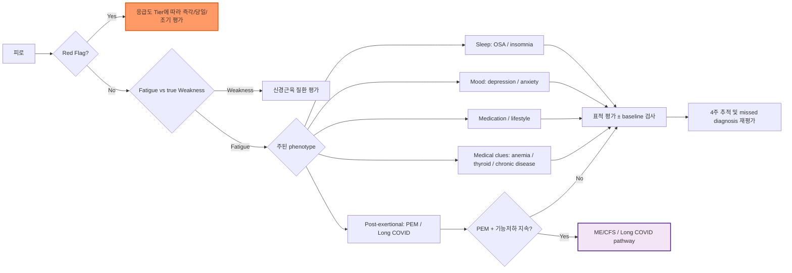

# 피로 Fatigue

## <mark style="color:green;">일반 사항</mark>

* 피로 : 육체적·정신적 활력 저하, 힘듦, 기진맥진 상태로, 활동을 시작하거나 유지하기 어렵고 쉽게 처지는 증상
* 1차 진료에서 매우 흔한 증상이지만 원인이 명확하지 않은 경우가 많으며, 심리적·생활 습관적 요인부터 내과적 기질 질환까지 원인 범위가 넓음
* 지속 기간에 따라 급성(＜1개월), 아급성(1\~6개월), 만성(＞6개월)으로 구분하며, 아급성·만성 피로에서는 우울·불안, 갑상선 질환, 빈혈, 수면 장애, 악성 종양 등을 체계적으로 감별 ('DEAD, TIRED' 항목 참조)
* 대부분의 경우 무분별한 실험실 검사는 진단적 가치가 낮으나, 병력·진찰상 명확한 원인이 없을 경우 최소한의 baseline 검사(CBC, TSH, 혈당 등)를 초기에 1회 시행하는 것이 안전하며, 이후 반복 검사는 최소화한다
* 충분한 휴식 후에도 회복되지 않는 피로, 아침 기상 시부터 느끼는 심한 피로감, 사회적·직업적 기능 장애를 동반한 피로는 만성피로증후군 또는 기질 질환의 가능성을 시사

## <mark style="color:green;">원인 및 위험 인자</mark>

* 흔히 원인이 명확하지 않음

#### <mark style="color:$primary;">급성 (＜1개월)</mark>

* 감염
* 스트레스
* 수면 부족
* 급격한 다이어트
* 만성 피로 원인들의 단기 악화

#### <mark style="color:$primary;">아급성 (1\~6개월), 만성 (＞6개월)</mark>

* **인구학적 위험 인자** : 고령, 여성
* **생활 습관/환경** : 지나친 활동 또는 비활동, 비만, 영양 결핍(비건·채식 식이의 경우 Vit B12 결핍 위험), 만성적 수면 부족, 음주, 흡연
* **임신** : 가임기 여성에서 피로의 가장 흔하고 중요한 원인 중 하나; 초기 임신에서 특히 두드러짐
* **만성피로증후군(ME/CFS)**
* **심장/호흡기** : CHF, COPD, 폐쇄수면무호흡증
* **내분비/대사** : 갑상선저하증/항진증, 부신피질기능저하증(Addison's disease; Na↓·K↑·색소침착 동반 시 의심), 만성 신/간질환, Na↓, Ca↑
* **혈액/종양** : 빈혈(철결핍성·만성 질환성·거대적아구성), 악성 종양
* **감염** : 단핵구증후군, 바이러스 간염, HIV 감염, 아급성 심내막염, 결핵, Long COVID(Post-COVID condition; SARS-CoV-2 감염 후 발생·지속하며 약 3개월 이상 이어지는 증상군으로 피로·PEM·인지 저하·호흡곤란·수면장애·기립성 증상 등이 흔함)
  * _Ref. National Academies of Sciences, Engineering, and Medicine (NASEM), 2024; CDC Long COVID Clinical Overview._
* **자율신경 이상(POTS)** : 기립 후 10분 이내 지속적 심박수 증가 ≥30 bpm(12\~19세 ≥40 bpm), 유의한 기립성 저혈압 없이 기립 시 악화되는 증상이 통상 ≥3개월 지속되고 빈혈·탈수·발열·갑상선항진증·약물 등 다른 빈맥 원인이 배제될 때 의심; Long COVID 이후 기립성 증상 동반 시 간과하지 않음
  * _Ref. Sheldon RS et al. Heart Rhythm 2015; Raj SR et al. Can J Cardiol 2020. 과거 일부 연구 기준에서는 증상 지속 ≥6개월을 사용함._
* **류마티스** : 섬유근육통, polymyalgia rheumatica
* **정신** : 우울, 불안, 신체화장애
* **약물/치료** : 항우울제, 항불안제, 항정신병제, 근이완제, 항경련제, 1세대 항히스타민제, β-차단제, 마약성 진통제(opioids), 항콜린성 약물, statin(근육통 동반 여부 확인), 이뇨제(탈수·기립성 저혈압·저Na/저K), PPI 장기 복용(Vit B12·Mg 결핍), metformin(Vit B12 결핍), 세포독성 항암제·일부 표적치료제·면역관문억제제
  * 면역관문억제제 치료 중 새 피로는 단순 약물 부작용뿐 아니라 갑상선기능장애·뇌하수체염·부신기능저하증 등 immune-related adverse event 가능성도 평가

### <mark style="color:$danger;">🚩 Red Flags!</mark>

<mark style="color:$danger;">**Tier 1 — 즉각 응급 조치 및 이송**</mark>

* 새로 발생한 국소 신경학적 결손 또는 의식 변화 : 마비·감각 저하·언어장애·보행 장애 등
* 지속되는 심한 흉통 또는 중증 호흡곤란, 실신·저혈압 등 혈역학적 불안정
* 활동성 중증 출혈 : 대량 토혈·혈변/흑색변·객혈과 함께 어지럼·실신·빈맥·저혈압 등 순환기 불안정 소견

<mark style="color:$warning;">**Tier 2 — 당일 또는 수 시간 내 긴급 평가**</mark>

* 새로 발생하거나 빠르게 악화되는 운동성 흉통·호흡곤란, 저산소증 또는 심폐 질환이 의심되는 증상
* 병색이 뚜렷하거나 지속성 고열 등 중증 감염·전신질환이 의심되는 경우
* 반복되는 실신 전조/실신 또는 심한 기립성 증상
* 의미 있는 객혈 또는 급격히 악화되는 호흡기 증상

<mark style="color:$info;">**Tier 3 — 수일~수주 내 원인 평가 (외래/전문진료)**</mark>

* 설명할 수 없는 체중 감소 : 식단 변화나 운동 없이 6\~12개월 이내 평소 체중의 5% 이상 감소
* 원인 불명의 발열·야간 발한 또는 비정상적 림프절병증
* 새로 만져지는 고형 종괴
* 진행성 연하곤란 또는 지속·악화되는 소화기 증상
* 폐경 후 질 출혈

※ 충분한 휴식 후에도 회복되지 않는 피로, 기상 시 심한 피로, 사회적·직업적 기능 저하는 중요한 **임상 단서(clinical clue)**이지만 그 자체로 응급 Red Flag는 아니며, ME/CFS·수면장애·우울증 및 기질질환 평가의 근거로 활용한다.

## <mark style="color:green;">진단</mark>

#### <mark style="color:$primary;">진단 단계</mark>

* Step 1: Red flags 확인
* Step 2: Fatigue vs Weakness 감별
  * Fatigue-피곤한가요? (에너지 부족)
  * Weakness-힘이 빠지나요? (근력 저하)
* Step 3: Sleep / Mood / Medications? Fatigue phenotype 분류
  * Sleep-driven fatigue → OSA / insomnia
  * Mood-driven fatigue → depression / anxiety
  * Medical fatigue → anemia / thyroid / chronic disease
  * Post-exertional fatigue → ME/CFS / Long COVID
  * Lifestyle fatigue → stress / overwork / inactivity
* Step 4: 검사 - Baseline labs 시행
* Step 5: Follow-up at 4 weeks

***



<p align="center"><strong>피로 평가 알고리듬</strong></p>

<p align="center"><em><mark style="color:$info;">Ref. 저자 정리 (진단 단계 Step 1\~5 기준)</mark></em></p>

***

#### <mark style="color:$primary;">감별 항목 : 'DEAD, TIRED'</mark>

<table><tbody><tr><td><strong>D</strong>epression<br><strong>E</strong>nvironment/Lifestyle<br><strong>A</strong>nxiety, Anemia<br><strong>D</strong>rugs (Alcohol)</td><td><strong>T</strong>hyroid, Tumors<br><strong>I</strong>nfection, Insomnia<br><strong>R</strong>heumatologic<br><strong>E</strong>ndocarditis/Cardiovascular<br><strong>D</strong>iabetes/Endocrine</td></tr></tbody></table>

* **언제 가장 피곤합니까?**
  * 아침부터 피곤 → 우울, 수면장애, OSA
  * 활동 시 악화 → 휴식 시 호전 → 심폐질환, 빈혈
  * 하루 종일 동일 → 스트레스, 신체증상장애/기능성 증상
  * 활동 후 지연 악화 (PEM) → ME/CFS / Long COVID
* **복용하는 약물이 있나요?**
  * 항히스타민, BZD, opioid, β-blocker, statin
  * PPI / metformin → B12 결핍

### <mark style="color:orange;">검사</mark>

* 대부분의 경우에서 무분별한 실험실 검사는 도움이 되지 않음
* 병력·진찰상 명확한 원인 없이 4주를 초과하여 증상이 지속되는 경우 baseline 검사를 1회 시행; 반복 검사는 최소화

> **Baseline 검사 조기 시행 고려 적응증**
>
> 다음 중 하나 이상 해당 시 4주를 기다리지 않고 초진 시 시행을 고려
>
> * 기능 저하 동반 (일상·업무 영향)
> * 고령 (≥60세)
> * 만성질환 위험군 (당뇨, CKD 등)
> * 병력·진찰상 원인 불명
> * 충분한 설명 후에도 기질 원인에 대한 강한 우려 지속

* 피로 환자의 대부분은 검사에서 근육 약화가 없으며, 근육 약화가 있는 경우 신경계 질환 등을 고려

**기본 검사**&#x20;

* **CBC, 혈당/HbA1c, LFT, RFT, TSH, 전해질, U/A**
* 가임기 여성에서는 UPT(소변 임신 반응 검사)를 기본 검사에 포함

**선택 검사**&#x20;

* **ESR, CRP, ferritin/TSAT, Vit B12, 엽산, Vit D(25(OH)D), free T4, 8\~9 AM cortisol ± ACTH, monospot, ANA, 흉부 X선, 분변 잠혈 검사, 수면검사(HSAT/PSG)**; 복부 초음파 등은 임상적으로 필요할 때 선택
* CBC에서 빈혈 확인 → ferritin(철결핍성), Vit B12·엽산(거대적아구성), ESR·CRP(만성 질환 빈혈) 순으로 감별
* **철결핍 평가** : ferritin ＜30 ng/㎖이면 철결핍을 강하게 시사. Ferritin은 급성기 반응물질이므로 염증 시 정상 또는 상승할 수 있어 CRP와 TSAT를 함께 해석하며, CKD·심부전·IBD 등에서는 질환별 기준을 적용
* **IDWA(빈혈 없는 철결핍)** : Hb가 정상이어도 ferritin ＜30 ng/㎖이면 철결핍을 고려. Ferritin 30\~50 ng/㎖의 경계영역에서는 월경/출혈 위험, 식이, TSAT 및 염증 여부를 함께 판단하며 이를 독립적인 확정 cutoff로 사용하지 않음
* **갑상선** : 뇌하수체 질환(두통·시야장애 등) 또는 이차성 갑상선기능저하증이 의심되면 TSH가 정상이어도 free T4를 함께 측정. 정상 TSH의 비특이적 피로만을 이유로 Anti-TPO Ab를 일률적으로 추가하지 않음
* **부신기능저하증 의심 시** : 체중 감소, 저혈압/기립성 증상, 식욕저하·구역, 저Na/고K, 색소침착, 최근 장기간 glucocorticoid 사용·중단 등의 단서가 있으면 8\~9 AM serum cortisol ± ACTH 시행
* **Vit D** : 골질환·흡수장애·저칼슘혈증 등 결핍 위험 또는 임상적 적응증이 있을 때 선택적으로 측정하고 확인된 결핍은 교정. 피로 개선만을 목적으로 특정 25(OH)D 목표농도(예: ≥30 ng/㎖)를 설정하지 않음
  * _Ref. Endocrine Society Clinical Practice Guideline, 2024._

**수면 무호흡 선별**&#x20;

* 코골이·주간 졸림·무호흡 목격이 동반되면 **STOP-BANG** 시행 (☞ 하단 설문 및 판정 기준 참조)
* 주간 졸림의 정도는 **Epworth Sleepiness Scale (ESS)**을 병행해 정량화할 수 있음

**우울증 감별**&#x20;

* 'DEAD, TIRED' 항목 중 우울/불안(Depression/Anxiety) 비중이 높다면 초기부터 PHQ-9 시행
* PHQ-9 ≥10 → 치료 적극 고려, 5–9 → watchful waiting + 생활 습관 지도 (☞ [우울증](../221_/027_-depression.md#phq-9))

#### <mark style="color:$primary;">피로 증상 척도 (Fatigue Severity Scale, FSS)</mark>

* 피로 상태를 평가하고 치료 효과를 추적하는 데 활용 (Krupp et al. 1989)
* 다음 9개 항목에서 지난 1주간 본인의 상태와 가장 일치하는 점수를 "전혀 아니다= 1점 \~ 7점=확실히 그렇다" 사이에서 선택하고 평균을 계산
  * 평균 ≥4점이면 임상적으로 유의한 피로로 판정 (일반적 컷오프 기준)

1. 피로할 때에는 어떤 일도 하고 싶지 않다.
2. 운동을 하면 피로해진다.
3. 나는 쉽게 피로해진다.
4. 피로할 때에는 신체적인 기능이 떨어진다.
5. 나는 피로 증상 때문에 자주 문제가 생긴다.
6. 나의 피로는 신체적인 활동을 지속하지 못하게 한다.
7. 피로할 때는 임무와 책임을 다하는데 어려움을 느낀다.
8. 피로는 내가 일을 하지 못하게 하는 3대 원인 중 하나이다.
9. 피로하면 나는 업무, 가정, 사회생활에 지장을 받는다.

※ **전반적 피로 강도 평가**

* FSS와 별도로, 지난 2주간 전반적인 피로 강도를 "없음=0점 \~ 10=상상할 수 있는 최악의 피로" 사이의한 숫자로 표시하도록 함; 치료 전후 단일 수치 비교에 유용

#### <mark style="color:$primary;">STOP-BANG 수면 무호흡 선별 설문</mark>

  _<mark style="color:$info;">Ref. Chung F et al. Anesthesiology 2008;108:812–821.</mark>_

* 피로를 주소로 내원한 환자에서 코골이·주간 졸음·무호흡 목격이 동반될 때 시행
* 8개 항목에 대하여 해당하면 각1점
* 판정 : 0\~2점=저위험; 3\~4점=중간 위험으로 증상·동반 위험인자를 이용해 추가 분류하고 객관적 수면검사 여부를 결정; ≥5점=고위험으로 HSAT/PSG 등 객관적 검사 적극 고려
  ※ S·T·O·P 4개 항목 중 2개 이상 + 남성 또는 BMI ＞35 또는 목둘레 ＞40 ㎝에 해당하는 경우에도 고위험으로 분류할 수 있음. 목둘레 항목 자체의 표준 기준은 성별 구분 없이 ＞40 ㎝임.
* **ESS** : 주간 졸림의 정도를 정량화하는 보조 척도로 병행 가능. 단, STOP-BANG/ESS는 선별 도구이며 확진 검사가 아님.

<table><thead><tr><th width="100">항목</th><th>질문</th></tr></thead><tbody><tr><td><strong>S</strong>noring</td><td>큰 소리로 코를 고십니까? (옆방에서 들릴 정도, 또는 동침자가 팔꿈치로 찌를 정도)</td></tr><tr><td><strong>T</strong>ired</td><td>낮에 자주 피곤하거나 졸리십니까?</td></tr><tr><td><strong>O</strong>bserved</td><td>수면 중 숨이 멎는 것을 다른 사람이 목격한 적이 있습니까?</td></tr><tr><td><strong>P</strong>ressure</td><td>고혈압이 있거나 고혈압 치료를 받고 계십니까?</td></tr><tr><td><strong>B</strong>MI</td><td>BMI가 35를 초과합니까?</td></tr><tr><td><strong>A</strong>ge</td><td>나이가 50세를 초과합니까?</td></tr><tr><td><strong>N</strong>eck</td><td>목둘레가 40 ㎝를 초과합니까?</td></tr><tr><td><strong>G</strong>ender</td><td>남성입니까?</td></tr></tbody></table>

#### <mark style="color:$primary;">만성피로증후군(ME/CFS) 감별</mark>

다음 4가지를 모두 충족할 때 ME/CFS를 의심

1. 6개월 이상 지속되는 기능 저하 동반 피로 : 새로 발생하였으며 활동으로 설명되지 않음
2. 운동 후 권태감(PEM, Post-Exertional Malaise) : 활동 후 수 시간\~수일 뒤 증상 악화; 단순 피로와 ME/CFS를 구분하는 가장 중요한 특징
3. 비회복성 수면 : 충분히 자도 개운하지 않음
4. 인지 기능 저하(Brain fog) 또는 기립성 조절 장애 : 집중력·기억력 저하, 또는 일어설 때 어지럼·빈맥

※ 위 핵심 증상은 대체로 **적어도 절반 이상의 시간에 존재하고 중등도 이상의 강도**를 보여야 함.

※ PEM이 있는 환자에게 고정적으로 활동량을 증가시키는 운동 프로그램을 적용하면 증상이 악화될 수 있으므로 ME/CFS 의심 시 운동 처방 전 확인.

_Ref. Institute of Medicine/National Academy of Medicine, 2015; CDC ME/CFS._

#### <mark style="color:$primary;">ME/CFS vs 우울증 vs OSA 감별표</mark>

<table data-header-hidden><thead><tr><th width="127.15789794921875"></th><th width="218.78948974609375"></th><th></th><th></th></tr></thead><tbody><tr><td>항목</td><td><strong>ME/CFS</strong></td><td><strong>우울증</strong></td><td><strong>OSA</strong></td></tr><tr><td>핵심 특징</td><td>PEM (운동 후 지연 악화)</td><td>흥미/의욕 저하</td><td>주간 졸림 + 코골이</td></tr><tr><td>피로 패턴</td><td>활동 후 수시간~수일 뒤 악화</td><td>하루 종일 지속</td><td>아침 피곤 + 낮 졸림</td></tr><tr><td>휴식 후 회복</td><td>없음 (비회복성)</td><td>약간 호전 가능</td><td>없음</td></tr><tr><td>수면</td><td>잤는데도 개운하지 않음</td><td>불면/과다수면 혼재</td><td>수면 질 나쁨 (무호흡)</td></tr><tr><td>주간 졸림</td><td>흔치 않음</td><td>경우에 따라</td><td>매우 흔함</td></tr><tr><td>운동 반응</td><td>하면 악화 (PEM)</td><td>하면 기분 개선 가능</td><td>큰 변화 없음</td></tr><tr><td>기분 증상</td><td>2차적 우울 가능</td><td><strong>핵심 증상</strong></td><td>2차적 우울 가능</td></tr><tr><td>인지 기능</td><td>brain fog 흔함</td><td>집중력 저하</td><td>졸림으로 인한 저하</td></tr><tr><td>자율신경 증상</td><td>Orthostatic intolerance 흔함; 일부에서 POTS 동반</td><td>드묾</td><td>드묾</td></tr><tr><td>동반 힌트</td><td>Long COVID</td><td>스트레스, 삶의 사건</td><td>비만, 큰 목둘레</td></tr></tbody></table>

※ **진료실 POTS 선별(Active Stand Test)** : 5\~10분 앙와위(supine) 안정 후 HR/BP 측정 → 기립 후 1, 3, 5, 8, 10분에 HR/BP 측정. 성인에서 HR이 지속적으로 ≥30 bpm 상승(12\~19세 ≥40 bpm)하고 유의한 기립성 저혈압이 없으면 POTS 가능성을 평가한다. 단, 기립 시 악화되는 증상의 만성 지속(통상 ≥3개월)과 다른 빈맥 원인 배제가 필요함.
Long COVID 이후 피로·brain fog·어지럼·두근거림이 기립 시 악화되는 환자에서 적극 시행 고려.


**흔한 진단 오류 (Pitfalls)**

* **"우울로 단정"** → 실제 갑상선저하증·빈혈·수면 무호흡 등 기질 원인을 놓칠 수 있음
* **"검사 정상 = 이상 없음"** → ME/CFS·POTS는 표준 검사에서 정상 가능; 증상 패턴으로 감별. 반대로 적절한 초기 평가 후 중대한 기질질환 가능성이 낮다면 수면장애, 우울·불안, 스트레스 및 기능성 증상도 함께 평가
* **PEM 환자에게 고정 증량 운동 권장** → ME/CFS에서는 고정된 단계로 활동량을 지속 증가시키는 GET를 시행하지 않으며, 환자의 energy limit 내에서 개별화된 activity management/pacing을 적용 (NICE 2021)
* **statin 유발 피로 간과** → 근육통 동반 여부 확인; 필요 시 용량 조정 또는 약제 변경 고려
* **수면 무호흡 과소 진단** → 비만·코골이가 없어도 STOP-BANG 시행 고려
* **철결핍(빈혈 없는 경우) 누락** → Hb 정상이어도 ferritin/TSAT 및 출혈 위험을 함께 평가; 염증성 질환은 질환별 기준 적용
* **POTS 누락** → 특히 젊은 여성·Long COVID 이후 기립성 증상 동반 시 적극 평가


***

## <mark style="background-color:$warning;">Management</mark>

### <mark style="color:orange;">치료 방침</mark>

* 원인 치료; 습관성 약물(항불안제 등)을 복용 중인 경우 단계적 중단이 피로 개선의 시작일 수 있음
* 흔한 원인 및 경과에 대한 정보를 제공하고 안심시킴
* 가족 상담
* 수면 일지 작성 : 피로의 양상을 파악하기 위해 2주간 수면 시간과 피로도를 기록
* 카페인 제한 : 오후 2시 이후의 카페인 섭취는 깊은 수면(Deep sleep)을 방해하여 피로 회복을 저해함; 카페인에 의존하는 경우 내성이 생겨 반동성 피로(카페인 효과 소실 후 더 심한 피로)가 유발될 수 있음
* 심리적 평가 : 'DEAD, TIRED' 항목 중 우울/불안 비중이 높다면 PHQ-9 등 선별 검사 및 심리 상담을 초기부터 적극 고려
* 원인이 확실치 않은 경우 대증 치료 : 수면 환경 개선, 통증 관리, 영양 관리, 인지행동 요법
* Follow-up : 4주 후 재평가
  * 호전 → 유지
  * 지속 → missed diagnosis 재검토, sleep / mood 재평가, 필요 시 추가 검사

## <mark style="color:green;">비-약물 치료 및 예방</mark>

* 규칙적 운동 : 1주일에 3\~4회, 매회 30분 이상. 단, 만성피로증후군이 의심되는 경우 무조건적인 운동보다는 에너지 범위를 조절하는 Pacing 전략을 우선 고려
  1. Pacing : 환자가 가진 제한된 에너지 내에서 일상 활동을 계획하고 조절하여, '운동 후 불쾌감(PEM: 과도한 피로 및 증상 악화)'을 유발하지 않으면서 안정적인 기능을 유지하는 정도로 행동 수정
  2. ME/CFS 의심 환자에서는 **고정된 단계로 활동량을 지속 증가시키는 GET를 시행하지 않음**. 운동/활동을 원할 경우 증상을 악화시키지 않는 baseline을 정하고 energy limit 내에서 개별적으로 조절
* 금연
* 음주 제한
* 카페인(커피) : 각성 효과는 있으나 휴식이나 수면을 대체할 수 없음; 불면증이나 불안을 악화시킬 수 있으므로 오후 2시 이후에는 피함; 카페인 의존 자체가 내성과 반동성 피로를 유발하므로 단계적 감량 권고
* 적절한 체중 유지
* 규칙적이고 적당한 수면(일반적으로 하루 7\~8시간); 일반적인 불면/수면위생 지도에서는 필요 시 낮잠을 20\~30분 이내로 하고 늦은 오후 낮잠은 피함(단, ME/CFS에서는 개별 energy management에 따라 조절)
* 균형 있는 식사 : 지방질 및 당분 섭취 제한, 과식 회피, 충분한 Vit과 미네랄 섭취
* 업무량 조절 및 효율적인 시간 계획으로 휴식 시간을 늘림
* 스트레스 대처 : 매일 쉽게 할 수 있는 이완 운동, 긍정적인 경험에 대한 연상, 이완 호흡, 어려운 일이 생길 때는 친구나 가족들과 대화하고 도움을 요청
* 습관성 약물 사용을 피함

## <mark style="color:green;">약물 치료</mark>

* **SSRI** : 우울 동반 피로에서 우선 고려; 피로 자체보다 기분·의욕 개선을 통해 간접적으로 피로 호전 (☞ [우울증](../221_/027_-depression.md))
* **철분제** : 철결핍성 빈혈이 확인된 경우 원인 교정과 함께 경구 철분제 투여; ferritin 정상화 후 1\~3개월 추가 유지하여 저장 철 보충 (☞ [철결핍빈혈](../230_/193_-iron-deficiency-anemia.md))
* **Vit D** : 임상적 적응증에 따라 검사하여 결핍이 확인된 경우 교정. 피로 개선만을 목적으로 특정 혈중 목표농도를 설정하지 않으며, 결핍이 없는 환자에서 경험적 고용량 투여는 권하지 않음. 국내 허가 용량과 환자의 연령·신기능·흡수장애 여부를 고려하여 경구 치료를 우선하고 필요 시 추적 검사 (☞ [골다공증](../228_/149_-osteoporosis.md#vit-d))
* **Vit B12** : PPI 장기 복용자·metformin 복용자·고령·비건 식이 환자에서 결핍을 확인한 뒤 원인·중증도와 흡수장애 여부에 따라 경구 또는 주사 보충을 선택 (☞ [빈혈](../230_/192_-anemia.md#vit-b12-cobalamin-deficiency))
* **methylphenidate** : 암 관련 피로(Cancer-related fatigue) 또는 ME/CFS 환자 일부에서 시도되나 일관성 있는 효과를 보여주지 못함; 국내에서는 ADHD 외 적응증에 대한 보험 급여가 인정되지 않음
* **CoQ10, L-carnitine** : 보조적으로 고려할 수 있으나 근거 약함
* 식욕 자극제 : 체중 감소가 동반된, 다른 원인이 없는 환자에서 고려 (☞ [체중 감소](013_-weight-loss.md))

***

### <mark style="color:red;">질병코드 (KCD-9)</mark>

* **R53** 병감 및 피로
* **G93.3** 바이러스후피로증후군 (근통성 뇌척수염 포함; ME/CFS 진단 시 참고)

***

## <mark style="color:purple;">처방례</mark>

> **처방례 1.** Vit D 결핍 확인 환자 — 경구 치료 예
>
> ```
> 팩타민디쓰리정25000IU 2T qw × 6주
> (결핍 치료 후 유지: 25,000 IU 1T q4wk; 결핍 위험이 높으면 환자별 조정)
> ```
>
> ※ 국내 허가사항 기준 성인 비타민 D 결핍치료 용량. 유지요법 시작 후 약 3\~4개월에 25(OH)D를 확인하여 조정. 피로 개선만을 위한 특정 목표농도 설정은 권하지 않음.

> **처방례 2.** Vit D 결핍 — 흡수장애 등으로 주사제가 필요한 성인
>
> ```
> 바이타디주300,000IU 1앰플 IM 1회
> ```
>
> ※ 국내 허가상 **흡수장애가 있는 비타민 D 결핍증 위험이 높은 성인**의 예방·치료에 사용. 25(OH)D와 혈청 칼슘을 확인하여 투여하며 연간 총 투여량은 600,000 IU를 넘지 않도록 함.

> **처방례 3.** 철결핍성 빈혈 동반 피로 (☞ 철결핍빈혈 [처방례](../230_/193_-iron-deficiency-anemia.md) 참조)
>
> ```
> 훼로바-유서방정(철 80 mg/T) 1T qd 식후
> (치료 반응과 저장 철 회복을 확인하며 유지 기간 조정)
> ```

> **처방례 4.** Vit B12 결핍 동반 피로 (PPI·metformin 장기 복용자, 고령, 비건 식이)
>
> B12 결핍의 원인·중증도와 흡수장애 여부에 따라 경구 또는 주사 보충을 선택한다. 구체적인 교정 요법은 ☞ [빈혈 — Vit B12 결핍](../230_/192_-anemia.md#vit-b12-cobalamin-deficiency) 처방례를 따른다.
>
> ※ 국내 mecobalamin 500 μg 제제는 제품별 허가 효능이 B12 결핍 치료와 일치하지 않을 수 있으므로, 피로 챕터에서는 특정 상품명 처방을 제시하지 않고 원인 질환 챕터의 표준 보충요법을 적용한다.

> **처방례 5.** 우울 동반 피로 (☞ 우울증 [처방례](../221_/027_-depression.md) 참조)

***

### <mark style="color:$success;">핵심 복약 지도</mark>

> **비타민 D (Vit D)**
>
> * 비타민 D 결핍이 확인된 경우에는 처방된 용량대로 보충하십시오. 피로는 원인이 다양하므로 비타민 D 보충만으로 반드시 호전되는 것은 아닙니다.
> * 지용성 비타민이므로 식사와 함께 복용하면 흡수가 더 잘 됩니다.
> * 과다 복용 시 고칼슘혈증(구역, 구토, 변비, 피로 악화)이 생길 수 있으므로 임의로 용량을 늘리지 마십시오.
> * 재검 시점은 제제·용량과 임상상황에 따라 조정하며, 고용량을 임의로 추가 복용하지 마십시오.

> **철분제 (훼로바 등)**
>
> * 철분은 제제별 허가 용법을 따르십시오. 일반적으로 위장 장애가 없으면 흡수를 고려해 식사와 떨어뜨려 복용할 수 있으나, 훼로바-유서방정은 국내 허가상 식후 복용입니다.
> * 비타민 C를 일률적으로 함께 복용할 필요는 없습니다. 칼슘제·제산제·차/커피 등은 철분 흡수를 방해할 수 있으므로 가능한 시간 간격을 두십시오.
> * 변이 검게 나오는 것은 정상 반응입니다.
> * 혈액 수치가 정상화된 후에도 저장 철(ferritin)을 채우기 위해 1\~3개월 추가 복용이 필요합니다.

> **비타민 B12 (메코발라민 등)**
>
> * 비타민 B12가 부족하면 피로, 손발 저림, 기억력 저하, 빈혈이 생길 수 있습니다.
> * 위장약(PPI)이나 당뇨약(메트포르민)을 오래 복용하면 B12 흡수가 줄어들 수 있으므로 정기적인 혈중 농도 확인이 필요합니다.
> * 식사와 무관하게 복용 가능하며, 효과는 복용 후 1\~3개월 뒤부터 나타납니다.

> **언제 다시 병원을 방문해야 하나요?**
>
> * 충분히 쉬어도 피로가 4주 이상 지속되는 경우
> * 피로와 함께 체중 감소, 발열, 식은땀, 림프절 비대가 동반되는 경우
> * 가벼운 신체적·인지적 활동 후 수 시간~수일 뒤 증상이 비정상적으로 악화되고 회복이 지연되는 경우(PEM)
> * 원인에 맞는 치료를 시행했는데도 피로가 지속되거나 악화되는 경우

***

### <mark style="color:blue;">환자 안내서</mark>


**지속적인 피로는 몸이 보내는 신호입니다**

피로는 단순한 기력 부족이나 의지 부족이 아닙니다.\
원인을 찾아 치료하면 충분히 개선될 수 있습니다.


#### <mark style="color:$primary;">피로란 무엇인가요?</mark>

* 충분히 쉬어도 회복되지 않는 지속적인 피로감을 말합니다
* 원인은 빈혈, 갑상선 기능 저하, 당뇨, 수면 무호흡증, 우울증, 만성 감염 등 다양합니다
* 6개월 이상 지속되는 심한 피로는 만성피로증후군(ME/CFS)의 가능성도 있습니다

#### <mark style="color:$primary;">만성피로증후군(ME/CFS)이 의심될 때</mark>

다음 4가지가 모두 해당된다면 주치의와 상의하십시오.

* 6개월 이상 지속되는 피로로 일상생활에 지장이 있다
* **가벼운 활동 후 수 시간\~수 일 뒤 증상이 심해진다** (이것이 가장 중요한 특징입니다)
* 잠을 자도 전혀 개운하지 않다
* 집중력·기억력이 떨어지거나, 일어설 때 어지럽다


**ME/CFS가 의심된다면 무리한 운동은 금물입니다.** "조금씩 운동량을 늘리면 나아진다"는 것은 ME/CFS에는 해당되지 않습니다. 에너지를 배터리처럼 생각하고, 완전히 방전되기 전에 활동을 멈추고 충전하는 방식(Pacing)이 중요합니다. 주치의와 상의하여 활동 계획을 세우십시오.


#### <mark style="color:$primary;">생활 속 실천 사항</mark>

* **규칙적인 수면** : 매일 같은 시간에 자고 일어나십시오. 하루 7\~8시간의 수면이 적당합니다. 낮잠은 20\~30분 이내로 제한하십시오
* **규칙적인 운동** : 주 3\~4회, 30분 이상의 가벼운 유산소 운동이 피로 개선에 도움이 됩니다. 단, **만성피로증후군이 의심된다면 무리한 운동은 오히려 증상을 악화시킬 수 있으므로** 주치의와 상의하십시오
* **균형 잡힌 식사** : 철분(빈혈 예방), 비타민 B군, 비타민 D, 아연이 풍부한 음식을 골고루 드십시오
* **카페인·음주 절제** : 카페인은 오후 2시 이후 피하십시오. 카페인에 지나치게 의존하면 효과가 점점 줄고 카페인이 떨어질 때 오히려 더 심한 피로(반동성 피로)가 생길 수 있습니다. 음주는 수면의 질을 떨어뜨립니다
* **스트레스 관리** : 이완 운동, 복식 호흡, 취미 활동 등을 통해 정신적 피로를 줄이십시오
* **업무량 조절** : 무리한 일정을 피하고 충분한 휴식 시간을 확보하십시오


**이럴 때는 즉시 응급실 평가가 필요합니다**

* 갑자기 발생한 마비·언어장애·의식 변화
* 지속되는 심한 흉통 또는 심한 호흡곤란, 실신
* 많은 양의 토혈·혈변/흑색변·객혈 또는 출혈과 함께 어지럼·식은땀·저혈압 증상이 있는 경우



**이럴 때는 진료가 필요합니다**

* 충분히 쉬어도 피로가 4주 이상 지속되는 경우
* 피로와 함께 체중 감소, 발열, 식은땀, 림프절 비대가 동반되는 경우
* 우울감, 무기력감, 의욕 저하가 함께 오는 경우
* 가벼운 신체적·인지적 활동 후 수 시간~수일 뒤 증상이 비정상적으로 악화되고 회복이 지연되는 경우(PEM)

