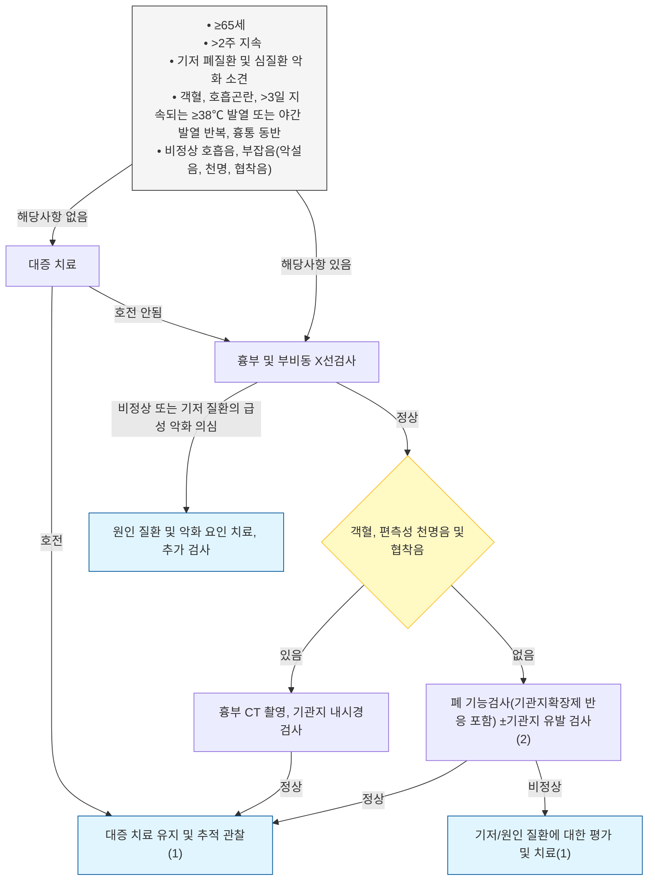
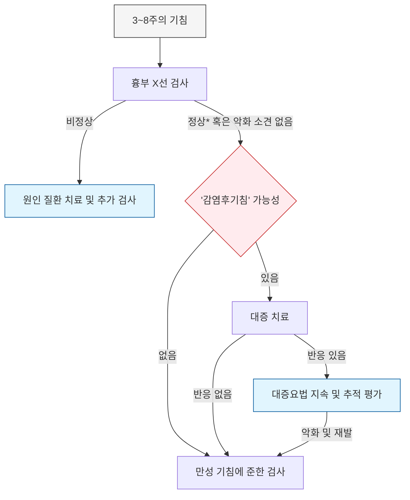
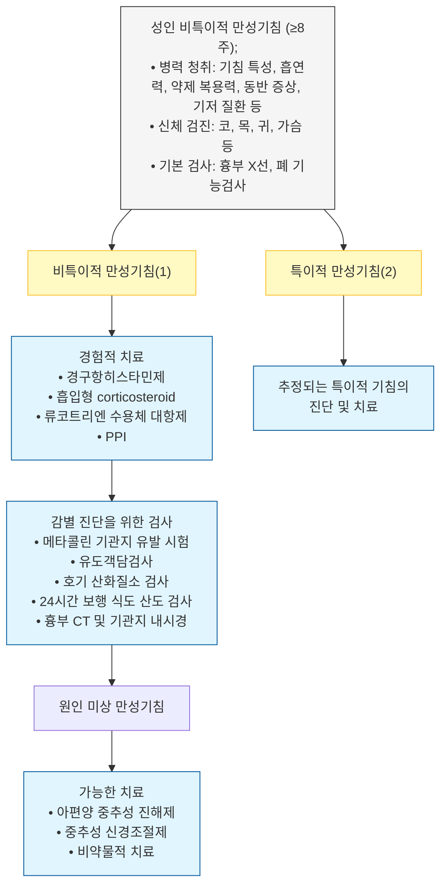
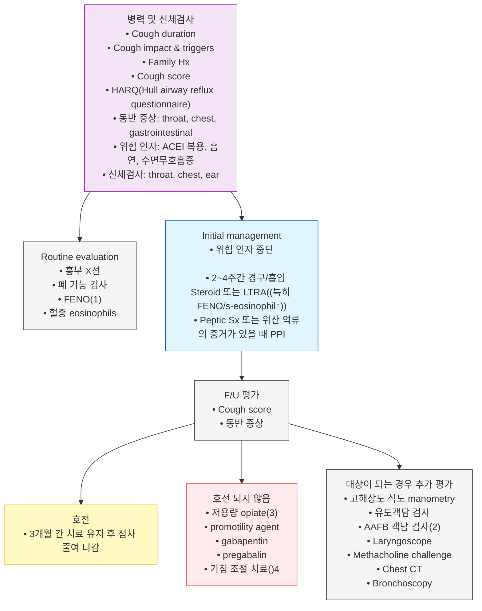

# 기침 Cough

## <mark style="color:green;">일반 사항</mark>

* 기침은 1차 진료에서 가장 흔한 주소 중 하나로, 기도 내 이물·분비물 제거를 위한 방어 반사이지만 지속 시 삶의 질을 크게 저하시킴
* 지속 기간에 따라 급성(＜3주), 아급성(3\~8주), 만성(＞8주)으로 분류하며, 이에 따라 원인과 접근법이 달라짐
* 만성 기침의 3대 원인은 천식(cough-variant asthma 포함), 상기도기침증후군, GERD이며, 이 세 가지만으로 대부분의 만성 기침을 설명할 수 있음
* 흡연자의 만성 기침은 금연만으로 90%에서 호전됨. 금연 상담을 우선 시행
* ACEI 복용 중인 환자에서는 약물 유발 기침을 항상 먼저 배제할 것
* 급성 기침의 대부분은 바이러스 감염(감기, 급성 기관지염)이 원인으로, 세균 감염의 근거 없이 항생제를 관습적으로 처방하는 것은 바람직하지 않음. 가래 색깔(화농성)만으로 세균 감염을 판단하는 것은 신뢰도가 낮음

### <mark style="color:$danger;">🚩 Red Flags!</mark>

<mark style="color:$danger;">**즉각 응급 조치 및 이송**</mark>

* 아나필락시스 (갑작스러운 기침 및 호흡곤란)
* 호흡 곤란, 빈호흡(＞30회/분)
* 저혈압(SBP ＜90 or DBP ＜60 ㎜Hg)
* 빈맥(＞130회/분)
* 설명할 수 없는 급성 흉통
* 이물 흡인, 독성 연기 흡인 의심

<mark style="color:$warning;">**조기 평가 (당일 \~ 수일 내)**</mark>

* 객혈
* ＞3일 지속되는 발열
* 결핵 또는 면역 저하 위험군 - 역학적 위험 인자

<mark style="color:$info;">**계획적 정밀 검사 필요**</mark>

* 다음 증상이 ＞3주 동반 : 흉부/어깨 통증, 쉰 목소리, 곤봉지, 경부/쇄골 위 림프절병증
* 설명할 수 없는 체중 감소
* 경험적 치료에 반응하지 않음 - 진단 재검토 필요

## <mark style="color:green;">기간에 따른 분류 및 원인</mark>

#### <mark style="color:$primary;">급성 기침 (＜3주)</mark>

* 급성 호흡기 감염 : 감기(대부분), 급성 기관지염, 부비동염, 폐렴, 백일해, 세기관지염
* 만성 질환(예: 천식, COPD, CHF)의 급성 악화, 폐색전증
* 흡인 : 이물질, 독성 물질 흡입

#### <mark style="color:$primary;">급성\~만성 기침</mark>

* 알레르기비염, GERD, 감염후기침

#### <mark style="color:$primary;">아급성 기침 (3\~8주)</mark>

* 감염후기침, 백일해, 기저 폐질환의 악화
* 비감염성 : 만성 기침과 같은 원인들

#### <mark style="color:$primary;">만성 기침 (＞8주)</mark>

* 흔한 원인 : 천식/cough-variant asthma(CVA), 상기도기침증후군, GERD
* 덜 흔한 원인 : 약물(예: ACEI, DPP-4i), 만성기관지염, COPD, 기관지확장증, 결핵, 기관지 자극(예: 흡연, 연기, 향수, 표백제), 감염후기침(감기후기침증후군), 비천식성 호산구성 기관지염(NAEB), 습관성/심인성 기침, 기침과민증후군

※ 역류에 의한 기침은 역류를 포함한 위장관의 자각 증상이 없어도 발생할 수 있음

※ 감염후기침 (post-infectious cough) : 상기도 감염 후 발생하여 3주 이상 지속되는 고질적 기침으로 2\~3개월 이상 지속되기도 함

## <mark style="color:green;">지속되는 기침의 원인 질환들</mark>

#### <mark style="color:$primary;">상기도기침증후군 (Upper airway cough syndrome)</mark>

* 기전 : 후비루(예: 비염, 부비동염, 알레르기) 또는 환경 자극(예: 가스, 먼지) → hypopharynx 또는 larynx의 기침 수용체 자극
* 임상 양상 : 후비루(느끼지 못할 수 있음), 목 청소(throat clearing), turbinate 부종, cobblestone throat
* 진단 : 후비루에 대한 경험적 치료에 반응하지 않으면 검사를 고려하며, 지속되는 경우에는 천식 및 다른 원인에 대하여 평가

#### <mark style="color:$primary;">신체증상성 기침 장애 (Somatic Cough Disorder)</mark>

* 다른 명칭 : 습관성 기침 (Habit cough), 심인성 기침(psychogenic cough), 틱 기침(cough tic)
* 대부분 소아 청소년기에 발생
* 성인에서는 여성에서 보다 흔함, 정신과적 문제 동반(예: [신체증상장애](../221_/031_-somatic-symptom-disorder.md), [우울증](../221_/027_-depression.md))
* 상기도 감염(예: 감기) 또는 스트레스가 있을 때 시작되어 수 주\~수개월간 지속
* 특이한 기침 소리 : 귀에 거슬리는, 기괴한(예: 기러기 울음소리), 개 짖는 듯한 소리
* 하루 종일 지속
* 정신적 스트레스 및 사회적 활동 시 악화
* 수면 또는 주의를 돌리면 호전
* 의사 등 관찰자가 사라지면 중단되었다가 환자나 환자의 증상에 관심을 보이면 재개
* 일반적인 치료에 반응하지 않음, 불필요한 진료 또는 치료를 많이 받음
* 증상에 비하여 환자의 고통이 합당하지 않음(환자 본인은 크게 불편하지 않음)
* 진단
  * 기저 질환 없이 지속되는 무의식적 기침으로, 뚜렷한 원인을 찾을 수 없거나 일반적인 치료에 반응하지 않는 경우에 다른 잠재적 원인을 배제한 후 진단
  * 진찰, 영상 검사, 혈액 검사, 폐 기능 검사, 기관지 내시경 검사 등에서 정상

#### <mark style="color:$primary;">ACE inhibitor-induced cough</mark>

* 기전 : ACEI는 bradykinin 분해를 억제하여 기도 내 축적을 초래하고, 이것이 기침 수용체를 자극함
* 대부분 ACEI 투여 개시 1주일 내 시작 (수개월 후 시작되는 경우도 있음)
* 인후부 가려움, 따끔거림, 또는 긁는 느낌
* ACEI 투약 중단 후 1\~4일 정도에 호전되기 시작하여 1\~4주 내 회복 (3개월 이상 지속될 수 있음); 재투약 시 재발
* 여성에서 더 흔함
* DPP-4 억제제(sitagliptin, vildagliptin)도 ACEI와 병용 시 혈관부종(angioedema) 위험이 유의하게 증가

#### <mark style="color:$primary;">비천식성 호산구성 기관지염 (Non-asthmatic eosinophilic bronchitis, NAEB)</mark>

* 호산구성 기도 염증이 있으나 기도과반응성(airway hyperresponsiveness)은 없어 천식과 구별됨
* 임상 양상 : 만성 마른기침; 호흡곤란·천명 없음
* 진단 : FeNO 상승(＞25 ppb), 객담 호산구 증가(＞3%); 기관지유발시험 정상
* 치료 : 흡입 스테로이드([ICS](../223_/071_-asthma.md#inhaled-corticosteroid-ics))에 잘 반응함

#### <mark style="color:$primary;">기침과민증후군 (Cough hypersensitivity syndrome, CHS)</mark>

* 정의 : 기저 질환에 관계없이 만성 기침이 주요 문제인 clinical entity
* 표준 치료(천식·GERD·상기도기침증후군 치료)에 반응하지 않거나 원인을 찾을 수 없음
* 기전 : 미주신경 신호전달의 신경병증성 과민(neuropathic sensitization)으로 추정
* 임상 양상
  * 소량의 자극(대화, 웃음, 찬 공기, 향수, 연기 등)에도 기침 발작
  * 인후부 이물감, 따끔거림, 간지러움(laryngeal hypersensitivity)
  * 중년 여성에서 호발; 상기도 감염 후 시작되는 경우 많음
* 진단 : 다른 원인을 배제한 후 임상적으로 진단; neuromodulator 치료에 반응하면 진단 지지
* 치료 : neuromodulator(gabapentin, pregabalin, amitriptyline 등; "원인 미상의 refractory cough" 항목 참조); 기침 억제 재활 치료(cough suppression therapy)를 병행하거나 단독으로 시행 가능

## <mark style="color:green;">진단</mark>

#### <mark style="color:$primary;">만성 기침</mark>

1. 약물, 흡연, 환경, COPD, 천식 등 유발 요인 및 기저 질환 확인
2. 경고 징후 배제
3. 흔한 원인(예: 천식/CVA, 상기도기침증후군, 역류성 질환) 감별
4. 경험적 치료 후 반응 관찰

※ CVA (기침이형천식) 확진이 필요한 경우 기관지유발시험(methacholine challenge test) 시행; 경험적 흡입 스테로이드/기관지확장제 치료에 반응하면 임상적으로 진단 가능

#### <mark style="color:$primary;">검사 및 대상</mark>

* 흉부 X선 : ＞2주 지속, 예상과 다른 경과, 객혈/호흡 곤란, 이물 흡인 의심, 4\~5일 이상 지속되는 발열, 호전 후 재발한 발열
  * 고령에서는 지속 기간에 관계없이 임상적으로 조기 검사시행 판단
* 가래 검사 : 만성 productive cough; 흡연자·고령자에서는 결핵 및 폐암 배제를 위해 객담 세포진 및 결핵균 검사(AFB 도말/배양)를 적극적으로 시행
* HRCT : 다른 검사에 이상이 없으면서 2\~3주의 경험적 치료에 반응이 없는 경우 고려
* FeNO(호기산화질소) : 호산구성 기도 염증 확인
  * < 25 ppb: 호산구성 염증 가능성 낮음
  * 25\~50 ppb: 임상적 상황(천식 증상 등)과 함께 판단
  * \> 50 ppb: 호산구성 염증(천식, NAEB) 가능성 매우 높음, ICS 반응성 양호 예측

#### <mark style="color:$primary;">증상/병력에 따른 감별</mark>

* 콧물 동반 → 감기
* wheezing, rhonchi → 급성 기관지염
* stridor, barking cough → Croup, 세균성 기관염
* 인플루엔자 유행기, 급성 경과의 발열/오한/근육통을 동반한 기침 → 인플루엔자
* 빈맥, 빈호흡, 발열 등 vital sign 이상을 동반한 급성 기침 → 폐렴
* 발작적 기침(paroxysmal coughing), 기침 시 구토; 소아에서는 흡기 시 whoop이 전형적이나 성인·청소년은 whoop 없이 지속적인 발작성 기침만 나타나는 경우가 많음; 마이코플라스마(Mycoplasma pneumoniae) 감염도 유사한 발작성 기침을 보일 수 있음 → 백일해, 마이코플라스마 폐렴
* 만성적인 많은 가래(moist, wet) → 기관지확장증
* 기침 외 다른 증상 없음, 천식 치료 시 호전/중단 시 재발 → Cough-variant asthma
* 다른 알레르기 증상 동반 → 알레르기비염, 알레르기성 기관지염, 천식
* 돌발적 발생, 강한 기침 → 이물 흡입
* 목 칼칼, 반복적이며 강하지 않은 기침이나 목 청소; 콧물/가래/전신 증상 없음 → 역류성 인두염
* FeNO 상승, 객담 호산구 증가; 기도과반응성 없음, ICS에 반응 → 비천식성 호산구성 기관지염(NAEB)
* 집중할 때 또는 잠자리에서 발생, 기이한 기침 패턴, 기침 외 다른 호흡기 증상 없음, 틱 동반 → 신체증상성 기침 장애(somatic cough disorder)
* 반복적인 마른기침, 잠들면 호전 → 신체증상성 기침 장애

***

<figure><figcaption></figcaption></figure>

***

***

***

<figure><figcaption></figcaption></figure>




1\) 증상 지속 시 아급성 및 만성 기침 알고리듬에 따름 \
2\) 검사가 어려울 경우 경험적 치료를 고려할 수 있음

<p align="center"><strong>급성 기침의 진단적 접근</strong>
<br><em><mark style="color:$info;">Ref. 대한결핵 및 호흡기학회. 기침진료지침. 2014.</mark></em></p>



\*임상적 특성을 고려하여 Pertussis 또는 Mycoplasma 감염이 의심되면 이에 대한 검사 및 치료를 시행할 수 있음

<p align="center">
<strong>아급성 기침의 진단적 접근</strong>
<br><em><mark style="color:$info;">Ref. 대한결핵 및 호흡기학회. 기침진료지침. 2014.</mark></em></p>



1\) 비특이적 만성기침: 병력청취, 신체검진,기본 검사상 기침 관련 원인이 추정되지 않는 경우\
2\) 특이적 만성기침의 원인들 •ACE inhibitor, 흡연 •비염, 부비동염 •천식 •위식도역류질환 •(소아) 지속성 세균성 기관지염 •감염성, 악성 질환 등

<p align="center">
<strong>만성기침의 진단과 치료</strong>
<br><em><mark style="color:$info;">Ref. 만성기침 진료지침. 대한천식알레르기학회. 2018.</mark></em></p>

***

## <mark style="background-color:$warning;">Management</mark>

### <mark style="color:orange;">치료 방침</mark>

* 금연 : 만성 기침이 있는 흡연자의 90%에서 금연 후 기침이 호전됨 (보통 1개월 내 회복)
* 직업적 노출 회피 또는 차단; 미세먼지·황사 등 대기오염 심한 날에는 외출 자제 및 보건용 마스크(KF80 이상) 착용 권고
* 원인 치료, 기저 질환 치료
* 대증 치료 : [진해제](../223_/060_-common-cold.md#antitussive), [항히스타민제](../222_/051_-allergic-rhinitis.md#undefined-20), [코 울혈 제거제](../223_/060_-common-cold.md#decongestant), [흡입 steroid](../222_/051_-allergic-rhinitis.md#steroid)
* ACEI를 복용 중인 경우 ARB(안지오텐신 수용체 차단제)로 교체&#x20;
  * ARB는 bradykinin 경로에 영향을 주지 않으므로 기침 부작용이 현저히 낮음

#### <mark style="color:$primary;">기침 억제 재활 치료 (Cough Suppression Therapy)</mark>

* 난치성 기침(RCC) 또는 기침과민증후군 환자에게 약물과 병행하거나 단독으로 시행
* 기전 : 기침을 유발하는 자극(따끔거림 등)이 느껴질 때 기침을 참는 행동을 통해 기침 반사 회로를 재훈련

**방법**

1. 호흡 조절 : 기침이 터져 나오려고 할 때 입술을 가볍게 오므리고 천천히 숨을 내쉼(pursed-lip breathing)
2. 삼키기 법(연하 동작 활용) : 마른 기침을 세게 하는 대신, 침을 삼키거나 미지근한 물을 소량 자주 마셔 인후부의 간지러운 감각을 완화시킴 (차가운 물보다 미지근한 물이 인후부 자극을 줄이는 데 효과적); 껌을 씹는 것도 인후부 보습 및 자극 완화에 도움이 됨
3. 이완 요법 : 목과 어깨, 상체 근육의 긴장을 풀어주는 스트레칭을 병행

## <mark style="color:green;">질환별 치료</mark>

* **알레르기비염, 후비루** : 항히스타민제, 비내 steroid (☞ [알레르기비염](../222_/051_-allergic-rhinitis.md#management))
* **감염후기침** : 항생제는 불필요; 상기도기침증후군 치료; ipratropium 흡입제 또는 단기 흡입 steroid도 효과적일 수 있음; 단기 경구 steroid(예: prednisolone)도 고려 가능 (근거 제한적; 조건부 권고)
*   **GERD** : 증상이 있는 GERD에만 PPI 투여; 기침 외 다른 증상이 없는 GERD에서 PPI는 효과가 없으며 권장되지 않음. 투여 시 최소 8주 이상 유지 (☞ [위식도역류질환](../224_/081_-gerd.md))

    ✽ 식후 기침 악화(postprandial cough)가 뚜렷한 경우 역류성 기침 가능성이 높으며, PPI 반응 예측에 참고할 수 있음 (임상 관찰 근거)

    ✽ 생활습관 교정(야식·과식·기름진 음식 제한, 식후 눕지 않기, 취침 시 상체 거상)은 PPI 단독 투여보다 효과적일 수 있으며, 특히 식도 외 증상(기침)만 있는 경우에는 생활습관 교정을 우선 시행할 것
* **백일해** : azithromycin(1차), clarithromycin 또는 TMP-SMX(대안); 노출 후 예방에도 동일 항생제 사용

#### <mark style="color:$primary;">상기도기침증후군</mark>

* 기침 및 코 증상 : 경구 항히스타민제, 비내 분무 steroid
* 기침 증상 : 흡입 steroid 또는 항콜린제(ipratropium), 진해제
* 코 증상 : 1세대 항히스타민제(진정 효과로 기침 반사 억제에 유리); 1\~2 주 후 호전되면 치료 유지\
  → 호전되지 않으면 부비강 X선 검사를 시행하며 부비강 점막 비후 시 부비동염 치료 (☞ [부비동염](../222_/053_-rhinosinusitis-sinusitis.md))\
  → 호전되지 않으면 의뢰
* 국소 steroid 사용이 어려운 경우 진단 겸 치료(증상 완화) 목적으로 경구 steroid를 단기간(＜1주) 사용할 수 있음
* 수일\~2개월 내 호전되지 않으면 다른 진단 또는 검사 고려

#### <mark style="color:$primary;">신체증상성 기침 장애</mark>

* 병리적 문제가 없음을 확인시키고 안심시킴, 일상생활 재개 권고
* 증상이 발생하려고 하는 느낌을 깨닫게 하고 다음과 같은 자가 조치를 하게 함
  * 이완 요법 : 예) 목과 가슴의 근육을 이완시킴
  * 자기 최면 : 예) 편안한 장소를 떠올림, 자신만의 동작/신호를 가짐
* 진해제는 도움이 되지 않음; 진해제가 효과가 있는 경우는 다른 진단을 고려해야 함
* 불안이 동반된 경우 단기 [항불안제](../231_/213_-antidepressants-and-anxiolytics.md)(예: alprazolam) 고려 가능 (향정신성 의약품, 처방 시 주의)

#### <mark style="color:$primary;">원인 미상의 refractory cough</mark>

* 기침 과민증후군을 의심하며 말초 및 중추성 cough reflex 과민에 대한 neuromodulator 치료 고려

**Gabapentinoid (α2δ Ligands)**

* 기침에 대한 확립된 용법 기준은 없으며, 신경병증성 통증 용량 범위를 참고하여 저용량에서 시작 후 반응에 따라 증량 (보험주의- 환자에게 비급여 사용임을 처방 전에 설명)
* **Gabapentin** <mark style="color:blue;">\[뉴론틴]</mark>&#x20;
  * 300 ㎎ qd hs → 1주 후 300 ㎎ bid → 2주 후 300 ㎎ tid, 최대 600 ㎎ tid
  * 반응과 내약성에 따라 조정. 4주 시점에 치료 반응 평가
  * 신기능 저하 시 감량 (☞ [Gabapentinoid](001_-pain.md#gabapentinoid-a2d-ligands))
* **Pregabalin** <mark style="color:blue;">\[리리카]</mark>&#x20;
  * 75 ㎎ qd hs → 1주 후 75 ㎎ bid. 최대 150 ㎎ bid
  * 신기능 저하 시 감량 (☞ [Gabapentinoid](001_-pain.md#gabapentinoid-a2d-ligands))

**Amitriptyline**&#x20;

* 시작 10 ㎎ qd hs → 2주 간격으로 10 ㎎씩 증량. 최대 25 mg qd hs <mark style="color:blue;">\[에트라빌]</mark> (보험주의; 사전 설명 필요)
* 노인 환자 : 10 ㎎ qd hs 유지 권장 (항콜린 부작용 위험)

**P2X3 수용체 길항제**&#x20;

* **Gefapixant** <mark style="color:blue;">\[Lyfnua]</mark>가 난치성/불명확 만성 기침에 대해 일본·유럽에서 승인됨(미국 FDA는 효과의 실질적 근거 미충족으로 미승인). 주요 부작용은 미각 장애(dysgeusia). 국내 미승인. 차세대 P2X3 길항제인 camlipixant 등이 임상시험 진행 중

***



1\) fractional exhaled nitric oxide 2) alcohol and acid-fast bacilli\
3\) 예: morphine 5\~10 ㎎ bid×1\~2주 4)발음/언어/물리 치료 등

<p align="center"><strong>만성 기침 관리 알고리듬</strong>
<br><em><mark style="color:$info;">Ref. ERS guidelines on the diagnosis &#x26; treatment of chronic cough in adults &#x26; children. 2019</mark></em></p>

***

<figure><figcaption><p>“Propeller” model for management of chronic cough in primary (central circle) and cough specialty (propeller “blades”) care. ACO (asthma COPD overlap), AR (allergic rhinitis), CA (classic asthma), CB (chronic bronchitis), COPD (chronic obstructive pulmonary disease), CRS (chronic rhinosinusitis), CVA (cough variant asthma), GERD (gastroesophageal reflux disease), LHR (laryngeal hyperresponsiveness), NAEB (non-asthmatic eosinophilic bronchitis), NP (nasal polyp), OSA (obstructive sleep apnea), PCPs (primary care physicians), RCC (refractory chronic cough), UCC (unexplained chronic cough).<br>WAO - ARIA consensus on chronic cough: Executive summary 2025. Fig 2</p></figcaption></figure>

***

### <mark style="color:red;">질병코드</mark>

R05 기침

***

## <mark style="color:purple;">처방례</mark>

> **처방례 1. 상기도 기침증후군**
>
> ```
> 페니라민 4 ㎎/T 3T #3 (클로르페니라민; 1세대 항히스타민제, 기침 반사 억제 효과)
> 코데닝 6T #3
> 소론도 5 ㎎/T 6T #3 (단기 사용)
> 프리비투스 현탁액 5 ㎖* tid (필요시) (500㎖ 병 제품)
> 트로키/사탕/껌 (필요시)
>    * 프리비투스 8㎖ 현탁액 포 공급 중단 (대체: 코푸시럽에스 20 ㎖/P 3P #3)
> ```
>
>
>
> **처방례 2. 신체증상성 기침 장애 (Somatic Cough Disorder)**
>
> ```
> 코푸 시럽 20 ㎖/P 4P #4  
> 자낙스 0.25 ㎎/T 3T #3 (불안 조절 목적; 단기 사용)  
> 트로키/사탕/껌 
> ※ 자낙스청구 시 불안·스트레스 관련 상병(F41, F45, K58, G90.3 등) 병기 권고; 
>    R05·R00 단독 청구 시 삭감 위험
> ```

***

### <mark style="color:$success;">핵심 복약 지도</mark>

> **진해제 — codeine 함유 제제 (코데닝 등)**
>
> * 졸음, 어지럼이 생길 수 있으므로 운전이나 기계 조작을 삼가 주십시오.
> * 변비가 생기기 쉬우므로 충분한 수분 섭취와 식이 섬유 섭취를 늘리십시오.
> * 의사 처방 없이 용량을 늘리거나 장기 복용하지 마십시오.

> **흡입용 스테로이드 (budesonide, fluticasone 등)**
>
> * 흡입 후에는 반드시 입을 물로 헹궈 뱉어 내십시오. 구강 내 곰팡이(칸디다) 감염을 예방합니다.
> * 기침이 즉시 멈추지 않아도 꾸준히 사용하십시오. 효과는 수 일\~수 주에 걸쳐 나타납니다.
> * 임의로 중단하지 말고, 증상이 호전된 후에도 의사 지시에 따라 복용을 유지하십시오.

> **항히스타민제 (상기도 기침증후군 치료 시)**
>
> * 졸음이 올 수 있습니다. 1세대 항히스타민제(클로르페니라민 등)는 특히 주의가 필요합니다.
> * 구강 건조, 소변이 잘 나오지 않는 증상이 생기면 알려 주십시오. 전립선비대증이 있는 분은 반드시 미리 알려 주십시오.

> **언제 다시 병원을 방문해야 하나요?**
>
> * 객혈(피가 섞인 가래)이 생기는 경우
> * 3주 이상 치료해도 기침이 지속되거나 오히려 악화되는 경우
> * 호흡 곤란, 흉통, 발열(38℃ 이상)이 동반되는 경우
> * 쉰 목소리, 체중 감소, 목 또는 쇄골 위 림프절 부종이 새로 생긴 경우

***

### <mark style="color:blue;">환자 안내서</mark>


**기침은 기도를 보호하는 자연 반응입니다 — 원인을 파악하면 효과적으로 조절할 수 있습니다**

3주 이상 지속되는 기침은 반드시 원인 평가가 필요합니다.


#### <mark style="color:$primary;">기침이란 무엇인가요?</mark>

* 기도에 들어온 이물질이나 분비물을 제거하려는 신체 반응입니다
* 3주 미만은 급성(주로 감염), 3\~8주는 아급성, 8주 이상은 만성 기침으로 분류합니다
* 만성 기침의 가장 흔한 원인은 기침형 천식(cough-variant asthma), 상기도 기침 증후군(콧물이 목 뒤로 넘어감), 위식도 역류입니다

#### <mark style="color:$primary;">기침 완화를 위해 이렇게 하세요</mark>

* **수분 충분히 섭취** : 물을 자주 마시면 기도 점막을 촉촉하게 유지하고 가래 배출을 도와줍니다
* **꿀 활용** : 상기도 감염 후 기침이 지속될 때 따뜻한 물이나 차에 꿀을 타서 마시면 증상 완화에 도움이 됩니다 (Cochrane review 근거). 단, 1세 미만 영아에게는 절대 주지 마십시오 (보툴리누스균 위험)
* **가습기 사용** : 건조한 실내 공기는 기침을 악화시킵니다. 실내 습도를 50\~60%로 유지하십시오
* **금연** : 흡연은 만성 기침의 가장 강력한 유발·악화 요인입니다
* **역류 관리** : 야식·과식·기름진 음식을 피하고, 식후 바로 눕지 마십시오
* **환경 관리** : 먼지, 반려동물 털, 향수, 연기 등 기도 자극 요인을 피하십시오. 미세먼지·황사 주의보 발령 시에는 외출을 자제하고, 외출 시 보건용 마스크(KF80 이상)를 착용하십시오

#### <mark style="color:$primary;">흡입제·약물 복용 시 주의사항</mark>

* 흡입 스테로이드 사용 후에는 반드시 입을 물로 헹궈 뱉어 내십시오 (구강 칸디다 예방)
* 기침이 바로 멎지 않아도 처방대로 꾸준히 복용하십시오. 효과는 수일\~수주에 걸쳐 나타납니다
* ACE 억제제(고혈압 약)를 복용 중인 경우, 약물 자체가 기침을 유발할 수 있습니다. 의사에게 알려 주십시오

#### <mark style="color:$primary;">이럴 때는 즉시 병원을 방문하세요</mark>

* 피가 섞인 가래(객혈)가 나오는 경우
* 8주 이상 기침이 지속되거나 치료에도 호전이 없는 경우
* 호흡 곤란, 흉통, 고열이 동반되는 경우
* 쉰 목소리, 급격한 체중 감소, 목 림프절 부종이 새로 생긴 경우
