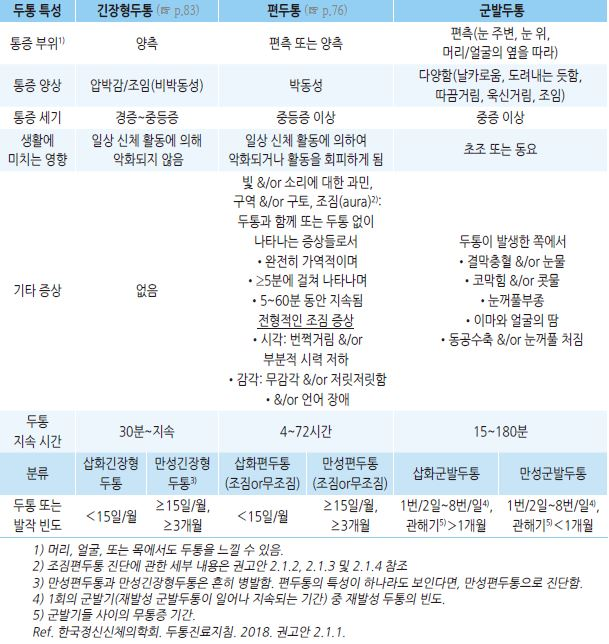
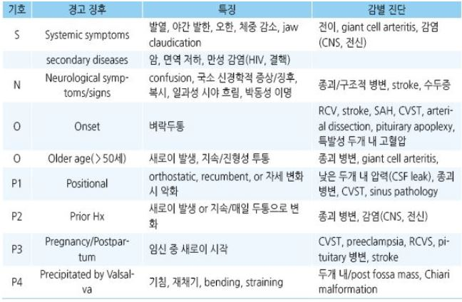
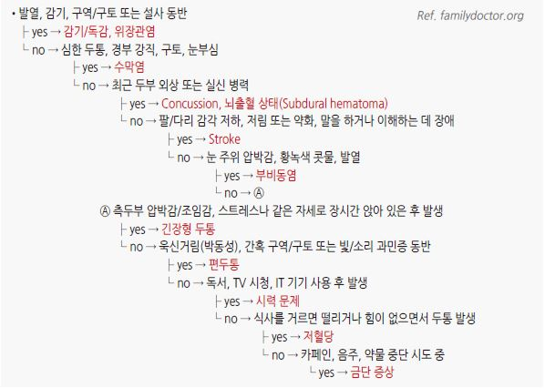

# 두통 Headache

## <mark style="color:green;">일반 사항</mark>

### <mark style="color:$primary;">분류 \[IHS classification ICHD-3]</mark>

1. Migraine
2. Tension type headache(=Ⓗ)
3. Trigeminal autonomic cephalalgias

3.1 Cluster Ⓗ

3.2 Paroxysmal hemicrania

3.3 Short-lasting unilateral neuralgiform Ⓗ attacks

3.4 Hemicrania continua

3.5 Probable trigeminal autonomic cephalalgia

4. Other primary Ⓗ disorders

4.1 Primary cough Ⓗ

4.2 Primary exercise Ⓗ

4.3 Primary Ⓗ associated with sexual activity

4.4 Primary thunderclap Ⓗ

4.5 Cold-stimulus Ⓗ

4.6 External-pressure Ⓗ

4.7 Primary stabbing Ⓗ

4.8 Nummular Ⓗ

4.9 Hypnic Ⓗ

4.10 New daily persistent Ⓗ (NDPH)

5. Ⓗ attributed to trauma or injury to the head and/or neck
6. Ⓗ attributed to cranial or cervical vascular disorder
7. Ⓗ attributed to non-vascular intracranial disorder
8. Ⓗ attributed to a substance or its withdrawal

8.1 Ⓗ attributed to use of or exposure to a substance

8.2 Medication-overuse Ⓗ (MOH)

8.3 Ⓗ attributed to substance withdrawal

9. Ⓗ attributed to infection

9.1 Ⓗ attributed to intracranial infection

9.2 Ⓗ attributed to systemic infection

10. Ⓗ attributed to disorder of homoeostasis

10.1 Ⓗ attributed to hypoxia and/or hypercapnia

10.2 Dialysis Ⓗ

10.3 Ⓗ attributed to arterial hypertension

10.4 Ⓗ attributed to hypothyroidism

10.5 Ⓗ attributed to fasting

10.6 Cardiac cephalalgia

10.7 Ⓗ attributed to other disorder of homoeostasis

11. Ⓗ or facial pain attributed to disorder of the cranium, neck, eyes, ears, nose, sinuses, teeth, mouth or

    other facial or cervical structure

11.1 Ⓗ attributed to disorder of cranial bone

11.2 Ⓗ attributed to disorder of the neck; cervicogenic Ⓗ, retropharyngeal tendonitis, craniocervical dystonia

11.3 Ⓗ attributed to disorder of the eyes: acute angle-closure glaucoma, refractive error, ocular inflammatory disorder, trochlear Ⓗ

11.4 Ⓗ attributed to disorder of the ears

11.5 Ⓗ attributed to disorder of the nose or paranasal sinuses: acute rhinosinusitis, chronic or recurring rhinosinusitis

11.6 Ⓗ attributed to disorder of the teeth

11.7 Ⓗ attributed to temporomandibular disorder

11.8 Head or facial pain attributed to inflammation of the stylohyoid ligament

11.9 Ⓗ or facial pain attributed to other disorder of cranium, neck, eyes, ears, nose, sinuses, teeth, mouth or other facial or cervical structure

12\. Ⓗ attributed to psychiatric disorder: somatization disorder, psychotic disorder

13. Painful lesions of the cranial nerves and other facial pain: trigeminal nerve, glossopharyngeal nerve,

    nervus intermedius

13.4 Occipital neuralgia

13.5 Neck-tongue syndrome

13.6 Painful optic neuritis

13.7 Ⓗ attributed to ischaemic ocular motor nerve palsy

13.8 Tolosa–Hunt syndrome

13.9 Paratrigeminal oculosympathetic (Raeder’s) syndrome

13.10 Recurrent painful ophthalmoplegic neuropathy

13.11 Burning mouth syndrome (BMS)

13.12 Persistent idiopathic facial pain (PIFP)

13.13 Central neuropathic pain

14. Other Ⓗ disorders

14.1 Ⓗ not elsewhere classified

14.2 Ⓗ unspecified

## 일반 사항

* 병력 청취 및 신체검사 수행 → 경고 징후 배제 후 원인 추정 및 관리
* 재발성 두통의 가장 흔한 형태는 편두통과 긴장형두통이며 종종 약물과용두통도 해당됨

### 두통 유발 인자

* 식이 : 술, 초콜릿, 치즈, MSG, 아스파탐, 카페인, 견과류, nitrite
* 호르몬 : 월경, 배란, HRT(progesterone)
* 감각 자극 : 강한 빛/깜박이는 빛, 냄새, 큰 소리/소음
* 스트레스 : let-down period, 강한 활동, 상실감/변화(죽음, 이별, 직장 변화, 이사)
*   습관/환경 변화 : 날씨, 계절, 시차가 큰 여행, 고도 변화,

    출퇴근 시간 변화, 수면 패턴 변화, 식사 패턴 변화, 끼니 거름, 불규칙 생활

### <mark style="color:$danger;">RED FLAGS!</mark>

* 처음으로 느껴보는 심한 수준의 두통
* 갑자기 시작되어 5분 이내에 최고조에 이름
* 열이 나면서 심해짐
* 두통으로 잠에서 깨어남
* 명확한 다른 원인이 없는 구토
* 기침, 발살바 조작, 재채기 시 발생 및 지속
* 운동 중 발생
* 기립성 두통(체위에 따라 변화)
* 두통 양상의 상당한 변화
* 지속되며 점차 악화
* 두부 외상 또는 독성 물질 노출 후 발생
* 최근 3개월 이내 두부 외상 병력
* 의도하지 않은 체중 감소
* 새로 발생한 신경학적 이상, 의식 이상
* 눈의 통증, 시각 이상, 충혈
* 성격의 변화, 새로 발생한 인지기능 장애
* 면역력 저하
* ＜20세에서 발생
* ＞50세에서 새롭게 시작
* 뇌 전이가 가능한 악성 종양 병력
* 치료에 반응하지 않음

## 진단

* vital sign, NEx, 시력 검사(funduscopy 포함)

### 검사

* 경고 징후 또는 기질적 문제가 의심되는 경우 고려; CT, lumbar puncture
* 긴장형두통, 편두통, 군발두통, 또는 약물과용두통으로 이미 진단된 환자들에 대하여 단순히 안심시킬 목적의 뇌영상 검사는 하지 않을 것을 권고 \[한국정신신체의학회]
* 신경학적 검사에서 이상이 없는 새로이 진단된 편두통이나 긴장형두통 환자 또는 만성적으로 안정된 두통 환자에 대한 영상 검사는 적절하지 않음 \[미국영상의학회]

### 환자 자가 평가

* 두통의 원인 진단 및 치료 효과 모니터링을 위하여 고려

#### 두통 일기

* 다음 사항을 (8주간) 기록 (매일 취침 전); '대한두통학회 두통일기' 모바일 앱 활용
  1. 두통의 빈도, 지속 시간 및 강도
  2. 연관되어 나타나는 증상들
  3. 두통 완화를 위해 복용한 모든 약물
  4. 가능한 유발 요인들
  5. 두통과 월경의 연관성

#### HIT-6(Headache impact test, 두통 영향 평가)

1. 두통이 있을 때, 얼마나 자주 통증이 심하다고 느끼시나요?
2. 얼마나 자주 두통 때문에 집안일, 직장일, 학교, 사회활동 등 일상생활에 지장을 받나요?
3. 두통이 있을 때 누워서 쉬고 싶을 때는 얼마나 자주 있습니까?
4. 지난 4주 동안, 얼마나 자주 두통 때문에 일 또는 일상생활을 못할 정도로 자주 피곤했었나요?
5. 지난 4주 동안, 얼마나 자주 두통 때문에 짜증이나 신경질이 났습니까?
6. 지난 4주 동안, 얼마나 자주 두통 때문에 일 또는 일상생활에 집중하기 힘들었습니까?
7. 통증, 사회 기능, 역할 기능, 인지 기능, 심리적인 고통, 활력도를 평가하는 6가지 문항

각 답변에 따라 아래와 같은 점수를 배정하여 합산(최저 점수-36점, 최고 점수-78점)

* 전혀 그렇지 않다 (Never): 6점
* 드물게 그렇다 (Rarely): 8점
* 가끔 그렇다 (Sometimes): 10점
* 자주 그렇다 (Very often): 11점
* 항상 그렇다 (Always): 13점

※ 총 점수가 50점 이상이면 두통으로 인한 영향이 큼

_<mark style="color:$info;">Ref. 대한두통학회. 편두통 예방치료 약제 진료지침. 2021. 부록</mark>_

### 감별

<figure><figcaption></figcaption></figure>

***

* 급성 녹내장 : 눈의 통증, 시야 혼탁, 구역/구토, 빛 주위 halo; 안과 응급
* 지주막하출혈 : 폭발적인 심한 두통
* **※ Ottawa SAH clinical decision rule**
  * 적용 대상 : ≥15세, 새로운 중증 비외상성 두통, 발생 1시간 이내에 최대 강도 도달
  * 적용 제외 : 새로운 신경학적 결손 환자, 이전 동맥류, 이전 SAH, 알려진 뇌종양 또는 만성 반복성 두통(＞6개월 동안 동일한 성격과 강도의 3개 이상의 두통)
  * Rule : 적용 대상에 해당되면서 다음 중 하나라도 있으면 SAH 의심; ① ≥40세, ② 경부 통증 또는 뻣뻣함, ③ 관찰된 의식 소실, ④ 힘든 작업 후 발생, ⑤ 벼락이 치는 듯한 두통(1초 내 최고조 통증), ⑥ 신체검사상 목 굴절 제한
* 급만성 경막하혈종 : 외상 경력; 의식 변화, 신경학적 장애
* Encephalitis : 신경학적 이상, 혼동, 의식 변화
* Meningitis : 발열, 뇌막 자극 증상
* Intracranial neoplasm : 점차 진행; 깨어 있을 때 심함; 기침, 긴장 or 자세 변화 시 악화
* Temporal arteritis : ＞50세, 두피 or 측두동맥 압통, jaw claudication, 시각 변화
* Temporomandibular joint disorder : TMJ pain & tender; 저작 시 악화
* Trigeminal neuralgia : 삼차신경 분포 부위(측두부, 귀 앞, 하악)의 날카롭고 찌르는 듯한 통증
* 급성 중증 고혈압 : SBP ＞210 ㎜Hg or DBP ＞120 ㎜Hg, 혼란, 과민
* 일산화탄소 중독 : 서서히 진행, 추운 날; 호흡곤란
* Cervical spondylosis : 주로 후두부, 때로 vertex 두통(neuralgia); 목의 움직임으로 악화; 고령
* 부비동염 : 코막힘, 부비동 압통; 누워 있을 때 심함

#### 두통의 2차 원인 감별을 위한 SNOOP4

<figure><figcaption></figcaption></figure>

_<mark style="color:$info;">RCV=reversible cerebral vasoconstriction syndrome; CVST=cerebral venous sinus thrombosis</mark>_

_<mark style="color:$info;">Ref. Dodick. Diagnosing secondary and primary headache disorders. Continuum (Minneap Minn). 2021. Table 1-1.</mark>_

***

<figure><figcaption></figcaption></figure>

***

### <mark style="color:purple;">**질병코드**</mark>

R51 두통

G44 기타 두통증후군&#x20;

G44.0 군발두통증후군
