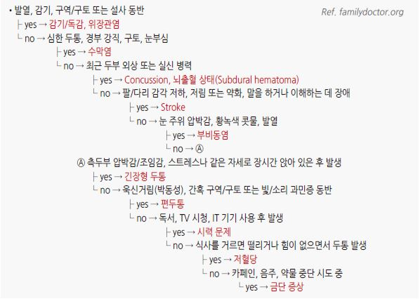

# 두통 Headache

## <mark style="color:green;">일반 사항</mark>

* 두통은 1차 진료에서 가장 흔한 주소 중 하나로, 병력 청취 및 신체검사를 통해 경고 징후를 먼저 배제한 후 원인을 추정하고 관리
* 재발성 두통의 가장 흔한 형태는 [편두통](016_-migraine.md)과 [긴장형두통](017_-tension-type-headache-ttha.md)이며, 종종 [약물과용두통](018_-chronic-headache.md#medication-overuse-headache-moh)도 해당됨
* 편두통은 전 세계 장애 원인 2위 질환으로, 1차 진료에서 저평가·저치료되는 경향이 있음
* 두통 평가 시 SNOOP 계열의 경고 징후를 활용하여 2차 두통을 체계적으로 배제할 것을 권고

### <mark style="color:orange;">분류 \[IHS classification ICHD-3]</mark>

**1차성 두통(Primary headache)**

* Migraine (편두통)
* Tension-type headache (긴장형두통)
* Trigeminal autonomic cephalalgias (삼차자율신경두통) — 군발두통(cluster headache), paroxysmal hemicrania, SUNCT/SUNA, hemicrania continua 등
* Other primary headache disorders (기타 1차성 두통) — primary cough/exercise/sexual activity headache, primary thunderclap headache, hypnic headache, new daily persistent headache(NDPH) 등
  * ✽primary thunderclap headache는 SAH, RCVS, CVST, 동맥박리 등 이차성 원인을 충분히 배제한 후에만 진단

**2차성 두통(Secondary headache)**

* 두부·경부 외상
* 두개·경부 혈관 질환(뇌졸중, RCVS, CVST, 동맥박리 등)
* 비혈관성 두개내 질환(종양, IIH, 뇌압 이상 등)
* 약물 또는 금단(약물과용두통 포함)
* 감염(두개내 또는 전신)
* 항상성 장애(저산소증, 고혈압, 갑상선기능저하 등)
* 두개·경부·안구·이비인후·치아 등 인접 구조 질환(경추성두통, 부비동염, TMJ 장애, 녹내장 등)

**두개신경통 및 안면통(Painful cranial neuropathies and other facial pains)**

* 삼차신경통, 설인신경통, 후두신경통 등

✽전체 세부 분류는 ICHD-3 (International Classification of Headache Disorders, 3rd edition) 원문 참조

### <mark style="color:orange;">두통 유발 인자</mark>

* 식이 : 술, 초콜릿, 치즈, MSG, 아스파탐, 카페인, 견과류, nitrite
* 호르몬 변화 : 월경, 배란, 외인성 호르몬의 시작·중단 또는 변동
* 감각 자극 : 강한 빛/깜박이는 빛, 냄새, 큰 소리/소음
* 스트레스 : let-down period, 강한 활동, 상실감/변화(죽음, 이별, 직장 변화, 이사)
* 습관/환경 변화 : 날씨, 계절, 시차가 큰 여행, 고도 변화, 출퇴근 시간 변화, 수면 패턴 변화(수면 부족 및 과다 모두), 식사 패턴 변화, 끼니 거름, 불규칙 생활
* 탈수

✽유발 인자는 개인별 차이가 크므로 불필요한 일률적 제한보다는 두통 일기를 통해 실제 연관성을 확인

### <mark style="color:$danger;">🚩 Red Flags!</mark>

<mark style="color:$danger;">**즉각 응급 조치 및 이송**</mark>

* **벼락두통(thunderclap headache)** : 갑작스럽게 시작하여 **1분 미만에 최대 강도에 도달**하는 심한 두통 → SAH뿐 아니라 RCVS, CVST, 뇌동맥박리, 뇌내출혈, pituitary apoplexy 등 이차성 원인 긴급 배제
* 발열·경부 강직·의식 변화 동반 → 수막염, 뇌염 의심
* 새로 발생한 신경학적 결손(편마비, 언어 장애, 복시, 의식 저하 등)
* 눈의 심한 통증·시야 혼탁·충혈 동반 → 급성 폐쇄각녹내장 의심; 안과 응급
* 중등도\~중증 두부 외상 직후 발생하거나 외상 후 의식 변화·신경학적 이상과 함께 급격히 악화

<mark style="color:$warning;">**당일 또는 조기 긴급 평가**</mark>

* ＞50세의 새 두통에 **jaw claudication, 두피/측두동맥 압통, ESR/CRP 상승 의심, 일시적 시력상실·복시 등**이 동반 → 거대세포동맥염(GCA) 우선 배제; 시각 증상 동반 시 특히 긴급
* 기침·발살바 조작·운동·성행위로 새로 유발되는 두통
* 뚜렷한 체위성 두통(기립 시 악화 또는 누울 때 현저히 악화)
* 면역 저하 환자(HIV, 면역억제제·스테로이드 장기 복용 등)의 새로운 두통
* 악성 종양 병력이 있는 환자의 새로 발생한 진행성 두통 → 뇌전이·암성 수막염(leptomeningeal metastasis) 감별
* 임신 중 또는 산후 새로 발생한 심한 두통 → 자간전증/자간증, CVST, RCVS, pituitary 병변 등 감별
* 새로 발생하거나 기존과 다른 국소 신경학적 증상, 또는 전조(aura)가 통상적인 **5\~60분 범위를 벗어나 지속** → 뇌졸중/TIA 등 이차성 원인 우선 감별

<mark style="color:$info;">**외래 추적 / 추가 평가 계획 (수일 내 외래)**</mark>

* 두통 양상의 상당한 변화 또는 점진적 악화
* ＞50세에서 새로 발생한 두통(상기 GCA/신경학적 위험 징후가 없는 경우)
* 새로 발생한 야간/기상 시 두통이 반복되거나 점차 악화됨; 특히 구토·유두부종·신경학적 이상이 동반되면 조기 영상검사 고려
* 의도하지 않은 체중 감소 동반
* 성격 변화 또는 새로 발생한 인지기능 장애
* 적절한 기존 치료에도 반응하지 않음
* 최근 두부 외상 후 지속되거나 악화되는 두통

## <mark style="color:green;">진단</mark>

* 활력징후(혈압 포함), 신경학적 검사, 시력 검사(funduscopy 포함)

### <mark style="color:orange;">검사</mark>

* 경고 징후 또는 기질적 문제가 의심되는 경우 원인과 임상 상황에 따라 CT, MRI, 혈관영상(CTA/MRA, CTV/MRV), lumbar puncture를 선택
  * **벼락두통** : 우선 비조영 뇌 CT로 SAH를 평가. 발병 **6시간 이내** 적절한 CT + 정상 신경학적 검사이면 SAH 가능성이 매우 낮지만, 발병 **6시간 이후** CT 음성이거나 임상적 의심이 지속되면 LP 또는 추가 혈관영상 여부를 판단
  * **RCVS 의심**(반복되는 벼락두통 등) : CTA 또는 MRA로 뇌혈관 평가; 초기 혈관영상이 정상일 수 있어 필요 시 추적 검사
  * **CVST 의심**(임신·산후, 혈전 위험, 유두부종/두개내압상승 등) : CTV 또는 MRV로 정맥동 평가
  * MRI는 종괴, 후두와 병변, 뇌하수체 병변, 뇌막/염증성 병변 등 구조적 원인 평가에 유용
* 긴장형두통, 편두통, 군발두통, 또는 약물과용두통으로 이미 진단된 환자에서 단순히 안심시킬 목적의 뇌영상 검사는 권고하지 않음 \[한국정신신체의학회]
* 신경학적 검사에서 이상이 없는 새로이 진단된 편두통이나 긴장형두통 환자, 또는 만성적으로 안정된 두통 환자에 대한 영상 검사는 적절하지 않음 \[미국영상의학회]

### <mark style="color:orange;">환자 자가 평가</mark>

* 두통의 원인 진단 및 치료 효과 모니터링을 위하여 고려

#### <mark style="color:$primary;">두통 일기</mark>

* 다음 사항을 (8주간) 기록 (매일 취침 전); '대한두통학회 두통일기' 모바일 앱 활용
  1. 두통의 빈도, 지속 시간 및 강도
  2. 연관되어 나타나는 증상들
  3. 두통 완화를 위해 복용한 모든 약물
  4. 가능한 유발 요인들
  5. 두통과 월경의 연관성

#### <mark style="color:$primary;">HIT-6 (Headache Impact Test, 두통 영향 평가)</mark>

* 통증, 사회 기능, 역할 기능, 인지 기능, 심리적 고통, 활력도를 평가하는 6가지 문항
* 각 답변에 따라 점수를 배정하여 합산(최저 36점\~최고 78점)
  * 36\~49점 : 영향이 없거나 경미
  * 50\~55점 : 중등도 영향
  * 56\~59점 : 상당한 영향
  * 60\~78점 : 심각한 영향
* HIT-6는 두통으로 인한 기능 장애 정도를 정량화하는 도구이며, **예방치료 여부는 HIT-6 단일 cutoff가 아니라 월 두통일수·기능장애·급성기 치료 반응·환자 선호 등을 종합하여 결정**

**문항**

1. 두통이 있을 때, 얼마나 자주 통증이 심하다고 느끼시나요?
2. 얼마나 자주 두통 때문에 집안일, 직장일, 학교, 사회활동 등 일상생활에 지장을 받나요?
3. 두통이 있을 때 누워서 쉬고 싶을 때는 얼마나 자주 있습니까?
4. 지난 4주 동안, 얼마나 자주 두통 때문에 일 또는 일상생활을 못할 정도로 피곤했었나요?
5. 지난 4주 동안, 얼마나 자주 두통 때문에 짜증이나 신경질이 났습니까?
6. 지난 4주 동안, 얼마나 자주 두통 때문에 일 또는 일상생활에 집중하기 힘들었습니까?
* 답변 및 점수 : 전혀 그렇지 않다(never)=6점, 드물게 그렇다(rarely)=8점, 가끔 그렇다 (sometimes)=10점, 자주 그렇다(very often)=11점, 항상 그렇다(always)=13점

_<mark style="color:$info;">Ref. 대한두통학회. 편두통 예방치료 약제 진료지침. 2021. 부록</mark>_

### <mark style="color:orange;">감별</mark>

<table><thead><tr><th>두통 특성</th><th>우선 고려 진단</th></tr></thead><tbody><tr><td>양측·압박감, 경증\~중등도, 구역·구토 없음</td><td><a href="017_-tension-type-headache-ttha.md">긴장형두통</a></td></tr><tr><td>편측 또는 양측·박동성, 구역/빛·소리공포, 4\~72시간</td><td><a href="016_-migraine.md">편두통</a></td></tr><tr><td>≥15일/월, &gt;3개월 지속</td><td><a href="018_-chronic-headache.md">만성 두통</a> — 만성편두통·만성긴장형두통·MOH 감별</td></tr><tr><td>편측·극심, 눈 주변, 눈물/콧물, 15\~180분</td><td>군발두통</td></tr><tr><td>단측, 경부 움직임으로 유발, ROM 감소</td><td><a href="019_-cervicogenic-headache.md">경추성두통</a></td></tr><tr><td>갑작스럽게 시작하여 1분 미만에 최고조</td><td>벼락두통 → SAH/RCVS 등 즉각 응급 평가</td></tr><tr><td>발열·경부 강직·의식 변화</td><td>수막염·뇌염 → 즉각 응급</td></tr></tbody></table>

<table><thead><tr><th width="104">두통 특성</th><th width="155">긴장형두통</th><th>편두통</th><th>군발두통</th></tr></thead><tbody><tr><td><strong>통증 부위</strong>¹⁾</td><td>양측</td><td>편측 또는 양측</td><td>편측(눈 주변, 눈 위, 머리/얼굴의 옆을 따라)</td></tr><tr><td><strong>통증 양상</strong></td><td>압박감/조임(비박동성)</td><td>박동성</td><td>극심한 piercing/burning; 초조(agitation) 동반</td></tr><tr><td><strong>통증 세기</strong></td><td>경증\~중등증</td><td>중등증 이상</td><td>중증 이상</td></tr><tr><td><strong>생활에 미치는 영향</strong></td><td>일상 신체 활동에 의해 악화되지 않음</td><td>일상 신체 활동에 의하여 악화되거나 활동을 회피하게 됨</td><td>초조 또는 동요</td></tr><tr><td><strong>기타 증상</strong></td><td>구역·구토 없음; photophobia 또는 phonophobia 중 하나는 동반 가능</td><td>빛 &#x26;/or 소리에 대한 과민, 구역 &#x26;/or 구토, 조짐(aura)²⁾: 두통과 함께 또는 두통 없이 나타나는 증상들로서 •완전히 가역적이며 •≥5분에 걸쳐 나타나며 •5\~60분 동안 지속됨; <strong>전형적인 조짐 증상</strong> •시각: 번쩍거림 &#x26;/or 부분적 시력 저하 •감각: 무감각 &#x26;/or 저릿저릿함 •&#x26;/or 언어 장애</td><td>두통이 발생한 쪽에서 •결막충혈 &#x26;/or 눈물 •코막힘 &#x26;/or 콧물 •눈꺼풀부종 •이마와 얼굴의 땀 •동공수축 &#x26;/or 눈꺼풀 처짐</td></tr><tr><td><strong>두통 지속 시간</strong></td><td>30분\~7일</td><td>4\~72시간</td><td>15\~180분</td></tr></tbody></table>

**두통 또는 발작 빈도**\
\*긴장형 두통 : 삽화긴장형 두통 - ＜15일/월; 만성긴장형 두통3) - ≥15일/월, ≥3개월\
\*편두통 : 삽화편두통 (조짐or무조짐) - ＜15일/월; **만성편두통** - ≥15일/월이 ＞3개월 지속되며, 그중 ≥8일/월은 편두통 특징을 충족\
\*군발두통 : 삽화군발두통 - 1번/2일\~8번/일4), 군발기 사이 관해기5) ≥3개월; 만성군발두통 - 1년 이상 지속하면서 관해기가 없거나 각 관해기가 ＜3개월

> 1\) 머리, 얼굴, 또는 목에서도 두통을 느낄 수 있음.\
> 2\) 조짐편두통 진단에 관한 세부 내용은 권고안 2.1.2, 2.1.3 및 2.1.4 참조.\
> 3\) 만성두통에서는 편두통 특징이 나타나는 날의 빈도와 양상을 확인하여 만성편두통과 만성긴장형두통을 구분하고, 약물과용 여부도 함께 평가. 자세한 기준은 [만성 두통](018_-chronic-headache.md) 및 [편두통](016_-migraine.md) 챕터 참조.\
> 4\) 1회의 군발기(삽화성 군발두통이 일어나 지속되는 기간) 중 재발성 두통의 빈도.\
> 5\) 군발기들 사이의 무통증 기간.

***

* 급성 녹내장 : 눈의 통증, 시야 혼탁, 구역/구토, 빛 주위 halo; 안과 응급
* 지주막하출혈 : 폭발적인 심한 두통(벼락두통)


**Ottawa SAH Clinical Decision Rule**

* 적용 대상 : ≥15세, 새로운 중증 비외상성 두통, 발생 1시간 이내에 최대 강도 도달
* 적용 제외 : 새로운 신경학적 결손, 이전 동맥류·SAH 병력, 알려진 뇌종양, 만성 반복성 두통(＞6개월 동안 동일한 성격과 강도의 두통이 3회 이상)
* Rule : 적용 대상에 해당되면서 다음 중 하나라도 있으면 **SAH를 배제할 수 없는 고위험군 → 즉시 비조영 뇌 CT로 평가**. CT 음성 후 LP 또는 CTA 등 추가 검사는 발병 시점·CT 질·임상 의심도에 따라 결정 : ⓵ ≥40세, ⓶ 경부 통증 또는 뻣뻣함, ⓷ 관찰된 의식 소실, ⓸ 힘든 작업 후 발생, ⓹ 벼락두통, ⓺ 신체검사상 목 굴절 제한


* 급·만성 경막하혈종 : 외상 경력; 의식 변화, 신경학적 장애
* Encephalitis : 신경학적 이상, 혼동, 의식 변화
* Meningitis : 발열, 경부 강직, 뇌막 자극 증상
* Intracranial neoplasm : 점차 진행; 깨어 있을 때 심함; 기침·긴장·자세 변화 시 악화
* Temporal arteritis(거대세포 동맥염) : ＞50세, 두피 or 측두동맥 압통, 턱 파행(jaw claudication; 씹을 때 턱 통증), 시각 변화; 일시적 시력 상실(amaurosis fugax) 여부를 반드시 확인 - 치료 지연 시 영구 실명 위험
* Temporomandibular joint disorder : TMJ 통증 및 압통; 저작 시 악화
* Trigeminal neuralgia : 삼차신경 분포 부위(측두부, 귀 앞, 하악)의 날카롭고 찌르는 듯한 통증
* 고혈압 응급(hypertensive emergency) : SBP ≥180 ㎜Hg or DBP ≥120 ㎜Hg에 end-organ damage(뇌병증, 망막병증, 신부전, 심부전 등) 동반 시 두통 발생 가능; 단순 수치만으로 두통 원인을 단정하지 않도록 주의
* 일산화탄소 중독 : 서서히 진행, 추운 날; 호흡곤란 동반
* [경추성두통](019_-cervicogenic-headache.md)(Cervicogenic headache) : 주로 후두부, 때로 vertex 두통; 목의 움직임으로 악화; cervical spondylosis·관절 병변·근육 병변 등이 원인
* 부비동염 : 코막힘, 부비동 압통; 누워 있을 때 심함
* 유두부종(Papilledema) : funduscopy에서 시신경 유두 경계 불명확·융기 확인 시 뇌압 상승 시사; 특발성 두개 내 고혈압(IIH), 두개 내 종양, 뇌수두증 감별 → 즉시 영상 검사

#### <mark style="color:$primary;">두통의 2차 원인 감별을 위한 SNOOP 계열 Red Flags</mark>

<table><thead><tr><th width="57.578948974609375">기호</th><th>경고 징후</th><th>특징</th><th>감별 진단</th></tr></thead><tbody><tr><td>S</td><td>Systemic symptoms</td><td>발열, 야간 발한, 오한, 체중 감소, jaw claudication</td><td>거대세포 동맥염(giant cell arteritis), 감염(CNS, 전신)</td></tr><tr><td></td><td>secondary diseases</td><td>암, 면역 저하, 만성 감염(HIV, 결핵)</td><td></td></tr><tr><td>N</td><td>Neurological symptoms/signs</td><td>confusion, 국소 신경학적 증상/징후, 복시, 일과성 시야 흐림, 박동성 이명, <strong>유두부종(papilledema)</strong></td><td>종괴/구조적 병변, stroke, 수두증, IIH</td></tr><tr><td>O</td><td>Onset</td><td>벼락두통</td><td>RCVS, stroke, SAH, CVST, arterial dissection, pituitary apoplexy, 특발성 두개  내 고혈압</td></tr><tr><td>O</td><td>Older age (＞50세)</td><td>새로이 발생, 지속/진행성 두통</td><td>종괴 병변, giant cell arteritis</td></tr><tr><td>P1</td><td>Positional</td><td>orthostatic, recumbent, or 자세 변화 시 악화</td><td>낮은 두개 내 압력(CSF leak), 종괴 병변, CVST, sinus pathology</td></tr><tr><td>P2</td><td>Prior Hx</td><td>새로이 발생 or 지속/매일 두통으로 변화</td><td>종괴 병변, 감염(CNS, 전신)</td></tr><tr><td>P3</td><td>Pregnancy/Postpartum</td><td>임신 중 새로이 시작</td><td>CVST, preeclampsia, RCVS, pituitary 병변, stroke</td></tr><tr><td>P4</td><td>Precipitated by Valsalva</td><td>기침, 재채기, bending, straining</td><td>두개 내/post fossa mass, Chiari malformation</td></tr></tbody></table>

_<mark style="color:$info;">RCVS=reversible cerebral vasoconstriction syndrome; CVST=cerebral venous sinus thrombosis</mark>_

※ **RCVS(가역적 뇌혈관수축증후군) 주의**\
벼락두통이 수일\~수주에 걸쳐 **반복**되는 경우 RCVS를 적극 고려한다. SAH와 임상 양상이 유사하며, 초기 CT·요추천자가 음성인 경우가 많으나 일부에서는 convexity SAH가 동반될 수 있어 음성 결과만으로 배제하지 않도록 주의한다. 반복적 벼락두통이 있으면 MRA 또는 CTA로 뇌혈관 수축 패턴을 확인하고, 초기 정상이더라도 추적 검사가 필요하다. 출산 후, 세로토닌 작용제(트립탄·SSRI) 복용 중, 또는 혈관 수축성 약물(코카인, 비충혈제거제) 사용 시 호발한다.

_<mark style="color:$info;">Ref. Dodick. Diagnosing secondary and primary headache disorders. Continuum (Minneap Minn). 2021. Table 1-1.</mark>_

***

<figure><figcaption>두통 진단 알고리듬</figcaption></figure>

***

## <mark style="background-color:$warning;">Management</mark>

### <mark style="color:orange;">치료 원칙</mark>

* 이 챕터는 두통의 **초기 분류와 이차성 원인 배제**를 중심으로 하며, 일차성 두통의 상세 약물 선택은 각 질환별 챕터를 참조
  * [편두통](016_-migraine.md)
  * [긴장형두통](017_-tension-type-headache-ttha.md)
  * [만성 두통 및 약물과용두통](018_-chronic-headache.md)
  * [경추성두통](019_-cervicogenic-headache.md)
* 급성기 치료는 가능한 한 두통 초기에 시행하고, 반복적 진통제 사용 시 약물과용두통(MOH) 위험을 항상 확인
* **MOH 진단의 핵심** : 기존 두통 환자에서 두통이 ≥15일/월이고, 급성기/증상완화 약물의 규정된 과용이 **＞3개월** 지속
  * 단순 진통제·NSAIDs 등 non-opioid analgesic : ≥15일/월
  * triptan·복합진통제 등 : ≥10일/월
* 환자 교육 시에는 경계값을 넘지 않도록 **단순 진통제·NSAIDs는 월 15일 미만, triptan·복합진통제는 월 10일 미만**으로 사용하도록 설명

### <mark style="color:orange;">군발두통 치료 요약</mark>

* 군발두통은 통증이 매우 심하고 발작 빈도가 높아 진단 시 신경과/두통 전문진료를 고려
* 급성 발작 : **100% 산소(고유량, 일반적으로 ≥12 L/min 약 15분)** 또는 **sumatriptan 6 mg SC**가 대표적 1차 치료
* 예방 : **verapamil**이 대표적 1차 예방약; 심전도 모니터링과 단계적 증량이 필요하므로 전문진료 권장
* 세부 치료는 환자 특성·금기·국내 허가/급여를 확인하여 결정

### <mark style="color:orange;">예방치료 적응증</mark>

주로 편두통에서 다음과 같은 경우 예방치료를 고려하며, 단일 수치보다 두통 빈도·기능장애·급성기 치료 반응·환자 선호를 종합한다.

* 빈번한 두통(예: 편두통 ≥4일/월)
* 두통으로 인한 기능 장애가 중등도 이상이거나 일상생활이 현저히 제한됨
* 급성기 치료 반응이 불충분하거나 금기/부작용이 있음
* 급성기 약물 사용이 잦아 MOH 위험이 높거나 MOH가 반복됨

> 예방치료 목표는 두통 빈도·강도와 기능장애를 의미 있게 감소시키는 것이며, 일반적으로 충분한 용량으로 2\~3개월 이상 사용 후 효과를 평가한다. 구체적인 예방 약제 선택은 [편두통](016_-migraine.md) 및 각 질환별 챕터 참조.


**CGRP 경로 표적 치료제**\
항-CGRP/CGRP receptor 단클론항체 및 예방용 gepant는 국제 가이드라인에서 기존 예방약 실패를 반드시 선행조건으로 요구하지 않는 편두통 예방치료 선택지로 인정되고 있다. 다만 **국내 허가·급여 기준은 별도**이므로 실제 처방 시 최신 기준을 확인한다. 상세 약제 선택은 [편두통](016_-migraine.md) 챕터 참조.


***

### <mark style="color:red;">질병코드</mark>

R51 두통

G44 기타 두통증후군

G44.0 군발두통증후군

✽편두통·긴장형두통·약물과용두통 등 세부 코드는 각 질환별 챕터 및 최신 KCD 기준을 확인

***

### <mark style="color:$success;">핵심 복약 지도</mark>

* 급성기 진통제는 두통 초기에 복용하되, **단순 진통제·NSAIDs는 월 15일 미만**, **triptan·복합진통제는 월 10일 미만**으로 제한하도록 교육
* 진통제 사용일수가 증가하거나 두통이 ≥15일/월로 늘면 약물과용두통 여부를 평가
* 예방약은 즉효성 약물이 아니므로 충분한 기간 복용 후 효과를 판단하고, 임의로 중단하지 않도록 설명
* 갑작스럽게 1분 미만에 최고조에 이르는 두통, 발열·경부강직·의식 변화, 새 신경학적 결손이 동반되면 즉시 응급실 평가

***

### <mark style="color:blue;">환자 안내서</mark>


**두통, 언제 걱정해야 할까요?**

대부분의 반복성 두통은 편두통이나 긴장형두통 같은 일차성 두통이지만, 일부는 즉각적인 치료가 필요한 위험 신호일 수 있습니다.


#### <mark style="color:$primary;">즉시 응급실로 가야 하는 두통</mark>

* 갑자기 시작하여 **1분 미만에 최고조에 이르는 매우 심한 두통**
* 두통과 함께 발열·목 뻣뻣함·의식 저하·팔다리 마비·언어 장애·복시가 동반되는 경우
* 두부 외상 후 의식 변화, 반복 구토, 팔다리 힘 빠짐과 함께 두통이 악화되는 경우
* 심한 눈 통증과 충혈·시야 흐림이 함께 발생하는 경우

#### <mark style="color:$primary;">진통제 복용 시 꼭 지켜주세요</mark>

* 진통제는 두통이 시작된 초기에 복용하는 것이 효과적입니다.
* 단순 진통제·소염진통제는 **한 달 15일 미만**, triptan이나 복합진통제는 **한 달 10일 미만**으로 사용하십시오.
* 진통제를 자주 복용할수록 두통이 더 잦아지는 **약물과용두통**이 생길 수 있습니다. 복용일수가 늘면 진료 시 반드시 알려주십시오.

#### <mark style="color:$primary;">두통을 줄이는 생활 습관</mark>

* 규칙적인 수면과 식사 시간을 유지하고 끼니를 거르지 마십시오.
* 탈수를 피하고, 카페인은 과도하게 섭취하거나 갑자기 끊지 말고 일정한 섭취 패턴을 유지하십시오.
* 규칙적인 유산소 운동과 목·어깨 스트레칭을 시행하십시오.
* 두통의 빈도, 지속 시간, 동반 증상, 약물 사용일수, 가능한 유발요인을 **두통 일기**에 기록하십시오.
* 군발두통으로 진단받은 환자는 **군발기(cluster period) 동안 알코올이 발작을 유발할 수 있으므로 피하는 것이 좋습니다.**
