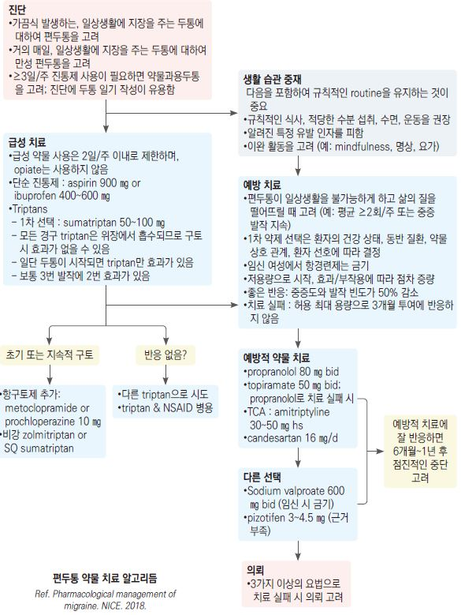

# 편두통 Migraine

## <mark style="color:green;">일반 사항</mark>

* 4\~72시간 동안 지속되고 일상적 활동에 의해 악화되며 일상생활에 지장을 주는 편측성, 박동성의 심한 두통
* 동반 증상 : 구역, 구토, 빛/큰소리 공포, 어지럼증, 근육 압통, 수분 저류(부종), 감정 변화
* 30\~40%에서 양측성, 40%에서 비박동성 두통 양상을 보임
* 유병률 : 8\~17%(우리나라), 20\~50대 여성에서 가장 흔함
* 1년에 1회\~1주에 수회 빈도로 재발
* 연령이 증가하면서 강도와 빈도가 감소할 수 있음
* 조짐(aura) : 편두통 환자의 20%에서 발생; 보통 5\~60분 지속 후 두통 발생; 운동 관련 조짐은 최대 72시간까지 지속 가능

※ **기존 편두통 환자라도 다음의 경우 2차 두통 감별이 필요**

* 평소와 확연히 다른 두통 양상 또는 급격한 악화
* 전조(aura)가 60분 이상 지속 → 뇌졸중·TIA 감별, 신경과 의뢰 고려
* 운동 조짐(편마비 등)이 새로 발생하거나 이전보다 심해진 경우

### <mark style="color:$danger;">🚩 Red Flags!</mark>

☞ [두통 Red Flags 참조](015_-headache.md#red-flags)

### <mark style="color:orange;">분류 \[IHS classification ICHD-3]</mark>

1. Migraine without aura
2. Migraine with aura
   * 2.1 Migraine with typical aura
     * 2.1.1 Migraine with typical aura with headache
     * 2.1.2 Migraine with typical aura without headache
   * 2.2 Migraine with brainstem aura
   * 2.3 Hemiplegic migraine
     * 2.3.1 Familial hemiplegic migraine
     * 2.3.2 Sporadic hemiplegic migraine
   * 2.4 Retinal migraine
3. Chronic migraine
4. Complications of migraine
5. Probable migraine
6. Episodic syndromes that may be associated with migraine
   * 6.1 Recurrent gastrointestinal disturbance
     * 6.1.1 Cyclical vomiting syndrome
     * 6.1.2 Abdominal migraine
   * 6.2 Benign paroxysmal vertigo
   * 6.3 Benign paroxysmal torticollis

* 월경편두통(Menstrual migraine) : 월경 -2일\~+3일에 발생, 최소 3주기 중 2주기 발생; 월경 중 다른 날에는 발생 안 함
* Status migrainosus : ＞72시간 지속되는 심한 편두통

### <mark style="color:orange;">만성 편두통</mark>

* ＞3개월 동안 ≥15일/월 발생하는 편두통
* 흔히 정신적 문제, 수면 문제, 피로, 다른 통증, 소화 장애, 뇌혈관/심혈관 질환 등을 동반

## <mark style="color:green;">원인</mark>

* trigeminovascular hypothesis : 뇌간에서의 삼차신경 뉴런 과민 → 신경 전달 물질(substance P, CGRP) 분비 → 혈관 확장, 신경인성 염증

✽ 1차적인 혈관 문제는 원인으로 고려되지 않음

### <mark style="color:orange;">위험 인자</mark>

* 가족력 : 환자의 >80%에서 편두통의 가족력이 있음
* 여성 (20\~50대에서 호발)

### <mark style="color:orange;">유발 인자</mark>

* 스트레스, 정서적 변화
* 수면 변화 (부족 및 과다 모두)
* 월경/호르몬 변화
* 공복, 식사 거름 (>4시간 공복)
* 날씨/기압 변화, 높은 고도
* 음식 (아래 목록 참조), 알코올 (특히 적포도주)
* 탈수
* 빛 자극 : 밝은 빛, 형광 빛, 깜박이는 빛
* 소음, 강한 냄새 (향수), 공기 오염
* 약물 : estrogen, 피임제, 혈관 확장제(nitrate), 니코틴

**유발 음식**

* 유제품 : 숙성 치즈(cheddar, brie, camembert), sour cream
* 육류/생선 : 가공육, 소시지, 닭 간, 절임/훈제 청어
* 과일 : 바나나, 건포도, 무화과, 아보카도, 밀감류
* 채소 : 잠두, 완두, 양파, 마늘
* 초콜릿, 견과류, 땅콩버터, 효모 빵, 훈제 음식, 중국식 음식
* 음료 : 술(와인, 증류주), 카페인(＞200 ㎎/d 과다 섭취 또는 갑작스런 중단)
* 첨가제 : MSG, 간장, 고기 연육제, 인공 감미료(아스파탐, sucralose)

## <mark style="color:green;">임상 양상 및 진단</mark>

* 편두통을 확진하는 검사 방법은 없음; 필요시 다른 질환 감별을 위한 검사 시행
* 신경학적 검사 시행 : 보행, 대/소근육 운동 기능, mental status, 단기 기억력, papilledema
* 영상 검사 : 일률적인 영상 검사는 권고하지 않음; 경고 징후에 해당되는 경우 고려
* 설문지 작성 : 통증의 수준과 장애 정도 및 치료 경과 파악; MIDAS
* 편두통 vs 긴장형두통 감별 ☞ [긴장형두통](017_-tension-type-headache-ttha.md#vs)

**MIDAS (Migraine Disability Assessment Test, 편두통 장애 평가 검사)**

⑴ 지난 3개월 동안 두통 때문에 학교 또는 직장에서

* 결근/결석 한 날이 며칠이나 됩니까?
* 출근/출석은 하였으나 작업 또는 학업 능률이 절반 이하로 감소한 날이 며칠이나 됩니까?

⑵ 지난 3개월 동안 두통 때문에 집안에서

* 어떤 가사일도 할 수 없었던 날이 며칠이나 됩니까?
* 가사일을 하기는 하였으나 작업 능률이 평소의 절반 이하로 감소한 날이 며칠이나 됩니까?

⑶ 지난 3개월 동안 두통 때문에 친족/친구 기타 모임이나 여가 활동에 참가할 수 없었던 날이 며칠이나 됩니까?

▸판정(각 문항 답변 일수의 합계) : 0\~5일(MIDAS Ⅰ)=장애가 없거나 미약; 6\~10일(MIDAS Ⅱ)=경도 장애; 11\~20일(MIDAS Ⅲ)=중등도 장애; ≥21일(MIDAS Ⅳ)=심도 장애

#### <mark style="color:$primary;">Migraine without aura (무조짐 편두통)</mark>

A. 아래 진단 기준 B\~D를 충족하는 발작이 최소한 5번 발생¹⁾

B. 두통 발작이 (치료하지 않거나 치료가 제대로 되지 않았을 때) 4\~72시간 지속²⁾

C. 다음 네 가지 두통의 특성 중 ≥2가지 해당

⓵ 편측 위치\
⓶ 박동 양상\
⓷ 중등증 또는 중증의 통증 강도\
⓸ 일상적 신체 활동(예: 걷기, 계단 오르기)에 의해 악화되거나 신체 활동을 피하게 됨

D. 두통이 있는 동안 다음 중 ≥1가지 해당

⓵ 구역 &/or 구토\
⓶ 빛공포증 & 소리공포증

E. 다른 ICHD-3 진단으로 더 잘 설명되지 않음

_¹⁾ 무조짐편두통의 모든 진단 기준을 충족하지만 ＜5번의 발작만 있었으면 개연무조짐편두통(Probable migraine without aura)으로 분류_

_²⁾ 편두통 상태에서 잠이 들었다가 잠에서 깰 때 두통이 없었다면 깨어날 때까지의 시간을 발작 시간으로 간주_

#### <mark style="color:$primary;">Migraine with aura (조짐 편두통)</mark>

A. 아래 진단 기준 B와 C를 충족하는 발작이 최소한 2번 발생

B. 완전히 가역적인 다음의 조짐 증상 중 ≥1가지 해당

⓵ 시각\
⓶ 감각\
⓷ 말(speech) &/or 언어(language)\
⓸ 운동(motor)\
⓹ 뇌간\
⓺ 망막

C. 다음의 여섯 가지 특징 중 ≥3가지 해당

⓵ 최소한 한 가지 조짐 증상이 ≥5분에 걸쳐 서서히 발생\
⓶ ≥2가지의 증상이 연속해서 발생\
⓷ 각 조짐 증상은 5\~60분 지속¹⁾\
⓸ 최소한 한 가지 조짐 증상은 편측 발생²⁾\
⓹ 최소한 한 가지 조짐 증상은 양성 증상³⁾\
⓺ 두통이 조짐에 동반되거나 조짐 60분 이내에 나타남

D. 다른 ICHD-3 진단으로 더 잘 설명되지 않음

_¹⁾ 예: 한 번의 조짐 동안 3가지 증상이 생길 때 최대 허용 시간은 3×60분; 운동 증상은 72시간까지 지속 가능_\
_²⁾ 실어증은 항상 편측 증상으로 간주함; 구음장애는 때에 따라 다름_\
_³⁾ 섬광암점과 따끔거림은 조짐의 양성 증상임_

### <mark style="color:orange;">Chronic migraine (만성 편두통)</mark>

A. ＞3개월 동안 ≥15일/월의 두통(migraine- or tension type-like)이 발생하고 B & C를 충족시킴

B. 무조짐 편두통의 B\~D &/or 조짐 편두통의 B & C에 해당되는 발작이 최소한 5번 발생

C. 다음 중 어느 하나가 ＞3개월 동안 ≥8일/월 발생

⓵ 무조짐 편두통 진단 기준의 C & D\
⓶ 조짐 편두통의 진단 기준의 B & C\
⓷ 증상이 시작될 때 환자가 편두통이라고 믿으며 triptan 또는 ergotamine으로 호전됨

D. 다른 ICHD-3 진단 기준에 더 부합하지 않음

## <mark style="background-color:$warning;">Management</mark>

### <mark style="color:orange;">치료 방침</mark>

* 생활 습관 개선
* 필요시 약물 치료 : 급성 편두통 증상 완화, 만성 편두통 예방
  * 약물 과사용 예방을 위해 단일 성분 진통제는 ＜15일/월, 복합 진통제·triptan은 ＜10일/월 사용

## <mark style="color:green;">비-약물 치료 및 예방</mark>

* 조용하고 어두운 방에서 휴식, 두통 부위 냉찜질 또는 온찜질
* 유발 인자 회피 : 음식, 과로, 공복(＞4시간의 공복), 탈수
* 생활 습관 개선 : 수면 환경 개선, 규칙적 생활(수면, 식사, 운동, 스트레칭 등)
* 행동 치료 : 이완 훈련, 인지행동 요법, 바이오피드백

## <mark style="color:green;">급성 편두통의 약물 치료</mark>

* 1차 선택 : 경증 — 진통제(NSAID), 중증 — triptan
* 중증 시 triptan과 진통제를 병용할 수 있으며 필요시 항구토제를 추가
* 두통 발생 초기에 투여하는 것이 보다 효과적
  * 전조(aura) 단계가 아닌 두통이 시작되는 시점에 복용해야 최적의 효과를 얻을 수 있음 (전조 단계 조기 복용 시 효과 감소 보고)
* 저용량을 자주 투여하는 것보다 충분한 용량을 한 번에 투여하는 것이 효과적
* 구역/구토가 심한 경우 비경구 투여를 고려
* 효과, 용량, 부작용 면에서 환자 개개인에 맞는 약물을 찾는 과정이 필요
* barbiturate는 과사용과 의존 위험, opioid는 반동성 두통과 약물과용두통 위험이 있으므로 피함

#### <mark style="color:$primary;">진통제</mark>

* ibuprofen : 400\~800 ㎎ <mark style="color:blue;">\[부루펜]</mark>
* naproxen : 500\~550 ㎎ <mark style="color:blue;">\[낙센]</mark>
* aspirin : 500\~1,000 ㎎ <mark style="color:blue;">\[로날]</mark>
* dexketoprofen : 25 ㎎
* acetaminophen : 650\~1,300 ㎎ <mark style="color:blue;">\[타이레놀]</mark> (✽NSAID보다 효과가 적다는 보고가 있음)

#### <mark style="color:$primary;">Triptan</mark>

* 기전 : 5-HT1B/1D receptor 작용 → vasoactive neuropeptide(CGRP 등) 분비 억제 및 삼차신경 통증 전달 억제
* 대상 : 중증 편두통 또는 다른 약제로 호전되지 않는 경증 편두통
* 보통 복용 2시간 내 통증 호전
* 종류별 유의한 효과 차이는 없으나 개인적인 차이는 있을 수 있음; 저렴한 triptan부터 선택
* 부작용 : 흉부 압박감(triptan sensation - 심혈관 질환이 없어도 발생 가능하나, 심혈관 고위험군에서는 실제 혈관 수축 위험이 있으므로 구분 필요), 홍조, 더운 느낌, 쇠약, 어지럼증, 감각 이상(예: 팔/다리 저림)
* 주의/금기 : 뇌혈관/심혈관/말초혈관 질환, 조절되지 않는 고혈압, SSRI 병용(세로토닌 증후군 주의), ergotamine과 병용 금지

<table><thead><tr><th width="202.3157958984375">성분명 [상품명]</th><th width="241.36846923828125">용법 [최대]</th><th width="108.52630615234375">반감기 (h)</th></tr></thead><tbody><tr><td>sumatriptan [이미그란]</td><td>50 ㎎ q2h [300 ㎎/d]¹⁾</td><td>2</td></tr><tr><td>rizatriptan</td><td>5~10 ㎎ q2h [30 ㎎/d]</td><td>2~3</td></tr><tr><td>zolmitriptan [조믹]</td><td>2.5~5 ㎎ q2h [10 ㎎/d]</td><td>3</td></tr><tr><td>almotriptan [알모그란]</td><td>6.25~12.5 ㎎ q2h [25 ㎎/d]</td><td>3~4</td></tr><tr><td>eletriptan</td><td>20~40 ㎎ q2h [80 ㎎/d]</td><td>4</td></tr><tr><td>naratriptan [나라믹]</td><td>2.5 ㎎ q4h [5 ㎎/d]</td><td>6</td></tr><tr><td>frovatriptan [미가드]</td><td>2.5 ㎎ q2h [7.5 ㎎/d]</td><td>25</td></tr></tbody></table>

_¹⁾ 국내 및 EMA 허가 기준 최대 300 ㎎/d; FDA 기준 200 ㎎/d_

_Ref. Rakel Family medicine 9th ed. 2016. Table 41-2._

※ **CYP3A4 상호작용 주의**

* Gepants (rimegepant, atogepant) : 강력한 CYP3A4 억제제(예: clarithromycin, itraconazole)와 병용 시 약물 농도가 급격히 상승할 수 있으므로 병용을 피하거나 용량 조절이 필요
* Triptans : eletriptan 등 일부 triptan은 CYP3A4에 의해 대사되므로, 강력한 억제제와 병용 시 이상반응 모니터링이 필요
* Ergotamine 계열 : CYP3A4 억제제와 병용 시 혈관 수축 부작용(맥각 중독) 위험이 크게 높아지므로 병용 금기에 준하여 관리해야 함

#### <mark style="color:$primary;">Gepants (CGRP receptor antagonist)</mark>

* 기전 : CGRP 수용체 차단 → 삼차신경 통증 전달 억제; triptan과 달리 혈관 수축 작용 없음
* 심혈관 질환 등 triptan 금기 환자에서 대안으로 고려
* 급성기 치료 및 예방 치료 겸용 가능 (rimegepant)
* 약물과용두통([MOH](018_-chronic-headache.md#moh)) 위험이 없거나 오히려 예방 효과 : 기존 진통제·triptan과 달리 자주 복용해도 MOH를 유발하지 않음. MOH 위험군에서 특히 유리
* 부작용 : 입마름, 어지럼증, 구역
* rimegepant 75 ㎎ 붕해정 : 급성기 1정, 예방 목적 격일 복용 <mark style="color:blue;">\[엔유비티]</mark>(비급여)
* atogepant 60 ㎎ : 예방 전용(급성기 치료 불가); 삽화·만성 편두통 모두 적응; 1정/d  <mark style="color:blue;">\[아큅타정]</mark>(비급여)
* ubrogepant 50\~100 ㎎ : 급성기 치료 (국내 미허가)

#### <mark style="color:$primary;">Ditans</mark>

* 5-HT1F agonist; 선택적 작용으로 triptan의 심혈관계(혈관 수축) 부작용 없음
* 기전 : neuropeptide 방출 억제 및 삼차신경 통증 전달 경로 억제
* lasmiditan 50\~200 ㎎ <mark style="color:blue;">\[레이보우]</mark>(비급여)
* 부작용 : 졸음, 어지럼증
* 복용 후 8시간 이내 운전 금지 (졸음 유무와 상관없이 일률 적용)

#### <mark style="color:$primary;">Ergotamine</mark>

* 불확실한 효과 및 부작용으로 2차 선택; triptan 치료 실패 시 고려 (✽시판 단일제 없음)
* 반동성 두통 위험 - ≤2일/주 사용 원칙, 이를 초과하면 약물과용두통 위험 증가
* 부작용 : 구역, 혈관 수축
* 주의/금기 : 고혈압, 심혈관 질환, 간/신 장애, 발열, 24시간 내 triptan 복용, [CYP3A4 억제제](../231_/undefined.md#cyp3a4) 병용
* caffeine 복합제(ergo. 1 ㎎ + caff. 100 ㎎) : 초회 2정 → 30분마다 1정씩 4회 <mark style="color:blue;">\[크래밍]</mark>

#### <mark style="color:$primary;">항구토제</mark>

* dopamine 수용체 차단제는 편두통 증상을 감소시키는 부가 효과를 지님
* ✽acetaminophen + metoclopramide 병용이 triptan 수준의 효과가 있다는 보고가 있음
* 구역/구토가 없더라도 급성기 치료 시 항구토제 추가를 고려 - metoclopramide 등은 위장관 운동을 촉진하여 함께 복용한 진통제의 흡수를 개선하는 효과도 있음
* 부작용 : QT interval 연장(metoclopramide)
* metoclopramide : 10 ㎎ tid <mark style="color:blue;">\[맥페란]</mark>
* domperidone : 10 ㎎ tid <mark style="color:blue;">\[모티리움 엠]</mark>

#### <mark style="color:$primary;">Steroid</mark>

* 일률적인 사용은 하지 않음; 주로 응급실에서 주사로 투여
* dexamethasone : 두통 재발 위험도를 유의미하게 줄인다는 보고가 있음 <mark style="color:blue;">\[덱타손 주]</mark>

***

<figure><figcaption></figcaption></figure>

***

## <mark style="color:green;">만성 편두통의 예방적 약물 치료</mark>

#### <mark style="color:$primary;">예방 치료 대상</mark>

* 생활습관 개선과 적절한 급성기 치료에도 불구하고 편두통으로 인한 유의미한 일상생활 장애
* 두통 빈도가 적더라도 급성기 치료에 반응하지 않거나 두통으로 인한 장애가 있는 경우
* 급성기 치료가 효과적이더라도 두통 빈도가 잦은 경우 (대한두통학회 2021: ≥4회/월 또는 ≥8일/월 중등도 이상 두통 시 예방 치료 고려)
* ≥10\~15일/월 급성기 치료(약물과용두통 우려가 있으므로 예방 치료 권고)
* 뇌간 조짐 편두통, 반신 마비 편두통 등 특수 아형
* 급성기 치료의 의학적 금기가 있는 경우
* 환자가 예방 치료를 선호하는 경우

#### <mark style="color:$primary;">예방 치료 용법</mark>

* 저용량 투여 → 2\~4주마다 효과와 부작용 평가 → 효과가 나타날 때까지 증량
* 두통일기 작성 권고 (효과 및 부작용 모니터링)
* 적정 용량 또는 최대 내약 용량으로 2개월 이상 투여 후 반응이 없으면 치료 변경 고려; 완전한 효과를 얻기까지 6개월이 걸릴 수 있음
* 예방 치료가 효과적인 경우 3개월 이상 지속 후 감량 또는 중단 고려 → 재발 시 증량 또는 재개

### <mark style="color:orange;">1차 선택제</mark>

* 근거 수준이 높은 1차 선택제 : propranolol(β-차단제), topiramate(항경련제), amitriptyline(항우울제)

#### <mark style="color:$primary;">β-차단제</mark>

* propranolol : 40\~160 ㎎/d #2 <mark style="color:blue;">\[인데놀]</mark>
* metoprolol : 50\~200 ㎎/d <mark style="color:blue;">\[베타록]</mark>
* 부작용 : 우울, 발기부전, 피로, 무기력, 악몽, 서맥, 저혈압
* 주의/금기 : 천식, COPD, 심장 전도 장애, 흡연, 고령

#### <mark style="color:$primary;">항경련제</mark>

* topiramate : 12.5\~150 ㎎/d <mark style="color:blue;">\[토파맥스]</mark>; <mark style="color:blue;">\[부]</mark> 감각 이상(저림), 복통, 구역, 피로, 맛 변화, 설사, 체중 감소, 기억/집중력 장애, 신결석; \[주/금] 녹내장, 신결석, 임신
  * 가임기 여성 주의 : 기형 발생 위험(FDA 구등급 D; 신경관 결손 포함); 경구 피임약 효과 감소 가능(특히 ≥200 ㎎/d; 저용량에서도 주의), 피임 방법 재검토 필요
* valproate : 500\~1,500 ㎎/d <mark style="color:blue;">\[오르필]</mark>; divalproex 250\~1,500 ㎎/d <mark style="color:blue;">\[데파코트]</mark>; <mark style="color:blue;">\[부]</mark> 구역, 체중 증가, 떨림, 탈모, 졸림; \[주/금] 간질환, 췌장염, 임신(FDA 등급 D; 가임기 여성에게는 처방 회피), 저혈소판증
  * ✽다낭성 난소 증후군(PCOS) 병력이 있는 여성에서도 주의 : valproate가 안드로겐 과잉 및 배란 장애를 악화시킬 수 있음

#### <mark style="color:$primary;">항우울제</mark>

* amitriptyline : 10\~50 ㎎/d hs <mark style="color:blue;">\[에트라빌]</mark>; <mark style="color:blue;">\[부]</mark> 졸음, 입마름, 변비, 소변 저류, 심장 전도 장애, 체중 증가; \[주/금] 고령, BPH, 녹내장, 발작, 심장 질환 (보험주의; 우울증 동반 시 급여)
  * 대안 : nortriptyline 10\~75 ㎎/d hs <mark style="color:blue;">\[시나논]</mark> - amitriptyline의 활성 대사체로 항콜린 부작용이 다소 적어 내약성이 우수하나 편두통 예방에 대한 직접 근거는 amitriptyline보다 약함 (보험주의)
* venlafaxine XR : 37.5\~150 ㎎/d <mark style="color:blue;">\[이팩사 XR]</mark>; <mark style="color:blue;">\[부]</mark> 구역, 혈압 상승; \[주/금] 고혈압

### <mark style="color:orange;">2차 선택제 및 기타 예방 치료</mark>

#### <mark style="color:$primary;">표적 치료제 (Anti-CGRP monoclonal antibody)</mark>

* 기전 : CGRP 또는 CGRP 수용체에 결합하여 편두통 발생을 예방
* 만성 편두통 또는 삽화 편두통에서 1차 치료 옵션으로 고려
  * 기존 경구 예방약제에 비해 부작용이 적고 순응도가 매우 높음
  * 기존 예방약 실패 없이도 초기 선택 가능 (AHS 2024: 1st-line option으로 인정)
  * 단, 국내 급여 기준은 기존 예방약(propranolol, topiramate, valproate, amitriptyline 등) 3종 이상 실패 후 사용 인정; 급여 기준 충족 전 사용 시 비급여(고가)
* 매달 또는 분기마다 피하 주사 (eptinezumab은 IV)
* 부작용 : 주사 부위 통증/발적, 상기도 감염; 변비(erenumab에서 더 빈번)
* 금기 : 약물 과민, 임신
* 주의 : 심혈관 질환, 조절되지 않는 고혈압(특히 Erenumab 사용 시 혈압 모니터링 필요)
* fremanezumab <mark style="color:blue;">\[아조비]</mark> : 225 ㎎/월 or 675 ㎎/분기 (조건부 급여)
* galcanezumab <mark style="color:blue;">\[앰겔러티]</mark> : 120 ㎎/월 (초회 240 ㎎) (조건부 급여)
* erenumab <mark style="color:blue;">\[아이모빅]</mark> : 70\~140 ㎎/월 (수용체 결합형; 급여 미등재)
* eptinezumab : 100\~300 ㎎/분기 IV (국내 미허가)

#### <mark style="color:$primary;">Botulinum toxin (onabotulinumtoxinA)</mark>

* 만성 편두통에서 위약 대비 편두통 발생 약 2일/월 감소 효과
* 155 U (5 U씩 31군데 근육 주사)
* 부작용 : 안검하수(blepharoptosis), 팔 근육 약화, 경부 통증, 주사 부위 통증
* 주의/금기 : 약물 과민, 신경 근육 질환(예: 중증 근무력증), 임신, 수유, 근이완제 병용

#### <mark style="color:$primary;">항고혈압제</mark>

* flunarizine : 5\~10 ㎎/d <mark style="color:blue;">\[씨베리움]</mark>
  * 부작용 : 체중 증가, 졸림, 입마름, 어지럼증, 저혈압, 우울
  * 주의/금기 : 심한 우울, 파킨슨병, 추체외로 증상
* candesartan : 4\~16 ㎎/d <mark style="color:blue;">\[아타칸]</mark>
  * 부작용 : 저혈압, CHF 악화
  * 주의/금기 : 혈관 부종, 임신, 수유
* lisinopril : 10\~20 ㎎/d <mark style="color:blue;">\[제스트릴]</mark>
  * 부작용 : 어지럼증, 두통, 기침, 피로, 저혈압
  * 주의/금기 : 혈관 부종, sulfonamide 과민

#### <mark style="color:$primary;">Gabapentinoid</mark>

* 대한두통학회 지침(2021)에서는 근거 부족으로 사용하지 않을 것을 제안
* 부작용 : 어지럼증, 졸음, 균형 장애
* gabapentin : 300\~900 ㎎/d <mark style="color:blue;">\[뉴론틴]</mark>
* pregabalin : 50\~300 ㎎/d <mark style="color:blue;">\[리리카]</mark>

#### <mark style="color:$primary;">기타</mark>

* tizanidine(근이완) : 4\~24 ㎎/d <mark style="color:blue;">\[실다루드]</mark>
* memantine(신경 보호) : 5\~20 ㎎/d <mark style="color:blue;">\[에빅사]</mark>
* cyproheptadine(항히스타민) : 4\~8 ㎎ tid
* zonisamide(항전간) : 50\~100 ㎎/d <mark style="color:blue;">\[엑세그란]</mark>
* 대체 요법(근거 제한적) : Mg 600 ㎎/d, riboflavin 400 ㎎/d, feverfew(MIG-99) 6.25 ㎎ tid, coenzyme Q10 100 ㎎ tid

### <mark style="color:orange;">월경편두통 예방</mark>

* 월경 주기가 규칙적인 경우 월경 시작 2일 전부터 월경 후 3일까지 단기 예방 요법 고려
* frovatriptan 2.5 ㎎ bid <mark style="color:blue;">\[미가드]</mark> : 반감기가 길어 월경편두통 단기 예방에 적합
* naratriptan 1 ㎎ bid <mark style="color:blue;">\[나라믹]</mark> : 대안
* NSAID(예: naproxen 500 ㎎ bid)도 단기 예방에 사용 가능

## <mark style="color:green;">Status Migrainosus</mark>

* ＞72시간 지속되는 심한 편두통; 탈수·전해질 불균형 동반 가능
* 응급실 의뢰 고려
* IV 수액 보충(hydration) : 탈수 교정 및 약물 투여 경로 확보를 위해 우선 시행; 0.9% 생리식염주사액, 5% 포도당주사액, 하트만액
* IV/IM 항구토제(metoclopramide <mark style="color:blue;">\[맥페란주]</mark>, prochlorperazine <mark style="color:blue;">\[박메릴주]</mark>) : 1차 처치
* IV ketorolac 15\~30 ㎎ : 진통 보조 <mark style="color:blue;">\[케토신주]</mark>
* IV valproate 500\~1,000 ㎎ : 급성기 조절 <mark style="color:blue;">\[데파킨주]</mark>
  * 저혈압 유발 방지를 위해 20\~50 ㎎/분 속도로 서서히 점적 IV
* dexamethasone 10 ㎎ IV : 재발 억제 목적으로 추가 <mark style="color:blue;">\[덱사메타손주]</mark>
* dihydroergotamine IV : 난치성 경우 고려; triptan 복용 24시간 후 사용 가능

***

### <mark style="color:red;">질병코드</mark>

G43 편두통

G43.0 전조(조짐) 없는 편두통

G43.1 전조(조짐) 있는 편두통

G43.2 편두통 지속 상태 (Status migrainosus)

G43.3 복잡 편두통

G43.8 기타 편두통

G43.9 상세불명의 편두통

***

***

## <mark style="color:purple;">처방례</mark>

> **처방례 1. 급성 편두통 (경증)**
>
> ```
> 부루펜 400 ㎎/T 2T (두통 발생 시 즉시; 필요시 6~8시간 후 반복, 최대 3회/d)
> 맥페란 10 ㎎/T 1T (구역 동반 시)
> ```

> **처방례 2. 급성 편두통 (중등증\~중증, triptan)**
>
> ```
> 이미그란 50 ㎎/T 1T (두통 발생 초기 즉시 복용; 2시간 후 재발 시 1T 추가, 최대 300 ㎎/d)
> 맥페란 10 ㎎/T 1T (구역 동반 시)
> ```

> **처방례 3. 만성 편두통 예방 (β-차단제)**
>
> ```
> 인데놀 10 ㎎/T 4T #2 (아침, 저녁)
> ```
>
> _✽시작 용량(40 ㎎/d); 효과 및 내약성에 따라 2\~4주마다 평가하며 최대 160 ㎎/d까지 점진적 증량_

> **처방례 4. 만성 편두통 예방 (항경련제)**
>
> ```
> 토파맥스 25 ㎎/T 1T hs × 2주 → 이후 증량 (목표 용량 50~100 ㎎/d)
> ```

> **처방례 5. 만성 편두통 예방 (항우울제)**
>
> ```
> 에트라빌 10 ㎎/T 1T hs (보험주의; 우울증 동반 시 급여)
> ```

***

### <mark style="color:$success;">핵심 복약 지도</mark>

> **트립탄 계열 (이미그란, 조믹, 나라믹 등)**
>
> * **두통 발생 초기에 즉시 복용**하십시오. 통증이 심해진 후에는 효과가 떨어집니다.
> * ⚠️ 빛이 번쩍이거나 시야 변화 등의 **전조(aura) 증상이 나타나는 단계에서는 복용하지 마시고**, 실제 두통이 시작될 때 복용하십시오.
> * 복용 후 2시간이 지나도 두통이 재발하면 1정을 추가로 복용할 수 있습니다.
> * 협심증, 심근경색, 뇌졸중 병력이 있거나 조절되지 않는 고혈압이 있는 경우 반드시 의사에게 알리십시오.
> * SSRI 계열 항우울제(예: 렉사프로, 졸로푸트)를 함께 복용하는 경우 의사에게 알리십시오.

> **편두통 예방약 (인데놀·토파맥스·에트라빌 등)**
>
> * 예방약은 효과가 나타나기까지 **4\~8주**가 걸립니다. 임의로 중단하지 마십시오.
> * 토파맥스(topiramate)는 물을 충분히 마셔야 신결석 위험을 줄일 수 있습니다.
> * 가임기 여성은 토파맥스 복용 중 피임약의 효과가 감소할 수 있으니 다른 피임 방법을 함께 사용하십시오.
> * 인데놀(propranolol) 복용 중에는 갑자기 중단하지 마십시오.

> **진통제 과다 사용 주의**
>
> * 트립탄 또는 복합 진통제는 **한 달에 10일을 초과하여** 복용하지 마십시오. 단순 진통제(NSAIDs, 아세트아미노펜)는 **한 달에 15일 이내**로 사용하십시오.
> * 기준을 넘으면 '약물과용두통'으로 두통이 매일 나타날 수 있습니다.

> **언제 다시 병원을 방문해야 하나요?**
>
> * 편두통 발작이 72시간을 넘어 지속되는 경우
> * 팔다리 마비·언어 장애·시야 장애 등 신경 증상이 60분 이상 지속되는 경우 — 즉시 응급실 방문
> * 두통 빈도가 늘거나 진통제를 한 달 10일 이상 복용하게 되는 경우

***

### <mark style="color:blue;">환자 안내서</mark>


**편두통, 잘 알고 잘 다스리기**

편두통은 적절한 치료와 생활 습관 개선으로 발작 횟수와 강도를 크게 줄일 수 있습니다.


#### <mark style="color:$primary;">편두통이란 무엇인가요?</mark>

* 보통 한쪽 머리에서 시작되는 박동성(쿵쿵 뛰는 듯한) 심한 두통으로, 4\~72시간 지속됩니다.
* 구역·구토, 빛과 소리에 예민해지는 증상이 함께 나타나는 경우가 많습니다.
* 일부 환자는 두통 전에 시야에 반짝이는 빛이나 시야 장애(전조, aura)가 나타납니다.

#### <mark style="color:$primary;">어떻게 치료하나요?</mark>

* **급성기 치료** : 두통 발생 즉시 진통제(NSAIDs) 또는 트립탄을 복용합니다. 조용하고 어두운 곳에서 휴식을 취하십시오.
* **예방 치료** : 두통이 한 달에 4회 이상이거나 일상생활에 큰 지장을 준다면 예방약을 꾸준히 복용합니다. 효과는 수 주에 걸쳐 서서히 나타납니다.

#### <mark style="color:$primary;">약 복용 시 꼭 지켜주세요</mark>

* **두통이 시작될 때 바로** 복용하세요. 늦게 먹을수록 효과가 줄어듭니다.
* 트립탄·복합진통제는 **한 달 10일 이내**, 단순 진통제는 **한 달 15일 이내**로 사용하세요.
* 예방약은 임의로 중단하지 말고 의사와 상의하여 서서히 줄이십시오.

#### <mark style="color:$primary;">생활 속 실천 사항</mark>

* **유발 요인 파악** : 두통 일기로 술·특정 음식·수면 변화·스트레스 등 나만의 유발 요인을 찾아보세요.
* **규칙적인 생활** : 수면·식사·기상 시간을 일정하게 유지하고, 공복을 4시간 이상 넘기지 마세요.
* **수분 섭취** : 탈수는 편두통을 유발할 수 있습니다. 하루 1.5\~2 L 물을 마시십시오.
* **운동** : 규칙적인 유산소 운동이 예방에 도움이 됩니다. 발작 중에는 운동을 삼가십시오.

#### <mark style="color:$primary;">이럴 때는 즉시 병원을 방문하세요</mark>

* 팔다리 마비·언어 장애·시야 장애 등 신경 증상이 발생한 경우
* 두통이 72시간 이상 지속되는 경우
* 평소와 전혀 다른 양상의 두통이 갑자기 나타난 경우

***
