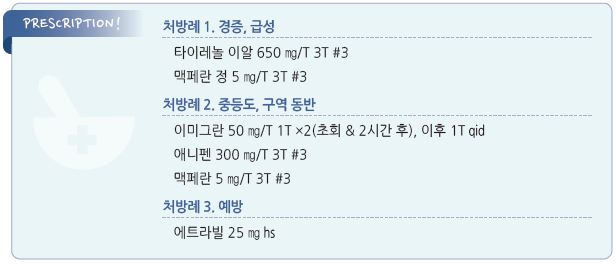

# 편두통 Migraine

## <mark style="color:green;">일반 사항</mark>

* 4\~72시간 동안 지속되고 일상적 활동에 의해 악화되며 일상생활에 지장을 주는 편측성, 박동성의 심한 두통
* 동반 증상 : 구역, 구토, 빛/큰소리 공포, 어지럼, 근육 압통, 수분 저류(부종), 감정 변화
* 30\~40%에서 양측성, 40%에서 비박동성 두통 양상을 보임
* 유병률 : 8~~17%(우리나라), 20~~50대 여성에서 가장 흔함
* 1년에 1회\~1주에 수회 빈도로 재발
* 연령이 증가하면서 강도와 빈도가 감소할 수 있음
* 조짐(aura) : 편두통 환자의 20%에서 발생; 보통 5\~30분 지속 및 조짐 중단 직후 두통 발생. 근육 관련 조짐은 보다 오래 지속

### <mark style="color:$primary;">분류 \[IHS classification ICHD-3]</mark>

1. Migraine without aura
2. Migraine with aura
3. Migraine with typical aura

① Typical aura with headache

② Typical aura without headache

2. Migraine with brainstem aura
3. Hemiplegic migraine

① Familial hemiplegic migraine

② Sporadic hemiplegic migraine

4. Retinal migraine
5. Chronic migraine
6. Complications of migraine
7. Probable migraine
8. Episodic syndromes that may be associated with migraine
9. Recurrent gastrointestinal disturbance

① Cyclical vomiting syndrome

② Abdominal migraine

2. Benign paroxysmal vertigo
3. Benign paroxysmal torticollis

•Menstrual migraine : 월경 -2일\~+3일에 발생, 최소 3주기 중 2주기 발생; 월경 중 다른 날에는 발생 안 함

•Status migrainosus : ＞72시간 지속되는 debilitating migraine

### <mark style="color:$primary;">만성 편두통</mark>

* ＞3개월 동안 ≥15일/월 발생하는 편두통
* 흔히 정신적 문제, 수면 문제, 피로, 다른 통증, 소화 장애, 뇌혈관/심혈관 질환 등을 동반

## 원인

*   trigeminovascular hypothesis : 뇌간에서의 삼차신경 뉴런 과민

    → 신경 전달 물질(substance P, CGRP) 분비

    → 혈관 확장, 신경인성 염증
* ✽1차적인 혈관 문제는 원인으로 고려되지 않음

### <mark style="color:$danger;">🚩 Red Flags!</mark>

☞ [두통](015_-headache.md)

### <mark style="color:$primary;">위험 인자/유발 인자</mark>

* 공복, 식사 거름, 음식
* 가족력 : 환자의 ＞80%에서 편두통의 가족력이 있음
* 여성, 월경
* 스트레스, 우울, 수면 장애(수면 부족 또는 과다)
* 운동, 높은 고도, 날씨 변화
* 빛 자극 : 밝은 빛, 형광 빛, 깜박이는 빛
* 공기 오염, 소음, 강한 냄새(향수)
* 약물 : estrogen, 피임제, 혈관 확장제(nitrate), 니코틴

#### 음식

* 유제품 : 숙성 치즈(cheddar, brie, camembert), sour cream
* 육류/생선 : 가공육, 소시지, 닭 간, 절임/훈제 청어
* 과일 : 바나나, 건포도, 무화과, 아보카도, 밀감류
* 채소 : 잠두, 완두, 양파, 마늘
* 초콜릿, 견과류, 땅콩버터, 효모 빵, 훈제 음식, 중국식 음식
*   음료 : 술(와인, 증류주), 카페인(＞200 ㎎/d의 많은 섭취,

    갑작스런 중단)
*   첨가제 : MSG, 간장, 고기 연육제, 인공 감미료(아스파탐,

    sucralose)

## <mark style="color:green;">임상 양상 및 진단</mark>

* 편두통을 확진하는 검사 방법은 없음; 필요시 다른 질환 감별을 위한 검사 시행
* 신경학적 검사 시행 : 보행, 대/소근육 운동 기능, mental status, 단기 기억력, papilledema
* 영상 검사 : 일률적인 영상 검사는 권고 안 함; 경고 징후에 해당되는 경우 고려
* 설문지 작성 : 통증의 수준과 장애 정도 및 치료 경과 파악; MIDAS

**MIDAS (migraine disability assessment test, 편두통 장애 평가 검사)**

⑴ 지난 3개월 동안 두통 때문에 학교 또는 직장에서

* 결근/결석 한 날이 며칠이나 됩니까?
* 출근/출석은 하였으나 작업 또는 학업 능률이 절반 이하로 감소한 날이 며칠이나 됩니까?

⑵ 지난 3개월 동안 두통 때문에 집안에서

* 어떤 가사일도 할 수 없었던 날이 며칠이나 됩니까?
* 가사일을 하기는 하였으나 작업 능률이 평소의 절반 이하로 감소한 날이 며칠이나 됩니까?

⑶ 지난 3개월 동안 두통 때문에 친족/친구 기타 모임이나 여가 활동에 참가할 수 없었던 날이 며칠이나 됩니까?

▸판정(각 문항 답변 일수의 합계) : 0\~5일(MIDAS Ⅰ)=장애가 없거나 미약; 6\~10일(MIDAS Ⅱ)=경도 장애; 11\~20일(MIDAS Ⅲ)=중등도 장애; 20일 이상(MIDAS Ⅳ)=심도 장애

### <mark style="color:$primary;">Migraine without aura (무조짐 편두통)</mark>

A. 아래 진단 기준 B\~D를 충족하는 발작이 최소한 5번 발생1)

B. 두통 발작이 (치료하지 않거나 치료가 제대로 되지 않았을 때) 4\~72시간 지속2)

C. 다음 네 가지 두통의 특성 중 ≥2가지 해당

① 편측 위치 ② 박동 양상

③ 중등증 또는 중증의 통증 강도

④ 일상적 신체 활동(예: 걷기, 계단 오르기)에 의해 악화되거나 신체 활동을 피하게 됨

D. 두통이 있는 동안 다음 중 ≥1가지 해당

① 구역 &/or 구토

② 빛공포증 & 소리공포증

E. 다른 ICHD-3 진단으로 더 잘 설명되지 않음&#x20;

_1) 무조짐편두통의 모든 진단 기준을 충족하지만 ＜5번의 발작만 있었으면 개연무조짐편두통(Probable migraine without aura)으로 분류_

_2) 편두통 상태에서 잠이 들었다가 잠에서 깰 때 두통이 없었다면 깨어날 때까지의 시간을 발작 시간으로 간주_&#x20;

### <mark style="color:$primary;">Migraine with aura (조짐 편두통)</mark>

A. 아래 진단 기준 B와 C를 충족하는 발작이 최소한 2번 발생

B. 완전히 가역적인 다음의 조짐 증상 중 ≥1가지 해당

① 시각

② 감각

③ 말(speech) &/or 언어(language)

④ 운동(motor)

⑤ 뇌간

⑥ 망막

C. 다음의 여섯 가지 특징 중 ≥3가지 해당

① 최소한 한 가지 조짐 증상이 ≥5분에 걸쳐 서서히 발생

② ≥2가지의 증상이 연속해서 발생

③ 각 조짐 증상은 5분\~60분 지속1)

④ 최소한 한 가지 조짐 증상은 편측 발생2)

⑤ 최소한 한 가지 조짐 증상은 양성 증상3)

⑥ 두통이 조짐에 동반되거나 조짐 60분 이내에 나타남

D. 다른 ICHD-3 진단으로 더 잘 설명되지 않음&#x20;

_1) 예: 한 번의 조짐 동안 3가지 증상이 생길 때 최대 허용 시간은 3×60분; 운동 증상은 72시간까지 지속 가능_

_2) 실어증은 항상 편측 증상으로 간주함; 구음장애는 때에 따라 다름_

_3) 섬광암점과 따끔거림은 조짐의 양성 증상임_

### <mark style="color:$primary;">Chronic migraine (만성 편두통)</mark>

A. ＞3개월 동안 ≥15일/월의 두통(migraine- or tension type-like)이 발생하고 B & C를 충족시킴

B. 무조짐 편두통의 B\~D &/or 조짐 편두통의 B & C에 해당되는 발작이 최소한 5번 발생

C. 다음 중 어느 하나가 ＞3개월 동안 ≥8일/월 발생

① 무조짐 편두통 진단 기준의 C & D ② 조짐 편두통의 진단 기준의 B & C

③ 증상이 시작될 때 환자가 편두통이라고 믿으며 triptan 또는 ergotamine으로 호전됨

D. 다른 ICHD-3 진단 기준에 더 부합하지 않음

## <mark style="background-color:$warning;">Management</mark>

### <mark style="color:$primary;">치료 방침</mark>

* 생활 습관 개선
* 필요시 약물 치료 : 급성 편두통 증상 완화, 만성 편두통 예방
  * 약물 과사용 예방을 위해 단일 성분 진통제는 ＜15일/월, 복합 진통제는 ＜10일/월 사용 (☞ p.88)

## <mark style="color:green;">비-약물 치료 및 예방</mark>

* 조용하고 어두운 방에서 휴식, 두통 부위 냉찜질 또는 온찜질
* 유발 인자 회피 : 음식, 과로, 공복(＞4시간의 공복)
* 생활 습관 개선 : 수면 환경 개선, 규칙적 생활(수면, 식사, 운동, 스트레칭 등)
* 행동 치료 : 이완 훈련, 인지행동 요법, 바이오피드백

## <mark style="color:green;">급성 편두통</mark>

* 1차 선택 : 경증- 진통제, 중증- triptan
* 중증 시 triptan과 진통제를 병용할 수 있으며 필요시 항구토제를 추가
* 두통 발생 초기에 투여하는 것이 보다 효과적
* 저용량을 자주 투여하는 것보다 충분한 용량을 한 번에 투여하는 것이 효과적
* 구역/구토가 심한 경우 비경구 투여를 고려
* 효과, 용량, 부작용 면에서 환자 개개인에 맞는 약물을 찾는 과정이 필요
* barbiturate는 과사용과 의존 위험, opioid는 반동성 두통과 약물과용두통 위험이 있으므로 피함

#### 진통제

* ibuprofen : 400\~800 ㎎ \[부루펜]
* naproxen : 500\~820 ㎎ \[낙센]
* aspirin : 500\~1,000 ㎎ \[로날]
* dexketoprofen : 25 ㎎
* acetaminophen : 650\~1,300 ㎎ \[타이레놀] (✽NSAID보다 효과가 적다는 보고가 있음)

#### Triptan

* 기전 : 5-HT1 receptor 활성 → vasoactive neuropeptide 분비 억제
* 대상 : 중증 편두통 또는 다른 약제로 호전되지 않는 경증 편두통 (보험기준 ☞ p.1176)
* 보통 복용 2시간 내 통증 호전
* 종류별 유의한 효과 차이는 없으나 개인적인 차이는 있을 수 있음; 저렴한 triptan부터 선택
* 부작용 : 흉부 압박감, 홍조, 더운 느낌, 쇠약, 어지럼, 감각 이상(예: 팔/다리 저림)
* 주의/금기 : 뇌혈관/심혈관/말초혈관 질환, 조절되지 않는 고혈압, SSRI, ergotamine

<table><thead><tr><th width="215.0526123046875">성분명 [상품명]</th><th width="244.5263671875">용법 [최대]</th><th>반감기 (h)</th></tr></thead><tbody><tr><td>sumatriptan [이미그란]</td><td>50 ㎎ q2h [300 ㎎/d]</td><td>2</td></tr><tr><td>rizatriptan</td><td>5~10 ㎎ q2h [30 ㎎/d]</td><td>2~3</td></tr><tr><td>zolmitriptan [조믹]</td><td>2.5~5 ㎎ q2h [10 ㎎/d]</td><td>3</td></tr><tr><td>almotriptan [알모그란]</td><td>6.25~12.5 ㎎ q2h [25 ㎎/d]</td><td>3~4</td></tr><tr><td>eletriptan</td><td>20~40 ㎎ q2h [80 ㎎/d]</td><td>4</td></tr><tr><td>naratriptan [나라믹]</td><td>2.5 ㎎ q4h [5 ㎎/d]</td><td>6</td></tr><tr><td>frovatriptan [미가드]</td><td>2.5 ㎎ q2h [7.5 ㎎/d]</td><td>25</td></tr></tbody></table>

_Ref. Rakel Family medicine 9th ed. 2016. Table 41-2._

#### Ergotamine

* 불확실한 효과 및 부작용으로 인하여 2차 선택; 급성기 치료제로는 권고하지 않음. triptan 치료 실패 시 고려 (✽시판 단일제 없음)
* 반동성 두통을 유발할 위험이 있으므로 발작 당 4\~5일 이상 사용하지 않음
* 부작용 : 구역, 혈관 수축
* 주의/금기 : 고혈압, 심혈관 질환, 간/신 장애, 발열, 24시간 내 triptan 복용, CYP 3A4 inh 복용
* caffeine 복합제(ergo. 1 ㎎ + caff. 100 ㎎) : 초회 2정 → 30분마다 1정씩 4회 \[크래밍]

#### Gepants

* CGRP receptor antagonist
* 부작용 : 입마름, 어지럼
* rimegepant : 75 mg 붕해정
* ubrogepant : 50, 100 mg

#### Ditans

* 5-HT 1F agonist; 선택적 작용으로 triptan의 심혈관계(혈관 수축) 부작용이 없음
* 기전 : neuropeptide 방출을 저하시키고 삼차 신경을 포함한 통증 전달 경로를 억제
* lasmiditan : 50\~200 mg \[레이보우] (비보험)
* 부작용 : 졸음, 어지럼

#### 항구토제

* dopamine 수용체 차단제는 편두통 증상을 감소시키는 부가 효과를 지님 (☞ p.370)
* ✽acetaminophen과 metoclopramide 병용이 triptan 수준의 효과가 있다는 보고가 있음
* 구역 및 구토가 없더라도 급성기 치료 시 항구토제 첨가를 고려
* 부작용 : QT interval 연장
* metoclopramide : 10 ㎎ tid \[맥페란]
* domperidone : 10 ㎎ tid \[모티리움 엠]

#### Steroid

* 일률적인 사용은 하지 않음
* 필요시 응급실에서 주사로 투여
*   dexamethasone : 두통 재발 위험도가 유의미하게 줄어든다는 보고가 있음 \[덱타손 주]

    

## <mark style="color:green;">만성 편두통의 예방적 약물 치료</mark>

#### 대상

* 생활습관 개선과 적절한 편두통 급성기 치료에도 불구하고 편두통으로 인하여 유의미한 일상생활의 장애를 겪음
* 두통 빈도가 적더라도 편두통 급성기 치료에 치료되지않거나 두통으로 인한 장애를 경험
* 편두통 급성기 치료가 효과적이더라도 두통 빈도가 잦음
* ≥10\~15일/월 편두통 급성기 치료(약물과용두통의 우려가 있으므로 예방 치료를 권고)
* 두통 빈도와 무관하게 환자가 편두통 예방 치료를 선호하거나 의사가 예방 치료가 필요하다고 판단(예: 뇌간 조짐 편두통/반신 마비 편두통)하는 경우에 고려
* 편두통 급성기 치료의 의학적 금기를 가지고 있는 경우에 고려

#### 용법

* 저용량 투여 → 2\~4주마다 효과와 부작용 평가 → 효과가 나타날 때까지 증량

•약물 효과 등을 판단하기 위하여 두통일기 작성을 권고

*   적정 용량 또는 최대 내약 용량으로 2개월 이상 투여 후 반응이 없으면 치료 방법 변경 고려;

    치료 개시 6\~8주에 호전될 수 있으나 완전한 효과를 얻기까지 6개월이 걸릴 수 있음
*   예방 치료가 효과적인 경우 3개월 이상 치료를 지속한 후 감량 또는 중단 고려

    → 감량 또는 중단 시 편두통 빈도가 증가하면 증량 또는 투여 재개

### <mark style="color:$primary;">1차 선택제</mark>

* 1차 선택제 : propranolol(β-차단제), topiramate(항경련제), amitriptyline(항우울제)

#### β-차단제

* propranolol : 40\~160 ㎎/d #2 \[인데놀]
* metoprolol : 50\~200 ㎎/d \[베타록]
* 부작용 : 우울, 발기부전, 피로, 무기력, 악몽, 서맥, 저혈압
* 주의/금기 : 천식, COPD, 심장 전도 장애, 흡연, 고령 (☞ p.487)

#### 항경련제

*   topiramate : 12.5\~150 ㎎/d \[토파맥스]; \[부] 감각 이상(저림), 복통, 구역, 피로, 맛 변화, 설사, 체중 감소, 기억/집중력 장애,

    신결석; \[주/금] 녹내장, 신결석, 임신
*   valproate : 500~~1,500 ㎎/d \[오르필], divalproex : 250~~1,500 ㎎/d \[데파코트]; \[부] 구토, 체중 증가, 떨림, 탈모, 졸림, 어지럼;

    \[주/금] 간질환, 췌장염, 임신, 요소 순환 질환, 저혈소판증

#### 항우울제

*   amitriptyline : 10\~50 ㎎/d hs \[에트라빌]; 부작용- 졸음, 입마름, 변비, 소변 저류, 혼돈, 심장 전도 장애, 체중 증가;

    주의/금기- 고령, BPH, 녹내장, 발작, 심장 질환 (☞ p.1147)
* venlafaxine XR : 37.5\~150 ㎎/d \[이팩사 XR]; 부작용- 구역, 혈압 상승; 주의/금기- 고혈압

### <mark style="color:$primary;">2차 선택제</mark>

#### Botulinum toxin(onabotulinumtoxinA)

* 위약 대비 편두통 발생 2일/월 감소 효과
* 155 U (5 U로 31군데 근육 주사)
* \[부] blepharoptosis, 팔 근육 약화, neck pain, 주사 부위 통증
* \[주/금] 약물 과민, 신경 근육 질환(예: 중증 근무력증), 임신, 수유, 근이완제 복용

#### 항고혈압제

(☞ [고혈압](../225_/095_-hypertension.md))

* flunarizine : 5\~10 ㎎/d \[씨베리움]; \[부] 체중 증가, 졸림, 입마름, 어지럼, 저혈압, 우울; \[주/금] 심한 우울, 파킨슨병, 기타 피라미드외로 증상
* candesartan : 4\~16 ㎎/d \[아타칸]; \[부] 저혈압, CHF 악화; \[주/금] 혈관 부종, 임신, 수유
* lisinopril : 10\~20 ㎎/d \[제스트릴]; \[부 어지럼, 두통, 기침, 피로, 근육 경련, 설사, 저혈압; \[주/금] 혈관 부종, sulfonamide 과민

#### Gabapentinoid

* 대한두통학회 지침2021)에서는 근거 부족으로 사용하지 않을 것을 제안
* 부작용- 어지럼, 졸음, 균형 장애 (☞ p.13)
* gabapentin : 300\~900 ㎎/d \[뉴론틴]
* pregabalin : 50\~300 ㎎/d \[리리카]

#### 기타

* 다른 TCA
* tizanidine : 근이완; 4\~24 ㎎/d \[실다루드]
* memantine : 신경 보호; 5\~20 ㎎/d \[에빅사]
* cyproheptadine : 항히스타민제; 4\~8 ㎎ tid
* zonisamide : 항전간제; 50\~100 ㎎/d \[엑세그란]
* monoclonal antibody : erenumab, fremanezumab\[아조비], galcanezumab\[앰겔러티], eptinezumab; 매달 또는 분기마다 주사; \[부] 주사 부위 통증/발적, 상기도 감염, 변비; \[주/금] 약물 과민, 심혈관 질환, 조절되지 않는 고혈압, 임신
* 대체 요법 : 효과에 대한 입증은 불충분; Mg 600 ㎎/d, riboflavin 400 ㎎/d, feverfew(MIG-99 extract) 6.25 ㎎ tid, coenzyme Q10 100 ㎎ tid

## <mark style="color:green;">Status Migrainosus</mark>

* ＞72시간 지속되는 심한 편두통
* dihydroergotamine IV

***

> **질병코드** G43 편두통

