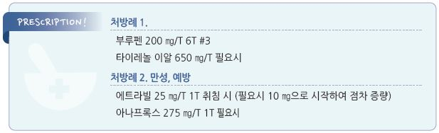

# 긴장형두통 Tension Type Headache, TTHA

## 일반 사항

* 다음의 특징을 갖는 두부 양측의, 압박 또는 조이는 느낌의 두통
  * 중등도 이하의 강도
  * 감정적 스트레스, 어깨/목 근 긴장과 관련
  * 동반 증상 : 두부/경부/어깨 근육 경직/압통, 피로, 과민, 집중력 저하
  * 성인 유병률 약 26%; 장애 부담(years lived with disability)은 15\~49세에서 최고. 연령 증가에 따라 episodic type은 감소, chronic type은 증가
* 원발성 두통의 가장 흔한 형태

### <mark style="color:$danger;">🚩 Red Flags!</mark>

☞ [두통 챕터 Red Flags 참조](015_-headache.md)

### 분류 \[IHS classification ICHD-3]

1.  Infrequent episodic TTHA

    ① associated with pericranial tenderness

    ② not associated with pericranial tenderness
2.  Frequent episodic TTHA

    ① associated with pericranial tenderness

    ② not associated with pericranial tenderness
3.  Chronic TTHA

    ① associated with pericranial tenderness

    ② not associated with pericranial tenderness
4.  Probable TTHA

    ① probable infrequent episodic tension type headache

    ② probable frequent episodic tension type headache

    ③ probable chronic tension type headache

## 원인

* 불명

### 추정 기전

* peripheral nociceptors 활성 → myofascial pain → episodic TTHA
*   지속적인 nociceptors 자극 → central pain pathway 민감화

    → chronic TTHA

### 위험 인자

* 정신적/육체적 스트레스
* 불안, 우울 (만성화의 주요 위험인자)
* 수면 변화
* 식사 거름
* 특정 음식 : 카페인, 알코올, 초콜릿
* 흡연
* 냄새, 소음, 빛
* 탈수
* 나쁜 자세 또는 같은 자세 지속
* DJD, 턱관절 이상, 이갈이
* 힘든 육체적 작업
* 여성 호르몬
* 약물 : 항고혈압제, nitrate, SSRI, 두통 치료제

## 임상 양상 및 진단


**두통 일기(headache diary)** 는 진단 분류와 치료 반응 평가에 가장 유용한 도구임. 초진 시 작성을 권고하고, 1개월 후 재평가에 활용


### Episodic tension-type headache (삽화긴장형두통)

A. 아래의 진단 기준 B\~D를 충족하는 두통이 다음 기간 동안 최소한 10번 발생

* Infrequent(저빈도) : 월평균 ＜1일, 연간 ＜12일 발생
* Frequent(고빈도) : ＞3개월 동안 월평균 1~~14일, 연간 12~~179일 발생

B. 지속 시간 : 30분\~7일

C. 다음 네 가지 두통 특성 중 ≥2가지 해당

① 양측

② 압박 또는 조임(비-박동성)

③ 경증\~중등증 강도

④ 걷기, 계단 오르기 등 일상적 신체 활동에 의해 악화되지 않음

D. 다음 모두에 해당

① 구역 또는 구토 없음

② 빛공포증 또는 소리공포증 모두 없거나 하나만 존재

E. 다른 ICHD-3 진단으로 더 잘 설명되지 않음\*

_\*개연편두통과 저빈도삽화긴장형두통의 진단 기준 모두를 만족하는 두통은 저빈도삽화긴장형두통으로 진단_

### Chronic tension type headache (만성긴장형두통)

A. 아래의 진단 기준 B\~D를 충족하는 두통이 ＞3개월 동안 월평균 ≥15일, 연간 ≥180일 발생

B. 지속 시간 : 수 시간\~수 일, 또는 지속(unremitting)

C. 다음 네 가지 두통의 특성 중 ≥2가지 해당

① 양측

② 압박 또는 조임(비-박동성)

③ 경증\~중등증 강도

④ 일상적 신체 활동(예: 걷기, 계단 오르기)에 의해 악화되지 않음

D. 다음 모두에 해당

① 빛공포증, 소리공포증 또는 경미한 구역 중 모두 없거나 하나만 존재

② 중등도 이상의 구역이나 구토는 없음

E. 다른 ICHD-3 진단으로 더 잘 설명되지 않음1\~3)&#x20;

1. 한 달에 25일간 두통이 있는 어떤 환자에서 8일은 편두통에 부합되고 17일은 긴장형두통에 부합된다면 이 환자는 두 진단 기준 모두에 해당되지만 만성편두통으로만 진단함
2. 진단 기준 A\~E를 만족하는 두통이 처음 발생 시점 24시간 이내부터 매일 지속된 것이 명백하다면 신생매일지속두통으로 분류하며, 두통 발생시점을 기억하지 못하거나 불확실하다면 만성긴장형두통으로 분류
3. 약물과용두통과 만성긴장형두통의 진단 기준을 모두 충족하는 경우 둘 다 진단함. 약물 과용을 중단한 후에도 만성 두통이 지속되면 약물과용두통 진단은 철회될 수 있음

## Management

### 치료 원칙

* 삽화형 : 급성기 진통제 투여 + 유발 인자 교정
* 만성형 : 예방 약물(항우울제) + 비약물 치료 병행; 급성기 진통제 병용 가능


**약물과용두통 주의** : 진통제의 잦은 사용은 반발성 두통 또는 약물과용두통을 야기할 수 있음(특히 카페인 함유 복합제). 약물에 의한 두통 발생을 예방하기 위해 진통제 사용을 **≤2일/주**로 제한할 것을 권고 (단순 NSAIDs/acetaminophen은 월 15일, 복합진통제는 월 10일 초과 시 약물과용두통 기준에 해당)


## 비약물 치료

* 규칙적 식사, 균형 잡힌 식사; 아침 식사를 거르지 않음
* 충분한 휴식/취침, 규칙적 취침/기상; 소음이 적은 어두운 방에서 휴식
* 스트레스 관리 : 가벼운 산책을 포함하여 작업에서 잠시라도 벗어남
* 측두부/뒷목에 대한 온/냉찜질 및 마사지, 뜨거운 목욕/샤워
* 스트레칭 : 어깨, 목의 긴장을 풀어주는 스트레칭(수시 또는 아침, 저녁 각 15분 이상)
* 규칙적 운동 : 유산소 운동 및 근력 강화 운동 30~~60분씩 주 4~~6회
* 자세 교정
* 이완 요법 : 요가, 명상, 인지행동치료(CBT), 바이오피드백
* 향기 요법 : 페퍼민트 oil을 전두부에 도포(일부에서 유효)

## 약물 치료

### 1차 선택 — 급성기 진통제

* ibuprofen : 400\~800 ㎎ q8h 필요시 \[부루펜]
  * ✽ibuprofen이 acetaminophen보다 효과적이라는 보고가 있음
* naproxen : 275~~500 ㎎ q8~~12h 필요시 \[낙센, 아나프록스]
* acetaminophen : 1,000 ㎎ → 이후 650\~1,000 ㎎을 필요시 6시간마다; 최대 4 g/d, 간/신 장애 시 2 g/d \[타이레놀]
* aspirin : 500\~1,000 ㎎ 필요시 6시간마다 \[로날]

### 2차 선택 — 급성기

#### Caffeine 복합제

* caffeine 130/acetaminophen 500/aspirin 500 ㎎ q6h 필요시
  * ✽카페인 함유 복합제는 약물과용두통 위험이 높으므로 사용 빈도에 주의

#### Opioid 유사제

* tramadol : 100 ㎎ \[트리돌] (☞ p.12)
* 복합제 : tramadol/acetaminophen \[울트라셋]

#### 진통 보조제

* 수면 작용이 있는 항히스타민제나 dopamine 차단 항구토제가 진통제의 효과를 강화시킬 수 있음
  * diphenhydramine : 25~~50 ㎎ q4~~6hr, 최대 300 ㎎/d [디펙타민](../%EB%B9%84%EB%B3%B4%ED%97%98/)
  * hydroxyzine : 25~~50 ㎎ hs or 50~~100 ㎎/d #3\~4 \[아디팜]
  * metoclopramide : 5~~10 ㎎ tid~~qid \[맥페란]

### 예방 치료 — 만성긴장형두통


예방 치료는 **월 발생 ≥8일** 또는 일상생활 장애가 큰 경우에 고려. 최소 2\~3개월 투여 후 효과 평가


#### 1차 — 항우울제 (근거 수준 가장 높음)

* **amitriptyline** : 10 ㎎/d 취침 시 시작 → 25\~75 ㎎/d까지 점진 증량 \[에트라빌] ← **만성 TTHA 예방 1차 선택 (2024 VA/DoD 가이드라인)**
  * 부작용 : 구갈, 졸림, 변비, 체중증가 (항콜린 작용); 취침 전 복용으로 완화
* **mirtazapine** : 15\~30 ㎎/d 취침 시 \[레메론]
  * amitriptyline 부작용으로 전환 시 대안; 수면 개선 효과 동반
* **venlafaxine XR** : 37.5 ㎎/d 시작 → 75\~225 ㎎/d \[이팩사 XR]
  * 우울·불안 동반 환자에서 선호; 혈압 모니터링 필요
  * ✽SSRI는 TCA에 비해 TTHA 예방 근거 부족; 동반 우울/불안 치료 목적으로는 활용 가능

#### 기타

* 국소 주사 : lidocaine, triamcinolone (보험주의)
  * ✽Dry needling(근막 유발점 주사): 2024년 RCT에서 유의한 통증 감소 보고
  * ✽보툴리눔 독소: 만성형에서 시도 보고 있으나 근거 미흡, 비보험
* 근이완제
  * cyclobenzaprine : 5~~10 ㎎ tid, 서방형 15~~30 ㎎ qd \[본렉스]
* riboflavin : 200 ㎎/d; 일부 연구에서 효과 (근거 수준 낮음)

***

> **질병코드** G44.2 긴장형두통



**처방례 1.** 급성기 — 일반

```
부루펜 200 mg/T  6T  #3
타이레놀 이알 650 mg/T  1T  필요시
```

**처방례 2.** 급성기 — NSAIDs 금기 (위장 장애, 신기능 저하, 임부 등)

```
타이레놀 500 mg/T  2T  필요시 (q6h, 최대 4 g/d)
아디팜 25 mg/T  1T  취침 시  (진통 보조, 수면 개선)
```

**처방례 3.** 만성, 예방 — 일반

```
에트라빌 25 mg/T  1T  취침 시  (필요시 10 mg으로 시작하여 점차 증량)
아나프록스 275 mg/T  1T  필요시
```

**처방례 4.** 만성, 예방 — amitriptyline 부작용으로 전환 시

```
레메론 15 mg/T  1T  취침 시
아나프록스 275 mg/T  1T  필요시
```

**처방례 5.** 만성, 예방 — 우울·불안 동반 시

```
이팩사 XR 37.5 mg/T  1T  조식 후  (2주 후 75 mg으로 증량 고려; 혈압 모니터링)
아나프록스 275 mg/T  1T  필요시
```
