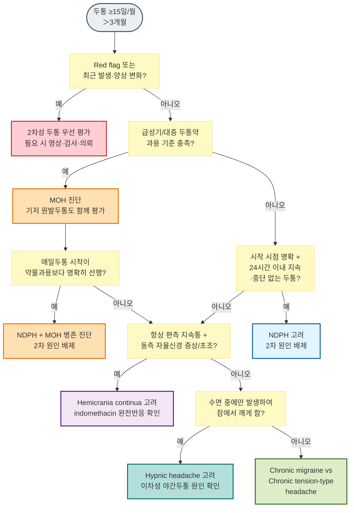

# 만성 두통 Chronic Headache

## <mark style="color:green;">일반 사항</mark>

* 만성 두통은 일반적으로 ≥15일/월, ＞3개월 지속되는 두통을 가리키는 임상적 포괄 용어이며, 그 자체가 하나의 ICHD-3 진단명은 아님
* 원발두통의 만성형, 신생매일지속두통 등의 기타 원발두통, 지속반두통 등의 삼차자율신경두통, 약물과용두통을 포함한 2차두통 등이 만성 두통의 범주에 해당
* 1차 진료에서는 위험 신호를 확인하여 생명을 위협하는 원인 질환을 조기에 감별하는 것이 중요

### <mark style="color:$danger;">🚩 Red Flags!</mark>

☞ [두통 Red Flags](015_-headache.md#red-flags) 참조

### <mark style="color:orange;">감별</mark>

* 최근 시작, 최근 변화, 증상 진행 → 2차성 두통
* 발열, 체중 감소, 악성 종양 과거력 → 전신적 질환, 2차성 두통
* ≥15일/월 중 ≥8일/월 편두통형 두통 → [만성 편두통](016_-migraine.md#chronic-migraine)
* ≥15일/월이면서 만성 편두통 기준을 충족하지 않고 긴장형두통 양상이 우세 → [긴장형두통](017_-tension-type-headache.md)의 만성형
* 시작 시점을 명확히 기억하고, 발생 후 24시간 이내에 지속적이고 중단 없는 매일두통으로 전환 → 신생매일지속두통
* 급성기·대증 두통약을 약제군별 기준 이상으로 ＞3개월 사용 → 약물과용두통
* 심한 두통, 편측, 눈물/콧물, 시계 같은 규칙성, 군집성 발생, 4시간 이내 → [군발두통](015_-headache.md#undefined-5)
* 경부 외상력, 목 움직임으로 유발 → [경추성두통](019_-cervicogenic-headache.md)
* 일시적 시각장애, 박동성 이명, 복시, 유두부종 → 특발성 두개내고혈압; 안저·시야평가 필요(비만 여성에서 흔하지만 인구학적 특징만으로 판단하지 않음)
* 불안, 우울 동반 → 정신과적 동반 질환(comorbidity)으로 병행 관리; 2차성 두통 가능성도 배제
* 경추/턱관절 움직임 제한 또는 통증 → 경추성두통, 턱관절 이상
* 두통의 2차 원인 감별을 위한 [SNNOOP10](015_-headache.md#id-2-snnoop10-red-flags)



<p align="center"><strong>만성 두통 감별 알고리듬</strong></p>

<p align="center"><em><mark style="color:$info;">ICHD-3 진단 기준에 따라 저자 재구성</mark></em></p>

***

## <mark style="color:green;">1차성 두통</mark>

### <mark style="color:orange;">발작 지속시간에 따른 감별 - ＞4시간</mark>

* 종류 : Chronic migraine, Chronic tension type headache, New daily persistent headache, Hemicrania continua

#### <mark style="color:$primary;">신생매일지속두통 (New daily persistent headache, NDPH)</mark>

* 매일 지속되는 두통, 시작 시점을 명확히 기억함
* 통증은 특징적 양상이 없으며 편두통 또는 긴장형두통 요소를 모두 가질 수 있음
* 전형적으로 과거 두통의 병력이 없는 사람에서 발생

A. 아래의 진단 기준 B, C를 충족시키는 지속되는 두통

B. 뚜렷하고 확실히 기억되는 시작이 있으며, 발생 후 24시간 이내에 지속적이고 중단 없는 통증으로 전환

C. ＞3개월 존재

D. 다른 ICHD-3 진단으로 더 잘 설명되지 않음<sup>1\~4)</sup>

> ¹⁾_전형적으로 과거 두통의 병력이 없는 사람에서 발생하여 시작부터 매일 중단 없이 지속함. 과거 편두통 또는 긴장형두통 병력이 있어도 배제되지는 않지만, NDPH 발생 전에 두통 빈도가 점차 증가했거나 약물과용과 함께 악화된 경과여서는 안 됨. 환자가 시작 시점을 기억하여 정확히 묘사할 수 없다면 다른 진단을 고려_\
> ²⁾_두통이 만성 편두통 또는 만성 긴장형두통의 진단 기준을 충족하더라도 NDPH 기준에 맞으면 NDPH로 진단함. NDPH와 지속반두통의 기준을 모두 충족하면 지속반두통으로 진단_\
> ³⁾_약물과용 기준을 초과하더라도 매일두통의 발생이 약물과용보다 명확하게 선행한 경우에만 NDPH를 진단할 수 있으며, 이때 NDPH와 약물과용두통을 함께 진단_\
> ⁴⁾_모든 경우에서 2차두통(예: 두부외상 후 두통, 뇌척수액 고압·저압 두통)을 적절한 검사로 배제해야 함 \[ICHD-3]_

#### <mark style="color:$primary;">지속반두통 (Hemicrania continua)</mark>

* 항상 편측으로 발생하는 지속적인 통증으로 같은 쪽의 결막 충혈, 눈물, 코 막힘, 콧물, 이마와 얼굴의 땀, 동공 수축, 눈꺼풀 처짐, 눈꺼풀 부종을 동반
* 두통은 indomethacin에 매우 민감하게 반응
* 새로 발생한 지속적인 strictly side-locked headache 또는 삼차자율신경두통 양상에서는 구조적 병변 배제를 위해 뇌 MRI를 적극 고려

A. 아래의 진단 기준 B\~D를 충족시키는 편측 두통

B. ＞3개월 지속되며, 중등도 이상의 악화기(exacerbation)를 동반

C. 다음 중 하나 이상 해당

1. 두통과 동측으로 다음 중 ≥1가지 존재
   1. 결막 충혈 &/or 눈물
   2. 코 막힘 &/or 콧물
   3. 눈꺼풀 부종
   4. 이마 및 안면 발한
   5. 동공 축소 &/or 눈꺼풀 처짐
2. 안절부절, 초조, 또는 움직임에 의해 통증 악화

D. 치료 용량의 indomethacin에 절대적으로 반응함¹⁾

E. 다른 ICHD-3 진단으로 더 잘 설명되지 않음

> ¹⁾_ICHD-3의 성인 치료 용량은 경구 indomethacin ≥150 ㎎/d이며 필요 시 225 ㎎/d까지 증량함. 실제 임상에서는 위장관·신장 부작용을 줄이기 위해 25 ㎎ tid에서 시작하여 단계적으로 증량할 수 있으나, 저용량에서의 불충분한 반응만으로 indomethacin 무반응으로 판단하지 않음. 완전 반응 확인 후 최소 유효 용량으로 감량_

### <mark style="color:orange;">발작 지속시간에 따른 감별 - ＜4시간</mark>

* 종류 : Chronic cluster headache, Chronic paroxysmal hemicrania, Hypnic headache, Primary stabbing headache, Short-lasting unilateral neuralgiform headache attacks


만성 군발두통과 만성 발작성반두통에서 '만성'은 이 챕터가 쓰는 빈도·기간 기준(≥15일/월, ＞3개월)과는 다른 개념. 두 질환은 발작기(bout)와 관해기가 반복되는 구조이며, 발작기 중에는 하루 수 회 발작이 나타나 오히려 ≥15일/월 기준을 쉽게 넘길 수 있음. 따라서 만성형 여부는 한 달 발생일수가 아니라 관해기의 유무·길이로 정의됨 - 관해기가 전혀 없거나 있어도 ＜3개월인 상태가 최소 1년간 지속되면 만성형(반대로 관해기가 ≥3개월이면 삽화성)\[ICHD-3]


#### <mark style="color:$primary;">수면두통 (Hypnic headache)</mark>

* 수면 중에만 반복적으로 발생하여 잠에서 깨어나게 하는 두통(일명 alarm clock headache)
* 특징적인 동반 자율신경 증상이 없으며 다른 병리에 기인하지 않음
* 보통 50세 이후에 발생
* 둔한 두통, 종종 양측성

**진단 기준**

A. 아래의 진단 기준 B\~E를 충족하는 반복되는 두통 발작

B. 잠자는 동안에만 발생하여 잠에서 깨게 함

C. ＞3개월 동안 ≥10일/월 발생

D. 잠에서 깬 후 15분\~4시간 지속

E. 자율 신경 증상이나 안절부절못함은 없음

F. 다른 ICHD-3 진단으로 더 잘 설명되지 않음<sup>1,2)</sup>

> ¹⁾_효과적인 치료를 위하여 삼차자율신경두통들(군발두통)과의 감별이 필요_\
> ²⁾_수면 중 발생하여 잠에서 깨어나게 하는 두통의 다른 가능한 원인들(예: 수면무호흡증, 야간 고혈압, 저혈당, 약물과용, 두개내질환)을 감별. 폐쇄수면무호흡증이 병존한다는 사실만으로 수면두통이 배제되지는 않으며 두통과의 인과관계를 평가_


**주의 - 이차성 원인 배제 후 진단 :** 50세 이후 처음 발생하는 수면 중 두통은 두개내종양, 폐쇄수면무호흡증(OSA), 야간 고혈압, 저혈당, 약물과용 등을 우선 평가. 새로 발생한 야간 두통에서는 이차성 두개내병변 배제를 위해 뇌 MRI를 적극 고려


## <mark style="color:green;">2차성 두통</mark>

### <mark style="color:orange;">종류</mark>

* 두경부 외상 또는 손상에 기인한 두통 : 외상 후 두통, 경막하혈종 등
* 두개·경부 혈관질환에 기인한 두통 : 동맥박리, 뇌정맥혈전증, 혈관염, 거대세포동맥염, 동정맥기형 등
* 비혈관성 두개내질환에 기인한 두통 : 두개내종양, 특발성 두개내고혈압, 자발두개내압저하 등
* 물질 또는 금단에 기인한 두통 : 약물과용두통 등
* 감염 또는 항상성 장애에 기인한 두통 : 중추신경계감염, 폐쇄수면무호흡증, 저산소증·고탄산혈증 등
* 두개·경부·안면 구조물의 질환에 기인한 두통·안면통 : 경추성두통, 턱관절질환, 안과·이비인후과·치과 질환 등 \[ICHD-3]

### <mark style="color:orange;">약물과용두통 (Medication overuse headache, MOH)</mark>

* 기존 두통질환이 있는 환자에서 ≥15일/월 두통이 있으면서, 급성기·대증 치료 약제를 ＞3개월 동안 다음 기준 이상 과용하면 약물과용두통을 고려
  * 다음 약제를 한 달에 ≥10일 복용 : triptan, opioid, ergotamine, 복합진통제
  * 다음 약제를 한 달에 ≥15일 복용: acetaminophen, aspirin, NSAID 등 단순진통제
  * 한 달에 합계 ≥10일 : 여러 약물군을 번갈아 사용하여 개별 약물군은 과용 기준에 미달하더라도 전체 급성기·대증 약물 사용일수가 기준을 충족하는 경우
* MOH는 기저 두통질환을 대체하는 개념이 아니며, 만성 편두통·긴장형두통 등과 각각의 기준을 충족하면 함께 진단

#### <mark style="color:$primary;">진단 기준</mark>

A. 기존 두통질환이 있는 환자에서 ≥15일/월 발생하는 두통

B. 급성기 &/or 대증 치료로 사용될 수 있는 ≥1가지의 약물을 ＞3개월 동안 규칙적으로 과용<sup>1\~3)</sup>

C. 다른 ICHD-3 진단으로 더 잘 설명되지 않음

> ¹⁾_각 환자는 과용한 약물의 종류와 해당 진단 기준에 따라 한 가지 이상의 아형으로 분류할 수 있음(예: 트립탄과용두통, 단순진통제과용두통, 복합진통제과용두통)_\
> ²⁾_여러 진통제를 병용하지만 개별 약물군은 과용 기준에 해당하지 않는 경우 ‘개별적으로는 과용되지 않은 복수 약물군의 과용에 의한 두통’으로 진단_\
> ³⁾_두통의 급성기 또는 대증 치료 목적으로 약물을 과용하지만 약물명·용량이 명확하지 않은 경우 정확한 정보가 확인될 때까지 ‘확인되지 않은 복수 약물군에 의한 약물과용두통’으로 진단 \[ICHD-3]_

***

## <mark style="background-color:$warning;">Management</mark>

### <mark style="color:orange;">치료 방침</mark>

* 생활 치료 : 수면 개선, 규칙적 유산소 운동, 스트레스 관리, 두통 일지 작성
* 유발 요인 제거, 만성 편두통 또는 만성 긴장형두통 치료
* 불안·우울 등 정신건강 문제 동반 시 병행 치료
* 스테로이드 사용 주의
  * 만성 두통에서 low cortisol에 근거한 장기 steroid 대체 요법은 근거 수준이 낮으며 EHF·AAN 가이드라인의 일반적 권고가 아님
  * MOH 약물 중단 시 corticosteroid를 단기 bridge로 사용한 연구가 있으나 효과는 일관되지 않아 일상적 표준 요법으로 권고하지 않음

#### <mark style="color:$primary;">신생매일지속두통 (NDPH)</mark>

* 양질의 무작위시험 근거가 부족하고 치료 반응이 제한적인 경우가 많음
* 편두통형 또는 긴장형 양상에 따라 해당 예방치료를 준용하는 phenotype-guided 치료가 일반적임
* 편두통형 : amitriptyline, topiramate, valproate 등
* 긴장형 : amitriptyline, nortriptyline, mirtazapine 등
* 위 약제의 NDPH 치료는 국내 허가 외 사용이며, valproate·topiramate는 임신 가능성이 있는 환자에서 태아 위해를 고려하여 가급적 피하고 피임·임신 계획을 확인
* doxycycline, mexiletine, naltrexone 등이 증례 수준에서 보고되었으나 근거가 매우 제한적이므로 표준 치료로 권고하지 않음
* Self-limiting subtype은 수개월 내 자연 소실 가능
* Refractory subtype은 수년간 지속되며 예후가 다름
* 진단 시 2차 원인 배제가 필요하고 난치성이 많으므로 신경과 의뢰를 적극 고려

#### <mark style="color:$primary;">지속반두통 (Hemicrania continua)</mark>

* 1차 치료 : indomethacin - 진단 기준(criterion D)에 포함될 만큼 완전 반응이 중요함(진단적 치료). 실제 임상에서는 25 ㎎ tid부터 시작하여 내약성을 확인하며 증량하되, 진단적 충분 용량에 도달하기 전에 무반응으로 판단하지 않음 <mark style="color:blue;">\[인도메타캡슐]</mark>
* 투여 전후 위장관 출혈·궤양, 신기능, 혈압·심혈관 위험 및 병용약을 평가. PPI는 위장관 위험을 줄이지만 신장·심혈관 위험을 예방하지 않음
* indomethacin 불내성 시 대안(모두 근거가 제한된 허가 외 사용)
  * celecoxib : 200 ㎎ bid <mark style="color:blue;">\[쎄레브렉스]</mark> - 심혈관·신장 위험 평가
  * topiramate : 50\~100 ㎎/d <mark style="color:blue;">\[토파맥스]</mark>
  * melatonin : 3\~10 ㎎ 취침 전 - 국내 처방용 제품은 주로 2 ㎎ 서방형이므로 문헌의 용량·제형과 직접 대응하지 않음
* 후두신경차단술(Occipital nerve block) : indomethacin 반응은 있으나 장기 복용이 어려운 경우 보조적 선택지로 고려 가능 (근거 제한적)

#### <mark style="color:$primary;">수면두통 (Hypnic headache)</mark>

* 1차 치료 : 취침 전 caffeine 40\~60 ㎎ 또는 진한 커피 1잔 - 불면·야간뇨 악화 가능성을 고려하며 근거는 주로 증례·관찰연구 수준
* 대안
  * lithium carbonate : 150\~300 ㎎ 취침 전 <mark style="color:blue;">\[탄산리튬정]</mark>
    * 투여 전 신기능·갑상선기능·전해질·칼슘, 고령자에서 필요 시 ECG 확인
    * 혈중 농도와 독성 증상을 추적하고 NSAID·ACE 억제제·ARB·thiazide 병용에 주의
  * indomethacin : 25\~50 ㎎ 취침 전
  * melatonin : 3\~5 ㎎ 취침 전
* 위 치료는 모두 수면두통에 대한 국내 허가 외 사용이며, 특히 lithium은 고령자에서 내약성과 상호작용을 면밀히 평가

#### <mark style="color:$primary;">약물과용두통 (MOH)</mark>

* 치료의 핵심은 환자 교육 + 과용 약물 중단/감량 + 기저 두통의 예방 치료임
* 단순진통제·triptan·ergotamine 과용은 대부분 외래에서 즉시 중단(abrupt withdrawal) 가능
* opioid 과용은 의존·금단 위험을 평가하여 점진적 감량을 고려하며, 외래 중단이 어렵거나 고용량·복합 의존이 있으면 신경과/중독 전문진료 또는 입원 치료를 고려
* benzodiazepine은 ICHD-3의 MOH 원인 약제군은 아니지만, 병용·의존이 있으면 급격히 중단하지 말고 MOH와 별개로 점진적 감량 계획을 세움
* 약물과용을 동반한 편두통에서는 예방치료 단독도 예방치료와 급성기 약물 중단을 병행한 전략과 유사한 효과를 보일 수 있음. 다만 오피오이드 또는 바르비투르산 함유 약물 과용에는 이를 일반화할 근거가 부족함. 따라서 일률적인 중단만을 강조하기보다 환자 상황에 맞추어 예방치료를 조기에 시작하고 과용 약물을 감량·중단 \[AAN/AHS 2026]

<mark style="color:cyan;">**브릿지 요법 (선별적 사용)**</mark>

* 약물 중단 후 초기 수일간 반동 두통·오심·수면장애 등이 악화될 수 있음을 사전에 설명
* bridge therapy 전반의 근거는 제한적이며 모든 환자에게 일상적으로 필요하지 않음
  * naproxen : 250\~500 ㎎ bid를 단기간(대개 수일\~1주, 필요 시 최대 1\~2주) 고려할 수 있음
    * NSAID 과용 환자에서는 동일 계열이므로 피함
  * corticosteroid : 일부 연구에서 사용되었으나 효과가 일관되지 않아 routine bridge로 권고하지 않음
* MOH 재발 예방을 위해 급성기 두통약은 가급적 주 2일 이하로 제한
* ICHD-3의 과용 기준은 약제군에 따라 ≥10일/월 또는 ≥15일/월이므로 환자 교육 시 두 기준을 구분

<mark style="color:cyan;">**예방 치료**</mark>

* 약물 중단과 동시 또는 조기에 시작
* 편두통형 : topiramate, valproate, amitriptyline 등
  * 임신 가능성이 있는 환자에서는 valproate·topiramate의 태아 위해를 고려
* 긴장형 : amitriptyline (1차), nortriptyline, mirtazapine
* 만성 편두통 동반 시 OnabotulinumtoxinA(PREEMPT protocol 기반, 155\~195 units), CGRP 단클론항체, atogepant 또는 topiramate를 우선 고려할 수 있으며 국내 허가·급여 기준 확인 \[AAN/AHS 2026]

<mark style="color:cyan;">**추적 관찰**</mark>

* 2주 : 금단 증상, 약물 사용일수 및 순응도 확인
* 4\~8주 : 두통 빈도·강도, 급성기 약물 사용일수, 예방치료 반응 재평가
* 8주 전후 : 치료 전략을 재조정하는 시점이며, ICHD-3상 MOH의 '진단 확정 시점'을 의미하지 않음
* 중단 후에도 만성 두통이 지속되면 기저 원발두통의 예방 치료를 강화

#### <mark style="color:$primary;">CGRP 표적 치료제 (편두통 예방; MOH 동반 환자 포함)</mark>

* 만성 편두통에서 atogepant, eptinezumab, erenumab, fremanezumab, galcanezumab, onabotulinumtoxinA, topiramate, valproate 고려 \[AAN/AHS 2026]
* MOH 동반 편두통에서도 예방치료를 제공하며, 근거가 있는 CGRP 단클론항체, atogepant, onabotulinumtoxinA, topiramate를 우선 고려 \[AAN/AHS 2026]
* 단, 국내 실제 사용 순서는 각 성분의 허가사항과 보험 급여 기준에 따라 달라질 수 있음

<table><thead><tr><th width="142">구분</th><th width="223">성분명 [상품명]</th><th>용법 · 국내 현황</th></tr></thead><tbody><tr><td rowspan="3">항체 주사제 (SC)</td><td>Galcanezumab <mark style="color:blue;">[앰겔러티]</mark></td><td>120 ㎎/월 SC (초회 240 ㎎); 기준 충족 시 급여</td></tr><tr><td>Fremanezumab <mark style="color:blue;">[아조비]</mark></td><td>225 ㎎/월 or 675 ㎎/분기 SC; 기준 충족 시 급여</td></tr><tr><td>Erenumab (Aimovig)</td><td>70~140 ㎎/월 SC; <em>국내 미도입</em></td></tr><tr><td>항체 주사제 (IV)</td><td>Eptinezumab <mark style="color:blue;">[바이엡티]</mark></td><td>100 ㎎/12주 IV, 일부 환자 300 ㎎/12주; <em>2026년 5월 국내 허가, 출시·급여 여부 최신 확인</em></td></tr><tr><td rowspan="2">경구용 Gepant¹⁾</td><td>Rimegepant <mark style="color:blue;">[너텍구강붕해정]</mark></td><td>75 ㎎; 급성기 치료 + 삽화성 편두통 예방(격일 복용); 만성 편두통 예방 적응증 없음; 2026년 9월 국내 출시, 비급여</td></tr><tr><td>Atogepant <mark style="color:blue;">[아큅타]</mark></td><td>60 ㎎ qd; 강력한 CYP3A4 억제제 또는 OATP 억제제 병용 시 10 ㎎ qd; 삽화성·만성 편두통 예방; 비급여</td></tr></tbody></table>

> ¹⁾_Gepant는 현재까지 기존 단순진통제·triptan과 같은 MOH 유발 신호가 확립되지 않았으나 장기 자료는 제한적임. 기존 진통제·triptan 과용 환자에서 유용할 수 있음_
>
> ※ [급여기준](https://www.hira.or.kr/rc/insu/insuadtcrtr/InsuAdtCrtrPopup.do?mtgHmeDd=20240701\&sno=4\&mtgMtrRegSno=0005) : galcanezumab·fremanezumab은 ICHD-3에 부합하는 만 18세 이상 만성 편두통 환자 중 ① 최소 1년 이상 편두통 병력 및 투여 전 최소 6개월간 월 두통일수 ≥15일(그중 편두통형 두통 ≥8일), ② MIDAS ≥21점 또는 HIT-6 ≥60점, ③ 3종 이상의 편두통 예방약 치료 실패(각 약제를 최대 내약 용량으로 8주 이상 투여해도 월 편두통일수가 50% 이상 감소하지 않았거나, 부작용 또는 금기로 사용할 수 없는 경우)를 모두 충족할 때 급여 인정. 투여 후 3개월마다 반응을 평가하며 월 편두통일수가 기저치 대비 50% 이상 감소한 경우 지속 투여를 인정하고 최대 투여기간은 12개월. 경구 gepant는 비급여. 급여 기준은 변경될 수 있으므로 최신 HIRA 고시 확인

***

### <mark style="color:red;">질병코드</mark>

* G44.2 긴장형두통
* G44.3 만성 외상후 두통
* G44.4 달리 분류되지 않은 약물유발 두통
* G44.8 기타 명시된 두통증후군
* G93.2 양성 두개내고혈압/특발성 두개내고혈압
* 편두통(G43 계열)은 별도 편두통 챕터의 질병코드 참조

***

## <mark style="color:purple;">처방례</mark>

> **처방례 1. 신생매일지속두통 - 편두통형**
>
> ```
> 에트라빌 10 ㎎/T 1T hs
>   → 2~4주마다 10 ㎎씩 증량, 목표 25~75 ㎎/d
> 또는 토파맥스 25 ㎎/T 1T hs
>   → 2~4주마다 25 ㎎씩 증량, 목표 50~100 ㎎/d
> ※ 임신 가능성이 있는 환자에서는 topiramate를 가급적 피하고 피임·임신 계획 확인
> ```
>
> _✽NDPH에 대한 phenotype-guided 허가 외 사용이며, 두 약제를 처음부터 routine 병용하지 않음_

> **처방례 2. 지속반두통 (Hemicrania continua) - 진단 및 1차 치료**
>
> ```
> 인도메타캡슐 25 ㎎/C 1C tid (식후)
>   → 불완전 반응이면 내약성을 확인하며 단계적으로 증량
>   → ICHD-3의 성인 진단적 치료 용량은 ≥150 ㎎/d (필요 시 225 ㎎/d)
>   → 완전 반응 확인 후 최소 유효 용량으로 감량
> 오메프라졸 20 ㎎/T 1T qd (위장 보호; 식전)
> ※ 투여 전후 위장관 출혈·궤양, 신기능, 혈압·심혈관 위험 및 병용약 평가
> ※ 고용량 증량이 필요하거나 진단이 불확실하면 신경과 협진 권장
> ```
>
> _✽indomethacin 불내성 시 celecoxib 등 대안을 고려할 수 있으나, 대체약 반응은 hemicrania continua의 진단 기준을 대신하지 않음_

> **처방례 3. 수면두통 (Hypnic headache)**
>
> ```
> [1차] 취침 전 caffeine 40~60 ㎎ 또는 진한 커피 1잔
> [대안] 탄산리튬 150~300 ㎎ hs
>   → 치료 전 신기능·갑상선기능·전해질·칼슘, 고령자에서 필요 시 ECG 확인
>   → 혈중 농도·독성 증상 모니터링; NSAID·ACE 억제제·ARB·thiazide 병용 주의
> 또는 인도메타캡슐 25 ㎎/C 1C hs
> ```
>
> _✽수면두통 치료는 국내 허가 외 사용이며 근거는 주로 증례·관찰연구 수준_

> **처방례 4. 약물과용두통 (MOH) - 약물 중단 + 예방 치료**
>
> ```
> [과용 약물 중단]
> 단순진통제·triptan 과용 → 원칙적으로 즉시 중단
> opioid 과용 → 의존·금단 위험에 따라 점진적 감량 및 전문진료 고려
>
> [필요 시 단기 브릿지 - NSAID 과용이 아닌 경우]
> 낙센에프 500 ㎎/T 1T bid × 5~7일
>   → 증상에 따라 최단기간 사용, 반복·장기 사용 피함
>
> [예방 치료 - 동시 또는 조기 시작]
> 토파맥스 25 ㎎/T 1T hs → 2~4주 간격으로 단계적 증량 (목표 용량은 반응·내약성에 따라 조정)
> 또는 에트라빌 10~25 ㎎/T 1T hs (긴장형두통 동반 시 고려)
> ※ 임신 가능성이 있는 환자에서는 topiramate의 태아 위해를 고려하여 피임·임신 계획 확인
> ```
>
> _✽corticosteroid bridge는 효과가 일관되지 않아 routine으로 사용하지 않음_

***

### <mark style="color:$success;">핵심 복약 지도</mark>

> **약물과용두통(MOH) - 진통제 중단 안내**
>
> * 현재 두통이 자주 나타나고 진통제를 반복 복용하고 있다면, 약물이 두통의 악화·만성화에 기여할 수 있습니다.
> * 특히 **약국에서 처방 없이 구입할 수 있는 카페인 함유 복합 진통제**(게보린, 펜잘 등)는 효과가 빠르게 느껴져 자주 복용하게 되지만, MOH를 일으키는 주요 원인입니다.
> * **복용 중인 진통제(특히 카페인 복합제·트립탄·오피오이드)를 줄이거나 중단하고 기저 두통에 맞는 예방치료를 병행**하는 것이 중요합니다. 재발 예방을 위해 급성기 두통약은 가급적 주 2일 이하로 제한하고, 약제군별 과용 기준(10일/월 또는 15일/월)을 넘지 않도록 하십시오.
> * 중단 후 **2\~10일간 반동 두통(이전보다 심한 두통)이 생길 수 있으나** 이 고비를 넘겨야 호전됩니다. 이 기간을 사전에 충분히 이해해 주십시오.
> * 단독으로 중단하기 어려운 경우 반드시 담당 의사와 감량 계획을 세우십시오.

> **예방약 (토파맥스·에트라빌 등)**
>
> * 효과가 나타나기까지 **4\~8주** 이상 걸립니다. 임의로 중단하지 마십시오.
> * 토파맥스(topiramate)는 물을 충분히 마시면 신결석 위험을 줄이는 데 도움이 됩니다. 시야 흐림·눈 통증이 갑자기 생기면 즉시 진료받으십시오.
> * 에트라빌(amitriptyline)은 취침 전 복용하며, 구갈·졸음이 생길 수 있습니다.

> **인도메타신 (지속반두통)**
>
> * 지속반두통 진단 시 인도메타신에 완전히 반응하는 것이 진단의 중요한 기준입니다.
> * 위장 부작용을 줄이기 위해 반드시 **식후에 복용**하고, 위장약을 함께 처방받으십시오.
> * 증상이 조절되면 최소 유효 용량으로 감량합니다.

> **언제 다시 병원을 방문해야 하나요?**
>
> * 진통제를 줄인 뒤에도 두통이 지속되거나 악화되어 일상생활이 어려운 경우
> * 두통 양상이 갑자기 변하거나 신경 증상이 새로 생긴 경우 - 즉시 응급실 방문
> * 예방약 복용 2개월 후에도 두통 빈도가 줄지 않는 경우

***

## <mark style="color:blue;">환자 안내서</mark>


**만성 두통, 올바른 이해가 치료의 시작입니다**

만성 두통은 적절한 치료와 생활 습관 개선으로 충분히 호전될 수 있습니다. 진통제를 자주 복용하고 있다면 약물과용 여부를 확인하고 사용을 줄이는 것이 중요한 치료 목표입니다.


#### <mark style="color:$primary;">만성 두통이란 무엇인가요?</mark>

* 한 달에 15일 이상, ＞3개월 두통이 지속되는 상태입니다.
* 만성 편두통, 만성 긴장형두통, 약물과용두통 등 다양한 형태가 있습니다.

#### <mark style="color:$primary;">약물과용두통이란 무엇인가요?</mark>

* 두통을 가라앉히려고 진통제를 자주 먹다 보면 약물이 두통의 악화·만성화에 기여하여 악순환이 생길 수 있습니다.
* 트립탄·오피오이드·카페인 복합제는 **한 달 10일 이상**, 단순 진통제는 **한 달 15일 이상** 복용 시 약물과용두통이 생길 수 있습니다.
* 치료의 핵심은 과용 약물을 줄이거나 중단하고, 필요한 경우 예방 치료를 함께 시행하는 것입니다. 중단 초기에는 수일간 두통이 더 심해질 수 있으며 호전 속도는 개인마다 다릅니다.

#### <mark style="color:$primary;">어떻게 치료하나요?</mark>

* **진통제 중단 또는 감량** : 약물과용두통의 핵심 치료입니다. 의사와 함께 계획을 세우세요.
* **예방약 복용** : 두통 빈도를 줄이기 위한 예방약을 처방받아 꾸준히 복용합니다.
* **생활 습관 개선** : 규칙적인 수면, 운동, 스트레스 관리, 수분 섭취가 중요합니다.

#### <mark style="color:$primary;">생활 속 실천 사항</mark>

* **두통 일기 작성** : 두통이 언제, 얼마나 자주, 어떤 상황에서 발생하는지 기록하면 치료에 큰 도움이 됩니다.
* **규칙적인 생활** : 수면·식사·기상 시간을 일정하게 유지하십시오.
* **카페인 줄이기** : 커피·에너지 음료·카페인 진통제의 과다 섭취는 두통을 악화시킬 수 있습니다.

#### <mark style="color:$primary;">이럴 때는 즉시 병원을 방문하세요</mark>

* 두통 양상이 갑자기 변하거나 팔다리 마비·언어 장애·시야 이상이 생긴 경우
* 두통이 평소와 달리 갑자기 극심하게 시작된 경우

***
